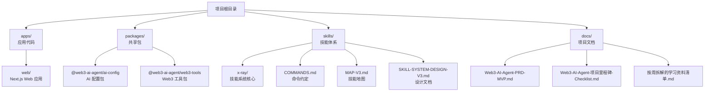
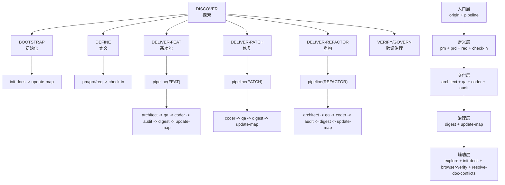
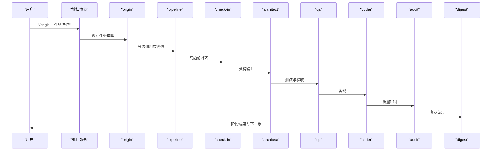
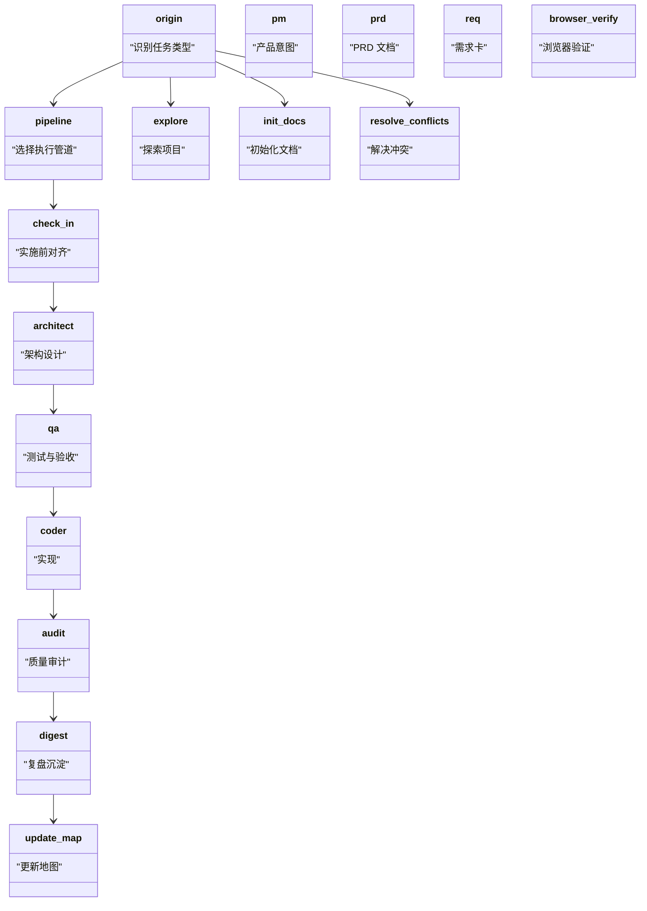
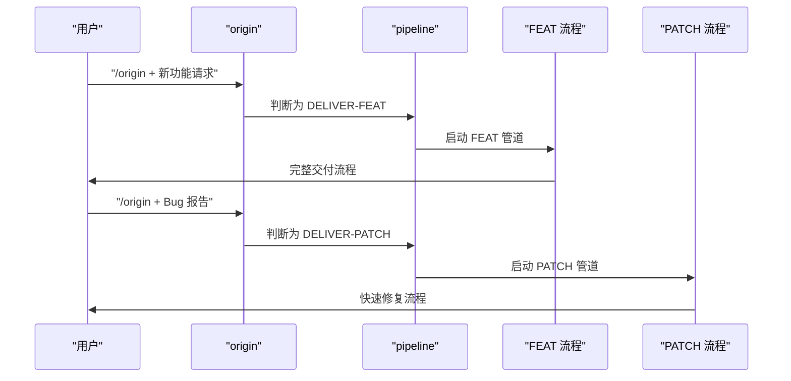
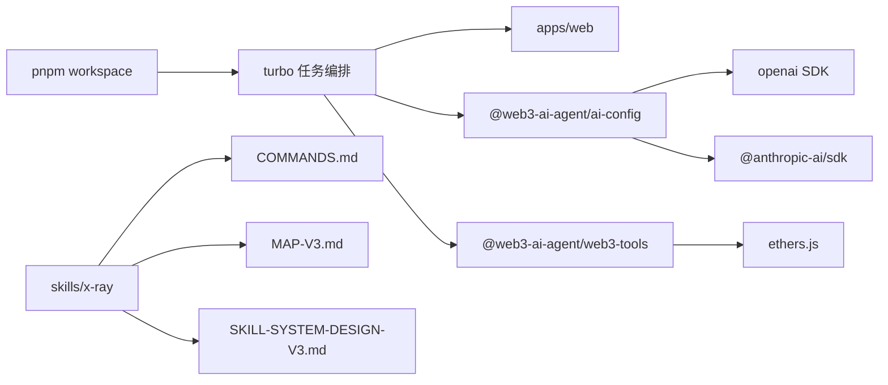

# 快速开始

<cite>
**本文引用的文件**
- [README.md](file://README.md)
- [package.json](file://package.json)
- [pnpm-workspace.yaml](file://pnpm-workspace.yaml)
- [turbo.json](file://turbo.json)
- [skills/x-ray/COMMANDS.md](file://skills/x-ray/COMMANDS.md)
- [skills/x-ray/MAP-V3.md](file://skills/x-ray/MAP-V3.md)
- [skills/x-ray/SKILL-SYSTEM-DESIGN-V3.md](file://skills/x-ray/SKILL-SYSTEM-DESIGN-V3.md)
- [packages/ai-config/package.json](file://packages/ai-config/package.json)
- [packages/web3-tools/package.json](file://packages/web3-tools/package.json)
- [docs/AI-Agent.md](file://docs/AI-Agent.md)
- [docs/WEB3-AI-AGENT-使用教程-V1.md](file://docs/WEB3-AI-AGENT-使用教程-V1.md)
- [docs/Web3-AI-Agent-PRD-MVP.md](file://docs/Web3-AI-Agent-PRD-MVP.md)
- [docs/Web3-AI-Agent-项目里程碑-Checklist.md](file://docs/Web3-AI-Agent-项目里程碑-Checklist.md)
- [docs/按周拆解的学习资料清单.md](file://docs/按周拆解的学习资料清单.md)
</cite>

## 更新摘要
**变更内容**
- 更新项目结构为新的 monorepo 架构，包含 apps/、packages/、skills/、docs/ 目录
- 新增 pnpm workspace 和 turbo monorepo 配置
- 更新技能系统为 V3 版本，包含新的任务分类和路由规则
- 重新组织技能体系结构，采用分层设计
- 更新环境配置和依赖管理方式

## 目录
1. [简介](#简介)
2. [项目结构](#项目结构)
3. [核心组件](#核心组件)
4. [架构总览](#架构总览)
5. [详细组件分析](#详细组件分析)
6. [依赖分析](#依赖分析)
7. [性能考虑](#性能考虑)
8. [故障排除指南](#故障排除指南)
9. [结论](#结论)
10. [附录](#附录)

## 简介
本快速开始指南面向希望从零起步构建与使用"Web3 AI Agent 技能系统"的初学者。你将获得：
- 环境搭建与工具链准备
- 学习路径规划（按周拆解）
- 基本使用方法与斜杠命令约定
- 实际入门示例（如何用技能系统完成简单任务）
- 常见问题与故障排除

该系统以"文档先行 + 分阶段学习 + vibe coding"为核心，通过一组流程型多 skill 串联从 PRD 到实现的完整闭环。

**更新** 项目已迁移到新的 monorepo 架构，采用 pnpm workspace 和 turbo 进行统一管理。

## 项目结构
仓库采用新的 monorepo 架构，包含四个主要目录：
- **apps/**：应用代码，目前包含 web 应用
- **packages/**：共享包，包含 ai-config 和 web3-tools
- **skills/**：技能体系，包含完整的技能系统
- **docs/**：项目文档，包含 PRD、里程碑检查表等

**图表来源**
- [README.md:26-38](file://README.md#L26-L38)
- [pnpm-workspace.yaml:1-4](file://pnpm-workspace.yaml#L1-L4)

**章节来源**
- [README.md:26-38](file://README.md#L26-L38)
- [pnpm-workspace.yaml:1-4](file://pnpm-workspace.yaml#L1-L4)

## 核心组件
- **Monorepo 管理**：使用 pnpm workspace 和 turbo 进行统一依赖管理和构建
- **技能系统 V3**：全新的七任务分类和分层设计，包含入口层、定义层、交付层、治理层和辅助层
- **命令约定**：统一的斜杠命令格式，便于在不同宿主环境中稳定调用技能
- **文档设计**：PRD、阶段执行说明、里程碑 checklist 等，确保交付物可复用、可追溯

**更新** 新的 monorepo 架构提供了更好的模块化和可维护性。

**章节来源**
- [skills/x-ray/SKILL-SYSTEM-DESIGN-V3.md:1-719](file://skills/x-ray/SKILL-SYSTEM-DESIGN-V3.md#L1-L719)
- [skills/x-ray/COMMANDS.md:1-81](file://skills/x-ray/COMMANDS.md#L1-L81)

## 架构总览
技能系统围绕七个任务类型和五个技能层次编排，每个阶段均需先经"check-in"输出"要解决的问题、需要懂的知识点、技术方案、产物、成功标准"。随后由不同的管道（FEAT/PATCH/REFACTOR）进行具体执行。

**图表来源**
- [skills/x-ray/MAP-V3.md:131-211](file://skills/x-ray/MAP-V3.md#L131-L211)
- [skills/x-ray/SKILL-SYSTEM-DESIGN-V3.md:164-220](file://skills/x-ray/SKILL-SYSTEM-DESIGN-V3.md#L164-L220)

**章节来源**
- [skills/x-ray/MAP-V3.md:131-211](file://skills/x-ray/MAP-V3.md#L131-L211)
- [skills/x-ray/SKILL-SYSTEM-DESIGN-V3.md:164-220](file://skills/x-ray/SKILL-SYSTEM-DESIGN-V3.md#L164-L220)

## 详细组件分析

### 环境搭建与安装步骤
- **环境要求**：Node.js >= 18，pnpm >= 8
- **安装依赖**：`pnpm install`
- **配置环境变量**：复制并编辑 `.env.local` 文件
- **启动开发服务器**：`pnpm dev`

**更新** 新的 monorepo 架构简化了环境搭建流程。

**章节来源**
- [README.md:40-67](file://README.md#L40-L67)
- [package.json:1-28](file://package.json#L1-L28)

### 命令约定与基本使用
- **斜杠命令格式**：统一以"/技能名 + 任务描述"作为输入约定
- **默认推荐入口**：优先使用 `/origin` 作为总入口
- **命令总表**：包含 origin、pipeline、pm、prd、req、check-in、architect、qa、coder、audit、digest、update-map、explore、init-docs、browser-verify、resolve-doc-conflicts 等命令

**图表来源**
- [skills/x-ray/COMMANDS.md:20-50](file://skills/x-ray/COMMANDS.md#L20-L50)
- [skills/x-ray/MAP-V3.md:48-129](file://skills/x-ray/MAP-V3.md#L48-L129)

**章节来源**
- [skills/x-ray/COMMANDS.md:1-81](file://skills/x-ray/COMMANDS.md#L1-L81)
- [skills/x-ray/MAP-V3.md:48-129](file://skills/x-ray/MAP-V3.md#L48-L129)

### 学习路径规划（按周拆解）
- **第 1 周**：LLM API、Chat 与 Function Calling，建立最小 Agent 闭环
- **第 2 周**：Agent Loop、Prompt 设计与 Web3 工具接入
- **第 3 周**：Memory、RAG 入门与产品边界
- **第 4 周**：工程化、部署与项目表达

**更新** 学习路径与技能系统 V3 相结合，提供更清晰的学习路线。

**章节来源**
- [docs/按周拆解的学习资料清单.md](file://docs/按周拆解的学习资料清单.md)

### 技能系统设计与职责边界
- **七任务分类**：DISCOVER、BOOTSTRAP、DEFINE、DELIVER-FEAT、DELIVER-PATCH、DELIVER-REFACTOR、VERIFY/GOVERN
- **五层技能结构**：入口层、定义层、交付层、治理层、辅助层
- **check-in 强制**：实施前对齐点，确保任务边界清晰

**图表来源**
- [skills/x-ray/SKILL-SYSTEM-DESIGN-V3.md:439-601](file://skills/x-ray/SKILL-SYSTEM-DESIGN-V3.md#L439-L601)

**章节来源**
- [skills/x-ray/SKILL-SYSTEM-DESIGN-V3.md:439-601](file://skills/x-ray/SKILL-SYSTEM-DESIGN-V3.md#L439-L601)

### 入门示例：使用技能系统完成简单任务
- **新功能开发**：`/origin` -> `/pipeline feat` -> 完整 FEAT 流程
- **Bug 修复**：`/origin` -> `/pipeline patch` -> 完整 PATCH 流程  
- **项目探索**：`/explore` 获取项目概览，`/init-docs` 初始化文档
- **文档治理**：`/resolve-doc-conflicts` 解决文档冲突

**图表来源**
- [skills/x-ray/MAP-V3.md:147-176](file://skills/x-ray/MAP-V3.md#L147-L176)
- [skills/x-ray/MAP-V3.md:177-201](file://skills/x-ray/MAP-V3.md#L177-L201)

**章节来源**
- [skills/x-ray/MAP-V3.md:147-176](file://skills/x-ray/MAP-V3.md#L147-L176)
- [skills/x-ray/MAP-V3.md:177-201](file://skills/x-ray/MAP-V3.md#L177-L201)

## 依赖分析
- **Monorepo 依赖**：pnpm workspace 管理工作空间，turbo 进行任务编排
- **技能耦合**：通过"输入/输出契约"与"任务类型"耦合，避免循环依赖
- **外部依赖**：OpenAI API、Anthropic SDK、ethers.js 等
- **内部包依赖**：@web3-ai-agent/ai-config 和 @web3-ai-agent/web3-tools

**图表来源**
- [package.json:23-26](file://package.json#L23-L26)
- [turbo.json:1-21](file://turbo.json#L1-L21)
- [packages/ai-config/package.json:13-21](file://packages/ai-config/package.json#L13-L21)
- [packages/web3-tools/package.json:13-21](file://packages/web3-tools/package.json#L13-L21)

**章节来源**
- [package.json:23-26](file://package.json#L23-L26)
- [turbo.json:1-21](file://turbo.json#L1-L21)
- [packages/ai-config/package.json:13-21](file://packages/ai-config/package.json#L13-L21)
- [packages/web3-tools/package.json:13-21](file://packages/web3-tools/package.json#L13-L21)

## 性能考虑
- **Monorepo 优势**：统一依赖管理，减少重复安装
- **Turbo 缓存**：持久化缓存提高构建速度
- **按需加载**：V3 技能系统按需进入，避免不必要的流程
- **任务分流**：不同任务类型走不同管道，提高执行效率

**更新** 新的 monorepo 架构和 V3 技能系统显著提升了开发效率。

## 故障排除指南
- **环境搭建问题**：确认 Node.js >= 18，pnpm >= 8
- **依赖安装失败**：清理 node_modules 和 pnpm-store 后重新安装
- **技能执行异常**：检查是否通过 check-in 输出了强制要求的内容
- **文档冲突**：使用 `/resolve-doc-conflicts` 解决多源文档冲突
- **项目探索**：使用 `/explore` 获取当前模块与能力概览

**更新** 新架构下的故障排除更加精准，针对 monorepo 和 V3 技能系统的特点提供专门指导。

**章节来源**
- [README.md:42-67](file://README.md#L42-L67)
- [skills/x-ray/COMMANDS.md:14-19](file://skills/x-ray/COMMANDS.md#L14-L19)
- [skills/x-ray/MAP-V3.md:203-211](file://skills/x-ray/MAP-V3.md#L203-L211)

## 结论
通过新的 monorepo 架构和 V3 技能系统，你可以以更高效的方式建立可复用的知识地图与工程成果。建议从 `/origin` 入口开始，结合按周拆解的学习资料清单，按任务类型推进相应的技能流程，逐步完成从概念到可展示产品的全过程。

**更新** 新的架构提供了更好的可维护性和扩展性，适合长期项目发展。

## 附录
- **环境与工具准备**
  - 编辑器：支持 Markdown 与斜杠命令的编辑器或 IDE 插件
  - 宿主产品：支持斜杠命令弹窗的聊天/协作平台
  - Web3 工具链：RPC、SDK、钱包与链上数据查询工具
  - 部署平台：Vercel、Netlify 或自建服务器
- **常用命令清单**
  - `/origin`、`/pipeline feat`、`/pipeline patch`、`/pipeline refactor`、`/pm`、`/prd`、`/req`、`/check-in`、`/architect`、`/qa`、`/coder`、`/audit`、`/digest`、`/update-map`、`/explore`、`/init-docs`、`/browser-verify`、`/resolve-doc-conflicts`
- **Monorepo 管理**
  - `pnpm install`：安装所有依赖
  - `pnpm dev`：启动开发服务器
  - `pnpm build`：构建所有包
  - `pnpm lint`：运行代码检查

**更新** 新增 monorepo 管理相关命令和工具准备建议。

**章节来源**
- [skills/x-ray/COMMANDS.md:29-50](file://skills/x-ray/COMMANDS.md#L29-L50)
- [README.md:78-88](file://README.md#L78-L88)
- [package.json:6-12](file://package.json#L6-L12)