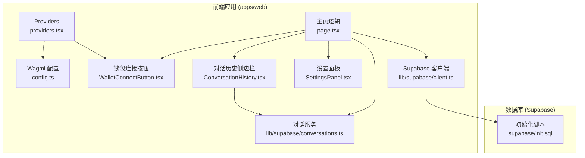
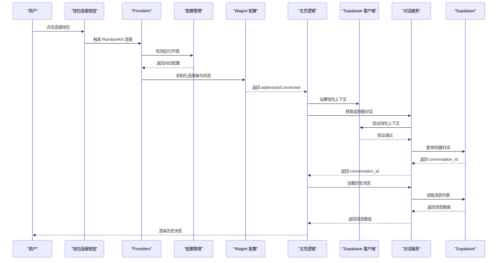
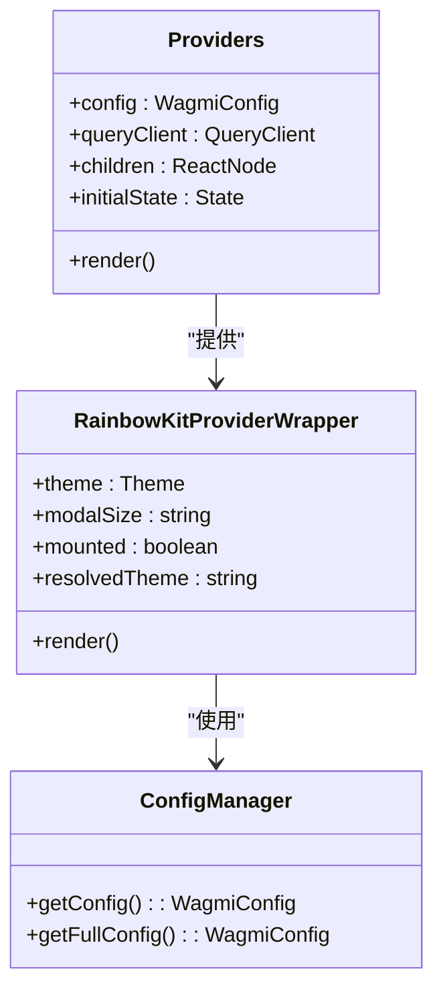
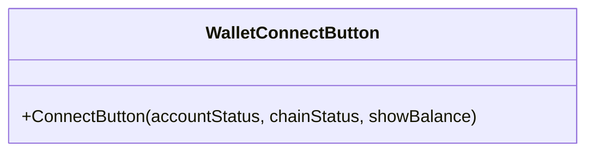
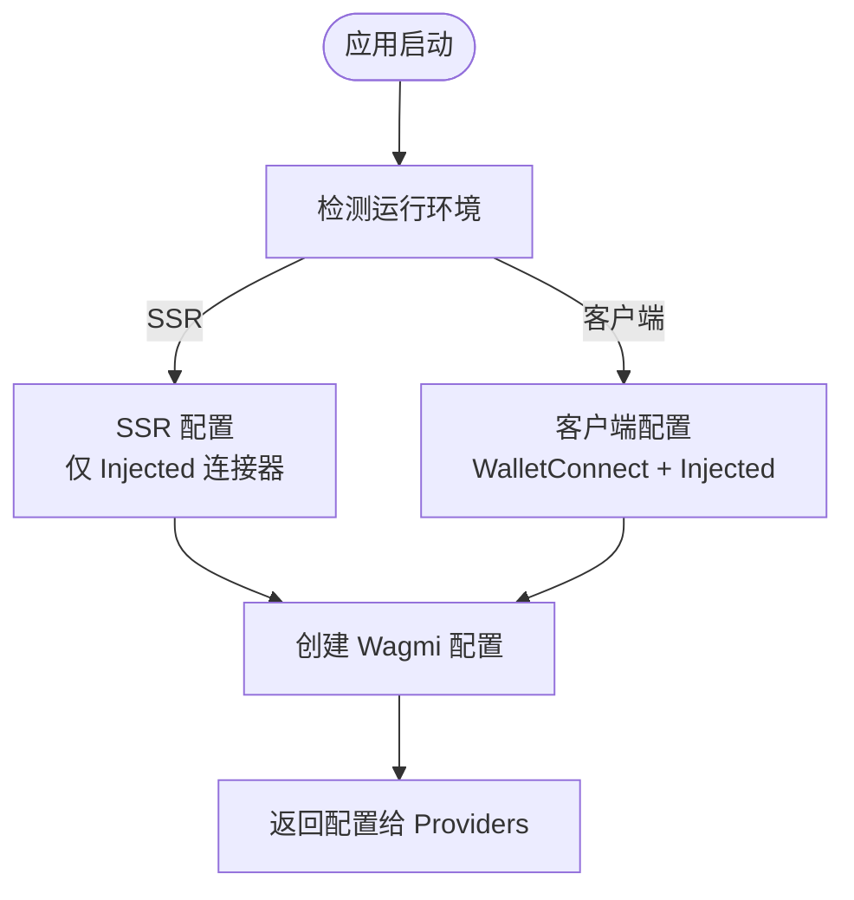
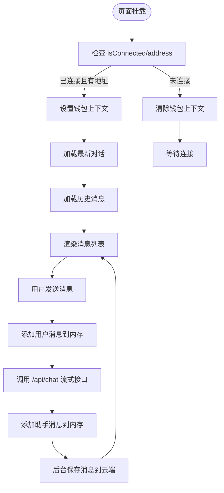
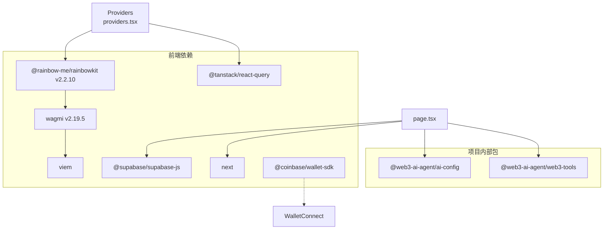

# 钱包登录配置指南

<cite>
**本文档引用的文件**
- [WALLET-LOGIN-SETUP.md](file://WALLET-LOGIN-SETUP.md)
- [WalletConnectButton.tsx](file://apps/web/components/WalletConnectButton.tsx)
- [providers.tsx](file://apps/web/app/providers.tsx)
- [config.ts](file://apps/web/app/config.ts)
- [client.ts](file://apps/web/lib/supabase/client.ts)
- [conversations.ts](file://apps/web/lib/supabase/conversations.ts)
- [page.tsx](file://apps/web/app/page.tsx)
- [ConversationHistory.tsx](file://apps/web/components/ConversationHistory.tsx)
- [SettingsPanel.tsx](file://apps/web/components/SettingsPanel.tsx)
- [init.sql](file://supabase/init.sql)
- [package.json](file://apps/web/package.json)
- [QUICKSTART.md](file://apps/web/QUICKSTART.md)
</cite>

## 更新摘要
**变更内容**
- 从简单的直接连接器导入转变为完整的 RainbowKit 集成，包括主题配置和双配置模式
- 新增双配置模式（SSR 和客户端）的详细说明，解释 SSR 阶段的限制和客户端的完整功能
- 新增 @coinbase/wallet-sdk 依赖的说明，虽然当前代码未直接使用但已集成到依赖管理中
- 更新钱包连接器配置，从单一连接器扩展为包含 WalletConnect 和 Injected 的完整配置
- 新增钱包分类系统（推荐钱包和其他钱包）的配置说明，基于 RainbowKit 的默认分类机制

## 目录
1. [简介](#简介)
2. [项目结构概览](#项目结构概览)
3. [核心组件分析](#核心组件分析)
4. [架构总览](#架构总览)
5. [详细组件分析](#详细组件分析)
6. [依赖关系分析](#依赖关系分析)
7. [性能考虑](#性能考虑)
8. [故障排除指南](#故障排除指南)
9. [结论](#结论)

## 简介
本指南面向希望在 Web3 AI Agent 项目中集成钱包登录与对话历史持久化的开发者。文档基于现有代码实现，提供从环境准备、配置部署到功能验证的完整流程说明，并深入解析 RainbowKit + Wagmi 的完整集成方案、双配置模式的实现原理、钱包连接器的配置策略以及 @coinbase/wallet-sdk 依赖的管理方式。

**更新** 项目现已完全迁移到 RainbowKit 集成，采用双配置模式（SSR 和客户端）来解决 SSR 兼容性问题，同时新增 @coinbase/wallet-sdk 依赖以支持更广泛的钱包生态。

## 项目结构概览
项目采用 Next.js 14 App Router 架构，前端应用位于 apps/web，核心功能围绕 RainbowKit + Wagmi 的完整集成、云端存储（Supabase）与对话记忆管理展开。钱包登录配置的关键文件分布如下：



**图表来源**
- [providers.tsx:1-76](file://apps/web/app/providers.tsx#L1-L76)
- [config.ts:1-62](file://apps/web/app/config.ts#L1-L62)
- [WalletConnectButton.tsx:1-17](file://apps/web/components/WalletConnectButton.tsx#L1-L17)
- [page.tsx:1-376](file://apps/web/app/page.tsx#L1-L376)
- [ConversationHistory.tsx:1-257](file://apps/web/components/ConversationHistory.tsx#L1-L257)
- [SettingsPanel.tsx:1-192](file://apps/web/components/SettingsPanel.tsx#L1-L192)
- [client.ts:1-54](file://apps/web/lib/supabase/client.ts#L1-L54)
- [conversations.ts:1-260](file://apps/web/lib/supabase/conversations.ts#L1-L260)
- [init.sql:1-103](file://supabase/init.sql#L1-L103)

**章节来源**
- [providers.tsx:1-76](file://apps/web/app/providers.tsx#L1-L76)
- [config.ts:1-62](file://apps/web/app/config.ts#L1-L62)
- [page.tsx:1-376](file://apps/web/app/page.tsx#L1-L376)

## 核心组件分析
本节聚焦 RainbowKit + Wagmi 的完整集成实现要点，包括双配置模式、钱包连接器配置、主题管理和云端存储策略。

**更新** 新增双配置模式和 RainbowKit 主题配置的详细说明。

- **RainbowKit 完整集成**
  - 使用 RainbowKit Provider 包裹应用，启用 wagmi 状态管理与 react-query 缓存。
  - 实现双配置模式：SSR 阶段仅使用 Injected 连接器，客户端阶段添加 WalletConnect。
  - 配置主题系统：支持明暗主题自动切换，SSR 阶段强制使用暗色主题。

- **双配置模式详解**
  - SSR 配置：仅包含 Injected 连接器，避免 IndexedDB 访问问题。
  - 客户端配置：包含 WalletConnect 和 Injected 连接器，提供完整的钱包连接体验。
  - 环境检测：通过 `typeof window === 'undefined'` 判断当前运行环境。

- **钱包连接器配置**
  - Injected 连接器：支持浏览器内置钱包（如 MetaMask、Coinbase Wallet）。
  - WalletConnect 连接器：支持 QR 码扫描连接，兼容多平台钱包。
  - 连接器元数据：配置应用名称、描述、URL 和图标信息。

- **云端存储与数据隔离**
  - Supabase 客户端通过环境变量初始化，提供钱包上下文管理接口。
  - 数据库通过 RLS 策略按 wallet_address 隔离用户数据，确保不同钱包地址无法访问彼此的历史记录。

- **对话历史管理**
  - 首次连接自动获取或创建最新对话；后续消息自动保存至云端。
  - 侧边栏支持新建、选择、删除对话，实时更新标题与消息计数。

**章节来源**
- [providers.tsx:11-42](file://apps/web/app/providers.tsx#L11-L42)
- [providers.tsx:45-76](file://apps/web/app/providers.tsx#L45-L76)
- [config.ts:8-26](file://apps/web/app/config.ts#L8-L26)
- [config.ts:29-61](file://apps/web/app/config.ts#L29-L61)
- [client.ts:24-53](file://apps/web/lib/supabase/client.ts#L24-L53)
- [conversations.ts:11-23](file://apps/web/lib/supabase/conversations.ts#L11-L23)
- [init.sql:31-97](file://supabase/init.sql#L31-L97)
- [page.tsx:64-84](file://apps/web/app/page.tsx#L64-L84)
- [ConversationHistory.tsx:29-37](file://apps/web/components/ConversationHistory.tsx#L29-L37)

## 架构总览
下图展示了 RainbowKit + Wagmi 完整集成的端到端流程：从双配置模式的初始化到云端数据读写，再到 UI 展示与交互。



**图表来源**
- [WalletConnectButton.tsx:5-16](file://apps/web/components/WalletConnectButton.tsx#L5-L16)
- [providers.tsx:18-19](file://apps/web/app/providers.tsx#L18-L19)
- [config.ts:29-61](file://apps/web/app/config.ts#L29-L61)
- [page.tsx:64-84](file://apps/web/app/page.tsx#L64-L84)
- [client.ts:31-46](file://apps/web/lib/supabase/client.ts#L31-L46)
- [conversations.ts:15-31](file://apps/web/lib/supabase/conversations.ts#L15-L31)
- [conversations.ts:119-143](file://apps/web/lib/supabase/conversations.ts#L119-L143)

## 详细组件分析

### RainbowKit Providers 组件分析
Providers 组件负责 RainbowKit + Wagmi 的完整集成，包括双配置模式、主题管理和 SSR 兼容性处理。



**图表来源**
- [providers.tsx:11-42](file://apps/web/app/providers.tsx#L11-L42)
- [providers.tsx:45-76](file://apps/web/app/providers.tsx#L45-L76)
- [config.ts:8-26](file://apps/web/app/config.ts#L8-L26)
- [config.ts:29-61](file://apps/web/app/config.ts#L29-L61)

**章节来源**
- [providers.tsx:1-76](file://apps/web/app/providers.tsx#L1-L76)

### 钱包连接组件分析
WalletConnectButton 使用 RainbowKit 的 ConnectButton，配置账户状态显示与链状态图标，确保在桌面与移动端呈现一致的连接体验。



**图表来源**
- [WalletConnectButton.tsx:5-16](file://apps/web/components/WalletConnectButton.tsx#L5-L16)

**章节来源**
- [WalletConnectButton.tsx:1-17](file://apps/web/components/WalletConnectButton.tsx#L1-L17)

### 双配置模式与连接器管理
配置管理模块实现了双配置模式，根据运行环境动态选择连接器集合。



**图表来源**
- [config.ts:29-61](file://apps/web/app/config.ts#L29-L61)

**章节来源**
- [config.ts:1-62](file://apps/web/app/config.ts#L1-L62)

### 页面逻辑与对话历史
页面逻辑负责：
- 监听钱包连接状态，连接成功后加载最新对话与历史消息。
- 新消息发送后，自动保存至云端并更新 UI。
- 支持新建对话、选择对话与删除对话。

**更新** 新增双配置模式和 RainbowKit 集成的详细说明。



**图表来源**
- [page.tsx:64-84](file://apps/web/app/page.tsx#L64-L84)
- [page.tsx:177-268](file://apps/web/app/page.tsx#L177-L268)
- [useChatStream.ts:167-252](file://apps/web/hooks/useChatStream.ts#L167-L252)

**章节来源**
- [page.tsx:19-376](file://apps/web/app/page.tsx#L19-L376)

### 对话历史侧边栏
侧边栏组件负责：
- 监听钱包连接状态，加载对话列表。
- 支持新建、选择、删除对话，实时响应标题更新事件。
- 格式化时间显示与移动端交互。

**更新** 新增 RainbowKit 集成和双配置模式的详细说明。

```mermaid
classDiagram
class ConversationHistory {
+activeConversationId : string
+onSelectConversation(id, messages)
+onNewConversation()
+loadConversations(address)
+handleSelect(id)
+handleDelete(id, e)
+formatTime(dateStr)
}
``**图表来源**
- [ConversationHistory.tsx : 14-95](file : //apps/web/components/ConversationHistory.tsx#L14-L95)
**章节来源**
- [ConversationHistory.tsx : 1-257](file : //apps/web/components/ConversationHistory.tsx#L1-L257)
### Supabase 客户端与对话服务
Supabase 客户端与对话服务提供：
- 客户端初始化与上下文设置接口当前为客户端警告实现。
- 对话的创建、查询、标题更新与删除。
- 消息的批量插入与按对话加载。
**更新** 新增钱包上下文验证机制的详细说明。
```mermaid
classDiagram
class SupabaseClient {
+supabaseUrl : string
+supabaseAnonKey : string
+setWalletContext(walletAddress)
+getWalletContext() : string | null
+clearWalletContext()
}
class ConversationsService {
+getOrCreateConversation(walletAddress)
+createNewConversation(walletAddress, title?)
+generateConversationTitle(message)
+saveMessages(conversationId, messages)
+loadMessages(conversationId)
+getConversations(walletAddress)
+updateConversationTitle(conversationId, title)
+deleteConversation(conversationId, walletAddress)
}
SupabaseClient <.. ConversationsService : "使用"
```

**图表来源**
- [client.ts:15-53](file://apps/web/lib/supabase/client.ts#L15-L53)
- [conversations.ts:14-45](file://apps/web/lib/supabase/conversations.ts#L14-L45)
- [conversations.ts:94-143](file://apps/web/lib/supabase/conversations.ts#L94-L143)
- [conversations.ts:148-218](file://apps/web/lib/supabase/conversations.ts#L148-L218)

**章节来源**
- [client.ts:1-54](file://apps/web/lib/supabase/client.ts#L1-L54)
- [conversations.ts:1-260](file://apps/web/lib/supabase/conversations.ts#L1-L260)

## 依赖关系分析
钱包登录与对话历史持久化涉及的关键依赖与版本关系如下：



**图表来源**
- [package.json:14-35](file://apps/web/package.json#L14-L35)
- [providers.tsx:3-6](file://apps/web/app/providers.tsx#L3-L6)
- [page.tsx:15](file://apps/web/app/page.tsx#L15)

**章节来源**
- [package.json:1-54](file://apps/web/package.json#L1-L54)

## 性能考虑
- **双配置模式优化**：通过环境检测避免不必要的连接器初始化，减少客户端包体积。
- **缓存策略**：React Query 默认 staleTime 与 gcTime 已配置，减少重复请求与内存占用。
- **流式传输**：聊天消息通过 SSE 流式接收，结合节流更新降低 UI 抖动。
- **云端降级**：当前实现中存在降级到本地存储的 TODO，建议在网络异常时提供本地缓存与重试机制。
- **数据库优化**：初始化脚本包含必要索引，RLS 策略确保数据隔离，避免全表扫描。
- **主题预渲染**：SSR 阶段强制使用暗色主题，避免主题闪烁问题。

## 故障排除指南
- **环境变量缺失**
  - 现象：Supabase 客户端初始化抛出错误。
  - 处理：确认 .env.local 中包含 NEXT_PUBLIC_SUPABASE_URL 与 NEXT_PUBLIC_SUPABASE_ANON_KEY。
  - 参考：[client.ts:8-10](file://apps/web/lib/supabase/client.ts#L8-L10)

- **RainbowKit 连接失败**
  - 现象：RainbowKit 无法连接或显示异常。
  - 处理：检查 NEXT_PUBLIC_WALLETCONNECT_PROJECT_ID 是否正确；确认客户端配置包含 walletConnect。
  - 参考：[config.ts:6](file://apps/web/app/config.ts#L6), [config.ts:40-49](file://apps/web/app/config.ts#L40-L49)

- **IndexedDB 访问错误**
  - 现象：SSR 阶段出现 `indexedDB is not defined` 错误。
  - 处理：确认使用双配置模式，SSR 阶段仅使用 Injected 连接器。
  - 参考：[config.ts:13-15](file://apps/web/app/config.ts#L13-L15), [QUICKSTART.md:25-29](file://apps/web/QUICKSTART.md#L25-L29)

- **钱包连接状态不持久**
  - 现象：页面刷新后钱包连接状态丢失。
  - 处理：确认使用 cookieStorage 进行状态持久化，检查 SSR 配置。
  - 参考：[config.ts:17-19](file://apps/web/app/config.ts#L17-L19), [config.ts:52-54](file://apps/web/app/config.ts#L52-L54)

- **对话历史无法加载**
  - 现象：连接钱包后无历史消息。
  - 处理：确认 Supabase 初始化脚本已执行；检查 RLS 策略是否生效。
  - 参考：[init.sql:31-97](file://supabase/init.sql#L31-L97), [page.tsx:74-105](file://apps/web/app/page.tsx#L74-L105)

- **云端保存失败**
  - 现象：消息发送后未持久化。
  - 处理：检查 saveMessages 调用与网络状态；关注控制台错误日志。
  - 参考：[page.tsx:108-117](file://apps/web/app/page.tsx#L108-L117), [conversations.ts:94-114](file://apps/web/lib/supabase/conversations.ts#L94-L114)

**章节来源**
- [client.ts:8-10](file://apps/web/lib/supabase/client.ts#L8-L10)
- [config.ts:6](file://apps/web/app/config.ts#L6)
- [config.ts:13-15](file://apps/web/app/config.ts#L13-L15)
- [config.ts:40-49](file://apps/web/app/config.ts#L40-L49)
- [config.ts:17-19](file://apps/web/app/config.ts#L17-L19)
- [config.ts:52-54](file://apps/web/app/config.ts#L52-L54)
- [init.sql:31-97](file://supabase/init.sql#L31-L97)
- [page.tsx:74-105](file://apps/web/app/page.tsx#L74-L105)
- [page.tsx:108-117](file://apps/web/app/page.tsx#L108-L117)
- [conversations.ts:94-114](file://apps/web/lib/supabase/conversations.ts#L94-L114)
- [QUICKSTART.md:25-29](file://apps/web/QUICKSTART.md#L25-L29)

## 结论
本指南基于现有代码实现了 RainbowKit + Wagmi 的完整集成配置路径。通过双配置模式（SSR 和客户端）解决了 SSR 兼容性问题，通过 WalletConnect 和 Injected 连接器提供了完整的钱包连接体验，通过 Supabase 的云端存储与 RLS 数据隔离，以及 React Query 的状态管理，系统在保证安全性的同时提供了良好的用户体验。

**更新** 新增的 RainbowKit 集成显著提升了钱包连接的用户体验，双配置模式确保了 SSR 兼容性和性能优化，@coinbase/wallet-sdk 依赖的集成为未来的钱包生态扩展奠定了基础。建议后续完善钱包分类系统的自定义配置和错误处理机制，以提升生产环境的稳定性和可用性。

### RainbowKit 集成最佳实践

1. **双配置模式使用**
   - 在 SSR 阶段仅使用 Injected 连接器，避免 IndexedDB 访问问题
   - 在客户端阶段添加 WalletConnect 连接器，提供完整的连接体验
   - 通过环境检测动态选择配置，确保运行时的正确性

2. **主题系统配置**
   - SSR 阶段强制使用暗色主题，避免主题闪烁
   - 客户端阶段根据系统主题自动切换明暗模式
   - 配置统一的主题参数，确保视觉一致性

3. **连接器元数据管理**
   - 正确配置应用名称、描述、URL 和图标
   - 确保元数据在 WalletConnect 二维码中正确显示
   - 定期更新元数据以保持信息准确性

4. **性能优化建议**
   - 使用 cookieStorage 进行状态持久化，支持 SSR 传递
   - 配置合理的缓存策略，减少重复请求
   - 优化钱包连接器的初始化顺序，提升加载速度

5. **错误处理与监控**
   - 实现连接器初始化失败的降级策略
   - 添加详细的错误日志和用户反馈
   - 监控钱包连接成功率和用户行为数据