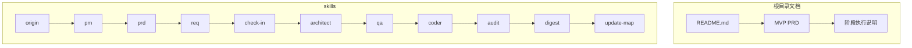

# 项目介绍

## 简介

帮助 Web3 前端工程师从传统前端转向 AI Agent 工程实践。以"文档驱动开发"为核心，构建面向 Web3 场景的多技能自治开发体系。

**核心价值**：
- 提供"从文档到 Agent 实现"的可落地路径
- 技能系统串联 PRD → 需求 → 架构 → 测试 → 实现 → 审计 → 沉淀，形成闭环
- 内置 Web3 专用约束，强调数据来源、风险提示与链上实时数据

**目标受众**：Web3 前端工程师（转型 Agent 方向）、Agent 开发学习者、需要可复用方法论的团队

## 项目结构

四层结构：根目录文档 + skills 目录 + 检查表系统 + 测试基础设施

## 核心组件

| 组件 | 职责 |
|------|------|
| origin | 统一入口，识别任务类型并路由 |
| pipeline | 按任务类型（FEAT/PATCH/REFACTOR）选择执行深度 |
| check-in | 实施前对齐：问题、方案、完成标准 |
| pm/req/prd | 从用户价值出发，形成可执行需求卡片 |
| architect | 定义模块边界、接口契约 |
| qa | 验证策略（RED 优先） |
| coder | 实现代码，最多 10 轮自愈 |
| audit | 检查高风险问题 |
| digest | 阶段复盘与知识沉淀 |

## 任务路由

| 类型 | 链路 |
|------|------|
| FEAT | pm → prd → req → check-in → architect → qa → coder → audit → digest |
| PATCH | req → check-in → coder → qa → digest（短链路） |
| REFACTOR | req → check-in → architect → qa → coder → audit → digest（中等链路） |

**硬规则**：未完成 check-in 不得进入 architect/qa/coder。

## Web3 专属约束

- Agent 核心：LLM + 工具 + 循环 + 记忆
- 数据来源必须标明，链上数据与价格数据明确区分
- 不伪造链上实时数据，不提供确定性投资建议
- MVP 禁止扩展到自动交易与复杂多链

## 测试基础设施

- 框架：Vitest v3.2.4（monorepo workspace）
- 覆盖：31 个测试文件，238 个测试用例，通过率 100%
- 分布：apps/web（130）、packages/ai-config（34）、packages/web3-tools（74）

## 关键指标

| 指标 | 当前 | 目标 |
|------|------|------|
| MVP 完成率 | 75% | 100% |
| 测试通过率 | 100% | 100% |
| 文档完整度 | 85% | 90% |
| Audit 平均分 | 97 | 90+ |
