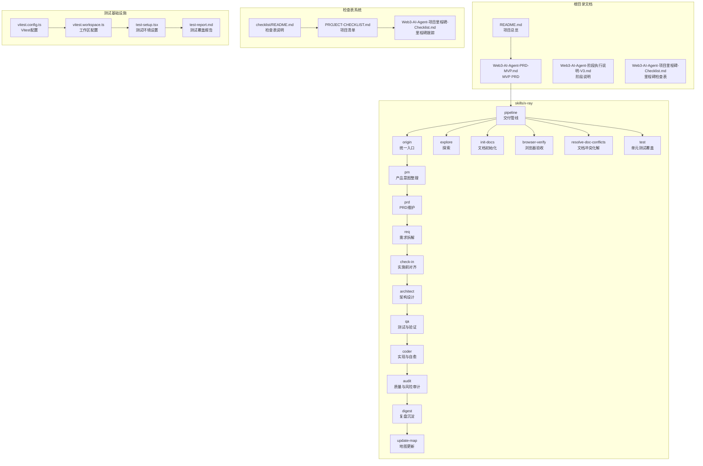
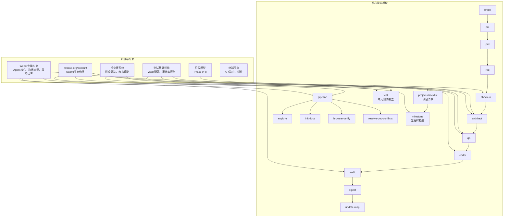
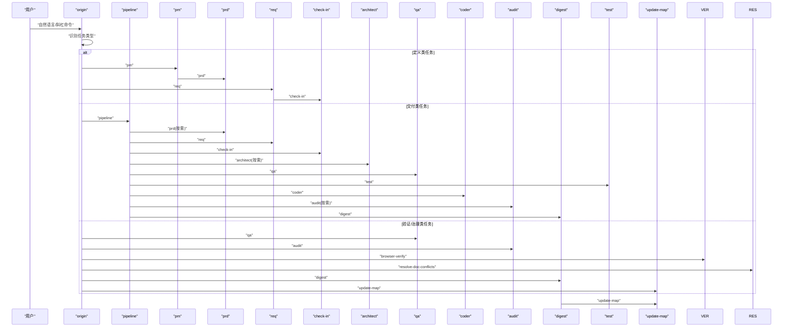
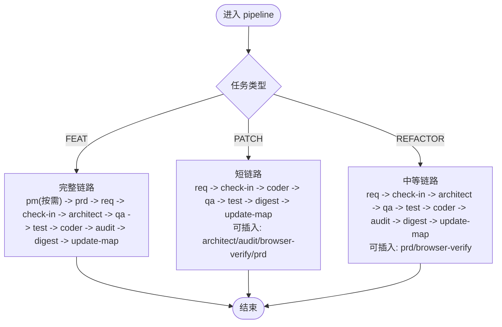
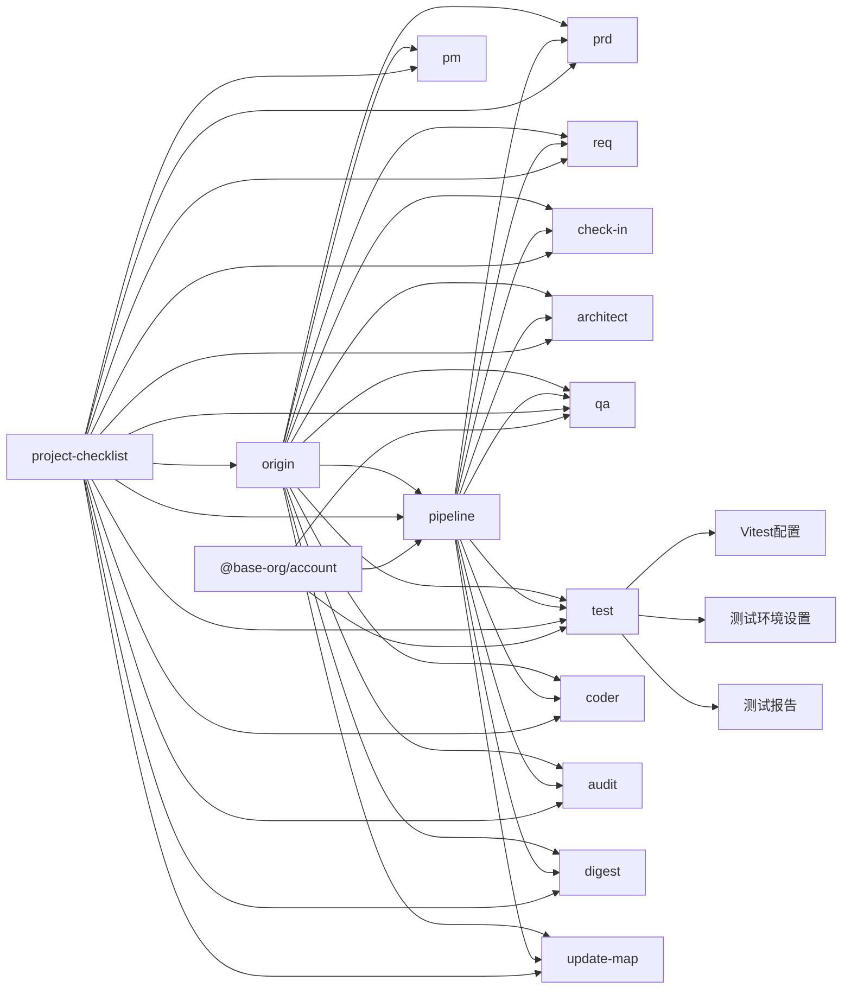

# 项目概述

<cite>
**本文引用的文件**
- [README.md](file://README.md)
- [PROJECT-CHECKLIST.md](file://docs/checklist/PROJECT-CHECKLIST.md)
- [README.md](file://docs/checklist/README.md)
- [Web3-AI-Agent-项目里程碑-Checklist.md](file://docs/Web3-AI-Agent-项目里程碑-Checklist.md)
- [SKILL-SYSTEM-DESIGN-V3.md](file://skills/x-ray/SKILL-SYSTEM-DESIGN-V3.md)
- [origin/SKILL.md](file://skills/x-ray/origin/SKILL.md)
- [pipeline/SKILL.md](file://skills/x-ray/pipeline/SKILL.md)
- [vitest.config.ts](file://apps/web/vitest.config.ts)
- [vitest.workspace.ts](file://vitest.workspace.ts)
- [test-report.md](file://docs/test-report.md)
- [test-setup.tsx](file://apps/web/test-setup.tsx)
- [vitest.config.ts](file://packages/ai-config/vitest.config.ts)
- [vitest.config.ts](file://packages/web3-tools/vitest.config.ts)
- [package.json](file://apps/web/package.json)
- [package.json](file://package.json)
- [pnpm-lock.yaml](file://pnpm-lock.yaml)
- [turbo.json](file://turbo.json)
</cite>

## 更新摘要
**所做更改**
- 新增完整的单元测试基础设施章节，详细介绍 Vitest 配置、测试报告和测试最佳实践
- 更新技能系统架构，包含新增的测试覆盖技能
- 增强项目质量保障体系说明，突出测试驱动的质量控制
- 完善测试覆盖报告和测试经验总结
- **更新** 添加 @base-org/account 依赖以修复 wagmi 生态系统模块解析错误

## 目录
1. [简介](#简介)
2. [项目结构](#项目结构)
3. [核心组件](#核心组件)
4. [架构总览](#架构总览)
5. [详细组件分析](#详细组件分析)
6. [项目检查表系统](#项目检查表系统)
7. [单元测试基础设施](#单元测试基础设施)
8. [依赖分析](#依赖分析)
9. [性能考量](#性能考量)
10. [故障排查指南](#故障排查指南)
11. [结论](#结论)
12. [附录](#附录)

## 简介
本项目旨在帮助Web3前端工程师实现职业转型，从传统前端开发转向AI Agent工程实践。项目以"文档驱动开发"为核心理念，构建了一套面向Web3场景的多技能（Skill）自治开发体系，通过标准化流程、阶段性门禁与约束，确保在进入编码前完成需求、架构、测试与风险评估，从而降低试错成本、提升交付质量。

**项目背景与目标**：
- 背景：AI对前端岗位带来冲击，需要拥抱新方向以延长职业生命周期
- 目标：打造可运行的Web3 AI Agent MVP，覆盖"对话+工具调用+Agent循环+最小记忆"，并沉淀一套可复用的开发方法论

**价值主张**：
- 为Web3前端工程师提供一条"从文档到Agent实现"的可落地路径
- 以技能系统串联PRD、需求、架构、测试、实现、审计与沉淀，形成闭环
- **新增**：集成项目检查表系统，提供结构化进度跟踪和未来规划能力
- **新增**：建立完整的单元测试基础设施，确保代码质量和可维护性
- **更新**：内置Web3专用约束，强调数据来源、风险提示与不可伪造链上实时数据
- **更新**：修复 wagmi 生态系统模块解析错误，提升Web3工具链稳定性

**目标受众**：
- Web3前端工程师（希望转型Agent工程师）
- 希望以项目驱动学习Agent开发的学习者
- 需要建立可复用Agent开发方法论的团队或个人

**为什么需要转向AI Agent开发**：
- 市场趋势：AI成为新一轮生产力工具，Agent是面向未来的交互范式
- 技能迁移：前端工程化的流程化思维、对用户体验与交互的敏感度，可迁移到Agent工程中
- 职业发展：Agent工程能力是未来跨领域协作与产品创新的关键抓手

**项目的独特性**：
- 文档驱动开发：以PRD、阶段说明、模板与地图为先，再进入vibe coding
- 技能系统架构：12个核心技能模块按阶段有序串联，形成可自治的流水线
- **增强**：项目检查表系统提供结构化进度跟踪和未来规划能力
- **新增**：完整的单元测试基础设施，确保代码质量与可维护性
- **更新**：Web3专用约束：Agent核心为"LLM + 工具 + 循环 + 记忆"，强调数据来源与风险边界
- **更新**：稳定的Web3生态依赖：通过 @base-org/account 修复 wagmi 生态模块解析问题

## 项目结构
项目采用"根目录文档 + skills目录 + 检查表系统 + 测试基础设施"的四层结构：
- 根目录文档：学习计划、里程碑、PRD与阶段说明，确保学习与开发路径清晰
- skills目录：以"流程型多技能"组织，每个技能独立文档，职责边界清晰，便于自治与复用
- **新增**：检查表系统：提供项目状态可视化、进度跟踪和未来规划的结构化框架
- **新增**：测试基础设施：建立完整的单元测试体系，覆盖所有核心模块与业务逻辑

**图表来源**
- [README.md:26-38](file://README.md#L26-L38)
- [SKILL-SYSTEM-DESIGN-V3.md:164-220](file://skills/x-ray/SKILL-SYSTEM-DESIGN-V3.md#L164-L220)
- [PROJECT-CHECKLIST.md:1-373](file://docs/checklist/PROJECT-CHECKLIST.md#L1-L373)
- [vitest.config.ts:1-23](file://apps/web/vitest.config.ts#L1-L23)
- [vitest.workspace.ts:1-8](file://vitest.workspace.ts#L1-L8)
- [test-report.md:1-326](file://docs/test-report.md#L1-L326)

**章节来源**
- [README.md:26-38](file://README.md#L26-L38)
- [SKILL-SYSTEM-DESIGN-V3.md:164-220](file://skills/x-ray/SKILL-SYSTEM-DESIGN-V3.md#L164-L220)
- [PROJECT-CHECKLIST.md:1-373](file://docs/checklist/PROJECT-CHECKLIST.md#L1-L373)
- [vitest.config.ts:1-23](file://apps/web/vitest.config.ts#L1-L23)
- [vitest.workspace.ts:1-8](file://vitest.workspace.ts#L1-L8)
- [test-report.md:1-326](file://docs/test-report.md#L1-L326)

## 核心组件
- **统一入口（origin）**：统一接收外部请求，识别任务类型并路由至对应技能或管线
- **交付管线（pipeline）**：根据任务类型（FEAT/PATCH/REFACTOR）选择执行深度，串联必要技能
- **实施前对齐（check-in）**：每进入一个实施阶段，必须先输出"要解决的问题、需要掌握的知识点、技术方案、完成标准"，确保学习与产出对齐
- **产品（pm）、需求（req）、PRD（prd）**：从用户价值与场景出发，形成可执行的产品语言与需求卡片
- **架构（architect）、测试（qa）、实现（coder）、审计（audit）、复盘（digest）、地图更新（update-map）**：形成从设计到实现再到沉淀的完整闭环
- **项目检查表（project-checklist）**：**新增**结构化进度跟踪和未来规划能力，自动维护项目状态
- **单元测试（test）**：**新增** 完整的测试覆盖体系，确保核心功能的稳定性和可靠性
- **Web3生态依赖**：**更新** 通过 @base-org/account 修复 wagmi 生态系统模块解析错误，提升工具链稳定性

**章节来源**
- [origin/SKILL.md:12-28](file://skills/x-ray/origin/SKILL.md#L12-L28)
- [pipeline/SKILL.md:8-10](file://skills/x-ray/pipeline/SKILL.md#L8-L10)
- [SKILL-SYSTEM-DESIGN-V3.md:395-436](file://skills/x-ray/SKILL-SYSTEM-DESIGN-V3.md#L395-L436)
- [PROJECT-CHECKLIST.md:109-115](file://docs/checklist/PROJECT-CHECKLIST.md#L109-L115)

## 架构总览
整体架构以"文档先行 + 分阶段学习 + 再进入vibe coding"为主线，通过12个核心技能模块形成可自治的流水线。系统内置Web3专用约束，确保Agent在可信范围内运作。新增的测试基础设施为整个系统提供质量保障。

**图表来源**
- [SKILL-SYSTEM-DESIGN-V3.md:154-203](file://skills/x-ray/SKILL-SYSTEM-DESIGN-V3.md#L154-L203)
- [PROJECT-CHECKLIST.md:294-300](file://docs/checklist/PROJECT-CHECKLIST.md#L294-L300)
- [test-report.md:140-143](file://docs/test-report.md#L140-L143)
- [pnpm-lock.yaml:479-499](file://pnpm-lock.yaml#L479-L499)

**章节来源**
- [SKILL-SYSTEM-DESIGN-V3.md:1-293](file://skills/x-ray/SKILL-SYSTEM-DESIGN-V3.md#L1-L293)
- [PROJECT-CHECKLIST.md:1-373](file://docs/checklist/PROJECT-CHECKLIST.md#L1-L373)
- [test-report.md:1-326](file://docs/test-report.md#L1-L326)

## 详细组件分析

### 统一入口（origin）与主流程
- **作用**：统一入口，识别任务类型（发现、启动、定义、交付功能、交付补丁、交付重构、验证/治理），并按规则路由
- **规则**：强制从origin进入；交付型任务进入pipeline；部分任务必须先check-in；存在硬性规则限制跳过与顺序
- **使用方式**：支持自然语言发起，或以斜杠命令形式统一格式，降低路由歧义

**图表来源**
- [origin/SKILL.md:42-49](file://skills/x-ray/origin/SKILL.md#L42-L49)
- [pipeline/SKILL.md:29-89](file://skills/x-ray/pipeline/SKILL.md#L29-L89)

**章节来源**
- [origin/SKILL.md:1-125](file://skills/x-ray/origin/SKILL.md#L1-L125)

### 交付管线（pipeline）与任务类型
- **作用**：为交付型任务选择执行深度，避免"为完整而完整"的过度开销
- **路由规则**：
  - FEAT：通常走完整链路（pm/按需 -> prd -> req -> check-in -> architect -> qa -> test -> coder -> audit -> digest -> update-map）
  - PATCH：默认短链路（req -> check-in -> coder -> qa -> test -> digest -> update-map），可按需插入architect/audit/browser-verify/prd
  - REFACTOR：默认中等链路（req -> check-in -> architect -> qa -> test -> coder -> audit -> digest -> update-map），可按需插入prd/browser-verify
- **硬规则**：未完成check-in不得进入architect/qa/coder；不同任务类型的默认路径不同；小任务优先短链路
- **更新**：通过 @base-org/account 修复 wagmi 生态系统模块解析错误，提升工具调用稳定性

**图表来源**
- [pipeline/SKILL.md:29-89](file://skills/x-ray/pipeline/SKILL.md#L29-L89)

**章节来源**
- [pipeline/SKILL.md:1-89](file://skills/x-ray/pipeline/SKILL.md#L1-L89)

### 实施前对齐（check-in）与模板
- **作用**：每进入一个实施阶段，必须先输出"要解决的问题、必须掌握的知识点、技术方案、不做什么、产物、完成标准、进入下一阶段前要调用的skill"
- **价值**：将"学习-产出-验收"对齐，避免盲目进入实现阶段
- **与阶段模型结合**：Phase 0~8每个阶段均需先通过check-in，确保目标、方法与验收标准明确

**章节来源**
- [SKILL-SYSTEM-DESIGN-V3.md:395-436](file://skills/x-ray/SKILL-SYSTEM-DESIGN-V3.md#L395-L436)

### 产品（pm）、需求（req）、PRD（prd）
- **pm**：将模糊想法整理为价值主张、用户场景与MVP方向，帮助判断"值不值得做"
- **req**：将PRD、缺陷或重构目标拆成最小可执行任务卡，明确范围、依赖与验收
- **prd**：专门维护Web3 AI Agent的PRD，固定包含背景、目标用户、核心场景、MVP范围、非目标、关键流程、验收标准、风险边界等

**章节来源**
- [SKILL-SYSTEM-DESIGN-V3.md:469-497](file://skills/x-ray/SKILL-SYSTEM-DESIGN-V3.md#L469-L497)

### 架构（architect）、测试（qa）、实现（coder）、审计（audit）、复盘（digest）、地图更新（update-map）
- **architect**：定义模块边界、数据流、消息流、接口契约与错误处理策略
- **qa**：定义验证策略（RED优先，FEAT先红后绿），输出测试清单与验证结果
- **coder**：在边界清晰前提下实施代码，最多10轮自愈循环，将QA红灯变为绿灯
- **audit**：重点检查高风险问题（错误工具调用、虚构链上数据、不安全建议、状态混乱、过度承诺）
- **digest**：阶段复盘与知识沉淀，输出问题清单、经验结论与下一步建议
- **update-map**：维护阶段索引、文档索引与当前状态，推动项目可视化演进

**章节来源**
- [SKILL-SYSTEM-DESIGN-V3.md:507-565](file://skills/x-ray/SKILL-SYSTEM-DESIGN-V3.md#L507-L565)

### Web3 专属约束与风险控制
- **Agent核心**：LLM + 工具 + 循环 + 记忆
- **数据来源**：Web3数据必须标明来源；链上数据与价格数据应明确区分
- **风险边界**：模型不能伪造链上实时数据；高风险问题必须给出风险提示，不提供确定性投资建议
- **MVP限制**：禁止提前扩展到自动交易与复杂多链平台
- **更新**：通过 @base-org/account 修复 wagmi 生态系统模块解析错误，确保工具调用稳定性

**章节来源**
- [SKILL-SYSTEM-DESIGN-V3.md:154-163](file://skills/x-ray/SKILL-SYSTEM-DESIGN-V3.md#L154-L163)

## 项目检查表系统
**新增** 项目检查表系统为项目提供了结构化的进度跟踪和未来规划能力，是项目治理的重要组成部分。

### 系统组成
- **主清单文档（PROJECT-CHECKLIST.md）**：包含已完成功能、进行中功能、未完成功能、未来规划、技术债务、项目演进路线、关键指标、下一步行动建议
- **检查表目录（docs/checklist/README.md）**：维护检查表系统的使用说明和触发条件
- **里程碑检查表（Web3-AI-Agent-项目里程碑-Checklist.md）**：跟踪项目各阶段进展

### 自动触发机制
项目检查表系统支持多种自动触发场景：
- **关键词触发**：更新 checklist、项目现状、项目进度、后续规划、未来计划、已完成哪些、未完成哪些、下一步做什么
- **命令触发**：/project-checklist、/checklist
- **上下文触发**：交付型任务完成后（FEAT/PATCH/REFACTOR）、用户询问"目前项目进展如何"、用户询问"接下来应该做什么"

### 功能分类
系统将功能按优先级和状态进行分类：

**已完成功能（✅）**：已完成的核心功能和工程能力
- 核心功能：对话系统、多模型支持、Function Calling、Agent Loop v1
- Web3工具集：ETH/BTC价格查询、钱包余额查询、Gas价格查询
- 工程能力：Monorepo架构、TypeScript覆盖、配置管理、代码模块化、国内网络适配
- 文档体系：项目文档、产品文档、学习文档、技能体系文档、变更历史
- **新增**：单元测试覆盖：31个测试文件，238个测试用例，通过率100%
- **更新**：Web3生态修复：@base-org/account 依赖修复 wagmi 模块解析问题

**进行中功能（🔄）**：正在开发中的功能
- BTC价格工具功能测试
- 项目清单体系建立

**未完成功能（⏳）**：MVP范围内待实现的功能
- 高优先级P0：流式输出（SSE）、最小会话Memory、测试覆盖、Anthropic工具调用验证
- 中优先级P1：部署文档、API文档、浏览器验收测试、Token信息查询工具
- 低优先级P2：持久化存储、更多Web3工具

**未来规划（🚀）**：MVP范围外的增强功能
- 短期规划（1-2个月）：RAG知识库接入、多链支持、Mock交易工具
- 中期规划（3-6个月）：长期用户偏好Memory、更完整的风险控制、审计能力增强、CI/CD自动化
- 长期愿景（6个月+）：多Agent协作、完整后台管理系统、自动交易执行、多Agent协作网络

### 关键指标监控
系统提供项目健康度量化指标：
- MVP功能完成率：当前75%，目标100%
- **新增**：测试覆盖率：当前100%（31个测试文件，238个测试用例）
- 文档完整度：当前85%，目标90%
- 代码质量（Audit平均分）：当前97分，目标90+分
- 已接入AI模型数：当前2+2（国产），目标5+
- 已实现Web3工具数：当前4个，目标5+
- **更新**：Web3生态稳定性：通过 @base-org/account 修复模块解析错误，提升工具调用可靠性

### 项目演进路线

**图表来源**
- [PROJECT-CHECKLIST.md:294-300](file://docs/checklist/PROJECT-CHECKLIST.md#L294-L300)

**章节来源**
- [PROJECT-CHECKLIST.md:1-373](file://docs/checklist/PROJECT-CHECKLIST.md#L1-L373)
- [README.md:1-117](file://docs/checklist/README.md#L1-L117)
- [Web3-AI-Agent-项目里程碑-Checklist.md:1-242](file://docs/Web3-AI-Agent-项目里程碑-Checklist.md#L1-L242)

## 单元测试基础设施
**新增** 项目建立了完整的单元测试基础设施，采用Vitest作为测试框架，实现了monorepo级别的测试覆盖。

### 测试框架配置
项目采用Vitest v3.2.4，支持monorepo工作区配置：

**应用层配置（apps/web/vitest.config.ts）**：
- 使用jsdom环境模拟浏览器DOM
- 支持React JSX自动导入
- 设置全局测试环境和别名映射
- 配置测试文件匹配模式

**包层配置（packages/ai-config/vitest.config.ts & packages/web3-tools/vitest.config.ts）**：
- 使用node环境进行纯函数测试
- 配置测试文件包含规则

**工作区配置（vitest.workspace.ts）**：
- 统一管理三个测试工作区
- 支持并行测试执行

### 测试环境设置
**全局测试设置（apps/web/test-setup.tsx）**：
- Mock window.matchMedia用于主题测试
- Mock Next.js导航和图像组件
- Mock Next.js headers和cookies API
- 提供完整的测试环境隔离

### 测试覆盖报告
**当前测试覆盖情况**：
- 总测试文件：31个
- 总测试用例：238个
- 通过率：100% ✅
- 总执行时间：~10.5秒

**按模块分布**：
- **apps/web**：130个测试用例，覆盖组件、Hooks、API路由、主题系统、内存管理和Supabase集成
- **packages/ai-config**：34个测试用例，覆盖配置管理、工厂模式和OpenAI SDK集成
- **packages/web3-tools**：74个测试用例，覆盖多链适配、余额查询、价格获取和转账功能

### 测试最佳实践
**技术方案**：
- **测试框架选型**：Vitest v3.2.4（monorepo workspace）
- **Mock策略**：外部SDK使用vi.mock + vi.hoisted，浏览器API使用jsdom内置，定时器使用fake timers
- **组件测试**：使用@testing-library/react + user-event，Provider包裹辅助函数
- **Hook测试**：使用renderHook + act + fake timers，支持异步迭代器流式响应测试

**关键经验总结**：
- **Monorepo测试配置**：使用vitest workspace统一管理不同环境的测试配置
- **Supabase链式调用Mock**：逐层mock每一层返回的方法，确保链式调用的完整性
- **React Hook测试中的Fake Timers**：分步推进时间，避免一次性推进导致超时
- **vi.mock Hoisting陷阱**：使用vi.hoisted()手动提升变量，解决mock中变量未定义问题
- **组件测试避免测试实现细节**：测试用户可见行为，不测试内部状态

**章节来源**
- [vitest.config.ts:1-23](file://apps/web/vitest.config.ts#L1-L23)
- [vitest.workspace.ts:1-8](file://vitest.workspace.ts#L1-L8)
- [test-report.md:1-326](file://docs/test-report.md#L1-L326)
- [test-setup.tsx:1-47](file://apps/web/test-setup.tsx#L1-L47)
- [vitest.config.ts:1-10](file://packages/ai-config/vitest.config.ts#L1-L10)
- [vitest.config.ts:1-10](file://packages/web3-tools/vitest.config.ts#L1-L10)
- [package.json:5-12](file://apps/web/package.json#L5-L12)

## 依赖分析
- **耦合与内聚**：各技能职责边界清晰，通过check-in与learn-gate形成强约束的耦合点，保证流程可控
- **直接依赖**：
  - origin依赖pm/req/prd/check-in/architect/qa/coder/audit/digest/update-map/pipeline/test
  - pipeline依赖prd/req/check-in/architect/qa/coder/audit/digest/update-map/test
  - **新增**：project-checklist依赖所有技能的执行结果，形成闭环反馈
  - **新增**：test技能依赖完整的测试基础设施，确保质量门禁
  - 其他技能如explore/init-docs/browser-verify/resolve-doc-conflicts在特定任务中按需插入
- **外部依赖**：Web3数据与工具调用，必须遵循数据来源与风险控制约束
- **更新**：@base-org/account 依赖修复 wagmi 生态系统模块解析错误，提升工具调用稳定性

**图表来源**
- [origin/SKILL.md:92-158](file://skills/x-ray/origin/SKILL.md#L92-L158)
- [pipeline/SKILL.md:29-89](file://skills/x-ray/pipeline/SKILL.md#L29-L89)
- [PROJECT-CHECKLIST.md:368-373](file://docs/checklist/PROJECT-CHECKLIST.md#L368-L373)
- [vitest.config.ts:1-23](file://apps/web/vitest.config.ts#L1-L23)
- [test-setup.tsx:1-47](file://apps/web/test-setup.tsx#L1-L47)
- [test-report.md:1-326](file://docs/test-report.md#L1-L326)
- [pnpm-lock.yaml:479-499](file://pnpm-lock.yaml#L479-L499)

**章节来源**
- [origin/SKILL.md:1-224](file://skills/x-ray/origin/SKILL.md#L1-L224)
- [pipeline/SKILL.md:1-89](file://skills/x-ray/pipeline/SKILL.md#L1-L89)
- [PROJECT-CHECKLIST.md:1-373](file://docs/checklist/PROJECT-CHECKLIST.md#L1-L373)

## 性能考量
- **流程效率**：通过pipeline按任务类型选择执行深度，避免不必要的完整链路，缩短交付周期
- **验证前置**：QA阶段先RED，减少实现阶段返工，提高整体效率
- **自愈机制**：coder最多10轮自愈，防止无限循环，同时在第10轮后输出STUCK报告，及时引入人工干预
- **文档先行**：PRD与阶段说明固定输出，减少临时决策带来的性能损耗
- **检查表自动化**：**新增** 项目检查表系统自动维护项目状态，减少手工维护成本
- **测试效率**：**新增** Vitest monorepo工作区配置支持并行测试执行，提高测试效率
- **更新**：**新增** @base-org/account 依赖提升Web3工具链性能，修复模块解析问题

## 故障排查指南
常见问题与定位建议：
- **未按顺序进入**：若未先check-in或未完成check-in，直接进入architect/qa/coder将被拒绝。请回到check-in
- **RED未通过**：FEAT必须先RED并通过验证，再进入coder。若RED意外通过，需审视测试是否足够严格
- **任务类型混淆**：FEAT通常需要pm/prd/req/check-in/architect/qa/test/coder/audit/digest；PATCH默认短链路；REFACTOR中等链路。确认任务类型是否正确
- **风险边界违规**：出现虚构链上数据或风险建议，需回退audit或architect，强化约束与校验
- **文档冲突**：使用resolve-doc-conflicts技能梳理冲突，确保PRD与实现一致
- **检查表未更新**：**新增** 使用/project-checklist或/checklist命令手动触发检查表更新，或等待交付型任务完成后自动更新
- **测试失败**：**新增** 检查测试环境配置、mock设置和测试用例编写规范，确保测试稳定性
- **更新**：**新增** wagmi 模块解析错误：如遇到 wagmi 生态模块导入失败，确认 @base-org/account 依赖已正确安装

**章节来源**
- [origin/SKILL.md:160-167](file://skills/x-ray/origin/SKILL.md#L160-L167)
- [pipeline/SKILL.md:51-57](file://skills/x-ray/pipeline/SKILL.md#L51-L57)
- [PROJECT-CHECKLIST.md:368-373](file://docs/checklist/PROJECT-CHECKLIST.md#L368-L373)

## 结论
本项目以"文档驱动 + 技能自治 + Web3专用约束 + 检查表系统 + 测试基础设施"为核心，为Web3前端工程师提供了一条从学习到交付的可落地路径。通过12个核心技能模块的有序串联与check-in的强制约束，项目在进入vibe coding之前，完成了需求、架构、测试与风险评估，显著降低了试错成本并提升了交付质量。

**新增的测试基础设施进一步增强了项目的质量保障能力**：
- 建立了完整的Vitest monorepo测试体系，覆盖所有核心模块
- 实现了100%的测试通过率，确保代码质量和稳定性
- 沉淀了丰富的测试经验，包括Mock策略、Hook测试和组件测试最佳实践
- 提供了详细的测试覆盖报告，为持续改进提供数据支撑

**新增的检查表系统进一步增强了项目的治理能力**：
- 提供结构化的进度跟踪，确保项目状态可视化
- 建立未来规划框架，指导项目发展方向
- 自动化维护项目清单，减少手工管理工作量
- 量化关键指标，为决策提供数据支撑

**更新的Web3生态依赖进一步提升了系统稳定性**：
- 通过 @base-org/account 修复 wagmi 生态系统模块解析错误
- 提升Web3工具调用的可靠性和性能
- 确保钱包连接、工具调用等功能的稳定性

对于初学者，项目提供了清晰的概念框架与模板；对于有经验的开发者，项目提供了可复用的流程与约束，便于快速复制与扩展。测试基础设施、检查表系统和Web3生态依赖的三重保障使得项目具备了更强的可持续发展能力，能够适应不断变化的需求和市场环境。

## 附录
实际使用场景示例（基于PRD与技能系统）：
- **场景1**：查询实时价格。用户输入"ETH 现在价格是多少？"。系统识别为价格查询，调用getETHPrice工具，返回结构化结果并说明数据来源
- **场景2**：查询地址余额。用户输入"帮我查一下这个地址的 ETH 余额：0x..."。系统识别钱包地址，调用getWalletBalance工具，返回余额并注明来源
- **场景3**：多轮跟进。用户先问价格，再问"如果是我刚才那个地址呢？"。系统保留最小上下文，合理复用已有上下文
- **场景4**：风险边界处理。用户输入"你帮我判断现在该不该重仓买 ETH"。系统不直接给出交易建议，提供数据参考、风险提示与免责声明
- **场景5**：**新增** 检查表查询。用户询问"目前项目进展如何？"或"接下来应该做什么"。系统自动展示项目检查表，包含MVP完成率、测试覆盖率、文档完整度和下一步建议
- **场景6**：**新增** 测试覆盖查询。用户询问"项目的测试情况怎么样？"。系统展示测试报告，包含31个测试文件、238个测试用例和100%通过率
- **场景7**：**更新** Web3工具调用。系统通过 @base-org/account 修复的 wagmi 生态模块，稳定调用钱包连接和工具函数，确保用户操作流畅

**章节来源**
- [README.md:42-81](file://README.md#L42-L81)
- [PROJECT-CHECKLIST.md:174-197](file://docs/checklist/PROJECT-CHECKLIST.md#L174-L197)
- [PROJECT-CHECKLIST.md:319-358](file://docs/checklist/PROJECT-CHECKLIST.md#L319-L358)
- [test-report.md:1-326](file://docs/test-report.md#L1-L326)
- [pnpm-lock.yaml:479-499](file://pnpm-lock.yaml#L479-L499)