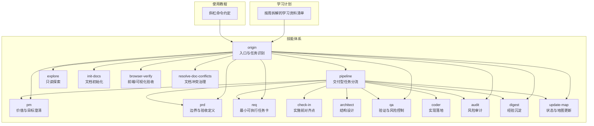
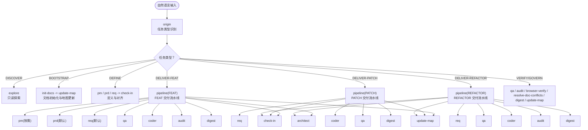
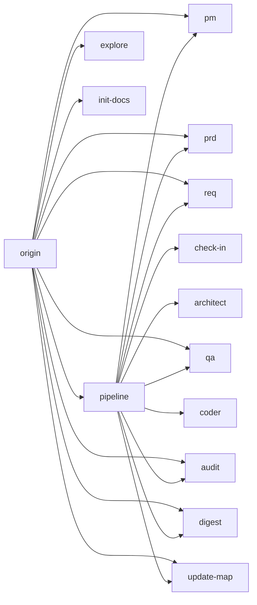

# 目标受众

<cite>
**本文引用的文件**
- [AI-Agent.md](file://AI-Agent.md)
- [Web3-AI-Agent-PRD-MVP.md](file://Web3-AI-Agent-PRD-MVP.md)
- [按周拆解的学习资料清单.md](file://按周拆解的学习资料清单.md)
- [skills/web3-ai-agent/SKILL.md](file://skills/web3-ai-agent/SKILL.md)
- [skills/web3-ai-agent/MAP-V3.md](file://skills/web3-ai-agent/MAP-V3.md)
- [skills/web3-ai-agent/SKILL-SYSTEM-DESIGN-V3.md](file://skills/web3-ai-agent/SKILL-SYSTEM-DESIGN-V3.md)
- [skills/web3-ai-agent/COMMANDS.md](file://skills/web3-ai-agent/COMMANDS.md)
- [skills/web3-ai-agent/pm/SKILL.md](file://skills/web3-ai-agent/pm/SKILL.md)
- [skills/web3-ai-agent/prd/SKILL.md](file://skills/web3-ai-agent/prd/SKILL.md)
- [skills/web3-ai-agent/req/SKILL.md](file://skills/web3-ai-agent/req/SKILL.md)
- [skills/web3-ai-agent/architect/SKILL.md](file://skills/web3-ai-agent/architect/SKILL.md)
- [skills/web3-ai-agent/qa/SKILL.md](file://skills/web3-ai-agent/qa/SKILL.md)
</cite>

## 目录
1. [简介](#简介)
2. [项目结构](#项目结构)
3. [核心组件](#核心组件)
4. [架构总览](#架构总览)
5. [详细组件分析](#详细组件分析)
6. [依赖分析](#依赖分析)
7. [性能考量](#性能考量)
8. [故障排查指南](#故障排查指南)
9. [结论](#结论)
10. [附录](#附录)

## 简介
本项目面向“AI-Agent 技能系统”，旨在通过一套可操作的技能（Skill）与流程（Pipeline），帮助不同背景的学习者快速上手并持续交付价值。项目特别关注以下三类主要受益群体：
- Web3 前端开发工程师：希望在自身技术栈基础上，结合 AI Agent 能力实现职业转型与能力跃迁。
- 希望转行的软件开发者：希望通过系统化的技能体系与项目实践，平滑过渡到 AI Agent 领域。
- AI Agent 学习者：希望通过真实项目驱动的学习路径，掌握从需求定义到交付闭环的关键能力。

项目通过“任务类型分流 + 交付流水线 + 治理闭环”的设计，既满足初学者循序渐进的学习节奏，也能支撑进阶用户的高阶实践需求。

## 项目结构
项目以“技能体系 + 学习计划 + 使用教程”三位一体的方式组织内容：
- 技能体系：以 web3-ai-agent 为核心入口，定义任务类型、路由规则、分层职责与执行骨架。
- 学习计划：按周拆解的学习资料清单，将技能体系与阶段性产出绑定，确保“边学边做、边做边学”。
- 使用教程：斜杠命令约定与示例，帮助用户快速上手调用与体验。

图表来源
- [skills/web3-ai-agent/SKILL.md](file://skills/web3-ai-agent/SKILL.md)
- [skills/web3-ai-agent/MAP-V3.md](file://skills/web3-ai-agent/MAP-V3.md)
- [skills/web3-ai-agent/SKILL-SYSTEM-DESIGN-V3.md](file://skills/web3-ai-agent/SKILL-SYSTEM-DESIGN-V3.md)
- [skills/web3-ai-agent/COMMANDS.md](file://skills/web3-ai-agent/COMMANDS.md)
- [按周拆解的学习资料清单.md](file://按周拆解的学习资料清单.md)

章节来源
- [skills/web3-ai-agent/SKILL.md](file://skills/web3-ai-agent/SKILL.md)
- [skills/web3-ai-agent/MAP-V3.md](file://skills/web3-ai-agent/MAP-V3.md)
- [skills/web3-ai-agent/SKILL-SYSTEM-DESIGN-V3.md](file://skills/web3-ai-agent/SKILL-SYSTEM-DESIGN-V3.md)
- [skills/web3-ai-agent/COMMANDS.md](file://skills/web3-ai-agent/COMMANDS.md)
- [按周拆解的学习资料清单.md](file://按周拆解的学习资料清单.md)

## 核心组件
- 任务类型与路由
  - 七类任务：DISCOVER、BOOTSTRAP、DEFINE、DELIVER-FEAT、DELIVER-PATCH、DELIVER-REFACTOR、VERIFY/GOVERN。
  - 入口统一：origin 作为“任务识别入口”，根据任务类型决定是否进入 pipeline。
- 分层职责
  - 入口层：origin、pipeline。
  - 定义层：pm、prd、req、check-in。
  - 交付层：architect、qa、coder、audit。
  - 治理层：digest、update-map。
  - 辅助层：explore、init-docs、browser-verify、resolve-doc-conflicts。
- 执行骨架
  - route -> define(按需) -> check-in -> design(按需) -> build -> closeout。
- 硬规则
  - FEAT 默认先 qa 执行 RED；coder 最多 10 轮自愈；audit 总分 100，>=80 通过，<60 直接拒绝。

章节来源
- [skills/web3-ai-agent/SKILL.md](file://skills/web3-ai-agent/SKILL.md)
- [skills/web3-ai-agent/SKILL-SYSTEM-DESIGN-V3.md](file://skills/web3-ai-agent/SKILL-SYSTEM-DESIGN-V3.md)

## 架构总览
下图展示了从“自然语言输入”到“可交付闭环”的总体流程，体现“入口分流、按需定义、实施对齐、设计实现、风险审计、沉淀更新”的闭环。

图表来源
- [skills/web3-ai-agent/SKILL.md](file://skills/web3-ai-agent/SKILL.md)
- [skills/web3-ai-agent/MAP-V3.md](file://skills/web3-ai-agent/MAP-V3.md)
- [skills/web3-ai-agent/SKILL-SYSTEM-DESIGN-V3.md](file://skills/web3-ai-agent/SKILL-SYSTEM-DESIGN-V3.md)

章节来源
- [skills/web3-ai-agent/SKILL.md](file://skills/web3-ai-agent/SKILL.md)
- [skills/web3-ai-agent/MAP-V3.md](file://skills/web3-ai-agent/MAP-V3.md)
- [skills/web3-ai-agent/SKILL-SYSTEM-DESIGN-V3.md](file://skills/web3-ai-agent/SKILL-SYSTEM-DESIGN-V3.md)

## 详细组件分析

### Web3 前端开发工程师（转型目标）
- 学习背景
  - 熟悉前端框架与工程化，对 Web3 生态有一定了解，但对 Agent 工程化流程与工具调用尚不系统。
- 技能水平
  - 初级：能完成简单页面与工具集成；对 Agent Loop、Prompt 设计、RAG 等概念理解有限。
  - 中级：能独立设计与实现小型 Agent 功能，具备一定的工程化与部署能力。
  - 高级：能主导复杂 Agent 产品的架构设计与质量保障，具备团队协作与知识治理能力。
- 学习目标
  - 掌握从“需求定义”到“实现交付”的完整闭环；理解 Agent 的最小可行工作流；具备可展示的项目作品集。
- 预期收益
  - 以项目为载体，逐步补齐 Agent 工程能力短板；在转型过程中获得可验证的阶段性成果。
- 学习建议与路径
  - 第 1 周：LLM API、Chat 与 Function Calling，完成最小工具调用闭环。
  - 第 2 周：Agent Loop、Prompt 设计与 Web3 工具接入，完成真实数据查询能力。
  - 第 3 周：Memory、RAG 入门与产品边界，形成稳定系统 Prompt 与风险策略。
  - 第 4 周：工程化、部署与项目表达，输出在线可访问版本与简历项目描述。
- 适配策略
  - 以“按周拆解的学习资料清单”为导航，结合“斜杠命令约定”与“技能体系”，将学习内容与实际产出绑定，避免知识过载。

章节来源
- [AI-Agent.md](file://AI-Agent.md)
- [Web3-AI-Agent-PRD-MVP.md](file://Web3-AI-Agent-PRD-MVP.md)
- [按周拆解的学习资料清单.md](file://按周拆解的学习资料清单.md)
- [skills/web3-ai-agent/COMMANDS.md](file://skills/web3-ai-agent/COMMANDS.md)

### 希望转行的软件开发者（跨领域入门）
- 学习背景
  - 具备传统软件开发经验，对 Agent 概念与工程化流程较为陌生，需要系统化的入门路径。
- 技能水平
  - 初级：理解 Agent 的基本概念，但缺乏工程化落地经验。
  - 中级：能理解 Agent 的最小闭环，具备基础的工具设计与调用能力。
  - 高级：能主导 Agent 项目的架构与质量保障，具备跨团队协作与知识治理能力。
- 学习目标
  - 通过真实项目驱动，掌握 Agent 的核心能力与工程化实践；形成可迁移的技术能力与作品集。
- 预期收益
  - 以“任务类型分流 + 交付流水线 + 治理闭环”的体系化方法，降低学习曲线；在实践中快速建立信心。
- 学习建议与路径
  - 从“DISCOVER”与“EXPLORE”开始，熟悉项目地图与技能职责。
  - 通过“DEFINE”阶段完成需求澄清与边界定义，再进入“DELIVER”流水线。
  - 在“DELIVER-FEAT/PATCH/REFACTOR”中，按需串联 pm、prd、req、check-in、architect、qa、coder、audit、digest、update-map。
- 适配策略
  - 以“技能体系设计”为蓝图，结合“按周拆解的学习资料清单”，将“定义-设计-实现-治理”的闭环融入日常学习与实践。

章节来源
- [skills/web3-ai-agent/SKILL-SYSTEM-DESIGN-V3.md](file://skills/web3-ai-agent/SKILL-SYSTEM-DESIGN-V3.md)
- [skills/web3-ai-agent/SKILL.md](file://skills/web3-ai-agent/SKILL.md)
- [skills/web3-ai-agent/MAP-V3.md](file://skills/web3-ai-agent/MAP-V3.md)
- [按周拆解的学习资料清单.md](file://按周拆解的学习资料清单.md)

### AI Agent 学习者（进阶实践）
- 学习背景
  - 对 Agent 概念有一定了解，希望深入掌握工程化落地与质量保障方法。
- 技能水平
  - 初级：能理解 Agent 的基本工作流，但对复杂场景的处理与风险控制缺乏经验。
  - 中级：能独立完成 Agent 的设计与实现，具备一定的质量保障与知识治理能力。
  - 高级：能主导复杂 Agent 产品的架构设计与质量保障，具备团队协作与知识治理能力。
- 学习目标
  - 通过真实项目与技能体系，掌握从需求到交付再到治理的全流程能力；形成可复用的方法论与最佳实践。
- 预期收益
  - 以“执行骨架 + 硬规则 + 分层职责”的体系化方法，提升交付效率与质量；在实践中沉淀可迁移的能力资产。
- 学习建议与路径
  - 从“origin”开始，根据任务类型进入相应流水线；在“DELIVER”阶段严格遵循“define -> check-in -> design -> build -> closeout”的节奏。
  - 在“QA”阶段严格执行 RED/GREEN 规则，在“Coder”阶段进行最多 10 轮自愈，在“Audit”阶段达到 80 分以上方可通过。
- 适配策略
  - 以“硬规则”为底线，结合“分层职责”与“按需插入”的策略，确保复杂场景下的可控交付。

章节来源
- [skills/web3-ai-agent/SKILL-SYSTEM-DESIGN-V3.md](file://skills/web3-ai-agent/SKILL-SYSTEM-DESIGN-V3.md)
- [skills/web3-ai-agent/qa/SKILL.md](file://skills/web3-ai-agent/qa/SKILL.md)
- [skills/web3-ai-agent/architect/SKILL.md](file://skills/web3-ai-agent/architect/SKILL.md)

### 面向不同层次学习者的适配说明
- 初学者
  - 以“DISCOVER/BOOTSTRAP”为主，配合“EXPLORE/INIT-DOCS”，快速建立对项目的整体认知与文档体系。
  - 通过“按周拆解的学习资料清单”与“斜杠命令约定”，降低上手门槛。
- 中级学习者
  - 以“DEFINE”阶段为核心，完成 pm、prd、req 的串联，明确边界与验收标准后再进入“DELIVER”流水线。
  - 在“DELIVER-FEAT/PATCH/REFACTOR”中按需插入“architect/audit/browser-verify/prd”，确保交付质量与可维护性。
- 高级学习者
  - 以“VERIFY/GOVERN”为主线，聚焦“qa/audit/browser-verify/resolve-doc-conflicts/digest/update-map”的治理闭环。
  - 通过“硬规则”与“分层职责”确保复杂场景下的风险可控与交付稳定。

章节来源
- [skills/web3-ai-agent/SKILL-SYSTEM-DESIGN-V3.md](file://skills/web3-ai-agent/SKILL-SYSTEM-DESIGN-V3.md)
- [skills/web3-ai-agent/MAP-V3.md](file://skills/web3-ai-agent/MAP-V3.md)
- [skills/web3-ai-agent/COMMANDS.md](file://skills/web3-ai-agent/COMMANDS.md)
- [按周拆解的学习资料清单.md](file://按周拆解的学习资料清单.md)

## 依赖分析
- 组件耦合与分层
  - 入口层与定义层之间存在强依赖：origin 必须先识别任务类型，再决定是否进入 pipeline；pm/prd/req/check-in 提供“定义-对齐-准入”的前置条件。
  - 交付层内部存在严格的顺序依赖：architect -> qa -> coder -> audit，且 qa 在 FEAT 中先行 RED。
  - 治理层作为收尾闭环，digest 与 update-map 通常并入 closeout，形成“沉淀-更新-下一轮”的持续改进机制。
- 关键依赖关系
  - origin -> pipeline（仅交付型任务）
  - pm/prd/req -> check-in（实施前对齐）
  - architect/qa -> coder（设计-验证-实现）
  - qa/coder -> audit（风险审计）
  - digest/update-map（治理闭环）

图表来源
- [skills/web3-ai-agent/SKILL.md](file://skills/web3-ai-agent/SKILL.md)
- [skills/web3-ai-agent/MAP-V3.md](file://skills/web3-ai-agent/MAP-V3.md)
- [skills/web3-ai-agent/SKILL-SYSTEM-DESIGN-V3.md](file://skills/web3-ai-agent/SKILL-SYSTEM-DESIGN-V3.md)

章节来源
- [skills/web3-ai-agent/SKILL.md](file://skills/web3-ai-agent/SKILL.md)
- [skills/web3-ai-agent/MAP-V3.md](file://skills/web3-ai-agent/MAP-V3.md)
- [skills/web3-ai-agent/SKILL-SYSTEM-DESIGN-V3.md](file://skills/web3-ai-agent/SKILL-SYSTEM-DESIGN-V3.md)

## 性能考量
- 流程效率
  - 通过“任务类型分流 + 按需定义 + 实施对齐 + 分层职责”的设计，减少不必要的流程开销，提高交付效率。
- 质量与风险控制
  - 在 FEAT 中先执行 RED，确保验证先行；在 PATCH/REFACTOR 中保留轻量验证或回归检查，避免过度消耗。
  - 通过“audit”评分规则与“coder 自愈”上限，平衡质量与效率。
- 可视化与可操作性
  - 使用 ASCII 总流程图与“斜杠命令约定”，降低歧义与沟通成本，提升可操作性。

章节来源
- [skills/web3-ai-agent/SKILL-SYSTEM-DESIGN-V3.md](file://skills/web3-ai-agent/SKILL-SYSTEM-DESIGN-V3.md)
- [skills/web3-ai-agent/COMMANDS.md](file://skills/web3-ai-agent/COMMANDS.md)

## 故障排查指南
- 常见问题与对策
  - 未从 origin 入口发起：可能导致任务类型识别失败，应使用“斜杠命令约定”统一入口。
  - 未进行 check-in 就进入 architect/qa/coder：违反硬规则，应先完成“check-in”输出的七项内容。
  - FEAT 未先执行 RED：导致验证不足，应先由 qa 执行 RED 并输出验证结果。
  - coder 超过 10 轮仍未通过：应终止并人工介入，输出 STUCK 结论。
  - audit 低于 80 分：需回退修复或软拒绝，<60 分直接拒绝。
- 治理与文档
  - 文档冲突：使用 resolve-doc-conflicts 进行治理。
  - 状态更新：通过 digest 与 update-map 持续沉淀与更新地图。

章节来源
- [skills/web3-ai-agent/SKILL.md](file://skills/web3-ai-agent/SKILL.md)
- [skills/web3-ai-agent/qa/SKILL.md](file://skills/web3-ai-agent/qa/SKILL.md)
- [skills/web3-ai-agent/COMMANDS.md](file://skills/web3-ai-agent/COMMANDS.md)

## 结论
本项目以“任务类型分流 + 交付流水线 + 治理闭环”为核心，构建了一套可操作、可演进、可复用的 AI-Agent 技能体系。通过“按周拆解的学习资料清单”与“斜杠命令约定”，不同背景的学习者都能找到适合自己的学习路径与实践节奏。项目强调：
- 以最少步骤把任务送进正确路径；
- 对高风险任务增加约束，对低风险任务减少消耗；
- 保留文档沉淀，但不让文档流程压垮交付效率。

## 附录
- 术语与职责速览
  - origin：任务识别入口。
  - pipeline：交付型任务分流。
  - pm/prd/req：价值与边界定义工具。
  - check-in：实施前对齐点。
  - architect：结构设计。
  - qa：验证与风险控制。
  - coder：实现落地。
  - audit：风险审计。
  - digest/update-map：经验沉淀与状态更新。
  - explore/init-docs/browser-verify/resolve-doc-conflicts：辅助能力。

章节来源
- [skills/web3-ai-agent/SKILL-SYSTEM-DESIGN-V3.md](file://skills/web3-ai-agent/SKILL-SYSTEM-DESIGN-V3.md)
- [skills/web3-ai-agent/pm/SKILL.md](file://skills/web3-ai-agent/pm/SKILL.md)
- [skills/web3-ai-agent/prd/SKILL.md](file://skills/web3-ai-agent/prd/SKILL.md)
- [skills/web3-ai-agent/req/SKILL.md](file://skills/web3-ai-agent/req/SKILL.md)
- [skills/web3-ai-agent/architect/SKILL.md](file://skills/web3-ai-agent/architect/SKILL.md)
- [skills/web3-ai-agent/qa/SKILL.md](file://skills/web3-ai-agent/qa/SKILL.md)