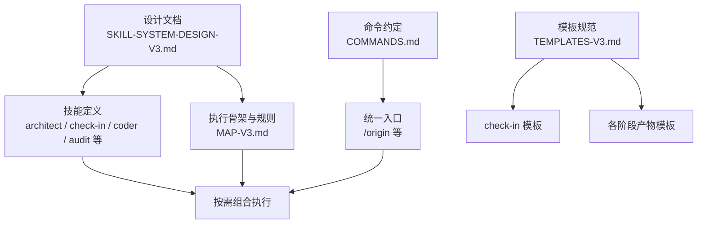
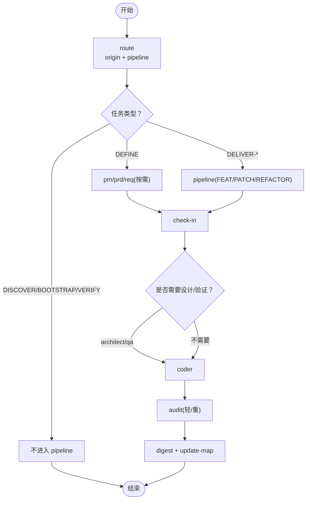
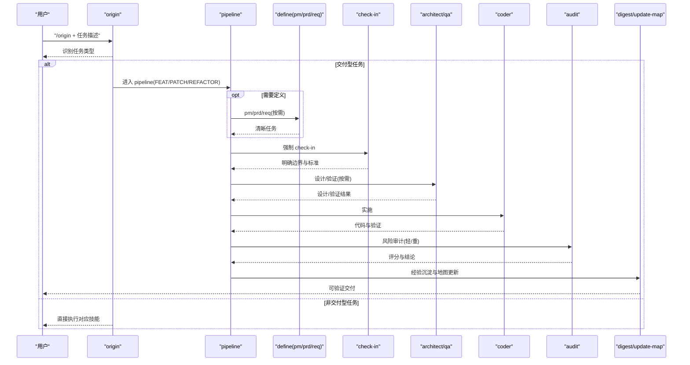
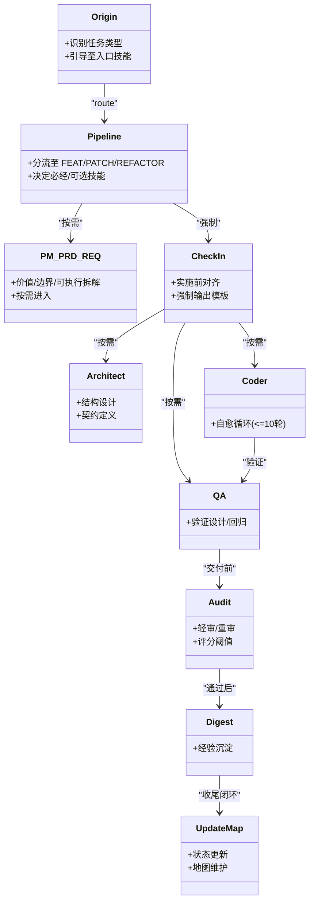
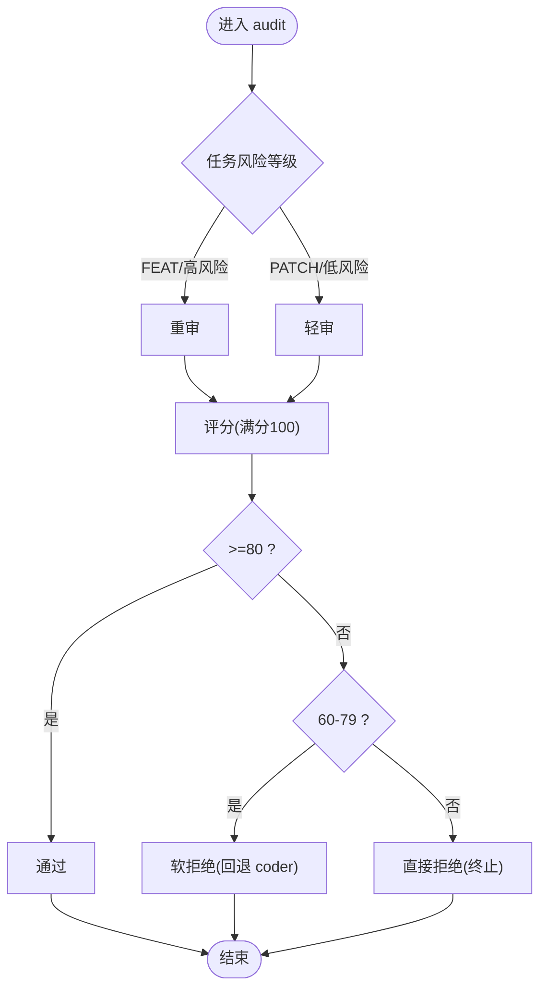
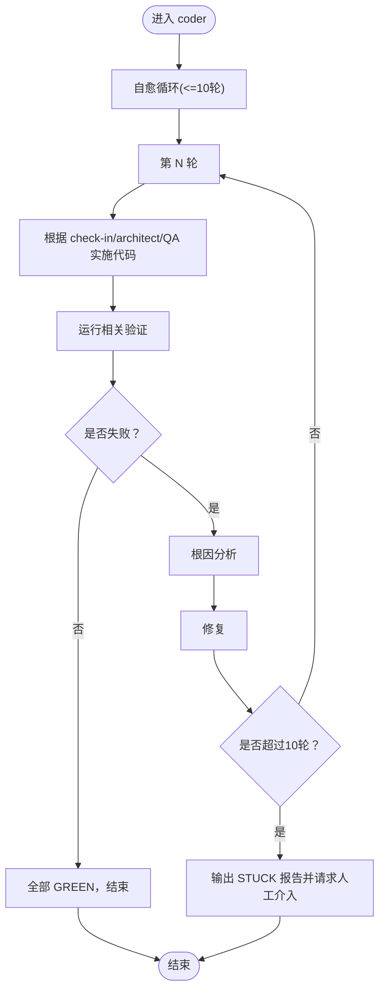
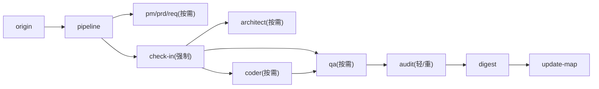

# 技术特色

<cite>
**本文引用的文件**
- [SKILL-SYSTEM-DESIGN-V3.md](file://skills/web3-ai-agent/SKILL-SYSTEM-DESIGN-V3.md)
- [MAP-V3.md](file://skills/web3-ai-agent/MAP-V3.md)
- [COMMANDS.md](file://skills/web3-ai-agent/COMMANDS.md)
- [TEMPLATES-V3.md](file://skills/web3-ai-agent/TEMPLATES-V3.md)
- [architect\SKILL.md](file://skills/web3-ai-agent/architect/SKILL.md)
- [check-in\SKILL.md](file://skills/web3-ai-agent/check-in/SKILL.md)
- [coder\SKILL.md](file://skills/web3-ai-agent/coder/SKILL.md)
- [audit\SKILL.md](file://skills/web3-ai-agent/audit/SKILL.md)
</cite>

## 目录
1. [引言](#引言)
2. [项目结构](#项目结构)
3. [核心组件](#核心组件)
4. [架构总览](#架构总览)
5. [详细组件分析](#详细组件分析)
6. [依赖分析](#依赖分析)
7. [性能考虑](#性能考虑)
8. [故障排查指南](#故障排查指南)
9. [结论](#结论)
10. [附录](#附录)

## 引言
本项目以“技能系统”为核心载体，提出一套面向 Web3/AI 的工程化方法论与执行框架。其技术特色围绕四大维度展开：
- 文档驱动开发模式：以“地图/模板/检查点”为载体，确保知识可沉淀、过程可追溯、质量可度量。
- 技能系统架构：将任务类型与执行层级解耦，形成“入口层—定义层—交付层—治理层—辅助层”的五层结构，支持按需分流与快速收敛。
- Web3 专用约束机制：在审计与评分中引入安全与信任边界，结合“轻审/重审”与“一票否决”，强化高风险场景的风控能力。
- vibe coding 实现方式：以“自愈循环”和“红绿灯规则”为执行抓手，将 QA 的失败反馈转化为可迭代的工程闭环。

这些设计直击传统学习与开发中的痛点：流程僵化导致交付效率低、文档与执行脱节造成重复返工、缺乏门禁导致变更失控、质量评估主观化引发风险积压。

## 项目结构
技能系统以“设计文档 + 技能定义 + 命令约定 + 模板规范”四维协同的方式组织：
- 设计文档：定义任务分类、执行骨架、硬规则与三层流水线（FEAT/PATCH/REFACTOR）。
- 技能定义：每个技能的职责、边界、输入输出与衔接规则。
- 命令约定：统一的斜杠命令入口，便于在不同宿主环境中落地。
- 模板规范：标准化的“check-in”模板与各阶段产物模板，确保可复用与可审计。

图表来源
- [SKILL-SYSTEM-DESIGN-V3.md:1-719](file://skills/web3-ai-agent/SKILL-SYSTEM-DESIGN-V3.md#L1-L719)
- [MAP-V3.md:1-166](file://skills/web3-ai-agent/MAP-V3.md#L1-L166)
- [COMMANDS.md:1-81](file://skills/web3-ai-agent/COMMANDS.md#L1-L81)
- [TEMPLATES-V3.md:1-152](file://skills/web3-ai-agent/TEMPLATES-V3.md#L1-L152)

章节来源
- [SKILL-SYSTEM-DESIGN-V3.md:1-719](file://skills/web3-ai-agent/SKILL-SYSTEM-DESIGN-V3.md#L1-L719)
- [MAP-V3.md:1-166](file://skills/web3-ai-agent/MAP-V3.md#L1-L166)
- [COMMANDS.md:1-81](file://skills/web3-ai-agent/COMMANDS.md#L1-L81)
- [TEMPLATES-V3.md:1-152](file://skills/web3-ai-agent/TEMPLATES-V3.md#L1-L152)

## 核心组件
- 入口层：origin/pipeline，负责任务类型识别与交付型任务分流。
- 定义层：pm/prd/req/check-in，负责从模糊意图到清晰任务与实施前对齐。
- 交付层：architect/qa/coder/audit，负责设计、验证、实现与风险审计。
- 治理层：digest/update-map，负责经验沉淀与知识地图更新。
- 辅助层：explore/init-docs/browser-verify/resolve-doc-conflicts，提供只读探索、初始化、验收与冲突治理。

章节来源
- [SKILL-SYSTEM-DESIGN-V3.md:164-220](file://skills/web3-ai-agent/SKILL-SYSTEM-DESIGN-V3.md#L164-L220)
- [SKILL-SYSTEM-DESIGN-V3.md:439-601](file://skills/web3-ai-agent/SKILL-SYSTEM-DESIGN-V3.md#L439-L601)

## 架构总览
V3 的核心思想是“让系统更像一个能分流的操作系统，而不是一条只能从头走到尾的流水线”。其执行骨架为 route -> define(按需) -> check-in -> design(按需) -> build -> closeout，其中：
- route：origin + pipeline，完成任务类型与执行深度的判断；
- define：pm/prd/req，按需进入，避免默认全跑；
- check-in：实施前对齐点，强制覆盖交付型任务；
- design/build：architect/qa/coder，按需插入；
- closeout：digest/update-map，收尾闭环。

图表来源
- [SKILL-SYSTEM-DESIGN-V3.md:265-285](file://skills/web3-ai-agent/SKILL-SYSTEM-DESIGN-V3.md#L265-L285)
- [MAP-V3.md:86-166](file://skills/web3-ai-agent/MAP-V3.md#L86-L166)

章节来源
- [SKILL-SYSTEM-DESIGN-V3.md:265-285](file://skills/web3-ai-agent/SKILL-SYSTEM-DESIGN-V3.md#L265-L285)
- [MAP-V3.md:86-166](file://skills/web3-ai-agent/MAP-V3.md#L86-L166)

## 详细组件分析

### 文档驱动开发模式
- 地图与模板：以“地图”呈现可执行路径，“模板”固化关键检查点与产物，确保每次执行都有迹可循。
- 检查点与门禁：check-in 作为实施前门禁，强制输出“问题、上下文、方案、边界、产物、标准、下一跳”，避免盲目实施。
- 质量与治理：digest 与 update-map 并入 closeout，形成闭环，既保留沉淀又不打断主链路。

图表来源
- [SKILL-SYSTEM-DESIGN-V3.md:222-285](file://skills/web3-ai-agent/SKILL-SYSTEM-DESIGN-V3.md#L222-L285)
- [MAP-V3.md:86-166](file://skills/web3-ai-agent/MAP-V3.md#L86-L166)
- [TEMPLATES-V3.md:3-24](file://skills/web3-ai-agent/TEMPLATES-V3.md#L3-L24)

章节来源
- [SKILL-SYSTEM-DESIGN-V3.md:222-285](file://skills/web3-ai-agent/SKILL-SYSTEM-DESIGN-V3.md#L222-L285)
- [TEMPLATES-V3.md:3-24](file://skills/web3-ai-agent/TEMPLATES-V3.md#L3-L24)
- [MAP-V3.md:86-166](file://skills/web3-ai-agent/MAP-V3.md#L86-L166)

### 技能系统架构
- 分层解耦：入口层负责分流，定义层负责对齐，交付层负责实现，治理层负责沉淀，辅助层提供只读与初始化能力。
- 按需执行：pm/prd/req 默认按需进入，避免“默认全跑”带来的资源浪费；digest/update-map 并入 closeout，降低流程割裂感。
- 门禁与边界：check-in 仅对实施型任务强制；各技能明确边界，不替代其他角色职责。

图表来源
- [SKILL-SYSTEM-DESIGN-V3.md:164-220](file://skills/web3-ai-agent/SKILL-SYSTEM-DESIGN-V3.md#L164-L220)
- [architect\SKILL.md:1-53](file://skills/web3-ai-agent/architect/SKILL.md#L1-L53)
- [check-in\SKILL.md:1-56](file://skills/web3-ai-agent/check-in/SKILL.md#L1-L56)
- [coder\SKILL.md:1-72](file://skills/web3-ai-agent/coder/SKILL.md#L1-L72)
- [audit\SKILL.md:1-88](file://skills/web3-ai-agent/audit/SKILL.md#L1-L88)

章节来源
- [SKILL-SYSTEM-DESIGN-V3.md:164-220](file://skills/web3-ai-agent/SKILL-SYSTEM-DESIGN-V3.md#L164-L220)
- [architect\SKILL.md:1-53](file://skills/web3-ai-agent/architect/SKILL.md#L1-L53)
- [check-in\SKILL.md:1-56](file://skills/web3-ai-agent/check-in/SKILL.md#L1-L56)
- [coder\SKILL.md:1-72](file://skills/web3-ai-agent/coder/SKILL.md#L1-L72)
- [audit\SKILL.md:1-88](file://skills/web3-ai-agent/audit/SKILL.md#L1-L88)

### Web3 专用约束机制
- 安全与信任边界：在审计评分中突出“安全与风险边界”权重，针对 Web3 的资金、权限、可信度场景设置专项治理项。
- 轻审/重审策略：根据任务风险等级选择审计深度，FEAT 默认重审，PATCH/低风险 REFACTOR 默认轻审，避免小题大做。
- 一票否决：严重安全问题、关键不变量破坏、高风险边界缺失可直接否决，确保底线不破。

图表来源
- [SKILL-SYSTEM-DESIGN-V3.md:712-719](file://skills/web3-ai-agent/SKILL-SYSTEM-DESIGN-V3.md#L712-L719)
- [audit\SKILL.md:52-77](file://skills/web3-ai-agent/audit/SKILL.md#L52-L77)

章节来源
- [SKILL-SYSTEM-DESIGN-V3.md:712-719](file://skills/web3-ai-agent/SKILL-SYSTEM-DESIGN-V3.md#L712-L719)
- [audit\SKILL.md:52-77](file://skills/web3-ai-agent/audit/SKILL.md#L52-L77)

### vibe coding 实现方式
- 自愈循环：coder 以最多 10 轮自愈循环将 QA 的 RED 变为 GREEN，每轮包含“实施—验证—根因分析—修复—下一轮”，超过 10 轮输出 STUCK 报告并请求人工介入。
- 红绿灯衔接：FEAT 中 QA 先执行 RED，coder 的职责是把全部 RED 变为 GREEN；若发现 QA 红灯与需求矛盾，应停止并报告而非擅自改需求。
- 范围控制：若发现范围扩大，回退 req/check-in/architect，确保边界稳定。

图表来源
- [coder\SKILL.md:18-37](file://skills/web3-ai-agent/coder/SKILL.md#L18-L37)
- [SKILL-SYSTEM-DESIGN-V3.md:706-711](file://skills/web3-ai-agent/SKILL-SYSTEM-DESIGN-V3.md#L706-L711)

章节来源
- [coder\SKILL.md:18-37](file://skills/web3-ai-agent/coder/SKILL.md#L18-L37)
- [SKILL-SYSTEM-DESIGN-V3.md:706-711](file://skills/web3-ai-agent/SKILL-SYSTEM-DESIGN-V3.md#L706-L711)

### 学习门禁机制
- learn-gate 更名为 check-in：强调“实施前对齐点”，而非仅限学习阶段的门禁，使其可扩展到 FEAT/PATCH/REFACTOR 与准备进入实施的 DEFINE 任务。
- 强制范围与默认不强制：check-in 仅对实施型任务强制，探索与治理类任务不强制，避免流程冗余。

章节来源
- [SKILL-SYSTEM-DESIGN-V3.md:15-21](file://skills/web3-ai-agent/SKILL-SYSTEM-DESIGN-V3.md#L15-L21)
- [SKILL-SYSTEM-DESIGN-V3.md:246-262](file://skills/web3-ai-agent/SKILL-SYSTEM-DESIGN-V3.md#L246-L262)
- [check-in\SKILL.md:12-24](file://skills/web3-ai-agent/check-in/SKILL.md#L12-L24)

### 质量保证体系
- QA 红绿灯规则：FEAT 默认先由 QA 执行 RED，PATCH/REFACTOR 默认保留验证或回归检查，确保问题暴露前置。
- 审计评分与阈值：需求一致性、结构契约一致性、安全与风险边界、代码质量、回归风险控制、文档与状态收尾、场景特定治理项构成评分维度，>=80 通过，60-79 软拒绝，<60 直接拒绝。
- 一票否决：严重安全问题、明显越界、关键不变量破坏、高风险场景缺少风险提示或失败降级可一票否决。

章节来源
- [SKILL-SYSTEM-DESIGN-V3.md:700-705](file://skills/web3-ai-agent/SKILL-SYSTEM-DESIGN-V3.md#L700-L705)
- [SKILL-SYSTEM-DESIGN-V3.md:712-719](file://skills/web3-ai-agent/SKILL-SYSTEM-DESIGN-V3.md#L712-L719)
- [audit\SKILL.md:41-77](file://skills/web3-ai-agent/audit/SKILL.md#L41-L77)

### 风险控制策略
- 轻审/重审：根据任务风险等级选择审计深度，FEAT 默认重审，PATCH/低风险 REFACTOR 默认轻审。
- 自愈循环上限：coder 的 10 轮自愈上限与 STUCK 报告机制，防止无效内耗与风险蔓延。
- 门禁与边界：check-in 的强制输出模板与硬规则，明确“不做什么”与完成标准，防止范围蔓延与伪完成。

章节来源
- [SKILL-SYSTEM-DESIGN-V3.md:706-711](file://skills/web3-ai-agent/SKILL-SYSTEM-DESIGN-V3.md#L706-L711)
- [audit\SKILL.md:12-32](file://skills/web3-ai-agent/audit/SKILL.md#L12-L32)
- [check-in\SKILL.md:51-56](file://skills/web3-ai-agent/check-in/SKILL.md#L51-L56)

## 依赖分析
- 耦合与内聚：各技能职责清晰、边界明确，通过 check-in 串联交付链，通过 digest/update-map 收尾，整体内聚、弱耦合。
- 直接与间接依赖：origin/pipeline 为上游入口，define/desgin/build/closeout 为下游执行链，audit 作为关键决策点横切贯穿。
- 外部集成：命令约定与模板规范为跨宿主环境落地提供统一契约。

图表来源
- [MAP-V3.md:86-166](file://skills/web3-ai-agent/MAP-V3.md#L86-L166)
- [SKILL-SYSTEM-DESIGN-V3.md:222-285](file://skills/web3-ai-agent/SKILL-SYSTEM-DESIGN-V3.md#L222-L285)

章节来源
- [MAP-V3.md:86-166](file://skills/web3-ai-agent/MAP-V3.md#L86-L166)
- [SKILL-SYSTEM-DESIGN-V3.md:222-285](file://skills/web3-ai-agent/SKILL-SYSTEM-DESIGN-V3.md#L222-L285)

## 性能考虑
- 流程分流与按需执行：通过任务类型与执行深度分流，避免默认全跑造成的资源浪费。
- 轻审/重审与自愈上限：在保障质量的前提下，通过审计深度与自愈轮次限制，控制执行成本。
- 治理闭环合并：digest/update-map 并入 closeout，减少流程割裂带来的额外开销。

## 故障排查指南
- 无法进入交付链：检查是否通过 origin/pipeline 的任务类型识别；确认是否满足进入 pipeline 的条件。
- 未通过 check-in：检查是否输出强制模板；确认“完成标准”是否明确；确认“下一跳技能”是否填写。
- QA 红灯持续：查看 coder 的自愈循环是否超过 10 轮；若出现 STUCK 报告，按报告建议进行人工介入。
- 审计未通过：对照评分维度逐项核对；若处于软拒绝，回退 coder 修正；若直接拒绝，终止并重新制定方案。

章节来源
- [check-in\SKILL.md:51-56](file://skills/web3-ai-agent/check-in/SKILL.md#L51-L56)
- [coder\SKILL.md:39-48](file://skills/web3-ai-agent/coder/SKILL.md#L39-L48)
- [audit\SKILL.md:64-77](file://skills/web3-ai-agent/audit/SKILL.md#L64-L77)

## 结论
本项目以“文档驱动 + 分层分流 + 门禁约束 + 自愈闭环”为核心技术特色，构建了一套可落地、可度量、可演进的 Web3/AI 工程方法论。通过任务类型与执行深度的解耦、check-in 的强制对齐、audit 的轻重审与评分阈值、coder 的自愈循环与 STUCK 报告，有效解决了传统学习与开发中的流程僵化、文档脱节、变更失控与质量主观等问题，为技术决策提供了理论支撑与实践依据。

## 附录
- 命令约定：统一的斜杠命令入口，便于在不同宿主环境中落地。
- 模板规范：标准化的 check-in 与各阶段产物模板，确保可复用与可审计。

章节来源
- [COMMANDS.md:20-50](file://skills/web3-ai-agent/COMMANDS.md#L20-L50)
- [TEMPLATES-V3.md:3-24](file://skills/web3-ai-agent/TEMPLATES-V3.md#L3-L24)