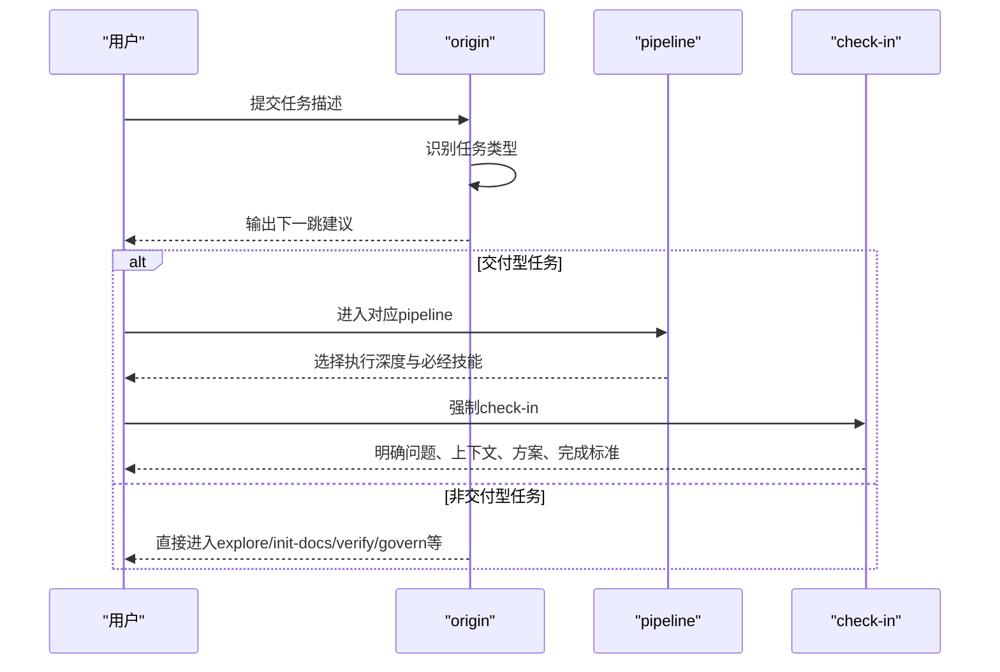
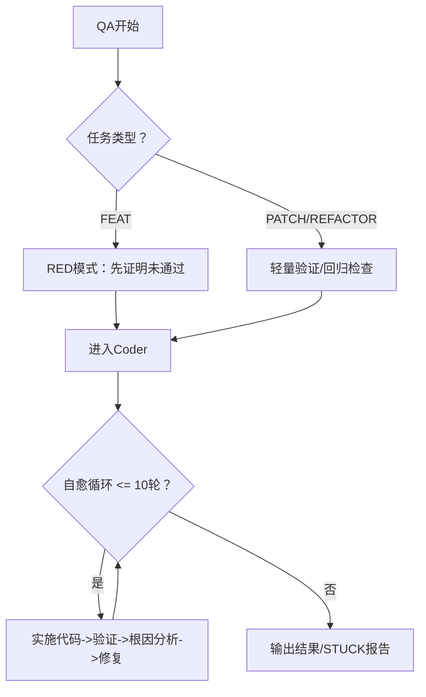
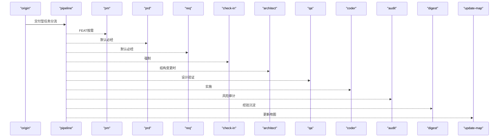
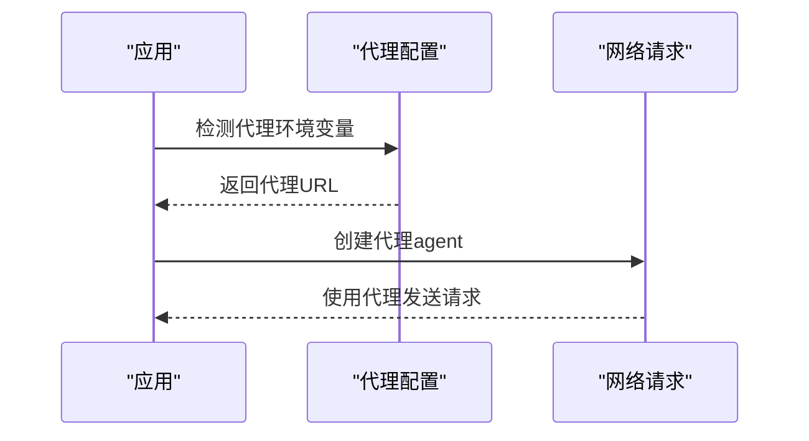
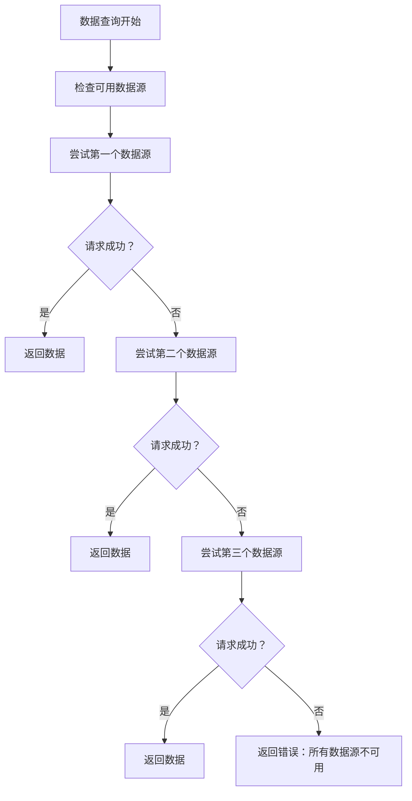
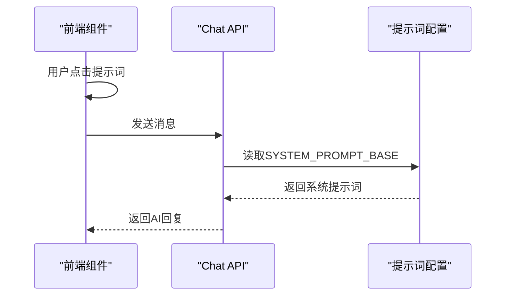
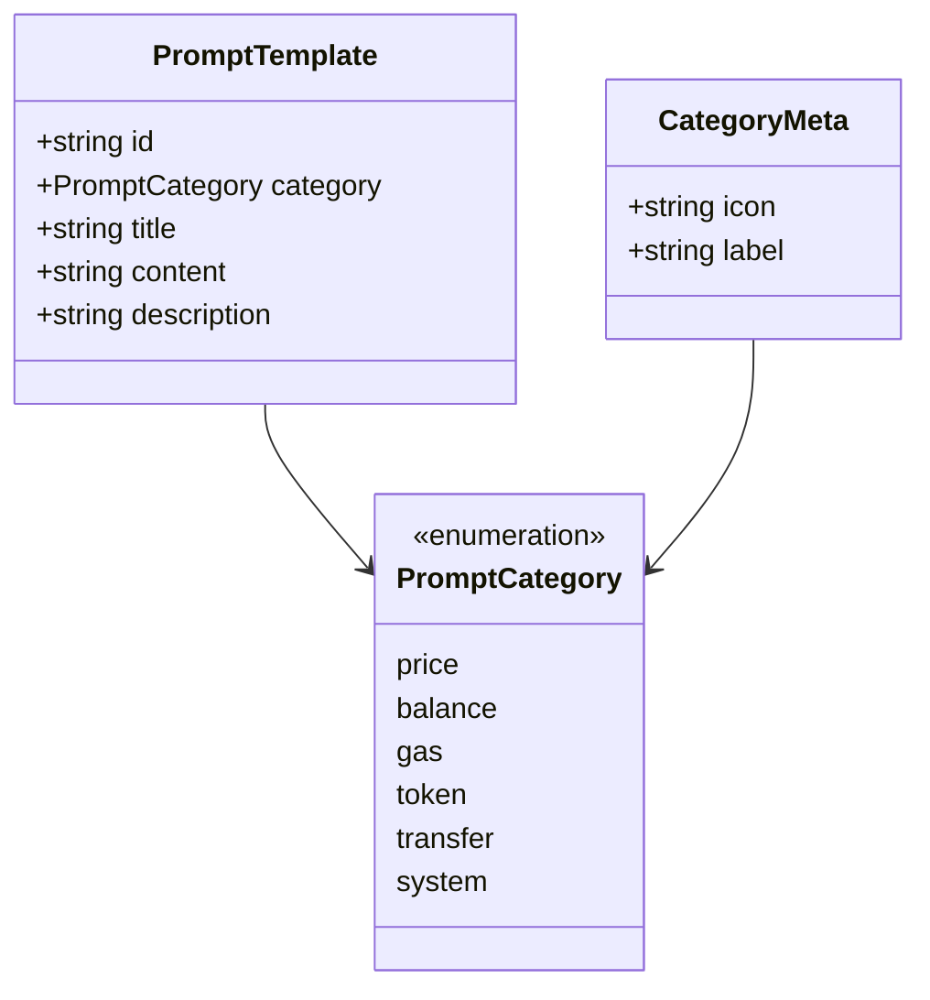
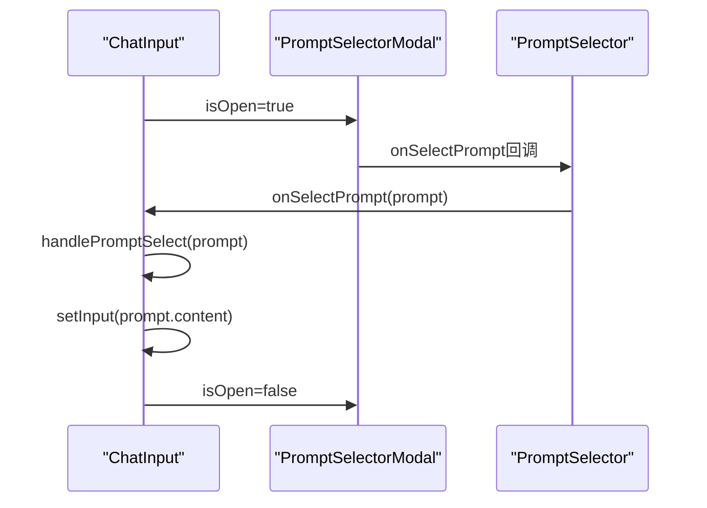
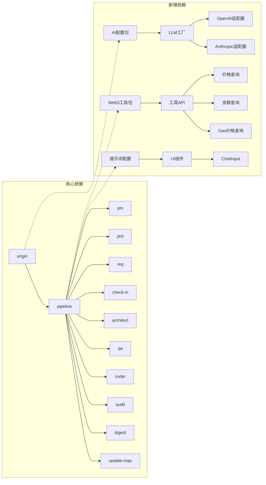

# 整体架构概览

<cite>
**本文档引用的文件**
- [SKILL-SYSTEM-DESIGN-V3.md](file://skills/x-ray/SKILL-SYSTEM-DESIGN-V3.md)
- [MAP-V3.md](file://skills/x-ray/MAP-V3.md)
- [COMMANDS.md](file://skills/x-ray/COMMANDS.md)
- [ARCHITECTURE.md](file://ARCHITECTURE.md)
- [README.md](file://README.md)
- [route.ts](file://apps/web/app/api/tools/route.ts)
- [route.ts](file://apps/web/app/api/chat/route.ts)
- [index.ts](file://packages/ai-config/src/index.ts)
- [types.ts](file://packages/ai-config/src/types.ts)
- [config.ts](file://packages/ai-config/src/config.ts)
- [factory.ts](file://packages/ai-config/src/factory.ts)
- [base.ts](file://packages/ai-config/src/providers/base.ts)
- [openai.ts](file://packages/ai-config/src/providers/openai.ts)
- [anthropic.ts](file://packages/ai-config/src/providers/anthropic.ts)
- [prompts.ts](file://apps/web/config/prompts.ts)
- [PromptSelector.tsx](file://apps/web/components/PromptSelector.tsx)
- [PromptSelectorModal.tsx](file://apps/web/components/PromptSelectorModal.tsx)
- [ChatInput.tsx](file://apps/web/components/ChatInput.tsx)
- [prompt-management-architecture.md](file://docs/architect/prompt-management-architecture.md)
- [prompt-management-tasks.md](file://docs/req/prompt-management-tasks.md)
- [package.json](file://packages/web3-tools/package.json)
</cite>

## 更新摘要
**所做更改**
- 新增提示管理系统架构章节，涵盖配置中心、UI组件架构和后端集成架构
- 更新架构总览图，反映新增的提示管理系统和AI配置层
- 新增提示词配置文件、弹窗组件和后端集成的具体实现说明
- 更新依赖分析，包含新的提示管理系统和工具包依赖关系

## 目录
1. [简介](#简介)
2. [项目结构](#项目结构)
3. [核心组件](#核心组件)
4. [架构总览](#架构总览)
5. [详细组件分析](#详细组件分析)
6. [多模型支持架构](#多模型支持架构)
7. [代理支持与网络适应性](#代理支持与网络适应性)
8. [多数据源容错机制](#多数据源容错机制)
9. [提示管理系统架构](#提示管理系统架构)
10. [依赖分析](#依赖分析)
11. [性能考虑](#性能考虑)
12. [故障排查指南](#故障排查指南)
13. [结论](#结论)
14. [附录](#附录)

## 简介
本文件面向AI-Agent技能系统（Web3 AI Agent）的总体架构，聚焦于V3版本的12个核心技能模块，提供高层视图与系统化说明。内容涵盖：
- 任务类型与路由规则
- 技能分层与协作机制
- 主入口路由与学习门禁（check-in）机制
- 质量保证体系（QA红绿灯、Coder自愈、Audit评分）
- 多模型支持与配置管理
- 代理支持与网络适应性
- 多数据源容错机制
- 提示管理系统架构
- 系统上下文图与组件关系图
- 模块化设计与可扩展性

## 项目结构
该项目采用"技能即模块"的分层组织方式，围绕12个核心skill构建可插拔的执行骨架。主入口统一由origin进行任务识别与分流，随后根据任务类型进入相应链路；交付型任务进一步通过pipeline选择执行深度（FEAT/PATCH/REFACTOR），并在必要节点强制check-in，最终由architect/qa/coder/audit/digest/update-map完成闭环。

**更新** 新增提示管理系统，提供统一的提示词配置和用户交互体验。

```mermaid
graph TB
subgraph "用户层"
WEB["apps/web<br/>Next.js Web应用"]
end
subgraph "API层"
CHAT["/api/chat<br/>对话接口"]
TOOLS["/api/tools<br/>工具调用接口"]
HEALTH["/api/health<br/>健康检查接口"]
end
subgraph "Agent核心层"
INTENT["Intent Classifier<br/>意图识别"]
AGENT["Agent Loop<br/>主循环"]
MEMORY["Memory Manager<br/>会话管理"]
end
subgraph "AI配置层"
CONFIG["AI Config Package<br/>多模型支持"]
FACTORY["LLM Factory<br/>工厂模式"]
OPENAI["OpenAI Adapter<br/>OpenAI适配器"]
ANTHROPIC["Anthropic Adapter<br/>Anthropic适配器"]
END
subgraph "提示管理系统"
PROMPT_CONFIG["配置中心<br/>prompts.ts"]
PROMPT_SELECTOR["弹窗组件<br/>PromptSelectorModal"]
PROMPT_UI["UI组件<br/>PromptSelector + ChatInput"]
END
subgraph "工具层"
WEB3TOOLS["packages/web3-tools<br/>Web3工具集"]
GETPRICE["getETHPrice<br/>价格查询"]
GETBALANCE["getWalletBalance<br/>余额查询"]
GETGAS["getGasPrice<br/>Gas价格查询"]
END
subgraph "数据层"
OPENAI_API["OpenAI API<br/>GPT-4/GPT-3.5"]
RPC["Ethereum RPC<br/>Alchemy/Infura"]
PRICES["第三方价格API<br/>Binance/Huobi"]
END
WEB --> CHAT
WEB --> TOOLS
WEB --> HEALTH
CHAT --> INTENT
CHAT --> AGENT
CHAT --> MEMORY
TOOLS --> WEB3TOOLS
WEB3TOOLS --> GETPRICE
WEB3TOOLS --> GETBALANCE
WEB3TOOLS --> GETGAS
INTENT --> CONFIG
AGENT --> CONFIG
CONFIG --> FACTORY
FACTORY --> OPENAI
FACTORY --> ANTHROPIC
PROMPT_CONFIG --> PROMPT_SELECTOR
PROMPT_SELECTOR --> PROMPT_UI
GETPRICE --> PRICES
GETBALANCE --> RPC
GETGAS --> RPC
```

**图表来源**
- [ARCHITECTURE.md:1-159](file://ARCHITECTURE.md#L1-L159)
- [MAP-V3.md:1-46](file://MAP-V3.md#L1-L46)
- [prompt-management-architecture.md:13-50](file://docs/architect/prompt-management-architecture.md#L13-L50)

**章节来源**
- [ARCHITECTURE.md:1-159](file://ARCHITECTURE.md#L1-L159)
- [MAP-V3.md:1-46](file://MAP-V3.md#L1-L46)

## 核心组件
本节概述12个核心技能模块的职责与协作边界，遵循"入口层-定义层-交付层-治理层-辅助层"的五层结构。

**更新** 新增提示管理系统，提供统一的提示词配置和用户交互体验。

- 入口层
  - origin：统一入口路由，识别任务类型并决定下一跳，不直接进入实施链路。
  - pipeline：仅服务于交付型任务，按FEAT/PATCH/REFACTOR选择执行深度与必经/可跳过技能。

- 定义层
  - pm/prd/req：将模糊意图转化为清晰可实施对象；check-in作为实施前对齐点，强制适用于实施型任务。

- 交付层
  - architect：结构设计，定义模块边界、数据/消息流与接口契约。
  - qa：质量保证，FEAT优先RED模式，定义验证清单；PATCH/REFACTOR执行轻量验证或回归检查。
  - coder：在边界明确前提下实施代码，最多10轮自愈循环将RED变为GREEN。
  - audit：风险审计与评分，支持轻审/重审，>=80通过，<60直接拒绝。

- 治理层
  - digest：阶段沉淀，记录完成项、问题、经验与建议。
  - update-map：更新文档索引、状态与下一步入口。

- 辅助层
  - explore：只读探索，定位模块与能力。
  - init-docs：初始化文档体系。
  - browser-verify：浏览器层验收。
  - resolve-doc-conflicts：文档冲突治理。

**章节来源**
- [SKILL-SYSTEM-DESIGN-V3.md:164-220](file://SKILL-SYSTEM-DESIGN-V3.md#L164-L220)

## 架构总览
V3的核心思想是"分流的操作系统"，而非单一长链路。系统通过origin进行一级任务识别，再由pipeline进行二级执行分流，结合check-in门禁与质量保证规则，形成可扩展的模块化执行骨架。

**更新** 新增提示管理系统，提供统一的提示词配置和用户交互体验。

```mermaid
flowchart TD
START(["开始"]) --> ORG["origin<br/>识别任务类型"]
ORG --> TYPE{"任务类型？"}
TYPE --> |DISCOVER| D1["explore"]
TYPE --> |BOOTSTRAP| D2["init-docs -> update-map"]
TYPE --> |DEFINE| D3["pm/prd/req -> check-in"]
TYPE --> |DELIVER-FEAT| PFEAT["pipeline(FEAT)"]
TYPE --> |DELIVER-PATCH| PPATCH["pipeline(PATCH)"]
TYPE --> |DELIVER-REFACTOR| PREFACTOR["pipeline(REFACTOR)"]
TYPE --> |VERIFY/GOVERN| VG["qa/audit/browser-verify/resolve-doc-conflicts/digest/update-map"]
PFEAT --> FEAT_FLOW["pm(按需)->prd->req->check-in->architect->qa->coder->audit->digest->update-map"]
PPATCH --> PATCH_FLOW["req->check-in->coder->qa->digest->update-map"]
PREFACTOR --> REFACTOR_FLOW["req->check-in->architect->qa->coder->audit->digest->update-map"]
subgraph "AI配置层"
CONFIG["AI配置包<br/>多模型支持"]
FACTORY["LLM工厂<br/>工厂模式"]
OPENAI["OpenAI适配器"]
ANTHROPIC["Anthropic适配器"]
END
subgraph "提示管理系统"
PROMPT_CONFIG["配置中心<br/>prompts.ts"]
PROMPT_MODAL["弹窗组件<br/>PromptSelectorModal"]
PROMPT_UI["UI组件<br/>PromptSelector + ChatInput"]
END
subgraph "工具层"
WEB3TOOLS["Web3工具包<br/>多数据源容错"]
GETPRICE["价格查询<br/>多数据源"]
GETBALANCE["余额查询<br/>RPC容错"]
GETGAS["Gas价格<br/>RPC容错"]
END
CONFIG --> FACTORY
FACTORY --> OPENAI
FACTORY --> ANTHROPIC
PROMPT_CONFIG --> PROMPT_MODAL
PROMPT_MODAL --> PROMPT_UI
WEB3TOOLS --> GETPRICE
WEB3TOOLS --> GETBALANCE
WEB3TOOLS --> GETGAS
```

**图表来源**
- [ARCHITECTURE.md:105-125](file://ARCHITECTURE.md#L105-L125)
- [MAP-V3.md:86-166](file://MAP-V3.md#L86-L166)

**章节来源**
- [ARCHITECTURE.md:105-125](file://ARCHITECTURE.md#L105-L125)
- [MAP-V3.md:86-166](file://MAP-V3.md#L86-L166)

## 详细组件分析

### 入口路由与学习门禁（check-in）
- origin负责将任意外部请求进行任务分类与下一跳决策，严格禁止跳过任务判断与直接进入实施链路。
- check-in作为"实施前对齐点"，强制适用于DELIVER-FEAT/PATCH/REFACTOR以及准备进入实施的DEFINE任务；对DISCOVER/BOOTSTRAP/纯VERIFY/GOVERN不强制。



**图表来源**
- [SKILL-SYSTEM-DESIGN-V3.md:222-286](file://SKILL-SYSTEM-DESIGN-V3.md#L222-L286)

**章节来源**
- [SKILL-SYSTEM-DESIGN-V3.md:222-286](file://SKILL-SYSTEM-DESIGN-V3.md#L222-L286)

### 质量保证体系（QA、Coder、Audit）
- QA：FEAT优先RED模式，定义测试边界；PATCH/REFACTOR执行轻量验证或回归检查。
- Coder：最多10轮自愈循环，将RED全部变为GREEN；超限输出STUCK报告并请求人工介入。
- Audit：支持轻审/重审，总分100分，>=80通过，60-79软拒绝回退修正，<60直接拒绝；严重安全问题可一票否决。



**图表来源**
- [SKILL-SYSTEM-DESIGN-V3.md:706-718](file://SKILL-SYSTEM-DESIGN-V3.md#L706-L718)

**章节来源**
- [SKILL-SYSTEM-DESIGN-V3.md:706-718](file://SKILL-SYSTEM-DESIGN-V3.md#L706-L718)

### 三类交付Pipeline（FEAT/PATCH/REFACTOR）
- FEAT：默认先pm（按需）、prd、req，再check-in，随后architect/qa/coder/audit/digest/update-map。
- PATCH：默认req、check-in、coder、qa、digest、update-map；可按需插入architect/audit/browser-verify/prd。
- REFACTOR：默认req、check-in、architect、qa、coder、audit、digest、update-map；可按需插入prd/browser-verify。



**图表来源**
- [SKILL-SYSTEM-DESIGN-V3.md:288-393](file://SKILL-SYSTEM-DESIGN-V3.md#L288-L393)

**章节来源**
- [SKILL-SYSTEM-DESIGN-V3.md:288-393](file://SKILL-SYSTEM-DESIGN-V3.md#L288-L393)

### 治理与辅助能力
- 治理层：digest负责沉淀经验，update-map负责更新索引与状态。
- 辅助层：explore提供只读导航，init-docs负责文档体系初始化，browser-verify用于浏览器验收，resolve-doc-conflicts处理文档冲突。

**章节来源**
- [SKILL-SYSTEM-DESIGN-V3.md:547-565](file://SKILL-SYSTEM-DESIGN-V3.md#L547-L565)

## 多模型支持架构
**新增** 项目引入了完整的多模型支持架构，通过AI配置包实现模型提供商的统一管理和切换。

### AI配置包架构
AI配置包提供了统一的模型配置管理，支持OpenAI和Anthropic两大模型提供商：

```mermaid
graph TB
subgraph "AI配置包"
CONFIG["config.ts<br/>配置加载与验证"]
FACTORY["factory.ts<br/>LLM工厂"]
TYPES["types.ts<br/>类型定义"]
BASE["base.ts<br/>基础接口"]
OPENAI["openai.ts<br/>OpenAI适配器"]
ANTH["anthropic.ts<br/>Anthropic适配器"]
END
CONFIG --> TYPES
FACTORY --> TYPES
FACTORY --> BASE
FACTORY --> OPENAI
FACTORY --> ANTH
OPENAI --> BASE
ANTH --> BASE
```

**图表来源**
- [index.ts:1-20](file://packages/ai-config/src/index.ts#L1-L20)
- [config.ts:1-106](file://packages/ai-config/src/config.ts#L1-L106)
- [factory.ts:1-118](file://packages/ai-config/src/factory.ts#L1-L118)

### 模型提供商支持
- **OpenAI支持**：完整的Tool Calling支持，支持system/user/assistant/tool消息类型
- **Anthropic支持**：Claude系列模型支持，适配Anthropic的消息格式
- **配置驱动**：通过环境变量切换模型，无需修改代码
- **工厂模式**：统一的模型实例管理，支持缓存和重载

**章节来源**
- [MAP-V3.md:15-46](file://MAP-V3.md#L15-L46)
- [config.ts:1-106](file://packages/ai-config/src/config.ts#L1-L106)
- [factory.ts:1-118](file://packages/ai-config/src/factory.ts#L1-L118)
- [openai.ts:1-114](file://packages/ai-config/src/providers/openai.ts#L1-L114)
- [anthropic.ts:1-127](file://packages/ai-config/src/providers/anthropic.ts#L1-L127)

## 代理支持与网络适应性
**新增** 项目增强了网络适应性，支持代理配置和多数据源容错机制。

### 代理支持实现
系统支持HTTP和HTTPS代理配置，通过环境变量自动检测和应用：



**图表来源**
- [route.ts:1-13](file://apps/web/app/api/tools/route.ts#L1-L13)

### 网络适应性特性
- **代理自动检测**：自动识别HTTP_PROXY和HTTPS_PROXY环境变量
- **代理agent创建**：使用https-proxy-agent库创建代理连接
- **条件启用**：仅在配置代理时启用代理功能
- **日志记录**：成功配置代理时输出详细日志

**章节来源**
- [route.ts:1-13](file://apps/web/app/api/tools/route.ts#L1-L13)

## 多数据源容错机制
**新增** 项目实现了多数据源容错机制，确保在单个数据源失效时仍能获取可靠数据。

### 数据源容错架构
系统为关键数据查询实现了多数据源备份策略：



**图表来源**
- [route.ts:20-69](file://apps/web/app/api/tools/route.ts#L20-L69)

### 具体实现示例
- **ETH价格查询**：支持Binance CN和Huobi两个数据源，自动故障转移
- **钱包余额查询**：使用Alchemy或Infura RPC节点，支持备用节点
- **Gas价格查询**：从多个RPC节点获取数据，确保准确性
- **超时控制**：每个请求设置10秒超时，防止长时间等待

### 容错策略
- **顺序尝试**：按配置顺序依次尝试各个数据源
- **异常捕获**：捕获并记录每个数据源的失败原因
- **快速失败**：单个数据源失败时不阻塞整体流程
- **统一错误**：所有数据源都失败时返回统一的错误信息

**章节来源**
- [route.ts:20-130](file://apps/web/app/api/tools/route.ts#L20-L130)

## 提示管理系统架构
**新增** 项目引入了完整的提示管理系统，提供统一的提示词配置和用户交互体验。

### 提示词配置中心
提示词配置中心集中管理所有场景的提示词模板，支持随时修改和扩展：

```mermaid
graph TB
subgraph "提示词配置中心"
PROMPT_CONFIG["prompts.ts<br/>配置文件"]
CATEGORY_META["分类元数据<br/>图标和标签"]
GET_FUNCTIONS["辅助函数<br/>按分类/ID查询"]
END
subgraph "提示词分类"
PRICE["价格查询<br/>price"]
BALANCE["余额查询<br/>balance"]
GAS["Gas查询<br/>gas"]
TOKEN["Token查询<br/>token"]
TRANSFER["转账操作<br/>transfer"]
SYSTEM["系统提示词<br/>system"]
END
PROMPT_CONFIG --> CATEGORY_META
PROMPT_CONFIG --> GET_FUNCTIONS
CATEGORY_META --> PRICE
CATEGORY_META --> BALANCE
CATEGORY_META --> GAS
CATEGORY_META --> TOKEN
CATEGORY_META --> TRANSFER
CATEGORY_META --> SYSTEM
```

**图表来源**
- [prompts.ts:1-266](file://apps/web/config/prompts.ts#L1-L266)

### UI组件架构
提示管理系统包含三个核心UI组件，提供完整的用户交互体验：

```mermaid
graph TB
subgraph "提示管理系统组件"
CHATINPUT["ChatInput<br/>输入框组件"]
PROMPT_MODAL["PromptSelectorModal<br/>弹窗容器"]
PROMPT_SELECTOR["PromptSelector<br/>提示词选择器"]
END
subgraph "组件交互"
CHATINPUT --> PROMPT_MODAL
PROMPT_MODAL --> PROMPT_SELECTOR
PROMPT_SELECTOR --> PROMPT_CONFIG["prompts.ts<br/>配置中心"]
END
subgraph "用户交互流程"
USER["用户"]
USER --> CHATINPUT
CHATINPUT --> PROMPT_MODAL
PROMPT_MODAL --> PROMPT_SELECTOR
PROMPT_SELECTOR --> USER
END
```

**图表来源**
- [prompt-management-architecture.md:42-50](file://docs/architect/prompt-management-architecture.md#L42-L50)

### 后端集成架构
后端API通过配置中心引用提示词模板，实现统一的系统提示词管理：



**图表来源**
- [prompt-management-tasks.md:434-446](file://docs/req/prompt-management-tasks.md#L434-L446)

### 提示词类型与分类
系统定义了完整的提示词类型结构和分类体系：



**图表来源**
- [prompts.ts:7-21](file://apps/web/config/prompts.ts#L7-L21)
- [prompts.ts:230-237](file://apps/web/config/prompts.ts#L230-L237)

### 组件间接口契约
提示管理系统建立了清晰的组件间接口契约，确保数据流和控制流的正确传递：



**图表来源**
- [prompt-management-architecture.md:124-144](file://docs/architect/prompt-management-architecture.md#L124-L144)

**章节来源**
- [prompts.ts:1-266](file://apps/web/config/prompts.ts#L1-L266)
- [PromptSelector.tsx:1-77](file://apps/web/components/PromptSelector.tsx#L1-L77)
- [PromptSelectorModal.tsx:1-109](file://apps/web/components/PromptSelectorModal.tsx#L1-L109)
- [ChatInput.tsx:1-119](file://apps/web/components/ChatInput.tsx#L1-L119)
- [prompt-management-architecture.md:1-543](file://docs/architect/prompt-management-architecture.md#L1-L543)
- [prompt-management-tasks.md:1-490](file://docs/req/prompt-management-tasks.md#L1-L490)

## 依赖分析
**更新** 新增提示管理系统和AI配置包的依赖关系分析。

- 耦合关系
  - origin与所有技能存在"路由依赖"，但不直接耦合具体实现。
  - pipeline对DELIVER-FEAT/PATCH/REFACTOR三类任务进行分流，内部依赖pm/prd/req/check-in/architect/qa/coder/audit/digest/update-map。
  - 质量保证链路（qa->coder->audit）形成强依赖闭环，确保交付质量。
  - **新增** AI配置包提供统一的模型管理，被Agent Core层广泛使用。
  - **新增** 工具包提供Web3数据查询能力，被API层工具接口调用。
  - **新增** 提示管理系统提供统一的提示词配置，被UI组件和API层共同使用。

- 可扩展性
  - 新增技能只需遵循分层与路由规则，即可无缝接入主骨架。
  - 可按需插入architect/audit/browser-verify/prd等技能，不影响主链路稳定性。
  - **新增** 新增模型提供商可通过工厂模式轻松集成。
  - **新增** 新增数据源可通过工具包扩展实现。
  - **新增** 新增提示词可通过配置中心轻松扩展。



**图表来源**
- [ARCHITECTURE.md:63-104](file://ARCHITECTURE.md#L63-L104)
- [index.ts:1-20](file://packages/ai-config/src/index.ts#L1-L20)
- [prompt-management-architecture.md:39-50](file://docs/architect/prompt-management-architecture.md#L39-L50)

**章节来源**
- [ARCHITECTURE.md:63-104](file://ARCHITECTURE.md#L63-L104)
- [index.ts:1-20](file://packages/ai-config/src/index.ts#L1-L20)

## 性能考虑
- 路由分流：通过origin与pipeline两级分流，避免所有任务走长链路，提升整体吞吐。
- 质量前置：QA RED模式在实现前定义测试边界，降低后期返工成本。
- 自愈循环上限：Coder最多10轮自愈，防止无效耗时；超限立即终止并输出STUCK报告，减少资源浪费。
- 轻审/重审：根据任务风险级别选择审计强度，平衡效率与安全。
- **新增** 模型缓存：AI配置包使用工厂模式缓存模型实例，避免重复创建开销。
- **新增** 数据源缓存：工具查询结果可利用缓存机制，减少重复网络请求。
- **新增** 代理复用：代理agent可复用连接，提高网络请求效率。
- **新增** 提示词配置缓存：提示词配置文件使用静态导入，Next.js自动代码分割和缓存。

## 故障排查指南
- 未通过origin路由
  - 症状：无法进入任何技能或链路。
  - 排查：确认是否直接跳过origin；检查任务描述是否足够明确。
- 缺失check-in
  - 症状：无法进入architect/qa/coder。
  - 排查：确认DELIVER/DEFINE任务是否已通过check-in；检查check-in输出是否包含完成标准。
- QA RED未通过
  - 症状：coder无法推进或频繁失败。
  - 排查：确认RED测试是否合理；检查需求边界是否与实现一致；必要时回退prd/req。
- Coder超限STUCK
  - 症状：连续10轮未能通过验证。
  - 排查：查看STUCK报告中的阻塞点与建议；评估是否需要人工介入或调整方案。
- Audit直接拒绝
  - 症状：<60分或存在一票否决项。
  - 排查：关注安全与风险边界、关键不变量、调试残留等问题；必要时回退coder或终止。
- **新增** 模型配置错误
  - 症状：AI模型调用失败或认证错误。
  - 排查：检查DEFAULT_MODEL_PROVIDER、OPENAI_API_KEY、ANTHROPIC_API_KEY等环境变量；验证模型配置有效性。
- **新增** 代理连接失败
  - 症状：网络请求超时或连接失败。
  - 排查：检查HTTP_PROXY和HTTPS_PROXY环境变量；验证代理服务器可达性；确认代理认证配置。
- **新增** 数据源不可用
  - 症状：工具调用返回"所有数据源都不可用"。
  - 排查：检查各数据源的API密钥和网络连通性；验证备用数据源配置；查看详细的错误日志。
- **新增** 提示词配置错误
  - 症状：提示词选择器无法显示或报错。
  - 排查：检查prompts.ts文件格式是否正确；验证提示词ID和分类是否有效；确认辅助函数是否正常工作。
- **新增** UI组件渲染问题
  - 症状：弹窗无法打开或样式异常。
  - 排查：检查组件Props传递是否正确；验证CSS类名和主题变量；确认响应式布局是否生效。

**章节来源**
- [config.ts:60-87](file://packages/ai-config/src/config.ts#L60-L87)
- [route.ts:10-12](file://apps/web/app/api/tools/route.ts#L10-L12)
- [prompts.ts:175-225](file://apps/web/config/prompts.ts#L175-L225)

## 结论
V3版本通过"入口路由+实施门禁+质量保证+治理沉淀"的五层架构，实现了可扩展、可分流、可演进的AI-Agent技能系统。新增的多模型支持、多数据源容错机制和提示管理系统进一步提升了系统的可靠性和用户体验。其核心优势在于：
- 明确的任务类型与路由规则，避免流程冗余
- 强制check-in与质量前置，降低交付风险
- 可插拔的技能组合，支持不同任务级别的执行深度
- 清晰的治理闭环，持续沉淀经验并更新知识地图
- **新增** 统一的AI配置管理，支持多模型提供商切换
- **新增** 代理支持和网络适应性，提升系统可靠性
- **新增** 多数据源容错机制，确保关键功能的可用性
- **新增** 完整的提示管理系统，提供统一的提示词配置和用户交互体验

## 附录
- 斜杠命令约定（便于统一输入与降低歧义）
  - 推荐命令：/origin、/pipeline feat/patch/refactor、/pm、/prd、/req、/check-in、/architect、/qa、/coder、/audit、/digest、/update-map、/explore、/init-docs、/browser-verify、/resolve-doc-conflicts
- **新增** AI配置命令
  - 模型切换：DEFAULT_MODEL_PROVIDER=openai/anthropic
  - 环境变量：OPENAI_API_KEY、ANTHROPIC_API_KEY、OPENAI_MODEL、ANTHROPIC_MODEL
  - 代理配置：HTTP_PROXY、HTTPS_PROXY
- **新增** 工具调用命令
  - /tools getETHPrice
  - /tools getWalletBalance {address: "0x..."}
  - /tools getGasPrice
- **新增** 提示管理系统命令
  - 提示词配置：apps/web/config/prompts.ts
  - 弹窗组件：apps/web/components/PromptSelectorModal.tsx
  - UI组件：apps/web/components/ChatInput.tsx
  - 后端集成：apps/web/app/api/chat/route.ts

**章节来源**
- [COMMANDS.md:20-50](file://COMMANDS.md#L20-L50)
- [MAP-V3.md:22-46](file://MAP-V3.md#L22-L46)
- [prompt-management-tasks.md:487-490](file://docs/req/prompt-management-tasks.md#L487-L490)