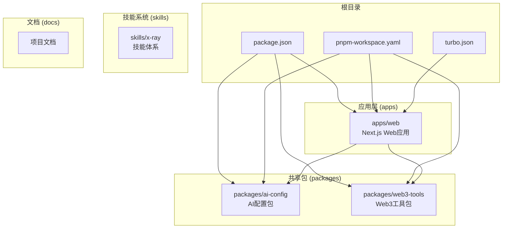
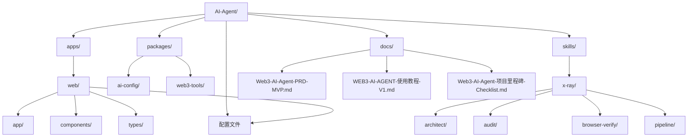
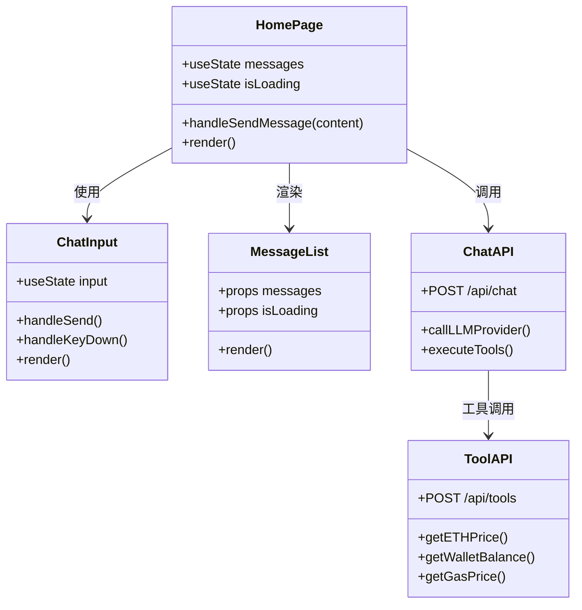
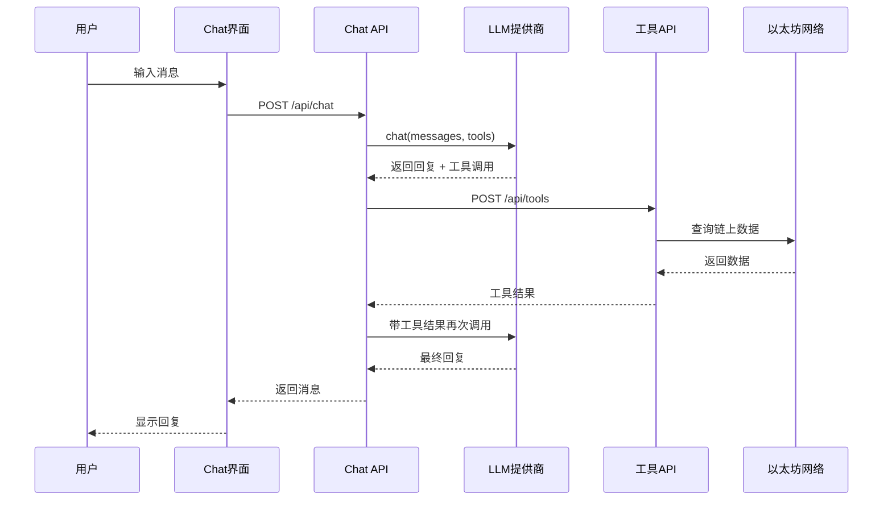
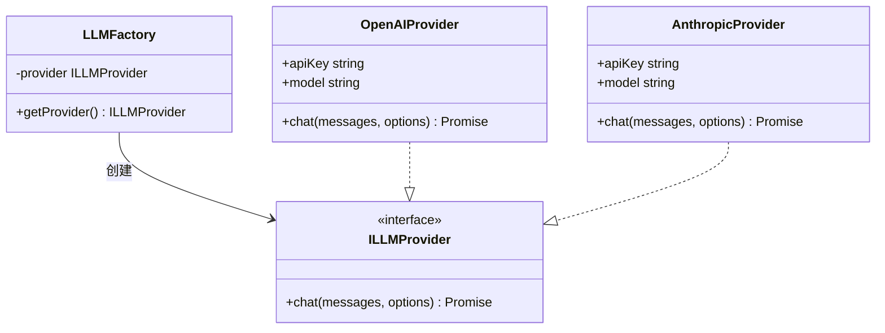
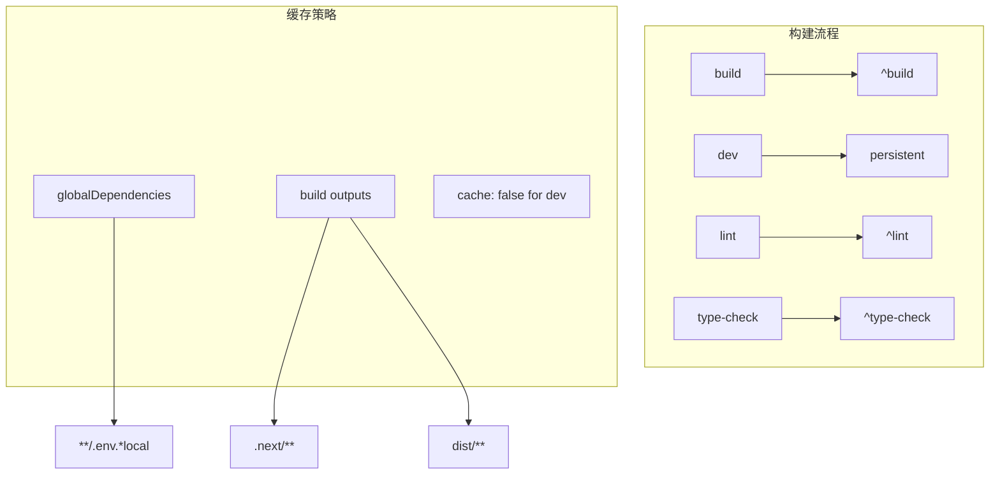
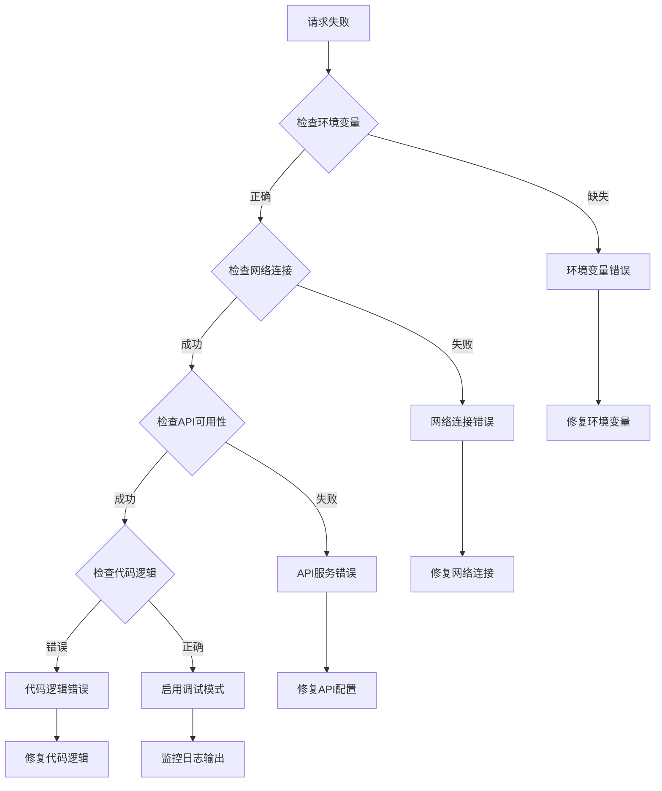

# Monorepo结构

<cite>
**本文档引用的文件**
- [README.md](file://README.md)
- [package.json](file://package.json)
- [pnpm-workspace.yaml](file://pnpm-workspace.yaml)
- [turbo.json](file://turbo.json)
- [apps/web/package.json](file://apps/web/package.json)
- [apps/web/app/layout.tsx](file://apps/web/app/layout.tsx)
- [apps/web/app/page.tsx](file://apps/web/app/page.tsx)
- [apps/web/components/ChatInput.tsx](file://apps/web/components/ChatInput.tsx)
- [apps/web/types/chat.ts](file://apps/web/types/chat.ts)
- [apps/web/app/api/chat/route.ts](file://apps/web/app/api/chat/route.ts)
- [apps/web/app/api/tools/route.ts](file://apps/web/app/api/tools/route.ts)
- [packages/ai-config/package.json](file://packages/ai-config/package.json)
- [packages/web3-tools/package.json](file://packages/web3-tools/package.json)
- [skills/x-ray/MAP-V3.md](file://skills/x-ray/MAP-V3.md)
- [skills/x-ray/SKILL.md](file://skills/x-ray/SKILL.md)
</cite>

## 目录
1. [项目简介](#项目简介)
2. [Monorepo架构概览](#monorepo架构概览)
3. [项目结构详解](#项目结构详解)
4. [核心组件分析](#核心组件分析)
5. [技术栈与依赖关系](#技术栈与依赖关系)
6. [开发工作流](#开发工作流)
7. [性能考虑](#性能考虑)
8. [故障排除指南](#故障排除指南)
9. [总结](#总结)

## 项目简介

Web3 AI Agent是一个面向Web3前端开发者的AI Agent项目，旨在实现从需求定义到代码交付的完整SDLC自动化流程。该项目服务于个人转型目标：从Web3前端工程师升级为AI应用工程师/Agent工程师。

### 核心能力
- **对话能力**：基础聊天界面，支持流式输出
- **Tool Calling**：调用Web3工具获取链上数据
- **Agent Loop**：理解用户意图，自主决策工具调用
- **最小Memory**：保持会话上下文连续性

### 技术栈
- **前端框架**: Next.js 14 + React + TypeScript
- **样式**: Tailwind CSS
- **AI能力**: OpenAI API
- **Web3**: ethers.js
- **开发语言**: TypeScript

**章节来源**
- [README.md:1-93](file://README.md#L1-L93)

## Monorepo架构概览

本项目采用现代化的Monorepo架构，使用pnpm workspace和Turborepo进行管理。整个项目分为四个主要部分：



**图表来源**
- [package.json:1-28](file://package.json#L1-L28)
- [pnpm-workspace.yaml:1-4](file://pnpm-workspace.yaml#L1-L4)
- [turbo.json:1-21](file://turbo.json#L1-L21)

**章节来源**
- [package.json:1-28](file://package.json#L1-L28)
- [pnpm-workspace.yaml:1-4](file://pnpm-workspace.yaml#L1-L4)
- [turbo.json:1-21](file://turbo.json#L1-L21)

## 项目结构详解

### 目录结构分析



**图表来源**
- [README.md:26-38](file://README.md#L26-L38)

### 应用层结构

Web应用位于`apps/web/`目录下，采用标准的Next.js 14项目结构：

- **app/**: Next.js App Router目录，包含API路由和页面组件
- **components/**: 可复用的React组件
- **types/**: TypeScript类型定义
- **public/**: 静态资源文件

**章节来源**
- [README.md:26-38](file://README.md#L26-L38)

## 核心组件分析

### Web应用架构



**图表来源**
- [apps/web/app/page.tsx:1-106](file://apps/web/app/page.tsx#L1-L106)
- [apps/web/components/ChatInput.tsx:1-74](file://apps/web/components/ChatInput.tsx#L1-L74)
- [apps/web/app/api/chat/route.ts:1-180](file://apps/web/app/api/chat/route.ts#L1-L180)
- [apps/web/app/api/tools/route.ts:1-135](file://apps/web/app/api/tools/route.ts#L1-L135)

### 数据流架构



**图表来源**
- [apps/web/app/api/chat/route.ts:76-180](file://apps/web/app/api/chat/route.ts#L76-L180)
- [apps/web/app/api/tools/route.ts:99-135](file://apps/web/app/api/tools/route.ts#L99-L135)

**章节来源**
- [apps/web/app/page.tsx:1-106](file://apps/web/app/page.tsx#L1-L106)
- [apps/web/components/ChatInput.tsx:1-74](file://apps/web/components/ChatInput.tsx#L1-L74)
- [apps/web/types/chat.ts:1-28](file://apps/web/types/chat.ts#L1-L28)

### AI配置系统



**图表来源**
- [packages/ai-config/package.json:1-23](file://packages/ai-config/package.json#L1-L23)

**章节来源**
- [packages/ai-config/package.json:1-23](file://packages/ai-config/package.json#L1-L23)

## 技术栈与依赖关系

### 依赖管理策略

```mermaid
graph LR
subgraph "根依赖"
Pnpm[pnpm 8.15.0]
Turbo[turbo 2.0.0]
TypeScript[TypeScript 5]
end
subgraph "应用依赖"
NextJS[Next.js 14.2.0]
React[React 18.2.0]
Ethers[ethers 6.11.0]
AI[AI 3.0.0]
end
subgraph "共享包依赖"
OpenAI[OpenAI ^4.28.0]
Anthropic[@anthropic-ai/sdk ^0.24.0]
Web3Tools[ethers ^6.11.0]
end
Pnpm --> NextJS
Pnpm --> OpenAI
Pnpm --> Web3Tools
NextJS --> AI
NextJS --> Ethers
AI --> OpenAI
Ethers --> Web3Tools
```

**图表来源**
- [package.json:13-22](file://package.json#L13-L22)
- [apps/web/package.json:12-31](file://apps/web/package.json#L12-L31)
- [packages/ai-config/package.json:13-21](file://packages/ai-config/package.json#L13-L21)
- [packages/web3-tools/package.json:13-21](file://packages/web3-tools/package.json#L13-L21)

### 开发工具链

| 工具 | 版本 | 用途 |
|------|------|------|
| Node.js | >=18.0.0 | 运行时环境 |
| pnpm | 8.15.0 | 包管理器 |
| TypeScript | ^5 | 类型检查 |
| Turborepo | ^2.0.0 | 构建优化 |
| Next.js | 14.2.0 | Web框架 |
| ESLint | ^8 | 代码质量 |
| Tailwind CSS | ^3.4.1 | 样式框架 |

**章节来源**
- [package.json:13-22](file://package.json#L13-L22)
- [apps/web/package.json:12-31](file://apps/web/package.json#L12-L31)

## 开发工作流

### Skill驱动开发流程

```mermaid
flowchart TD
Origin[origin] --> Discover[DISCOVER]
Origin --> Bootstrap[BOOTSTRAP]
Origin --> Define[DEFINE]
Origin --> DeliverFeat[DELIVER-FEAT]
Origin --> DeliverPatch[DELIVER-PATCH]
Origin --> DeliverRefactor[DELIVER-REFACTOR]
Origin --> VerifyGovern[VERIFY/GOVERN]
Discover --> Explore[explore]
Bootstrap --> InitDocs[init-docs]
Bootstrap --> UpdateMap[update-map]
Define --> PM[pm]
Define --> PRD[prd]
Define --> REQ[req]
Define --> CheckIn[check-in]
DeliverFeat --> PipelineFeat[pipeline(FEAT)]
DeliverPatch --> PipelinePatch[pipeline(PATCH)]
DeliverRefactor --> PipelineRefactor[pipeline(REFACTOR)]
PipelineFeat --> PM
PipelineFeat --> PRD
PipelineFeat --> REQ
PipelineFeat --> CheckIn
PipelineFeat --> Architect[architect]
PipelineFeat --> QA[qa]
PipelineFeat --> Coder[coder]
PipelineFeat --> Audit[audit]
PipelineFeat --> Digest[digest]
PipelineFeat --> UpdateMap
PipelinePatch --> REQ
PipelinePatch --> CheckIn
PipelinePatch --> Coder
PipelinePatch --> QA
PipelinePatch --> Digest
PipelinePatch --> UpdateMap
PipelineRefactor --> REQ
PipelineRefactor --> CheckIn
PipelineRefactor --> Architect
PipelineRefactor --> QA
PipelineRefactor --> Coder
PipelineRefactor --> Audit
PipelineRefactor --> Digest
PipelineRefactor --> UpdateMap
```

**图表来源**
- [skills/x-ray/SKILL.md:15-224](file://skills/x-ray/SKILL.md#L15-L224)
- [skills/x-ray/MAP-V3.md:48-211](file://skills/x-ray/MAP-V3.md#L48-L211)

### 开发规范

项目采用Skill驱动的开发流程，具体规范如下：

1. **任何任务从 `origin` 进入** - 使用 `/origin` 命令启动
2. **交付型任务走 pipeline** - `/pipeline feat|patch|refactor`
3. **实施前必须经过 check-in** - 确认问题、边界、方案

**章节来源**
- [README.md:80-85](file://README.md#L80-L85)
- [skills/x-ray/SKILL.md:21-72](file://skills/x-ray/SKILL.md#L21-L72)

## 性能考虑

### 构建优化



**图表来源**
- [turbo.json:1-21](file://turbo.json#L1-L21)

### 性能优化建议

1. **构建缓存**：使用Turborepo的智能缓存机制
2. **增量构建**：仅重新构建受影响的包
3. **并行执行**：利用多核CPU并行处理
4. **依赖共享**：pnpm workspace减少重复安装

**章节来源**
- [turbo.json:1-21](file://turbo.json#L1-L21)

## 故障排除指南

### 常见问题诊断



### 错误处理策略

1. **配置错误**：区分模型配置错误和其他错误
2. **网络错误**：重试机制和超时处理
3. **工具调用错误**：优雅降级和错误提示
4. **内存管理**：及时清理无用数据

**章节来源**
- [apps/web/app/api/chat/route.ts:162-179](file://apps/web/app/api/chat/route.ts#L162-L179)
- [apps/web/app/api/tools/route.ts:124-134](file://apps/web/app/api/tools/route.ts#L124-L134)

## 总结

Web3 AI Agent项目展现了现代Monorepo架构的最佳实践。通过合理的目录组织、清晰的职责分离和完善的开发工作流，该项目为Web3 AI Agent的开发提供了坚实的基础。

### 关键优势

1. **模块化设计**：清晰的包边界和依赖关系
2. **开发效率**：Turborepo加速构建和缓存优化
3. **可扩展性**：Skill驱动的工作流支持持续迭代
4. **技术先进**：采用最新的Next.js 14和TypeScript生态

### 发展方向

1. **功能扩展**：增加更多Web3工具和AI能力
2. **性能优化**：进一步优化构建和运行时性能
3. **测试完善**：建立完整的测试体系
4. **文档优化**：持续改进开发文档和使用指南