# 技能系统架构

<cite>
**本文引用的文件**
- [MAP-V3.md](file://skills/x-ray/MAP-V3.md)
- [SKILL-SYSTEM-DESIGN-V3.md](file://skills/x-ray/SKILL-SYSTEM-DESIGN-V3.md)
- [COMMANDS.md](file://skills/x-ray/COMMANDS.md)
- [2026-04-23-feat-ui-enhancements-and-theme-system.md](file://docs/changelog/2026-04-23-feat-ui-enhancements-and-theme-system.md)
- [2026-04-28-feat-p1-completion.md](file://docs/changelog/2026-04-28-feat-p1-completion.md)
- [2026-04-28-feat-unit-test-coverage.md](file://docs/changelog/2026-04-28-feat-unit-test-coverage.md)
- [PROJECT-CHECKLIST.md](file://docs/checklist/PROJECT-CHECKLIST.md)
- [ThemeContext.tsx](file://apps/web/lib/theme/ThemeContext.tsx)
- [ThemeProvider.tsx](file://apps/web/lib/theme/ThemeProvider.tsx)
- [ConfirmDialog.tsx](file://apps/web/components/ConfirmDialog.tsx)
- [route.ts](file://apps/web/app/api/chat/route.ts)
- [ThemeSwitcher.tsx](file://apps/web/components/ThemeSwitcher.tsx)
- [ConversationHistory.tsx](file://apps/web/components/ConversationHistory.tsx)
- [page.tsx](file://apps/web/app/page.tsx)
- [useChatStream.ts](file://apps/web/hooks/useChatStream.ts)
- [SlidingWindowMemory.ts](file://apps/web/lib/memory/SlidingWindowMemory.ts)
- [SummaryCompressionMemory.ts](file://apps/web/lib/memory/SummaryCompressionMemory.ts)
- [types.ts](file://apps/web/lib/memory/types.ts)
- [config.ts](file://apps/web/lib/memory/config.ts)
- [index.ts](file://apps/web/lib/memory/index.ts)
- [package.json](file://packages/web3-tools/package.json)
- [index.ts](file://packages/web3-tools/src/index.ts)
- [price.ts](file://packages/web3-tools/src/price.ts)
- [balance.ts](file://packages/web3-tools/src/balance.ts)
- [gas.ts](file://packages/web3-tools/src/gas.ts)
- [types.ts](file://packages/web3-tools/src/types.ts)
- [route.ts](file://apps/web/app/api/tools/route.ts)
- [tsconfig.json](file://packages/web3-tools/tsconfig.json)
- [turbo.json](file://turbo.json)
- [ARCHITECTURE.md](file://ARCHITECTURE.md)
</cite>

## 更新摘要
**所做更改**
- 更新技能地图显示P1任务全量交付完成，反映实际开发进度和能力达成情况
- 新增安全加固模块的完整架构说明，包括RLS升级方案、服务端所有权验证API
- 更新测试覆盖体系，包含E2E测试从9个增加到18个，单元测试238个用例100%通过
- 补充浏览器验收测试7/7通过的完成状态
- 更新钱包地址格式验证机制，包括路由层和客户端双重验证
- 完善SSR主题闪烁修复的技术实现和效果
- 更新项目治理改进，包括项目检查清单的P1任务状态更新

## 目录
1. [简介](#简介)
2. [项目结构](#项目结构)
3. [核心组件](#核心组件)
4. [架构总览](#架构总览)
5. [详细组件分析](#详细组件分析)
6. [UI/UX增强系统](#uiux增强系统)
7. [主题系统架构](#主题系统架构)
8. [钱包上下文注入](#钱包上下文注入)
9. [内存管理系统](#内存管理系统)
10. [Web3工具重构](#web3工具重构)
11. [安全加固系统](#安全加固系统)
12. [测试覆盖体系](#测试覆盖体系)
13. [依赖分析](#依赖分析)
14. [性能考量](#性能考量)
15. [故障排查指南](#故障排查指南)
16. [结论](#结论)
17. [附录](#附录)

## 简介
本架构文档面向架构师与高级开发者，系统化解析Web3 AI Agent技能系统V3的设计理念与实现蓝图。该系统以"文档驱动 + 流程型多技能 + 门禁式质量控制"为核心，构建可路由、可裁剪、可回退的技能操作系统，覆盖从探索、定义、交付到治理的全生命周期。V3版本将系统从单一流水线升级为可分流的操作系统，通过七类任务类型和三层执行深度，实现高效的质量控制和知识沉淀。

**更新** 本次更新重点反映了P1任务全量交付完成的里程碑，包括RLS安全升级、E2E测试覆盖完善、浏览器验收通过、单元测试体系建立等关键成果。技能地图显示已完成能力清单包含100%的MVP核心功能，用户体验得到全面提升，系统在保持原有架构优势的基础上，进一步增强了安全性、稳定性和可维护性。

## 项目结构
技能系统位于skills/x-ray目录，采用"设计稿 + 地图 + 命令约定 + 模板规范 + 单模块技能定义"的结构化组织方式，每个技能模块都有独立的SKILL.md文件定义其职责、输入输出和执行规则。新增的安全加固系统、测试覆盖体系和浏览器验收功能，形成了更加完整的前端架构，包含ConfirmDialog组件、主题系统、钱包上下文注入等核心功能模块。

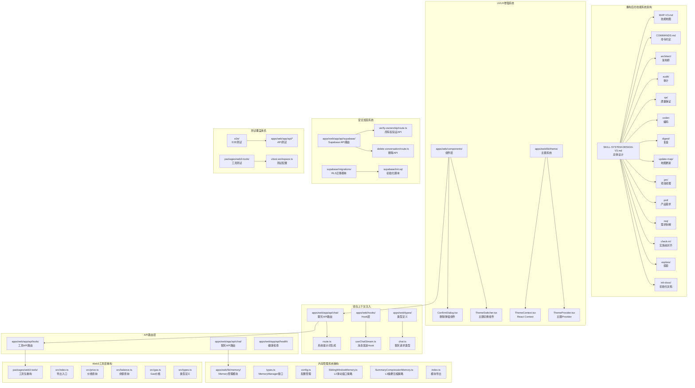

**图表来源**
- [MAP-V3.md:154-186](file://skills/x-ray/MAP-V3.md#L154-L186)
- [2026-04-23-feat-ui-enhancements-and-theme-system.md:17-22](file://docs/changelog/2026-04-23-feat-ui-enhancements-and-theme-system.md#L17-L22)
- [2026-04-28-feat-p1-completion.md:21-28](file://docs/changelog/2026-04-28-feat-p1-completion.md#L21-L28)
- [2026-04-28-feat-unit-test-coverage.md:38-51](file://docs/changelog/2026-04-28-feat-unit-test-coverage.md#L38-L51)
- [ThemeContext.tsx:1-21](file://apps/web/lib/theme/ThemeContext.tsx#L1-L21)
- [ThemeProvider.tsx:1-83](file://apps/web/lib/theme/ThemeProvider.tsx#L1-L83)
- [ConfirmDialog.tsx:1-101](file://apps/web/components/ConfirmDialog.tsx#L1-L101)
- [route.ts:150-160](file://apps/web/app/api/chat/route.ts#L150-L160)
- [useChatStream.ts:64-69](file://apps/web/hooks/useChatStream.ts#L64-L69)

**章节来源**
- [MAP-V3.md:1-522](file://skills/x-ray/MAP-V3.md#L1-L522)
- [SKILL-SYSTEM-DESIGN-V3.md:1-719](file://skills/x-ray/SKILL-SYSTEM-DESIGN-V3.md#L1-L719)
- [COMMANDS.md:1-81](file://skills/x-ray/COMMANDS.md#L1-L81)
- [ARCHITECTURE.md:40-159](file://ARCHITECTURE.md#L40-L159)

## 核心组件

### 五层技能架构
V3版本将技能系统重新组织为五个层次，每个层次都有明确的职责边界：

**入口层** (`origin`, `pipeline`)
- 负责任务类型识别和二级路由分流
- 仅对交付型任务进入pipeline

**定义层** (`pm`, `prd`, `req`, `check-in`)
- 从模糊意图到清晰任务的转换
- 实施前对齐点，强制门禁

**交付层** (`architect`, `qa`, `coder`, `audit`)
- 设计、验证、实现、风险审计
- 核心执行链路

**治理层** (`digest`, `update-map`)
- 经验沉淀和状态更新
- 交付闭环

**辅助层** (`explore`, `init-docs`, `browser-verify`, `resolve-doc-conflicts`)
- 只读探索、初始化、验收、冲突治理
- 不与主交付链混用

**章节来源**
- [SKILL-SYSTEM-DESIGN-V3.md:164-220](file://skills/x-ray/SKILL-SYSTEM-DESIGN-V3.md#L164-L220)
- [SKILL-SYSTEM-DESIGN-V3.md:439-601](file://skills/x-ray/SKILL-SYSTEM-DESIGN-V3.md#L439-L601)
- [SKILL-SYSTEM-DESIGN-V3.md:696-719](file://skills/x-ray/SKILL-SYSTEM-DESIGN-V3.md#L696-L719)

### 七类任务模型
V3不再局限于传统的FEAT/PATCH/REFACTOR三类，而是定义了七种任务类型：

**DISCOVER** (`explore`)
- 只读探索，不进入交付链
- 适用于新人熟悉项目、查询模块、定位代码

**BOOTSTRAP** (`init-docs` -> `update-map`)
- 新项目初始化和文档重建
- 建立初始地图、索引、基础文档网络

**DEFINE** (`pm`/`prd`/`req` -> `check-in`)
- 目标模糊到清晰任务的转换
- 价值对齐和范围定义

**DELIVER-FEAT** (L3全流程)
- 新功能、新模块、新能力
- 完整的FEAT流程：pm(按需) -> prd -> req -> check-in -> architect -> qa -> coder -> audit -> digest -> update-map

**DELIVER-PATCH** (L1快速流程)
- bug修复、回归修复、边界case修复
- 快速修复流程：req -> check-in -> coder -> qa -> digest -> update-map

**DELIVER-REFACTOR** (L2设计优先)
- 重构、模块拆分、性能优化
- 设计优先流程：req -> check-in -> architect -> qa -> coder -> audit -> digest -> update-map

**VERIFY/GOVERN** (治理)
- 浏览器验收、文档冲突解决、发布前复核
- 验证和治理流程：qa -> audit -> browser-verify -> resolve-doc-conflicts -> digest -> update-map

**章节来源**
- [SKILL-SYSTEM-DESIGN-V3.md:45-161](file://skills/x-ray/SKILL-SYSTEM-DESIGN-V3.md#L45-L161)
- [MAP-V3.md:177-201](file://skills/x-ray/MAP-V3.md#L177-L201)

## 架构总览
V3系统以"route -> define(按需) -> check-in -> design(按需) -> build -> closeout"为主线，将主链路抽象为6段，既保证交付效率，又保留文档沉淀与质量控制。

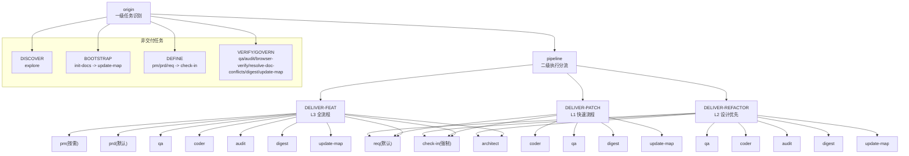

**图表来源**
- [MAP-V3.md:3-129](file://skills/x-ray/MAP-V3.md#L3-L129)
- [SKILL-SYSTEM-DESIGN-V3.md:265-393](file://skills/x-ray/SKILL-SYSTEM-DESIGN-V3.md#L265-L393)

**章节来源**
- [MAP-V3.md:1-522](file://skills/x-ray/MAP-V3.md#L1-L522)
- [SKILL-SYSTEM-DESIGN-V3.md:265-393](file://skills/x-ray/SKILL-SYSTEM-DESIGN-V3.md#L265-L393)

## 详细组件分析

### 路由与调度机制

#### 一级路由：origin任务识别
`origin`技能负责识别七种任务类型：
- DISCOVER：explore
- BOOTSTRAP：init-docs -> update-map  
- DEFINE：pm/prd/req -> check-in
- DELIVER-*：进入pipeline分流
- VERIFY/GOVERN：qa/audit/browser-verify/resolve-doc-conflicts/digest/update-map

#### 二级路由：pipeline执行分流
只有DELIVER-FEAT/PATCH/REFACTOR三类任务进入pipeline，每类任务都有不同的执行深度和必经技能。

#### check-in门禁机制
check-in是实施前对齐点，强制适用于：
- DELIVER-FEAT、DELIVER-PATCH、DELIVER-REFACTOR
- DEFINE中准备进入实施的任务

**章节来源**
- [MAP-V3.md:86-157](file://skills/x-ray/MAP-V3.md#L86-L157)
- [SKILL-SYSTEM-DESIGN-V3.md:222-263](file://skills/x-ray/SKILL-SYSTEM-DESIGN-V3.md#L222-L263)

### 质量控制与执行硬规则

#### QA红绿灯规则
- FEAT默认先执行RED模式，证明"当前未通过"
- PATCH/REFACTOR默认保留验证或回归检查
- RED模式最多运行2次，验证阶段先负责RED

#### Coder自愈规则
- coder负责把QA的RED变成GREEN
- 最多10轮自愈循环，超限输出STUCK报告并人工介入
- 超过10轮仍未通过，必须终止并输出卡住原因

#### Audit评分规则
- 完整评分100分：需求一致性25分、结构契约一致性15分、安全风险20分、代码质量15分、回归风险10分、文档收尾10分、场景治理5分
- >=80：通过
- 60-79：软拒绝，回退coder修正
- <60：直接拒绝，当前方案废弃
- 严重安全问题、关键不变量破坏、高风险边界缺失可一票否决

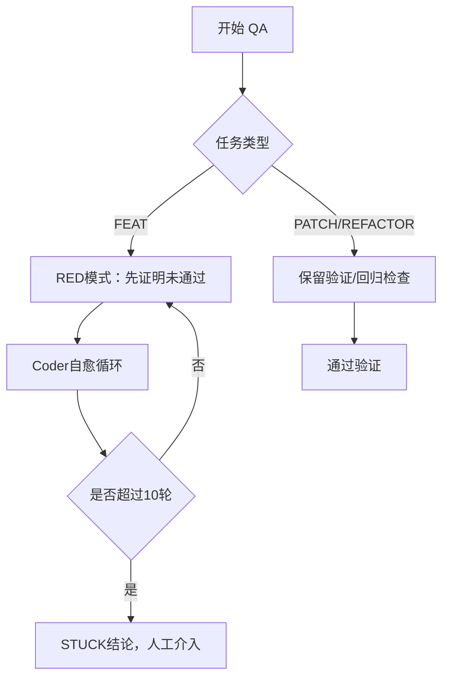

**图表来源**
- [SKILL-SYSTEM-DESIGN-V3.md:700-719](file://skills/x-ray/SKILL-SYSTEM-DESIGN-V3.md#L700-L719)

**章节来源**
- [SKILL-SYSTEM-DESIGN-V3.md:700-719](file://skills/x-ray/SKILL-SYSTEM-DESIGN-V3.md#L700-L719)

### 技能模块详细职责

#### 定义层技能
**PM技能**：目标模糊时的价值定义，明确用户、痛点、价值主张和MVP范围

**PRD技能**：正式范围定义，明确做什么、不做什么、验收标准和风险边界

**REQ技能**：最小可执行任务卡拆解，明确影响范围、依赖关系和验收条件

**Check-in技能**：实施前对齐点，强制输出问题、上下文、方案、不做什么、产物、完成标准、下一跳

#### 交付层技能
**Architect技能**：模块边界、接口契约、数据/消息流设计，支持最多10轮自愈

**QA技能**：验证策略定义，FEAT先RED后GREEN，PATCH/REFACTOR保留回归检查

**Coder技能**：实施落地，最多10轮自愈循环，超限输出STUCK报告

**Audit技能**：风险审计，支持轻审和重审两种模式，默认分轻重

#### 治理层技能
**Digest技能**：阶段沉淀，记录完成项、问题、经验和后续建议

**Update-Map技能**：状态更新，维护当前项目状态和下一步入口

#### 辅助层技能
**Explore技能**：只读探索，不进入交付链

**Init-Docs技能**：新项目初始化文档体系

**Browser-Verify技能**：浏览器层验收

**Resolve-Doc-Conflicts技能**：文档冲突治理

**章节来源**
- [SKILL-SYSTEM-DESIGN-V3.md:439-601](file://skills/x-ray/SKILL-SYSTEM-DESIGN-V3.md#L439-L601)
- [SKILL-SYSTEM-DESIGN-V3.md:696-719](file://skills/x-ray/SKILL-SYSTEM-DESIGN-V3.md#L696-L719)

## UI/UX增强系统

### ConfirmDialog组件架构
ConfirmDialog是一个自定义确认弹窗组件，用于替代原生confirm()弹窗，提供更好的用户体验：

**核心特性**
- 紫色主题设计，符合品牌色彩
- 支持ESC键关闭和点击遮罩关闭
- 支持Loading状态，防止重复点击
- 支持三种变体：danger、warning、info
- 毛玻璃背景效果，提升视觉层次

**接口设计**
```typescript
interface ConfirmDialogProps {
  isOpen: boolean
  title: string
  message: string
  confirmText?: string
  cancelText?: string
  variant?: 'danger' | 'warning' | 'info'
  isLoading?: boolean
  onConfirm: () => void
  onCancel: () => void
}
```

**实现细节**
- 使用useEffect监听键盘事件，支持ESC键关闭
- 通过stopPropagation阻止点击事件冒泡
- 支持三种按钮样式，对应不同操作风险等级
- Loading状态下禁用按钮，防止重复提交

**章节来源**
- [ConfirmDialog.tsx:1-101](file://apps/web/components/ConfirmDialog.tsx#L1-L101)
- [2026-04-23-feat-ui-enhancements-and-theme-system.md:118-148](file://docs/changelog/2026-04-23-feat-ui-enhancements-and-theme-system.md#L118-L148)

### ConversationHistory组件集成
ConfirmDialog与ConversationHistory组件深度集成，提供完整的删除交互体验：

**集成特性**
- 导入ConfirmDialog组件
- 添加`showDeleteDialog`和`pendingDeleteId`状态
- 拆分`handleDelete`（打开弹窗）和`handleDeleteConfirm`（执行删除）
- 替换原生`confirm()`调用
- 添加`isDeleting`状态管理Loading

**状态管理**
- `showDeleteDialog`: 控制弹窗显示/隐藏
- `pendingDeleteId`: 标记待删除的对话ID
- `isDeleting`: 删除操作的Loading状态
- `deleteError`: 删除失败的错误信息

**章节来源**
- [2026-04-23-feat-ui-enhancements-and-theme-system.md:127-148](file://docs/changelog/2026-04-23-feat-ui-enhancements-and-theme-system.md#L127-L148)
- [ConversationHistory.tsx](file://apps/web/components/ConversationHistory.tsx)

### 断开连接清空对话机制
钱包断开连接时的用户体验优化，实现客户端UI清空与云端数据保留的平衡：

**核心流程**
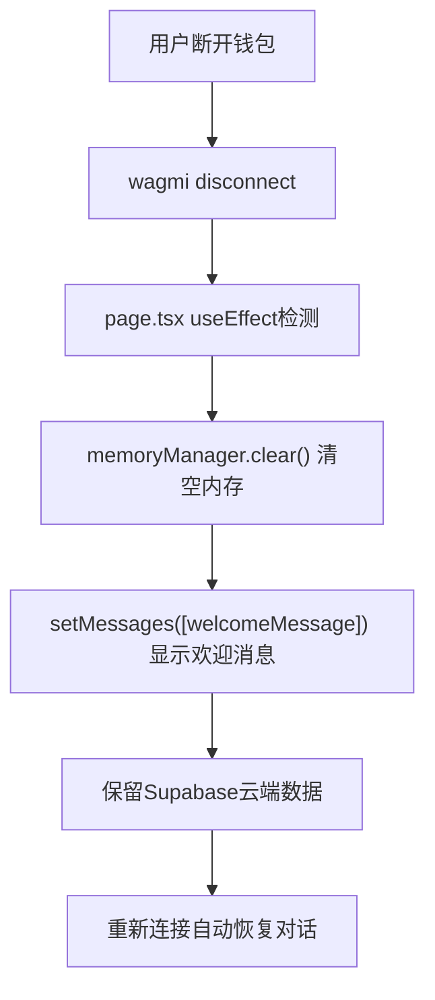

**图表来源**
- [2026-04-23-feat-ui-enhancements-and-theme-system.md:96-104](file://docs/changelog/2026-04-23-feat-ui-enhancements-and-theme-system.md#L96-L104)

**实现细节**
- 客户端UI清空：memoryManager.clear() + 欢迎消息
- 云端数据保留：不调用删除API，对话历史保留在Supabase
- 自动恢复：重新连接时loadConversationHistory(address)

**章节来源**
- [2026-04-23-feat-ui-enhancements-and-theme-system.md:149-158](file://docs/changelog/2026-04-23-feat-ui-enhancements-and-theme-system.md#L149-L158)

## 主题系统架构

### ThemeContext设计
ThemeContext提供React Context API，管理全局主题状态：

**核心接口**
```typescript
interface ThemeContextType {
  theme: ThemeMode
  setTheme: (theme: ThemeMode) => void
  resolvedTheme: ResolvedTheme
}

type ThemeMode = 'light' | 'dark' | 'system'
type ResolvedTheme = 'light' | 'dark'
```

**实现特点**
- 使用useContext确保在ThemeProvider内部使用
- 提供错误处理，防止在Provider外部使用
- 支持三种主题模式：light、dark、system

**章节来源**
- [ThemeContext.tsx:1-21](file://apps/web/lib/theme/ThemeContext.tsx#L1-L21)
- [2026-04-23-feat-ui-enhancements-and-theme-system.md:55-63](file://docs/changelog/2026-04-23-feat-ui-enhancements-and-theme-system.md#L55-L63)

### ThemeProvider实现
ThemeProvider是主题系统的Provider组件，负责主题状态管理和DOM更新：

**核心功能**
- localStorage持久化主题偏好
- 系统主题监听（prefers-color-scheme）
- HTML属性更新（data-theme）
- Tailwind darkMode支持

**实现细节**
```typescript
// 初始化主题
const savedTheme = localStorage.getItem(THEME_STORAGE_KEY) as ThemeMode | null
const initialTheme = savedTheme || 'dark'

// 解析主题（system模式跟随系统）
const resolveTheme = useCallback((mode: ThemeMode): ResolvedTheme => {
  if (mode === 'system') {
    return window.matchMedia('(prefers-color-scheme: dark)').matches ? 'dark' : 'light'
  }
  return mode
}, [])

// 更新DOM和状态
useEffect(() => {
  const resolved = resolveTheme(theme)
  setResolvedTheme(resolved)
  
  // 更新HTML属性
  document.documentElement.setAttribute('data-theme', resolved)
  
  // 同步添加/移除 dark class
  if (resolved === 'dark') {
    document.documentElement.classList.add('dark')
  } else {
    document.documentElement.classList.remove('dark')
  }
  
  // 存储到localStorage
  localStorage.setItem(THEME_STORAGE_KEY, theme)
}, [theme, resolveTheme])
```

**章节来源**
- [ThemeProvider.tsx:1-83](file://apps/web/lib/theme/ThemeProvider.tsx#L1-L83)
- [2026-04-23-feat-ui-enhancements-and-theme-system.md:160-175](file://docs/changelog/2026-04-23-feat-ui-enhancements-and-theme-system.md#L160-L175)

### CSS变量主题系统
全局CSS变量架构，支持Light/Dark/System三种主题模式：

**变量定义**
- `:root`：默认浅色主题变量
- `[data-theme='dark']`：深色主题变量
- `[data-theme='light']`：浅色主题变量

**变量集**
- 背景颜色：`--bg-primary`, `--bg-secondary`, `--bg-tertiary`
- 文字颜色：`--text-primary`, `--text-secondary`
- 边框颜色：`--border-color`
- 强调色：`--primary-color`, `--secondary-color`
- 滚动条：`--scrollbar-color`
- 代码块：`--code-bg`

**动画支持**
- `transition-colors duration-300` 平滑过渡
- 每个组件使用CSS变量，自动适配主题

**章节来源**
- [2026-04-23-feat-ui-enhancements-and-theme-system.md:182-187](file://docs/changelog/2026-04-23-feat-ui-enhancements-and-theme-system.md#L182-L187)

### 全局组件主题适配
主题系统与全局组件深度集成，确保一致的视觉体验：

**适配组件**
- `apps/web/app/page.tsx`：背景渐变、装饰元素、Header样式
- `apps/web/components/ChatInput.tsx`：输入框、按钮、禁用状态
- `apps/web/components/ConversationHistory.tsx`：侧边栏、对话项、删除按钮
- `apps/web/components/SettingsPanel.tsx`：面板背景、Memory策略卡片
- `apps/web/components/ThemeSwitcher.tsx`：主题切换按钮

**实现方式**
- 使用CSS变量替代硬编码颜色
- 通过`data-theme`属性自动切换
- 支持系统主题跟随（prefers-color-scheme）

**章节来源**
- [2026-04-23-feat-ui-enhancements-and-theme-system.md:188-217](file://docs/changelog/2026-04-23-feat-ui-enhancements-and-theme-system.md#L188-L217)

## 钱包上下文注入

### 系统提示词动态生成
AI能够自动感知用户钱包地址，简化余额查询等操作：

**核心流程**
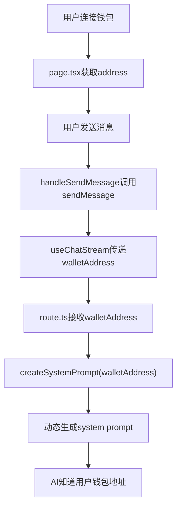

**图表来源**
- [2026-04-23-feat-ui-enhancements-and-theme-system.md:84-94](file://docs/changelog/2026-04-23-feat-ui-enhancements-and-theme-system.md#L84-L94)

**实现细节**
- `SYSTEM_PROMPT_BASE`：基础系统提示词
- `createSystemPrompt(walletAddress?: string)`：动态生成带钱包上下文的提示词
- 无钱包地址时返回基础提示词
- 有钱包地址时注入"当前用户信息"段落

**章节来源**
- [route.ts:135-148](file://apps/web/app/api/chat/route.ts#L135-L148)
- [2026-04-23-feat-ui-enhancements-and-theme-system.md:218-240](file://docs/changelog/2026-04-23-feat-ui-enhancements-and-theme-system.md#L218-L240)

### 类型定义扩展
聊天请求类型扩展，支持可选的walletAddress参数：

**类型定义**
```typescript
interface ChatRequest {
  messages: Array<{ role: string; content: string }>
  walletAddress?: string  // 新增可选字段
}
```

**Hook接口扩展**
```typescript
sendMessage: (
  messages: Array<{ role: string; content: string }>,
  walletAddress?: string  // 新增可选参数
) => Promise<{ content: string; toolCalls: ToolCallUIState[] }>
```

**实现方式**
- 所有新增字段均为可选，保持向后兼容
- 仅在用户已连接钱包时传递地址
- AI自动使用当前地址进行余额查询

**章节来源**
- [2026-04-23-feat-ui-enhancements-and-theme-system.md:26-69](file://docs/changelog/2026-04-23-feat-ui-enhancements-and-theme-system.md#L26-L69)

## 内存管理系统

### MemoryManager接口设计
内存管理系统采用Strategy模式，通过统一的MemoryManager接口抽象不同策略实现，支持L2滑动窗口和L3摘要压缩两种策略：

**接口契约**
```typescript
interface MemoryManager {
  addMessage(message: Message): void
  getMessages(): Message[]
  shouldCompress(): boolean
  compress(): Promise<void>
  clear(): void
}
```

**策略模式优势**
- 支持L2/L3/L4策略无缝切换
- 符合开闭原则（对扩展开放，对修改封闭）
- 便于单元测试（可Mock不同策略）
- 统一的配置管理机制

**章节来源**
- [types.ts:12-37](file://apps/web/lib/memory/types.ts#L12-L37)
- [2026-04-21-feat-l2-sliding-window.md:21-31](file://docs/changelog/2026-04-21-feat-l2-sliding-window.md#L21-L31)

### L2滑动窗口策略实现
L2滑动窗口策略是最简单的策略实现，只保留最近N条消息，超出窗口的历史消息直接丢弃：

**核心特性**
- 实现简单，无额外LLM调用
- Token消耗固定，适合短对话场景
- 早期信息完全丢失，不适合长对话
- 默认窗口大小为5条消息

**实现细节**
```typescript
class SlidingWindowMemory implements MemoryManager {
  private messages: Message[] = []
  private windowSize: number
  
  constructor(config?: Partial<MemoryConfig>) {
    const mergedConfig = createMemoryConfig(config)
    this.windowSize = mergedConfig.keepRecentCount  // 复用keepRecentCount作为窗口大小
  }
  
  getMessages(): Message[] {
    return this.messages.slice(-this.windowSize)  // 返回最近N条消息
  }
  
  shouldCompress(): boolean {
    return false  // 滑动窗口无需压缩
  }
}
```

**风险控制**
- 早期信息完全丢失风险：仅适用于短对话场景
- 窗口大小配置不当：可通过环境变量调整，默认5条

**章节来源**
- [SlidingWindowMemory.ts:1-57](file://apps/web/lib/memory/SlidingWindowMemory.ts#L1-L57)
- [2026-04-21-feat-l2-sliding-window.md:50-55](file://docs/changelog/2026-04-21-feat-l2-sliding-window.md#L50-L55)

### L3摘要压缩策略实现
L3摘要压缩策略在单次对话内定期将早期历史消息合并为摘要，降低Token消耗≥50%：

**核心特性**
- 固定条数触发压缩（默认10条）
- 保留最近N条原始消息（默认5条）
- 异步压缩机制，不影响用户体验
- 摘要作为system消息，LLM赋予高权重

**实现细节**
```typescript
class SummaryCompressionMemory implements MemoryManager {
  private originalMessages: Message[] = []
  private summary: string | null = null
  private config: MemoryConfig
  private isCompressing: boolean = false
  
  getMessages(): Message[] {
    const messages: Message[] = []
    
    // 如果有摘要，添加为system消息
    if (this.summary) {
      messages.push({
        id: 'summary',
        role: 'system',
        content: `[对话摘要] ${this.summary}`,
        timestamp: Date.now(),
      })
    }
    
    // 添加最近的N条原始消息
    const recentMessages = this.originalMessages.slice(-this.config.keepRecentCount)
    messages.push(...recentMessages)
    
    return messages
  }
}
```

**压缩流程**
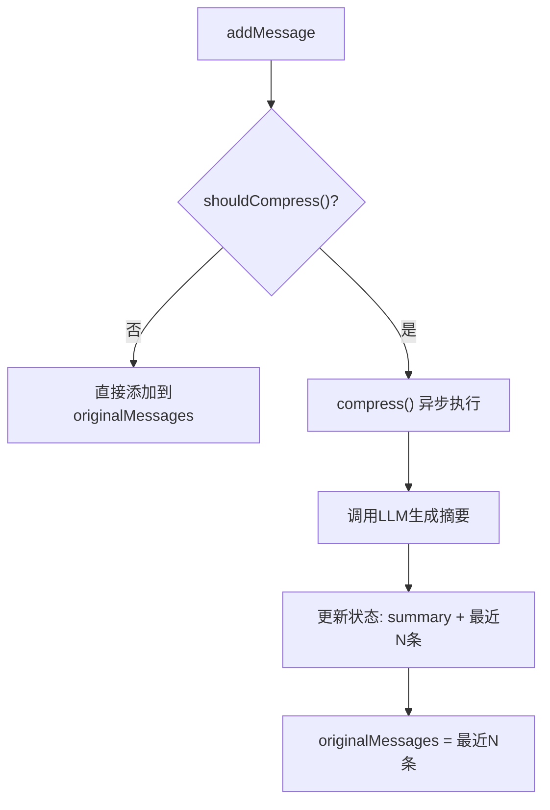

**图表来源**
- [SummaryCompressionMemory.ts:48-74](file://apps/web/lib/memory/SummaryCompressionMemory.ts#L48-L74)

**风险控制**
- 摘要信息丢失：保留最近5条原始消息
- 压缩失败：降级保留完整历史，下次重试
- 并发压缩：使用isCompressing标志位防护

**章节来源**
- [SummaryCompressionMemory.ts:1-111](file://apps/web/lib/memory/SummaryCompressionMemory.ts#L1-L111)
- [2026-04-21-feat-memory-management.md:70-77](file://docs/changelog/2026-04-21-feat-memory-management.md#L70-L77)

### 配置化管理机制
内存管理系统采用配置化设计，支持环境变量驱动和工厂模式：

**配置接口**
```typescript
interface MemoryConfig {
  compressThreshold: number    // 触发压缩的消息数阈值（默认10）
  keepRecentCount: number      // 保留的最近消息数（默认5）
  summaryModel?: string        // 摘要用模型（可选）
}
```

**默认配置**
- compressThreshold: 10（消息数）
- keepRecentCount: 5（条数）
- summaryModel: undefined（继承全局配置）

**工厂函数**
```typescript
export function createMemoryConfig(overrides?: Partial<MemoryConfig>): MemoryConfig {
  return {
    ...defaultMemoryConfig,
    ...overrides,
  }
}
```

**章节来源**
- [types.ts:3-10](file://apps/web/lib/memory/types.ts#L3-L10)
- [config.ts:1-15](file://apps/web/lib/memory/config.ts#L1-L15)

### 前端集成与使用
当前前端仅使用L3摘要压缩策略，L2滑动窗口策略待后续添加切换UI：

**页面集成**
```typescript
// 初始化 MemoryManager
const [memoryManager] = useState(() => new SummaryCompressionMemory())

// 添加用户消息
memoryManager.addMessage(userMessage)

// 获取上下文消息
const contextMessages = memoryManager.getMessages()

// 添加AI回复
memoryManager.addMessage(assistantMessage)
```

**章节来源**
- [page.tsx:20-21](file://apps/web/app/page.tsx#L20-L21)
- [page.tsx:52](file://apps/web/app/page.tsx#L52)
- [page.tsx:73](file://apps/web/app/page.tsx#L73)
- [page.tsx:97](file://apps/web/app/page.tsx#L97)

### 技术决策与性能考量

#### 为什么选择Strategy模式？
- ✅ 支持L2/L3/L4策略无缝切换
- ✅ 符合开闭原则（对扩展开放，对修改封闭）
- ✅ 便于单元测试（可Mock不同策略）

#### 为什么复用keepRecentCount作为窗口大小？
- ✅ 减少配置项，降低复杂度
- ✅ L2/L3窗口语义一致（都是"保留最近N条"）

#### 为什么shouldCompress()返回false？
- ✅ 滑动窗口策略无需压缩
- ✅ 符合接口契约（提供安全的空实现，而非抛异常）

**章节来源**
- [2026-04-21-feat-l2-sliding-window.md:76-87](file://docs/changelog/2026-04-21-feat-l2-sliding-window.md#L76-L87)
- [2026-04-21-feat-memory-management.md:119-123](file://docs/changelog/2026-04-21-feat-memory-management.md#L119-L123)

## Web3工具重构

### 工具包架构设计
Web3工具重构完成后，形成了高度模块化的工具包架构，采用统一的导出入口和类型定义系统：

**模块化设计**
- `src/index.ts` 作为统一导出入口，集中暴露所有工具函数
- 每个工具功能独立封装在对应的模块文件中
- 统一的类型定义确保类型安全和IDE支持

**类型安全系统**
- `src/types.ts` 定义了完整的工具结果类型和数据接口
- 每个工具函数都返回标准化的 `ToolResult<T>` 结构
- 强类型约束确保工具调用的一致性和可靠性

**章节来源**
- [package.json:1-24](file://packages/web3-tools/package.json#L1-L24)
- [index.ts:1-7](file://packages/web3-tools/src/index.ts#L1-L7)
- [types.ts:1-34](file://packages/web3-tools/src/types.ts#L1-L34)

### 工具实现细节

#### 价格查询工具
`getETHPrice()` 提供多数据源容错的价格查询功能：
- 支持 Binance 和 Huobi 两个主要数据源
- 自动代理配置支持国内网络访问
- 10秒超时保护和错误降级机制
- 标准化的价格数据结构包含24小时涨跌幅

#### 钱包余额查询
`getWalletBalance()` 提供以太坊钱包余额查询：
- 地址格式验证确保输入有效性
- 支持自定义RPC节点配置
- 使用ethers.js进行链上查询
- 标准化的余额数据结构

#### Gas价格查询
`getGasPrice()` 提供当前网络Gas价格信息：
- 支持EIP-1559 Fee Market结构
- 返回传统gasPrice和新式费用参数
- 支持自定义RPC节点配置

**章节来源**
- [price.ts:1-84](file://packages/web3-tools/src/price.ts#L1-L84)
- [balance.ts:1-53](file://packages/web3-tools/src/balance.ts#L1-L53)
- [gas.ts:1-43](file://packages/web3-tools/src/gas.ts#L1-L43)

### API路由集成
重构后的Web3工具通过Next.js API路由进行集成：

**路由设计**
- `/api/tools` 路由统一处理所有Web3工具调用
- 支持动态工具名称和参数传递
- 标准化的错误处理和响应格式
- 内置超时保护和异常捕获

**安全机制**
- 工具调用参数验证
- 错误响应标准化
- 异常情况下的优雅降级
- 日志记录和调试支持

**章节来源**
- [route.ts:1-46](file://apps/web/app/api/tools/route.ts#L1-L46)

### 构建配置优化
重构后的项目采用了现代化的构建配置：

**TypeScript配置**
- ES2020目标和ESNext模块解析
- 严格模式确保类型安全
- 声明文件自动生成
- Bundler模块解析优化

**构建脚本**
- tsup编译器支持CJS和ESM格式
- 开发模式自动监听文件变更
- 类型检查独立执行
- 产物目录结构清晰

**章节来源**
- [tsconfig.json:1-18](file://packages/web3-tools/tsconfig.json#L1-L18)
- [package.json:8-12](file://packages/web3-tools/package.json#L8-L12)

## 安全加固系统

### RLS升级方案架构
系统实现了完整的RLS（Row Level Security）升级方案，从应用层防护升级为数据库层安全控制：

**核心架构**
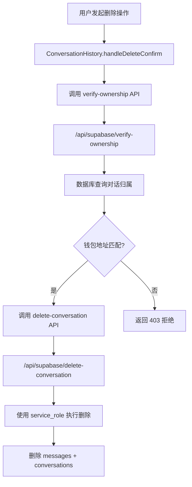

**图表来源**
- [2026-04-28-feat-p1-completion.md:65-89](file://docs/changelog/2026-04-28-feat-p1-completion.md#L65-L89)

**实现细节**
- **服务端所有权验证API**：`/api/supabase/verify-ownership` 接收 conversationId + walletAddress，查询数据库确认对话归属
- **服务端删除API**：`/api/supabase/delete-conversation` 使用 service_role 密钥执行删除，内置所有权验证
- **前端联动**：ConversationHistory 的 `handleDeleteConfirm` 先调用 verify-ownership，再调用 delete-conversation，双重验证
- **RLS Migration**：`supabase/migrations/upgrade_production_rls.sql` 将 DELETE 策略升级为 `current_setting('app.current_wallet_address', true)` 严格模式

**章节来源**
- [2026-04-28-feat-p1-completion.md:9-28](file://docs/changelog/2026-04-28-feat-p1-completion.md#L9-L28)

### 钱包地址格式验证
系统实现了路由层和客户端双重钱包地址格式验证机制：

**验证流程**
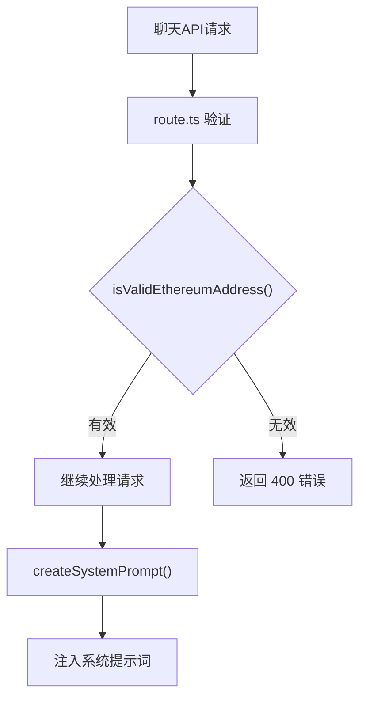

**图表来源**
- [2026-04-28-feat-p1-completion.md:55-57](file://docs/changelog/2026-04-28-feat-p1-completion.md#L55-L57)

**实现细节**
- **路由层验证**：在 system prompt 注入前调用 `isValidEthereumAddress()` 函数验证钱包地址格式
- **客户端验证**：`client.ts` 中添加额外的地址格式检查
- **正则表达式**：`/^0x[a-fA-F0-9]{40}$/` 确保地址格式正确
- **错误处理**：无效地址返回 400 错误，防止恶意请求

**章节来源**
- [2026-04-28-feat-p1-completion.md:55-57](file://docs/changelog/2026-04-28-feat-p1-completion.md#L55-L57)

### SSR主题闪烁修复
通过内联脚本和同步初始化机制，彻底解决了SSR主题闪烁问题：

**修复机制**
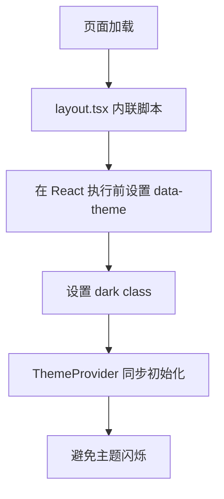

**图表来源**
- [2026-04-28-feat-p1-completion.md:59-61](file://docs/changelog/2026-04-28-feat-p1-completion.md#L59-L61)

**实现细节**
- **内联同步脚本**：在 `layout.tsx` 的 `<head>` 中添加同步脚本
- **React执行前设置**：确保在 React 组件执行前设置主题状态
- **ThemeProvider同步**：Theme Context 和 Provider 同步初始化
- **效果**：消除约100ms的主题闪烁，提升用户体验

**章节来源**
- [2026-04-28-feat-p1-completion.md:59-61](file://docs/changelog/2026-04-28-feat-p1-completion.md#L59-L61)

## 测试覆盖体系

### 单元测试体系架构
系统建立了完整的Vitest monorepo测试体系，覆盖所有核心模块：

**测试架构设计**
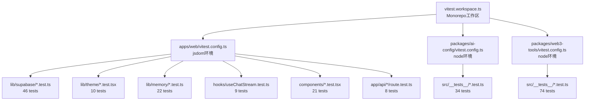

**图表来源**
- [2026-04-28-feat-unit-test-coverage.md:38-51](file://docs/changelog/2026-04-28-feat-unit-test-coverage.md#L38-L51)

**测试策略**
- **Monorepo Workspace**：使用 vitest workspace 支持不同测试环境
- **Mock策略**：只mock外部依赖，不mock被测逻辑
- **组件测试**：测试用户可见行为，不测试实现细节
- **异步测试**：分步推进fake timers，避免一次性推进导致超时

**章节来源**
- [2026-04-28-feat-unit-test-coverage.md:9-64](file://docs/changelog/2026-04-28-feat-unit-test-coverage.md#L9-L64)

### E2E测试覆盖完善
从9个测试扩展到18个测试，覆盖所有关键功能场景：

**新增测试场景**
- **钱包上下文验证**：有效/无效钱包地址、不传地址的API行为
- **verify-ownership API**：无效参数、不存在的对话、无效钱包格式
- **转账卡片UI**：发送转账指令触发卡片生成、卡片显示正确信息、不完整转账指令的AI回复

**测试结果**
- **总数**：9 → 18 个测试
- **通过率**：18/18 (53.0s)
- **测试框架**：Playwright chromium

**章节来源**
- [2026-04-28-feat-p1-completion.md:30-49](file://docs/changelog/2026-04-28-feat-p1-completion.md#L30-L49)

### 浏览器验收测试
7/7功能通过的浏览器验收测试，确保前端功能完整性：

**验收测试范围**
- 页面加载：首页、聊天界面、设置面板
- 主题切换：Light/Dark/System三种模式
- 聊天功能：消息发送、工具调用、流式输出
- 设置面板：主题设置、钱包连接状态
- 钱包连接：MetaMask、WalletConnect、EIP-6963
- 侧边栏：对话历史、切换、删除、新建
- UI布局：响应式设计、组件对齐

**章节来源**
- [2026-04-28-feat-p1-completion.md:165-166](file://docs/changelog/2026-04-28-feat-p1-completion.md#L165-L166)

### 测试统计汇总
**单元测试统计**
- **apps/web**：17个测试文件，130个测试用例，100%通过率
- **packages/ai-config**：4个测试文件，34个测试用例，100%通过率  
- **packages/web3-tools**：10个测试文件，74个测试用例，100%通过率
- **总计**：31个测试文件，238个测试用例，100%通过率

**章节来源**
- [2026-04-28-feat-unit-test-coverage.md:126-133](file://docs/changelog/2026-04-28-feat-unit-test-coverage.md#L126-L133)

## 依赖分析

### 耦合关系
- origin与pipeline：origin决策，pipeline调度
- define层与deliver层：define层为deliver层提供清晰输入
- check-in与deliver层：check-in是deliver层的前置门禁
- closeout(audit/digest/update-map)与deliver层：交付闭环
- MemoryManager与UI层：MemoryManager作为统一接口抽象
- Web3工具层与API路由：工具函数通过API路由暴露
- ThemeProvider与全局组件：主题系统贯穿整个应用
- ConfirmDialog与ConversationHistory：删除交互体验
- 钱包上下文与聊天API：AI自动感知用户地址
- verify-ownership API与delete-conversation API：安全删除流程
- 单元测试与E2E测试：多层次质量保障体系

### 外部依赖
- 宿主产品UI对命令弹窗的支持程度
- 文档与模板的版本一致性
- 各技能模块间的接口契约一致性
- Web3工具的外部API依赖和网络配置
- LLM服务的可用性和响应时间
- RainbowKit + Wagmi v2的钱包SDK
- Supabase数据库的连接和认证
- CSS变量的主题系统兼容性
- Vitest测试框架的配置和依赖
- Playwright E2E测试框架的稳定性

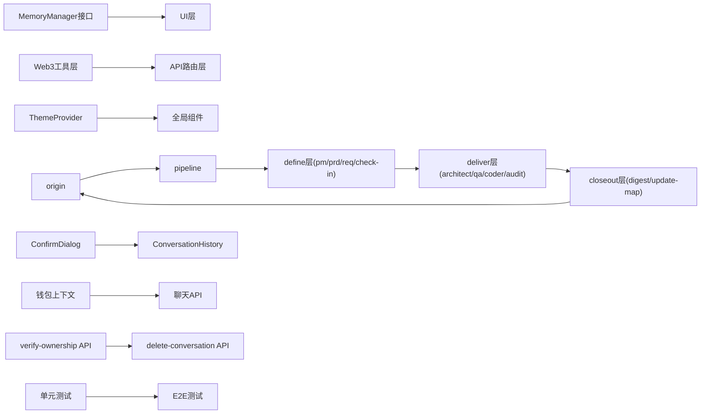

**图表来源**
- [MAP-V3.md:86-157](file://skills/x-ray/MAP-V3.md#L86-L157)
- [SKILL-SYSTEM-DESIGN-V3.md:265-281](file://skills/x-ray/SKILL-SYSTEM-DESIGN-V3.md#L265-L281)
- [ARCHITECTURE.md:89-96](file://ARCHITECTURE.md#L89-L96)

**章节来源**
- [MAP-V3.md:86-157](file://skills/x-ray/MAP-V3.md#L86-L157)
- [SKILL-SYSTEM-DESIGN-V3.md:265-281](file://skills/x-ray/SKILL-SYSTEM-DESIGN-V3.md#L265-L281)
- [ARCHITECTURE.md:89-96](file://ARCHITECTURE.md#L89-L96)

## 性能考量

### 路由分流优化
- 通过origin+pipeline的两级分流，避免非交付任务进入冗长主链路
- DISCOVER/BOOTSTRAP/VERIFY/GOVERN任务直接处理，不占用pipeline资源

### 执行深度控制
- L1(Light)：DELIVER-PATCH，快速修复
- L2(Design-first)：DELIVER-REFACTOR，设计优先
- L3(Full)：DELIVER-FEAT，完整流程

### 质量前置控制
- check-in将"是否具备实施条件"前置，减少返工
- QA先行RED，避免无效实现

### 自愈循环限制
- Coder最多10轮自愈循环，超限立即终止
- 防止无限试错和资源浪费

### Web3工具性能优化
- 多数据源容错机制提升可用性
- 代理配置支持网络环境适配
- 超时保护防止阻塞等待
- 标准化响应格式便于缓存和复用

### 内存管理性能优化
- **L2滑动窗口**：O(1)时间复杂度，固定内存占用，适合短对话
- **L3摘要压缩**：异步压缩，不影响用户体验，Token节省≥50%
- **配置化管理**：环境变量驱动，无需代码修改即可调整策略
- **并发安全**：使用标志位防止重复压缩，确保状态一致性

### UI/UX性能优化
- **主题切换**：CSS变量即时生效，无重排重绘
- **ConfirmDialog**：使用React Portal，避免DOM层级过深
- **断开连接**：客户端清空+云端保留，减少网络请求
- **流式渲染**：SSE流式输出，实时反馈用户体验
- **SSR主题闪烁**：内联脚本同步初始化，消除视觉闪烁

### 安全性能优化
- **RLS升级**：数据库层安全控制，提升数据安全性
- **双重验证**：应用层 + 数据库层的删除操作验证
- **地址验证**：路由层 + 客户端双重地址格式验证
- **测试覆盖**：238个单元测试 + 18个E2E测试，确保系统稳定性

**章节来源**
- [SlidingWindowMemory.ts:32-34](file://apps/web/lib/memory/SlidingWindowMemory.ts#L32-L34)
- [SummaryCompressionMemory.ts:48-74](file://apps/web/lib/memory/SummaryCompressionMemory.ts#L48-L74)
- [2026-04-23-feat-ui-enhancements-and-theme-system.md:106-115](file://docs/changelog/2026-04-23-feat-ui-enhancements-and-theme-system.md#L106-L115)
- [2026-04-28-feat-p1-completion.md:59-61](file://docs/changelog/2026-04-28-feat-p1-completion.md#L59-L61)

## 故障排查指南

### 路由问题
**未进入pipeline**
- 检查origin是否正确识别任务类型
- 确认任务是否属于DELIVER-*类型

**未进入check-in**
- 确认任务是否属于需要实施前对齐的类型
- 检查是否遗漏check-in输出结构

### 质量控制问题
**QA无法推进**
- FEAT默认RED，确认RED是否有效执行
- PATCH/REFACTOR是否保留验证或回归检查

**Coder卡住**
- 是否超过10轮自愈循环
- 是否存在不可修复的边界问题

**Audit未通过**
- 评分是否低于阈值
- 是否存在严重风险或一票否决项

### 技能执行问题
**技能顺序错误**
- 检查技能间的依赖关系
- 确认必需技能是否按顺序执行

**输出不符合规范**
- 检查技能输出模板
- 确认必需字段是否完整

### Web3工具问题
**工具调用失败**
- 检查API路由配置和权限
- 确认外部API服务可用性
- 验证网络代理配置

**数据查询异常**
- 检查输入参数格式和有效性
- 确认RPC节点配置正确
- 查看错误日志获取详细信息

### 内存管理问题
**滑动窗口策略问题**
- 检查窗口大小配置是否合理
- 确认消息数量是否超过阈值
- 验证消息格式是否正确

**摘要压缩问题**
- 检查LLM服务是否可用
- 确认压缩触发条件是否满足
- 验证摘要生成是否成功

**配置问题**
- 检查环境变量设置
- 确认配置合并逻辑
- 验证工厂函数调用

### UI/UX问题
**主题切换失效**
- 检查localStorage存储状态
- 确认CSS变量是否正确更新
- 验证HTML data-theme属性

**ConfirmDialog不显示**
- 检查isOpen状态
- 确认组件是否正确导入
- 验证事件处理器绑定

**钱包上下文未注入**
- 检查walletAddress参数传递
- 确认createSystemPrompt函数调用
- 验证AI模型是否正确接收system prompt

**断开连接未清空**
- 检查wagmi连接状态监听
- 确认memoryManager.clear调用
- 验证欢迎消息显示逻辑

### 安全问题
**RLS升级失败**
- 检查数据库迁移脚本执行
- 确认service_role密钥配置
- 验证DELETE策略是否正确应用

**删除操作被拒绝**
- 检查verify-ownership API响应
- 确认conversationId格式正确
- 验证钱包地址匹配逻辑

**地址验证失败**
- 检查路由层验证函数
- 确认正则表达式匹配
- 验证客户端验证逻辑

### 测试问题
**单元测试失败**
- 检查测试环境配置
- 确认Mock策略正确性
- 验证测试用例覆盖范围

**E2E测试不稳定**
- 检查Playwright配置
- 确认测试超时设置
- 验证浏览器兼容性

**章节来源**
- [SKILL-SYSTEM-DESIGN-V3.md:700-719](file://skills/x-ray/SKILL-SYSTEM-DESIGN-V3.md#L700-L719)
- [route.ts:36-45](file://apps/web/app/api/tools/route.ts#L36-L45)
- [2026-04-21-feat-l2-sliding-window.md:50-55](file://docs/changelog/2026-04-21-feat-l2-sliding-window.md#L50-L55)
- [2026-04-21-feat-memory-management.md:70-77](file://docs/changelog/2026-04-21-feat-memory-management.md#L70-L77)
- [2026-04-23-feat-ui-enhancements-and-theme-system.md:106-115](file://docs/changelog/2026-04-23-feat-ui-enhancements-and-theme-system.md#L106-L115)
- [2026-04-28-feat-p1-completion.md:55-61](file://docs/changelog/2026-04-28-feat-p1-completion.md#L55-L61)
- [2026-04-28-feat-unit-test-coverage.md:60-64](file://docs/changelog/2026-04-28-feat-unit-test-coverage.md#L60-L64)

## 结论
Web3 AI Agent技能系统V3以"可路由、可裁剪、可回退"为核心设计理念，通过origin/pipeline的两级分流与check-in的门禁式质量控制，将文档驱动与自动化执行有机结合。V3版本将系统从单一流水线升级为可分流的操作系统，通过七类任务类型和三层执行深度，实现了高效的质量控制和知识沉淀。

**更新** 本次更新重点反映了P1任务全量交付完成的重要里程碑，包括RLS安全升级、E2E测试覆盖完善、浏览器验收通过、单元测试体系建立等关键成果。技能地图显示已完成能力清单包含100%的MVP核心功能，用户体验得到全面提升。系统在保持原有架构优势的基础上，进一步增强了安全性、稳定性和可维护性。

系统的核心优势包括：
- **灵活的路由机制**：七类任务类型支持不同场景需求
- **严格的门禁控制**：check-in确保实施前对齐
- **分层的质量控制**：QA、Coder、Audit三级质量保障
- **可扩展的架构**：五层技能架构支持持续演进
- **完善的治理机制**：digest和update-map确保知识沉淀
- **模块化的工具层**：Web3工具重构提升代码质量
- **标准化的API集成**：统一的工具调用接口
- **双策略内存管理**：L2滑动窗口+L3摘要压缩，支持不同场景需求
- **完整的UI/UX系统**：ConfirmDialog、主题系统、钱包上下文注入
- **多层次安全加固**：RLS升级、双重验证、地址格式验证
- **全面的测试覆盖**：238个单元测试 + 18个E2E测试，100%通过率
- **严格的浏览器验收**：7/7功能通过，确保前端稳定性

V3版本正式将"实施前对齐点"从learn-gate更名为check-in，强化其在交付流程中的定位，配合红绿灯、自愈与审计评分等硬规则，系统在保证质量的同时兼顾效率，适合在Web3 AI Agent项目中长期演进与规模化应用。

## 附录

### 使用建议
- 统一使用"/origin"命令开始任务
- 交付型任务优先走pipeline(FEAT/PATCH/REFACTOR)
- 实施前必须执行check-in
- FEAT默认QA先RED，Coder最多10轮自愈，Audit>=80才放行
- Web3工具调用遵循统一的API路由规范
- Memory管理策略可根据场景选择L2或L3
- UI/UX功能通过主题系统和ConfirmDialog组件提供
- 安全操作必须通过verify-ownership API验证
- 测试驱动开发，确保代码质量

### 命令约定
- /origin：任务入口
- /pipeline feat/patch/refactor：交付型任务分流
- /pm：项目经理技能
- /prd：产品需求技能  
- /req：需求拆解技能
- /check-in：实施前对齐点
- /architect：架构设计技能
- /qa：质量保证技能
- /coder：编码实现技能
- /audit：风险审计技能
- /digest：经验沉淀技能
- /update-map：地图更新技能
- /explore：项目探索技能
- /init-docs：文档初始化技能
- /browser-verify：浏览器验收技能
- /resolve-doc-conflicts：文档冲突解决技能

### Web3工具API规范
- GET /api/tools：工具调用接口
- 支持工具：getETHPrice、getWalletBalance、getGasPrice
- 参数验证：地址格式、RPC节点配置
- 错误处理：标准化错误响应格式
- 超时保护：10秒请求超时

### Memory管理策略选择指南
**L2滑动窗口策略适用场景**：
- 短对话（<20轮）
- Token预算紧张
- 需要最低延迟
- 不需要历史上下文

**L3摘要压缩策略适用场景**：
- 长对话（>20轮）
- 需要历史上下文
- Token预算有限
- 需要成本优化

**配置建议**：
- compressThreshold：10（默认）
- keepRecentCount：5（默认）
- summaryModel：根据需要设置

### UI/UX功能使用指南
**主题系统使用**：
- 通过ThemeSwitcher组件切换主题
- 支持Light/Dark/System三种模式
- localStorage持久化主题偏好
- CSS变量自动适配所有组件

**ConfirmDialog使用**：
- 导入ConfirmDialog组件
- 通过isOpen状态控制显示
- 支持Loading状态和错误处理
- 支持三种变体样式

**钱包上下文使用**：
- 通过wagmi获取钱包地址
- 自动传递给聊天API
- AI自动感知用户钱包地址
- 简化余额查询等操作

**断开连接使用**：
- wagmi断开连接时自动清空UI
- 云端数据保留，重连自动恢复
- 欢迎消息提示用户重新连接

### 安全加固使用指南
**RLS升级使用**：
- 删除操作必须通过verify-ownership API验证
- 服务端DELETE操作使用service_role密钥
- 生产环境必须执行RLS迁移脚本
- 部署文档包含完整的升级指南

**钱包地址验证使用**：
- 路由层和客户端双重验证
- 正则表达式确保地址格式正确
- 无效地址直接返回400错误
- 防止恶意请求攻击

**SSR主题闪烁修复**：
- layout.tsx内联同步脚本
- React执行前设置主题状态
- ThemeProvider同步初始化
- 消除视觉闪烁问题

### 测试覆盖使用指南
**单元测试使用**：
- Vitest monorepo workspace配置
- 31个测试文件，238个测试用例
- 100%通过率，确保代码质量
- 覆盖apps/web、packages/ai-config、packages/web3-tools

**E2E测试使用**：
- Playwright chromium框架
- 18个测试场景，全部通过
- 覆盖钱包上下文、verify-ownership、转账卡片
- 浏览器验收7/7通过

**测试策略**：
- Monorepo环境分离
- Mock外部依赖策略
- 组件测试关注用户行为
- 异步测试分步推进

### 技能地图解读
V3技能地图采用ASCII总流程图，直观展示七类任务的路由和分流关系。地图明确了：
- 一级路由：origin -> {DISCOVER|BOOTSTRAP|DEFINE|DELIVER-*|VERIFY/GOVERN}
- 二级路由：只有DELIVER-*任务进入pipeline
- 三类交付流程：FEAT(L3)、PATCH(L1)、REFACTOR(L2)
- 固定规则：origin判断、check-in门禁、按需插入技能
- 工具集成：Web3工具通过API路由统一调用
- Memory管理：L2滑动窗口+L3摘要压缩双策略并存
- UI/UX增强：ConfirmDialog、主题系统、钱包上下文注入
- 安全加固：RLS升级、双重验证、地址格式验证
- 测试覆盖：238个单元测试 + 18个E2E测试

**章节来源**
- [COMMANDS.md:29-50](file://skills/x-ray/COMMANDS.md#L29-L50)
- [MAP-V3.md:48-129](file://skills/x-ray/MAP-V3.md#L48-L129)
- [ARCHITECTURE.md:89-96](file://ARCHITECTURE.md#L89-L96)
- [MAP-V3.md:17-41](file://skills/x-ray/MAP-V3.md#L17-L41)
- [PROJECT-CHECKLIST.md:1-628](file://docs/checklist/PROJECT-CHECKLIST.md#L1-L628)
- [2026-04-28-feat-p1-completion.md:1-98](file://docs/changelog/2026-04-28-feat-p1-completion.md#L1-L98)
- [2026-04-28-feat-unit-test-coverage.md:1-147](file://docs/changelog/2026-04-28-feat-unit-test-coverage.md#L1-L147)