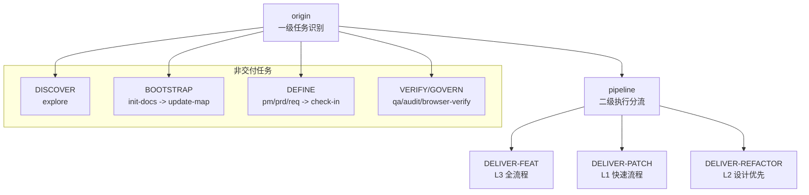

# 技能系统架构

Web3 AI Agent 技能系统 V3 以"文档驱动 + 流程型多技能 + 门禁式质量控制"为核心，构建可路由、可裁剪、可回退的技能操作系统。

## 五层架构

| 层级 | 技能 | 职责 |
|------|------|------|
| 入口层 | origin, pipeline | 任务类型识别与二级路由分流 |
| 定义层 | pm, prd, req, check-in | 从模糊意图到清晰任务的转换 |
| 交付层 | architect, qa, coder, audit | 设计、验证、实现、风险审计 |
| 治理层 | digest, update-map | 经验沉淀和状态更新 |
| 辅助层 | explore, init-docs, browser-verify, resolve-doc-conflicts | 只读探索、初始化、验收、冲突治理 |

## 七类任务模型

| 任务类型 | 路由目标 | 说明 |
|----------|----------|------|
| DISCOVER | explore | 只读探索，不进入交付链 |
| BOOTSTRAP | init-docs -> update-map | 新项目初始化文档体系 |
| DEFINE | pm/prd/req -> check-in | 目标模糊到清晰任务的转换 |
| DELIVER-FEAT | pipeline(L3全流程) | 新功能开发，完整链路 |
| DELIVER-PATCH | pipeline(L1快速) | bug修复，短链路 |
| DELIVER-REFACTOR | pipeline(L2设计优先) | 重构优化，含架构设计 |
| VERIFY/GOVERN | qa/audit/browser-verify/resolve-doc-conflicts | 验证治理 |

## 三种 Pipeline 执行深度

| Pipeline | 链路 | 特点 |
|----------|------|------|
| FEAT (L3) | pm(按需)->prd->req->check-in->architect->qa->coder->audit->digest->update-map | 默认必须有 prd+req |
| PATCH (L1) | req->check-in->coder->qa->digest->update-map | 不走 pm/prd，轻量验证 |
| REFACTOR (L2) | req->check-in->architect->qa->coder->audit->digest->update-map | 不走 pm，设计优先 |

## 执行骨架

`route -> define(按需) -> check-in -> design(按需) -> build -> closeout`

## 硬规则清单

| 规则 | 说明 |
|------|------|
| 无 check-in 不进入 architect/qa/coder | check-in 是实施前强制门禁 |
| 小任务优先短链路 | 不为完整而完整 |
| QA: FEAT 先 RED | 先证明"当前未通过" |
| Coder 最多 10 轮自愈 | 超限输出 STUCK 报告，人工介入 |
| Audit 评分阈值 | >=80 通过；60-79 软拒绝回退 coder；<60 直接拒绝废弃 |
| Audit 一票否决 | 严重安全问题、关键不变量破坏、高风险边界缺失 |
| RED 最多运行 2 次 | QA 阶段先负责 RED |
| 不修改 docs 需求定义 | Coder 不擅自修改验收标准 |

## Audit 评分维度

| 维度 | 权重 |
|------|------|
| 需求一致性 | 25 |
| 结构/契约一致性 | 15 |
| 安全与风险边界 | 20 |
| 代码质量 | 15 |
| 回归风险控制 | 10 |
| 文档与状态收尾 | 10 |
| 场景特定治理项 | 5 |
