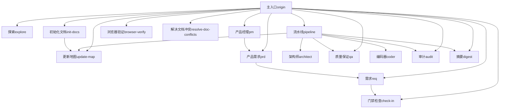
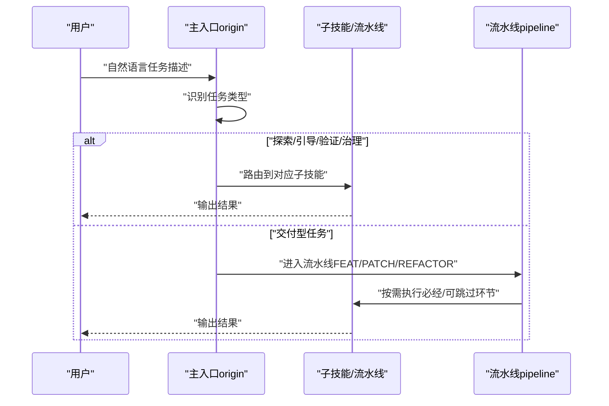
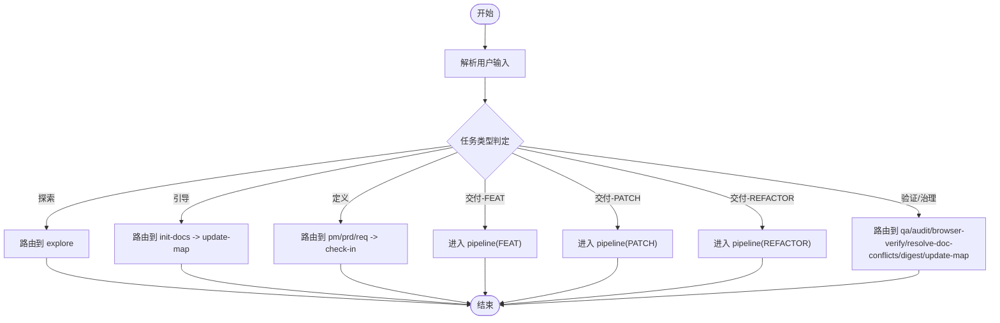
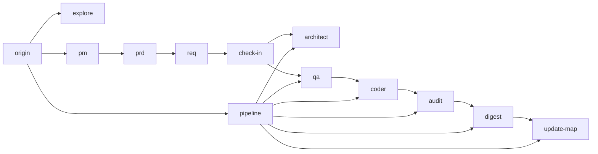

# 主入口技能（Origin）

<cite>
**本文引用的文件**
- [技能系统总览 SKILL.md](file://skills/web3-ai-agent/SKILL.md)
- [技能地图 V3 MAP-V3.md](file://skills/web3-ai-agent/MAP-V3.md)
- [斜杠命令 COMMANDS.md](file://skills/web3-ai-agent/COMMANDS.md)
- [架构师 SKILL.md](file://skills/web3-ai-agent/architect/SKILL.md)
- [流水线 SKILL.md](file://skills/web3-ai-agent/pipeline/SKILL.md)
- [门禁检查 SKILL.md](file://skills/web3-ai-agent/check-in/SKILL.md)
- [探索 SKILL.md](file://skills/web3-ai-agent/explore/SKILL.md)
- [产品经理 SKILL.md](file://skills/web3-ai-agent/pm/SKILL.md)
- [产品需求 SKILL.md](file://skills/web3-ai-agent/prd/SKILL.md)
- [需求 SKILL.md](file://skills/web3-ai-agent/req/SKILL.md)
- [质量保证 SKILL.md](file://skills/web3-ai-agent/qa/SKILL.md)
- [编码器 SKILL.md](file://skills/web3-ai-agent/coder/SKILL.md)
</cite>

## 目录
1. [简介](#简介)
2. [项目结构](#项目结构)
3. [核心组件](#核心组件)
4. [架构总览](#架构总览)
5. [详细组件分析](#详细组件分析)
6. [依赖分析](#依赖分析)
7. [性能考虑](#性能考虑)
8. [故障排查指南](#故障排查指南)
9. [结论](#结论)
10. [附录](#附录)

## 简介
本文件面向“主入口技能（Origin）”的使用者与集成者，系统化阐述 web3-ai-agent 技能体系的统一入口设计与执行机制。核心目标包括：
- 统一入口路由：所有外部调用默认从 origin 进入，进行任务类型识别与分流。
- 任务类型识别：将输入识别为 DISCOVER、BOOTSTRAP、DEFINE、DELIVER-FEAT、DELIVER-PATCH、DELIVER-REFACTOR、VERIFY/GOVERN 七类之一。
- 强制门禁检查：在交付型任务与准备进入实施的 DEFINE 任务中，强制执行 check-in 对齐问题、边界、方案与完成标准。
- 交付型任务的流水线：DELIVER-* 任务进入 pipeline，依据任务性质选择执行深度与必经环节。
- 斜杠命令约定与外部调用建议：提供统一命令格式，降低路由歧义。

## 项目结构
web3-ai-agent 技能系统以“主入口（origin）+ 子技能（skill）+ 流水线（pipeline）”为核心组织方式。各技能职责清晰、边界明确，通过固定规则串联形成闭环。

图表来源
- [技能系统总览 SKILL.md:92-158](file://skills/web3-ai-agent/SKILL.md#L92-L158)
- [技能地图 V3 MAP-V3.md:86-156](file://skills/web3-ai-agent/MAP-V3.md#L86-L156)

章节来源
- [技能系统总览 SKILL.md:1-224](file://skills/web3-ai-agent/SKILL.md#L1-L224)
- [技能地图 V3 MAP-V3.md:1-166](file://skills/web3-ai-agent/MAP-V3.md#L1-L166)

## 核心组件
- 主入口（origin）
  - 统一入口：所有外部调用默认首先进入 origin。
  - 任务识别：根据输入语义识别七种任务类型。
  - 路由决策：将任务路由至对应子技能或 pipeline。
  - 强制门禁：在交付型任务与准备进入实施的 DEFINE 任务中，强制执行 check-in。
- 流水线（pipeline）
  - 作用：为交付型任务选择合适的执行深度，避免默认跑完整长链路。
  - 路由规则：FEAT、PATCH、REFACTOR 三类分别进入不同执行路径。
  - 判定规则：基于任务性质（新功能、bug 修复、重构）选择必经环节与可跳过环节。
- 门禁检查（check-in）
  - 定位：实施前门禁，非全局门禁。
  - 强制适用：DELIVER-FEAT、DELIVER-PATCH、DELIVER-REFACTOR、准备进入实施的 DEFINE。
  - 输出模板：明确问题、上下文、方案、边界、产物与完成标准。
  - 硬规则：无 check-in 不进入 architect/qa/coder；必须明确“不做什么”与完成标准。

章节来源
- [技能系统总览 SKILL.md:21-72](file://skills/web3-ai-agent/SKILL.md#L21-L72)
- [流水线 SKILL.md:1-89](file://skills/web3-ai-agent/pipeline/SKILL.md#L1-L89)
- [门禁检查 SKILL.md:1-56](file://skills/web3-ai-agent/check-in/SKILL.md#L1-L56)

## 架构总览
主入口技能（origin）作为统一入口，负责：
- 任务类型识别与分流
- 交付型任务进入 pipeline
- 强制门禁检查（check-in）
- 与各子技能的衔接与约束

图表来源
- [技能系统总览 SKILL.md:21-72](file://skills/web3-ai-agent/SKILL.md#L21-L72)
- [技能地图 V3 MAP-V3.md:86-156](file://skills/web3-ai-agent/MAP-V3.md#L86-L156)

## 详细组件分析

### 任务类型识别与路由规则
- 七种任务类型
  - DISCOVER：通过 explore 快速理解项目、定位模块、查询现状。
  - BOOTSTRAP：初始化文档与更新技能地图。
  - DEFINE：将模糊目标整理为价值主张与正式范围，必要时进入 check-in。
  - DELIVER-FEAT：新功能开发，进入 pipeline 并按需串联 pm/prd/req/architect/qa/coder/audit/digest/update-map。
  - DELIVER-PATCH：bug 修复，进入 pipeline，通常不走 pm/prd。
  - DELIVER-REFACTOR：重构，进入 pipeline，通常不走 pm。
  - VERIFY/GOVERN：验证与治理，可并行或串行组合 qa/audit/browser-verify/resolve-doc-conflicts/digest/update-map。
- 路由规则
  - 非交付型任务：origin 直接路由到对应子技能。
  - 交付型任务：origin 进入 pipeline，再按任务类型选择执行深度与环节。
  - 强制门禁：DELIVER-* 与准备进入实施的 DEFINE 必须先 check-in。

章节来源
- [技能系统总览 SKILL.md:33-158](file://skills/web3-ai-agent/SKILL.md#L33-L158)
- [技能地图 V3 MAP-V3.md:86-166](file://skills/web3-ai-agent/MAP-V3.md#L86-L166)

### 交付型任务的流水线执行
- FEAT
  - 路径：origin -> pipeline(FEAT) -> pm(按需) -> prd -> req -> check-in -> architect -> qa -> coder -> audit -> digest -> update-map
  - 特点：默认必须有 prd + req；可按需插入 architect/audit/browser-verify/prd。
- PATCH
  - 路径：origin -> pipeline(PATCH) -> req -> check-in -> coder -> qa -> digest -> update-map
  - 特点：默认不走 pm/prd；至少保留轻量回归检查。
- REFACTOR
  - 路径：origin -> pipeline(REFACTOR) -> req -> check-in -> architect -> qa -> coder -> audit -> digest -> update-map
  - 特点：默认不走 pm；可按需插入 prd/browser-verify。
- 硬规则
  - 无 check-in 不进入 architect/qa/coder。
  - 小任务优先短链路，不为完整而完整。

章节来源
- [技能地图 V3 MAP-V3.md:102-131](file://skills/web3-ai-agent/MAP-V3.md#L102-L131)
- [流水线 SKILL.md:29-89](file://skills/web3-ai-agent/pipeline/SKILL.md#L29-L89)

### 强制门禁检查（check-in）
- 强制适用场景
  - DELIVER-FEAT、DELIVER-PATCH、DELIVER-REFACTOR、准备进入实施的 DEFINE。
- 默认不强制场景
  - DISCOVER、BOOTSTRAP、纯 VERIFY/GOVERN。
- 输出模板要点
  - 本阶段要解决的问题
  - 本阶段必须掌握的上下文
  - 本阶段采用的方案
  - 本阶段不做什么
  - 本阶段产物
  - 本阶段完成标准
  - 进入下一阶段前要调用的 skill
- 硬规则
  - 无 check-in 不进入 architect/qa/coder。
  - 必须明确“不做什么”与完成标准，否则视为未完成。

章节来源
- [技能系统总览 SKILL.md:57-72](file://skills/web3-ai-agent/SKILL.md#L57-L72)
- [门禁检查 SKILL.md:12-56](file://skills/web3-ai-agent/check-in/SKILL.md#L12-L56)

### 子技能职责与衔接
- explore：只读探索，不进入交付链。
- init-docs + update-map：引导性文档初始化与地图更新。
- pm：目标模糊时整理价值主张与 MVP 方向。
- prd：定义正式范围、非目标与验收标准。
- req：将 PRD/缺陷/重构目标拆为最小可执行任务卡。
- architect：结构变化时产出架构说明与契约。
- qa：FEAT 先红后绿，PATCH/REFACTOR 轻量验证或回归验证。
- coder：在边界清楚前提下实施代码，最多 10 轮自愈循环。
- audit：对代码质量与一致性进行评估。
- digest + update-map：总结与更新技能地图。
- browser-verify / resolve-doc-conflicts：按需插入的前端验证与文档冲突解决。

章节来源
- [探索 SKILL.md:1-42](file://skills/web3-ai-agent/explore/SKILL.md#L1-L42)
- [产品经理 SKILL.md:1-53](file://skills/web3-ai-agent/pm/SKILL.md#L1-L53)
- [产品需求 SKILL.md:1-54](file://skills/web3-ai-agent/prd/SKILL.md#L1-L54)
- [需求 SKILL.md:1-57](file://skills/web3-ai-agent/req/SKILL.md#L1-L57)
- [架构师 SKILL.md:1-53](file://skills/web3-ai-agent/architect/SKILL.md#L1-L53)
- [质量保证 SKILL.md:1-73](file://skills/web3-ai-agent/qa/SKILL.md#L1-L73)
- [编码器 SKILL.md:1-72](file://skills/web3-ai-agent/coder/SKILL.md#L1-L72)

### 任务识别算法（概念流程）
以下为概念性流程图，展示从输入到任务类型识别与路由的关键步骤。该图为概念示意，不直接映射具体源码文件。

## 依赖分析
- 耦合关系
  - origin 与各子技能存在路由耦合，但通过固定规则与模板降低紧耦合。
  - pipeline 与 architect/qa/coder/audit/digest/update-map 存在强衔接依赖。
  - check-in 作为门禁，对 architect/qa/coder 具有前置依赖。
- 关键依赖链
  - DELIVER-FEAT：pm(可选) -> prd -> req -> check-in -> architect -> qa -> coder -> audit -> digest -> update-map
  - DELIVER-PATCH：req -> check-in -> coder -> qa -> digest -> update-map
  - DELIVER-REFACTOR：req -> check-in -> architect -> qa -> coder -> audit -> digest -> update-map
  - VERIFY/GOVERN：qa/audit/browser-verify/resolve-doc-conflicts/digest/update-map

图表来源
- [技能地图 V3 MAP-V3.md:102-156](file://skills/web3-ai-agent/MAP-V3.md#L102-L156)

章节来源
- [技能地图 V3 MAP-V3.md:102-156](file://skills/web3-ai-agent/MAP-V3.md#L102-L156)

## 性能考虑
- 路由效率：通过统一入口与固定规则，减少歧义与重复计算。
- 执行深度：pipeline 按任务类型选择执行深度，避免不必要的环节。
- 自愈循环：coder 最多 10 轮自愈，超限终止并输出 STUCK 报告，避免无效耗时。
- 验证策略：QA 对 FEAT 先红后绿，对 PATCH/REFACTOR 轻量验证，提升整体吞吐。

## 故障排查指南
- 无法进入实施
  - 症状：尝试进入 architect/qa/coder 时被拒绝。
  - 排查：确认是否已完成 check-in；检查 check-in 是否明确了“不做什么”与完成标准。
- 交付型任务未进入 pipeline
  - 症状：DELIVER-* 任务未按预期进入 pipeline。
  - 排查：确认输入是否被正确识别为 DELIVER-*；检查 pipeline 的 FEAT/PATCH/REFACTOR 分流逻辑。
- FEAT 未走 prd/req
  - 症状：FEAT 直接进入 architect/qa。
  - 排查：确认是否遗漏 prd/req；遵循“FEAT 默认必须有 prd + req”的硬规则。
- PATCH/REFACTOR 走了 pm/prd
  - 症状：PATCH/REFACTOR 走了 pm/prd。
  - 排查：遵循“PATCH 默认不走 pm/prd；REFACTOR 默认不走 pm”的硬规则。
- coder 卡住
  - 症状：超过 10 轮仍未通过。
  - 排查：查看 STUCK 报告中的卡住原因、已尝试方案、当前阻塞点，并请求人工介入。

章节来源
- [技能系统总览 SKILL.md:160-167](file://skills/web3-ai-agent/SKILL.md#L160-L167)
- [流水线 SKILL.md:82-89](file://skills/web3-ai-agent/pipeline/SKILL.md#L82-L89)
- [编码器 SKILL.md:39-48](file://skills/web3-ai-agent/coder/SKILL.md#L39-L48)

## 结论
主入口技能（origin）通过统一入口、任务识别与强制门禁，构建了稳定可控的技能调度体系。结合 pipeline 的按需执行与各子技能的职责边界，实现了从探索、定义到交付与验证治理的全链路闭环。遵循斜杠命令约定与硬规则，可显著降低路由歧义与执行成本。

## 附录

### 使用示例与最佳实践
- 示例
  - 探索项目：使用斜杠命令 /explore + 任务描述。
  - 新功能：使用 /origin + “增加 gas price 查询功能”。
  - 修 bug：使用 /origin + “修复钱包切换后 UI 不刷新的 bug”。
  - 重构：使用 /origin + “把 tool 调用层重构成 registry + adapter”。
- 最佳实践
  - 优先使用统一斜杠命令，降低歧义。
  - DELIVER-* 任务务必先完成 check-in。
  - FEAT 默认串联 prd/req/architect/qa/coder/audit/digest/update-map。
  - PATCH/REFACTOR 默认不走 pm；按需插入 prd/browser-verify/architect/audit。

章节来源
- [斜杠命令 COMMANDS.md:52-81](file://skills/web3-ai-agent/COMMANDS.md#L52-L81)
- [技能系统总览 SKILL.md:73-91](file://skills/web3-ai-agent/SKILL.md#L73-L91)

### 斜杠命令约定
- 推荐命令
  - /origin
  - /pipeline feat
  - /pipeline patch
  - /pipeline refactor
  - /pm
  - /prd
  - /req
  - /check-in
  - /architect
  - /qa
  - /coder
  - /audit
  - /digest
  - /update-map
  - /explore
  - /init-docs
  - /browser-verify
  - /resolve-doc-conflicts

章节来源
- [斜杠命令 COMMANDS.md:29-50](file://skills/web3-ai-agent/COMMANDS.md#L29-L50)
- [技能系统总览 SKILL.md:178-224](file://skills/web3-ai-agent/SKILL.md#L178-L224)