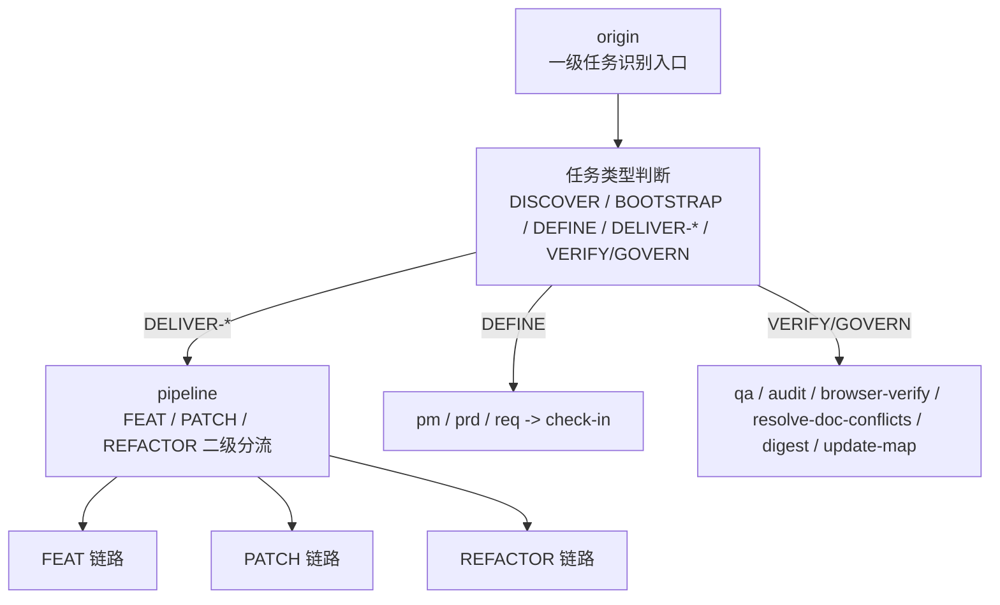
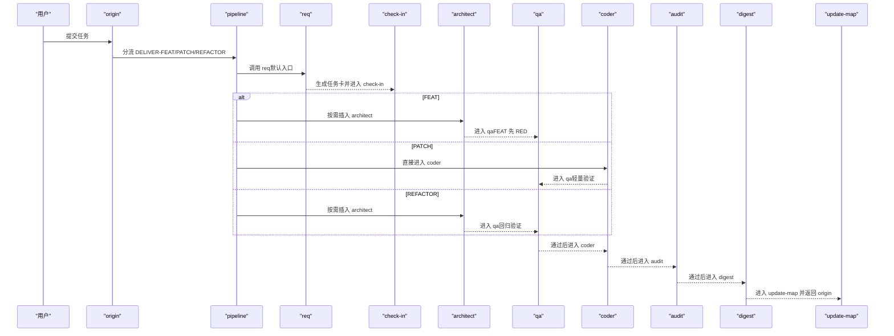
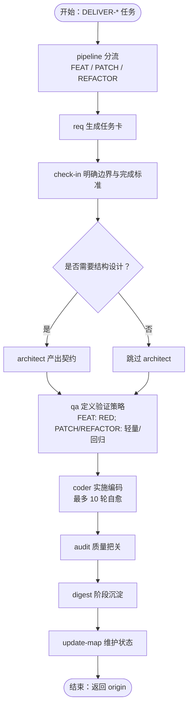
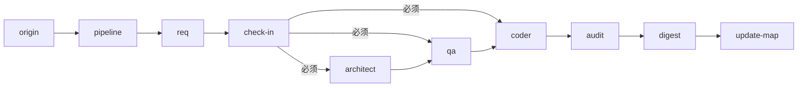

# 交付流水线技能（Pipeline）

<cite>
**本文引用的文件**
- [skills/web3-ai-agent/pipeline/SKILL.md](file://skills/web3-ai-agent/pipeline/SKILL.md)
- [skills/web3-ai-agent/SKILL.md](file://skills/web3-ai-agent/SKILL.md)
- [skills/web3-ai-agent/MAP-V3.md](file://skills/web3-ai-agent/MAP-V3.md)
- [skills/web3-ai-agent/architect/SKILL.md](file://skills/web3-ai-agent/architect/SKILL.md)
- [skills/web3-ai-agent/coder/SKILL.md](file://skills/web3-ai-agent/coder/SKILL.md)
- [skills/web3-ai-agent/qa/SKILL.md](file://skills/web3-ai-agent/qa/SKILL.md)
- [skills/web3-ai-agent/pm/SKILL.md](file://skills/web3-ai-agent/pm/SKILL.md)
- [skills/web3-ai-agent/prd/SKILL.md](file://skills/web3-ai-agent/prd/SKILL.md)
- [skills/web3-ai-agent/req/SKILL.md](file://skills/web3-ai-agent/req/SKILL.md)
- [skills/web3-ai-agent/check-in/SKILL.md](file://skills/web3-ai-agent/check-in/SKILL.md)
- [skills/web3-ai-agent/digest/SKILL.md](file://skills/web3-ai-agent/digest/SKILL.md)
- [skills/web3-ai-agent/update-map/SKILL.md](file://skills/web3-ai-agent/update-map/SKILL.md)
</cite>

## 目录
1. [简介](#简介)
2. [项目结构](#项目结构)
3. [核心组件](#核心组件)
4. [架构总览](#架构总览)
5. [详细组件分析](#详细组件分析)
6. [依赖分析](#依赖分析)
7. [性能考虑](#性能考虑)
8. [故障排查指南](#故障排查指南)
9. [结论](#结论)
10. [附录](#附录)

## 简介
本文件面向“交付流水线技能（Pipeline）”的技术文档，系统阐述其在Web3 AI Agent项目中的定位与作用：在交付型任务（FEAT、PATCH、REFACTOR）中进行“执行深度选择”，避免默认跑完整长链路，从而提升交付效率与质量。文档覆盖三类任务的特征与处理策略、技能组合优化机制、流程控制与硬规则、最佳实践与性能优化建议，并给出与主入口、检查点、验证与审计等关键技能的衔接说明。

## 项目结构
- 主入口与路由：主入口 skill 将外部请求统一导入 origin，依据任务类型分流至 DEFINE、DELIVER（含 FEAT/PATCH/REFACTOR）、VERIFY/GOVERN 或治理链路。
- 交付型任务进入 Pipeline：仅 DELIVER-* 类型任务进入 pipeline，由 pipeline 根据任务类型选择执行深度与技能组合。
- 技能地图（V3）：清晰展示了从 origin 到 pipeline 的一级路由，以及 pipeline 对 FEAT/PATCH/REFACTOR 的二级分流与按需插入点。

**图表来源**
- [skills/web3-ai-agent/MAP-V3.md:5-84](file://skills/web3-ai-agent/MAP-V3.md#L5-L84)
- [skills/web3-ai-agent/SKILL.md:21-72](file://skills/web3-ai-agent/SKILL.md#L21-L72)

**章节来源**
- [skills/web3-ai-agent/SKILL.md:21-72](file://skills/web3-ai-agent/SKILL.md#L21-L72)
- [skills/web3-ai-agent/MAP-V3.md:86-100](file://skills/web3-ai-agent/MAP-V3.md#L86-L100)

## 核心组件
- Pipeline 技能：在 DELIVER-* 任务中进行“执行深度选择”，确定必经技能、可跳过技能与按需插入点，确保小任务走短链路，复杂任务走完整链路。
- 检查点（check-in）：实施前门禁，强制适用于 DELIVER-FEAT/PATCH/REFACTOR 与准备进入实施的 DEFINE 任务；未完成 check-in 不得进入 architect/qa/coder。
- 质量保证（QA）：定义验证策略，FEAT 先 RED，PATCH/REFACTOR 走轻量验证或回归验证。
- 架构设计（Architect）：当任务涉及结构、接口、状态流或模块边界变化时产出结构说明与契约；若无结构变化可跳过。
- 编码（Coder）：在边界清晰前提下实施代码，最多 10 轮自愈循环将 QA 红灯变为绿灯；超限则终止并输出卡住报告。
- 文档沉淀（Digest）：阶段沉淀经验，记录完成项、问题、经验与建议。
- 地图更新（Update-Map）：维护项目状态与下一步入口，确保下一轮任务基于最新上下文推进。

**章节来源**
- [skills/web3-ai-agent/pipeline/SKILL.md:1-89](file://skills/web3-ai-agent/pipeline/SKILL.md#L1-L89)
- [skills/web3-ai-agent/check-in/SKILL.md:12-56](file://skills/web3-ai-agent/check-in/SKILL.md#L12-L56)
- [skills/web3-ai-agent/qa/SKILL.md:12-73](file://skills/web3-ai-agent/qa/SKILL.md#L12-L73)
- [skills/web3-ai-agent/architect/SKILL.md:8-53](file://skills/web3-ai-agent/architect/SKILL.md#L8-L53)
- [skills/web3-ai-agent/coder/SKILL.md:18-72](file://skills/web3-ai-agent/coder/SKILL.md#L18-L72)
- [skills/web3-ai-agent/digest/SKILL.md:8-50](file://skills/web3-ai-agent/digest/SKILL.md#L8-L50)
- [skills/web3-ai-agent/update-map/SKILL.md:8-47](file://skills/web3-ai-agent/update-map/SKILL.md#L8-L47)

## 架构总览
Pipeline 在主入口与各子技能之间扮演“执行深度选择器”角色，结合硬规则与按需插入点，形成三条差异化交付链路：

**图表来源**
- [skills/web3-ai-agent/SKILL.md:112-152](file://skills/web3-ai-agent/SKILL.md#L112-L152)
- [skills/web3-ai-agent/pipeline/SKILL.md:29-58](file://skills/web3-ai-agent/pipeline/SKILL.md#L29-L58)
- [skills/web3-ai-agent/MAP-V3.md:102-131](file://skills/web3-ai-agent/MAP-V3.md#L102-L131)

## 详细组件分析

### 任务类型与处理策略
- FEAT（新功能/新模块/新工具接入）
  - 特征：需要明确定义范围与验收标准，通常伴随架构设计与全面验证。
  - 处理策略：默认必须有 prd + req；可按需插入 pm（目标澄清）、architect（结构设计）、audit（质量审计）、browser-verify（前端/可视化验收）。
  - 关键规则：FEAT 默认先由 qa 执行 RED；未完成 check-in 不得进入 architect/qa/coder。
- PATCH（bug 修复/回归修复/小范围错误修正）
  - 特征：聚焦修复，验证成本低，强调回归风险控制。
  - 处理策略：默认不走 pm/prd；可按需插入 architect/audit/browser-verify/prd；优先轻量验证与回归检查。
  - 关键规则：PATCH 默认不走 pm/prd；未完成 check-in 不得进入 architect/qa/coder。
- REFACTOR（结构治理/模块拆分/性能或可维护性优化）
  - 特征：不改变功能边界，强调结构与可维护性。
  - 处理策略：默认不走 pm；可按需插入 prd/browser-verify；优先回归验证与结构设计。
  - 关键规则：REFACTOR 默认不走 pm；未完成 check-in 不得进入 architect/qa/coder。

**章节来源**
- [skills/web3-ai-agent/pipeline/SKILL.md:31-89](file://skills/web3-ai-agent/pipeline/SKILL.md#L31-L89)
- [skills/web3-ai-agent/SKILL.md:106-152](file://skills/web3-ai-agent/SKILL.md#L106-L152)

### 技能组合优化机制
- 必经技能（必走环节）：三类任务均需 req -> check-in；FEAT 还默认需要 prd + req（由 prd 产出范围与验收标准）。
- 可跳过技能：若任务范围小、无结构变化，可跳过 architect；若需求边界未变，可跳过 prd；若无需前端验收，可跳过 browser-verify。
- 按需插入点：architect（结构变化）、audit（质量审计）、browser-verify（前端/可视化验收）、prd（范围与验收定义）。
- 优化原则：小任务优先短链路，避免“为了完整而完整”；复杂任务补齐架构设计与质量审计，确保交付稳定。

**章节来源**
- [skills/web3-ai-agent/pipeline/SKILL.md:18-58](file://skills/web3-ai-agent/pipeline/SKILL.md#L18-L58)
- [skills/web3-ai-agent/architect/SKILL.md:50-53](file://skills/web3-ai-agent/architect/SKILL.md#L50-L53)
- [skills/web3-ai-agent/prd/SKILL.md:50-54](file://skills/web3-ai-agent/prd/SKILL.md#L50-L54)

### 流程控制机制
- 任务分类标准：由主入口 origin 识别 DISCOVER/BOOTSTRAP/DEFINE/DELIVER-FEAT/PATCH/REFACTOR/VERIFY/GOVERN；仅 DELIVER-* 进入 pipeline。
- 执行深度选择原则：以任务类型为依据，结合“按需插入点”动态裁剪链路；check-in 为进入 architect/qa/coder 的硬门槛。
- 技能间协调配合：
  - req 产出任务卡，check-in 明确边界与完成标准；
  - architect 在结构变化时产出契约，为 qa/coder 提供输入；
  - qa 定义验证策略（FEAT 先 RED，PATCH/REFACTOR 轻量验证/回归验证）；
  - coder 通过最多 10 轮自愈循环将 RED 变为 GREEN；
  - audit 质量把关（FEAT/REFACTOR），digest 阶段沉淀，update-map 维护项目状态。

**图表来源**
- [skills/web3-ai-agent/pipeline/SKILL.md:29-58](file://skills/web3-ai-agent/pipeline/SKILL.md#L29-L58)
- [skills/web3-ai-agent/check-in/SKILL.md:37-56](file://skills/web3-ai-agent/check-in/SKILL.md#L37-L56)
- [skills/web3-ai-agent/qa/SKILL.md:12-73](file://skills/web3-ai-agent/qa/SKILL.md#L12-L73)
- [skills/web3-ai-agent/coder/SKILL.md:18-72](file://skills/web3-ai-agent/coder/SKILL.md#L18-L72)
- [skills/web3-ai-agent/digest/SKILL.md:8-50](file://skills/web3-ai-agent/digest/SKILL.md#L8-L50)
- [skills/web3-ai-agent/update-map/SKILL.md:8-47](file://skills/web3-ai-agent/update-map/SKILL.md#L8-L47)

**章节来源**
- [skills/web3-ai-agent/SKILL.md:41-72](file://skills/web3-ai-agent/SKILL.md#L41-L72)
- [skills/web3-ai-agent/MAP-V3.md:158-166](file://skills/web3-ai-agent/MAP-V3.md#L158-L166)

### 关键技能职责与衔接
- pm：目标模糊时整理价值主张与 MVP 建议，非强制使用。
- prd：定义正式范围、非目标与验收标准，重点在边界而非实现。
- req：将 PRD/缺陷/重构目标拆为最小可执行任务卡，统一包含来源、目标、范围、依赖、验收与下一跳。
- check-in：实施前门禁，必须明确“不做什么”与完成标准，未完成不得进入 architect/qa/coder。
- architect：结构变化时产出契约，若无结构变化可跳过。
- qa：FEAT 先 RED，PATCH/REFACTOR 走轻量验证或回归验证，不扩大需求范围。
- coder：最多 10 轮自愈，超限终止并输出卡住报告；不跳过失败验证。
- audit：质量把关，FEAT/REFACTOR 通过后进入 digest。
- digest：阶段沉淀经验，记录完成项、问题、经验与建议。
- update-map：维护项目状态与下一步入口，确保下一轮任务基于最新上下文推进。

**章节来源**
- [skills/web3-ai-agent/pm/SKILL.md:8-53](file://skills/web3-ai-agent/pm/SKILL.md#L8-L53)
- [skills/web3-ai-agent/prd/SKILL.md:8-54](file://skills/web3-ai-agent/prd/SKILL.md#L8-L54)
- [skills/web3-ai-agent/req/SKILL.md:8-57](file://skills/web3-ai-agent/req/SKILL.md#L8-L57)
- [skills/web3-ai-agent/check-in/SKILL.md:8-56](file://skills/web3-ai-agent/check-in/SKILL.md#L8-L56)
- [skills/web3-ai-agent/architect/SKILL.md:8-53](file://skills/web3-ai-agent/architect/SKILL.md#L8-L53)
- [skills/web3-ai-agent/qa/SKILL.md:8-73](file://skills/web3-ai-agent/qa/SKILL.md#L8-L73)
- [skills/web3-ai-agent/coder/SKILL.md:8-72](file://skills/web3-ai-agent/coder/SKILL.md#L8-L72)
- [skills/web3-ai-agent/digest/SKILL.md:8-50](file://skills/web3-ai-agent/digest/SKILL.md#L8-L50)
- [skills/web3-ai-agent/update-map/SKILL.md:8-47](file://skills/web3-ai-agent/update-map/SKILL.md#L8-L47)

## 依赖分析
- 路由依赖：origin -> pipeline（仅 DELIVER-*）-> 各子技能；非交付任务（DISCOVER/BOOTSTRAP/DEFINE/VERIFY/GOVERN）不进入 pipeline。
- 强耦合点：check-in 为进入 architect/qa/coder 的硬规则；FEAT 默认需要 prd + req；PATCH 默认不走 pm/prd；REFACTOR 默认不走 pm。
- 可选依赖：architect/audit/browser-verify/prd 可按需插入，用于增强质量与验收覆盖。

**图表来源**
- [skills/web3-ai-agent/SKILL.md:41-72](file://skills/web3-ai-agent/SKILL.md#L41-L72)
- [skills/web3-ai-agent/pipeline/SKILL.md:82-89](file://skills/web3-ai-agent/pipeline/SKILL.md#L82-L89)
- [skills/web3-ai-agent/MAP-V3.md:158-166](file://skills/web3-ai-agent/MAP-V3.md#L158-L166)

**章节来源**
- [skills/web3-ai-agent/SKILL.md:160-167](file://skills/web3-ai-agent/SKILL.md#L160-L167)
- [skills/web3-ai-agent/pipeline/SKILL.md:82-89](file://skills/web3-ai-agent/pipeline/SKILL.md#L82-L89)

## 性能考虑
- 小任务短链路：优先走 req -> check-in -> coder -> qa -> digest -> update-map，减少不必要的架构设计与 PRD 定义。
- 自愈轮次上限：coder 最多 10 轮自愈，超限立即终止并输出卡住报告，避免无效耗时。
- 验证策略优化：FEAT 先 RED，确保测试边界清晰；PATCH/REFACTOR 走轻量/回归验证，减少全量重跑。
- 按需插入：仅在必要时插入 architect/audit/browser-verify/prd，避免冗余步骤。
- 状态维护：digest 与 update-map 确保经验沉淀与状态更新，降低重复劳动与上下文切换成本。

**章节来源**
- [skills/web3-ai-agent/coder/SKILL.md:39-72](file://skills/web3-ai-agent/coder/SKILL.md#L39-L72)
- [skills/web3-ai-agent/qa/SKILL.md:12-73](file://skills/web3-ai-agent/qa/SKILL.md#L12-L73)
- [skills/web3-ai-agent/digest/SKILL.md:46-50](file://skills/web3-ai-agent/digest/SKILL.md#L46-L50)
- [skills/web3-ai-agent/update-map/SKILL.md:43-47](file://skills/web3-ai-agent/update-map/SKILL.md#L43-L47)

## 故障排查指南
- 未完成 check-in 就进入 architect/qa/coder：违反硬规则，需回退至 check-in 并补齐“不做什么”与完成标准。
- FEAT 未定义 prd + req：默认必须有 prd + req；若缺失，需先 prd 再 req。
- PATCH/REFACTOR 仍出现架构设计：若无结构变化，可跳过 architect；若需求边界未变，可跳过 prd。
- coder 超过 10 轮仍未通过：输出卡住报告，包含卡住原因、已尝试方案、当前阻塞点与建议人工介入方向。
- audit 未达标：FEAT/REFACTOR 审计分数低于阈值时需回退并补充质量措施。
- digest 轻描淡写：digest 应记录“为什么卡住/为什么成功”，避免流水账；PATCH 可轻量但不建议省略。

**章节来源**
- [skills/web3-ai-agent/check-in/SKILL.md:51-56](file://skills/web3-ai-agent/check-in/SKILL.md#L51-L56)
- [skills/web3-ai-agent/pipeline/SKILL.md:82-89](file://skills/web3-ai-agent/pipeline/SKILL.md#L82-L89)
- [skills/web3-ai-agent/coder/SKILL.md:39-72](file://skills/web3-ai-agent/coder/SKILL.md#L39-L72)
- [skills/web3-ai-agent/qa/SKILL.md:68-73](file://skills/web3-ai-agent/qa/SKILL.md#L68-L73)
- [skills/web3-ai-agent/digest/SKILL.md:46-50](file://skills/web3-ai-agent/digest/SKILL.md#L46-L50)

## 结论
Pipeline 技能通过“执行深度选择”与“按需插入点”机制，在保证质量的前提下最大化交付效率。其核心在于：以任务类型为依据裁剪链路、以 check-in 为门禁确保边界清晰、以 QA/audit 为质量双引擎、以 digest/update-map 为持续改进闭环。遵循硬规则与优化策略，可显著缩短交付周期并降低返工成本。

## 附录
- 斜杠命令建议：/origin、/pipeline feat、/pipeline patch、/pipeline refactor、/pm、/prd、/req、/check-in、/architect、/qa、/coder、/audit、/digest、/update-map、/explore、/init-docs、/browser-verify、/resolve-doc-conflicts。
- 主入口使用方式：统一从 origin 进入，由系统自动分流；也可直接描述任务目标，由系统按主入口规则解释。

**章节来源**
- [skills/web3-ai-agent/SKILL.md:178-224](file://skills/web3-ai-agent/SKILL.md#L178-L224)