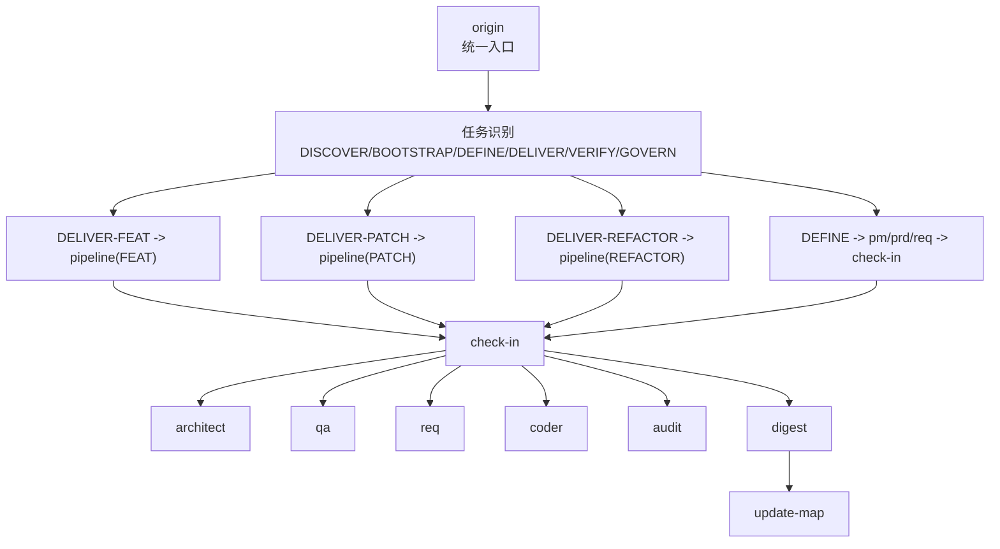
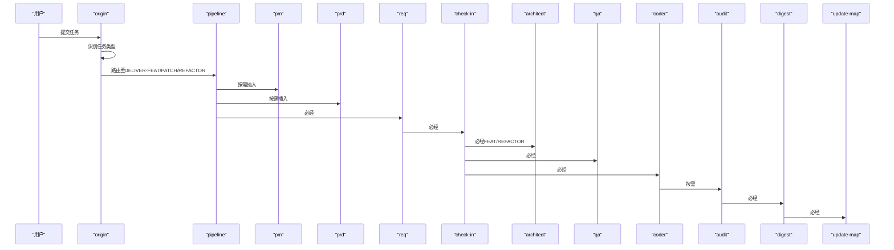
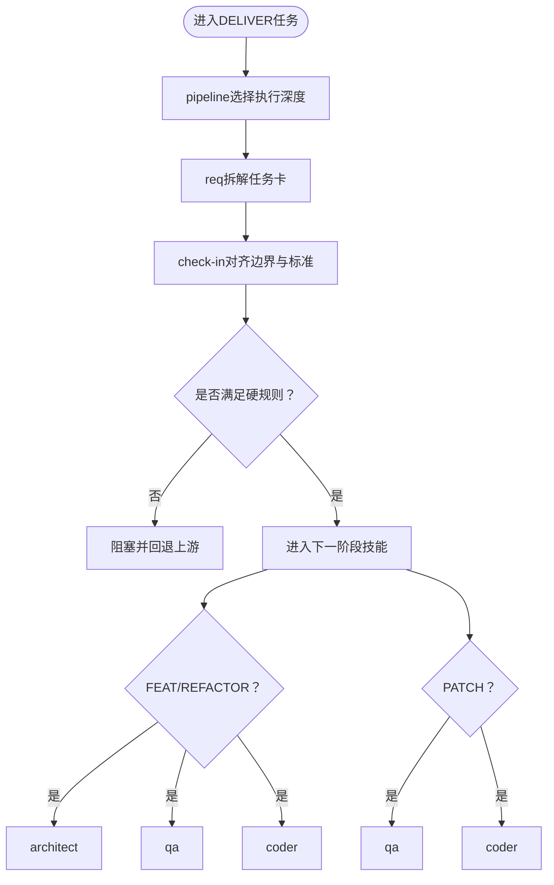
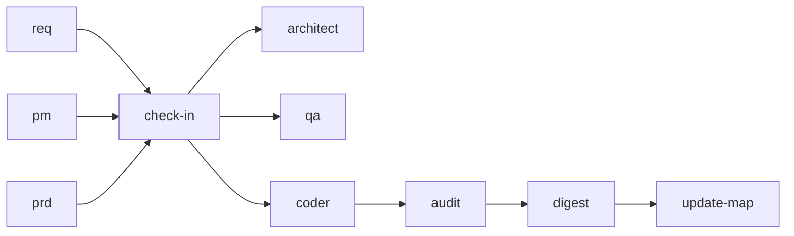

# 学习门禁技能 (Check-In)

<cite>
**本文引用的文件**
- [skills\web3-ai-agent\check-in\SKILL.md](file://skills/web3-ai-agent/check-in/SKILL.md)
- [skills\web3-ai-agent\SKILL.md](file://skills/web3-ai-agent/SKILL.md)
- [skills\web3-ai-agent\pipeline\SKILL.md](file://skills/web3-ai-agent/pipeline/SKILL.md)
- [skills\web3-ai-agent\architect\SKILL.md](file://skills/web3-ai-agent/architect/SKILL.md)
- [skills\web3-ai-agent\qa\SKILL.md](file://skills/web3-ai-agent/qa/SKILL.md)
- [skills\web3-ai-agent\coder\SKILL.md](file://skills/web3-ai-agent/coder/SKILL.md)
- [skills\web3-ai-agent\pm\SKILL.md](file://skills/web3-ai-agent/pm/SKILL.md)
- [skills\web3-ai-agent\prd\SKILL.md](file://skills/web3-ai-agent/prd/SKILL.md)
- [skills\web3-ai-agent\req\SKILL.md](file://skills/web3-ai-agent/req/SKILL.md)
- [skills\web3-ai-agent\digest\SKILL.md](file://skills/web3-ai-agent/digest/SKILL.md)
- [skills\web3-ai-agent\update-map\SKILL.md](file://skills/web3-ai-agent/update-map/SKILL.md)
- [skills\web3-ai-agent\init-docs\SKILL.md](file://skills/web3-ai-agent/init-docs/SKILL.md)
- [skills\web3-ai-agent\COMMANDS.md](file://skills/web3-ai-agent/COMMANDS.md)
</cite>

## 目录
1. [简介](#简介)
2. [项目结构](#项目结构)
3. [核心组件](#核心组件)
4. [架构总览](#架构总览)
5. [详细组件分析](#详细组件分析)
6. [依赖分析](#依赖分析)
7. [性能考虑](#性能考虑)
8. [故障排查指南](#故障排查指南)
9. [结论](#结论)
10. [附录](#附录)

## 简介
本文件面向AI-Agent学习门禁技能（Check-In），系统性阐述其在实施前门禁中的定位、适用场景、输出模板、风险控制机制、边界与硬性规则，以及与上下游技能的协作关系。Check-In作为DELIVER类任务的前置门禁，确保问题边界、方案与完成标准清晰，避免盲目编码、浅层修复、结构重构不等价、以及FEAT范围蔓延等风险。

## 项目结构
Web3 AI Agent技能体系以“主入口 -> 任务识别 -> 路由到子链路 -> 强制门禁 -> 实施链路 -> 复盘与地图更新”的方式组织。其中，Check-In是DELIVER-FEAT/PATCH/REFACTOR及准备进入实施的DEFINE任务的强制门禁节点。

图示来源
- [skills\web3-ai-agent\SKILL.md:41-72](file://skills/web3-ai-agent/SKILL.md#L41-L72)
- [skills\web3-ai-agent\pipeline\SKILL.md:29-58](file://skills/web3-ai-agent/pipeline/SKILL.md#L29-L58)
- [skills\web3-ai-agent\check-in\SKILL.md:12-23](file://skills/web3-ai-agent/check-in/SKILL.md#L12-L23)

章节来源
- [skills\web3-ai-agent\SKILL.md:21-72](file://skills/web3-ai-agent/SKILL.md#L21-L72)

## 核心组件
- Check-In：实施前门禁，强制适用于DELIVER-FEAT、DELIVER-PATCH、DELIVER-REFACTOR及准备进入实施的DEFINE任务；默认不强制DISCOVER、BOOTSTRAP、纯VERIFY/GOVERN。
- 输出模板：本阶段要解决的问题、本阶段必须掌握的上下文、本阶段采用的方案、本阶段不做什么、本阶段产物、本阶段完成标准、进入下一阶段前要调用的skill。
- 风险控制：防止直接上手写代码、PATCH只修表象、REFACTOR只谈结构不谈等价、FEAT在边界不清时扩scope。
- 边界与硬规则：不代替architect/qa/coder；没有check-in不得进入architect/qa/coder；必须明确“不做什么”；必须明确完成标准，否则视为未完成。

章节来源
- [skills\web3-ai-agent\check-in\SKILL.md:12-56](file://skills/web3-ai-agent/check-in/SKILL.md#L12-L56)

## 架构总览
DELIVER类任务的典型路径如下：pipeline根据任务类型选择执行深度，随后在必要节点插入按需技能（如architect、audit、browser-verify、prd），但所有DELIVER任务均需先通过check-in。VERIFY/GOVERN类任务走独立链路，不强制check-in。

图示来源
- [skills\web3-ai-agent\SKILL.md:112-152](file://skills/web3-ai-agent/SKILL.md#L112-L152)
- [skills\web3-ai-agent\pipeline\SKILL.md:34-53](file://skills/web3-ai-agent/pipeline/SKILL.md#L34-L53)
- [skills\web3-ai-agent\check-in\SKILL.md:57-64](file://skills/web3-ai-agent/check-in/SKILL.md#L57-L64)

## 详细组件分析

### Check-In技能定位与适用范围
- 定位：实施前门禁，不是全局门禁。
- 强制适用场景：DELIVER-FEAT、DELIVER-PATCH、DELIVER-REFACTOR、准备进入实施的DEFINE任务。
- 默认不强制场景：DISCOVER、BOOTSTRAP、纯VERIFY/GOVERN。

章节来源
- [skills\web3-ai-agent\check-in\SKILL.md:8-24](file://skills/web3-ai-agent/check-in/SKILL.md#L8-L24)
- [skills\web3-ai-agent\SKILL.md:57-72](file://skills/web3-ai-agent/SKILL.md#L57-L72)

### 输出模板结构
- 本阶段要解决的问题
- 本阶段必须掌握的上下文
- 本阶段采用的方案
- 本阶段不做什么
- 本阶段产物
- 本阶段完成标准
- 进入下一阶段前要调用的skill

章节来源
- [skills\web3-ai-agent\check-in\SKILL.md:25-35](file://skills/web3-ai-agent/check-in/SKILL.md#L25-L35)

### 风险控制机制
- 防止直接上手写代码：要求先在check-in明确问题、边界、方案与完成标准。
- 防止PATCH只修表象：强调“不做什么”与完成标准，避免治标不治本。
- 防止REFACTOR只谈结构不谈等价：要求明确等价性与风险边界，必要时回退prd/req。
- 防止FEAT在边界不清时扩scope：通过明确“不做什么”与完成标准，避免范围蔓延。

章节来源
- [skills\web3-ai-agent\check-in\SKILL.md:37-44](file://skills/web3-ai-agent/check-in/SKILL.md#L37-L44)

### 边界与硬性规则
- 边界：不代替architect、qa、coder。
- 硬规则：
  1) 没有check-in，不进入architect/qa/coder；
  2) check-in必须明确“不做什么”；
  3) check-in必须明确完成标准，否则视为未完成。

章节来源
- [skills\web3-ai-agent\check-in\SKILL.md:45-56](file://skills/web3-ai-agent/check-in/SKILL.md#L45-L56)

### 与其他技能的协作关系
- 与pipeline：DELIVER-FEAT/PATCH/REFACTOR均需通过check-in；pipeline按任务类型选择执行深度与按需技能。
- 与req：DELIVER类任务默认从req开始，check-in承接req的最小可执行任务卡，进一步明确边界与标准。
- 与architect：FEAT/REFACTOR在check-in后进入architect产出结构说明与契约。
- 与qa：check-in后进入qa，定义并执行验证策略（FEAT先RED，PATCH/REFACTOR轻量验证或回归验证）。
- 与coder：在边界与标准明确后，coder进行最多10轮自愈循环直至通过。
- 与digest/update-map：digest沉淀经验，update-map更新项目状态与下一步入口。

章节来源
- [skills\web3-ai-agent\SKILL.md:112-158](file://skills/web3-ai-agent/SKILL.md#L112-L158)
- [skills\web3-ai-agent\pipeline\SKILL.md:29-58](file://skills/web3-ai-agent/pipeline/SKILL.md#L29-L58)
- [skills\web3-ai-agent\req\SKILL.md:48-51](file://skills/web3-ai-agent/req/SKILL.md#L48-L51)
- [skills\web3-ai-agent\architect\SKILL.md:45-48](file://skills/web3-ai-agent/architect/SKILL.md#L45-L48)
- [skills\web3-ai-agent\qa\SKILL.md:63-67](file://skills/web3-ai-agent/qa/SKILL.md#L63-L67)
- [skills\web3-ai-agent\coder\SKILL.md:67-72](file://skills/web3-ai-agent/coder/SKILL.md#L67-L72)
- [skills\web3-ai-agent\digest\SKILL.md:42-44](file://skills/web3-ai-agent/digest/SKILL.md#L42-L44)
- [skills\web3-ai-agent\update-map\SKILL.md:39-42](file://skills/web3-ai-agent/update-map/SKILL.md#L39-L42)

### Check-In在DELIVER链路中的关键节点

图示来源
- [skills\web3-ai-agent\pipeline\SKILL.md:34-53](file://skills/web3-ai-agent/pipeline/SKILL.md#L34-L53)
- [skills\web3-ai-agent\check-in\SKILL.md:51-56](file://skills/web3-ai-agent/check-in/SKILL.md#L51-L56)

## 依赖分析
- 与上游依赖：
  - req：DELIVER类任务默认从req开始，check-in承接任务卡的边界与标准。
  - pm/prd（按需）：FEAT在check-in前可能经历pm/prd，明确价值主张与正式范围。
- 与下游依赖：
  - architect：FEAT/REFACTOR在check-in后进入architect产出结构说明与契约。
  - qa：check-in后进入qa定义验证策略。
  - coder：在check-in明确边界与标准后进入coder实施。
  - audit/digest/update-map：DELIVER完成后进入audit与digest沉淀，最终update-map更新项目状态。

图示来源
- [skills\web3-ai-agent\SKILL.md:112-158](file://skills/web3-ai-agent/SKILL.md#L112-L158)
- [skills\web3-ai-agent\pipeline\SKILL.md:34-53](file://skills/web3-ai-agent/pipeline/SKILL.md#L34-L53)

章节来源
- [skills\web3-ai-agent\SKILL.md:92-158](file://skills/web3-ai-agent/SKILL.md#L92-L158)
- [skills\web3-ai-agent\pipeline\SKILL.md:29-58](file://skills/web3-ai-agent/pipeline/SKILL.md#L29-L58)

## 性能考虑
- 通过在DELIVER前设置check-in门禁，减少无效编码与返工，提升整体交付效率。
- pipeline按任务类型选择执行深度，小任务优先短链路，避免“为完整而完整”的过度工程。
- coder最多10轮自愈循环，超限即终止并人工介入，避免长时间卡顿消耗资源。

章节来源
- [skills\web3-ai-agent\pipeline\SKILL.md:82-89](file://skills/web3-ai-agent/pipeline/SKILL.md#L82-L89)
- [skills\web3-ai-agent\coder\SKILL.md:39-48](file://skills/web3-ai-agent/coder/SKILL.md#L39-L48)

## 故障排查指南
- 未满足硬规则
  - 症状：无法进入architect/qa/coder。
  - 原因：未通过check-in或check-in未明确“不做什么”与完成标准。
  - 处理：回退至req或上游pm/prd，补充边界与标准后再进入check-in。
- PATCH只修表象
  - 症状：修复后问题反复出现。
  - 原因：未在check-in明确“不做什么”与完成标准，导致治标不治本。
  - 处理：回退至req或prd，重新梳理根因与验收标准。
- REFACTOR只谈结构不谈等价
  - 症状：重构后行为不一致或引入回归。
  - 原因：未在check-in明确等价性与风险边界。
  - 处理：回退至prd/req，补充等价性约束与回归检查点。
- FEAT边界不清扩scope
  - 症状：需求范围持续扩大。
  - 原因：未在check-in明确“不做什么”与完成标准。
  - 处理：回退至prd/req，收敛范围与验收标准。

章节来源
- [skills\web3-ai-agent\check-in\SKILL.md:51-56](file://skills/web3-ai-agent/check-in/SKILL.md#L51-L56)
- [skills\web3-ai-agent\req\SKILL.md:52-57](file://skills/web3-ai-agent/req/SKILL.md#L52-L57)
- [skills\web3-ai-agent\prd\SKILL.md:50-54](file://skills/web3-ai-agent/prd/SKILL.md#L50-L54)
- [skills\web3-ai-agent\qa\SKILL.md:68-73](file://skills/web3-ai-agent/qa/SKILL.md#L68-L73)

## 结论
Check-In作为实施前门禁，通过强制对齐问题边界、方案与完成标准，有效规避DELIVER类任务的常见风险。其与pipeline、req、architect、qa、coder、audit、digest、update-map形成闭环协作，确保DELIVER任务在可控范围内高质量推进。严格遵守硬性规则与边界，是保障交付质量的关键。

## 附录
- 斜杠命令建议
  - 默认推荐：/origin + 任务描述
  - 其他常用命令：/pipeline feat /pipeline patch /pipeline refactor /check-in /architect /qa /coder /audit /digest /update-map /explore /init-docs /browser-verify /resolve-doc-conflicts

章节来源
- [skills\web3-ai-agent\COMMANDS.md:20-50](file://skills/web3-ai-agent/COMMANDS.md#L20-L50)
- [skills\web3-ai-agent\SKILL.md:178-224](file://skills/web3-ai-agent/SKILL.md#L178-L224)