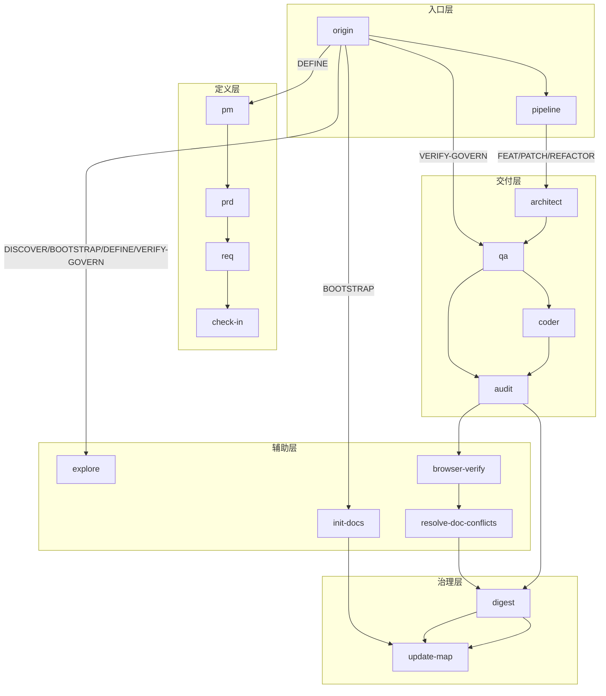
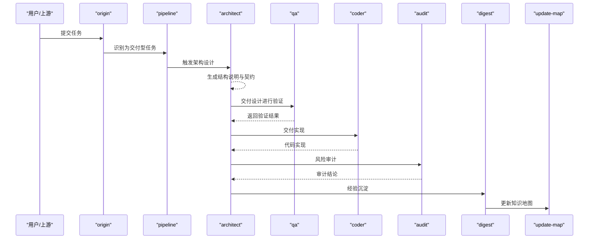
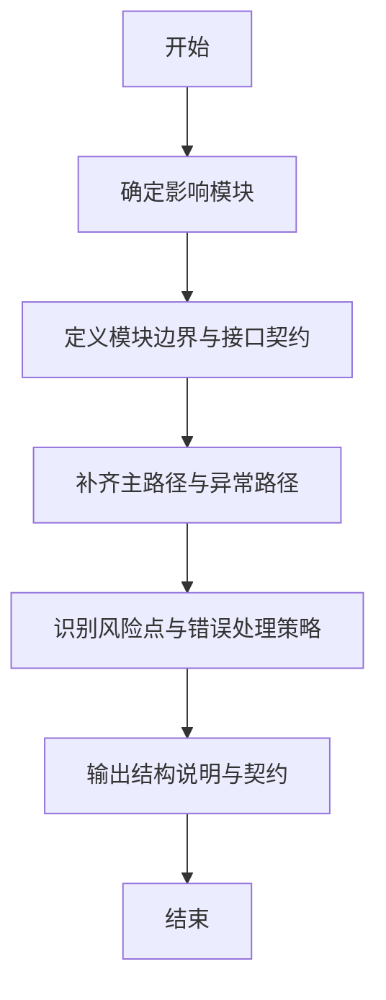
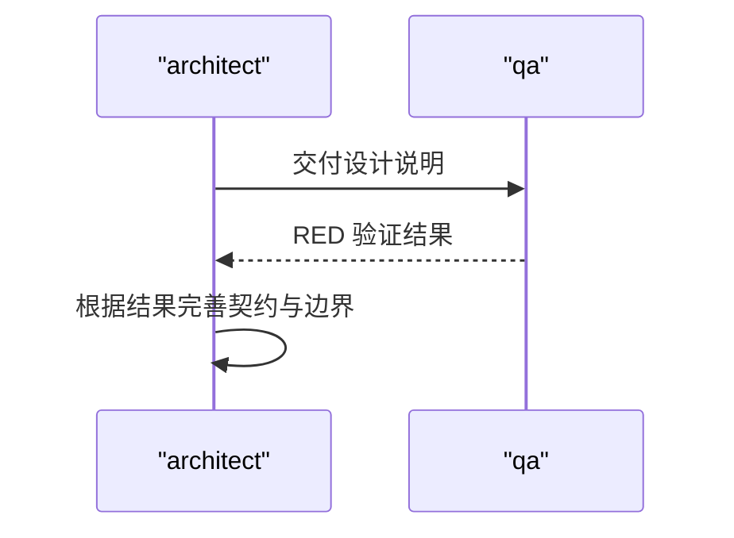
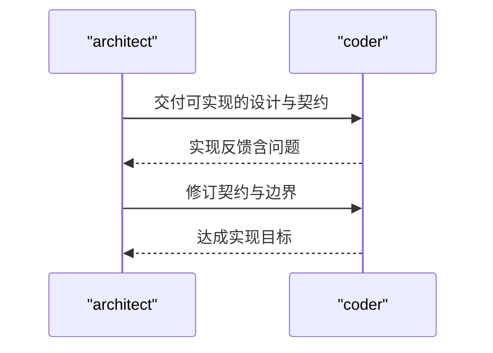
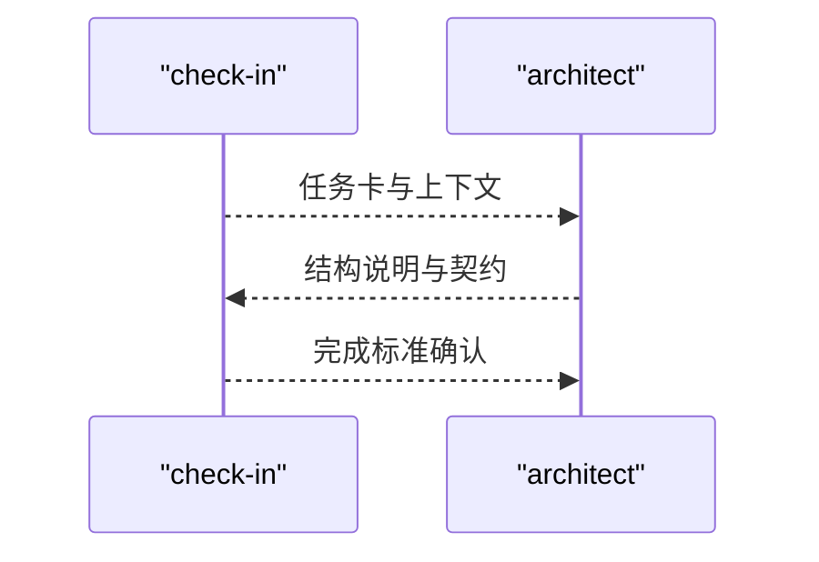
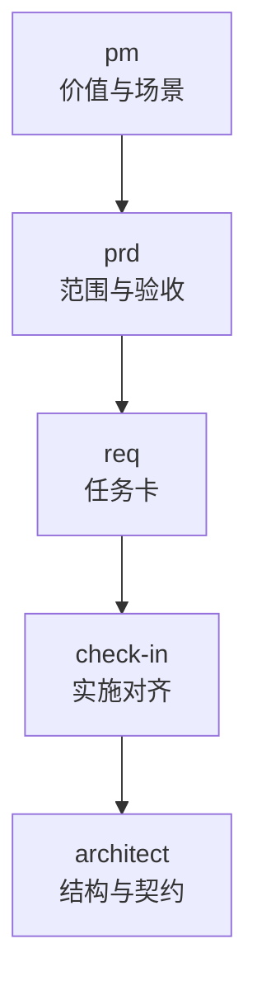
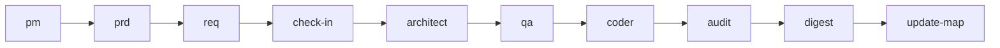

# 架构设计技能 (Architect)

<cite>
**本文引用的文件**
- [skills\web3-ai-agent\architect\SKILL.md](file://skills/web3-ai-agent/architect/SKILL.md)
- [skills\web3-ai-agent\SKILL-SYSTEM-DESIGN-V3.md](file://skills/web3-ai-agent/SKILL-SYSTEM-DESIGN-V3.md)
- [skills\web3-ai-agent\MAP-V3.md](file://skills/web3-ai-agent/MAP-V3.md)
- [skills\web3-ai-agent\TEMPLATES-V3.md](file://skills/web3-ai-agent/TEMPLATES-V3.md)
- [skills\web3-ai-agent\COMMANDS.md](file://skills/web3-ai-agent/COMMANDS.md)
- [skills\web3-ai-agent\check-in\SKILL.md](file://skills/web3-ai-agent/check-in/SKILL.md)
- [skills\web3-ai-agent\pm\SKILL.md](file://skills/web3-ai-agent/pm/SKILL.md)
- [skills\web3-ai-agent\prd\SKILL.md](file://skills/web3-ai-agent/prd/SKILL.md)
- [skills\web3-ai-agent\req\SKILL.md](file://skills/web3-ai-agent/req/SKILL.md)
</cite>

## 目录
1. [简介](#简介)
2. [项目结构](#项目结构)
3. [核心组件](#核心组件)
4. [架构总览](#架构总览)
5. [详细组件分析](#详细组件分析)
6. [依赖分析](#依赖分析)
7. [性能考虑](#性能考虑)
8. [故障排查指南](#故障排查指南)
9. [结论](#结论)
10. [附录](#附录)

## 简介
Architect 技能负责在任务涉及结构变化、接口变化、状态流变化、模块边界变化或结构性重构时，产出结构说明与接口契约，确保设计阶段的边界清晰、数据流与消息流可追溯、错误处理与风险点受控。Architect 不直接承担编码与测试，而是通过“结构说明 + 契约”的形式驱动后续 QA 与 Coder 的工作。

## 项目结构
本技能位于 web3-ai-agent 技能系统中，遵循 V3 的分层与路由规则：
- 入口层：origin、pipeline
- 定义层：pm、prd、req、check-in
- 交付层：architect、qa、coder、audit
- 治理层：digest、update-map
- 辅助层：explore、init-docs、browser-verify、resolve-doc-conflicts

Architect 位于交付层，通常在 FEAT 与 REFACTOR 的设计阶段被触发；在 PATCH 中若涉及结构变化也会被按需插入。

图表来源
- [skills\web3-ai-agent\MAP-V3.md:1-166](file://skills/web3-ai-agent/MAP-V3.md#L1-L166)
- [skills\web3-ai-agent\SKILL-SYSTEM-DESIGN-V3.md:164-220](file://skills/web3-ai-agent/SKILL-SYSTEM-DESIGN-V3.md#L164-L220)

章节来源
- [skills\web3-ai-agent\SKILL-SYSTEM-DESIGN-V3.md:1-719](file://skills/web3-ai-agent/SKILL-SYSTEM-DESIGN-V3.md#L1-L719)
- [skills\web3-ai-agent\MAP-V3.md:1-166](file://skills/web3-ai-agent/MAP-V3.md#L1-L166)

## 核心组件
- 适用场景
  - 有接口变化
  - 有状态流变化
  - 有模块边界变化
  - 有结构性重构
- 输入
  - 来自 check-in 的任务卡与上下文
  - 来自 pm/prd/req 的需求与范围定义
- 输出
  - 结构说明与接口契约文档
  - 数据流与消息流设计
  - 风险点与错误处理策略
- 流程
  - 确定影响模块
  - 定义边界与契约
  - 补齐主路径与异常路径
- 边界
  - 不直接写测试
  - 不直接承担编码
- 衔接
  - 进入 qa 或 coder
- 规则
  - 若只是纯局部修补且无结构变化，可跳过
  - 若发现需求边界变化，回退至 prd/req

章节来源
- [skills\web3-ai-agent\architect\SKILL.md:1-53](file://skills/web3-ai-agent/architect/SKILL.md#L1-L53)

## 架构总览
Architect 在 V3 中的定位是“结构设计”，其职责包括：
- 模块边界定义
- 接口契约制定
- 数据流与消息流设计
- 错误处理与风险控制
Architect 与 QA、Coder 的协作关系如下：

图表来源
- [skills\web3-ai-agent\SKILL-SYSTEM-DESIGN-V3.md:498-565](file://skills/web3-ai-agent/SKILL-SYSTEM-DESIGN-V3.md#L498-L565)
- [skills\web3-ai-agent\MAP-V3.md:104-131](file://skills/web3-ai-agent/MAP-V3.md#L104-L131)

章节来源
- [skills\web3-ai-agent\SKILL-SYSTEM-DESIGN-V3.md:498-565](file://skills/web3-ai-agent/SKILL-SYSTEM-DESIGN-V3.md#L498-L565)
- [skills\web3-ai-agent\MAP-V3.md:104-131](file://skills/web3-ai-agent/MAP-V3.md#L104-L131)

## 详细组件分析

### 组件：Architect 技能
- 功能要点
  - 面向结构变化与边界调整，输出“结构说明 + 契约”
  - 明确模块边界、接口契约、数据流与消息流
  - 识别风险点与错误处理策略
- 输入输出规范
  - 输入：check-in 任务卡、pm/prd/req 的范围与约束、上下文
  - 输出：结构说明、接口契约、数据/消息流、风险与错误处理
- 流程规范
  - 确定影响模块
  - 定义边界与契约
  - 补齐主路径与异常路径
- 边界与规则
  - 不直接写测试、不直接编码
  - 若仅局部修补且无结构变化，可跳过
  - 若需求边界变化，回退 prd/req

图表来源
- [skills\web3-ai-agent\architect\SKILL.md:34-53](file://skills/web3-ai-agent/architect/SKILL.md#L34-L53)

章节来源
- [skills\web3-ai-agent\architect\SKILL.md:1-53](file://skills/web3-ai-agent/architect/SKILL.md#L1-L53)

### 组件：与 QA 的衔接
- QA 在 FEAT 默认先执行 RED，验证主路径与异常路径，确保设计可验证
- PATCH/REFACTOR 默认不强制完整 RED，但必须保留验证或回归检查
- QA 的验证结果反馈给 Architect，指导后续设计迭代

图表来源
- [skills\web3-ai-agent\SKILL-SYSTEM-DESIGN-V3.md:700-705](file://skills/web3-ai-agent/SKILL-SYSTEM-DESIGN-V3.md#L700-L705)

章节来源
- [skills\web3-ai-agent\SKILL-SYSTEM-DESIGN-V3.md:700-705](file://skills/web3-ai-agent/SKILL-SYSTEM-DESIGN-V3.md#L700-L705)

### 组件：与 Coder 的衔接
- Coder 负责将 Architect 的契约与设计转化为代码
- Coder 自愈上限为 10 轮，超限需人工介入
- Architect 与 Coder 的衔接以“可验证的设计 + 清晰的契约”为基础

图表来源
- [skills\web3-ai-agent\SKILL-SYSTEM-DESIGN-V3.md:706-711](file://skills/web3-ai-agent/SKILL-SYSTEM-DESIGN-V3.md#L706-L711)

章节来源
- [skills\web3-ai-agent\SKILL-SYSTEM-DESIGN-V3.md:706-711](file://skills/web3-ai-agent/SKILL-SYSTEM-DESIGN-V3.md#L706-L711)

### 组件：check-in 与 Architect 的关系
- check-in 是实施前对齐点，Architect 通常在 check-in 之后被触发
- Architect 的输出需与 check-in 的“完成标准”对齐，确保设计可交付

图表来源
- [skills\web3-ai-agent\check-in\SKILL.md:25-35](file://skills/web3-ai-agent/check-in/SKILL.md#L25-L35)
- [skills\web3-ai-agent\architect\SKILL.md:15-32](file://skills/web3-ai-agent/architect/SKILL.md#L15-L32)

章节来源
- [skills\web3-ai-agent\check-in\SKILL.md:1-56](file://skills/web3-ai-agent/check-in/SKILL.md#L1-L56)
- [skills\web3-ai-agent\architect\SKILL.md:15-32](file://skills/web3-ai-agent/architect/SKILL.md#L15-L32)

### 组件：定义层（pm/prd/req）与 Architect 的关系
- pm：目标模糊时整理价值主张与 MVP 方向
- prd：定义正式范围、非目标与验收标准
- req：拆成最小可执行任务卡
- Architect 在设计阶段基于上述定义进一步细化结构与契约

图表来源
- [skills\web3-ai-agent\pm\SKILL.md:1-53](file://skills/web3-ai-agent/pm/SKILL.md#L1-L53)
- [skills\web3-ai-agent\prd\SKILL.md:1-54](file://skills/web3-ai-agent/prd/SKILL.md#L1-L54)
- [skills\web3-ai-agent\req\SKILL.md:1-57](file://skills/web3-ai-agent/req/SKILL.md#L1-L57)
- [skills\web3-ai-agent\check-in\SKILL.md:1-56](file://skills/web3-ai-agent/check-in/SKILL.md#L1-L56)
- [skills\web3-ai-agent\architect\SKILL.md:1-53](file://skills/web3-ai-agent/architect/SKILL.md#L1-L53)

章节来源
- [skills\web3-ai-agent\pm\SKILL.md:1-53](file://skills/web3-ai-agent/pm/SKILL.md#L1-L53)
- [skills\web3-ai-agent\prd\SKILL.md:1-54](file://skills/web3-ai-agent/prd/SKILL.md#L1-L54)
- [skills\web3-ai-agent\req\SKILL.md:1-57](file://skills/web3-ai-agent/req/SKILL.md#L1-L57)
- [skills\web3-ai-agent\check-in\SKILL.md:1-56](file://skills/web3-ai-agent/check-in/SKILL.md#L1-L56)
- [skills\web3-ai-agent\architect\SKILL.md:1-53](file://skills/web3-ai-agent/architect/SKILL.md#L1-L53)

## 依赖分析
- Architect 依赖于定义层提供的范围与约束，以及 check-in 的实施对齐
- Architect 与 QA、Coder 的耦合通过“契约 + 可验证设计”解耦
- 与治理层（digest/update-map）的集成在交付闭环末端完成

图表来源
- [skills\web3-ai-agent\SKILL-SYSTEM-DESIGN-V3.md:439-601](file://skills/web3-ai-agent/SKILL-SYSTEM-DESIGN-V3.md#L439-L601)
- [skills\web3-ai-agent\MAP-V3.md:102-131](file://skills/web3-ai-agent/MAP-V3.md#L102-L131)

章节来源
- [skills\web3-ai-agent\SKILL-SYSTEM-DESIGN-V3.md:439-601](file://skills/web3-ai-agent/SKILL-SYSTEM-DESIGN-V3.md#L439-L601)
- [skills\web3-ai-agent\MAP-V3.md:102-131](file://skills/web3-ai-agent/MAP-V3.md#L102-L131)

## 性能考虑
- Architect 的设计应聚焦“结构与契约”，避免陷入实现细节，从而提升与 QA/Coder 的协作效率
- 通过明确的数据流与消息流设计，减少实现过程中的反复沟通成本
- 将风险点与错误处理前置到设计阶段，降低回归与返工概率

## 故障排查指南
- 若 Architect 输出后 QA 无法验证，应回溯 check-in 的“完成标准”是否清晰
- 若 Coder 无法落地，应回溯 Architect 的契约是否可执行、边界是否明确
- 若审计未通过，应回溯 Architect 的风险识别与错误处理策略是否充分

章节来源
- [skills\web3-ai-agent\SKILL-SYSTEM-DESIGN-V3.md:712-719](file://skills/web3-ai-agent/SKILL-SYSTEM-DESIGN-V3.md#L712-L719)

## 结论
Architect 技能在 V3 中承担“结构设计”的核心职责，通过“模块边界 + 接口契约 + 数据/消息流 + 风险与错误处理”的标准化输出，为 QA 与 Coder 提供可验证、可落地的设计基线。其与定义层、check-in、治理层的协同，构成了高效、可控的交付闭环。

## 附录

### 架构设计模板（摘自 V3 模板）
- 结构说明
  - 目标
  - 模块边界
  - 数据流
  - 消息流
  - 接口契约
  - 错误处理
  - 风险点
- check-in 模板（按任务类型）
  - FEAT/ PATCH/ REFACTOR 的具体模板字段与完成标准

章节来源
- [skills\web3-ai-agent\architect\SKILL.md:20-32](file://skills/web3-ai-agent/architect/SKILL.md#L20-L32)
- [skills\web3-ai-agent\TEMPLATES-V3.md:1-152](file://skills/web3-ai-agent/TEMPLATES-V3.md#L1-L152)

### 设计决策记录与评审标准（建议）
- 设计决策记录
  - 记录边界定义、接口契约选择的理由与权衡
  - 记录数据流与消息流的关键节点与异常分支
- 评审标准
  - 是否满足需求边界与验收标准
  - 是否具备可验证性与可回溯性
  - 是否识别并缓解关键风险

章节来源
- [skills\web3-ai-agent\SKILL-SYSTEM-DESIGN-V3.md:678-694](file://skills/web3-ai-agent/SKILL-SYSTEM-DESIGN-V3.md#L678-L694)

### 与 QA、Coder 的协作流程（示例）
- FEAT：architect -> qa（RED）-> coder -> audit -> digest -> update-map
- PATCH：architect（按需）-> coder -> qa -> digest -> update-map
- REFACTOR：architect -> qa -> coder -> audit -> digest -> update-map

章节来源
- [skills\web3-ai-agent\MAP-V3.md:104-131](file://skills/web3-ai-agent/MAP-V3.md#L104-L131)
- [skills\web3-ai-agent\SKILL-SYSTEM-DESIGN-V3.md:292-392](file://skills/web3-ai-agent/SKILL-SYSTEM-DESIGN-V3.md#L292-L392)

### 斜杠命令与推荐入口
- 推荐使用 /origin 作为默认入口，明确任务类型后再路由到相应技能
- 命令总表包含 /origin、/pipeline、/pm、/prd、/req、/check-in、/architect、/qa、/coder、/audit、/digest、/update-map、/explore、/init-docs、/browser-verify、/resolve-doc-conflicts

章节来源
- [skills\web3-ai-agent\COMMANDS.md:1-81](file://skills/web3-ai-agent/COMMANDS.md#L1-L81)