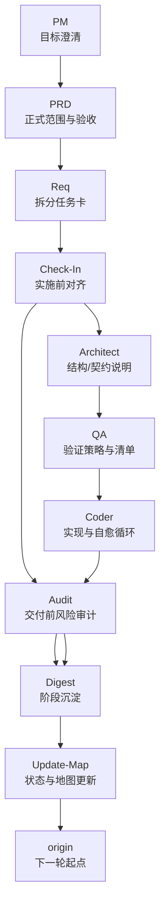
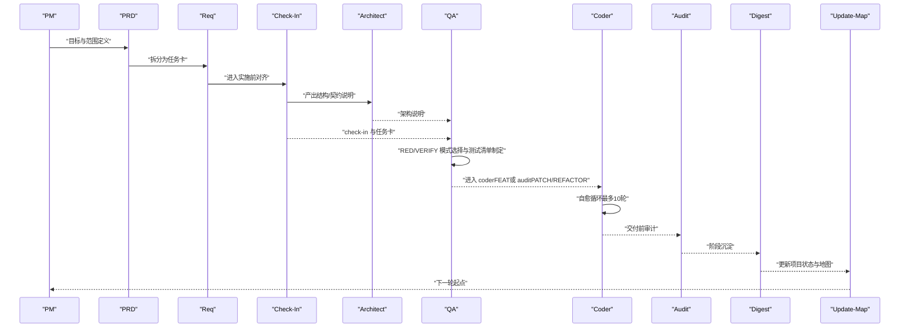
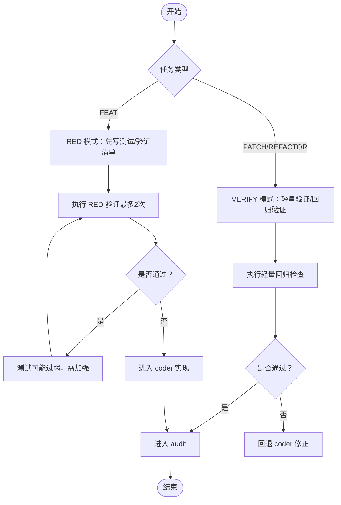
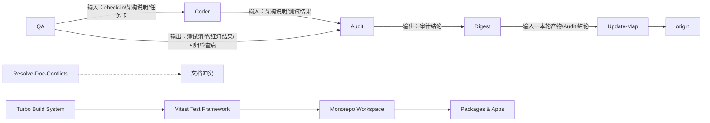

# 质量保证技能（QA）

<cite>
**本文引用的文件**
- [skills/web3-ai-agent/qa/SKILL.md](file://skills/web3-ai-agent/qa/SKILL.md)
- [skills/web3-ai-agent/architect/SKILL.md](file://skills/web3-ai-agent/architect/SKILL.md)
- [skills/web3-ai-agent/coder/SKILL.md](file://skills/web3-ai-agent/coder/SKILL.md)
- [skills/web3-ai-agent/check-in/SKILL.md](file://skills/web3-ai-agent/check-in/SKILL.md)
- [skills/web3-ai-agent/audit/SKILL.md](file://skills/web3-ai-agent/audit/SKILL.md)
- [skills/web3-ai-agent/req/SKILL.md](file://skills/web3-ai-agent/req/SKILL.md)
- [skills/web3-ai-agent/prd/SKILL.md](file://skills/web3-ai-agent/prd/SKILL.md)
- [skills/web3-ai-agent/pm/SKILL.md](file://skills/web3-ai-agent/pm/SKILL.md)
- [skills/web3-ai-agent/digest/SKILL.md](file://skills/web3-ai-agent/digest/SKILL.md)
- [skills/web3-ai-agent/update-map/SKILL.md](file://skills/web3-ai-agent/update-map/SKILL.md)
- [skills/web3-ai-agent/resolve-doc-conflicts/SKILL.md](file://skills/web3-ai-agent/resolve-doc-conflicts/SKILL.md)
- [vitest.workspace.ts](file://vitest.workspace.ts)
- [apps/web/vitest.config.ts](file://apps/web/vitest.config.ts)
- [apps/web/test-setup.tsx](file://apps/web/test-setup.tsx)
- [apps/web/lib/tokens.test.ts](file://apps/web/lib/tokens.test.ts)
- [apps/web/lib/memory/config.test.ts](file://apps/web/lib/memory/config.test.ts)
- [apps/web/components/ChatInput.test.tsx](file://apps/web/components/ChatInput.test.tsx)
- [apps/web/hooks/useChatStream.test.ts](file://apps/web/hooks/useChatStream.test.ts)
- [packages/ai-config/vitest.config.ts](file://packages/ai-config/vitest.config.ts)
- [packages/web3-tools/vitest.config.ts](file://packages/web3-tools/vitest.config.ts)
- [package.json](file://package.json)
- [docs/test-report.md](file://docs/test-report.md)
</cite>

## 目录
1. [简介](#简介)
2. [项目结构](#项目结构)
3. [核心组件](#核心组件)
4. [架构总览](#架构总览)
5. [详细组件分析](#详细组件分析)
6. [依赖分析](#依赖分析)
7. [性能考虑](#性能考虑)
8. [故障排查指南](#故障排查指南)
9. [结论](#结论)
10. [附录](#附录)

## 简介
本文件面向"质量保证技能（QA）"的系统化技术文档，聚焦于将完成标准转化为可执行的验证清单与测试策略，确保在不同任务类型（如 FEAT、PATCH、REFACTOR）下具备一致的质量门禁与风险控制。文档覆盖测试策略制定、验收条件设计、风险评估、输入输出规范、测试用例设计方法、质量评估指标、缺陷跟踪机制与质量度量标准，并给出最佳实践、测试金字塔应用与持续集成策略建议。同时，阐明与 Architect、Coder、Audit 等技能的协作关系与质量门禁机制。

**新增内容**：本版本特别强化了单元测试实施、测试覆盖率要求和测试最佳实践相关内容，基于实际的Vitest配置和测试用例实现，为QA技能提供了可操作的技术支撑。

## 项目结构
本仓库采用"技能（Skill）+ 流水线"的组织方式，QA 技能位于 skills/web3-ai-agent/qa 目录，其上下游技能通过统一的输入/输出模板与门禁规则串联，形成端到端的质量闭环。



**图示来源**
- [skills/web3-ai-agent/pm/SKILL.md:1-53](file://skills/web3-ai-agent/pm/SKILL.md#L1-L53)
- [skills/web3-ai-agent/prd/SKILL.md:1-54](file://skills/web3-ai-agent/prd/SKILL.md#L1-L54)
- [skills/web3-ai-agent/req/SKILL.md:1-57](file://skills/web3-ai-agent/req/SKILL.md#L1-L57)
- [skills/web3-ai-agent/check-in/SKILL.md:1-56](file://skills/web3-ai-agent/check-in/SKILL.md#L1-L56)
- [skills/web3-ai-agent/architect/SKILL.md:1-53](file://skills/web3-ai-agent/architect/SKILL.md#L1-L53)
- [skills/web3-ai-agent/qa/SKILL.md:1-73](file://skills/web3-ai-agent/qa/SKILL.md#L1-L73)
- [skills/web3-ai-agent/coder/SKILL.md:1-72](file://skills/web3-ai-agent/coder/SKILL.md#L1-L72)
- [skills/web3-ai-agent/audit/SKILL.md:1-88](file://skills/web3-ai-agent/audit/SKILL.md#L1-L88)
- [skills/web3-ai-agent/digest/SKILL.md:1-50](file://skills/web3-ai-agent/digest/SKILL.md#L1-L50)
- [skills/web3-ai-agent/update-map/SKILL.md:1-47](file://skills/web3-ai-agent/update-map/SKILL.md#L1-L47)

**章节来源**
- [skills/web3-ai-agent/qa/SKILL.md:1-73](file://skills/web3-ai-agent/qa/SKILL.md#L1-L73)
- [skills/web3-ai-agent/architect/SKILL.md:1-53](file://skills/web3-ai-agent/architect/SKILL.md#L1-L53)
- [skills/web3-ai-agent/coder/SKILL.md:1-72](file://skills/web3-ai-agent/coder/SKILL.md#L1-L72)
- [skills/web3-ai-agent/check-in/SKILL.md:1-56](file://skills/web3-ai-agent/check-in/SKILL.md#L1-L56)
- [skills/web3-ai-agent/audit/SKILL.md:1-88](file://skills/web3-ai-agent/audit/SKILL.md#L1-L88)
- [skills/web3-ai-agent/req/SKILL.md:1-57](file://skills/web3-ai-agent/req/SKILL.md#L1-L57)
- [skills/web3-ai-agent/prd/SKILL.md:1-54](file://skills/web3-ai-agent/prd/SKILL.md#L1-L54)
- [skills/web3-ai-agent/pm/SKILL.md:1-53](file://skills/web3-ai-agent/pm/SKILL.md#L1-L53)
- [skills/web3-ai-agent/digest/SKILL.md:1-50](file://skills/web3-ai-agent/digest/SKILL.md#L1-L50)
- [skills/web3-ai-agent/update-map/SKILL.md:1-47](file://skills/web3-ai-agent/update-map/SKILL.md#L1-L47)
- [skills/web3-ai-agent/resolve-doc-conflicts/SKILL.md:1-40](file://skills/web3-ai-agent/resolve-doc-conflicts/SKILL.md#L1-L40)

## 核心组件
- QA 技能定位与职责
  - 定位：QA 不是"最后顺手测一下"，而是负责定义与执行验证策略，确保在实现前明确测试边界与通过条件。
  - 两种工作模式：
    - RED 模式：适用于 FEAT，强调在实现前先写出"红灯"（失败）测试/验证，以确保当前未通过，且 RED 验证最多运行两次。
    - VERIFY 模式：适用于 PATCH/REFACTOR，强调轻量验证或回归验证，优先保障回归风险可控。
  - 输入：check-in、架构说明、任务卡。
  - 输出：测试清单、红灯结果或验证结果、回归检查点。
  - 红绿规则：FEAT 先红后绿；QA 阶段负责 RED；Coder 阶段负责将 RED 全部变为 GREEN；若 RED 意外通过，需反思测试强度。
  - 边界：不直接写业务实现，不扩大需求范围。
  - 衔接：FEAT 进入 coder；PATCH/REFACTOR 进入 coder 或 audit。
  - 规则：QA 必须引用 check-in 的完成标准；REFACTOR 默认优先保障回归验证；PATCH 至少保留轻量回归检查。

**新增内容**：基于实际的Vitest测试配置，QA技能现在具备完善的单元测试基础设施支持，包括monorepo工作区配置、测试环境设置和测试最佳实践指导。

**章节来源**
- [skills/web3-ai-agent/qa/SKILL.md:1-73](file://skills/web3-ai-agent/qa/SKILL.md#L1-L73)

## 架构总览
QA 技能在整体流水线中的位置与职责如下：



**图示来源**
- [skills/web3-ai-agent/pm/SKILL.md:1-53](file://skills/web3-ai-agent/pm/SKILL.md#L1-L53)
- [skills/web3-ai-agent/prd/SKILL.md:1-54](file://skills/web3-ai-agent/prd/SKILL.md#L1-L54)
- [skills/web3-ai-agent/req/SKILL.md:1-57](file://skills/web3-ai-agent/req/SKILL.md#L1-L57)
- [skills/web3-ai-agent/check-in/SKILL.md:1-56](file://skills/web3-ai-agent/check-in/SKILL.md#L1-L56)
- [skills/web3-ai-agent/architect/SKILL.md:1-53](file://skills/web3-ai-agent/architect/SKILL.md#L1-L53)
- [skills/web3-ai-agent/qa/SKILL.md:1-73](file://skills/web3-ai-agent/qa/SKILL.md#L1-L73)
- [skills/web3-ai-agent/coder/SKILL.md:1-72](file://skills/web3-ai-agent/coder/SKILL.md#L1-L72)
- [skills/web3-ai-agent/audit/SKILL.md:1-88](file://skills/web3-ai-agent/audit/SKILL.md#L1-L88)
- [skills/web3-ai-agent/digest/SKILL.md:1-50](file://skills/web3-ai-agent/digest/SKILL.md#L1-L50)
- [skills/web3-ai-agent/update-map/SKILL.md:1-47](file://skills/web3-ai-agent/update-map/SKILL.md#L1-L47)

## 详细组件分析

### QA 技能：输入/输出与质量门禁
- 输入
  - check-in：明确"本阶段要解决的问题、必须掌握的上下文、采用的方案、本阶段不做什么、完成标准"等，作为 QA 制定验证策略的依据。
  - 架构说明：由 Architect 产出，包含模块边界、数据流、消息流、接口契约、错误处理与风险点，用于指导测试覆盖。
  - 任务卡：由 Req 产出，包含来源、目标、影响范围、依赖关系、验收标准、下一跳，用于限定测试范围与通过条件。
- 输出
  - 测试清单：基于完成标准与架构说明，拆解为可执行的验证条目（含边界、异常、回归等维度）。
  - 红灯结果或验证结果：RED 模式下输出"当前未通过"的证据；VERIFY 模式下输出轻量验证或回归检查结果。
  - 回归检查点：针对 PATCH/REFACTOR 的关键路径与历史易错点，形成可重复验证的回归清单。
- 质量门禁
  - 必须引用 check-in 的完成标准，否则视为未完成。
  - RED 验证最多两次，避免过度测试但确保基本验证。
  - 若 RED 意外通过，需反思测试强度并修正。
  - PATCH 至少保留轻量回归检查；REFACTOR 默认优先回归验证。

**章节来源**
- [skills/web3-ai-agent/qa/SKILL.md:39-73](file://skills/web3-ai-agent/qa/SKILL.md#L39-L73)
- [skills/web3-ai-agent/check-in/SKILL.md:25-56](file://skills/web3-ai-agent/check-in/SKILL.md#L25-L56)
- [skills/web3-ai-agent/architect/SKILL.md:20-32](file://skills/web3-ai-agent/architect/SKILL.md#L20-L32)
- [skills/web3-ai-agent/req/SKILL.md:20-35](file://skills/web3-ai-agent/req/SKILL.md#L20-L35)

### RED 模式与 VERIFY 模式的流程对比


**图示来源**
- [skills/web3-ai-agent/qa/SKILL.md:12-38](file://skills/web3-ai-agent/qa/SKILL.md#L12-L38)
- [skills/web3-ai-agent/coder/SKILL.md:18-37](file://skills/web3-ai-agent/coder/SKILL.md#L18-L37)
- [skills/web3-ai-agent/audit/SKILL.md:12-25](file://skills/web3-ai-agent/audit/SKILL.md#L12-L25)

**章节来源**
- [skills/web3-ai-agent/qa/SKILL.md:12-38](file://skills/web3-ai-agent/qa/SKILL.md#L12-L38)
- [skills/web3-ai-agent/coder/SKILL.md:18-37](file://skills/web3-ai-agent/coder/SKILL.md#L18-L37)
- [skills/web3-ai-agent/audit/SKILL.md:12-25](file://skills/web3-ai-agent/audit/SKILL.md#L12-L25)

### 与 Architect、Coder 的协作关系与红绿衔接
- 红绿规则
  - FEAT：QA 先 RED，Coder 将 RED 全部变为 GREEN。
  - 若 RED 意外通过，需反思测试强度；若发现 QA 的红灯与需求矛盾，应停止并报告，而非私自改需求。
- 与 Architect 的衔接
  - Architect 提供结构/契约说明，QA 基于此拆解测试边界与关键路径。
- 与 Coder 的衔接
  - Coder 通过最多 10 轮自愈循环将 RED 变为 GREEN；超过 10 轮需输出 STUCK 报告并请求人工介入。

**章节来源**
- [skills/web3-ai-agent/qa/SKILL.md:51-56](file://skills/web3-ai-agent/qa/SKILL.md#L51-L56)
- [skills/web3-ai-agent/architect/SKILL.md:45-47](file://skills/web3-ai-agent/architect/SKILL.md#L45-L47)
- [skills/web3-ai-agent/coder/SKILL.md:49-59](file://skills/web3-ai-agent/coder/SKILL.md#L49-L59)

### 与 Audit 的协作关系与质量门禁
- Audit 作为交付前最后一道风险关，支持轻审与重审，评分阈值为 ≥80 通过，60–79 软拒绝，<60 直接拒绝。
- QA 结果与架构说明、check-in、代码结果共同构成审计输入。
- 通过：进入 digest；软拒绝：回退 coder；直接拒绝：终止并人工介入。

**章节来源**
- [skills/web3-ai-agent/audit/SKILL.md:34-68](file://skills/web3-ai-agent/audit/SKILL.md#L34-L68)
- [skills/web3-ai-agent/qa/SKILL.md:63-66](file://skills/web3-ai-agent/qa/SKILL.md#L63-L66)

### 与 Digest、Update-Map 的协作关系
- Digest：对本轮任务进行沉淀，记录完成项、问题、经验与建议，重点在于"为什么卡住/为什么成功"。
- Update-Map：更新项目状态、索引与下一步入口，确保下一轮任务基于最新上下文推进。

**章节来源**
- [skills/web3-ai-agent/digest/SKILL.md:12-36](file://skills/web3-ai-agent/digest/SKILL.md#L12-L36)
- [skills/web3-ai-agent/update-map/SKILL.md:12-33](file://skills/web3-ai-agent/update-map/SKILL.md#L12-L33)

### 测试策略制定与验收条件设计
- 从架构设计文档到测试用例的转换
  - 从 Architect 的模块边界、数据流、消息流、接口契约中提取测试边界与关键路径。
  - 从 Req 的验收标准与 check-in 的完成标准中提炼通过条件与否定条件。
  - 将通过条件映射为正向用例，将否定条件映射为反向用例与异常用例。
- 测试金字塔应用
  - 单元层：面向接口契约与关键算法的单元测试，确保核心逻辑正确性。
  - 集成层：面向模块边界与消息流的集成测试，验证跨模块交互。
  - 端到端层：面向用户场景与验收标准的 E2E 测试，验证端到端流程。
- 风险评估
  - 针对高风险场景（如 Web3 数据可信度、权限、资金、安全），采用更严格的测试策略与更长的验证时间。
  - 对 PATCH/REFACTOR，优先回归验证，确保历史易错点与关键路径不被破坏。

**新增内容**：基于实际的Vitest配置，测试金字塔现在有了完整的基础设施支持，包括monorepo工作区配置、测试环境设置和测试最佳实践。

**章节来源**
- [skills/web3-ai-agent/architect/SKILL.md:20-32](file://skills/web3-ai-agent/architect/SKILL.md#L20-L32)
- [skills/web3-ai-agent/req/SKILL.md:20-35](file://skills/web3-ai-agent/req/SKILL.md#L20-L35)
- [skills/web3-ai-agent/check-in/SKILL.md:25-35](file://skills/web3-ai-agent/check-in/SKILL.md#L25-L35)
- [skills/web3-ai-agent/audit/SKILL.md:26-32](file://skills/web3-ai-agent/audit/SKILL.md#L26-L32)

### 单元测试实施与测试覆盖率要求

#### Vitest 测试框架配置
项目采用Vitest作为主要测试框架，通过monorepo工作区配置实现了跨多个包的统一测试管理：

**工作区配置**
- 支持三个主要工作区：packages/ai-config、packages/web3-tools、apps/web
- 统一的测试环境配置，确保各包测试的一致性
- 通过turbo集成，支持并行测试执行

**应用层测试配置**
- 使用jsdom环境模拟浏览器DOM环境
- 支持React JSX自动编译
- 包含全局测试设置文件
- 配置了完整的模块别名映射

**章节来源**
- [vitest.workspace.ts:1-8](file://vitest.workspace.ts#L1-L8)
- [apps/web/vitest.config.ts:1-23](file://apps/web/vitest.config.ts#L1-L23)
- [packages/ai-config/vitest.config.ts:1-10](file://packages/ai-config/vitest.config.ts#L1-L10)
- [packages/web3-tools/vitest.config.ts:1-10](file://packages/web3-tools/vitest.config.ts#L1-L10)

#### 测试环境设置与Mock策略
项目建立了完善的测试环境设置，包括：

**全局测试设置**
- Jest DOM扩展，提供丰富的断言方法
- matchMedia模拟，支持主题切换测试
- Next.js导航模块mock，隔离外部依赖
- Next.js图像组件mock，简化UI测试
- Headers模块mock，支持服务端组件测试

**章节来源**
- [apps/web/test-setup.tsx:1-47](file://apps/web/test-setup.tsx#L1-L47)

#### 测试用例设计最佳实践

**工具函数测试**
基于tokens.test.ts展示的标准测试模式：
- 使用describe分组测试相关功能
- 使用it描述具体的行为期望
- 包含正向测试和负向测试
- 覆盖边界条件和异常情况

**组件测试**
基于ChatInput.test.tsx展示的React组件测试模式：
- 使用@testing-library/react进行DOM查询
- 使用userEvent模拟用户交互
- 测试事件处理和状态变化
- 验证组件渲染和交互行为

**Hook测试**
基于useChatStream.test.ts展示的自定义Hook测试模式：
- 使用renderHook测试Hook状态
- 使用fake timers控制异步操作
- 测试异步逻辑和错误处理
- 验证副作用和生命周期

**章节来源**
- [apps/web/lib/tokens.test.ts:1-77](file://apps/web/lib/tokens.test.ts#L1-L77)
- [apps/web/components/ChatInput.test.tsx:1-58](file://apps/web/components/ChatInput.test.tsx#L1-L58)
- [apps/web/hooks/useChatStream.test.ts:1-129](file://apps/web/hooks/useChatStream.test.ts#L1-L129)

#### 测试覆盖率要求与目标

**当前覆盖率估算**
根据测试报告，项目当前的测试覆盖率情况：
- 工具函数：约90%，纯函数易于测试
- Hooks：约80%，需要mock外部依赖
- 组件：约70%，主要覆盖用户交互
- API Routes：约75%，覆盖主要路由
- Providers：约85%，SDK mock完整

**覆盖率目标**
- 单元测试：核心逻辑覆盖率≥85%
- 集成测试：关键路径覆盖率≥70%
- 端到端测试：用户场景覆盖率≥60%
- 重要业务：100%测试覆盖

**章节来源**
- [docs/test-report.md:282-326](file://docs/test-report.md#L282-L326)

### 测试用例设计方法与质量评估指标
- 测试用例设计方法
  - 基于验收标准的等价类划分与边界值分析，覆盖主路径、异常路径与边界条件。
  - 基于架构契约的接口测试，验证输入输出约束与错误处理。
  - 基于回归检查点的回归测试，确保历史问题不再出现。
  - **新增**：基于Vitest最佳实践的单元测试设计，包括mock策略、异步测试和组件测试。
- 质量评估指标
  - 测试覆盖率：单元/集成/E2E 覆盖率目标与缺口分析。
  - 缺陷密度：每千行代码缺陷数，用于衡量实现质量。
  - 通过率：红绿通过率与回归通过率，用于衡量测试有效性。
  - 自愈循环次数：Coder 的自愈循环次数分布，用于衡量问题定位与修复效率。
  - **新增**：测试执行时间、测试稳定性、测试维护成本等指标。
- 缺陷跟踪机制
  - 以任务卡为缺陷入口，关联 check-in 的完成标准与架构说明，确保缺陷可追溯。
  - 对高风险缺陷采用一票否决机制，必要时直接终止并人工介入。

**章节来源**
- [skills/web3-ai-agent/audit/SKILL.md:52-77](file://skills/web3-ai-agent/audit/SKILL.md#L52-L77)
- [skills/web3-ai-agent/coder/SKILL.md:39-48](file://skills/web3-ai-agent/coder/SKILL.md#L39-L48)

### 持续集成策略与质量度量标准
- 持续集成策略
  - FEAT：在 QA 完成 RED 后，进入 Coder 的自愈循环；每次迭代后触发相关验证，直至 GREEN。
  - PATCH/REFACTOR：在 QA 完成 VERIFY 后，进入 Audit；若软拒绝，回退 Coder 修正后再审。
  - 超过 10 轮自愈仍未通过，输出 STUCK 报告并请求人工介入。
  - **新增**：集成Vitest测试执行，支持并行测试和覆盖率收集。
- 质量度量标准
  - RED 验证次数上限：2 次。
  - 自愈循环上限：10 轮。
  - Audit 通过阈值：≥80；软拒绝：60–79；直接拒绝：<60。
  - 回归检查点覆盖率：PATCH 至少保留轻量回归检查；REFACTOR 默认优先回归验证。
  - **新增**：测试覆盖率目标、测试执行时间限制、测试稳定性要求。

**章节来源**
- [skills/web3-ai-agent/qa/SKILL.md:23-28](file://skills/web3-ai-agent/qa/SKILL.md#L23-L28)
- [skills/web3-ai-agent/coder/SKILL.md:21-37](file://skills/web3-ai-agent/coder/SKILL.md#L21-L37)
- [skills/web3-ai-agent/audit/SKILL.md:64-68](file://skills/web3-ai-agent/audit/SKILL.md#L64-L68)

## 依赖分析
- 组件耦合与边界
  - QA 依赖 Architect 的结构/契约说明与 Req 的验收标准，不直接承担编码与需求定义。
  - Coder 依赖 QA 的测试清单与 Architect 的契约，不擅自修改验收标准。
  - Audit 依赖 QA 结果、架构说明与代码结果，不直接改代码。
  - **新增**：QA 现在依赖完善的测试基础设施，包括Vitest配置和测试工具链。
- 外部依赖与集成点
  - 文档冲突处理：Resolve-Doc-Conflicts 专门处理文档冲突，避免文档治理与代码修复混淆。
  - 项目状态更新：Digest 与 Update-Map 分别负责经验沉淀与状态更新，确保下一轮任务基于最新上下文。
  - **新增**：Turbo构建系统集成，支持并行测试执行和缓存优化。



**图示来源**
- [skills/web3-ai-agent/qa/SKILL.md:39-49](file://skills/web3-ai-agent/qa/SKILL.md#L39-L49)
- [skills/web3-ai-agent/coder/SKILL.md:12-17](file://skills/web3-ai-agent/coder/SKILL.md#L12-L17)
- [skills/web3-ai-agent/audit/SKILL.md:34-40](file://skills/web3-ai-agent/audit/SKILL.md#L34-L40)
- [skills/web3-ai-agent/digest/SKILL.md:12-17](file://skills/web3-ai-agent/digest/SKILL.md#L12-L17)
- [skills/web3-ai-agent/update-map/SKILL.md:12-17](file://skills/web3-ai-agent/update-map/SKILL.md#L12-L17)
- [skills/web3-ai-agent/resolve-doc-conflicts/SKILL.md:14-22](file://skills/web3-ai-agent/resolve-doc-conflicts/SKILL.md#L14-L22)
- [vitest.workspace.ts:1-8](file://vitest.workspace.ts#L1-L8)
- [package.json:6-12](file://package.json#L6-L12)

**章节来源**
- [skills/web3-ai-agent/resolve-doc-conflicts/SKILL.md:1-40](file://skills/web3-ai-agent/resolve-doc-conflicts/SKILL.md#L1-L40)

## 性能考虑
- RED 验证次数上限与自愈循环上限，有助于控制验证成本与反馈周期。
- 回归检查点优先策略，减少不必要的全量验证，提升回归效率。
- 高风险场景采用更严格测试策略，避免后期大规模返工。
- **新增**：Vitest并行测试执行，Turbo缓存优化，显著提升测试执行效率。

## 故障排查指南
- RED 意外通过
  - 现象：RED 验证直接通过。
  - 处理：反思测试强度，加强边界与异常用例，必要时回退 QA 重新评审。
- 自愈循环超限
  - 现象：超过 10 轮仍未通过。
  - 处理：输出 STUCK 报告，包含卡住原因、已尝试方案、当前阻塞点与建议人工介入方向。
- 软拒绝与直接拒绝
  - 现象：Audit 得分处于 60–79 或 <60。
  - 处理：软拒绝回退 Coder 修正；直接拒绝终止并人工介入或重定方案。
- **新增**：测试执行失败
  - 现象：Vitest测试执行失败或超时。
  - 处理：检查测试环境配置、mock设置和异步逻辑，确保测试稳定性。

**章节来源**
- [skills/web3-ai-agent/coder/SKILL.md:43-47](file://skills/web3-ai-agent/coder/SKILL.md#L43-L47)
- [skills/web3-ai-agent/audit/SKILL.md:64-68](file://skills/web3-ai-agent/audit/SKILL.md#L64-L68)

## 结论
QA 技能在整个流水线中承担"验证策略定义者"的角色，通过 RED/VERIFY 模式与严格的门禁规则，确保 FEAT 的实现质量与 PATCH/REFACTOR 的回归风险可控。结合 Architect 的结构/契约说明、Coder 的自愈循环与 Audit 的交付前风险审计，形成从需求到交付的闭环质量保障体系。

**新增内容**：随着Vitest测试框架的全面实施和测试基础设施的完善，QA技能现在具备了强大的技术支撑。通过monorepo工作区配置、完善的测试环境设置和标准化的测试最佳实践，项目建立了可持续的质量保证体系。建议在实践中持续优化测试金字塔、完善回归检查点与缺陷跟踪机制，并将质量度量纳入持续集成流程，以实现高质量、可重复、可演进的交付能力。

## 附录

### 测试计划模板（示例）
- 任务类型：FEAT/PATCH/REFACTOR
- 输入材料：check-in、架构说明、任务卡
- 测试策略：
  - RED 模式：列出至少 2 条红灯验证条目（含边界、异常、否定条件）
  - VERIFY 模式：列出至少 3 条轻量回归检查条目
  - **新增**：单元测试策略：基于Vitest的最佳实践，包括mock策略、异步测试和组件测试
- 验收标准：基于任务卡的验收标准与 check-in 的完成标准
- 风险评估：高风险场景标注与对应测试强度
- 输出：测试清单、红灯结果/验证结果、回归检查点、测试覆盖率报告

**章节来源**
- [skills/web3-ai-agent/qa/SKILL.md:12-38](file://skills/web3-ai-agent/qa/SKILL.md#L12-L38)
- [skills/web3-ai-agent/check-in/SKILL.md:25-35](file://skills/web3-ai-agent/check-in/SKILL.md#L25-L35)
- [skills/web3-ai-agent/architect/SKILL.md:20-32](file://skills/web3-ai-agent/architect/SKILL.md#L20-L32)
- [skills/web3-ai-agent/req/SKILL.md:20-35](file://skills/web3-ai-agent/req/SKILL.md#L20-L35)

### 质量检查清单（示例）
- 输入完整性
  - 是否具备 check-in 的完成标准？
  - 是否具备架构说明与任务卡？
- 测试覆盖
  - 是否覆盖主路径、异常路径与边界条件？
  - 是否包含回归检查点？
  - **新增**：是否满足测试覆盖率要求？
- 门禁执行
  - RED 验证是否不超过 2 次？
  - 自愈循环是否不超过 10 轮？
- 审计通过
  - Audit 是否达到 ≥80 通过阈值？
- **新增**：测试基础设施
  - Vitest配置是否正确？
  - 测试环境是否稳定？
  - 测试执行是否通过？

**章节来源**
- [skills/web3-ai-agent/qa/SKILL.md:23-28](file://skills/web3-ai-agent/qa/SKILL.md#L23-L28)
- [skills/web3-ai-agent/coder/SKILL.md:21-37](file://skills/web3-ai-agent/coder/SKILL.md#L21-L37)
- [skills/web3-ai-agent/audit/SKILL.md:64-68](file://skills/web3-ai-agent/audit/SKILL.md#L64-L68)

### 风险评估报告（示例）
- 风险场景：高风险 PATCH/REFACTOR 或涉及 Web3 数据可信度、权限、资金、安全的任务
- 风险等级：高/中/低
- 风险应对：加强测试强度、增加回归检查点、必要时采用重审模式
- 一票否决项：严重安全问题、明显越过 check-in 的非目标、关键不变量被破坏、高风险场景缺少风险提示或失败降级
- **新增**：测试风险
  - 测试覆盖率不足的风险
  - 测试环境不稳定的风险
  - 测试执行超时的风险
  - 测试维护成本过高的风险

**章节来源**
- [skills/web3-ai-agent/audit/SKILL.md:70-77](file://skills/web3-ai-agent/audit/SKILL.md#L70-L77)

### 单元测试最佳实践指南

#### 测试文件命名规范
- 组件测试：ComponentName.test.tsx
- 工具函数测试：module.test.ts
- Hook测试：useHookName.test.ts
- API路由测试：route.test.ts

#### 测试代码组织结构
```typescript
import { describe, it, expect } from 'vitest'

describe('功能名称', () => {
  it('应该满足特定行为', () => {
    // 测试逻辑
    expect(result).toBe(expected)
  })
  
  it('应该处理异常情况', () => {
    // 异常测试逻辑
    expect(() => function()).toThrow(Error)
  })
})
```

#### Mock策略最佳实践
- 使用vi.fn()创建函数mock
- 使用vi.mock()模拟模块
- 使用fake timers控制异步操作
- 清理mock状态，避免测试间相互影响

#### 异步测试最佳实践
- 使用async/await处理Promise
- 使用fake timers测试定时器
- 使用fake xhr/fetch处理网络请求
- 正确处理重试逻辑和错误处理

**章节来源**
- [apps/web/lib/tokens.test.ts:1-77](file://apps/web/lib/tokens.test.ts#L1-L77)
- [apps/web/components/ChatInput.test.tsx:1-58](file://apps/web/components/ChatInput.test.tsx#L1-L58)
- [apps/web/hooks/useChatStream.test.ts:1-129](file://apps/web/hooks/useChatStream.test.ts#L1-L129)
- [apps/web/test-setup.tsx:1-47](file://apps/web/test-setup.tsx#L1-L47)