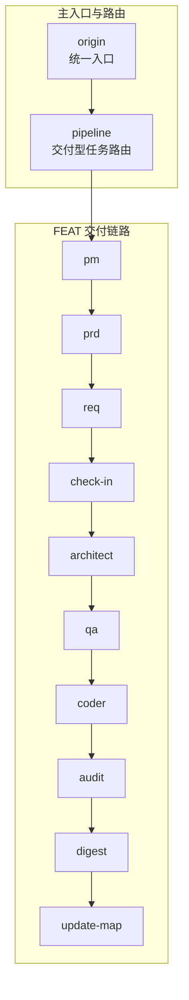
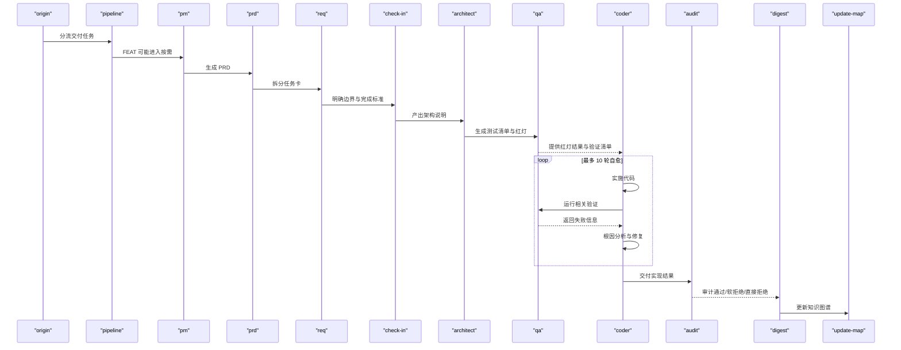
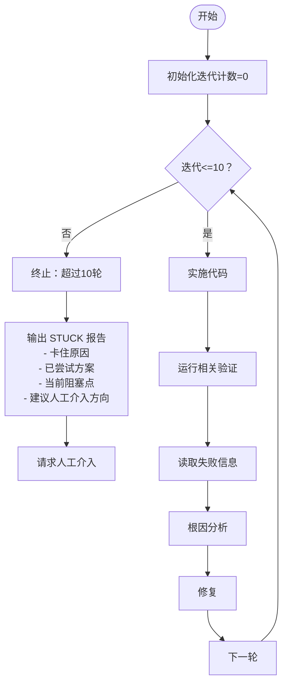
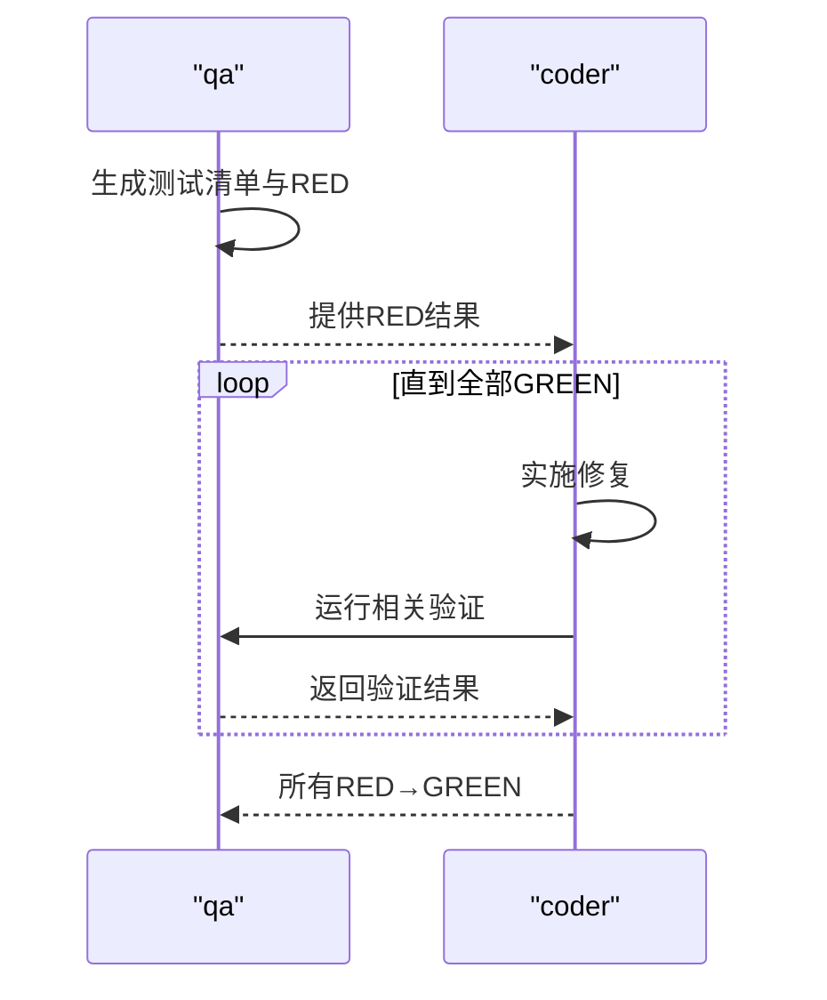
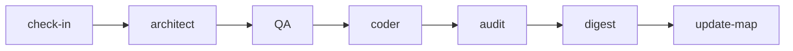
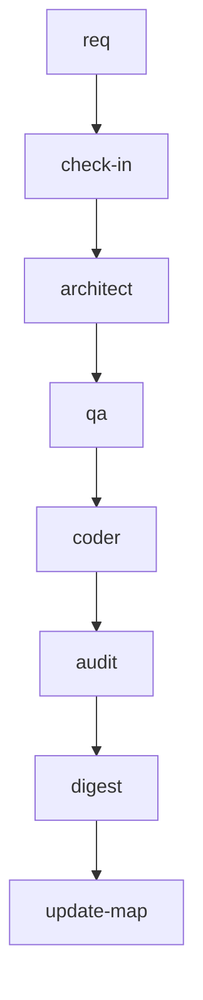

# 编码实现技能（Coder）

<cite>
**本文引用的文件**
- [coder/SKILL.md](file://skills/web3-ai-agent/coder/SKILL.md)
- [SKILL.md（主入口）](file://skills/web3-ai-agent/SKILL.md)
- [check-in/SKILL.md](file://skills/web3-ai-agent/check-in/SKILL.md)
- [architect/SKILL.md](file://skills/web3-ai-agent/architect/SKILL.md)
- [qa/SKILL.md](file://skills/web3-ai-agent/qa/SKILL.md)
- [pipeline/SKILL.md](file://skills/web3-ai-agent/pipeline/SKILL.md)
- [pm/SKILL.md](file://skills/web3-ai-agent/pm/SKILL.md)
- [prd/SKILL.md](file://skills/web3-ai-agent/prd/SKILL.md)
- [req/SKILL.md](file://skills/web3-ai-agent/req/SKILL.md)
- [audit/SKILL.md](file://skills/web3-ai-agent/audit/SKILL.md)
</cite>

## 目录
1. [简介](#简介)
2. [项目结构](#项目结构)
3. [核心组件](#核心组件)
4. [架构总览](#架构总览)
5. [详细组件分析](#详细组件分析)
6. [依赖分析](#依赖分析)
7. [性能考虑](#性能考虑)
8. [故障排查指南](#故障排查指南)
9. [结论](#结论)
10. [附录](#附录)

## 简介
Coder 技能的目标是在边界清晰的前提下实施代码，并通过最多 10 轮自愈循环把 QA 红灯全部变为绿灯。其职责是将“需求 + 架构 + QA 输出”转化为可验证通过的实现，不负责重新定义需求或扩大范围；若在 10 轮内无法达成绿灯，将输出 STUCK 报告并请求人工介入。

## 项目结构
本仓库采用“技能（Skill）+ 管道（Pipeline）”的分层组织方式，Coder 作为交付链路中的关键一环，位于 QA 之后、审计之前，贯穿 FEAT/PATCH/REFACTOR 三类交付任务。

图表来源
- [SKILL.md（主入口）:112-126](file://skills/web3-ai-agent/SKILL.md#L112-L126)
- [pipeline/SKILL.md:34-35](file://skills/web3-ai-agent/pipeline/SKILL.md#L34-L35)

章节来源
- [SKILL.md（主入口）:92-158](file://skills/web3-ai-agent/SKILL.md#L92-L158)
- [pipeline/SKILL.md:29-58](file://skills/web3-ai-agent/pipeline/SKILL.md#L29-L58)

## 核心组件
- 输入依赖
  - check-in：明确问题、边界、方案与完成标准，是进入 architect/qa/coder 的前提。
  - 架构说明：来自 architect 的模块边界、数据流、接口契约等。
  - QA 输出：来自 qa 的测试清单与红灯结果（FEAT 先红后绿）。
- 自愈循环机制
  - 最多 10 轮；超过 10 轮立即终止并输出 STUCK 报告，请求人工介入。
  - 每轮流程：实施代码 → 运行相关验证 → 读取失败信息 → 根因分析 → 修复 → 下一轮。
- 质量与边界
  - 不修改 docs/ 需求定义；不擅自修改验收标准；不跳过失败验证。
  - 优先跑相关验证，避免全量重跑。
  - 若发现 QA 红灯本身与需求矛盾，应停止并报告，而非自行修改需求。

章节来源
- [coder/SKILL.md:12-17](file://skills/web3-ai-agent/coder/SKILL.md#L12-L17)
- [coder/SKILL.md:18-37](file://skills/web3-ai-agent/coder/SKILL.md#L18-L37)
- [coder/SKILL.md:39-48](file://skills/web3-ai-agent/coder/SKILL.md#L39-L48)
- [coder/SKILL.md:49-54](file://skills/web3-ai-agent/coder/SKILL.md#L49-L54)
- [coder/SKILL.md:61-66](file://skills/web3-ai-agent/coder/SKILL.md#L61-L66)
- [coder/SKILL.md:67-72](file://skills/web3-ai-agent/coder/SKILL.md#L67-L72)

## 架构总览
Coder 在整体交付链路中的位置如下：

图表来源
- [SKILL.md（主入口）:112-158](file://skills/web3-ai-agent/SKILL.md#L112-L158)
- [pipeline/SKILL.md:34-53](file://skills/web3-ai-agent/pipeline/SKILL.md#L34-L53)
- [coder/SKILL.md:18-37](file://skills/web3-ai-agent/coder/SKILL.md#L18-L37)

章节来源
- [SKILL.md（主入口）:112-158](file://skills/web3-ai-agent/SKILL.md#L112-L158)
- [pipeline/SKILL.md:29-58](file://skills/web3-ai-agent/pipeline/SKILL.md#L29-L58)

## 详细组件分析

### 自愈循环机制（最多 10 轮）
- 循环控制
  - 迭代计数器从 0 开始，每轮递增；超过 10 轮立即终止。
  - 终止条件：迭代次数超过 10。
- 每轮步骤
  - 实施代码：依据 check-in/架构说明/QA 输出进行实现。
  - 运行相关验证：仅运行与本次修复相关的验证，避免全量重跑。
  - 读取失败信息：收集验证失败的具体信息。
  - 根因分析：定位失败的根本原因，确保修复针对性。
  - 修复：基于分析结果进行代码修复。
  - 进入下一轮：若仍有失败，继续循环，直至 10 轮耗尽。
- 终止后的输出
  - 卡住原因、已尝试方案、当前阻塞点、建议人工介入方向。

图表来源
- [coder/SKILL.md:18-37](file://skills/web3-ai-agent/coder/SKILL.md#L18-L37)
- [coder/SKILL.md:39-48](file://skills/web3-ai-agent/coder/SKILL.md#L39-L48)

章节来源
- [coder/SKILL.md:18-37](file://skills/web3-ai-agent/coder/SKILL.md#L18-L37)
- [coder/SKILL.md:39-48](file://skills/web3-ai-agent/coder/SKILL.md#L39-L48)

### QA 红绿灯衔接
- FEAT：QA 先执行 RED，随后由 Coder 将所有红灯变为绿灯。
- 若发现 QA 的红灯本身与需求矛盾，应停止并报告，不自行修改需求。
- PATCH/REFACTOR：QA 执行轻量验证或回归验证，Coder 负责修复与验证。

图表来源
- [coder/SKILL.md:49-54](file://skills/web3-ai-agent/coder/SKILL.md#L49-L54)
- [qa/SKILL.md:14-27](file://skills/web3-ai-agent/qa/SKILL.md#L14-L27)

章节来源
- [coder/SKILL.md:49-54](file://skills/web3-ai-agent/coder/SKILL.md#L49-L54)
- [qa/SKILL.md:51-56](file://skills/web3-ai-agent/qa/SKILL.md#L51-L56)

### 与其他技能的协作关系
- 与 check-in
  - 必须先完成 check-in，明确“不做什么”与完成标准，才能进入 architect/qa/coder。
- 与 architect
  - 由 architect 产出模块边界、数据流、接口契约等，Coder 基于此实施。
- 与 qa
  - FEAT：Coder 负责把 QA 的 RED 全部变为 GREEN。
  - PATCH/REFACTOR：Coder 负责修复并通过 QA 的轻量验证。
- 与 audit
  - 通过 coder 的实现进入 audit，audit 以 100 分制评估，>=80 通过，60-79 软拒绝回退 coder，<60 直接拒绝并终止。

图表来源
- [check-in/SKILL.md:51-56](file://skills/web3-ai-agent/check-in/SKILL.md#L51-L56)
- [architect/SKILL.md:45-48](file://skills/web3-ai-agent/architect/SKILL.md#L45-L48)
- [qa/SKILL.md:63-66](file://skills/web3-ai-agent/qa/SKILL.md#L63-L66)
- [coder/SKILL.md:12-17](file://skills/web3-ai-agent/coder/SKILL.md#L12-L17)
- [audit/SKILL.md:83-87](file://skills/web3-ai-agent/audit/SKILL.md#L83-L87)

章节来源
- [check-in/SKILL.md:51-56](file://skills/web3-ai-agent/check-in/SKILL.md#L51-L56)
- [architect/SKILL.md:45-48](file://skills/web3-ai-agent/architect/SKILL.md#L45-L48)
- [qa/SKILL.md:63-66](file://skills/web3-ai-agent/qa/SKILL.md#L63-L66)
- [coder/SKILL.md:12-17](file://skills/web3-ai-agent/coder/SKILL.md#L12-L17)
- [audit/SKILL.md:83-87](file://skills/web3-ai-agent/audit/SKILL.md#L83-L87)

### 实现流程与质量保证
- 实施流程
  - 依据 check-in 的完成标准与架构说明，编写满足验收条件的代码。
  - 仅运行与本次修复相关的验证，避免全量重跑。
  - 若验证失败，记录失败信息，进行根因分析，针对性修复。
- 质量保证
  - 不修改需求定义与验收标准。
  - 不跳过失败验证；若出现意外通过（如 RED 意外通过），需修正测试。
  - 若发现需求与 QA 红灯矛盾，停止并报告，不自行修改需求。

章节来源
- [coder/SKILL.md:12-17](file://skills/web3-ai-agent/coder/SKILL.md#L12-L17)
- [coder/SKILL.md:61-66](file://skills/web3-ai-agent/coder/SKILL.md#L61-L66)
- [coder/SKILL.md:67-72](file://skills/web3-ai-agent/coder/SKILL.md#L67-L72)
- [qa/SKILL.md:52-56](file://skills/web3-ai-agent/qa/SKILL.md#L52-L56)

### 边界约束与规则
- 不修改 docs/ 需求定义。
- 不擅自修改验收标准。
- 不跳过失败验证。
- 没有 check-in 不进入 architect/qa/coder。
- 若发现范围变大，应回退至 req/check-in/architect 重新对齐。
- 优先跑相关验证，不默认全量重跑。

章节来源
- [coder/SKILL.md:61-66](file://skills/web3-ai-agent/coder/SKILL.md#L61-L66)
- [coder/SKILL.md:67-72](file://skills/web3-ai-agent/coder/SKILL.md#L67-L72)
- [check-in/SKILL.md:51-56](file://skills/web3-ai-agent/check-in/SKILL.md#L51-L56)

## 依赖分析
- 输入依赖
  - 必需：check-in（完成标准）、架构说明（architect）、QA 输出（qa）。
  - 可能：pm/prd/req（FEAT 的前置阶段，用于明确任务边界）。
- 输出依赖
  - 向 audit 交付实现结果；通过 digest 收尾；更新 update-map。

图表来源
- [pipeline/SKILL.md:34-53](file://skills/web3-ai-agent/pipeline/SKILL.md#L34-L53)
- [coder/SKILL.md:12-17](file://skills/web3-ai-agent/coder/SKILL.md#L12-L17)

章节来源
- [pipeline/SKILL.md:29-58](file://skills/web3-ai-agent/pipeline/SKILL.md#L29-L58)
- [coder/SKILL.md:12-17](file://skills/web3-ai-agent/coder/SKILL.md#L12-L17)

## 性能考虑
- 验证范围控制：仅运行与当前修复相关的验证，减少不必要的全量回归。
- 修复粒度：每次修复聚焦于单个根因，避免一次修复引入多个不确定因素。
- 10 轮上限：防止无限循环，尽早暴露不可控问题并触发人工介入。

## 故障排查指南
- 常见问题
  - 验证失败但根因不明：检查失败信息与日志，进行逐项排除。
  - RED 意外通过：说明测试可能过弱，需增强测试覆盖。
  - 需求与 QA 红灯矛盾：停止并报告，不自行修改需求。
- STUCK 报告内容
  - 卡住原因、已尝试方案、当前阻塞点、建议人工介入方向。
- 人工介入触发条件
  - 超过 10 轮仍未通过。
  - 审计软拒绝（60-79）后仍无法修复。
  - 出现一票否决项（严重安全问题、明显越界修改、关键不变量被破坏等）。

章节来源
- [coder/SKILL.md:39-48](file://skills/web3-ai-agent/coder/SKILL.md#L39-L48)
- [audit/SKILL.md:64-77](file://skills/web3-ai-agent/audit/SKILL.md#L64-L77)

## 结论
Coder 技能在 Web3 AI Agent 技能体系中承担“将需求与架构转化为可验证实现”的关键角色。通过严格的输入依赖（check-in/架构说明/QA 输出）、10 轮自愈循环与明确的边界约束，确保实现质量与可追溯性。当自愈循环无法解决问题时，系统将输出 STUCK 报告并触发人工介入，形成闭环的质量保障机制。

## 附录
- 交付链路参考
  - FEAT：pm/prd/req/check-in/architect/qa/coder/audit/digest/update-map
  - PATCH：req/check-in/coder/qa/digest/update-map
  - REFACTOR：req/check-in/architect/qa/coder/audit/digest/update-map

章节来源
- [SKILL.md（主入口）:112-158](file://skills/web3-ai-agent/SKILL.md#L112-L158)
- [pipeline/SKILL.md:34-53](file://skills/web3-ai-agent/pipeline/SKILL.md#L34-L53)