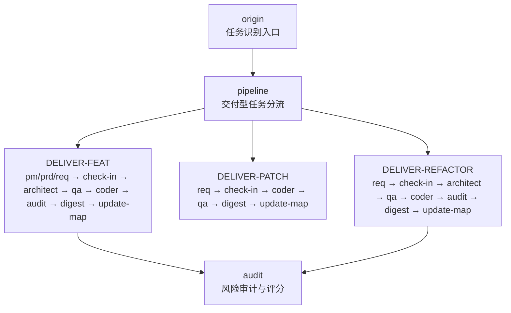
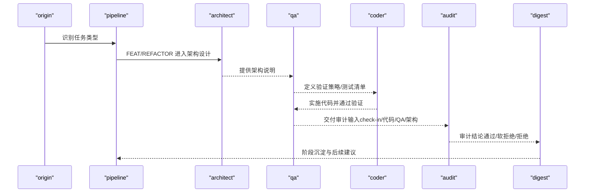
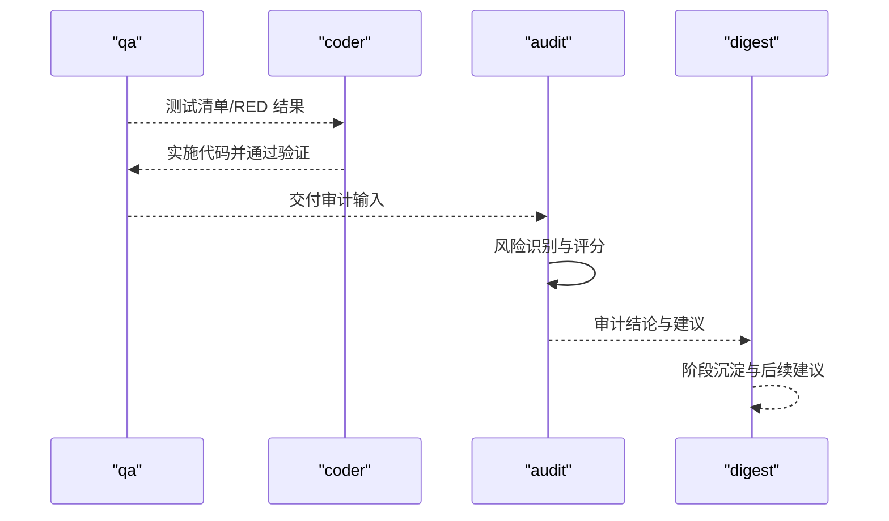
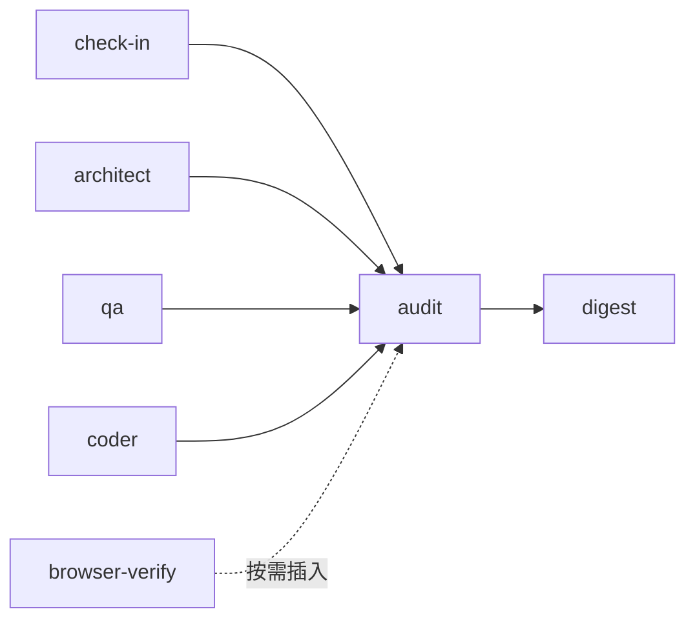
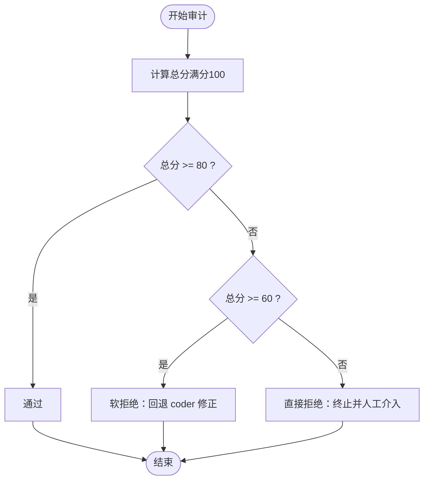

# 安全审计技能 (Audit)

<cite>
**本文引用的文件**
- [audit/SKILL.md](file://skills/web3-ai-agent/audit/SKILL.md)
- [architect/SKILL.md](file://skills/web3-ai-agent/architect/SKILL.md)
- [web3-ai-agent/SKILL.md](file://skills/web3-ai-agent/SKILL.md)
- [MAP-V3.md](file://skills/web3-ai-agent/MAP-V3.md)
- [qa/SKILL.md](file://skills/web3-ai-agent/qa/SKILL.md)
- [coder/SKILL.md](file://skills/web3-ai-agent/coder/SKILL.md)
- [digest/SKILL.md](file://skills/web3-ai-agent/digest/SKILL.md)
- [check-in/SKILL.md](file://skills/web3-ai-agent/check-in/SKILL.md)
- [browser-verify/SKILL.md](file://skills/web3-ai-agent/browser-verify/SKILL.md)
- [pm/SKILL.md](file://skills/web3-ai-agent/pm/SKILL.md)
- [prd/SKILL.md](file://skills/web3-ai-agent/prd/SKILL.md)
- [req/SKILL.md](file://skills/web3-ai-agent/req/SKILL.md)
</cite>

## 目录
1. [简介](#简介)
2. [项目结构](#项目结构)
3. [核心组件](#核心组件)
4. [架构总览](#架构总览)
5. [详细组件分析](#详细组件分析)
6. [依赖分析](#依赖分析)
7. [性能考虑](#性能考虑)
8. [故障排查指南](#故障排查指南)
9. [结论](#结论)
10. [附录](#附录)

## 简介
本文件为 Web3 AI Agent 项目中“安全审计技能（Audit）”的综合技术文档。围绕交付前最后一道风险关卡，系统化阐述风险识别与控制流程、评分与阈值规则、检查清单与修复跟踪机制，并结合 Web3 特有的安全约束与合规要求，给出可操作的审计标准与质量保证措施。文档同时梳理与其他技能的衔接关系，帮助读者快速理解审计在整个交付流程中的定位与作用。

## 项目结构
- 审计技能位于 Web3 AI Agent 技能体系的交付流程末端，作为“门禁”角色，决定是否放行。
- 审计与架构、需求、测试、编码、摘要等技能共同组成完整的交付闭环。
- 交付流程分为 FEAT、PATCH、REFACTOR 三类，审计在两类场景中强制出现：FEAT 的 architect → qa → coder → audit；REFACTOR 的 req → check-in → architect → qa → coder → audit。

图表来源
- [MAP-V3.md: 104-126:104-126](file://skills/web3-ai-agent/MAP-V3.md#L104-L126)
- [web3-ai-agent/SKILL.md: 112-152:112-152](file://skills/web3-ai-agent/SKILL.md#L112-L152)

章节来源
- [MAP-V3.md: 102-131:102-131](file://skills/web3-ai-agent/MAP-V3.md#L102-L131)
- [web3-ai-agent/SKILL.md: 41-72:41-72](file://skills/web3-ai-agent/SKILL.md#L41-L72)

## 核心组件
- 审计（Audit）
  - 定位：交付前最后一道风险关，不负责继续实现，只负责判断是否放行。
  - 模式：轻审（适用于低风险 PATCH/低风险 REFACTOR）与重审（适用于 FEAT、高风险 PATCH/REFACTOR、Web3 高风险任务）。
  - 输入：check-in、代码结果、QA 结果、架构说明。
  - 输出：审计结论（通过/软拒绝/拒绝）、总分、主要问题、风险建议。
  - 评分：满分 100 分，权重维度见下节。
  - 阈值：≥80 通过；60-79 软拒绝（回退 coder 修正）；<60 直接拒绝（终止并人工介入）。
  - 一票否决：严重安全问题、明显越界、关键不变量被破坏、高风险场景缺少风险提示或失败降级。
  - 边界：不直接改代码、不重新定义需求。
  - 衔接：通过→digest；软拒绝→coder；直接拒绝→终止并人工介入。

章节来源
- [audit/SKILL.md: 8-88:8-88](file://skills/web3-ai-agent/audit/SKILL.md#L8-L88)

## 架构总览
审计在整个交付流程中的位置如下：

图表来源
- [MAP-V3.md: 104-126:104-126](file://skills/web3-ai-agent/MAP-V3.md#L104-L126)
- [web3-ai-agent/SKILL.md: 112-152:112-152](file://skills/web3-ai-agent/SKILL.md#L112-L152)

章节来源
- [MAP-V3.md: 102-131:102-131](file://skills/web3-ai-agent/MAP-V3.md#L102-L131)
- [web3-ai-agent/SKILL.md: 112-152:112-152](file://skills/web3-ai-agent/SKILL.md#L112-L152)

## 详细组件分析

### 审计评分与阈值规则
- 评分维度与权重（满分 100）
  - 需求一致性：25
  - 结构/契约一致性：15
  - 安全与风险边界：20
  - 代码质量：15
  - 回归风险控制：10
  - 文档与状态收尾：10
  - 场景特定治理项：5
- 阈值规则
  - ≥80：通过
  - 60-79：软拒绝（回退 coder 修正）
  - <60：直接拒绝（终止并人工介入）

章节来源
- [audit/SKILL.md: 52-68:52-68](file://skills/web3-ai-agent/audit/SKILL.md#L52-L68)

### 风险识别与控制流程
- 轻审（低风险场景）
  - 检查要点：是否与需求一致、是否引入明显安全问题、是否有越界修改、是否存在调试残留。
- 重审（高风险场景）
  - 适用范围：FEAT、高风险 PATCH/REFACTOR、涉及 Web3 数据可信度、权限、资金、安全的任务。
  - 控制重点：安全与风险边界、回归风险控制、场景特定治理项。
- 一票否决项
  - 严重安全问题、明显越过 check-in 的非目标、关键不变量被破坏、高风险场景缺少风险提示或失败降级。

章节来源
- [audit/SKILL.md: 14-32:14-32](file://skills/web3-ai-agent/audit/SKILL.md#L14-L32)
- [audit/SKILL.md: 70-77:70-77](file://skills/web3-ai-agent/audit/SKILL.md#L70-L77)

### 审计检查清单与标准
- 需求一致性
  - 检查实现是否满足 check-in 中的完成标准与边界。
- 结构/契约一致性
  - 检查是否遵循架构说明中的模块边界、数据流、消息流与接口契约。
- 安全与风险边界
  - 检查是否存在越权访问、输入校验缺失、敏感路径未降级、高风险操作缺少失败兜底。
- 代码质量
  - 检查可维护性、复杂度、重复逻辑、注释与命名规范。
- 回归风险控制
  - 检查回归检查点覆盖情况、历史问题是否重现。
- 文档与状态收尾
  - 检查任务完成说明、遗留问题记录、经验沉淀。
- 场景特定治理项（Web3）
  - 检查链上交互的签名与权限校验、资金路径与失败降级、数据来源可信度与缓存策略、Gas 估算与超时处理。

章节来源
- [audit/SKILL.md: 56-62:56-62](file://skills/web3-ai-agent/audit/SKILL.md#L56-L62)
- [check-in/SKILL.md: 25-35:25-35](file://skills/web3-ai-agent/check-in/SKILL.md#L25-L35)
- [architect/SKILL.md: 22-32:22-32](file://skills/web3-ai-agent/architect/SKILL.md#L22-L32)

### 与上下游技能的衔接
- 与 check-in：依据 check-in 的完成标准与边界进行一致性核验。
- 与 architect：对照架构说明中的模块边界、数据流、接口契约进行一致性检查。
- 与 qa：基于 QA 的测试清单与验证结果评估回归风险与问题暴露程度。
- 与 coder：在 coder 的自愈循环结束后，对最终实现进行风险与合规性复核。
- 与 digest：通过 digest 进行阶段沉淀，形成可复用的质量经验。

章节来源
- [audit/SKILL.md: 34-50:34-50](file://skills/web3-ai-agent/audit/SKILL.md#L34-L50)
- [digest/SKILL.md: 12-28:12-28](file://skills/web3-ai-agent/digest/SKILL.md#L12-L28)

### 审计流程序列图

图表来源
- [qa/SKILL.md: 39-50:39-50](file://skills/web3-ai-agent/qa/SKILL.md#L39-L50)
- [coder/SKILL.md: 12-17:12-17](file://skills/web3-ai-agent/coder/SKILL.md#L12-L17)
- [audit/SKILL.md: 34-50:34-50](file://skills/web3-ai-agent/audit/SKILL.md#L34-L50)
- [digest/SKILL.md: 12-28:12-28](file://skills/web3-ai-agent/digest/SKILL.md#L12-L28)

## 依赖分析
- 审计依赖于多个前置技能的产物：
  - check-in：提供完成标准与边界。
  - architect：提供架构说明与契约。
  - qa：提供测试清单与验证结果。
  - coder：提供最终实现与验证反馈。
- 审计与 digest 的衔接确保质量沉淀与经验复用。
- 与 browser-verify 的关系：在前端交互或页面回归场景中，可按需插入 browser-verify，以补充可视化层面的验收证据。

图表来源
- [check-in/SKILL.md: 12-24:12-24](file://skills/web3-ai-agent/check-in/SKILL.md#L12-L24)
- [architect/SKILL.md: 8-14:8-14](file://skills/web3-ai-agent/architect/SKILL.md#L8-L14)
- [qa/SKILL.md: 8-12:8-12](file://skills/web3-ai-agent/qa/SKILL.md#L8-L12)
- [coder/SKILL.md: 8-12:8-12](file://skills/web3-ai-agent/coder/SKILL.md#L8-L12)
- [audit/SKILL.md: 34-50:34-50](file://skills/web3-ai-agent/audit/SKILL.md#L34-L50)
- [digest/SKILL.md: 12-28:12-28](file://skills/web3-ai-agent/digest/SKILL.md#L12-L28)
- [browser-verify/SKILL.md: 8-14:8-14](file://skills/web3-ai-agent/browser-verify/SKILL.md#L8-L14)

章节来源
- [MAP-V3.md: 116-131:116-131](file://skills/web3-ai-agent/MAP-V3.md#L116-L131)

## 性能考虑
- 审计评分与阈值规则确保在有限时间内完成高质量门禁，避免过度评审导致的流程停滞。
- 轻审与重审的区分有助于在不同风险级别下合理分配资源，提升整体交付效率。
- 与 QA 的 RED/GREEN 验证配合，可在早期暴露问题，减少后期返工成本。

## 故障排查指南
- 常见问题与处理
  - 需求一致性不足：回退至 check-in，明确完成标准与边界。
  - 安全与风险边界缺失：回退至 architect，补充风险点与失败降级策略。
  - 回归风险控制不足：回退至 qa，完善测试清单与回归检查点。
  - 代码质量问题：回退至 coder，进行重构与优化。
- 一票否决触发后的处置
  - 立即终止当前方案，组织人工介入，必要时重定方案或调整任务范围。
- 修复跟踪机制
  - 软拒绝场景：coder 在 10 轮自愈内无法解决问题时，输出 STUCK 报告并请求人工介入。
  - 直接拒绝场景：终止并人工介入，形成问题升级与复盘记录。

章节来源
- [audit/SKILL.md: 64-77:64-77](file://skills/web3-ai-agent/audit/SKILL.md#L64-L77)
- [coder/SKILL.md: 18-48:18-48](file://skills/web3-ai-agent/coder/SKILL.md#L18-L48)

## 结论
审计技能在 Web3 AI Agent 的交付流程中扮演“最后一道风险关”的关键角色。通过明确的轻审/重审模式、严格的评分与阈值规则、以及与 check-in、architect、qa、coder、digest 的紧密衔接，审计确保了实现结果在安全、合规与质量方面的可控性。结合 Web3 特有的安全约束与治理项，审计能够有效识别高风险问题并推动问题修复与经验沉淀，从而提升整体交付质量与可维护性。

## 附录

### Web3 特有安全约束与合规要求
- 链上交互与权限
  - 签名与权限校验：确保链上操作具备合法签名与权限。
  - 资金路径与失败降级：对资金相关路径提供失败兜底与回滚策略。
- 数据可信度与缓存
  - 数据来源可信度：对链上数据与第三方数据进行来源校验与版本管理。
  - 缓存策略：对易变数据设置合理的缓存失效与校验机制。
- Gas 与性能
  - Gas 估算与超时处理：对链上调用进行合理的 Gas 估算与超时控制。
  - 批处理与队列：对高频操作进行批处理与队列化，降低 Gas 成本。
- 合规与治理
  - 场景特定治理项：根据任务类型与风险等级，设置相应的治理与审批流程。

章节来源
- [audit/SKILL.md: 56-62:56-62](file://skills/web3-ai-agent/audit/SKILL.md#L56-L62)

### 审计流程中的检查清单（示例）
- 需求一致性
  - 是否满足 check-in 完成标准
  - 是否存在越界修改
- 结构/契约一致性
  - 是否遵循架构说明中的模块边界与接口契约
- 安全与风险边界
  - 是否存在越权访问与输入校验缺失
  - 是否对高风险操作提供失败降级
- 代码质量
  - 复杂度与可维护性
  - 注释与命名规范
- 回归风险控制
  - 回归检查点覆盖情况
  - 历史问题是否重现
- 文档与状态收尾
  - 任务完成说明与遗留问题记录
- 场景特定治理项（Web3）
  - 链上交互的签名与权限校验
  - 资金路径与失败降级
  - 数据来源可信度与缓存策略
  - Gas 估算与超时处理

章节来源
- [audit/SKILL.md: 20-24:20-24](file://skills/web3-ai-agent/audit/SKILL.md#L20-L24)
- [audit/SKILL.md: 56-62:56-62](file://skills/web3-ai-agent/audit/SKILL.md#L56-L62)
- [check-in/SKILL.md: 25-35:25-35](file://skills/web3-ai-agent/check-in/SKILL.md#L25-L35)
- [architect/SKILL.md: 22-32:22-32](file://skills/web3-ai-agent/architect/SKILL.md#L22-L32)

### 审计评分与阈值规则（流程图）

图表来源
- [audit/SKILL.md: 52-68:52-68](file://skills/web3-ai-agent/audit/SKILL.md#L52-L68)