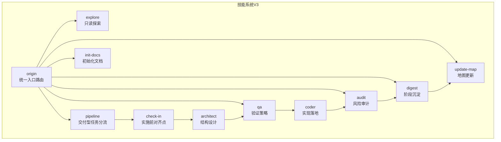
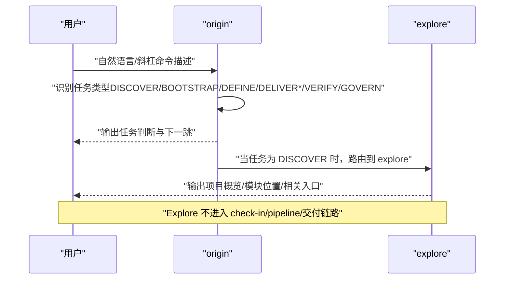
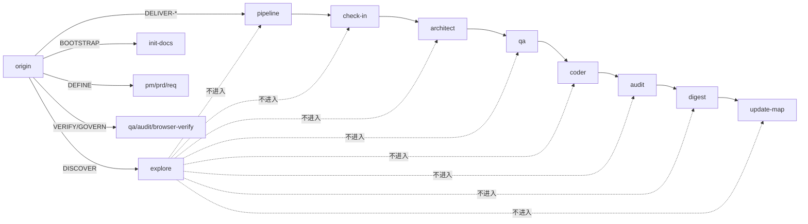

# 探索发现技能 (Explore)

<cite>
**本文引用的文件**
- [explore/SKILL.md](file://skills/web3-ai-agent/explore/SKILL.md)
- [SKILL.md（主入口）](file://skills/web3-ai-agent/SKILL.md)
- [MAP-V3.md](file://skills/web3-ai-agent/MAP-V3.md)
- [origin/SKILL.md](file://skills/web3-ai-agent/origin/SKILL.md)
- [pipeline/SKILL.md](file://skills/web3-ai-agent/pipeline/SKILL.md)
- [check-in/SKILL.md](file://skills/web3-ai-agent/check-in/SKILL.md)
- [init-docs/SKILL.md](file://skills/web3-ai-agent/init-docs/SKILL.md)
- [COMMANDS.md](file://skills/web3-ai-agent/COMMANDS.md)
- [SKILL-SYSTEM-DESIGN-V3.md](file://skills/web3-ai-agent/SKILL-SYSTEM-DESIGN-V3.md)
- [digest/SKILL.md](file://skills/web3-ai-agent/digest/SKILL.md)
- [update-map/SKILL.md](file://skills/web3-ai-agent/update-map/SKILL.md)
- [architect/SKILL.md](file://skills/web3-ai-agent/architect/SKILL.md)
- [qa/SKILL.md](file://skills/web3-ai-agent/qa/SKILL.md)
</cite>

## 目录
1. [简介](#简介)
2. [项目结构](#项目结构)
3. [核心组件](#核心组件)
4. [架构总览](#架构总览)
5. [详细组件分析](#详细组件分析)
6. [依赖关系分析](#依赖关系分析)
7. [性能考虑](#性能考虑)
8. [故障排查指南](#故障排查指南)
9. [结论](#结论)
10. [附录](#附录)

## 简介
Explore 是一个只读探索技能，用于帮助用户快速理解项目现状、定位模块位置、查询当前能力地图。其核心目标是“先回答‘是什么/在哪’，再回答‘怎么改’”，并严格遵循只读、不进入交付链、不直接生成需求或代码的边界。

适用场景包括：
- 新人熟悉项目
- 查询某模块在哪里
- 理解当前结构
- 查看当前能力地图

## 项目结构
Explore 技能位于技能系统目录中，与主入口、路由、交付链路、治理链路等共同组成完整的技能体系。Explore 作为辅助层技能，独立于主交付链路，专司“只读探索”。

图表来源
- [MAP-V3.md:1-166](file://skills/web3-ai-agent/MAP-V3.md#L1-L166)
- [SKILL-SYSTEM-DESIGN-V3.md:164-220](file://skills/web3-ai-agent/SKILL-SYSTEM-DESIGN-V3.md#L164-L220)

章节来源
- [MAP-V3.md:1-166](file://skills/web3-ai-agent/MAP-V3.md#L1-L166)
- [SKILL-SYSTEM-DESIGN-V3.md:164-220](file://skills/web3-ai-agent/SKILL-SYSTEM-DESIGN-V3.md#L164-L220)

## 核心组件
- Explore 技能：只读导航，回答“项目是什么/模块在哪/能力如何组织”，不进入交付链。
- 主入口 origin：识别任务类型，决定是否进入 Explore 或其他链路。
- pipeline：仅对交付型任务进行分流，非交付任务不进入。
- check-in：仅对实施型任务强制，非交付/探索任务不强制。
- 其他技能：architect、qa、coder、audit、digest、update-map 为交付与治理链路中的节点。

章节来源
- [explore/SKILL.md:1-42](file://skills/web3-ai-agent/explore/SKILL.md#L1-L42)
- [origin/SKILL.md:1-125](file://skills/web3-ai-agent/origin/SKILL.md#L1-L125)
- [pipeline/SKILL.md:1-89](file://skills/web3-ai-agent/pipeline/SKILL.md#L1-L89)
- [check-in/SKILL.md:1-56](file://skills/web3-ai-agent/check-in/SKILL.md#L1-L56)

## 架构总览
Explore 的使用路径始终从主入口 origin 开始，由 origin 判断任务类型并路由到 Explore 或其他链路。Explore 专注于只读探索，不进入 check-in、pipeline 或交付链路。

图表来源
- [origin/SKILL.md:41-49](file://skills/web3-ai-agent/origin/SKILL.md#L41-L49)
- [SKILL.md（主入口）:92-158](file://skills/web3-ai-agent/SKILL.md#L92-L158)
- [explore/SKILL.md:26-30](file://skills/web3-ai-agent/explore/SKILL.md#L26-L30)

章节来源
- [origin/SKILL.md:41-49](file://skills/web3-ai-agent/origin/SKILL.md#L41-L49)
- [SKILL.md（主入口）:92-158](file://skills/web3-ai-agent/SKILL.md#L92-L158)
- [explore/SKILL.md:26-30](file://skills/web3-ai-agent/explore/SKILL.md#L26-L30)

## 详细组件分析

### Explore 技能定义与边界
- 作用：只读导航，帮助理解项目、定位模块、查询现状。
- 输入：用户问题、当前代码库或文档。
- 输出：项目概览、模块位置、相关文件/文档入口。
- 边界：只读；不进入 check-in；不直接生成需求或代码。
- 规则：先回答“是什么/在哪”，再回答“怎么改”；若用户提出变更诉求，引导回 origin -> DEFINE 或 pipeline。

章节来源
- [explore/SKILL.md:1-42](file://skills/web3-ai-agent/explore/SKILL.md#L1-L42)

### 任务类型与路由关系
- DISCOVER：路由到 explore，不进入 check-in/pipeline。
- BOOTSTRAP：路由到 init-docs -> update-map。
- DEFINE：路由到 pm/prd/req -> check-in。
- DELIVER-FEAT/PATCH/REFACTOR：路由到 pipeline，再进入交付链。
- VERIFY/GOVERN：路由到 qa/audit/browser-verify/resolve-doc-conflicts/digest/update-map。

章节来源
- [origin/SKILL.md:41-49](file://skills/web3-ai-agent/origin/SKILL.md#L41-L49)
- [SKILL.md（主入口）:92-158](file://skills/web3-ai-agent/SKILL.md#L92-L158)
- [MAP-V3.md:132-156](file://skills/web3-ai-agent/MAP-V3.md#L132-L156)

### Explore 的执行流程
- 判断用户要看全局、模块还是具体组件。
- 最小化读取上下文，聚焦关键信息。
- 输出结构化答案与下一步入口。

章节来源
- [explore/SKILL.md:26-30](file://skills/web3-ai-agent/explore/SKILL.md#L26-L30)

### 与其他技能的衔接
- Explore 与主入口 origin 的衔接：origin 识别任务类型后，将 DISCOVER 任务路由到 explore。
- Explore 与交付链的衔接：Explore 不进入 check-in/pipeline/交付链，仅提供只读导航。
- Explore 与治理链的衔接：Explore 与 digest/update-map 无直接衔接，二者分别负责沉淀与地图更新。

章节来源
- [origin/SKILL.md:41-49](file://skills/web3-ai-agent/origin/SKILL.md#L41-L49)
- [explore/SKILL.md:26-30](file://skills/web3-ai-agent/explore/SKILL.md#L26-L30)
- [digest/SKILL.md:42-44](file://skills/web3-ai-agent/digest/SKILL.md#L42-L44)
- [update-map/SKILL.md:39-41](file://skills/web3-ai-agent/update-map/SKILL.md#L39-L41)

### 使用示例与最佳实践
- 示例：使用斜杠命令触发 Explore，例如“/explore 帮我看看当前 Web3 AI Agent 项目有哪些模块和能力”。
- 最佳实践：
  - 明确表达“只读探索”意图，避免引导到变更诉求。
  - 先回答“是什么/在哪”，再回答“怎么改”。
  - 若用户提出变更诉求，引导回 origin -> DEFINE 或 pipeline。

章节来源
- [COMMANDS.md:75-80](file://skills/web3-ai-agent/COMMANDS.md#L75-L80)
- [explore/SKILL.md:38-41](file://skills/web3-ai-agent/explore/SKILL.md#L38-L41)

## 依赖关系分析
Explore 的依赖关系主要体现在路由与边界控制上：

图表来源
- [origin/SKILL.md:41-49](file://skills/web3-ai-agent/origin/SKILL.md#L41-L49)
- [SKILL.md（主入口）:92-158](file://skills/web3-ai-agent/SKILL.md#L92-L158)
- [MAP-V3.md:132-156](file://skills/web3-ai-agent/MAP-V3.md#L132-L156)

章节来源
- [origin/SKILL.md:41-49](file://skills/web3-ai-agent/origin/SKILL.md#L41-L49)
- [SKILL.md（主入口）:92-158](file://skills/web3-ai-agent/SKILL.md#L92-L158)
- [MAP-V3.md:132-156](file://skills/web3-ai-agent/MAP-V3.md#L132-L156)

## 性能考虑
- Explore 作为只读技能，应尽量最小化上下文读取，聚焦关键信息输出，避免不必要的扫描与解析。
- 在多人协作场景下，建议结合主入口 origin 的任务识别，确保用户意图被准确理解，减少无效往返。

## 故障排查指南
- 问题：用户发起变更诉求，但期望得到 Explore 的“怎么做”建议。
  - 处理：根据 Explore 规则，先回答“是什么/在哪”，再引导回 origin -> DEFINE 或 pipeline。
- 问题：用户未使用斜杠命令，系统未能正确识别为 Explore。
  - 处理：建议使用“/explore + 任务描述”的命令约定，降低路由歧义。
- 问题：用户在 Explore 中看到过多交付链路信息。
  - 处理：确认 origin 的任务识别是否正确，确保 DISCOVER 任务被路由到 Explore。

章节来源
- [explore/SKILL.md:38-41](file://skills/web3-ai-agent/explore/SKILL.md#L38-L41)
- [origin/SKILL.md:120-125](file://skills/web3-ai-agent/origin/SKILL.md#L120-L125)
- [COMMANDS.md:14-19](file://skills/web3-ai-agent/COMMANDS.md#L14-L19)

## 结论
Explore 技能在 Web3 AI Agent 技能系统中承担“只读探索”的职责，通过与主入口 origin 的配合，确保用户在了解项目现状、定位模块与能力时获得清晰、结构化的输出。其边界与规则明确，既保证了探索的效率，又避免了与交付链的混淆。

## 附录
- 斜杠命令参考：/origin、/pipeline feat/patch/refactor、/pm、/prd、/req、/check-in、/architect、/qa、/coder、/audit、/digest、/update-map、/explore、/init-docs、/browser-verify、/resolve-doc-conflicts。
- 推荐使用方式：优先使用“/origin + 任务描述”或“/explore + 任务描述”，以降低路由歧义。

章节来源
- [COMMANDS.md:29-50](file://skills/web3-ai-agent/COMMANDS.md#L29-L50)
- [SKILL.md（主入口）:168-176](file://skills/web3-ai-agent/SKILL.md#L168-L176)