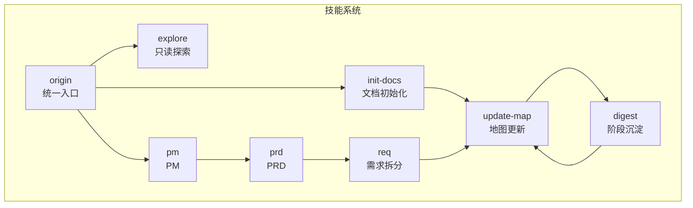
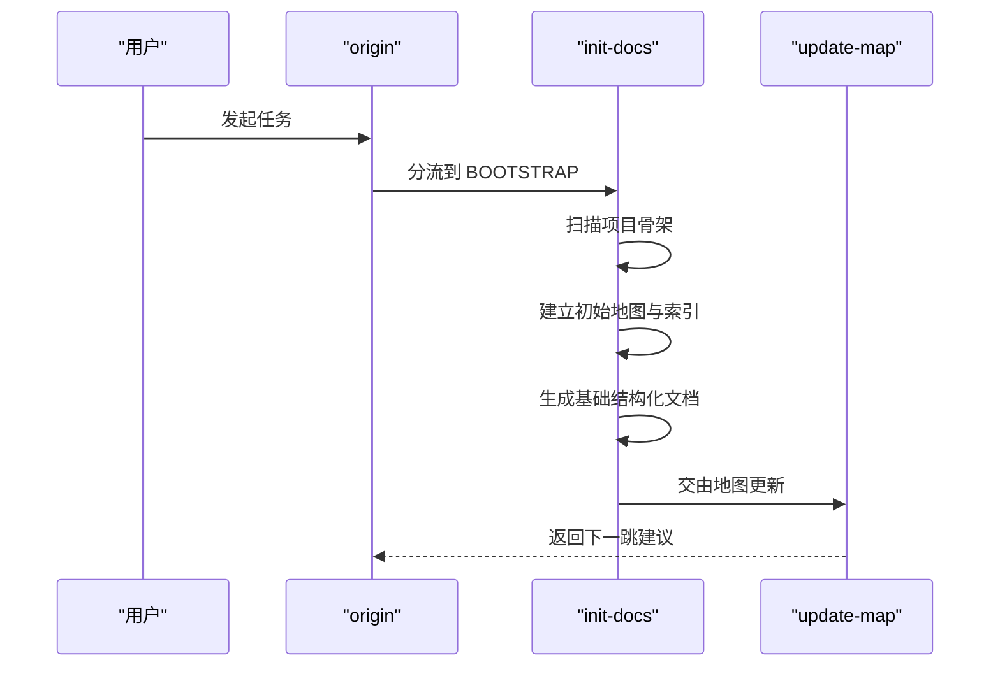
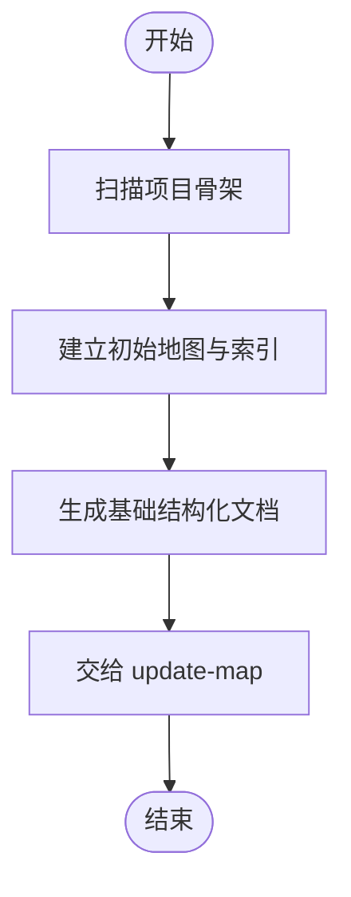
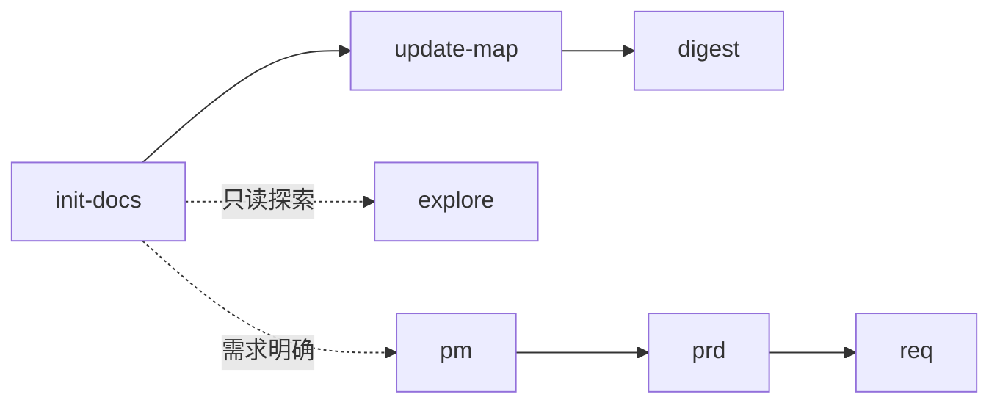
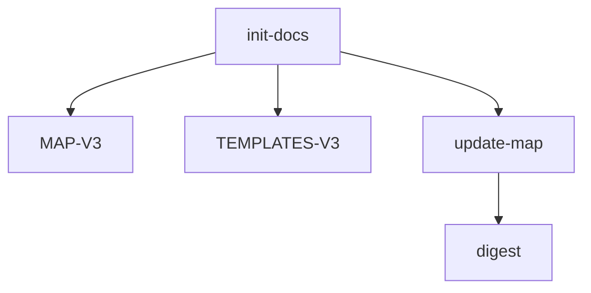

# 文档初始化技能 (Init-Docs)

<cite>
**本文引用的文件**
- [skills/web3-ai-agent/init-docs/SKILL.md](file://skills/web3-ai-agent/init-docs/SKILL.md)
- [skills/web3-ai-agent/SKILL.md](file://skills/web3-ai-agent/SKILL.md)
- [skills/web3-ai-agent/MAP-V3.md](file://skills/web3-ai-agent/MAP-V3.md)
- [skills/web3-ai-agent/TEMPLATES-V3.md](file://skills/web3-ai-agent/TEMPLATES-V3.md)
- [skills/web3-ai-agent/update-map/SKILL.md](file://skills/web3-ai-agent/update-map/SKILL.md)
- [skills/web3-ai-agent/digest/SKILL.md](file://skills/web3-ai-agent/digest/SKILL.md)
- [skills/web3-ai-agent/explore/SKILL.md](file://skills/web3-ai-agent/explore/SKILL.md)
- [skills/web3-ai-agent/pm/SKILL.md](file://skills/web3-ai-agent/pm/SKILL.md)
- [skills/web3-ai-agent/prd/SKILL.md](file://skills/web3-ai-agent/prd/SKILL.md)
- [skills/web3-ai-agent/req/SKILL.md](file://skills/web3-ai-agent/req/SKILL.md)
</cite>

## 目录
1. [简介](#简介)
2. [项目结构](#项目结构)
3. [核心组件](#核心组件)
4. [架构总览](#架构总览)
5. [详细组件分析](#详细组件分析)
6. [依赖分析](#依赖分析)
7. [性能考虑](#性能考虑)
8. [故障排查指南](#故障排查指南)
9. [结论](#结论)
10. [附录](#附录)

## 简介
文档初始化技能（Init-Docs）是 Web3 AI Agent 技能系统中的启动阶段专用技能，用于在项目生命周期早期快速建立文档体系的基础框架。它负责扫描项目骨架、构建初始地图与索引、生成基础结构化文档，并将控制权移交至地图更新技能，从而确保项目在启动阶段就具备可演化的文档基础设施。

该技能适用于以下场景：
- 新项目首次建立文档体系
- 历史文档迁移与结构重建
- 重建基础索引与初始文档结构

## 项目结构
Init-Docs 位于技能系统的核心目录中，作为启动阶段（BOOTSTRAP）的关键入口之一，与地图（MAP）、模板（TEMPLATES）、以及后续的更新与沉淀技能紧密协作。

图表来源
- [skills/web3-ai-agent/SKILL.md:100-104](file://skills/web3-ai-agent/SKILL.md#L100-L104)
- [skills/web3-ai-agent/MAP-V3.md:140-144](file://skills/web3-ai-agent/MAP-V3.md#L140-L144)
- [skills/web3-ai-agent/update-map/SKILL.md:41-42](file://skills/web3-ai-agent/update-map/SKILL.md#L41-L42)
- [skills/web3-ai-agent/digest/SKILL.md:44-45](file://skills/web3-ai-agent/digest/SKILL.md#L44-L45)

章节来源
- [skills/web3-ai-agent/SKILL.md:100-104](file://skills/web3-ai-agent/SKILL.md#L100-L104)
- [skills/web3-ai-agent/MAP-V3.md:140-144](file://skills/web3-ai-agent/MAP-V3.md#L140-L144)

## 核心组件
- Init-Docs 技能：负责扫描项目骨架、建立初始地图与索引、生成基础结构化文档，并将控制权移交 update-map。
- Update-Map 技能：维护项目状态，更新地图与索引，给出下一步建议，并返回 origin。
- Digest 技能：在任务完成后进行阶段沉淀，记录完成项、问题、经验与建议。
- Explore 技能：只读探索，帮助理解项目结构与模块位置。
- PM/PRD/Req 技能：在需求明确阶段提供价值主张、正式范围与最小可执行任务卡。

章节来源
- [skills/web3-ai-agent/init-docs/SKILL.md:1-41](file://skills/web3-ai-agent/init-docs/SKILL.md#L1-L41)
- [skills/web3-ai-agent/update-map/SKILL.md:1-47](file://skills/web3-ai-agent/update-map/SKILL.md#L1-L47)
- [skills/web3-ai-agent/digest/SKILL.md:1-50](file://skills/web3-ai-agent/digest/SKILL.md#L1-L50)
- [skills/web3-ai-agent/explore/SKILL.md:1-42](file://skills/web3-ai-agent/explore/SKILL.md#L1-L42)
- [skills/web3-ai-agent/pm/SKILL.md:1-53](file://skills/web3-ai-agent/pm/SKILL.md#L1-L53)
- [skills/web3-ai-agent/prd/SKILL.md:1-54](file://skills/web3-ai-agent/prd/SKILL.md#L1-L54)
- [skills/web3-ai-agent/req/SKILL.md:1-57](file://skills/web3-ai-agent/req/SKILL.md#L1-L57)

## 架构总览
Init-Docs 在启动阶段（BOOTSTRAP）与地图更新（update-map）形成闭环，确保文档初始化完成后能够无缝进入常规 V3 执行链路。其在整个技能系统的路由中处于关键位置，既独立完成启动文档基建，又与后续的沉淀与更新技能保持衔接。

图表来源
- [skills/web3-ai-agent/SKILL.md:100-104](file://skills/web3-ai-agent/SKILL.md#L100-L104)
- [skills/web3-ai-agent/MAP-V3.md:140-144](file://skills/web3-ai-agent/MAP-V3.md#L140-L144)
- [skills/web3-ai-agent/init-docs/SKILL.md:25-31](file://skills/web3-ai-agent/init-docs/SKILL.md#L25-L31)
- [skills/web3-ai-agent/update-map/SKILL.md:28-33](file://skills/web3-ai-agent/update-map/SKILL.md#L28-L33)

章节来源
- [skills/web3-ai-agent/SKILL.md:100-104](file://skills/web3-ai-agent/SKILL.md#L100-L104)
- [skills/web3-ai-agent/MAP-V3.md:140-144](file://skills/web3-ai-agent/MAP-V3.md#L140-L144)
- [skills/web3-ai-agent/init-docs/SKILL.md:25-31](file://skills/web3-ai-agent/init-docs/SKILL.md#L25-L31)
- [skills/web3-ai-agent/update-map/SKILL.md:28-33](file://skills/web3-ai-agent/update-map/SKILL.md#L28-L33)

## 详细组件分析

### Init-Docs 技能
- 适用场景
  - 新项目首次建立文档
  - 历史文档迁移
  - 重建基础索引
- 输入
  - 代码库现状
  - 现有文档
- 输出
  - 初始地图
  - 初始索引
  - 基础结构化文档
- 执行流程
  - 扫描项目骨架
  - 建立第一版地图和索引
  - 生成初始文档结构
  - 交给 update-map
- 边界
  - 不承担具体功能开发
  - 不代替后续 digest
- 规则
  - 这是 BOOTSTRAP 专用技能
  - 初始化完成后应交由正常 V3 链路继续演化

图表来源
- [skills/web3-ai-agent/init-docs/SKILL.md:25-31](file://skills/web3-ai-agent/init-docs/SKILL.md#L25-L31)

章节来源
- [skills/web3-ai-agent/init-docs/SKILL.md:8-41](file://skills/web3-ai-agent/init-docs/SKILL.md#L8-L41)

### 与其他技能的协作关系
- 与 Update-Map 的衔接
  - Init-Docs 完成初始化后，将控制权移交 update-map，由其维护项目状态并给出下一步建议。
- 与 Digest 的衔接
  - 在后续交付链路中，digest 负责阶段沉淀，而 update-map 负责状态更新，两者职责分离。
- 与 Explore 的区别
  - Explore 为只读探索，不进入交付链；Init-Docs 则负责启动阶段的文档基建。
- 与 PM/PRD/Req 的关系
  - PM/PRD/Req 属于需求明确阶段的技能，通常在 INIT 完成后进入正常 V3 链路。

图表来源
- [skills/web3-ai-agent/init-docs/SKILL.md:30-31](file://skills/web3-ai-agent/init-docs/SKILL.md#L30-L31)
- [skills/web3-ai-agent/update-map/SKILL.md:41-42](file://skills/web3-ai-agent/update-map/SKILL.md#L41-L42)
- [skills/web3-ai-agent/digest/SKILL.md:44-45](file://skills/web3-ai-agent/digest/SKILL.md#L44-L45)
- [skills/web3-ai-agent/explore/SKILL.md:32-36](file://skills/web3-ai-agent/explore/SKILL.md#L32-L36)
- [skills/web3-ai-agent/pm/SKILL.md:45-48](file://skills/web3-ai-agent/pm/SKILL.md#L45-L48)
- [skills/web3-ai-agent/prd/SKILL.md:46-49](file://skills/web3-ai-agent/prd/SKILL.md#L46-L49)
- [skills/web3-ai-agent/req/SKILL.md:48-51](file://skills/web3-ai-agent/req/SKILL.md#L48-L51)

章节来源
- [skills/web3-ai-agent/update-map/SKILL.md:18-33](file://skills/web3-ai-agent/update-map/SKILL.md#L18-L33)
- [skills/web3-ai-agent/digest/SKILL.md:12-28](file://skills/web3-ai-agent/digest/SKILL.md#L12-L28)
- [skills/web3-ai-agent/explore/SKILL.md:15-36](file://skills/web3-ai-agent/explore/SKILL.md#L15-L36)
- [skills/web3-ai-agent/pm/SKILL.md:14-48](file://skills/web3-ai-agent/pm/SKILL.md#L14-L48)
- [skills/web3-ai-agent/prd/SKILL.md:14-49](file://skills/web3-ai-agent/prd/SKILL.md#L14-L49)
- [skills/web3-ai-agent/req/SKILL.md:14-51](file://skills/web3-ai-agent/req/SKILL.md#L14-L51)

### 使用示例与最佳实践
- 快速搭建新项目文档基础架构
  - 步骤
    1) 通过 origin 进入系统
    2) 选择 BOOTSTRAP 任务类型
    3) 调用 init-docs，提供代码库现状与现有文档
    4) 等待系统生成初始地图、索引与基础结构化文档
    5) 将控制权移交 update-map，继续进入常规 V3 链路
  - 注意事项
    - 确保提供准确的代码库现状与现有文档
    - 初始化完成后，遵循 V3 链路继续推进，避免跳过必要的检查与沉淀环节
- 与其他技能协作的最佳实践
  - 在 INIT 完成后，如需进一步明确需求，可依次使用 PM/PRD/Req
  - 在交付过程中，digest 与 update-map 应配合使用，分别负责经验沉淀与状态更新

章节来源
- [skills/web3-ai-agent/SKILL.md:100-104](file://skills/web3-ai-agent/SKILL.md#L100-L104)
- [skills/web3-ai-agent/MAP-V3.md:140-144](file://skills/web3-ai-agent/MAP-V3.md#L140-L144)
- [skills/web3-ai-agent/init-docs/SKILL.md:25-31](file://skills/web3-ai-agent/init-docs/SKILL.md#L25-L31)
- [skills/web3-ai-agent/update-map/SKILL.md:28-33](file://skills/web3-ai-agent/update-map/SKILL.md#L28-L33)
- [skills/web3-ai-agent/digest/SKILL.md:30-36](file://skills/web3-ai-agent/digest/SKILL.md#L30-L36)
- [skills/web3-ai-agent/pm/SKILL.md:33-48](file://skills/web3-ai-agent/pm/SKILL.md#L33-L48)
- [skills/web3-ai-agent/prd/SKILL.md:34-49](file://skills/web3-ai-agent/prd/SKILL.md#L34-L49)
- [skills/web3-ai-agent/req/SKILL.md:36-51](file://skills/web3-ai-agent/req/SKILL.md#L36-L51)

## 依赖分析
Init-Docs 依赖于地图与模板系统，以确保生成的文档结构符合 V3 标准。其直接依赖包括：
- 地图（MAP-V3）：提供技能路由与执行顺序
- 模板（TEMPLATES-V3）：提供结构化文档模板
- Update-Map：接收初始化结果并维护项目状态
- Digest：在后续链路中进行阶段沉淀

图表来源
- [skills/web3-ai-agent/MAP-V3.md:1-166](file://skills/web3-ai-agent/MAP-V3.md#L1-L166)
- [skills/web3-ai-agent/TEMPLATES-V3.md:1-152](file://skills/web3-ai-agent/TEMPLATES-V3.md#L1-L152)
- [skills/web3-ai-agent/init-docs/SKILL.md:30-31](file://skills/web3-ai-agent/init-docs/SKILL.md#L30-L31)
- [skills/web3-ai-agent/update-map/SKILL.md:41-42](file://skills/web3-ai-agent/update-map/SKILL.md#L41-L42)
- [skills/web3-ai-agent/digest/SKILL.md:44-45](file://skills/web3-ai-agent/digest/SKILL.md#L44-L45)

章节来源
- [skills/web3-ai-agent/MAP-V3.md:1-166](file://skills/web3-ai-agent/MAP-V3.md#L1-L166)
- [skills/web3-ai-agent/TEMPLATES-V3.md:1-152](file://skills/web3-ai-agent/TEMPLATES-V3.md#L1-L152)
- [skills/web3-ai-agent/init-docs/SKILL.md:30-31](file://skills/web3-ai-agent/init-docs/SKILL.md#L30-L31)
- [skills/web3-ai-agent/update-map/SKILL.md:41-42](file://skills/web3-ai-agent/update-map/SKILL.md#L41-L42)
- [skills/web3-ai-agent/digest/SKILL.md:44-45](file://skills/web3-ai-agent/digest/SKILL.md#L44-L45)

## 性能考虑
- 扫描效率：Init-Docs 的扫描阶段应尽量减少对大型仓库的全量遍历，优先聚焦关键目录与配置文件。
- 模板命中率：通过 TEMPLATES-V3 提供的标准模板，减少重复工作，提升文档生成一致性。
- 状态更新频率：update-map 的更新应遵循固定节奏，避免频繁 IO 操作影响整体性能。
- 沉淀成本控制：digest 的沉淀应聚焦关键经验，避免冗余信息导致存储与检索成本上升。

## 故障排查指南
- 初始化失败
  - 检查输入的代码库现状与现有文档是否完整
  - 确认是否正确选择了 BOOTSTRAP 任务类型
- 地图与索引异常
  - 核对 MAP-V3 中的路由配置是否与实际一致
  - 确认 update-map 的更新流程是否被正确触发
- 文档结构不符合预期
  - 对照 TEMPLATES-V3 检查模板使用是否正确
  - 确认生成的结构化文档是否满足标准字段要求
- 后续链路中断
  - 确认 digest 与 update-map 的衔接是否正常
  - 检查是否存在职责混淆（如将 digest 的经验记录写入 update-map）

章节来源
- [skills/web3-ai-agent/init-docs/SKILL.md:32-36](file://skills/web3-ai-agent/init-docs/SKILL.md#L32-L36)
- [skills/web3-ai-agent/update-map/SKILL.md:34-38](file://skills/web3-ai-agent/update-map/SKILL.md#L34-L38)
- [skills/web3-ai-agent/digest/SKILL.md:37-41](file://skills/web3-ai-agent/digest/SKILL.md#L37-L41)
- [skills/web3-ai-agent/TEMPLATES-V3.md:1-152](file://skills/web3-ai-agent/TEMPLATES-V3.md#L1-L152)
- [skills/web3-ai-agent/MAP-V3.md:158-166](file://skills/web3-ai-agent/MAP-V3.md#L158-L166)

## 结论
Init-Docs 作为启动阶段的专用技能，在项目文档体系的早期建设中发挥着关键作用。通过扫描项目骨架、建立初始地图与索引、生成基础结构化文档，并将控制权移交 update-map，它确保了项目能够在统一的 V3 链路上持续演进。结合 PM/PRD/Req 的需求明确能力与 digest 的阶段沉淀机制，Init-Docs 为整个 Web3 AI Agent 技能系统的高效运作提供了坚实的文档基础。

## 附录
- 相关文件
  - [skills/web3-ai-agent/init-docs/SKILL.md](file://skills/web3-ai-agent/init-docs/SKILL.md)
  - [skills/web3-ai-agent/SKILL.md](file://skills/web3-ai-agent/SKILL.md)
  - [skills/web3-ai-agent/MAP-V3.md](file://skills/web3-ai-agent/MAP-V3.md)
  - [skills/web3-ai-agent/TEMPLATES-V3.md](file://skills/web3-ai-agent/TEMPLATES-V3.md)
  - [skills/web3-ai-agent/update-map/SKILL.md](file://skills/web3-ai-agent/update-map/SKILL.md)
  - [skills/web3-ai-agent/digest/SKILL.md](file://skills/web3-ai-agent/digest/SKILL.md)
  - [skills/web3-ai-agent/explore/SKILL.md](file://skills/web3-ai-agent/explore/SKILL.md)
  - [skills/web3-ai-agent/pm/SKILL.md](file://skills/web3-ai-agent/pm/SKILL.md)
  - [skills/web3-ai-agent/prd/SKILL.md](file://skills/web3-ai-agent/prd/SKILL.md)
  - [skills/web3-ai-agent/req/SKILL.md](file://skills/web3-ai-agent/req/SKILL.md)