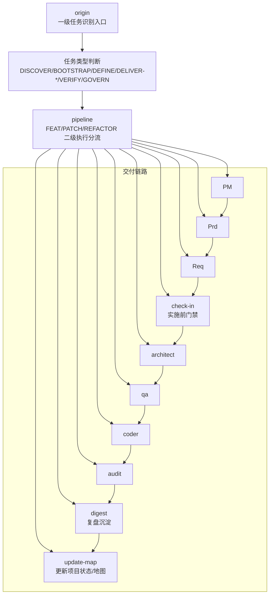
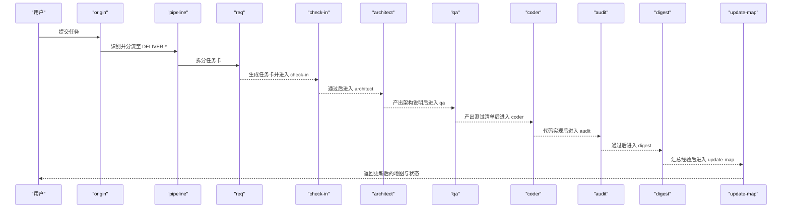
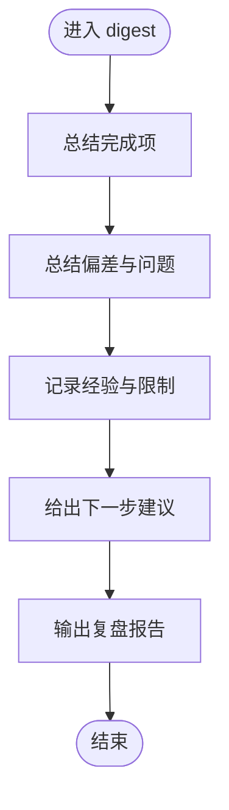
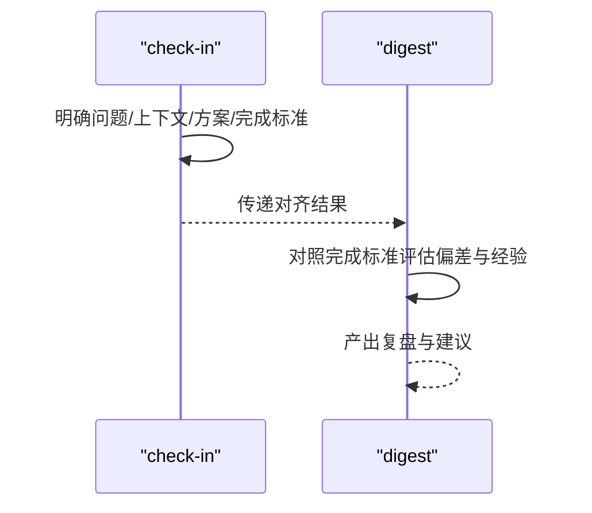
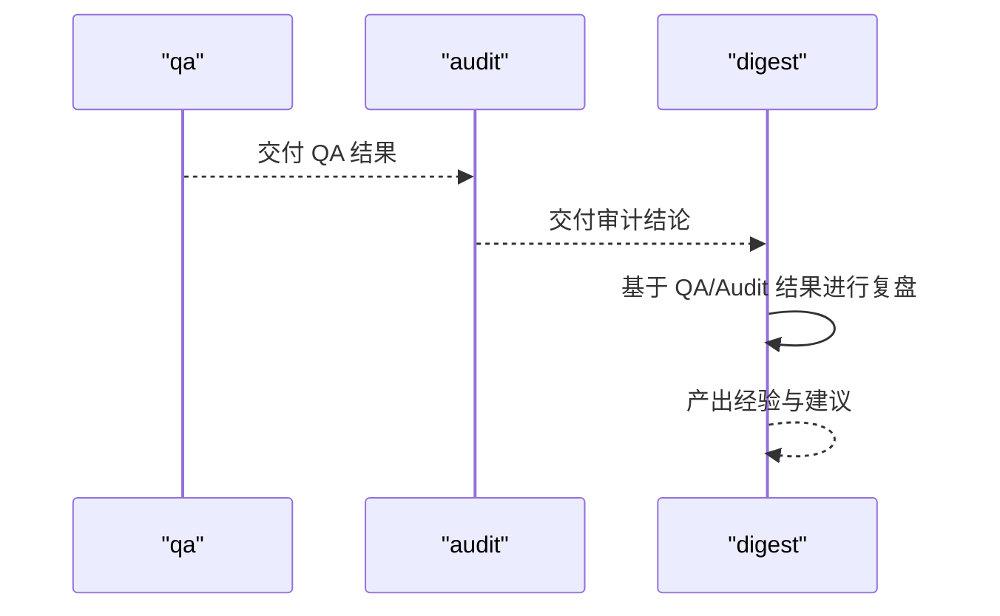
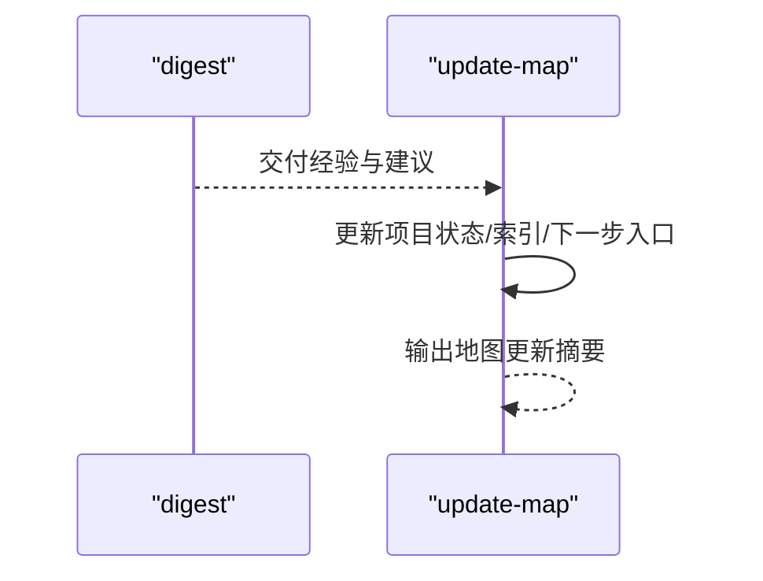
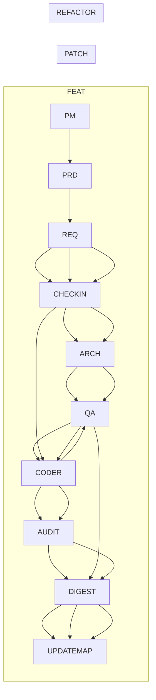

# 复盘沉淀技能（Digest）

<cite>
**本文引用的文件**
- [digest/SKILL.md](file://skills/web3-ai-agent/digest/SKILL.md)
- [SKILL.md](file://skills/web3-ai-agent/SKILL.md)
- [MAP-V3.md](file://skills/web3-ai-agent/MAP-V3.md)
- [check-in/SKILL.md](file://skills/web3-ai-agent/check-in/SKILL.md)
- [update-map/SKILL.md](file://skills/web3-ai-agent/update-map/SKILL.md)
- [qa/SKILL.md](file://skills/web3-ai-agent/qa/SKILL.md)
- [audit/SKILL.md](file://skills/web3-ai-agent/audit/SKILL.md)
- [architect/SKILL.md](file://skills/web3-ai-agent/architect/SKILL.md)
- [coder/SKILL.md](file://skills/web3-ai-agent/coder/SKILL.md)
- [pm/SKILL.md](file://skills/web3-ai-agent/pm/SKILL.md)
- [prd/SKILL.md](file://skills/web3-ai-agent/prd/SKILL.md)
- [req/SKILL.md](file://skills/web3-ai-agent/req/SKILL.md)
- [explore/SKILL.md](file://skills/web3-ai-agent/explore/SKILL.md)
</cite>

## 目录
1. [简介](#简介)
2. [项目结构](#项目结构)
3. [核心组件](#核心组件)
4. [架构总览](#架构总览)
5. [详细组件分析](#详细组件分析)
6. [依赖分析](#依赖分析)
7. [性能考虑](#性能考虑)
8. [故障排查指南](#故障排查指南)
9. [结论](#结论)
10. [附录](#附录)

## 简介
Digest 技能位于交付链末端，负责在任务完成后进行阶段复盘与知识沉淀，聚焦“经验与教训”的提炼，而非流水账式的变更记录。其输出结构化地呈现本轮完成事项、遇到的问题、学到的经验、尚未解决的问题以及下一步建议，形成可复用的知识资产，并与后续的 update-map 协同，确保项目状态与知识地图同步演进。

Digest 的关键定位：
- 不替代地图更新（update-map）与需求文档（PRD），仅承担“经验沉淀”职责。
- 在交付型任务链路中作为固定节点出现，贯穿 FEAT/PATCH/REFACTOR 的最终环节。
- 与学习门禁（check-in）形成前后呼应：前者对齐边界与完成标准，后者在实施前进行风险与范围确认，二者共同保证交付质量与可复盘性。

## 项目结构
本技能系统以 web3-ai-agent 为主入口，围绕“任务识别—路由—实施—复盘—更新地图”的闭环组织。Digest 作为交付链末端节点，与 QA、Audit、Coder、Architect、Req、Prd、PM 等技能协同，最终接入 update-map 完成状态与知识地图的同步。

图表来源
- [MAP-V3.md: 50-84:50-84](file://skills/web3-ai-agent/MAP-V3.md#L50-L84)
- [SKILL.md: 106-152:106-152](file://skills/web3-ai-agent/SKILL.md#L106-L152)

章节来源
- [SKILL.md: 92-158:92-158](file://skills/web3-ai-agent/SKILL.md#L92-L158)
- [MAP-V3.md: 104-131:104-131](file://skills/web3-ai-agent/MAP-V3.md#L104-L131)

## 核心组件
- 输入
  - 本轮产物（如代码、文档、配置等）
  - QA 结果（测试清单、红绿灯结果、验证结论）
  - Audit 结论（评分、结论、主要问题、风险建议）
- 输出
  - 结构化的复盘报告，包含：
    - 本轮完成了什么
    - 遇到了什么问题
    - 学到了什么
    - 仍未解决的问题
    - 下一步建议
- 边界
  - 不代替地图更新（update-map）
  - 不替代需求文档（PRD）
- 规则
  - 重点记录“为什么卡住/为什么成功”，避免流水账
  - PATCH 类任务可轻量写，但不建议省略

章节来源
- [digest/SKILL.md: 12-50:12-50](file://skills/web3-ai-agent/digest/SKILL.md#L12-L50)

## 架构总览
Digest 在不同交付类型中的位置如下：

图表来源
- [MAP-V3.md: 104-131:104-131](file://skills/web3-ai-agent/MAP-V3.md#L104-L131)
- [SKILL.md: 112-152:112-152](file://skills/web3-ai-agent/SKILL.md#L112-L152)

## 详细组件分析

### 复盘沉淀（Digest）流程
Digest 的执行流程强调“从结果到经验”的归纳，遵循以下步骤：
1) 总结完成项：聚焦实际达成的目标与产物，区分“做了什么”和“为什么做成”。
2) 总结偏差与问题：梳理未达预期、卡点、回归风险、边界误判等。
3) 记录经验与限制：沉淀可复用的方法论、工具、约束与反例。
4) 给出下一步建议：基于本次经验，给出可操作的优化建议与后续入口。

图表来源
- [digest/SKILL.md: 30-36:30-36](file://skills/web3-ai-agent/digest/SKILL.md#L30-L36)

章节来源
- [digest/SKILL.md: 30-50:30-50](file://skills/web3-ai-agent/digest/SKILL.md#L30-L50)

### 与学习门禁（check-in）的协作关系
- check-in 在实施前对齐问题、边界、方案与完成标准，确保任务在可控范围内推进；Digest 则在任务完成后回顾这些对齐点是否有效、是否出现偏差。
- 二者共同构成“事前对齐—事后复盘”的闭环，提升交付质量与知识沉淀效率。

图表来源
- [check-in/SKILL.md: 12-56:12-56](file://skills/web3-ai-agent/check-in/SKILL.md#L12-L56)
- [digest/SKILL.md: 37-50:37-50](file://skills/web3-ai-agent/digest/SKILL.md#L37-L50)

章节来源
- [check-in/SKILL.md: 37-56:37-56](file://skills/web3-ai-agent/check-in/SKILL.md#L37-L56)

### 与 QA/Audit 的衔接
- QA 负责将完成标准转化为测试清单并执行 RED/VERIFY，为 Digest 提供“是否达成目标”的客观依据。
- Audit 负责交付前的风险评分与结论，Digest 在此基础上进一步提炼“为什么通过/为什么失败”的经验与教训。

图表来源
- [qa/SKILL.md: 39-73:39-73](file://skills/web3-ai-agent/qa/SKILL.md#L39-L73)
- [audit/SKILL.md: 34-88:34-88](file://skills/web3-ai-agent/audit/SKILL.md#L34-L88)
- [digest/SKILL.md: 12-17:12-17](file://skills/web3-ai-agent/digest/SKILL.md#L12-L17)

章节来源
- [qa/SKILL.md: 12-73:12-73](file://skills/web3-ai-agent/qa/SKILL.md#L12-L73)
- [audit/SKILL.md: 12-88:12-88](file://skills/web3-ai-agent/audit/SKILL.md#L12-L88)

### 与 update-map 的协同
- Digest 聚焦“经验与教训”，update-map 聚焦“状态与地图”，二者职责清晰、边界明确，避免混写。
- Digest 的输出为 update-map 提供知识维度的输入，帮助下一轮任务在最新上下文中推进。

图表来源
- [update-map/SKILL.md: 8-47:8-47](file://skills/web3-ai-agent/update-map/SKILL.md#L8-L47)
- [digest/SKILL.md: 42-47:42-47](file://skills/web3-ai-agent/digest/SKILL.md#L42-L47)

章节来源
- [update-map/SKILL.md: 34-47:34-47](file://skills/web3-ai-agent/update-map/SKILL.md#L34-L47)

### 与其他技能的协作关系
- PM/PRD/REQ：在 FEAT/REFACTOR 中，Digest 会结合 PRD 的边界与 REQ 的验收标准，评估是否达成预期。
- Architect/Coder：Digest 会回顾架构设计与实现过程中的偏差与经验，辅助后续类似任务的决策。
- Explore：在 DISCOVER/BOOTSTRAP 中，Explore 提供项目现状与模块定位，为后续沉淀提供背景信息。

章节来源
- [pm/SKILL.md: 8-53:8-53](file://skills/web3-ai-agent/pm/SKILL.md#L8-L53)
- [prd/SKILL.md: 8-54:8-54](file://skills/web3-ai-agent/prd/SKILL.md#L8-L54)
- [req/SKILL.md: 8-57:8-57](file://skills/web3-ai-agent/req/SKILL.md#L8-L57)
- [architect/SKILL.md: 8-53:8-53](file://skills/web3-ai-agent/architect/SKILL.md#L8-L53)
- [coder/SKILL.md: 8-72:8-72](file://skills/web3-ai-agent/coder/SKILL.md#L8-L72)
- [explore/SKILL.md: 8-42:8-42](file://skills/web3-ai-agent/explore/SKILL.md#L8-L42)

## 依赖分析
Digest 在不同交付类型中的依赖关系如下：

图表来源
- [MAP-V3.md: 104-131:104-131](file://skills/web3-ai-agent/MAP-V3.md#L104-L131)
- [SKILL.md: 112-152:112-152](file://skills/web3-ai-agent/SKILL.md#L112-L152)

章节来源
- [MAP-V3.md: 102-131:102-131](file://skills/web3-ai-agent/MAP-V3.md#L102-L131)
- [SKILL.md: 112-152:112-152](file://skills/web3-ai-agent/SKILL.md#L112-L152)

## 性能考虑
- 复盘效率：Digest 的输出结构化程度直接影响后续检索与复用效率，建议在团队内统一复盘模板与关键词规范。
- 信息密度：避免流水账式记录，聚焦“为什么卡住/为什么成功”，提升经验迁移价值。
- 自动化辅助：可在 CI/CD 中嵌入复盘触发器，将 QA/Audit 结果自动汇总到 Digest 输入，减少手工录入成本。

## 故障排查指南
- 症状：Digest 输出过于流水账，缺乏经验提炼
  - 排查要点：是否严格遵循“记录原因而非过程”的规则；是否结合 QA/Audit 的结论进行归因
  - 改进建议：引入复盘模板与评审机制，确保每轮复盘至少包含“问题—原因—经验—建议”四要素
- 症状：Digest 与 update-map 混写，导致地图混乱
  - 排查要点：是否混淆“经验沉淀”与“状态更新”的边界
  - 改进建议：严格执行“digest 负责经验，update-map 负责状态”的分工，避免交叉编写
- 症状：复盘遗漏关键教训
  - 排查要点：是否充分参考 check-in 的完成标准与边界；是否结合 PRD/REQ 的验收条件
  - 改进建议：在复盘前强制回看 check-in、PRD/REQ 的关键条款，确保复盘覆盖所有边界与风险点

章节来源
- [digest/SKILL.md: 37-50:37-50](file://skills/web3-ai-agent/digest/SKILL.md#L37-L50)
- [update-map/SKILL.md: 34-47:34-47](file://skills/web3-ai-agent/update-map/SKILL.md#L34-L47)
- [check-in/SKILL.md: 51-56:51-56](file://skills/web3-ai-agent/check-in/SKILL.md#L51-L56)

## 结论
Digest 技能通过结构化复盘与经验沉淀，将每次交付的“结果”转化为“知识资产”，并与 check-in、QA、Audit、update-map 等技能形成紧密闭环。它不仅服务于当轮任务的总结，更是团队知识传承与持续改进的重要抓手。建议在团队内固化复盘模板与评审机制，确保经验可复用、教训可规避，推动项目在迭代中不断进化。

## 附录
- 使用示例（场景一：FEAT 交付）
  - 输入：PRD 边界、REQ 验收标准、check-in 完成标准、architect 架构说明、QA 红绿灯结果、coder 代码实现、audit 评分与结论
  - 输出：本轮完成项、遇到的问题、学到的经验、尚未解决的问题、下一步建议
  - 用途：沉淀 FEAT 的边界管理、测试策略、实现风险与优化建议，为后续同类任务提供参考
- 使用示例（场景二：PATCH 交付）
  - 输入：REQ 缺陷卡、check-in 完成标准、coder 修复、QA 回归验证、audit 轻审结论
  - 输出：缺陷修复经验、回归风险控制、工具链优化建议
  - 用途：沉淀常见缺陷类型与修复套路，提升修复效率与质量
- 使用示例（场景三：REFACTOR 交付）
  - 输入：REQ 重构卡、check-in 边界、architect 设计说明、QA 回归验证、coder 实现、audit 重审结论
  - 输出：重构经验、架构演进教训、风险控制建议
  - 用途：沉淀重构过程中的设计权衡与风险控制方法，指导后续重构任务

章节来源
- [digest/SKILL.md: 12-28:12-28](file://skills/web3-ai-agent/digest/SKILL.md#L12-L28)
- [SKILL.md: 112-152:112-152](file://skills/web3-ai-agent/SKILL.md#L112-L152)