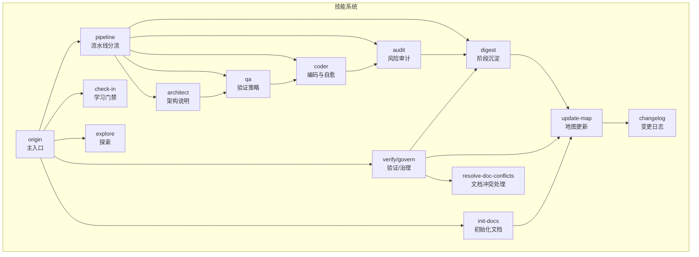
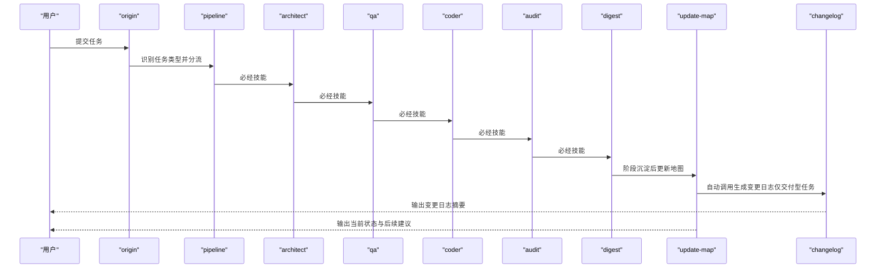
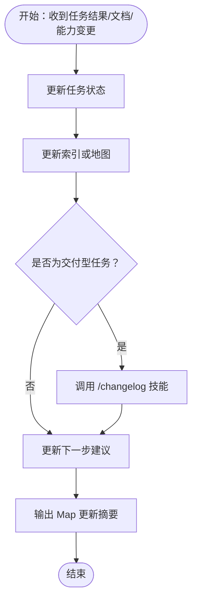
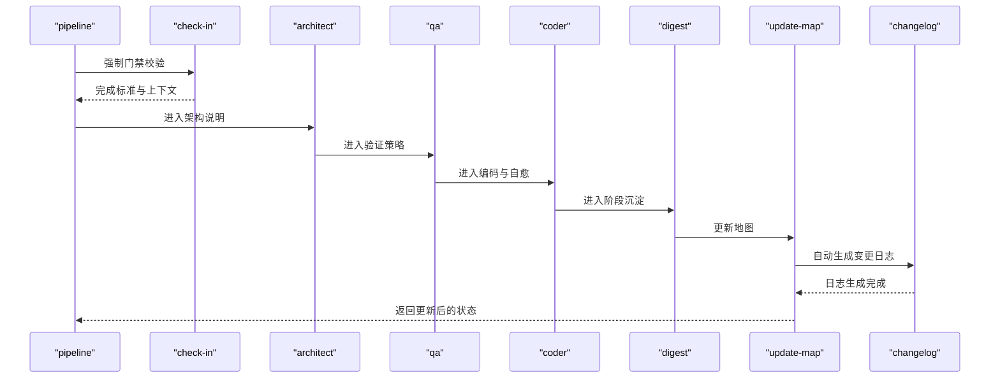
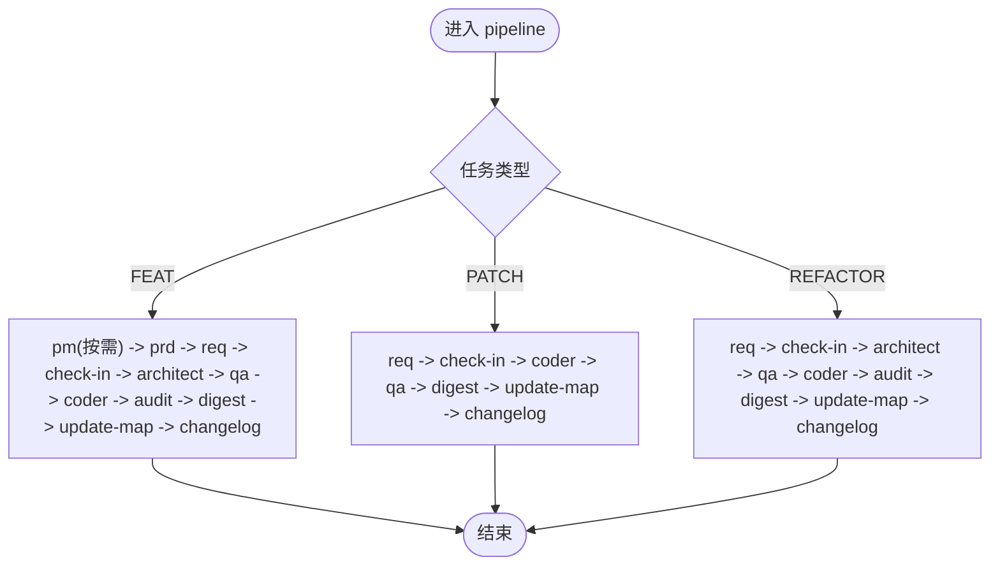
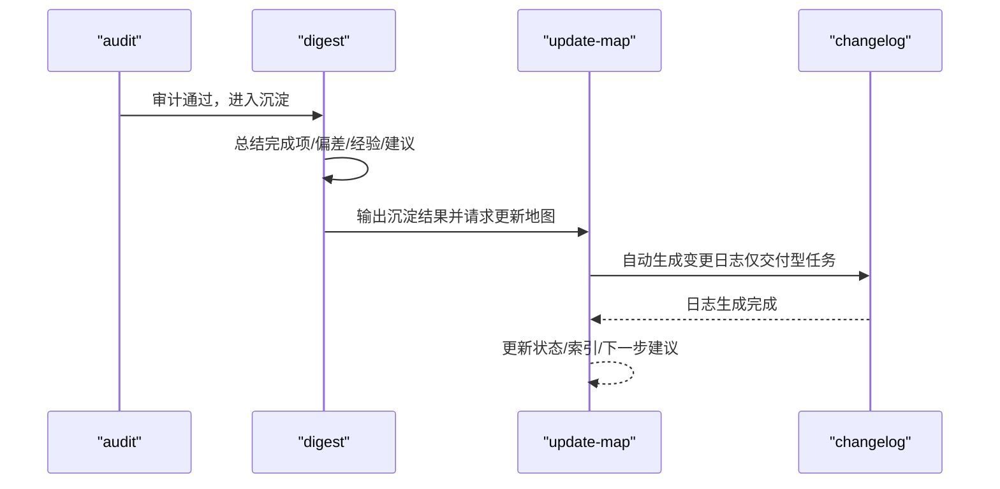
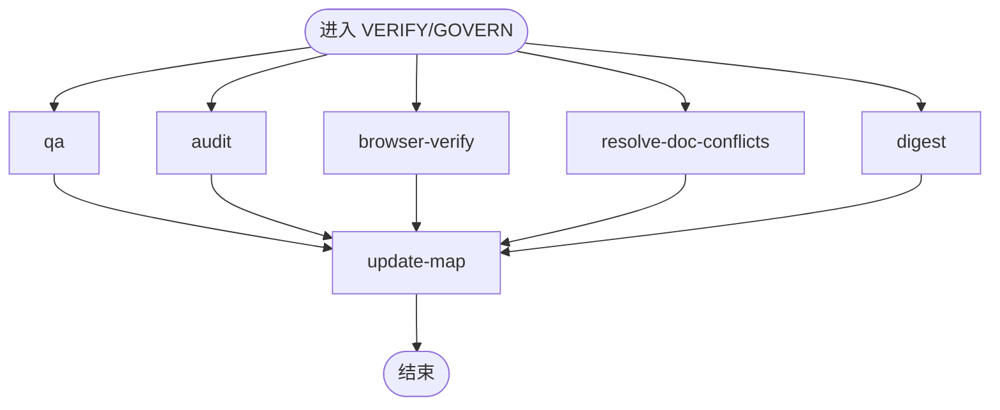
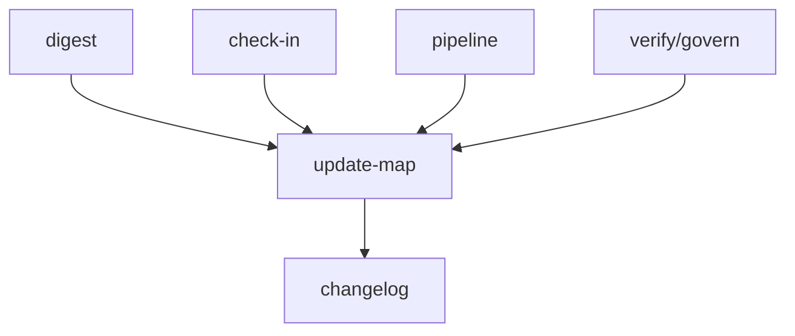

# 地图更新技能（Update-Map）

<cite>
**本文引用的文件**
- [skills/x-ray/update-map/SKILL.md](file://skills/x-ray/update-map/SKILL.md)
- [skills/x-ray/SKILL-SYSTEM-DESIGN-V3.md](file://skills/x-ray/SKILL-SYSTEM-DESIGN-V3.md)
- [skills/x-ray/COMMANDS.md](file://skills/x-ray/COMMANDS.md)
- [docs/changelog/README.md](file://docs/changelog/README.md)
- [docs/changelog/2026-04-17-feat-project-init.md](file://docs/changelog/2026-04-17-feat-project-init.md)
- [docs/changelog/INDEX.md](file://docs/changelog/INDEX.md)
- [skills/x-ray/pipeline/SKILL.md](file://skills/x-ray/pipeline/SKILL.md)
- [skills/x-ray/check-in/SKILL.md](file://skills/x-ray/check-in/SKILL.md)
- [skills/x-ray/digest/SKILL.md](file://skills/x-ray/digest/SKILL.md)
- [skills/x-ray/architect/SKILL.md](file://skills/x-ray/architect/SKILL.md)
- [skills/x-ray/qa/SKILL.md](file://skills/x-ray/qa/SKILL.md)
- [skills/x-ray/coder/SKILL.md](file://skills/x-ray/coder/SKILL.md)
- [skills/x-ray/audit/SKILL.md](file://skills/x-ray/audit/SKILL.md)
- [skills/x-ray/resolve-doc-conflicts/SKILL.md](file://skills/x-ray/resolve-doc-conflicts/SKILL.md)
</cite>

## 更新摘要
**变更内容**
- 新增了changelog自动触发功能的详细说明
- 更新了Update-Map技能流程，增加了自动调用/changelog的步骤
- 添加了变更日志管理系统的完整介绍
- 更新了项目文档管理能力的相关内容

## 目录
1. [简介](#简介)
2. [项目结构](#项目结构)
3. [核心组件](#核心组件)
4. [架构总览](#架构总览)
5. [详细组件分析](#详细组件分析)
6. [依赖分析](#依赖分析)
7. [性能考虑](#性能考虑)
8. [故障排查指南](#故障排查指南)
9. [结论](#结论)
10. [附录](#附录)

## 简介
地图更新技能（Update-Map）用于在任务执行过程中维护项目状态、索引与下一步入口建议，确保下一轮任务能够基于最新上下文继续推进。它与学习门禁（Check-In）、流水线（Pipeline）等技能紧密协作，贯穿从探索、引导、定义到交付与治理的全流程，是保持项目信息实时性与准确性的关键环节。

**更新**：现在Update-Map会在每次交付型任务完成后自动调用changelog技能生成变更日志，增强了项目的文档管理能力和历史追踪能力。

## 项目结构
- Update-Map 位于技能目录的 update-map 子目录中，配套文档包括其自身 SKILL.md 与全局技能系统设计文档（SKILL-SYSTEM-DESIGN-V3、COMMANDS.md）。
- 与之协同的关键技能包括：Check-In（门禁）、Pipeline（分流）、Digest（沉淀）、Architect（架构）、QA（验证）、Coder（编码）、Audit（审计）、Resolve-Doc-Conflicts（文档冲突处理）等。
- **新增**：Changelog管理系统，提供自动化的变更日志生成和管理功能。
- 斜杠命令（Slash Commands）提供了统一的调用入口与推荐命令表，便于用户以自然语言或命令形式触发流程。

**图表来源**
- [skills/x-ray/SKILL-SYSTEM-DESIGN-V3.md](file://skills/x-ray/SKILL-SYSTEM-DESIGN-V3.md)
- [skills/x-ray/update-map/SKILL.md](file://skills/x-ray/update-map/SKILL.md)
- [docs/changelog/README.md](file://docs/changelog/README.md)

**章节来源**
- [skills/x-ray/SKILL-SYSTEM-DESIGN-V3.md](file://skills/x-ray/SKILL-SYSTEM-DESIGN-V3.md)
- [skills/x-ray/COMMANDS.md](file://skills/x-ray/COMMANDS.md)

## 核心组件
- **Update-Map**：维护当前项目状态，确保下一轮任务能基于最新上下文继续推进；更新索引或地图；更新下一步建议；**新增**：自动调用changelog技能生成变更日志。
- **Check-In**：实施前门禁，明确问题、边界、方案与完成标准，是进入 Architect/QA/Coder 的前提。
- **Pipeline**：为交付型任务选择执行深度，决定必经与可跳过的技能链路。
- **Digest**：阶段沉淀，记录完成项、问题、经验与后续建议，随后进入 Update-Map。
- **Changelog**：**新增**变更日志管理，自动记录交付型任务的变更事实，提供完整的项目演进历史。
- Architect/QA/Coder/Audit：结构设计、验证策略、编码与自愈、风险审计的闭环。
- Verify/Govern：验证与治理链路，包含文档冲突处理与最终地图更新。

**章节来源**
- [skills/x-ray/update-map/SKILL.md](file://skills/x-ray/update-map/SKILL.md)
- [skills/x-ray/check-in/SKILL.md](file://skills/x-ray/check-in/SKILL.md)
- [skills/x-ray/pipeline/SKILL.md](file://skills/x-ray/pipeline/SKILL.md)
- [skills/x-ray/digest/SKILL.md](file://skills/x-ray/digest/SKILL.md)
- [docs/changelog/README.md](file://docs/changelog/README.md)

## 架构总览
Update-Map 在技能系统中扮演"状态与地图的守护者"角色，贯穿以下典型路径：
- 交付型任务（FEAT/PATCH/REFACTOR）：由 Pipeline 分流后，依次经 Architect → QA → Coder → Audit → Digest → **Update-Map → Changelog**，最终生成完整的变更日志。
- 非交付型任务（DISCOVER/BOOTSTRAP/DEFINE/VERIFY/GOVERN）：根据任务类型进入相应链路，部分链路（如 BOOTSTRAP、VERIFY/GOVERN）也会在关键节点调用 Update-Map 以同步状态。

**更新**：现在在Digest之后增加了Changelog步骤，确保每次交付型任务都有完整的变更记录。

**图表来源**
- [skills/x-ray/SKILL-SYSTEM-DESIGN-V3.md](file://skills/x-ray/SKILL-SYSTEM-DESIGN-V3.md)
- [skills/x-ray/update-map/SKILL.md](file://skills/x-ray/update-map/SKILL.md)
- [docs/changelog/README.md](file://docs/changelog/README.md)

## 详细组件分析

### Update-Map 组件分析
- **作用**：维护当前项目状态，确保下一轮任务能基于最新上下文继续推进；更新索引或地图；更新下一步建议；**新增**：自动调用changelog技能生成变更日志。
- **输入**：当前任务结果、新增或修改的文档、新增或修改的能力。
- **输出**：Map 更新摘要（当前状态、影响模块/能力、新增文档、需要关注的后续入口）；**新增**：变更日志生成通知。
- **流程**：更新任务状态 → 更新索引或地图 → **调用 `/changelog`**（如为交付型任务 FEAT/PATCH/REFACTOR）→ 更新下一步建议。
- **边界**：不做深度复盘、不重新定义需求。
- **衔接**：返回 origin，形成闭环。
- **规则**：任何改变状态的交付任务都应更新地图；digest 负责经验，update-map 负责状态，不混写。

**更新**：在流程中新增了自动调用changelog技能的步骤，确保交付型任务的变更得到完整记录。

**图表来源**
- [skills/x-ray/update-map/SKILL.md](file://skills/x-ray/update-map/SKILL.md)
- [docs/changelog/README.md](file://docs/changelog/README.md)

**章节来源**
- [skills/x-ray/update-map/SKILL.md](file://skills/x-ray/update-map/SKILL.md)

### Changelog 系统分析
**新增**：Changelog系统是Update-Map的重要扩展功能，提供自动化的变更日志管理能力。

- **作用**：自动记录每次交付型任务的变更事实，提供完整的项目演进历史。
- **触发条件**：仅在交付型任务（FEAT/PATCH/REFACTOR）完成后触发。
- **记录内容**：
  - 任务基本信息（类型、主题、Pipeline）
  - 架构设计内容（如执行了 `/architect`）
  - 变更详情（新增、修改、删除、修复）
  - 影响范围（破坏性变更、迁移需求）
  - 上下文标记（关键词、相关文档、后续建议）
- **文件命名**：`YYYY-MM-DD-{task-type}.md`（如 `2026-04-21-feat-chat-integration.md`）
- **存储位置**：`docs/changelog/` 目录
- **索引管理**：提供按时间倒序的索引文件和按模块分类的统计信息

**使用场景**：
1. AI上下文理解：后续AI任务可通过查阅changelog了解历史变更
2. 开发者追溯：快速定位某次变更的设计决策和影响范围
3. 项目审计：完整的项目演进历史记录

**章节来源**
- [docs/changelog/README.md](file://docs/changelog/README.md)
- [docs/changelog/2026-04-17-feat-project-init.md](file://docs/changelog/2026-04-17-feat-project-init.md)
- [docs/changelog/INDEX.md](file://docs/changelog/INDEX.md)

### 与学习门禁（Check-In）的协作
- Check-In 是实施前门禁，强制适用于 FEAT/PATCH/REFACTOR 与准备进入实施的 DEFINE 任务；其输出必须明确"不做什么"和完成标准，否则视为未完成。
- Update-Map 依赖 Check-In 提供的上下文与完成标准，确保后续步骤（Architect/QA/Coder）在清晰边界下执行。

**图表来源**
- [skills/x-ray/check-in/SKILL.md](file://skills/x-ray/check-in/SKILL.md)
- [skills/x-ray/pipeline/SKILL.md](file://skills/x-ray/pipeline/SKILL.md)
- [skills/x-ray/digest/SKILL.md](file://skills/x-ray/digest/SKILL.md)
- [skills/x-ray/update-map/SKILL.md](file://skills/x-ray/update-map/SKILL.md)
- [docs/changelog/README.md](file://docs/changelog/README.md)

**章节来源**
- [skills/x-ray/check-in/SKILL.md](file://skills/x-ray/check-in/SKILL.md)
- [skills/x-ray/pipeline/SKILL.md](file://skills/x-ray/pipeline/SKILL.md)
- [skills/x-ray/digest/SKILL.md](file://skills/x-ray/digest/SKILL.md)
- [skills/x-ray/update-map/SKILL.md](file://skills/x-ray/update-map/SKILL.md)

### 与流水线（Pipeline）的协作
- Pipeline 为交付型任务选择执行深度，决定必经与可跳过的技能链路；FEAT 默认必须有 PM+PRD+REQ，PATCH 默认不走 PM/PRD，REFACTOR 默认不走 PM。
- Update-Map 在每个交付任务链路的末端被调用，确保地图反映最新的状态与下一步建议；**新增**：在此时自动触发changelog技能生成变更日志。

**图表来源**
- [skills/x-ray/pipeline/SKILL.md](file://skills/x-ray/pipeline/SKILL.md)
- [skills/x-ray/SKILL-SYSTEM-DESIGN-V3.md](file://skills/x-ray/SKILL-SYSTEM-DESIGN-V3.md)
- [skills/x-ray/update-map/SKILL.md](file://skills/x-ray/update-map/SKILL.md)
- [docs/changelog/README.md](file://docs/changelog/README.md)

**章节来源**
- [skills/x-ray/pipeline/SKILL.md](file://skills/x-ray/pipeline/SKILL.md)
- [skills/x-ray/SKILL-SYSTEM-DESIGN-V3.md](file://skills/x-ray/SKILL-SYSTEM-DESIGN-V3.md)
- [skills/x-ray/update-map/SKILL.md](file://skills/x-ray/update-map/SKILL.md)

### 与阶段沉淀（Digest）的协作
- Digest 负责记录完成项、问题、经验与下一步建议；随后进入 Update-Map，确保地图及时反映阶段成果与后续方向。
- **更新**：现在Update-Map在Digest之后自动调用changelog技能，生成变更日志；Digest专注于经验总结，Update-Map负责状态更新，Changelog负责变更记录。

**图表来源**
- [skills/x-ray/digest/SKILL.md](file://skills/x-ray/digest/SKILL.md)
- [skills/x-ray/audit/SKILL.md](file://skills/x-ray/audit/SKILL.md)
- [skills/x-ray/update-map/SKILL.md](file://skills/x-ray/update-map/SKILL.md)
- [docs/changelog/README.md](file://docs/changelog/README.md)

**章节来源**
- [skills/x-ray/digest/SKILL.md](file://skills/x-ray/digest/SKILL.md)
- [skills/x-ray/audit/SKILL.md](file://skills/x-ray/audit/SKILL.md)
- [skills/x-ray/update-map/SKILL.md](file://skills/x-ray/update-map/SKILL.md)

### 与验证/治理（Verify/Govern）的协作
- 验证/治理链路包含 QA、Audit、Browser-Verify、Resolve-Doc-Conflicts、Digest 与 Update-Map；文档冲突处理（Resolve-Doc-Conflicts）优先清理 docs 类冲突，避免与代码修复混在一起。
- Verify/Govern 通常不进入完整的交付链路，但在关键节点会调用 Update-Map 以同步状态；**新增**：Update-Map在此时同样会检查是否需要生成变更日志。

**图表来源**
- [skills/x-ray/SKILL-SYSTEM-DESIGN-V3.md](file://skills/x-ray/SKILL-SYSTEM-DESIGN-V3.md)
- [skills/x-ray/resolve-doc-conflicts/SKILL.md](file://skills/x-ray/resolve-doc-conflicts/SKILL.md)
- [skills/x-ray/digest/SKILL.md](file://skills/x-ray/digest/SKILL.md)
- [skills/x-ray/update-map/SKILL.md](file://skills/x-ray/update-map/SKILL.md)

**章节来源**
- [skills/x-ray/SKILL-SYSTEM-DESIGN-V3.md](file://skills/x-ray/SKILL-SYSTEM-DESIGN-V3.md)
- [skills/x-ray/resolve-doc-conflicts/SKILL.md](file://skills/x-ray/resolve-doc-conflicts/SKILL.md)
- [skills/x-ray/digest/SKILL.md](file://skills/x-ray/digest/SKILL.md)
- [skills/x-ray/update-map/SKILL.md](file://skills/x-ray/update-map/SKILL.md)

## 依赖分析
- Update-Map 与 Digest 的耦合度高，Digest 的输出是 Update-Map 的主要输入之一。
- Update-Map 与 Check-In 的耦合体现在"完成标准与上下文"的依赖上，确保后续步骤在清晰边界下执行。
- Update-Map 与 Pipeline 的耦合体现在交付型任务的链路末端，确保地图反映最新状态。
- Update-Map 与 Verify/Govern 的耦合体现在治理与验证阶段的状态同步。
- **新增**：Update-Map 与 Changelog 的集成，形成完整的变更记录闭环。

**图表来源**
- [skills/x-ray/digest/SKILL.md](file://skills/x-ray/digest/SKILL.md)
- [skills/x-ray/check-in/SKILL.md](file://skills/x-ray/check-in/SKILL.md)
- [skills/x-ray/pipeline/SKILL.md](file://skills/x-ray/pipeline/SKILL.md)
- [skills/x-ray/SKILL-SYSTEM-DESIGN-V3.md](file://skills/x-ray/SKILL-SYSTEM-DESIGN-V3.md)
- [skills/x-ray/update-map/SKILL.md](file://skills/x-ray/update-map/SKILL.md)
- [docs/changelog/README.md](file://docs/changelog/README.md)

**章节来源**
- [skills/x-ray/digest/SKILL.md](file://skills/x-ray/digest/SKILL.md)
- [skills/x-ray/check-in/SKILL.md](file://skills/x-ray/check-in/SKILL.md)
- [skills/x-ray/pipeline/SKILL.md](file://skills/x-ray/pipeline/SKILL.md)
- [skills/x-ray/SKILL-SYSTEM-DESIGN-V3.md](file://skills/x-ray/SKILL-SYSTEM-DESIGN-V3.md)
- [skills/x-ray/update-map/SKILL.md](file://skills/x-ray/update-map/SKILL.md)

## 性能考虑
- Update-Map 的更新频率应与阶段性成果对齐，避免过度频繁更新导致状态漂移。
- 在大规模并发任务中，建议将 Update-Map 的更新操作批量化，减少重复计算与状态竞争。
- 与 Digest 的协作应尽量避免冗余信息，确保 Update-Map 的输入聚焦于关键状态与下一步建议。
- **新增**：Changelog生成操作应该异步执行，避免阻塞主流程；对于非交付型任务，Update-Map应该跳过changelog调用以提高性能。

## 故障排查指南
- **症状**：Update-Map 未更新或更新滞后
  - 排查要点：确认 Digest 是否正常输出；确认 Check-In 是否提供明确完成标准；确认 Pipeline 是否正确分流至 Update-Map。
- **症状**：状态不一致或上下文缺失
  - 排查要点：检查 Verify/Govern 链路是否在关键节点调用 Update-Map；确认 Resolve-Doc-Conflicts 是否正确处理文档冲突。
- **症状**：后续建议不准确
  - 排查要点：核对 Update-Map 的输入（任务结果、文档变更、能力变更）是否完整；检查规则是否被正确遵循（不重新定义需求、不做深度复盘）。
- **新增**：**症状**：变更日志未生成或生成异常
  - **排查要点**：确认任务类型是否为交付型（FEAT/PATCH/REFACTOR）；检查Update-Map是否正确调用/changelog技能；验证changelog目录权限和文件命名规范。

**章节来源**
- [skills/x-ray/update-map/SKILL.md](file://skills/x-ray/update-map/SKILL.md)
- [skills/x-ray/digest/SKILL.md](file://skills/x-ray/digest/SKILL.md)
- [skills/x-ray/check-in/SKILL.md](file://skills/x-ray/check-in/SKILL.md)
- [skills/x-ray/pipeline/SKILL.md](file://skills/x-ray/pipeline/SKILL.md)
- [skills/x-ray/resolve-doc-conflicts/SKILL.md](file://skills/x-ray/resolve-doc-conflicts/SKILL.md)

## 结论
Update-Map 是技能系统中维持项目状态与地图连续性的关键节点，与 Check-In、Pipeline、Digest、Architect、QA、Coder、Audit、Resolve-Doc-Conflicts 等技能形成紧密协作。**更新**：现在通过集成changelog自动触发功能，进一步增强了项目的文档管理能力和历史追踪能力。通过规范化的输入输出、严格的边界约束和自动化的变更记录，它确保项目信息的实时性与准确性，并为后续任务提供可靠的上下文基础。

## 附录
- **使用示例（命令形式）**
  - 新功能：/origin + 任务描述
  - 修 bug：/origin + 任务描述
  - 重构：/origin + 任务描述
  - 探索项目：/explore + 任务描述
- **推荐命令表**
  - /origin、/pipeline feat、/pipeline patch、/pipeline refactor、/pm、/prd、/req、/check-in、/architect、/qa、/coder、/audit、/digest、/update-map、/explore、/init-docs、/browser-verify、/resolve-doc-conflicts、/changelog
- **新增**：**变更日志使用指南**
  - 查看最新变更：访问 `docs/changelog/` 目录
  - 按日期检索：使用 `docs/changelog/INDEX.md` 索引文件
  - 查看特定变更：打开对应的 `YYYY-MM-DD-{task-type}.md` 文件
  - 导航到相关文档：参考变更日志中的"相关文档"链接

**章节来源**
- [skills/x-ray/COMMANDS.md](file://skills/x-ray/COMMANDS.md)
- [skills/x-ray/SKILL-SYSTEM-DESIGN-V3.md](file://skills/x-ray/SKILL-SYSTEM-DESIGN-V3.md)
- [docs/changelog/README.md](file://docs/changelog/README.md)