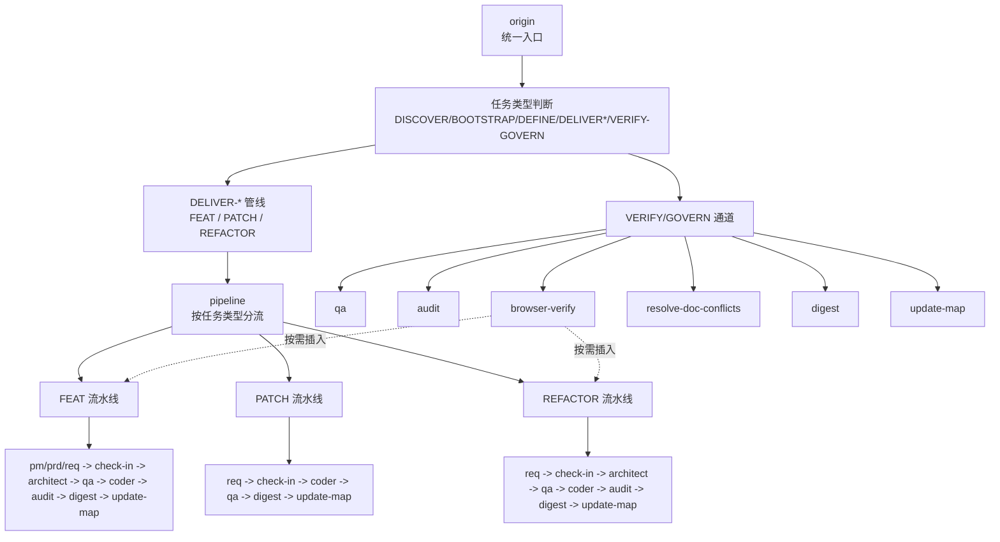
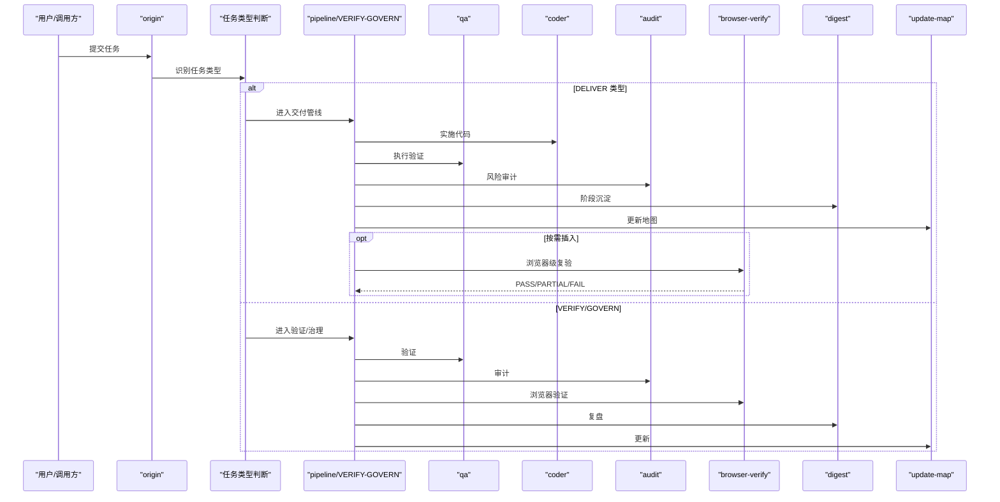
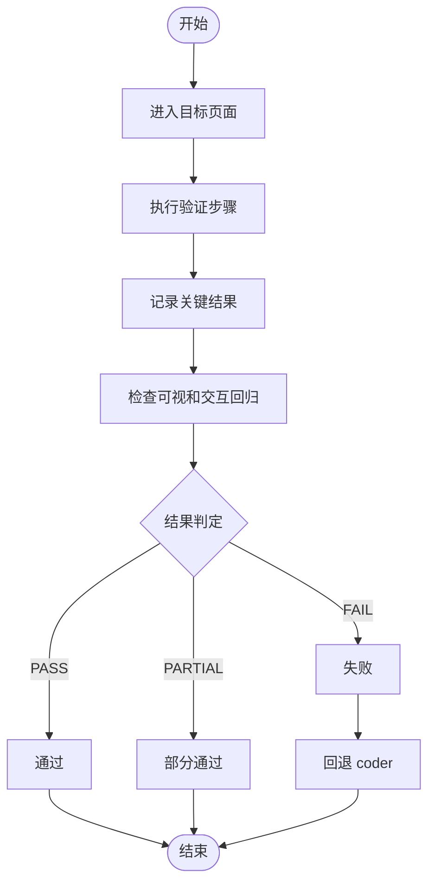
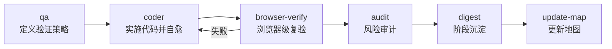
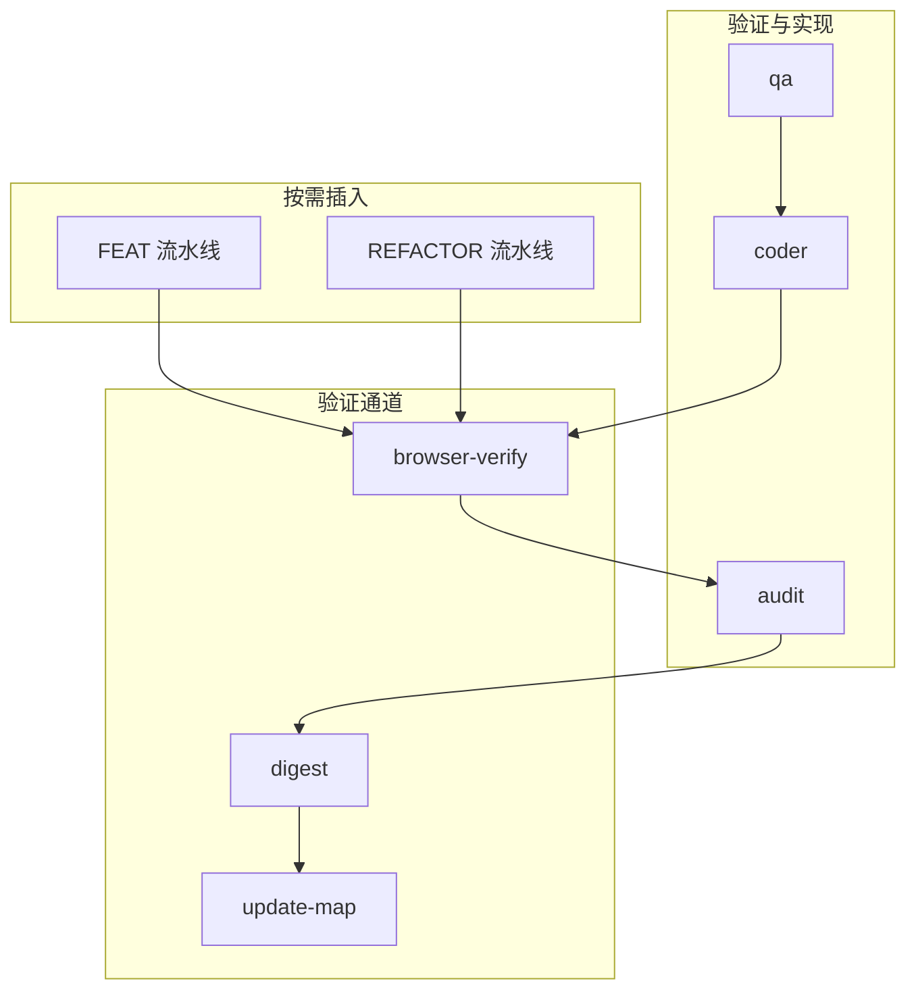

# 浏览器验证技能 (Browser-Verify)

<cite>
**本文引用的文件列表**
- [browser-verify/SKILL.md](file://skills/web3-ai-agent/browser-verify/SKILL.md)
- [SKILL.md](file://skills/web3-ai-agent/SKILL.md)
- [MAP-V3.md](file://skills/web3-ai-agent/MAP-V3.md)
- [COMMANDS.md](file://skills/web3-ai-agent/COMMANDS.md)
- [qa/SKILL.md](file://skills/web3-ai-agent/qa/SKILL.md)
- [coder/SKILL.md](file://skills/web3-ai-agent/coder/SKILL.md)
- [audit/SKILL.md](file://skills/web3-ai-agent/audit/SKILL.md)
- [architect/SKILL.md](file://skills/web3-ai-agent/architect/SKILL.md)
- [digest/SKILL.md](file://skills/web3-ai-agent/digest/SKILL.md)
</cite>

## 目录
1. [简介](#简介)
2. [项目结构](#项目结构)
3. [核心组件](#核心组件)
4. [架构总览](#架构总览)
5. [详细组件分析](#详细组件分析)
6. [依赖关系分析](#依赖关系分析)
7. [性能与稳定性考量](#性能与稳定性考量)
8. [故障排查指南](#故障排查指南)
9. [结论](#结论)
10. [附录](#附录)

## 简介
浏览器验证技能（Browser-Verify）是 Web3 AI Agent 技能体系中的一个关键环节，专注于“浏览器层”的可视化与交互验收，主要面向前端页面、交互流程与页面回归验证。其核心价值在于：
- 以“肉眼确认”为主的方式，快速定位前端行为与视觉回归问题
- 作为交付流程中的“按需插入点”，在不同任务类型（FEAT/PATCH/REFACTOR）中灵活启用
- 与 QA、Coder、Audit 等技能形成闭环，支撑质量保证与风险控制

本技能不直接改代码，也不替代单元/集成测试，强调“浏览器级复验”和“可视交互回归”。

**章节来源**
- [browser-verify/SKILL.md:1-52](file://skills/web3-ai-agent/browser-verify/SKILL.md#L1-L52)

## 项目结构
Web3 AI Agent 的技能系统以“主入口 + 分流 + 管线”的方式组织，Browser-Verify 既可作为交付管线中的按需环节，也可在“验证/治理”通道中直接触发。整体结构如下：

**图表来源**
- [MAP-V3.md:1-84](file://skills/web3-ai-agent/MAP-V3.md#L1-L84)
- [SKILL.md:154-158](file://skills/web3-ai-agent/SKILL.md#L154-L158)

**章节来源**
- [MAP-V3.md:1-84](file://skills/web3-ai-agent/MAP-V3.md#L1-L84)
- [SKILL.md:154-158](file://skills/web3-ai-agent/SKILL.md#L154-L158)

## 核心组件
- 适用场景
  - 前端页面验收
  - 交互流程验证
  - 可视回归检查
  - PATCH 的浏览器级复验
- 输入
  - 目标页面或入口
  - 修复/改动说明
  - 验证步骤
- 输出
  - 结果：PASS / PARTIAL / FAIL
  - 发现的问题
- 流程
  - 进入目标页面
  - 执行验证步骤
  - 记录关键结果
  - 检查可视和交互回归
- 边界
  - 不直接改代码
  - 不代替单元/集成测试
- 衔接
  - 通过：回到 audit 或 closeout（在流程中体现）
  - 失败：回退 coder
- 规则
  - 当前端行为需要肉眼确认时优先使用
  - 可用于 FEAT / PATCH / REFACTOR，但不是每次强制

**章节来源**
- [browser-verify/SKILL.md:8-52](file://skills/web3-ai-agent/browser-verify/SKILL.md#L8-L52)

## 架构总览
Browser-Verify 在整体流程中的位置与上下游关系如下：

**图表来源**
- [MAP-V3.md:50-84](file://skills/web3-ai-agent/MAP-V3.md#L50-L84)
- [SKILL.md:154-158](file://skills/web3-ai-agent/SKILL.md#L154-L158)

## 详细组件分析

### 适用场景与输入输出
- 适用场景
  - 前端页面验收：确保页面布局、元素可见性、文案正确性等符合预期
  - 交互流程验证：验证点击、跳转、表单提交、状态变更等交互逻辑
  - 可视回归检查：对比历史快照，发现视觉差异
  - PATCH 的浏览器级复验：对小改动进行快速浏览器端回归
- 输入
  - 目标页面或入口：明确待验证的页面 URL 或入口
  - 修复/改动说明：简述本次改动内容与影响范围
  - 验证步骤：可重复、可观察的步骤清单
- 输出
  - 结果：PASS（全部通过）、PARTIAL（部分通过）、FAIL（未通过）
  - 发现的问题：问题描述、截图/录屏建议、复现步骤

**章节来源**
- [browser-verify/SKILL.md:8-29](file://skills/web3-ai-agent/browser-verify/SKILL.md#L8-L29)

### 执行流程与边界
- 执行流程
  1) 进入目标页面
  2) 执行验证步骤
  3) 记录关键结果
  4) 检查可视和交互回归
- 边界
  - 不直接改代码
  - 不代替单元/集成测试
- 规则
  - 当前端行为需要肉眼确认时优先使用
  - 可用于 FEAT / PATCH / REFACTOR，但不是每次强制

**图表来源**
- [browser-verify/SKILL.md:31-52](file://skills/web3-ai-agent/browser-verify/SKILL.md#L31-L52)

**章节来源**
- [browser-verify/SKILL.md:31-52](file://skills/web3-ai-agent/browser-verify/SKILL.md#L31-L52)

### 与编码实现技能的协作关系
- 与 QA 的关系
  - QA 负责把完成标准转化为验证清单，FEAT 先 RED 再 GREEN；PATCH/REFACTOR 走轻量验证或回归验证
  - Browser-Verify 作为“浏览器级复验”，补充 QA 的验证覆盖面
- 与 Coder 的关系
  - Coder 在边界清晰的前提下实施代码，并通过最多 10 轮自愈循环将 QA 的 RED 变为 GREEN
  - 若 Browser-Verify 失败，会回退至 Coder 进一步修复
- 与 Audit 的关系
  - Audit 是交付前最后一道风险关，评估需求一致性、安全与风险边界、代码质量、回归风险等
  - Browser-Verify 的结果可作为审计输入的一部分，辅助判断回归风险与用户体验质量

**图表来源**
- [qa/SKILL.md:14-73](file://skills/web3-ai-agent/qa/SKILL.md#L14-L73)
- [coder/SKILL.md:18-72](file://skills/web3-ai-agent/coder/SKILL.md#L18-L72)
- [audit/SKILL.md:12-88](file://skills/web3-ai-agent/audit/SKILL.md#L12-L88)
- [browser-verify/SKILL.md:43-46](file://skills/web3-ai-agent/browser-verify/SKILL.md#L43-L46)

**章节来源**
- [qa/SKILL.md:14-73](file://skills/web3-ai-agent/qa/SKILL.md#L14-L73)
- [coder/SKILL.md:18-72](file://skills/web3-ai-agent/coder/SKILL.md#L18-L72)
- [audit/SKILL.md:12-88](file://skills/web3-ai-agent/audit/SKILL.md#L12-L88)
- [browser-verify/SKILL.md:43-46](file://skills/web3-ai-agent/browser-verify/SKILL.md#L43-L46)

### 在质量保证流程中的作用
- 作为“按需插入点”
  - 在 FEAT/REFACTOR 的审计前后，以及 PATCH 的 QA 后，可插入 Browser-Verify 进行浏览器级复验
- 与 Architect 的配合
  - Architect 产出结构说明与契约，Browser-Verify 在“可视交互”层面进行验证，二者互补
- 与 Digest 的衔接
  - Browser-Verify 的结果纳入 digest 的复盘，沉淀经验与改进点

**章节来源**
- [MAP-V3.md:62-66](file://skills/web3-ai-agent/MAP-V3.md#L62-L66)
- [architect/SKILL.md:8-53](file://skills/web3-ai-agent/architect/SKILL.md#L8-L53)
- [digest/SKILL.md:8-50](file://skills/web3-ai-agent/digest/SKILL.md#L8-L50)

## 依赖关系分析
Browser-Verify 的依赖关系主要体现在与上游 QA/Coder 的协作，以及在不同任务类型中的插入时机：

**图表来源**
- [MAP-V3.md:50-84](file://skills/web3-ai-agent/MAP-V3.md#L50-L84)
- [browser-verify/SKILL.md:43-52](file://skills/web3-ai-agent/browser-verify/SKILL.md#L43-L52)

**章节来源**
- [MAP-V3.md:50-84](file://skills/web3-ai-agent/MAP-V3.md#L50-L84)
- [browser-verify/SKILL.md:43-52](file://skills/web3-ai-agent/browser-verify/SKILL.md#L43-L52)

## 性能与稳定性考量
- 验证效率
  - Browser-Verify 以“肉眼确认”为主，适合快速定位前端行为与视觉回归问题，避免冗长的自动化脚本维护成本
- 复杂度与边界
  - 不直接改代码，不代替单元/集成测试，避免与 QA/Coder 的职责重叠
- 自愈与回退
  - 若验证失败，回退至 Coder 进行修复，保持流程可控与可追溯

**章节来源**
- [browser-verify/SKILL.md:38-52](file://skills/web3-ai-agent/browser-verify/SKILL.md#L38-L52)

## 故障排查指南
- 常见问题
  - 验证步骤不明确：导致结果主观性强，建议补充具体步骤与预期结果
  - 页面入口不稳定：确保提供稳定的页面 URL 或登录态
  - 回归问题未复现：检查是否遗漏关键交互或边界条件
- 处理流程
  - 失败时回退至 Coder，结合问题描述与日志进行根因分析
  - 重复验证直至达到 PASS 或 PARTIAL，必要时升级至更严格的验证模式

**章节来源**
- [browser-verify/SKILL.md:43-46](file://skills/web3-ai-agent/browser-verify/SKILL.md#L43-L46)
- [coder/SKILL.md:18-37](file://skills/web3-ai-agent/coder/SKILL.md#L18-L37)

## 结论
Browser-Verify 作为浏览器层的可视化与交互验收技能，在 Web3 AI Agent 的质量保证体系中扮演“按需插入”的关键角色。它通过明确的输入输出、可重复的验证步骤与严格的流程边界，有效补充了 QA/Coder/Audit 的验证覆盖面，尤其适用于前端页面验收、交互流程验证与 PATCH 的浏览器级复验。在实际使用中，建议与 Architect 的结构说明与契约配合，确保“可视交互”与“代码结构”双维度的质量保障。

[无需章节来源：本节为总结性内容]

## 附录

### 使用示例与最佳实践
- 示例 1：前端页面验收
  - 输入：目标页面 URL、改动说明（如“聊天页新增表情按钮”）、验证步骤（点击按钮、检查弹窗、确认发送）
  - 输出：结果（PASS/PARTIAL/FAIL）与问题清单
- 示例 2：交互流程验证
  - 输入：目标页面、改动说明（如“钱包切换后 UI 刷新”）、验证步骤（切换钱包、观察状态栏、确认数据更新）
  - 输出：结果与问题描述（含截图/录屏建议）
- 示例 3：PATCH 的浏览器级复验
  - 输入：目标页面、改动说明（如“修复消息气泡样式错位”）、验证步骤（打开消息页、对比历史快照、检查关键元素）
  - 输出：结果与问题清单

**章节来源**
- [browser-verify/SKILL.md:15-29](file://skills/web3-ai-agent/browser-verify/SKILL.md#L15-L29)

### 与编码实现技能的协作要点
- 与 QA 的协作
  - FEAT：先 RED，再由 Coder 将 RED 变为 GREEN；Browser-Verify 作为浏览器级复验补充
  - PATCH/REFACTOR：轻量验证或回归验证，Browser-Verify 作为浏览器端复验
- 与 Coder 的协作
  - 失败回退：Browser-Verify 失败时回退至 Coder，进行进一步修复与验证
- 与 Audit 的协作
  - Browser-Verify 的结果作为审计输入，辅助判断回归风险与用户体验质量

**章节来源**
- [qa/SKILL.md:14-73](file://skills/web3-ai-agent/qa/SKILL.md#L14-L73)
- [coder/SKILL.md:18-72](file://skills/web3-ai-agent/coder/SKILL.md#L18-L72)
- [audit/SKILL.md:12-88](file://skills/web3-ai-agent/audit/SKILL.md#L12-L88)
- [browser-verify/SKILL.md:43-52](file://skills/web3-ai-agent/browser-verify/SKILL.md#L43-L52)

### 质量保证流程中的关键节点
- DELIVER 流水线中的按需插入
  - FEAT/REFACTOR：可在审计前后插入 Browser-Verify
  - PATCH：可在 QA 后插入 Browser-Verify
- VERIFY/GOVERN 通道
  - 直接触发 Browser-Verify，与其他验证/治理技能协同

**章节来源**
- [MAP-V3.md:62-66](file://skills/web3-ai-agent/MAP-V3.md#L62-L66)
- [SKILL.md:154-158](file://skills/web3-ai-agent/SKILL.md#L154-L158)