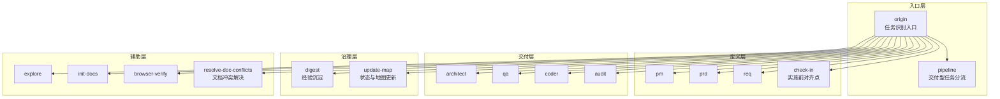
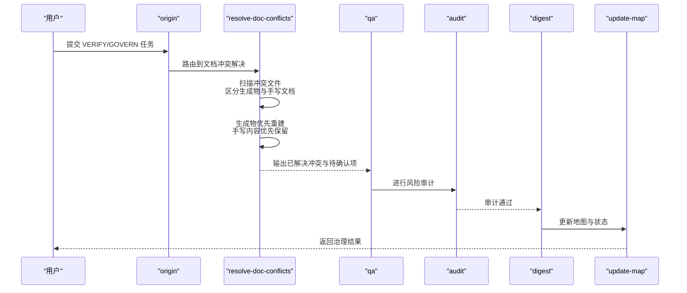
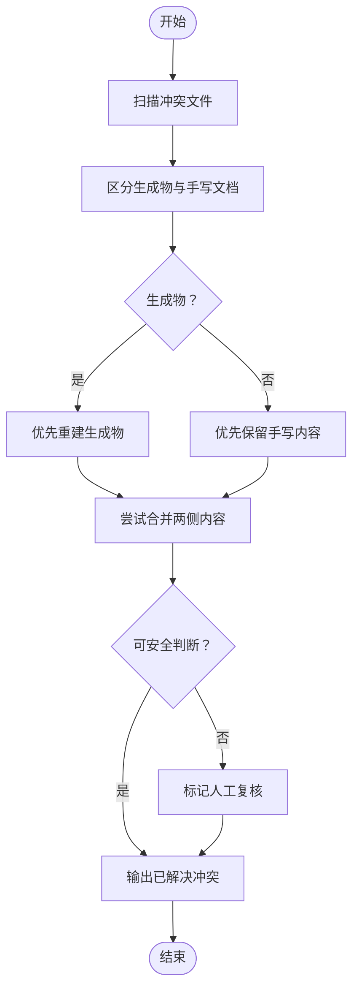
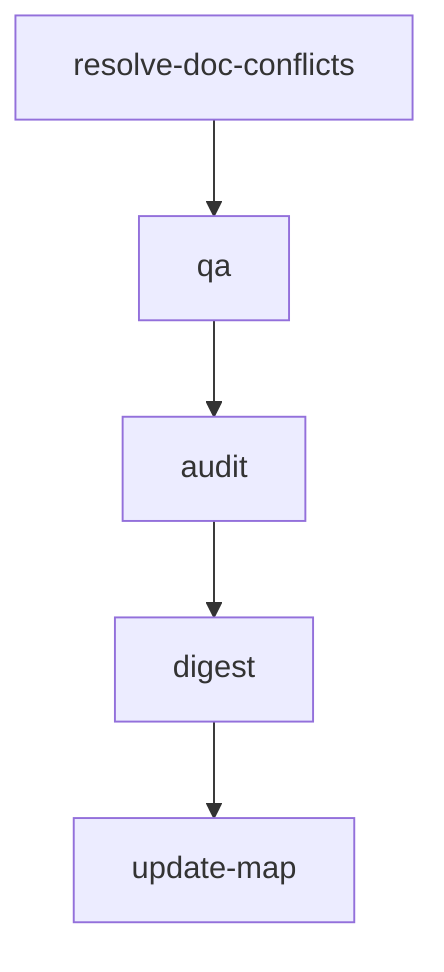

# 文档冲突解决技能 (Resolve-Doc-Conflicts)

<cite>
**本文引用的文件**
- [resolve-doc-conflicts/SKILL.md](file://skills/web3-ai-agent/resolve-doc-conflicts/SKILL.md)
- [SKILL.md](file://skills/web3-ai-agent/SKILL.md)
- [MAP-V3.md](file://skills/web3-ai-agent/MAP-V3.md)
- [SKILL-SYSTEM-DESIGN-V3.md](file://skills/web3-ai-agent/SKILL-SYSTEM-DESIGN-V3.md)
- [COMMANDS.md](file://skills/web3-ai-agent/COMMANDS.md)
- [update-map/SKILL.md](file://skills/web3-ai-agent/update-map/SKILL.md)
- [digest/SKILL.md](file://skills/web3-ai-agent/digest/SKILL.md)
- [audit/SKILL.md](file://skills/web3-ai-agent/audit/SKILL.md)
- [coder/SKILL.md](file://skills/web3-ai-agent/coder/SKILL.md)
- [architect/SKILL.md](file://skills/web3-ai-agent/architect/SKILL.md)
- [qa/SKILL.md](file://skills/web3-ai-agent/qa/SKILL.md)
</cite>

## 目录
1. [简介](#简介)
2. [项目结构](#项目结构)
3. [核心组件](#核心组件)
4. [架构总览](#架构总览)
5. [详细组件分析](#详细组件分析)
6. [依赖关系分析](#依赖关系分析)
7. [性能考量](#性能考量)
8. [故障排查指南](#故障排查指南)
9. [结论](#结论)
10. [附录](#附录)

## 简介
文档冲突解决技能（Resolve-Doc-Conflicts）是 Web3 AI Agent 技能体系中的辅助层技能之一，专注于处理文档层面的合并冲突与内容一致性问题。其核心目标是：
- 优先清理 docs 类冲突，避免将文档治理与代码修复混在一起
- 在多人协作场景中，快速识别并解决文档版本冲突
- 维护内容一致性，确保生成物与手写文档的合理取舍
- 在无法安全判断时，显式标记人工介入，保证最终质量

该技能在 VERIFY/GOVERN 任务中扮演重要角色，通常与 QA、Audit、Digest、Update-Map 等技能协同，形成完整的文档治理闭环。

## 项目结构
Web3 AI Agent 的技能系统采用分层设计，Resolve-Doc-Conflicts 位于“辅助层”，主要服务于只读探索、初始化、浏览器验证与文档治理等场景。其在整体技能地图中的位置如下：

图表来源
- [MAP-V3.md: 1-166:1-166](file://skills/web3-ai-agent/MAP-V3.md#L1-L166)
- [SKILL-SYSTEM-DESIGN-V3.md: 164-220:164-220](file://skills/web3-ai-agent/SKILL-SYSTEM-DESIGN-V3.md#L164-L220)

章节来源
- [MAP-V3.md: 1-166:1-166](file://skills/web3-ai-agent/MAP-V3.md#L1-L166)
- [SKILL-SYSTEM-DESIGN-V3.md: 164-220:164-220](file://skills/web3-ai-agent/SKILL-SYSTEM-DESIGN-V3.md#L164-L220)

## 核心组件
Resolve-Doc-Conflicts 技能的核心能力包括：
- 适用场景：文档合并冲突、索引或地图冲突、trace/审计/规划类文档冲突
- 输入：冲突中的文档文件
- 输出：已解决的文档冲突、需要人工复核的冲突点
- 流程：扫描冲突文件 → 区分生成物与手写文档 → 生成物优先重建 → 手写内容优先保留信息，不盲猜 → 输出待人工确认项
- 边界：不处理业务代码冲突；不假装理解模糊的语义冲突
- 规则：能保留两边内容时优先保留；无法安全判断时显式标记人工介入

章节来源
- [resolve-doc-conflicts/SKILL.md: 1-40:1-40](file://skills/web3-ai-agent/resolve-doc-conflicts/SKILL.md#L1-L40)

## 架构总览
在 VERIFY/GOVERN 任务中，Resolve-Doc-Conflicts 通常与 QA、Audit、Digest、Update-Map 等技能协同工作，形成文档治理闭环。其典型执行路径如下：

图表来源
- [MAP-V3.md: 152-157:152-157](file://skills/web3-ai-agent/MAP-V3.md#L152-L157)
- [SKILL-SYSTEM-DESIGN-V3.md: 593-601:593-601](file://skills/web3-ai-agent/SKILL-SYSTEM-DESIGN-V3.md#L593-L601)

章节来源
- [MAP-V3.md: 152-157:152-157](file://skills/web3-ai-agent/MAP-V3.md#L152-L157)
- [SKILL-SYSTEM-DESIGN-V3.md: 593-601:593-601](file://skills/web3-ai-agent/SKILL-SYSTEM-DESIGN-V3.md#L593-L601)

## 详细组件分析

### 适用场景与输入输出
- 适用场景
  - 文档合并冲突：多人并行编辑导致的冲突
  - 索引或地图冲突：文档索引、技能地图不一致
  - trace/审计/规划类文档冲突：审计轨迹、规划文档版本不一致
- 输入
  - 冲突中的文档文件
- 输出
  - 已解决的文档冲突
  - 需要人工复核的冲突点

章节来源
- [resolve-doc-conflicts/SKILL.md: 8-22:8-22](file://skills/web3-ai-agent/resolve-doc-conflicts/SKILL.md#L8-L22)

### 执行流程与决策逻辑
Resolve-Doc-Conflicts 的执行流程强调“生成物优先重建、手写内容优先保留”的原则，并在无法安全判断时显式标记人工介入。其流程如下：

图表来源
- [resolve-doc-conflicts/SKILL.md: 23-39:23-39](file://skills/web3-ai-agent/resolve-doc-conflicts/SKILL.md#L23-L39)

章节来源
- [resolve-doc-conflicts/SKILL.md: 23-39:23-39](file://skills/web3-ai-agent/resolve-doc-conflicts/SKILL.md#L23-L39)

### 与其他技能的衔接
在 VERIFY/GOVERN 任务中，Resolve-Doc-Conflicts 通常与以下技能衔接：
- 与 QA 协作：在文档冲突解决后，QA 对结果进行验证
- 与 Audit 协作：通过审计确保文档变更符合风险控制要求
- 与 Digest 协作：沉淀文档治理经验
- 与 Update-Map 协作：更新地图与状态，确保后续任务基于最新上下文推进

章节来源
- [MAP-V3.md: 152-157:152-157](file://skills/web3-ai-agent/MAP-V3.md#L152-L157)
- [SKILL-SYSTEM-DESIGN-V3.md: 593-601:593-601](file://skills/web3-ai-agent/SKILL-SYSTEM-DESIGN-V3.md#L593-L601)

### 使用示例
以下示例展示了在不同场景中如何使用 Resolve-Doc-Conflicts 技能：

- 场景一：文档合并冲突
  - 用户提交 VERIFY/GOVERN 任务，系统路由到 resolve-doc-conflicts
  - 技能扫描冲突文件，区分生成物与手写文档
  - 对生成物优先重建，对手写内容优先保留
  - 输出已解决冲突与待人工确认项，交由 QA/Audit 复核

- 场景二：索引或地图冲突
  - 用户发现技能地图与实际状态不一致
  - 使用 resolve-doc-conflicts 解决地图冲突
  - 与 update-map 协作更新地图状态，确保后续任务基于最新上下文

- 场景三：trace/审计/规划类文档冲突
  - 用户发现审计轨迹与规划文档不一致
  - 使用 resolve-doc-conflicts 解决冲突
  - 与 audit 协作确保变更符合风险控制要求

章节来源
- [MAP-V3.md: 152-157:152-157](file://skills/web3-ai-agent/MAP-V3.md#L152-L157)
- [SKILL-SYSTEM-DESIGN-V3.md: 668-674:668-674](file://skills/web3-ai-agent/SKILL-SYSTEM-DESIGN-V3.md#L668-L674)

### 与文档管理系统和版本控制工具的集成
- Git 合并冲突处理
  - 在 Git 合并冲突中，Resolve-Doc-Conflicts 可以帮助识别并解决 docs 类冲突
  - 对于生成物（如自动生成的文档），优先重建；对手写文档，优先保留信息
  - 无法安全判断时，显式标记人工介入
- 文档索引与地图更新
  - 与 update-map 协作，确保索引与地图保持最新
  - 通过 digest 沉淀经验，避免重复冲突
- 审计与风险控制
  - 与 audit 协作，确保文档变更符合风险控制要求
  - 对高风险场景（如资金、权限、可信度）进行重点审查

章节来源
- [update-map/SKILL.md: 12-32:12-32](file://skills/web3-ai-agent/update-map/SKILL.md#L12-L32)
- [digest/SKILL.md: 12-35:12-35](file://skills/web3-ai-agent/digest/SKILL.md#L12-L35)
- [audit/SKILL.md: 34-68:34-68](file://skills/web3-ai-agent/audit/SKILL.md#L34-L68)

## 依赖关系分析
Resolve-Doc-Conflicts 在技能体系中的依赖关系如下：

图表来源
- [MAP-V3.md: 152-157:152-157](file://skills/web3-ai-agent/MAP-V3.md#L152-L157)
- [SKILL-SYSTEM-DESIGN-V3.md: 593-601:593-601](file://skills/web3-ai-agent/SKILL-SYSTEM-DESIGN-V3.md#L593-L601)

章节来源
- [MAP-V3.md: 152-157:152-157](file://skills/web3-ai-agent/MAP-V3.md#L152-L157)
- [SKILL-SYSTEM-DESIGN-V3.md: 593-601:593-601](file://skills/web3-ai-agent/SKILL-SYSTEM-DESIGN-V3.md#L593-L601)

## 性能考量
- 生成物优先重建：对可自动重建的生成物进行重建，减少人工干预成本
- 手写内容优先保留：避免对人类智慧与上下文的理解进行盲猜，提高准确性
- 人工介入标记：在无法安全判断时显式标记，避免错误合并导致的二次冲突
- 与治理层协作：通过 digest 与 update-map 的协作，减少重复冲突的发生

## 故障排查指南
- 无法安全判断的冲突
  - 现象：系统无法确定如何合并两侧内容
  - 处理：显式标记人工复核，避免错误合并
- 生成物与手写文档混淆
  - 现象：难以区分哪些是生成物，哪些是手写文档
  - 处理：通过文件命名规范、元数据标注等方式明确区分
- 审计与风险控制
  - 现象：文档变更可能引入安全或合规风险
  - 处理：与 audit 协作，确保变更符合风险控制要求
- 地图与索引不一致
  - 现象：技能地图与实际状态不一致
  - 处理：与 update-map 协作，及时更新地图状态

章节来源
- [resolve-doc-conflicts/SKILL.md: 31-39:31-39](file://skills/web3-ai-agent/resolve-doc-conflicts/SKILL.md#L31-L39)
- [audit/SKILL.md: 70-77:70-77](file://skills/web3-ai-agent/audit/SKILL.md#L70-L77)
- [update-map/SKILL.md: 34-37:34-37](file://skills/web3-ai-agent/update-map/SKILL.md#L34-L37)

## 结论
Resolve-Doc-Conflicts 技能在 Web3 AI Agent 技能体系中扮演着文档治理的关键角色，通过“生成物优先重建、手写内容优先保留”的原则，有效解决了多人协作中的文档冲突问题。其与 QA、Audit、Digest、Update-Map 的紧密协作，形成了完整的文档治理闭环，确保文档的一致性与可维护性。在实际应用中，建议结合版本控制工具与文档管理系统，建立规范的冲突处理流程，提升团队协作效率与质量。

## 附录
- 斜杠命令约定
  - 推荐使用 /resolve-doc-conflicts 命令直接调用该技能
  - 也可通过 /origin 进入主入口，由系统自动路由到该技能

章节来源
- [COMMANDS.md: 48-49:48-49](file://skills/web3-ai-agent/COMMANDS.md#L48-L49)
- [SKILL.md: 222-222:222-222](file://skills/web3-ai-agent/SKILL.md#L222-L222)