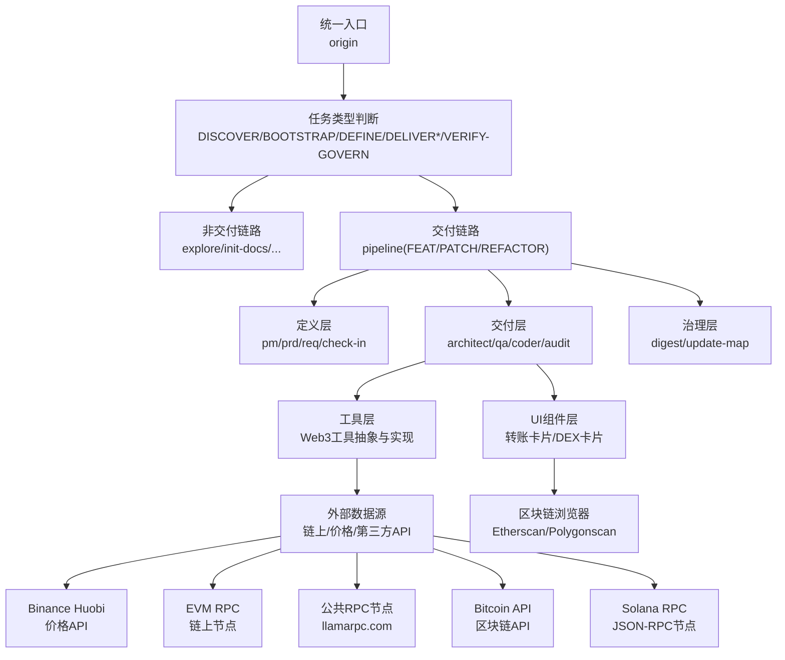
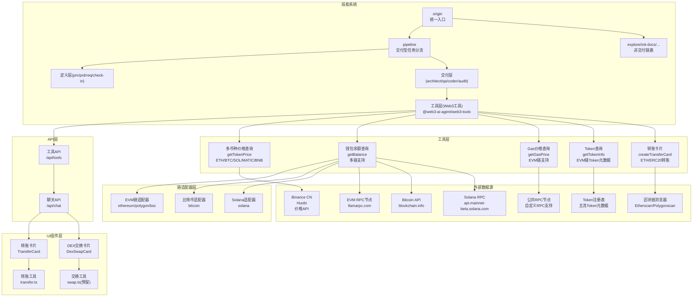
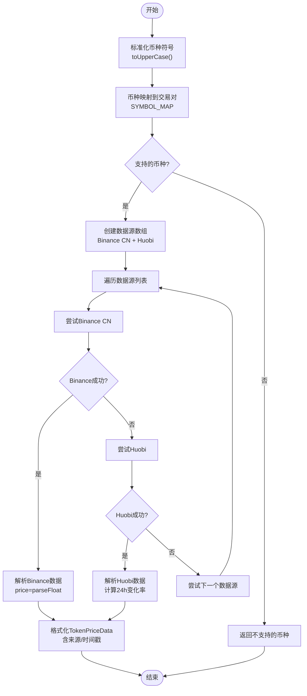
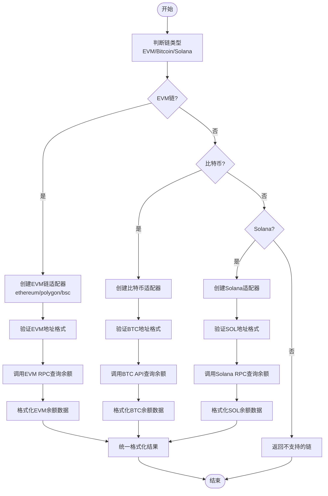
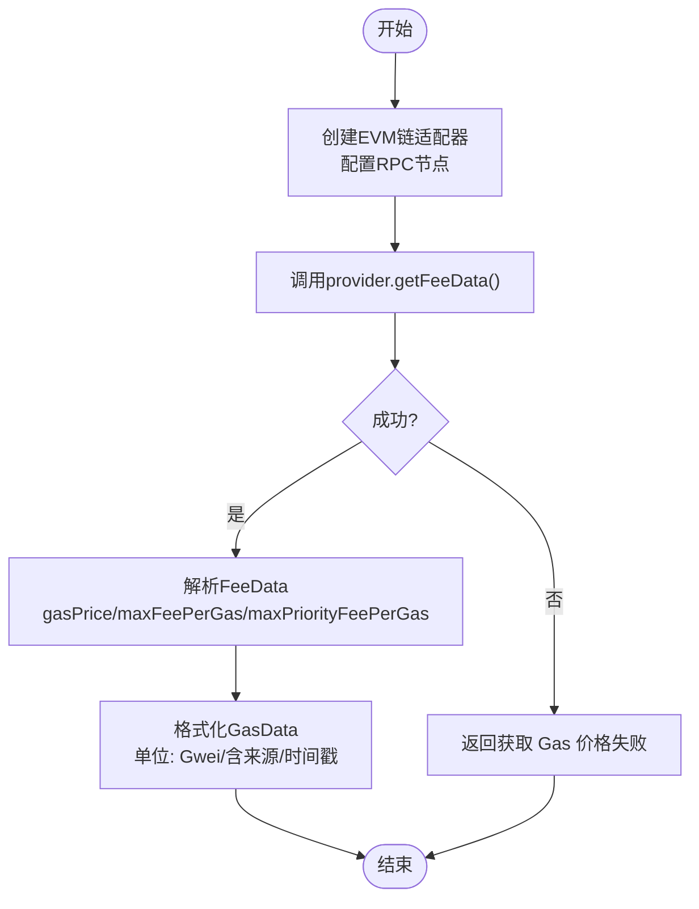
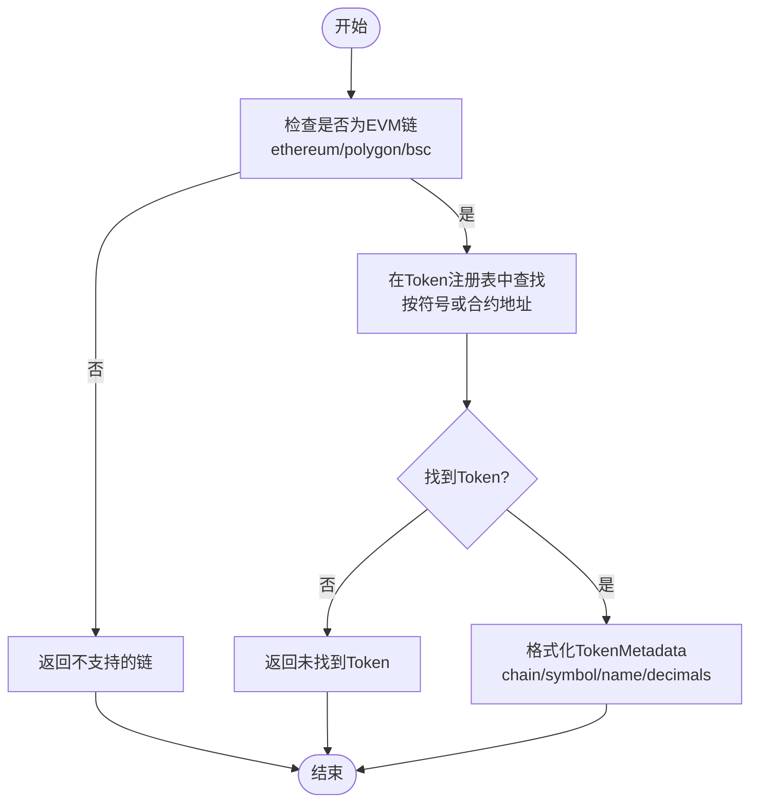
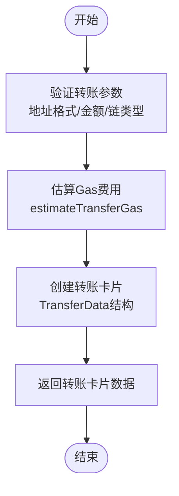
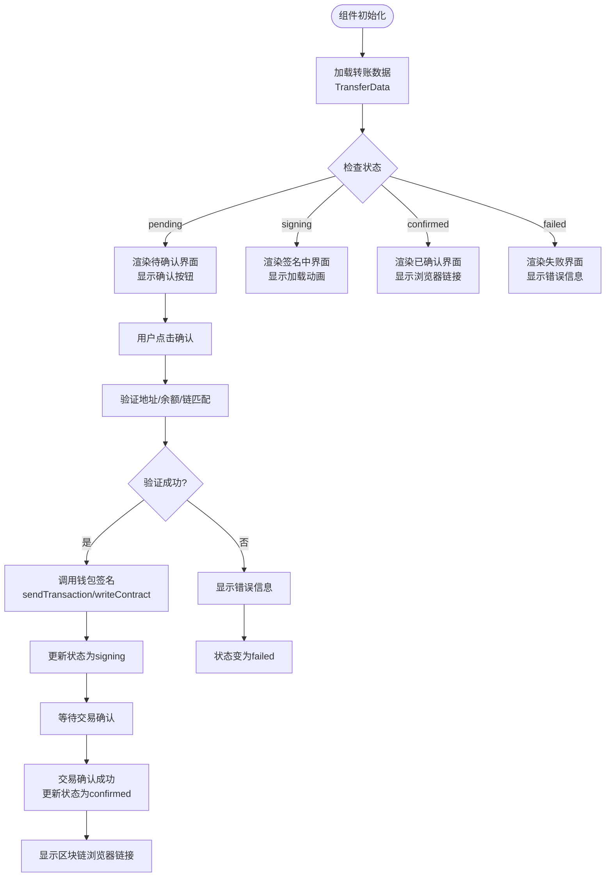

# Web3工具集成

<cite>
**本文引用的文件**
- [Web3-AI-Agent-PRD-MVP.md](file://docs/Web3-AI-Agent-PRD-MVP.md)
- [Web3-AI-Agent-项目里程碑-Checklist.md](file://docs/Web3-AI-Agent-项目里程碑-Checklist.md)
- [WEB3-AI-AGENT-使用教程-V1.md](file://docs/WEB3-AI-AGENT-使用教程-V1.md)
- [ARCHITECTURE.md](file://ARCHITECTURE.md)
- [packages/web3-tools/src/index.ts](file://packages/web3-tools/src/index.ts)
- [packages/web3-tools/src/types.ts](file://packages/web3-tools/src/types.ts)
- [packages/web3-tools/src/price.ts](file://packages/web3-tools/src/price.ts)
- [packages/web3-tools/src/balance.ts](file://packages/web3-tools/src/balance.ts)
- [packages/web3-tools/src/gas.ts](file://packages/web3-tools/src/gas.ts)
- [packages/web3-tools/src/token.ts](file://packages/web3-tools/src/token.ts)
- [packages/web3-tools/src/transfer.ts](file://packages/web3-tools/src/transfer.ts)
- [packages/web3-tools/src/tokens/index.ts](file://packages/web3-tools/src/tokens/index.ts)
- [packages/web3-tools/src/tokens/registry.ts](file://packages/web3-tools/src/tokens/registry.ts)
- [packages/web3-tools/src/chains/index.ts](file://packages/web3-tools/src/chains/index.ts)
- [packages/web3-tools/src/chains/config.ts](file://packages/web3-tools/src/chains/config.ts)
- [packages/web3-tools/src/chains/evm-adapter.ts](file://packages/web3-tools/src/chains/evm-adapter.ts)
- [packages/web3-tools/src/chains/bitcoin.ts](file://packages/web3-tools/src/chains/bitcoin.ts)
- [packages/web3-tools/src/chains/solana.ts](file://packages/web3-tools/src/chains/solana.ts)
- [packages/web3-tools/package.json](file://packages/web3-tools/package.json)
- [apps/web/app/api/tools/route.ts](file://apps/web/app/api/tools/route.ts)
- [apps/web/app/api/chat/route.ts](file://apps/web/app/api/chat/route.ts)
- [apps/web/app/page.tsx](file://apps/web/app/page.tsx)
- [apps/web/components/cards/TransferCard.tsx](file://apps/web/components/cards/TransferCard.tsx)
- [apps/web/components/cards/DexSwapCard.tsx](file://apps/web/components/cards/DexSwapCard.tsx)
- [apps/web/components/cards/index.ts](file://apps/web/components/cards/index.ts)
- [apps/web/lib/supabase/transfers.ts](file://apps/web/lib/supabase/transfers.ts)
- [apps/web/lib/tokens.ts](file://apps/web/lib/tokens.ts)
- [apps/web/types/transfer.ts](file://apps/web/types/transfer.ts)
- [supabase/migrations/create_transfer_cards.sql](file://supabase/migrations/create_transfer_cards.sql)
- [docs/changelog/2026-04-20-feat-web3-tools-refactor.md](file://docs/changelog/2026-04-20-feat-web3-tools-refactor.md)
- [docs/changelog/2026-04-22-feat-multichain-web3-tools.md](file://docs/changelog/2026-04-22-feat-multichain-web3-tools.md)
- [docs/changelog/2026-04-24-feat-web3-transfer-card.md](file://docs/changelog/2026-04-24-feat-web3-transfer-card.md)
- [apps/web/vitest.config.ts](file://apps/web/vitest.config.ts)
- [packages/web3-tools/vitest.config.ts](file://packages/web3-tools/vitest.config.ts)
- [vitest.workspace.ts](file://vitest.workspace.ts)
- [apps/web/test-setup.tsx](file://apps/web/test-setup.tsx)
- [apps/web/components/ChatInput.test.tsx](file://apps/web/components/ChatInput.test.tsx)
- [apps/web/app/api/tools/route.test.ts](file://apps/web/app/api/tools/route.test.ts)
- [apps/web/lib/supabase/client.test.ts](file://apps/web/lib/supabase/client.test.ts)
- [apps/web/lib/memory/SlidingWindowMemory.test.ts](file://apps/web/lib/memory/SlidingWindowMemory.test.ts)
- [packages/ai-config/src/__tests__/config.test.ts](file://packages/ai-config/src/__tests__/config.test.ts)
- [docs/changelog/2026-04-28-feat-unit-test-coverage.md](file://docs/changelog/2026-04-28-feat-unit-test-coverage.md)
- [docs/test-report.md](file://docs/test-report.md)
</cite>

## 更新摘要
**变更内容**
- 测试框架现代化：从 jsdom 迁移到 happy-dom 作为主要 DOM 测试环境
- 改进测试基础设施：统一使用 Vitest v3.2.4，支持 monorepo workspace
- 优化测试性能：happy-dom 提供更快的 DOM 模拟和更好的 Node.js 兼容性
- 完善测试配置：apps/web 使用 happy-dom 环境，packages 使用 node 环境
- 增强测试稳定性：改进 mock 策略和测试设置文件

## 目录
1. [简介](#简介)
2. [项目结构](#项目结构)
3. [核心组件](#核心组件)
4. [架构总览](#架构总览)
5. [详细组件分析](#详细组件分析)
6. [API接口文档](#api接口文档)
7. [测试框架现代化](#测试框架现代化)
8. [依赖分析](#依赖分析)
9. [性能考虑](#性能考虑)
10. [故障排查指南](#故障排查指南)
11. [结论](#结论)
12. [附录](#附录)

## 简介
本文件面向Web3开发者，系统化阐述AI-Agent项目的Web3工具集成方案。项目已从概念设计升级为完整实现，包含多币种价格查询、钱包余额查询、Gas价格查询、Token查询、转账卡片工具等核心功能，以及完整的工具抽象层设计。围绕"工具抽象层、工具调用接口、数据格式化与错误处理策略"，结合MVP阶段的五大核心工具进行设计与实现指导；并提供扩展机制、API接口文档、性能优化与故障恢复建议，帮助团队在可控风险边界内构建可演进的Web3数据服务能力。

**更新** 项目现已重构为多链架构支持，统一使用getTokenPrice工具支持ETH、BTC、SOL、MATIC、BNB等多种加密货币的价格查询，替代了原有的独立ETH和BTC价格查询工具，增强了Web3工具包的功能完整性和统一性。新增转账卡片工具，支持ETH原生转账和ERC20 Token转账，提供完整的转账生命周期管理。新增DEX交换工具卡片预留，为后续DEX Swap功能实现奠定基础。新增Token查询工具，支持EVM链Token元数据查询，包括合约地址、精度、Logo等信息。新增多链架构支持，包括EVM链适配器、比特币适配器、Solana适配器，以及统一的链配置管理。

**更新** 测试框架已完成现代化升级，从 jsdom 迁移到 happy-dom 作为主要 DOM 测试环境，显著提升测试性能和稳定性。统一使用 Vitest v3.2.4，支持 monorepo workspace，优化了测试配置和 mock 策略。

## 项目结构
该项目采用"技能系统（Skill System）+ 工具层 + API层 + UI组件层"的分层组织方式，现已升级为monorepo架构：
- 技能系统：通过统一入口路由不同任务类型，按需进入定义、交付、治理等子链路。
- 工具层：封装Web3数据获取逻辑，提供标准化接口与错误处理策略，确保Agent在调用工具前后能获得一致、可解释的结果。
- API层：提供RESTful接口，支持前端调用和工具调用。
- UI组件层：提供转账卡片、DEX交换卡片等可视化组件，增强用户体验。



**图表来源**
- [skills/x-ray/SKILL.md:1-224](file://skills/x-ray/SKILL.md#L1-L224)
- [skills/x-ray/SKILL-SYSTEM-DESIGN-V3.md:1-719](file://skills/x-ray/SKILL-SYSTEM-DESIGN-V3.md#L1-L719)
- [skills/x-ray/MAP-V3.md:1-211](file://skills/x-ray/MAP-V3.md#L1-L211)

**章节来源**
- [skills/x-ray/SKILL.md:1-224](file://skills/x-ray/SKILL.md#L1-L224)
- [skills/x-ray/SKILL-SYSTEM-DESIGN-V3.md:1-719](file://skills/x-ray/SKILL-SYSTEM-DESIGN-V3.md#L1-L719)
- [skills/x-ray/MAP-V3.md:1-211](file://skills/x-ray/MAP-V3.md#L1-L211)

## 核心组件
- 工具抽象层
  - 设计理念：将Web3数据查询抽象为标准化工具，统一输入/输出契约、错误处理与降级策略，保证Agent在不同数据源间平滑切换。
  - 关键属性：工具名称、输入参数、输出结构、错误码、降级策略、数据来源标识。
- 多链架构支持
  - EVM链适配器：支持以太坊、Polygon、BNB Smart Chain等EVM兼容链
  - 非EVM链适配器：支持比特币和Solana等非EVM链
  - 统一链配置管理：提供链配置注册表和链ID类型定义
- 五大核心工具
  - 多币种价格查询：统一使用getTokenPrice工具，支持ETH、BTC、SOL、MATIC、BNB等多种加密货币，内置代理支持和10秒超时处理，返回价格与24小时变化率。
  - 钱包余额查询：支持EVM兼容链（以太坊、Polygon、BNB链）、比特币、Solana，校验钱包地址合法性，查询链上余额并标注数据来源。
  - Gas价格查询：检查网络可用性，返回当前Gas价格（基础/优先级/乐观），支持自定义RPC节点。
  - Token查询工具：查询EVM链Token元数据信息，包括合约地址、精度、Logo等，支持符号和合约地址两种查询方式。
  - 转账卡片工具：生成转账卡片数据，支持ETH原生转账和ERC20 Token转账，提供完整的转账生命周期管理。
- 错误处理与降级
  - 参数无效、外部API超时、网络不可用、工具失败等场景均需返回可理解的失败说明与保守建议，避免伪造数据。

**更新** 新增多链架构支持，包括EVM链适配器、比特币适配器、Solana适配器，以及统一的链配置管理。新增转账卡片工具，支持ETH原生转账和ERC20 Token转账，提供完整的转账生命周期管理。新增DEX交换工具卡片预留，为后续DEX Swap功能实现奠定基础。新增转账工具函数，支持Gas估算和地址验证。新增转账卡片组件，支持实时状态跟踪和区块链浏览器链接。

**章节来源**
- [Web3-AI-Agent-PRD-MVP.md:84-156](file://docs/Web3-AI-Agent-PRD-MVP.md#L84-L156)
- [Web3-AI-Agent-PRD-MVP.md:174-197](file://docs/Web3-AI-Agent-PRD-MVP.md#L174-L197)

## 架构总览
Web3工具集成的总体架构由"技能系统路由 + 工具层 + API层 + UI组件层 + 外部数据源"五层组成。技能系统负责任务识别与流程编排，工具层负责数据获取与结果格式化，API层提供统一接口，UI组件层提供可视化交互，外部数据源包括链上节点、价格API与第三方Web3数据提供商。

**更新** 架构已重构为monorepo模式，工具实现位于packages/web3-tools/src/目录，通过包导入方式直接调用，提升性能和可维护性。现已集成多币种价格查询系统，统一使用getTokenPrice工具支持ETH、BTC、SOL、MATIC、BNB等多种加密货币的价格查询。新增转账卡片工具，支持ETH原生转账和ERC20 Token转账，提供完整的转账生命周期管理。新增DEX交换工具卡片预留，支持后续DEX Swap功能实现。新增Token查询工具，支持EVM链Token元数据查询。新增多链架构支持，包括EVM链适配器、比特币适配器、Solana适配器。



**图表来源**
- [apps/web/app/api/tools/route.ts:1-58](file://apps/web/app/api/tools/route.ts#L1-L58)
- [apps/web/app/api/chat/route.ts:1-219](file://apps/web/app/api/chat/route.ts#L1-L219)
- [packages/web3-tools/src/index.ts:1-10](file://packages/web3-tools/src/index.ts#L1-L10)

## 详细组件分析

### 工具抽象层设计
- 输入/输出契约
  - 输入：工具名称、参数集合（如币种符号、钱包地址、链ID、超时阈值）
  - 输出：结构化结果（含success标志、data、error、timestamp、source）
- 错误处理策略
  - 参数校验失败：返回"参数无效"及可选建议
  - 外部API超时/异常：返回"数据获取失败"并附带降级提示
  - 网络不可用：返回"网络不可用"并建议稍后重试
- 降级与容错
  - 多源备份：同一工具可配置多个数据源，失败时自动切换
  - 缓存命中：优先返回缓存结果，设置TTL与失效策略
  - 保守回复：失败时不输出虚构数据，明确标注"数据来源未知"

**更新** 新增多链架构支持，统一使用ChainId类型定义，支持EVM链和非EVM链的统一接口调用。

**章节来源**
- [Web3-AI-Agent-PRD-MVP.md:174-197](file://docs/Web3-AI-Agent-PRD-MVP.md#L174-L197)

### 多币种价格查询工具
- 数据获取机制
  - 使用统一的getTokenPrice工具，支持ETH、BTC、SOL、MATIC、BNB等多种加密货币
  - 使用多数据源容错机制，支持Binance CN和Huobi价格API
  - 内置代理支持，支持HTTPS_PROXY和HTTP_PROXY环境变量
  - 10秒超时限制，确保响应及时性
  - 返回价格数值、24小时变化百分比、货币单位和币种标识
- 数据格式化
  - 数值保留合理精度，单位统一为USD
  - 结果中明确标注"数据来自Binance/Huobi"
  - 统一的TokenPriceData数据结构，包含symbol、price、change24h、currency字段
- 错误处理
  - 不支持的币种：返回"不支持的币种"及支持列表
  - API不可达：返回"无法获取 [币种] 价格，所有数据源均失败"
  - 解析失败：返回"数据解析异常，无法生成价格结果"



**图表来源**
- [packages/web3-tools/src/price.ts:30-110](file://packages/web3-tools/src/price.ts#L30-L110)

**章节来源**
- [packages/web3-tools/src/price.ts:25-125](file://packages/web3-tools/src/price.ts#L25-L125)

### 多链钱包余额查询工具
- 多链支持架构
  - EVM链适配器：支持以太坊、Polygon、BNB Smart Chain，使用ethers.js进行链上查询
  - 比特币适配器：支持BTC余额查询，使用区块链API进行查询
  - Solana适配器：支持SOL余额查询，使用JSON-RPC API进行查询
  - 统一链配置管理：通过CHAIN_CONFIGS注册表管理各链配置
- 地址验证与余额获取流程
  - 根据链类型选择对应的适配器
  - EVM链：使用ethers.isAddress验证地址格式
  - 比特币：使用Base58和Bech32正则表达式验证地址
  - Solana：使用Base58编码验证地址格式
  - 各链独立的RPC节点配置和查询逻辑
- 数据格式化
  - 统一的BalanceData结构，包含chain、address、balance、unit、decimals字段
  - 各链原生代币单位和精度标准化
  - 明确标注数据来源（链上查询）



**图表来源**
- [packages/web3-tools/src/balance.ts:10-38](file://packages/web3-tools/src/balance.ts#L10-L38)
- [packages/web3-tools/src/chains/evm-adapter.ts:26-62](file://packages/web3-tools/src/chains/evm-adapter.ts#L26-L62)
- [packages/web3-tools/src/chains/bitcoin.ts:30-68](file://packages/web3-tools/src/chains/bitcoin.ts#L30-L68)
- [packages/web3-tools/src/chains/solana.ts:33-71](file://packages/web3-tools/src/chains/solana.ts#L33-L71)

**章节来源**
- [packages/web3-tools/src/balance.ts:1-56](file://packages/web3-tools/src/balance.ts#L1-L56)
- [packages/web3-tools/src/chains/evm-adapter.ts:1-112](file://packages/web3-tools/src/chains/evm-adapter.ts#L1-L112)
- [packages/web3-tools/src/chains/bitcoin.ts:1-125](file://packages/web3-tools/src/chains/bitcoin.ts#L1-L125)
- [packages/web3-tools/src/chains/solana.ts:1-119](file://packages/web3-tools/src/chains/solana.ts#L1-L119)

### Gas价格查询工具
- 网络状态检查与降级策略
  - EVM链适配器：支持默认公共RPC节点（eth.llamarpc.com）和自定义RPC
  - Fee数据获取：调用provider.getFeeData()获取Gas价格信息
  - 可用：返回当前Gas价格（基础/优先级/乐观），单位为Gwei
  - 不可用：返回"获取 Gas 价格失败"
- 数据格式化
  - 统一的GasData结构，包含chain、gasPrice、maxFeePerGas、maxPriorityFeePerGas、unit字段
  - 标注来源与时间
- 错误处理
  - 超时：返回"获取 Gas 价格失败"
  - 解析失败：返回"获取 Gas 价格失败"



**图表来源**
- [packages/web3-tools/src/gas.ts:9-15](file://packages/web3-tools/src/gas.ts#L9-L15)
- [packages/web3-tools/src/chains/evm-adapter.ts:68-97](file://packages/web3-tools/src/chains/evm-adapter.ts#L68-L97)

**章节来源**
- [packages/web3-tools/src/gas.ts:1-23](file://packages/web3-tools/src/gas.ts#L1-L23)
- [packages/web3-tools/src/chains/evm-adapter.ts:64-97](file://packages/web3-tools/src/chains/evm-adapter.ts#L64-L97)

### Token查询工具
- 功能概述
  - 查询EVM链Token元数据信息，包括合约地址、精度、Logo等
  - 支持通过Token符号或合约地址进行查询
  - 仅支持EVM兼容链（以太坊、Polygon、BNB Smart Chain）
- Token注册表管理
  - 内置主流Token注册表，包含USDT、USDC、DAI、WETH、UNI等
  - 支持按链分类存储Token信息
  - 提供符号和合约地址两种查询方式
- 查询流程
  - 验证链类型是否为EVM链
  - 在Token注册表中查找匹配的Token
  - 返回完整的Token元数据信息
- 数据格式化
  - 统一的TokenMetadata结构，包含chain、symbol、name、decimals、contractAddress、logoUri字段
  - 标注数据来源（Token Registry）
  - 明确标注查询时间和来源



**图表来源**
- [packages/web3-tools/src/token.ts:10-57](file://packages/web3-tools/src/token.ts#L10-L57)
- [packages/web3-tools/src/tokens/registry.ts:110-135](file://packages/web3-tools/src/tokens/registry.ts#L110-L135)

**章节来源**
- [packages/web3-tools/src/token.ts:1-65](file://packages/web3-tools/src/token.ts#L1-L65)
- [packages/web3-tools/src/tokens/registry.ts:1-145](file://packages/web3-tools/src/tokens/registry.ts#L1-L145)

### 转账卡片工具
- 功能概述
  - 生成转账卡片数据，支持ETH原生转账和ERC20 Token转账
  - 提供完整的转账生命周期管理，包括状态跟踪和错误处理
  - 支持多链转账，包括以太坊、Polygon、BNB Smart Chain
- 转账工具函数
  - estimateTransferGas：估算转账所需的Gas费用
  - validateAddress：验证钱包地址格式
  - getExplorerUrl：获取区块链浏览器链接
- 数据格式化
  - 统一的TransferData结构，包含from、to、tokenSymbol、amount、chain、status等字段
  - 支持原生币和ERC20 Token转账
  - 标注数据来源和时间戳



**图表来源**
- [packages/web3-tools/src/transfer.ts:14-99](file://packages/web3-tools/src/transfer.ts#L14-L99)

**章节来源**
- [packages/web3-tools/src/transfer.ts:1-99](file://packages/web3-tools/src/transfer.ts#L1-L99)

### 转账卡片组件
- 组件功能
  - 渲染转账卡片UI，支持实时状态跟踪
  - 处理用户交互，包括确认转账、查看交易、重试操作
  - 集成钱包连接和交易签名功能
- 状态管理
  - pending：待确认状态，显示确认按钮
  - signing：签名中状态，显示加载动画
  - confirmed：已确认状态，显示区块链浏览器链接
  - failed：失败状态，显示错误信息和重试按钮
- 链接配置
  - 支持多链浏览器链接，包括Etherscan、Polygonscan、BscScan
  - 根据链类型动态生成浏览器URL



**图表来源**
- [apps/web/components/cards/TransferCard.tsx:77-441](file://apps/web/components/cards/TransferCard.tsx#L77-L441)

**章节来源**
- [apps/web/components/cards/TransferCard.tsx:1-441](file://apps/web/components/cards/TransferCard.tsx#L1-L441)

### DEX交换卡片
- 功能概述
  - DEX交换卡片预留，为后续DEX Swap功能实现提供基础
  - 支持从Token、ToToken、金额等参数配置
  - 提供用户友好的界面占位符
- 开发状态
  - 当前为预留状态，TODO标记后续实现
  - 提供基本的UI框架和类型定义
  - 支持slippage参数配置

**章节来源**
- [apps/web/components/cards/DexSwapCard.tsx:1-33](file://apps/web/components/cards/DexSwapCard.tsx#L1-L33)

### 链配置管理系统
- 统一链配置架构
  - EvmChainConfig：定义EVM链配置，包含id、name、nativeToken、chainId、rpcUrls、explorerUrl
  - NonEvmChainConfig：定义非EVM链配置，包含id、name、nativeToken、apiUrls、explorerUrl
  - ChainConfig联合类型：支持EVM和非EVM链配置
- 链配置注册表
  - CHAIN_CONFIGS：注册默认链配置（以太坊、Polygon、BNB Smart Chain）
  - getChainConfig：根据链ID获取链配置
  - getRpcUrl：获取链的RPC URL（支持自定义RPC）
- 多链适配器模式
  - EvmChainAdapter：EVM链统一适配器
  - BitcoinAdapter：比特币链适配器
  - SolanaAdapter：Solana链适配器
  - 统一的工具调用接口

**更新** 新增链配置管理系统，提供统一的链配置管理和多链适配器支持。

**章节来源**
- [packages/web3-tools/src/types.ts:23-52](file://packages/web3-tools/src/types.ts#L23-L52)
- [packages/web3-tools/src/chains/config.ts:1-81](file://packages/web3-tools/src/chains/config.ts#L1-L81)
- [packages/web3-tools/src/chains/index.ts:1-7](file://packages/web3-tools/src/chains/index.ts#L1-L7)

### 工具系统的扩展机制
- 第三方Web3数据源集成
  - 注册新工具：定义工具名称、输入/输出契约、错误码与降级策略
  - 配置数据源：支持多源并行与故障转移
  - 结果归一化：统一字段与单位，确保Agent侧无需感知底层差异
- 多币种扩展流程
  - 在SYMBOL_MAP中添加新的币种映射
  - 在TokenPriceData中定义相应的币种支持
  - 编写测试用例与异常路径验证
- 多链扩展流程
  - 在CHAIN_CONFIGS中添加新的链配置
  - 创建对应的链适配器类
  - 在balance工具中添加链类型判断
  - 编写测试用例与异常路径验证
- Token扩展流程
  - 在TOKEN_REGISTRY中添加新的Token条目
  - 定义Token符号、合约地址、精度等元数据
  - 编写测试用例与异常路径验证
- 转账工具扩展流程
  - 在transfer.ts中添加新的转账功能
  - 在TransferCard组件中集成新功能
  - 更新数据库表结构和CRUD操作
  - 编写测试用例与异常路径验证
- 集成流程
  - 在工具层新增适配器，实现统一接口
  - 在技能系统中注册工具，确保Agent可调用
  - 编写测试用例与异常路径验证

**更新** 新增多链扩展机制，支持在CHAIN_CONFIGS中添加新的链配置，创建对应的链适配器类，统一使用ChainId类型定义。新增Token扩展流程，在TOKEN_REGISTRY中添加新的Token条目。新增转账工具扩展流程，支持新的转账功能和UI组件。

**章节来源**
- [Web3-AI-Agent-PRD-MVP.md:143-156](file://docs/Web3-AI-Agent-PRD-MVP.md#L143-L156)

## API接口文档

### 工具API端点
- 端点：POST /api/tools
- 功能：统一的Web3工具调用接口，支持多链和多代币功能

#### 支持的工具列表

**getTokenPrice - 多币种价格查询**
- 请求体：`{ "name": "getTokenPrice", "arguments": { "symbol": "ETH" } }`
- 支持币种：ETH、BTC、SOL、MATIC、BNB
- 成功响应：包含symbol、price、change24h、currency字段
- 失败响应：包含error字段

**getBalance - 多链余额查询**
- 请求体：`{ "name": "getBalance", "arguments": { "chain": "ethereum", "address": "0x..." } }`
- 支持链：ethereum、polygon、bsc、bitcoin、solana
- 成功响应：包含chain、address、balance、unit、decimals字段
- 失败响应：包含error字段

**getGasPrice - Gas价格查询**
- 请求体：`{ "name": "getGasPrice", "arguments": { "chain": "ethereum" } }`
- 支持链：ethereum、polygon、bsc
- 成功响应：包含gasPrice、maxFeePerGas、maxPriorityFeePerGas、unit字段
- 失败响应：包含error字段

**getTokenInfo - Token元数据查询**
- 请求体：`{ "name": "getTokenInfo", "arguments": { "chain": "ethereum", "symbol": "USDT" } }`
- 支持链：ethereum、polygon、bsc
- 成功响应：包含chain、symbol、name、decimals、contractAddress、logoUri字段
- 失败响应：包含error字段

**createTransferCard - 转账卡片创建**
- 请求体：`{ "name": "createTransferCard", "arguments": { "to": "0x...", "tokenSymbol": "ETH", "amount": "1", "chain": "ethereum" } }`
- 支持链：ethereum、polygon、bsc
- 成功响应：包含transferData字段，包含from、to、tokenSymbol、amount、chain、status等
- 失败响应：包含error字段

#### 向后兼容工具
系统保留以下向后兼容的工具调用方式：

**getETHPrice** - ETH价格查询
- 请求体：`{ "name": "getETHPrice" }`

**getBTCPrice** - BTC价格查询
- 请求体：`{ "name": "getBTCPrice" }`

**getWalletBalance** - 以太坊钱包余额查询
- 请求体：`{ "name": "getWalletBalance", "arguments": { "address": "0x..." } }`

**章节来源**
- [apps/web/app/api/tools/route.ts:1-58](file://apps/web/app/api/tools/route.ts#L1-L58)

### 聊天API端点
- 端点：POST /api/chat
- 功能：AI Agent聊天接口，支持工具调用和多链数据查询

#### 工具定义
- getTokenPrice：获取指定加密货币的当前价格（美元）
- getBalance：查询指定链上钱包地址的余额
- getGasPrice：获取指定EVM链的当前Gas价格
- getTokenInfo：查询Token的元数据信息
- createTransferCard：生成转账卡片数据，支持ETH原生转账和ERC20 Token转账

#### 系统提示
- 基础能力：查询多种加密货币价格、多条链上钱包余额、EVM链Gas价格、Token元数据、转账卡片生成
- 转账场景识别：支持"转X个Token给地址"、"发送X ETH/USDT到地址"等转账意图识别
- 安全边界：明确标注数据来源，提醒用户确认地址和金额，告知"此操作不可逆"

**章节来源**
- [apps/web/app/api/chat/route.ts:77-219](file://apps/web/app/api/chat/route.ts#L77-L219)

## 测试框架现代化

### 测试环境升级
项目已完成从 jsdom 到 happy-dom 的测试环境迁移，显著提升测试性能和稳定性：

**测试框架版本**
- Vitest v3.2.4：现代化测试框架，支持 TypeScript 和 JSX
- happy-dom 20.9.0：快速 DOM 模拟，支持 Node.js 20+
- Monorepo workspace：统一管理多个测试配置

**环境配置差异**
- apps/web：使用 happy-dom 环境，支持 DOM API 和浏览器特性
- packages/ai-config：使用 node 环境，适合纯 Node.js 测试
- packages/web3-tools：使用 node 环境，专注于工具函数测试

### 测试配置优化
**Vitest Workspace 配置**
```typescript
// vitest.workspace.ts
export default defineWorkspace([
  'apps/web/vitest.config.ts',
  'packages/ai-config/vitest.config.ts', 
  'packages/web3-tools/vitest.config.ts',
])
```

**apps/web 测试配置**
```typescript
// apps/web/vitest.config.ts
export default defineConfig({
  test: {
    environment: 'happy-dom',  // 从 jsdom 升级到 happy-dom
    setupFiles: ['./test-setup.tsx'],
    include: ['lib/**/*.test.ts', 'components/**/*.test.tsx'],
  },
})
```

**测试设置文件**
```typescript
// apps/web/test-setup.tsx
import '@testing-library/jest-dom'
import { vi } from 'vitest'

// Mock window.matchMedia
Object.defineProperty(window, 'matchMedia', {
  writable: true,
  value: vi.fn().mockImplementation((query) => ({
    matches: false,
    media: query,
    onchange: null,
    addListener: vi.fn(),
    removeListener: vi.fn(),
    addEventListener: vi.fn(),
    removeEventListener: vi.fn(),
    dispatchEvent: vi.fn(),
  })),
})
```

### 测试性能提升
**happy-dom 优势**
- 更快的 DOM 操作速度
- 更好的 Node.js 兼容性
- 更小的内存占用
- 更好的 TypeScript 支持

**测试执行优化**
- 并行测试执行
- 改进的 mock 策略
- 优化的测试覆盖率收集

### 测试策略改进
**组件测试策略**
```typescript
// 使用 @testing-library/react + user-event
import { render, screen } from '@testing-library/react'
import userEvent from '@testing-library/user-event'

// 用户交互测试
it('点击按钮应切换主题', async () => {
  const user = userEvent.setup()
  renderWithProvider(<ThemeSwitcher />)
  await user.click(screen.getByText('浅色'))
  expect(screen.getByText('浅色').closest('button')).toHaveClass('border-primary-500')
})
```

**Hook 测试策略**
```typescript
import { renderHook, act } from '@testing-library/react'

describe('useChatStream', () => {
  it('sendMessage 成功应返回内容', async () => {
    // Mock fetch 返回 ReadableStream
    mockFetch.mockResolvedValue({ ok: true, body: mockStream })
    
    const { result } = renderHook(() => useChatStream())
    
    let response: any
    await act(async () => {
      response = await result.current!.sendMessage([{ role: 'user', content: 'Hi' }])
    })
    
    expect(response.content).toBe('Hello')
  })
})
```

### Mock 策略优化
**vi.hoisted() 提前声明**
```typescript
// 用于提前声明变量，解决 hoisting 陷阱
vi.hoisted(() => {
  process.env.NEXT_PUBLIC_SUPABASE_URL = 'https://test.supabase.co'
  process.env.NEXT_PUBLIC_SUPABASE_ANON_KEY = 'test-anon-key'
})
```

**链式调用 Mock**
```typescript
// Supabase 链式调用需要完整 mock 每一层
vi.mock('@supabase/supabase-js', () => ({
  createClient: mockCreateClient,
}))
```

**章节来源**
- [apps/web/vitest.config.ts:1-22](file://apps/web/vitest.config.ts#L1-L22)
- [packages/web3-tools/vitest.config.ts:1-10](file://packages/web3-tools/vitest.config.ts#L1-L10)
- [vitest.workspace.ts:1-8](file://vitest.workspace.ts#L1-L8)
- [apps/web/test-setup.tsx:1-47](file://apps/web/test-setup.tsx#L1-L47)
- [apps/web/components/ChatInput.test.tsx:1-59](file://apps/web/components/ChatInput.test.tsx#L1-L59)
- [apps/web/app/api/tools/route.test.ts:1-130](file://apps/web/app/api/tools/route.test.ts#L1-L130)
- [apps/web/lib/supabase/client.test.ts:1-86](file://apps/web/lib/supabase/client.test.ts#L1-L86)
- [apps/web/lib/memory/SlidingWindowMemory.test.ts:1-91](file://apps/web/lib/memory/SlidingWindowMemory.test.ts#L1-L91)
- [packages/ai-config/src/__tests__/config.test.ts:1-138](file://packages/ai-config/src/__tests__/config.test.ts#L1-L138)
- [docs/changelog/2026-04-28-feat-unit-test-coverage.md:19-63](file://docs/changelog/2026-04-28-feat-unit-test-coverage.md#L19-L63)
- [docs/test-report.md:95-159](file://docs/test-report.md#L95-L159)

## 依赖分析
- 技能系统与工具层的耦合关系
  - 技能系统负责任务路由与流程编排，工具层提供数据能力
  - 两者通过标准化工具接口耦合，降低相互依赖
- 外部依赖
  - Binance Huobi价格API、Ethereum RPC节点、公共RPC节点等第三方服务
  - 通过健康检查与降级策略降低外部依赖风险
- 包管理
  - monorepo架构，使用pnpm workspace管理
  - @web3-ai-agent/web3-tools包提供核心工具功能
  - @web3-ai-agent/web应用依赖工具包
- UI组件依赖
  - wagmi：区块链交互库，支持钱包连接和交易签名
  - viem：以太坊客户端库，支持地址验证和交易构建
  - next/image：图像处理库，支持外部图片加载

**更新** 依赖管理已迁移到monorepo模式，使用pnpm workspace进行包管理。多币种价格查询工具与钱包余额查询工具共享相同的外部依赖，包括ethers、node-fetch、https-proxy-agent等。新增链适配器依赖，包括不同链的特定API库。新增Token查询工具依赖Token注册表。新增转账工具依赖viem和wagmi库。新增测试框架依赖，包括 happy-dom 和 @testing-library/react。

```mermaid
graph LR
O["origin"] --> P["pipeline"]
P --> T["@web3-ai-agent/web3-tools<br/>工具层"]
T --> EX["外部数据源<br/>Binance/Huobi/RPC节点/API"]
T --> CACHE["缓存层"]
T --> LOG["日志/监控"]
API["API层"] --> T
API --> CHAT["聊天API"]
CARDS["UI组件层"] --> TRANSFER["TransferCard组件"]
TRANSFER --> WAGMI["wagmi库"]
TRANSFER --> VIEM["viem库"]
subgraph "Monorepo包管理"
PKG["@web3-ai-agent/web3-tools<br/>pnpm workspace:*"] --> DEPS["ethers/node-fetch/https-proxy-agent/viem/wagmi"]
APP["@web3-ai-agent/web<br/>workspace:*"] --> PKG
END
subgraph "测试框架"
TEST["Vitest v3.2.4"] --> HAPPYDOM["happy-dom 20.9.0"]
TEST --> LIB["@testing-library/react"]
TEST --> USEREVENT["@testing-library/user-event"]
END
```

**图表来源**
- [skills/x-ray/SKILL.md:1-224](file://skills/x-ray/SKILL.md#L1-L224)
- [skills/x-ray/SKILL-SYSTEM-DESIGN-V3.md:1-719](file://skills/x-ray/SKILL-SYSTEM-DESIGN-V3.md#L1-L719)
- [packages/web3-tools/package.json:1-25](file://packages/web3-tools/package.json#L1-L25)
- [apps/web/package.json:1-56](file://apps/web/package.json#L1-L56)
- [apps/web/vitest.config.ts:1-22](file://apps/web/vitest.config.ts#L1-L22)

**章节来源**
- [skills/x-ray/SKILL.md:1-224](file://skills/x-ray/SKILL.md#L1-L224)
- [skills/x-ray/SKILL-SYSTEM-DESIGN-V3.md:1-719](file://skills/x-ray/SKILL-SYSTEM-DESIGN-V3.md#L1-L719)
- [packages/web3-tools/package.json:1-25](file://packages/web3-tools/package.json#L1-L25)
- [apps/web/package.json:1-56](file://apps/web/package.json#L1-L56)

## 性能考虑
- 缓存策略
  - 价格与Gas价格：短期缓存（如60秒），设置TTL与失效策略
  - 钱包余额：按地址维度缓存，结合区块高度或时间戳判断有效性
  - Token元数据：按Token符号和链维度缓存，设置合理的TTL
  - 多链缓存：不同链的缓存策略可以独立配置
  - 转账卡片：按消息ID缓存，支持实时状态更新
- 并发与限流
  - 对外部API进行并发限制与重试退避
  - 对链上RPC进行队列化与限流，避免抖动
  - 多链查询的并发控制和资源管理
  - 转账操作的队列化处理，避免重复提交
- 降级与可观测性
  - 失败时返回降级提示，记录失败原因与耗时
  - 健康检查周期化，异常告警与自动恢复
  - 多链状态监控和故障隔离
  - 转账状态的实时监控和通知
- 代理支持
  - 支持HTTPS_PROXY和HTTP_PROXY环境变量
  - 自动检测代理配置并启用代理连接
- 超时处理
  - HTTP请求设置10秒超时限制
  - RPC调用使用ethers提供的超时机制
  - 转账操作的超时控制和重试机制

**更新** 多币种价格查询系统同样适用统一的缓存策略，支持多种加密货币的统一缓存管理。新增Token查询工具的缓存策略，Token元数据按Token符号和链维度缓存。新增多链架构的性能考虑，包括不同链的缓存策略和并发控制。新增转账卡片的性能考虑，包括状态缓存和实时更新机制。新增测试框架性能优化，happy-dom 提供更快的 DOM 操作速度。

## 故障排查指南
- 常见问题与处理
  - 参数无效：检查输入格式与必填字段
  - API超时：查看外部服务状态与限流情况
  - 网络不可用：检查RPC连通性与区块高度变化
  - 结果为空：确认数据源可用性与工具配置
  - 代理连接失败：检查HTTPS_PROXY/HTTP_PROXY环境变量配置
  - 不支持的币种：检查币种符号是否在SYMBOL_MAP中
  - 不支持的链：检查链ID是否在CHAIN_CONFIGS中
  - 地址格式错误：检查地址是否符合对应链的格式规范
  - Token未找到：检查Token符号或合约地址是否正确
  - 转账失败：检查余额、Gas费、地址格式、链匹配等
  - 钱包连接失败：检查钱包状态和网络配置
- 日志与监控
  - 记录工具调用参数、响应时间、错误码与降级原因
  - 设置SLA阈值与告警，保障用户体验
  - 多链状态监控和故障隔离
  - 转账状态监控和异常处理
- 诊断步骤
  - 检查环境变量配置（RPC节点、代理设置）
  - 验证网络连通性和防火墙设置
  - 查看工具返回的source字段确认数据来源
  - 检查工具调用的timestamp和error字段
  - 验证链配置和RPC节点可用性
  - 检查钱包连接状态和账户余额

**更新** 新增多链架构的故障排查指南，包括链配置检查、地址格式验证和多链状态监控。新增Token查询工具的故障排查，包括Token注册表验证和查询参数检查。新增转账卡片的故障排查，包括余额检查、Gas估算、地址验证和链匹配检查。新增测试框架故障排查，包括 happy-dom 环境配置和 mock 策略验证。

**章节来源**
- [Web3-AI-Agent-PRD-MVP.md:174-197](file://docs/Web3-AI-Agent-PRD-MVP.md#L174-L197)

## 结论
本方案以"技能系统路由 + 工具层抽象 + API层 + UI组件层 + 外部数据源"为核心，围绕MVP五大工具构建了可演进的Web3数据服务能力。通过标准化接口、统一错误处理与降级策略，以及可插拔的扩展机制，团队可在可控风险边界内持续迭代，逐步完善多链支持、转账功能与高级能力。

**更新** 架构重构完成后，系统采用monorepo包管理模式，工具实现更加模块化和可维护。新增的多币种价格查询系统显著增强了系统的功能完整性和统一性，统一使用getTokenPrice工具支持ETH、BTC、SOL、MATIC、BNB等多种加密货币的价格查询，替代了原有的独立工具，同时保持了原有的代理支持、多数据源容错和超时处理等功能。新增转账卡片工具，支持ETH原生转账和ERC20 Token转账，提供完整的转账生命周期管理。新增DEX交换工具卡片预留，为后续DEX Swap功能实现奠定基础。新增Token查询工具，支持EVM链Token元数据查询，包括合约地址、精度、Logo等信息。新增多链架构支持，包括EVM链适配器、比特币适配器、Solana适配器，以及统一的链配置管理，进一步提升了系统的扩展性和实用性。

**更新** 测试框架现代化升级完成后，系统具备了更强大的测试能力和更高的测试效率。从 jsdom 迁移到 happy-dom 显著提升了测试性能，统一的 Vitest 配置支持 monorepo 环境，改进的 mock 策略和测试设置文件确保了测试的稳定性和可靠性。完整的测试覆盖体系为项目的持续发展提供了坚实的质量保障。

## 附录

### 类型定义
- ToolResult：工具调用结果的标准格式
- TokenPriceData：统一的多币种价格数据结构
- BalanceData：统一的钱包余额数据结构
- GasData：Gas价格数据结构
- TokenMetadata：Token元数据结构
- TransferData：转账卡片数据结构
- EvmChainId：EVM兼容链类型定义
- NonEvmChainId：非EVM链类型定义
- ChainId：统一链ID类型定义
- EvmChainConfig：EVM链配置接口
- NonEvmChainConfig：非EVM链配置接口
- ChainConfig：统一链配置接口

**更新** 新增多链架构的类型定义，统一使用ChainId类型定义，支持EVM链和非EVM链的统一接口。新增TransferData类型定义，支持转账卡片的完整数据结构。

**章节来源**
- [packages/web3-tools/src/types.ts:1-86](file://packages/web3-tools/src/types.ts#L1-L86)

### 环境变量配置
- RPC节点配置
  - ETHEREUM_RPC_URL：以太坊RPC节点URL
  - POLYGON_RPC_URL：Polygon RPC节点URL
  - BSC_RPC_URL：BNB Smart Chain RPC节点URL
  - SOLANA_RPC_URL：Solana RPC节点URL
  - 默认使用公共RPC节点：https://eth.llamarpc.com等
- 代理配置
  - HTTPS_PROXY：HTTPS代理服务器地址
  - HTTP_PROXY：HTTP代理服务器地址
- 超时配置
  - HTTP请求超时：10秒
  - RPC调用超时：由ethers库处理

**更新** 多币种价格查询工具同样支持代理配置和超时处理，新增Solana RPC节点配置。多链架构支持不同的RPC节点配置。新增Token查询工具的环境变量配置。新增转账工具的环境变量配置。新增测试框架环境变量配置。

**章节来源**
- [packages/web3-tools/src/chains/config.ts:6-19](file://packages/web3-tools/src/chains/config.ts#L6-L19)
- [packages/web3-tools/src/chains/solana.ts:14-26](file://packages/web3-tools/src/chains/solana.ts#L14-L26)

### Token注册表
- 支持的链
  - Ethereum主网：USDT、USDC、DAI、WETH、UNI等
  - Polygon链：USDT、USDC、WMATIC等
  - BSC链：USDT、USDC、WBNB等
- Token元数据
  - chain：Token所属链
  - symbol：Token符号
  - name：Token名称
  - decimals：精度
  - contractAddress：合约地址
  - logoUri：Logo图片URL（可选）

**更新** 新增Token注册表，包含主流Token的元数据信息，支持按链分类存储。

**章节来源**
- [packages/web3-tools/src/tokens/registry.ts:14-102](file://packages/web3-tools/src/tokens/registry.ts#L14-L102)

### 数据库表结构
- transfer_cards表
  - id：UUID主键，自动生成
  - conversation_id：对话ID，外键关联conversations表
  - message_id：消息ID，关联Message的id
  - from_address：发送地址
  - to_address：接收地址
  - token_symbol：Token符号（ETH、USDT、USDC等）
  - token_address：ERC20合约地址（原生币为NULL）
  - amount：转账金额（字符串格式）
  - chain：区块链名称（ethereum、polygon、bsc）
  - status：交易状态（pending/signing/confirmed/failed）
  - tx_hash：交易哈希
  - error_message：失败原因
  - created_at/updated_at：时间戳

**章节来源**
- [supabase/migrations/create_transfer_cards.sql:1-70](file://supabase/migrations/create_transfer_cards.sql#L1-L70)

### 工具调用示例
- 前端调用流程
  - 用户输入问题
  - Agent判断是否需要调用工具
  - 调用对应Web3工具API
  - 获取工具结果并回填给模型
  - 生成最终回复并返回给前端
- 直接触发方式
  - 直接导入@web3-ai-agent/web3-tools包
  - 调用getTokenPrice、getBalance、getGasPrice、getTokenInfo、createTransferCard函数
  - 处理返回的ToolResult对象

**更新** 新增多链钱包余额查询工具的直接调用方式，支持统一的工具调用接口。新增Token查询工具的直接调用方式。新增转账卡片工具的直接调用方式。

**章节来源**
- [apps/web/app/api/chat/route.ts:77-219](file://apps/web/app/api/chat/route.ts#L77-L219)
- [apps/web/app/page.tsx:42-105](file://apps/web/app/page.tsx#L42-L105)

### 测试框架配置
**Vitest 配置概览**
- 主配置文件：vitest.workspace.ts
- 应用配置：apps/web/vitest.config.ts
- 包配置：packages/web3-tools/vitest.config.ts
- 测试设置：apps/web/test-setup.tsx

**测试环境差异**
- apps/web：happy-dom 环境，支持 DOM API
- packages/ai-config：node 环境，纯 Node.js 测试
- packages/web3-tools：node 环境，工具函数测试

**章节来源**
- [vitest.workspace.ts:1-8](file://vitest.workspace.ts#L1-L8)
- [apps/web/vitest.config.ts:1-22](file://apps/web/vitest.config.ts#L1-L22)
- [packages/web3-tools/vitest.config.ts:1-10](file://packages/web3-tools/vitest.config.ts#L1-L10)
- [apps/web/test-setup.tsx:1-47](file://apps/web/test-setup.tsx#L1-L47)