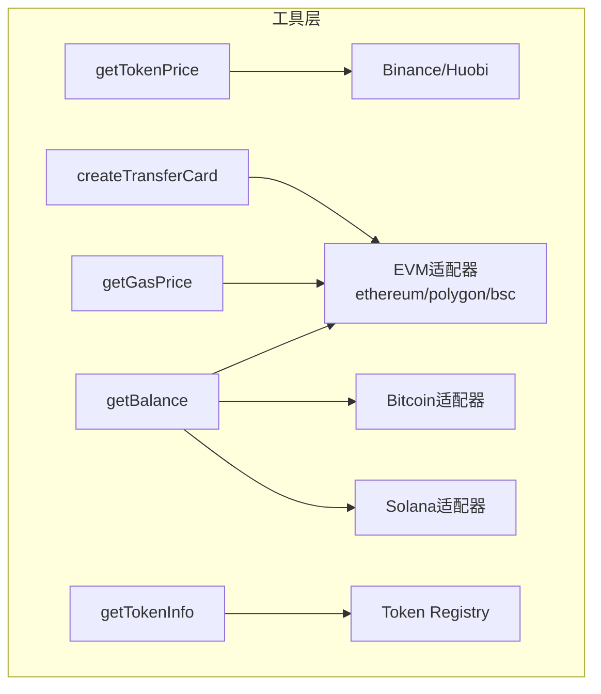

# Web3 工具集成概述

## 工具清单

| 工具名 | 功能 | 参数 | 返回值 |
|--------|------|------|--------|
| getTokenPrice | 多币种价格查询 | `symbol`: ETH/BTC/SOL/MATIC/BNB | price, change24h, currency, source |
| getBalance | 多链余额查询 | `chain`: ethereum/polygon/bsc/bitcoin/solana, `address` | chain, address, balance, unit, decimals |
| getGasPrice | Gas 价格查询 | `chain`: ethereum/polygon/bsc, `rpcUrl?` | gasPrice, maxFeePerGas, maxPriorityFeePerGas, unit |
| getTokenInfo | Token 元数据查询 | `chain`: ethereum/polygon/bsc, `symbol` 或 `contractAddress` | symbol, name, decimals, contractAddress, logoUri |
| createTransferCard | 转账卡片生成 | `to`, `tokenSymbol`, `amount`, `chain` | transferData (from/to/amount/chain/status) |

向后兼容: `getETHPrice()` -> `getTokenPrice('ETH')`, `getBTCPrice()` -> `getTokenPrice('BTC')`, `getWalletBalance(addr)` -> `getBalance('ethereum', addr)`

## 统一接口定义

```typescript
interface ToolResult<T> {
  success: boolean;
  data?: T;
  error?: string;
  timestamp: string;   // ISO 8601
  source: string;      // 数据来源标识
}
```

## 数据源配置

| 工具 | 主数据源 | 备用数据源 | 超时 |
|------|----------|-----------|------|
| getTokenPrice | Binance CN API | Huobi API | 10s |
| getBalance (EVM) | 公共 RPC (eth.llamarpc.com) | 自定义 RPC | - |
| getBalance (BTC) | blockchain.info API | - | - |
| getBalance (SOL) | api.mainnet-beta.solana.com | 自定义 RPC | - |
| getGasPrice | 公共 RPC / 自定义 RPC | - | - |
| getTokenInfo | 内置 Token Registry | - | - |

支持 `HTTPS_PROXY` / `HTTP_PROXY` 环境变量代理配置。

## 多链适配器架构



链类型定义:
- `EvmChainId`: `'ethereum' | 'polygon' | 'bsc' | 'hardhat'`
- `NonEvmChainId`: `'bitcoin' | 'solana'`
- `ChainId`: `EvmChainId | NonEvmChainId`

## 容错策略

| 场景 | 处理方式 |
|------|---------|
| 参数无效 | 返回错误说明 + 合法值列表 |
| API 超时/异常 | 自动切换备用数据源; 全部失败则返回明确错误 |
| 不支持的币种/链 | 返回支持列表 |
| 网络不可用 | 返回 "网络不可用" + 重试建议 |

核心原则: 失败时**绝不伪造数据**, 明确标注 "数据来源未知" 或 "所有数据源均失败"。

## API 端点

**POST /api/tools** - 统一工具调用:
```json
{ "name": "getTokenPrice", "arguments": { "symbol": "ETH" } }
{ "name": "getBalance", "arguments": { "chain": "ethereum", "address": "0x..." } }
{ "name": "getGasPrice", "arguments": { "chain": "ethereum" } }
{ "name": "getTokenInfo", "arguments": { "chain": "ethereum", "symbol": "USDT" } }
{ "name": "createTransferCard", "arguments": { "to": "0x...", "tokenSymbol": "ETH", "amount": "1", "chain": "ethereum" } }
```

**POST /api/chat** - AI Agent 聊天接口, 内部自动调用上述工具。

## 扩展机制

- **新增币种**: 在 `SYMBOL_MAP` 添加映射 -> 编写测试
- **新增链**: 在 `CHAIN_CONFIGS` 添加配置 -> 创建适配器类 -> 在 balance 工具中添加判断
- **新增 Token**: 在 `TOKEN_REGISTRY` 添加条目 (symbol, contractAddress, decimals, logoUri)
