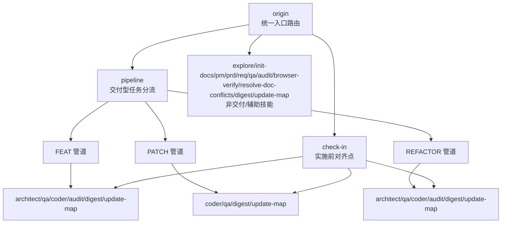
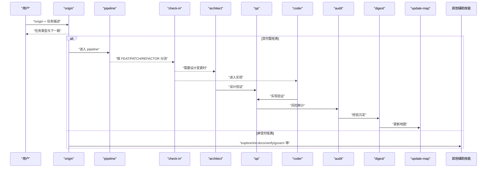
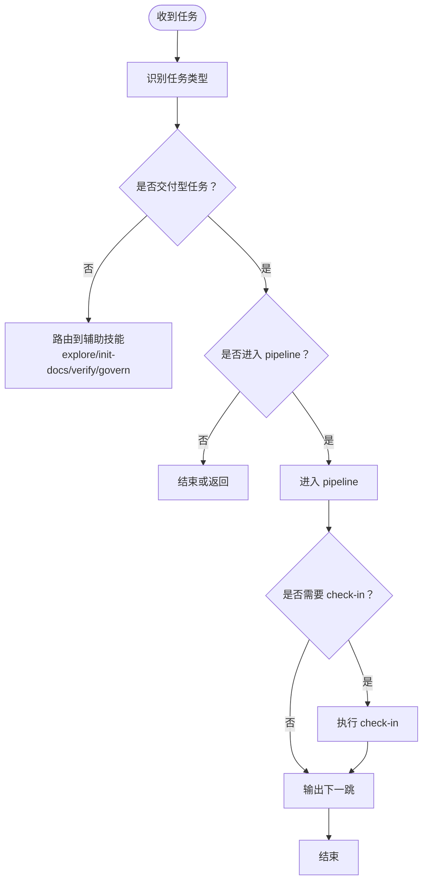
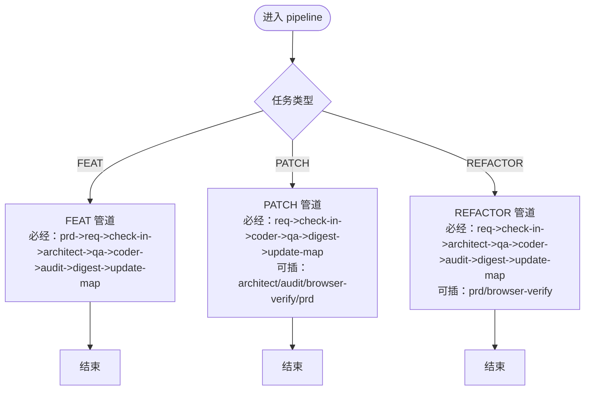
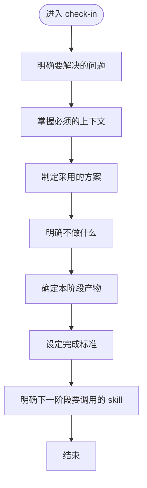
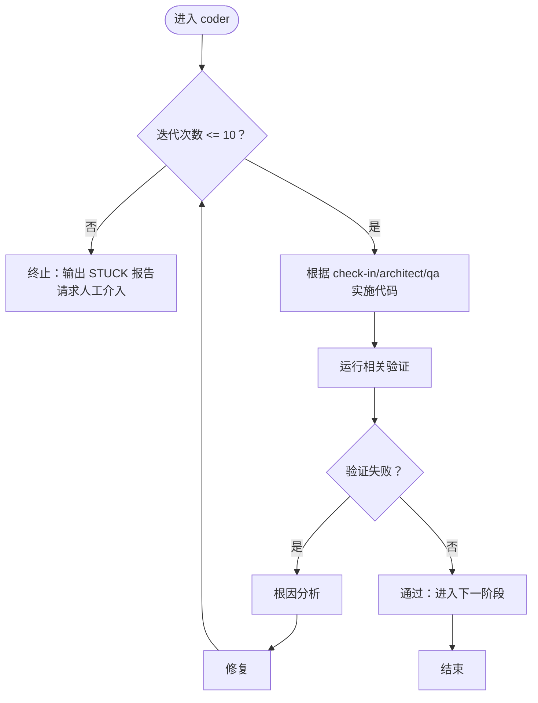
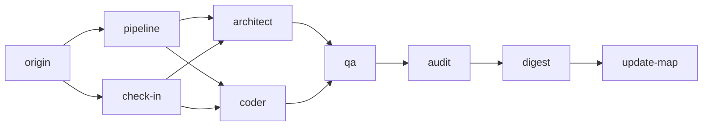

# 工具抽象层设计

<cite>
**本文引用的文件**
- [技能系统设计V3.md](file://skills/web3-ai-agent/SKILL-SYSTEM-DESIGN-V3.md)
- [技能地图V3.md](file://skills/web3-ai-agent/MAP-V3.md)
- [斜杠命令.md](file://skills/web3-ai-agent/COMMANDS.md)
- [origin 技能.md](file://skills/web3-ai-agent/origin/SKILL.md)
- [pipeline 技能.md](file://skills/web3-ai-agent/pipeline/SKILL.md)
- [check-in 技能.md](file://skills/web3-ai-agent/check-in/SKILL.md)
- [architect 技能.md](file://skills/web3-ai-agent/architect/SKILL.md)
- [coder 技能.md](file://skills/web3-ai-agent/coder/SKILL.md)
</cite>

## 目录
1. [简介](#简介)
2. [项目结构](#项目结构)
3. [核心组件](#核心组件)
4. [架构总览](#架构总览)
5. [详细组件分析](#详细组件分析)
6. [依赖关系分析](#依赖关系分析)
7. [性能考量](#性能考量)
8. [故障排查指南](#故障排查指南)
9. [结论](#结论)
10. [附录](#附录)

## 简介
本文件面向AI Agent开发者，系统化阐述Web3工具抽象层的设计理念与实现规范。重点涵盖：
- 统一的工具接口与调用生命周期
- 标准化的输入输出格式与路由规则
- 工具注册与发现机制（基于技能系统）
- 参数校验、执行流程控制、结果格式化与错误处理策略
- 扩展性设计：如何以标准化方式接入新的Web3工具
- 接口规范、数据模型与最佳实践

该设计以“任务类型分流 + 交付管道分级”的双层路由为核心，强调“先分类、再分流、按需执行”，并通过check-in门禁、QA红绿灯、Coder自愈循环等机制保障交付质量与可追溯性。

## 项目结构
Web3工具抽象层依托“技能系统”组织，每个技能封装单一职责，通过明确的输入输出与路由规则协同工作。关键文件与职责如下：
- 技能系统设计V3.md：总体设计原则、任务分类、三层路由与硬规则
- 技能地图V3.md：可视化流程图与固定规则
- 斜杠命令.md：统一的命令入口与调用约定
- origin/pipeline/check-in/architect/coder：各技能的职责、输入输出与流程约束

图表来源
- [技能系统设计V3.md: 266-286:266-286](file://skills/web3-ai-agent/SKILL-SYSTEM-DESIGN-V3.md#L266-L286)
- [技能地图V3.md: 86-166:86-166](file://skills/web3-ai-agent/MAP-V3.md#L86-L166)

章节来源
- [技能系统设计V3.md: 24-43:24-43](file://skills/web3-ai-agent/SKILL-SYSTEM-DESIGN-V3.md#L24-L43)
- [技能地图V3.md: 1-166:1-166](file://skills/web3-ai-agent/MAP-V3.md#L1-L166)

## 核心组件
- 任务分类与路由
  - 七类任务：DISCOVER、BOOTSTRAP、DEFINE、DELIVER-FEAT、DELIVER-PATCH、DELIVER-REFACTOR、VERIFY/GOVERN
  - 一级路由：origin识别任务类型并决定下一跳
  - 二级路由：仅交付型任务进入pipeline，按FEAT/PATCH/REFACTOR分流
- 实施门禁：check-in强制适用于实施型任务，要求明确“要解决的问题、上下文、方案、不做什么、产物、完成标准、下一跳”
- 交付管道：FEAT为全链路，PATCH为快速链路，REFACTOR为设计优先链路；均以check-in为前置
- 质量保障：QA红绿灯规则、Coder自愈循环（最多10轮）、Audit评分规则（≥80通过）

章节来源
- [技能系统设计V3.md: 45-161:45-161](file://skills/web3-ai-agent/SKILL-SYSTEM-DESIGN-V3.md#L45-L161)
- [技能系统设计V3.md: 222-285:222-285](file://skills/web3-ai-agent/SKILL-SYSTEM-DESIGN-V3.md#L222-L285)
- [技能系统设计V3.md: 395-437:395-437](file://skills/web3-ai-agent/SKILL-SYSTEM-DESIGN-V3.md#L395-L437)
- [技能系统设计V3.md: 696-719:696-719](file://skills/web3-ai-agent/SKILL-SYSTEM-DESIGN-V3.md#L696-L719)

## 架构总览
工具抽象层以“技能”为基本执行单元，围绕origin/pipeline/check-in构建统一的调用骨架，辅以architect/qa/coder/audit等技能完成设计、验证、实现与审计，最后通过digest/update-map沉淀与更新知识地图。

图表来源
- [技能系统设计V3.md: 266-286:266-286](file://skills/web3-ai-agent/SKILL-SYSTEM-DESIGN-V3.md#L266-L286)
- [技能地图V3.md: 86-166:86-166](file://skills/web3-ai-agent/MAP-V3.md#L86-L166)

## 详细组件分析

### 组件A：origin（统一入口路由）
- 职责
  - 识别任务类型（DISCOVER/BOOTSTRAP/DEFINE/DELIVER-*/VERIFY/GOVERN）
  - 判断是否进入pipeline与是否需要check-in
  - 输出简洁的任务判断与下一跳，不直接生成后续产物
- 输入输出
  - 输入：自然语言或斜杠命令触发的任务描述
  - 输出：任务类型、原因、下一跳、是否进入pipeline、是否需要check-in
- 关键规则
  - 任何新任务必须先过origin
  - 对歧义任务先澄清再路由
  - 仅交付型任务进入pipeline
  - 实施前阶段必须先check-in

图表来源
- [origin 技能.md: 30-66:30-66](file://skills/web3-ai-agent/origin/SKILL.md#L30-L66)
- [origin 技能.md: 118-125:118-125](file://skills/web3-ai-agent/origin/SKILL.md#L118-L125)

章节来源
- [origin 技能.md: 1-125:1-125](file://skills/web3-ai-agent/origin/SKILL.md#L1-L125)

### 组件B：pipeline（交付型任务分流）
- 职责
  - 为DELIVER-FEAT/PATCH/REFACTOR选择合适的执行深度
  - 明确必经技能、可跳过技能与按需插入技能
- 输入输出
  - 输入：DELIVER-FEAT / DELIVER-PATCH / DELIVER-REFACTOR
  - 输出：类型、级别、必经/可跳过/按需技能清单
- 管道规则
  - FEAT：pm(按需)->prd->req->check-in->architect->qa->coder->audit->digest->update-map
  - PATCH：req->check-in->coder->qa->digest->update-map（可插入architect/audit/browser-verify/prd）
  - REFACTOR：req->check-in->architect->qa->coder->audit->digest->update-map（可插入prd/browser-verify）

图表来源
- [pipeline 技能.md: 18-58:18-58](file://skills/web3-ai-agent/pipeline/SKILL.md#L18-L58)
- [技能系统设计V3.md: 288-393:288-393](file://skills/web3-ai-agent/SKILL-SYSTEM-DESIGN-V3.md#L288-L393)

章节来源
- [pipeline 技能.md: 1-89:1-89](file://skills/web3-ai-agent/pipeline/SKILL.md#L1-L89)
- [技能系统设计V3.md: 288-393:288-393](file://skills/web3-ai-agent/SKILL-SYSTEM-DESIGN-V3.md#L288-L393)

### 组件C：check-in（实施前对齐点）
- 职责
  - 实施前门禁，确认问题、上下文、方案、边界、产物、完成标准与下一跳
- 强制适用场景
  - DELIVER-FEAT / DELIVER-PATCH / DELIVER-REFACTOR / 准备进入实施的DEFINE
- 输出模板
  - 本阶段要解决的问题、必须掌握的上下文、采用的方案、不做什么、产物、完成标准、进入下一阶段前要调用的skill
- 硬规则
  - 无check-in不得进入architect/qa/coder
  - 必须明确“不做什么”和完成标准

图表来源
- [check-in 技能.md: 25-35:25-35](file://skills/web3-ai-agent/check-in/SKILL.md#L25-L35)
- [check-in 技能.md: 51-56:51-56](file://skills/web3-ai-agent/check-in/SKILL.md#L51-L56)

章节来源
- [check-in 技能.md: 1-56:1-56](file://skills/web3-ai-agent/check-in/SKILL.md#L1-L56)

### 组件D：architect（结构设计）
- 适用场景
  - 接口变化、状态流变化、模块边界变化、结构性重构
- 输入
  - check-in、任务卡
- 输出
  - 架构说明：目标、模块边界、数据流、消息流、接口契约、错误处理、风险点
- 边界
  - 不直接写测试、不直接承担编码
- 规则
  - 无结构变化可跳过
  - 发现需求边界变化应回退prd/req

章节来源
- [architect 技能.md: 1-53:1-53](file://skills/web3-ai-agent/architect/SKILL.md#L1-L53)

### 组件E：coder（实现与自愈）
- 定位
  - 在边界清楚前提下实施代码，通过最多10轮自愈循环把QA红灯变为绿灯
- 自愈循环
  - 最多10轮；超限输出STUCK报告并请求人工介入
- QA衔接
  - FEAT中QA先执行RED；coder职责是将RED全部变为GREEN
- 边界
  - 不修改需求定义、不擅自修改验收标准、不跳过失败验证
- 规则
  - 无check-in不得进入coder
  - 发现范围扩大应回退req/check-in/architect
  - 优先跑相关验证，不默认全量重跑

图表来源
- [coder 技能.md: 18-37:18-37](file://skills/web3-ai-agent/coder/SKILL.md#L18-L37)
- [技能系统设计V3.md: 706-711:706-711](file://skills/web3-ai-agent/SKILL-SYSTEM-DESIGN-V3.md#L706-L711)

章节来源
- [coder 技能.md: 1-72:1-72](file://skills/web3-ai-agent/coder/SKILL.md#L1-L72)
- [技能系统设计V3.md: 696-719:696-719](file://skills/web3-ai-agent/SKILL-SYSTEM-DESIGN-V3.md#L696-L719)

### 组件F：QA与Audit（质量与风险）
- QA红绿灯规则
  - FEAT默认先由qa执行RED；RED目标是证明“当前未通过”，不是直接修复
  - PATCH/REFACTOR默认不强制走完整RED，但必须保留验证或回归检查
- Audit评分规则
  - 总分100；>=80通过；60-79软拒绝回退修复；<60直接拒绝
  - 严重安全问题、关键不变量破坏、高风险边界缺失可一票否决

章节来源
- [技能系统设计V3.md: 700-719:700-719](file://skills/web3-ai-agent/SKILL-SYSTEM-DESIGN-V3.md#L700-L719)

### 组件G：Digest与Update-map（沉淀与更新）
- digest：经验沉淀，记录本轮学到的问题与遗留问题
- update-map：状态更新，维护文档索引、当前状态与下一步入口

章节来源
- [技能系统设计V3.md: 547-565:547-565](file://skills/web3-ai-agent/SKILL-SYSTEM-DESIGN-V3.md#L547-L565)

## 依赖关系分析
- 耦合与内聚
  - origin/pipeline/check-in构成强耦合的“决策-分流-门禁”链路，确保交付质量
  - architect/qa/coder/audit/digest/update-map为弱耦合的“执行-验证-沉淀”链路，按需插入
- 外部依赖
  - 命令入口：斜杠命令约定统一调用
  - 知识地图：digest/update-map与地图维护系统对接
- 循环依赖
  - 通过“按需插入”与“完成标准”避免循环调用

图表来源
- [技能地图V3.md: 86-166:86-166](file://skills/web3-ai-agent/MAP-V3.md#L86-L166)
- [技能系统设计V3.md: 266-286:266-286](file://skills/web3-ai-agent/SKILL-SYSTEM-DESIGN-V3.md#L266-L286)

章节来源
- [技能地图V3.md: 86-166:86-166](file://skills/web3-ai-agent/MAP-V3.md#L86-L166)

## 性能考量
- 路由分流
  - 通过origin/pipeline两级分流减少无效执行，提升吞吐
- 管道分级
  - PATCH优先短链路，FEAT全链路，REFACTOR设计优先，避免小题大做
- 自愈循环上限
  - Coder最多10轮自愈，防止长时间卡顿
- 验证范围控制
  - 优先跑相关验证，避免全量重跑

## 故障排查指南
- 常见问题
  - 未过origin直接进入技能：检查命令是否以“/origin”开头
  - 无check-in直接进入architect/qa/coder：检查是否遗漏check-in
  - PATCH/REFACTOR未按规则执行：核对pipeline分流与必经/可跳过技能
  - QA红灯无法自愈：检查是否超过10轮、是否遵循“RED->GREEN”闭环
- 定位方法
  - 查看origin输出的任务类型与下一跳
  - 核对pipeline输出的必经/可跳过/按需技能
  - 检查check-in输出的完成标准与下一跳
  - 追踪Coder自愈循环次数与STUCK报告

章节来源
- [origin 技能.md: 118-125:118-125](file://skills/web3-ai-agent/origin/SKILL.md#L118-L125)
- [pipeline 技能.md: 82-89:82-89](file://skills/web3-ai-agent/pipeline/SKILL.md#L82-L89)
- [check-in 技能.md: 51-56:51-56](file://skills/web3-ai-agent/check-in/SKILL.md#L51-L56)
- [coder 技能.md: 39-48:39-48](file://skills/web3-ai-agent/coder/SKILL.md#L39-L48)
- [技能系统设计V3.md: 706-719:706-719](file://skills/web3-ai-agent/SKILL-SYSTEM-DESIGN-V3.md#L706-L719)

## 结论
该工具抽象层以“任务类型分流 + 交付管道分级”为核心，结合check-in门禁、QA红绿灯与Coder自愈循环，形成高内聚、低耦合的执行骨架。通过标准化的输入输出与严格的硬规则，既能保证交付质量，又能灵活扩展新的Web3工具与技能。建议在接入新工具时严格遵循上述规范，确保与既有技能无缝协作。

## 附录

### 接口规范与数据模型
- 统一命令入口
  - 使用斜杠命令进行调用，推荐以“/origin + 任务描述”开始
- 输入输出格式
  - origin：任务类型、原因、下一跳、是否进入pipeline、是否需要check-in
  - pipeline：类型、级别、必经/可跳过/按需技能清单
  - check-in：问题、上下文、方案、不做什么、产物、完成标准、下一跳
  - architect：架构说明（目标、模块边界、数据流、消息流、接口契约、错误处理、风险点）
  - coder：代码修改、验证结果；若失败输出STUCK报告
  - audit：评分与结论（≥80通过、60-79软拒绝、<60直接拒绝）
- 路由规则
  - 仅交付型任务进入pipeline
  - 无check-in不得进入architect/qa/coder
  - 小任务优先短链路，不为了完整而完整

章节来源
- [斜杠命令.md: 20-50:20-50](file://skills/web3-ai-agent/COMMANDS.md#L20-L50)
- [origin 技能.md: 30-66:30-66](file://skills/web3-ai-agent/origin/SKILL.md#L30-L66)
- [pipeline 技能.md: 18-58:18-58](file://skills/web3-ai-agent/pipeline/SKILL.md#L18-L58)
- [check-in 技能.md: 25-35:25-35](file://skills/web3-ai-agent/check-in/SKILL.md#L25-L35)
- [architect 技能.md: 20-32:20-32](file://skills/web3-ai-agent/architect/SKILL.md#L20-L32)
- [coder 技能.md: 55-59:55-59](file://skills/web3-ai-agent/coder/SKILL.md#L55-L59)
- [技能系统设计V3.md: 696-719:696-719](file://skills/web3-ai-agent/SKILL-SYSTEM-DESIGN-V3.md#L696-L719)