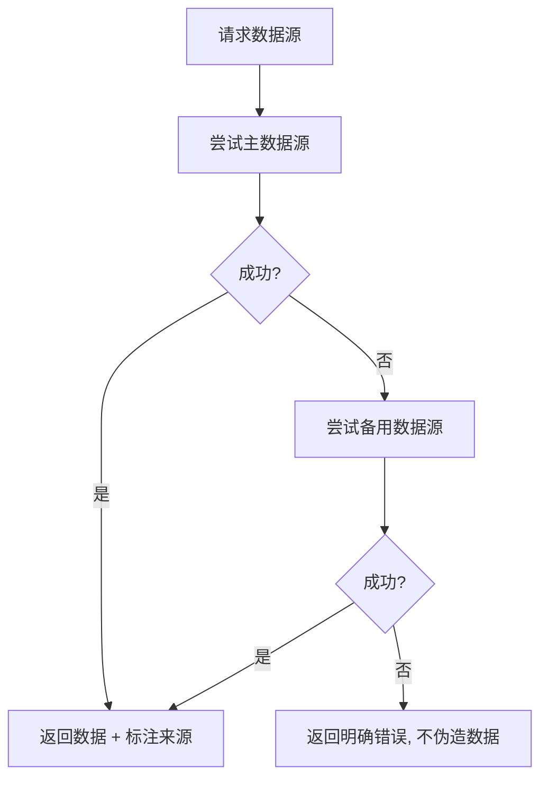

# 数据源管理

## 数据源分类

| 类别 | 数据源 | 用途 | 更新频率 |
|------|--------|------|---------|
| 价格数据 | Binance CN API | ETH/BTC/SOL/MATIC/BNB 价格 | 实时 |
| 价格数据 | Huobi API | 备用价格源 | 实时 |
| 链上数据 (EVM) | 公共 RPC (eth.llamarpc.com) | 余额/Gas/合约调用 | 按区块 |
| 链上数据 (BTC) | blockchain.info API | BTC 余额 | 按区块 |
| 链上数据 (SOL) | api.mainnet-beta.solana.com | SOL 余额 | 按 slot |
| Token 元数据 | 内置 Token Registry | 合约地址/精度/Logo | 静态 |

## 数据源选择标准

- **可追溯性**: 每条数据必须标注来源 (source 字段)
- **可信度**: 链上数据 > 交易所 API > 聚合器
- **时效性**: 价格数据分钟级, 链上数据区块级
- **可用性**: 所有工具配置备用数据源, 失败时自动切换

## 容错与降级机制

降级优先级:
1. 主数据源正常返回
2. 备用数据源返回 (标注来源变更)
3. 明确报错 "所有数据源均失败"

## 数据格式差异处理

| 维度 | 链上数据 | 价格数据 |
|------|---------|---------|
| 一致性 | 强一致 (区块确认) | 最终一致 (多源聚合) |
| 精度 | Wei/lamports/satoshi 原始精度 | USD 合理精度 |
| 验证方式 | 区块高度/哈希校验 | 时间戳 + 来源比对 |

## 环境变量配置

| 变量 | 用途 | 默认值 |
|------|------|--------|
| `HTTPS_PROXY` / `HTTP_PROXY` | API 代理 | 无 |
| `NEXT_PUBLIC_HARDHAT_RPC_URL` | Hardhat 本地 RPC | `http://127.0.0.1:8545` |
| 自定义 RPC URL | 覆盖默认公共节点 | 各链默认节点 |

## 数据质量监控

- 请求失败时记录 warning 日志, 便于排查
- 数据返回时附带 timestamp, 便于判断时效
- 所有工具返回统一的 `ToolResult` 结构, 包含 success/error/source 字段
