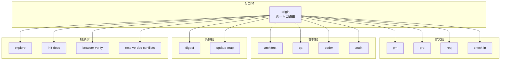
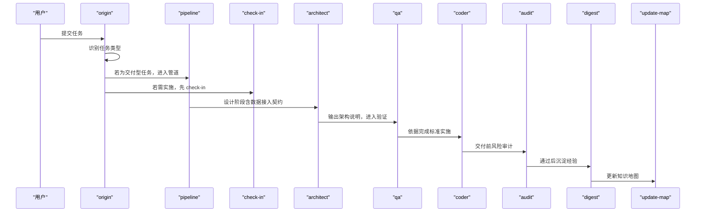
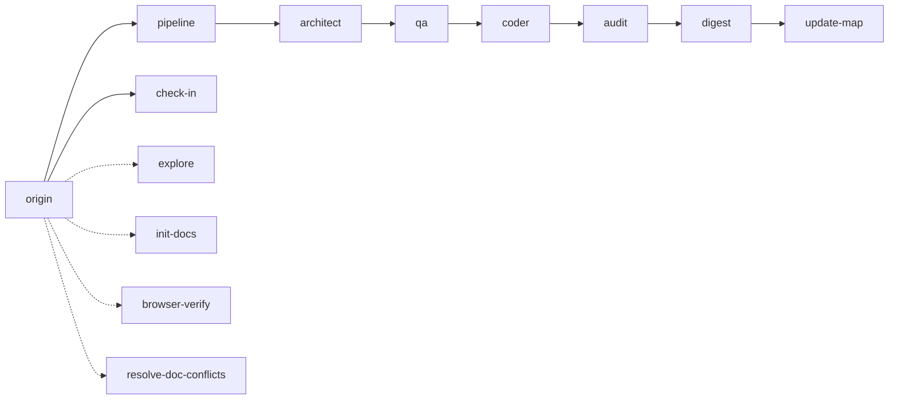

# 数据源管理与集成

<cite>
**本文引用的文件**
- [SKILL.md](file://skills/web3-ai-agent/SKILL.md)
- [MAP-V3.md](file://skills/web3-ai-agent/MAP-V3.md)
- [SKILL-SYSTEM-DESIGN-V3.md](file://skills/web3-ai-agent/SKILL-SYSTEM-DESIGN-V3.md)
- [origin/ SKILL.md](file://skills/web3-ai-agent/origin/SKILL.md)
- [pipeline/ SKILL.md](file://skills/web3-ai-agent/pipeline/SKILL.md)
- [architect/ SKILL.md](file://skills/web3-ai-agent/architect/SKILL.md)
- [audit/ SKILL.md](file://skills/web3-ai-agent/audit/SKILL.md)
- [coder/ SKILL.md](file://skills/web3-ai-agent/coder/ SKILL.md)
- [qa/ SKILL.md](file://skills/web3-ai-agent/qa/ SKILL.md)
- [check-in/ SKILL.md](file://skills/web3-ai-agent/check-in/ SKILL.md)
- [digest/ SKILL.md](file://skills/web3-ai-agent/digest/ SKILL.md)
- [explore/ SKILL.md](file://skills/web3-ai-agent/explore/ SKILL.md)
- [init-docs/ SKILL.md](file://skills/web3-ai-agent/init-docs/ SKILL.md)
</cite>

## 目录
1. [简介](#简介)
2. [项目结构](#项目结构)
3. [核心组件](#核心组件)
4. [架构总览](#架构总览)
5. [详细组件分析](#详细组件分析)
6. [依赖关系分析](#依赖关系分析)
7. [性能考量](#性能考量)
8. [故障排查指南](#故障排查指南)
9. [结论](#结论)
10. [附录](#附录)

## 简介
本文件围绕 Web3 数据源管理与集成，结合仓库中的技能体系设计与路由规则，系统阐述数据源的选择标准、接入方式、管理策略；区分链上数据与价格数据的差异与处理方式；明确数据来源的可追溯性与透明度要求；给出数据缓存策略、更新频率控制与一致性保障机制；提供第三方数据源集成方法与最佳实践；并配套数据质量监控、异常处理与故障恢复的完整方案。面向数据工程师与系统架构师，提供专业、可落地的数据管理指导。

## 项目结构
仓库采用“技能（Skill）+ 路由（Pipeline）+ 交付（Delivery）”的分层设计，围绕任务类型进行分流，仅在交付型任务中进入执行管道。该结构天然适用于数据源管理：通过统一入口识别任务类型，再在交付链路中按需引入数据源接入、校验与治理环节。

图表来源
- [SKILL-SYSTEM-DESIGN-V3.md:164-220](file://skills/web3-ai-agent/SKILL-SYSTEM-DESIGN-V3.md#L164-L220)
- [MAP-V3.md:86-166](file://skills/web3-ai-agent/MAP-V3.md#L86-L166)

章节来源
- [SKILL.md:1-224](file://skills/web3-ai-agent/SKILL.md#L1-L224)
- [MAP-V3.md:1-166](file://skills/web3-ai-agent/MAP-V3.md#L1-L166)
- [SKILL-SYSTEM-DESIGN-V3.md:1-719](file://skills/web3-ai-agent/SKILL-SYSTEM-DESIGN-V3.md#L1-L719)

## 核心组件
- 统一入口（origin）：识别任务类型，决定是否进入交付链与是否需要实施前对齐（check-in），并输出下一跳。
- 交付管道（pipeline）：针对 FEAT/PATCH/REFACTOR 三类交付任务，选择执行深度与必经/可跳过环节。
- 实施前对齐（check-in）：强制输出“要解决的问题、上下文、方案、不做什么、产物、完成标准、下一跳”，确保数据源接入与变更在可控范围内。
- 设计（architect）：当涉及接口、状态流、模块边界变化时，产出结构说明与契约，为数据源接入提供架构约束。
- 质量保证（qa）：定义验证策略，FEAT 采用“红灯优先”，PATCH/REFACTOR 采用轻量验证或回归检查。
- 编码（coder）：在边界清晰前提下实施，最多 10 轮自愈循环，将 QA 红灯变为绿灯。
- 风险审计（audit）：交付前最后一道风险关，支持轻审/重审，总分 100 分，>=80 通过，<60 直接拒绝。
- 复盘与地图更新（digest + update-map）：沉淀经验并更新知识地图，形成闭环。

章节来源
- [origin/ SKILL.md:1-125](file://skills/web3-ai-agent/origin/SKILL.md#L1-L125)
- [pipeline/ SKILL.md:1-89](file://skills/web3-ai-agent/pipeline/SKILL.md#L1-L89)
- [check-in/ SKILL.md:1-56](file://skills/web3-ai-agent/check-in/ SKILL.md#L1-L56)
- [architect/ SKILL.md:1-53](file://skills/web3-ai-agent/architect/SKILL.md#L1-L53)
- [qa/ SKILL.md:1-73](file://skills/web3-ai-agent/qa/ SKILL.md#L1-L73)
- [coder/ SKILL.md:1-72](file://skills/web3-ai-agent/coder/ SKILL.md#L1-L72)
- [audit/ SKILL.md:1-88](file://skills/web3-ai-agent/audit/SKILL.md#L1-L88)
- [digest/ SKILL.md:1-50](file://skills/web3-ai-agent/digest/ SKILL.md#L1-L50)

## 架构总览
下图展示“统一入口 → 交付管道 → 实施前对齐 → 设计/验证/编码/审计 → 复盘与地图更新”的完整链路，数据源管理贯穿其中：在定义阶段明确数据需求与来源，在设计阶段确定数据接入契约与缓存策略，在验证阶段确保数据一致性与可用性，在审计阶段评估数据可信度与风险，在复盘阶段沉淀数据治理经验。

图表来源
- [SKILL-SYSTEM-DESIGN-V3.md:265-285](file://skills/web3-ai-agent/SKILL-SYSTEM-DESIGN-V3.md#L265-L285)
- [origin/ SKILL.md:41-125](file://skills/web3-ai-agent/origin/SKILL.md#L41-L125)
- [pipeline/ SKILL.md:29-89](file://skills/web3-ai-agent/pipeline/ SKILL.md#L29-L89)
- [check-in/ SKILL.md:37-56](file://skills/web3-ai-agent/check-in/ SKILL.md#L37-L56)
- [architect/ SKILL.md:34-53](file://skills/web3-ai-agent/architect/SKILL.md#L34-L53)
- [qa/ SKILL.md:51-73](file://skills/web3-ai-agent/qa/ SKILL.md#L51-L73)
- [coder/ SKILL.md:18-72](file://skills/web3-ai-agent/coder/ SKILL.md#L18-L72)
- [audit/ SKILL.md:52-88](file://skills/web3-ai-agent/audit/SKILL.md#L52-L88)
- [digest/ SKILL.md:30-50](file://skills/web3-ai-agent/digest/ SKILL.md#L30-L50)

## 详细组件分析

### 统一入口（origin）与任务分流
- 作用：识别 DISCOVER/BOOTSTRAP/DEFINE/DELIVER-FEAT/DELIVER-PATCH/DELIVER-REFACTOR/VERIFY/GOVERN 七类任务，决定是否进入 pipeline 与是否需要 check-in。
- 数据源相关要点：
  - 在 DEFINE 阶段明确数据需求（来源、口径、时效、一致性要求）。
  - 在 DELIVER 阶段按任务类型选择执行深度，数据源接入通常在设计与验证阶段完成。
- 建议：在输出下一跳时，明确数据源接入的前置条件与验收标准。

章节来源
- [origin/ SKILL.md:12-125](file://skills/web3-ai-agent/origin/SKILL.md#L12-L125)
- [SKILL-SYSTEM-DESIGN-V3.md:45-161](file://skills/web3-ai-agent/SKILL-SYSTEM-DESIGN-V3.md#L45-L161)

### 交付管道（pipeline）与数据源执行深度
- FEAT：默认包含 pm(按需)、prd、req、check-in、architect、qa、coder、audit、digest、update-map，适合引入复杂数据源与多源聚合。
- PATCH：默认 req → check-in → coder → qa → digest → update-map，适合快速修复数据接入问题或回归。
- REFACTOR：默认 req → check-in → architect → qa → coder → audit → digest → update-map，适合重构数据接入层或缓存策略。
- 关键规则：未通过 check-in 不得进入 architect/qa/coder；小任务优先短链路。

章节来源
- [pipeline/ SKILL.md:29-89](file://skills/web3-ai-agent/pipeline/ SKILL.md#L29-L89)
- [SKILL-SYSTEM-DESIGN-V3.md:288-392](file://skills/web3-ai-agent/SKILL-SYSTEM-DESIGN-V3.md#L288-L392)

### 实施前对齐（check-in）与数据源准入
- 强制适用：DELIVER-FEAT、DELIVER-PATCH、DELIVER-REFACTOR、准备进入实施的 DEFINE。
- 输出模板包含：要解决的问题、必须掌握的上下文、采用的方案、不做什么、产物、完成标准、下一跳。
- 数据源相关约束：
  - 明确数据来源、可信度等级、更新频率、一致性策略。
  - 明确数据口径与边界，避免范围蔓延。
  - 明确验收标准与回退策略。

章节来源
- [check-in/ SKILL.md:12-56](file://skills/web3-ai-agent/check-in/ SKILL.md#L12-L56)
- [SKILL-SYSTEM-DESIGN-V3.md:395-437](file://skills/web3-ai-agent/SKILL-SYSTEM-DESIGN-V3.md#L395-L437)

### 设计（architect）与数据接入契约
- 适用：涉及接口变化、状态流变化、模块边界变化、结构性重构。
- 输出：模块边界、数据流、消息流、接口契约、错误处理、风险点。
- 数据源相关：定义数据接入协议、缓存策略、更新频率、一致性窗口、异常处理与降级策略。

章节来源
- [architect/ SKILL.md:8-53](file://skills/web3-ai-agent/architect/SKILL.md#L8-L53)
- [SKILL-SYSTEM-DESIGN-V3.md:506-546](file://skills/web3-ai-agent/SKILL-SYSTEM-DESIGN-V3.md#L506-L546)

### 质量保证（qa）与数据验证策略
- FEAT：红灯优先（RED），先证明“当前未通过”，最多运行两次。
- PATCH/REFACTOR：轻量验证或回归验证，至少保留轻量回归检查。
- 数据源相关：基于完成标准制定数据一致性、完整性、时效性验证清单；对链上数据与价格数据分别设置验证维度。

章节来源
- [qa/ SKILL.md:12-73](file://skills/web3-ai-agent/qa/ SKILL.md#L12-L73)
- [SKILL-SYSTEM-DESIGN-V3.md:516-526](file://skills/web3-ai-agent/SKILL-SYSTEM-DESIGN-V3.md#L516-L526)

### 编码（coder）与自愈循环
- 自愈循环：最多 10 轮，每轮实施代码、运行验证、根因分析、修复并进入下一轮。
- 数据源相关：在边界清晰前提下实施数据接入与缓存逻辑；若验证失败，优先聚焦数据源可用性、一致性与性能问题。

章节来源
- [coder/ SKILL.md:18-72](file://skills/web3-ai-agent/coder/ SKILL.md#L18-L72)
- [SKILL-SYSTEM-DESIGN-V3.md:526-533](file://skills/web3-ai-agent/SKILL-SYSTEM-DESIGN-V3.md#L526-L533)

### 风险审计（audit）与数据可信度
- 轻审/重审：根据任务风险等级选择；重审适用于涉及 Web3 数据可信度、权限、资金、安全的任务。
- 评分维度：需求一致性、结构/契约一致性、安全与风险边界、代码质量、回归风险控制、文档与状态收尾、场景特定治理项。
- 阈值：>=80 通过，60-79 软拒绝，<60 直接拒绝；严重安全问题、关键不变量破坏、高风险边界缺失可一票否决。

章节来源
- [audit/ SKILL.md:12-88](file://skills/web3-ai-agent/audit/SKILL.md#L12-L88)
- [SKILL-SYSTEM-DESIGN-V3.md:534-546](file://skills/web3-ai-agent/SKILL-SYSTEM-DESIGN-V3.md#L534-L546)

### 复盘与地图更新（digest + update-map）
- digest：记录完成项、问题、经验与建议，重点记录“为什么卡住/为什么成功”。
- update-map：更新文档索引、当前状态与下一步入口。
- 数据源相关：沉淀数据源选择与接入经验、缓存与一致性策略、异常处理与恢复流程。

章节来源
- [digest/ SKILL.md:1-50](file://skills/web3-ai-agent/digest/ SKILL.md#L1-L50)
- [SKILL-SYSTEM-DESIGN-V3.md:547-565](file://skills/web3-ai-agent/SKILL-SYSTEM-DESIGN-V3.md#L547-L565)

### 辅助层（explore、init-docs、browser-verify、resolve-doc-conflicts）
- explore：只读导航，不进入交付链。
- init-docs：新项目初始化文档体系，与 update-map 协作。
- browser-verify：浏览器层验收，可用于前端数据展示与交互验证。
- resolve-doc-conflicts：文档冲突治理。

章节来源
- [explore/ SKILL.md:1-42](file://skills/web3-ai-agent/explore/ SKILL.md#L1-L42)
- [init-docs/ SKILL.md:1-41](file://skills/web3-ai-agent/init-docs/ SKILL.md#L1-L41)
- [SKILL-SYSTEM-DESIGN-V3.md:566-601](file://skills/web3-ai-agent/SKILL-SYSTEM-DESIGN-V3.md#L566-L601)

## 依赖关系分析
- 入口层依赖于任务类型识别与 check-in 强制规则，决定是否进入交付链。
- 交付层内部强依赖 check-in 的完成标准，确保数据源接入在可控范围内。
- 设计与验证阶段共同决定数据接入契约与验证策略，编码阶段实施，审计阶段收尾。
- 治理层沉淀经验并更新地图，形成持续改进闭环。

图表来源
- [SKILL-SYSTEM-DESIGN-V3.md:164-220](file://skills/web3-ai-agent/SKILL-SYSTEM-DESIGN-V3.md#L164-L220)
- [origin/ SKILL.md:41-125](file://skills/web3-ai-agent/origin/SKILL.md#L41-L125)
- [pipeline/ SKILL.md:29-89](file://skills/web3-ai-agent/pipeline/ SKILL.md#L29-L89)
- [check-in/ SKILL.md:37-56](file://skills/web3-ai-agent/check-in/ SKILL.md#L37-L56)
- [architect/ SKILL.md:34-53](file://skills/web3-ai-agent/architect/SKILL.md#L34-L53)
- [qa/ SKILL.md:51-73](file://skills/web3-ai-agent/qa/ SKILL.md#L51-L73)
- [coder/ SKILL.md:18-72](file://skills/web3-ai-agent/coder/ SKILL.md#L18-L72)
- [audit/ SKILL.md:52-88](file://skills/web3-ai-agent/audit/SKILL.md#L52-L88)
- [digest/ SKILL.md:30-50](file://skills/web3-ai-agent/digest/ SKILL.md#L30-L50)

## 性能考量
- 数据接入性能
  - 采用异步批量拉取与增量更新，避免阻塞主线程。
  - 对高频访问数据启用本地缓存与预热策略。
- 链上数据与价格数据差异化
  - 链上数据：强调最终性与不可篡改性，采用区块高度或时间窗口作为一致性锚点。
  - 价格数据：强调实时性与波动性，采用滑点容忍与多源聚合策略。
- 缓存与更新频率
  - 缓存策略：热点数据短期缓存，冷数据长期缓存；区分强一致与最终一致场景。
  - 更新频率：链上数据按区块间隔或固定周期更新；价格数据按分钟级或秒级轮询。
- 一致性保证
  - 使用版本号或时间戳标记数据批次，配合校验和与快照机制。
  - 对关键路径引入双写/双读与回滚预案，确保故障可恢复。

## 故障排查指南
- 数据源可用性
  - 现象：接口超时、返回空数据、格式异常。
  - 排查：检查上游限流与配额、网络连通性、认证与签名有效性。
  - 处置：切换备用节点、临时降级至历史数据、触发告警与自愈。
- 数据一致性
  - 现象：链上数据与价格数据不一致、缓存脏读。
  - 排查：核对批次版本、时间窗口与校验和；检查并发写入与竞态条件。
  - 处置：回滚到最近一致快照、重建缓存、人工复核关键交易。
- 验证失败
  - 现象：QA 红灯，coder 无法在 10 轮内通过。
  - 排查：定位根因（数据源、缓存、契约、实现）；复核完成标准。
  - 处置：回退到上一稳定版本、缩小范围重试、人工介入并升级审计级别。
- 审计拒绝
  - 现象：audit 得分低于阈值或触发一票否决。
  - 排查：检查安全边界、不变量与风险提示。
  - 处置：修复后重审；严重问题终止并制定专项治理计划。

章节来源
- [coder/ SKILL.md:39-72](file://skills/web3-ai-agent/coder/ SKILL.md#L39-L72)
- [audit/ SKILL.md:70-88](file://skills/web3-ai-agent/audit/SKILL.md#L70-L88)

## 结论
本仓库的技能体系为 Web3 数据源管理提供了清晰的“入口识别—定义—对齐—设计—验证—编码—审计—复盘”的闭环框架。通过在定义阶段明确数据需求与来源、在设计阶段固化接入契约与缓存策略、在验证阶段确保一致性与可用性、在审计阶段评估可信度与风险、在复盘阶段沉淀经验，能够有效支撑链上数据与价格数据的高质量集成与持续演进。建议在实际工程中结合本文的策略与流程，形成可落地的数据源治理规范与应急预案。

## 附录

### 数据源选择标准与接入流程
- 选择标准
  - 可靠性：SLA、可用性、故障率与恢复时间。
  - 透明度：公开的 API 文档、更新日志、审计轨迹。
  - 一致性：数据版本、校验和、时间窗口与最终性。
  - 成本：调用单价、带宽、存储与计算成本。
- 接入流程
  - 定义阶段：明确数据需求、来源与口径。
  - 设计阶段：产出接入契约、缓存与更新策略。
  - 验证阶段：制定一致性与可用性验证清单。
  - 审计阶段：评估可信度与风险，形成上线决策。
  - 复盘阶段：沉淀经验并更新地图。

### 链上数据与价格数据处理差异
- 链上数据
  - 特性：不可篡改、最终性、延迟较高。
  - 处理：以区块高度为锚点，采用增量同步与快照备份。
- 价格数据
  - 特性：实时性强、波动大、多源聚合。
  - 处理：多源打分与滑点容忍，短期缓存与预热。

### 第三方数据源集成方法与最佳实践
- 方法
  - 适配器模式：统一抽象不同数据源的接入与转换。
  - 多活与降级：主备切换、熔断与快速失败。
  - 可观测性：埋点、链路追踪、指标与告警。
- 最佳实践
  - 先契约后实现：明确接口、版本与异常处理。
  - 渐进式上线：灰度发布与回滚预案。
  - 持续监控：数据质量、延迟与错误率。