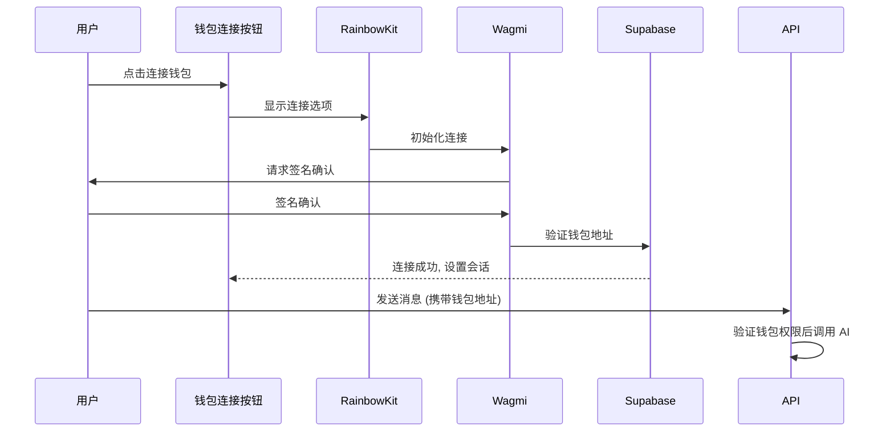

# 钱包认证系统

## 功能概述

基于以太坊钱包的去中心化身份验证系统, 集成 RainbowKit + Wagmi + Viem, 支持 MetaMask、WalletConnect、Coinbase Wallet 等主流钱包。

## 认证流程



## 核心接口

```typescript
// Supabase 钱包认证
class SupabaseClient {
  validateWalletAddress(address: string): boolean  // 验证 0x 开头, 42 字符
  setWalletContext(walletAddress: string): void    // 设置会话
  getWalletContext(): string                       // 获取当前钱包
  clearWalletContext(): void                       // 清除会话
}
```

## 内存管理策略

| 策略 | 特点 | 适用场景 |
|------|------|---------|
| 摘要压缩 (SummaryCompression) | 生成对话摘要, 减少存储 | 长对话历史 |
| 滑动窗口 (SlidingWindow) | 仅保留最近 N 条消息 | 短对话/实时交互 |

## 技术栈

| 层级 | 依赖 |
|------|------|
| 前端 | @rainbow-me/rainbowkit, wagmi, viem, next |
| 后端 | @supabase/supabase-js, openai |
| 工具 | @web3-ai-agent/web3-tools, @web3-ai-agent/ai-config |

## 环境变量

- `NEXT_PUBLIC_SUPABASE_URL` - Supabase 服务地址
- `NEXT_PUBLIC_SUPABASE_ANON_KEY` - Supabase 匿名密钥
