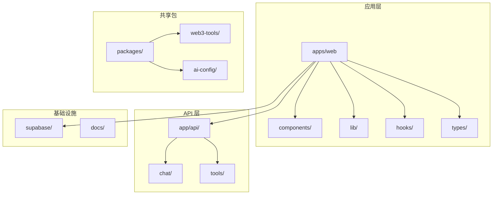
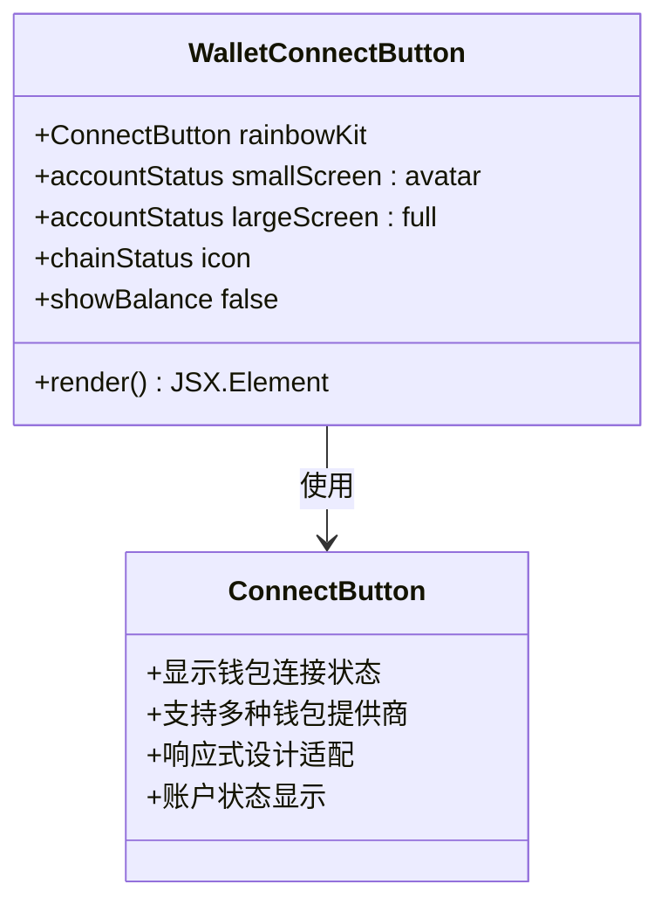
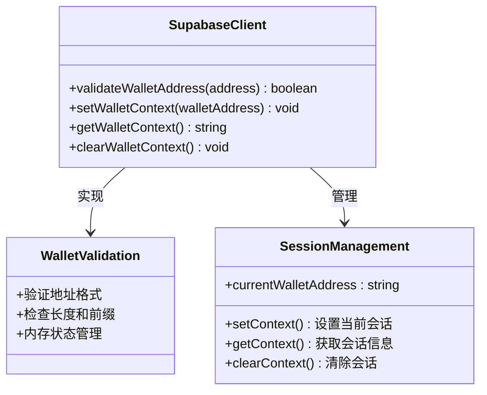
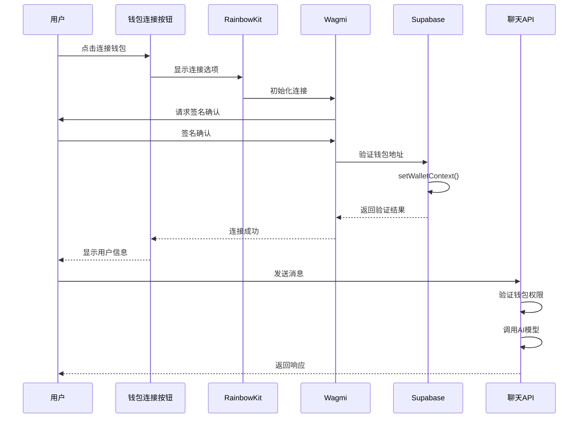
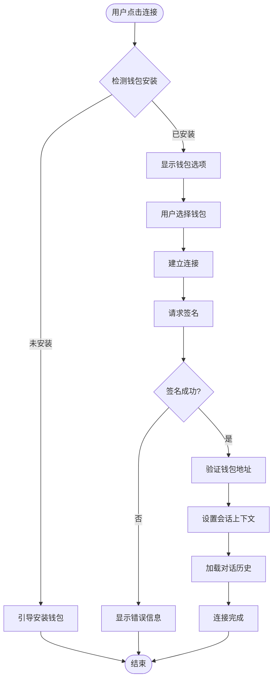
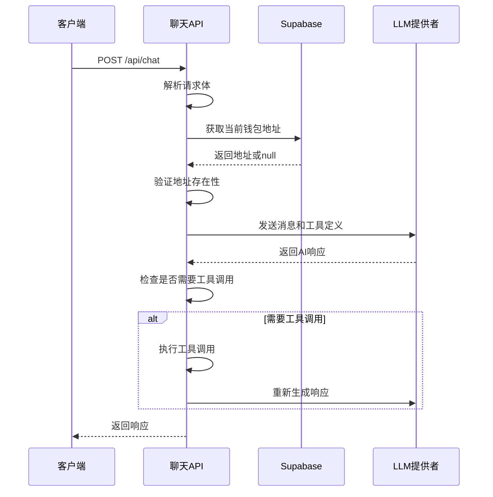
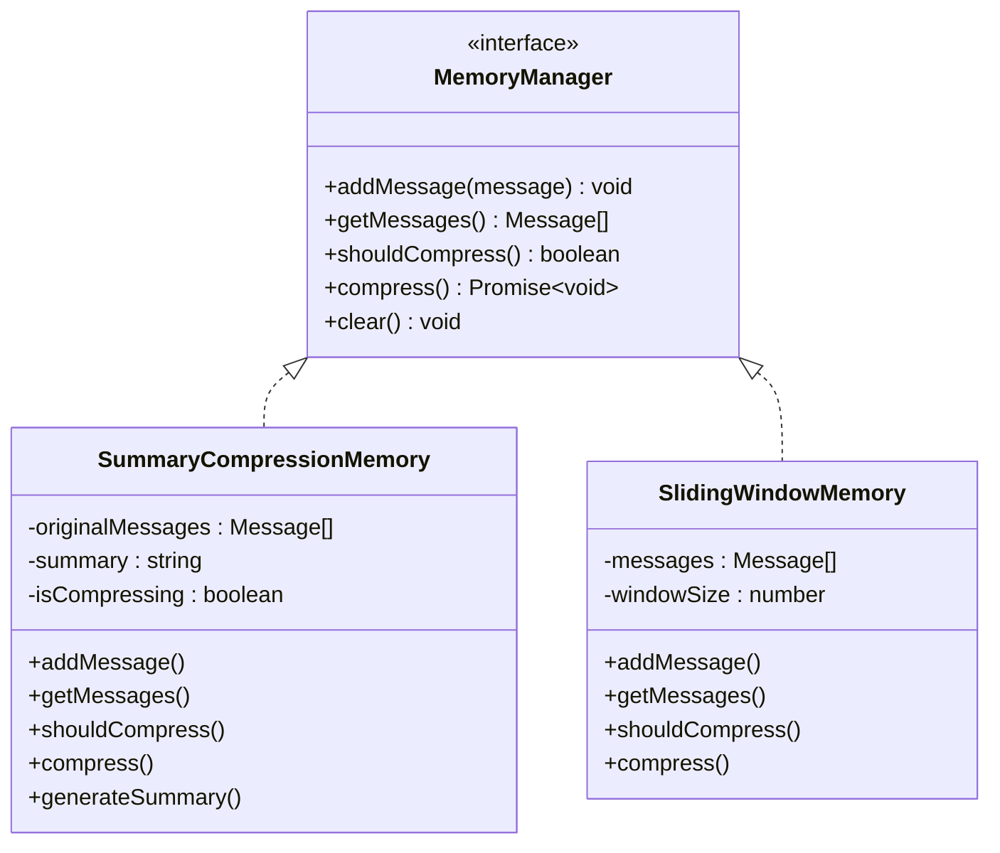
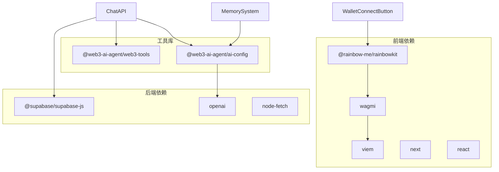
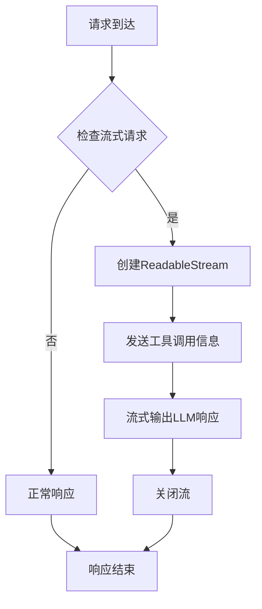
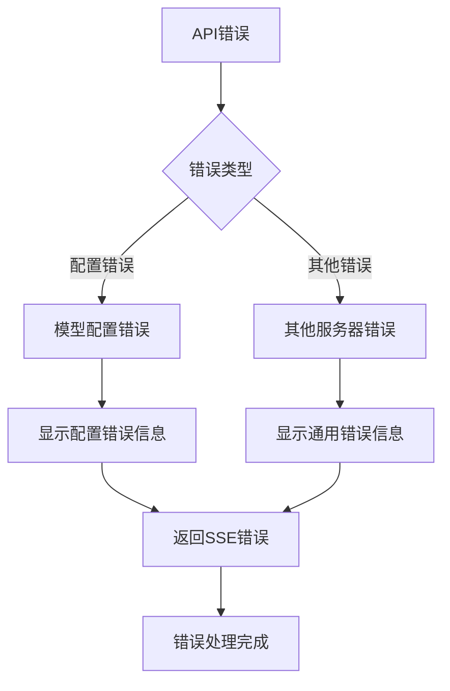

# 钱包认证系统

<cite>
**本文档引用的文件**
- [apps/web/components/WalletConnectButton.tsx](file://apps/web/components/WalletConnectButton.tsx)
- [apps/web/app/api/chat/route.ts](file://apps/web/app/api/chat/route.ts)
- [apps/web/app/api/tools/route.ts](file://apps/web/app/api/tools/route.ts)
- [apps/web/lib/supabase/client.ts](file://apps/web/lib/supabase/client.ts)
- [apps/web/lib/supabase/types.ts](file://apps/web/lib/supabase/types.ts)
- [apps/web/lib/memory/SummaryCompressionMemory.ts](file://apps/web/lib/memory/SummaryCompressionMemory.ts)
- [apps/web/lib/memory/SlidingWindowMemory.ts](file://apps/web/lib/memory/SlidingWindowMemory.ts)
- [apps/web/hooks/useChatStream.ts](file://apps/web/hooks/useChatStream.ts)
- [apps/web/app/layout.tsx](file://apps/web/app/layout.tsx)
- [apps/web/types/chat.ts](file://apps/web/types/chat.ts)
- [WALLET-LOGIN-SETUP.md](file://WALLET-LOGIN-SETUP.md)
- [README.md](file://README.md)
</cite>

## 目录
1. [简介](#简介)
2. [项目结构](#项目结构)
3. [核心组件](#核心组件)
4. [架构概览](#架构概览)
5. [详细组件分析](#详细组件分析)
6. [依赖关系分析](#依赖关系分析)
7. [性能考虑](#性能考虑)
8. [故障排除指南](#故障排除指南)
9. [结论](#结论)

## 简介

钱包认证系统是 Web3 AI Agent 项目的核心功能模块，实现了基于以太坊钱包的身份验证和授权机制。该系统集成了 RainbowKit、Wagmi 和 Viem 等主流 Web3 工具库，提供了完整的钱包连接、身份验证和会话管理功能。

系统的主要特点包括：
- 支持 MetaMask、WalletConnect、Coinbase Wallet 等主流钱包
- 基于 Supabase 的云端对话历史持久化
- 流式响应的聊天体验
- 多链支持的 Web3 工具调用
- 内存管理和对话历史压缩

## 项目结构

该项目采用 Next.js 14 App Router 架构，主要目录结构如下：

**图表来源**
- [apps/web/app/layout.tsx:16-34](file://apps/web/app/layout.tsx#L16-L34)
- [README.md:26-38](file://README.md#L26-L38)

**章节来源**
- [apps/web/app/layout.tsx:16-34](file://apps/web/app/layout.tsx#L16-L34)
- [README.md:26-38](file://README.md#L26-L38)

## 核心组件

### 钱包连接组件

WalletConnectButton 是系统中最核心的 UI 组件，负责处理用户的钱包连接操作：

**图表来源**
- [apps/web/components/WalletConnectButton.tsx:5-16](file://apps/web/components/WalletConnectButton.tsx#L5-L16)

### Supabase 钱包认证

系统使用 Supabase 作为后端服务，提供钱包地址验证和会话管理：

**图表来源**
- [apps/web/lib/supabase/client.ts:18-53](file://apps/web/lib/supabase/client.ts#L18-L53)

**章节来源**
- [apps/web/components/WalletConnectButton.tsx:5-16](file://apps/web/components/WalletConnectButton.tsx#L5-L16)
- [apps/web/lib/supabase/client.ts:18-53](file://apps/web/lib/supabase/client.ts#L18-L53)

## 架构概览

系统采用分层架构设计，从底层到顶层的交互流程如下：

**图表来源**
- [apps/web/components/WalletConnectButton.tsx:5-16](file://apps/web/components/WalletConnectButton.tsx#L5-L16)
- [apps/web/lib/supabase/client.ts:34-46](file://apps/web/lib/supabase/client.ts#L34-L46)
- [apps/web/app/api/chat/route.ts:135-169](file://apps/web/app/api/chat/route.ts#L135-L169)

## 详细组件分析

### 钱包连接流程

钱包连接系统实现了完整的 Web3 身份验证流程：

**图表来源**
- [apps/web/components/WalletConnectButton.tsx:5-16](file://apps/web/components/WalletConnectButton.tsx#L5-L16)
- [apps/web/lib/supabase/client.ts:34-46](file://apps/web/lib/supabase/client.ts#L34-L46)

### 聊天API认证机制

聊天 API 实现了双重认证机制，确保只有已连接钱包的用户才能访问：

**图表来源**
- [apps/web/app/api/chat/route.ts:135-319](file://apps/web/app/api/chat/route.ts#L135-L319)
- [apps/web/lib/supabase/client.ts:44-46](file://apps/web/lib/supabase/client.ts#L44-L46)

### 内存管理系统

系统实现了两种内存管理策略来优化对话历史存储：

**图表来源**
- [apps/web/lib/memory/SummaryCompressionMemory.ts:5-110](file://apps/web/lib/memory/SummaryCompressionMemory.ts#L5-L110)
- [apps/web/lib/memory/SlidingWindowMemory.ts:11-56](file://apps/web/lib/memory/SlidingWindowMemory.ts#L11-L56)

**章节来源**
- [apps/web/app/api/chat/route.ts:135-319](file://apps/web/app/api/chat/route.ts#L135-L319)
- [apps/web/lib/memory/SummaryCompressionMemory.ts:5-110](file://apps/web/lib/memory/SummaryCompressionMemory.ts#L5-L110)
- [apps/web/lib/memory/SlidingWindowMemory.ts:11-56](file://apps/web/lib/memory/SlidingWindowMemory.ts#L11-L56)

## 依赖关系分析

系统的关键依赖关系如下：

**图表来源**
- [apps/web/components/WalletConnectButton.tsx:3](file://apps/web/components/WalletConnectButton.tsx#L3)
- [apps/web/app/api/chat/route.ts:2-5](file://apps/web/app/api/chat/route.ts#L2-L5)

**章节来源**
- [apps/web/components/WalletConnectButton.tsx:3](file://apps/web/components/WalletConnectButton.tsx#L3)
- [apps/web/app/api/chat/route.ts:2-5](file://apps/web/app/api/chat/route.ts#L2-L5)

## 性能考虑

### 流式响应优化

系统实现了高效的流式响应机制，通过 Server-Sent Events (SSE) 提供实时聊天体验：

**图表来源**
- [apps/web/app/api/chat/route.ts:259-307](file://apps/web/app/api/chat/route.ts#L259-L307)
- [apps/web/hooks/useChatStream.ts:77-117](file://apps/web/hooks/useChatStream.ts#L77-L117)

### 内存管理策略

系统提供了两种内存管理策略来平衡性能和存储效率：

| 策略 | 特点 | 适用场景 | 性能影响 |
|------|------|----------|----------|
| 摘要压缩 | 生成对话摘要，减少存储空间 | 长对话历史 | 高 LLM 调用成本，但存储效率高 |
| 滑动窗口 | 仅保留最近N条消息 | 短对话或实时交互 | 无额外 LLM 调用，内存占用低 |

**章节来源**
- [apps/web/hooks/useChatStream.ts:77-117](file://apps/web/hooks/useChatStream.ts#L77-L117)
- [apps/web/lib/memory/SummaryCompressionMemory.ts:48-74](file://apps/web/lib/memory/SummaryCompressionMemory.ts#L48-L74)
- [apps/web/lib/memory/SlidingWindowMemory.ts:24-34](file://apps/web/lib/memory/SlidingWindowMemory.ts#L24-L34)

## 故障排除指南

### 常见问题及解决方案

#### 钱包连接问题

| 问题 | 可能原因 | 解决方案 |
|------|----------|----------|
| 钱包无法连接 | 网络问题或钱包未安装 | 检查网络连接，安装支持的钱包 |
| 签名失败 | 用户拒绝签名或钱包异常 | 重新连接钱包，检查浏览器扩展 |
| 地址验证失败 | 地址格式不正确 | 检查钱包地址格式（0x开头，42字符） |

#### Supabase 连接问题

| 问题 | 可能原因 | 解决方案 |
|------|----------|----------|
| 环境变量缺失 | .env.local 文件配置错误 | 检查 NEXT_PUBLIC_SUPABASE_URL 和 NEXT_PUBLIC_SUPABASE_ANON_KEY |
| 数据库连接失败 | 网络问题或服务不可用 | 检查 Supabase 服务状态，使用代理访问 |
| 权限不足 | 匿名访问被限制 | 配置适当的 RLS 规则 |

#### API 错误处理

系统实现了完善的错误处理机制：

**图表来源**
- [apps/web/app/api/chat/route.ts:360-404](file://apps/web/app/api/chat/route.ts#L360-L404)

**章节来源**
- [apps/web/app/api/chat/route.ts:360-404](file://apps/web/app/api/chat/route.ts#L360-L404)
- [WALLET-LOGIN-SETUP.md:96-101](file://WALLET-LOGIN-SETUP.md#L96-L101)

## 结论

钱包认证系统成功地将 Web3 技术与 AI Agent 功能相结合，提供了完整的去中心化身份验证解决方案。系统的主要优势包括：

1. **安全性**：基于以太坊钱包的去中心化身份验证，无需传统用户名密码
2. **用户体验**：无缝的钱包连接体验，支持多种主流钱包
3. **可扩展性**：模块化的架构设计，易于添加新的 Web3 工具和功能
4. **性能优化**：智能的内存管理和流式响应机制

未来可以考虑的功能增强包括：
- 更完善的 RLS 规则实现
- 多对话管理功能
- 离线缓存支持
- 更丰富的钱包集成选项

该系统为 Web3 应用的开发提供了坚实的基础，展示了去中心化身份验证在现代 AI 应用中的实际应用场景。