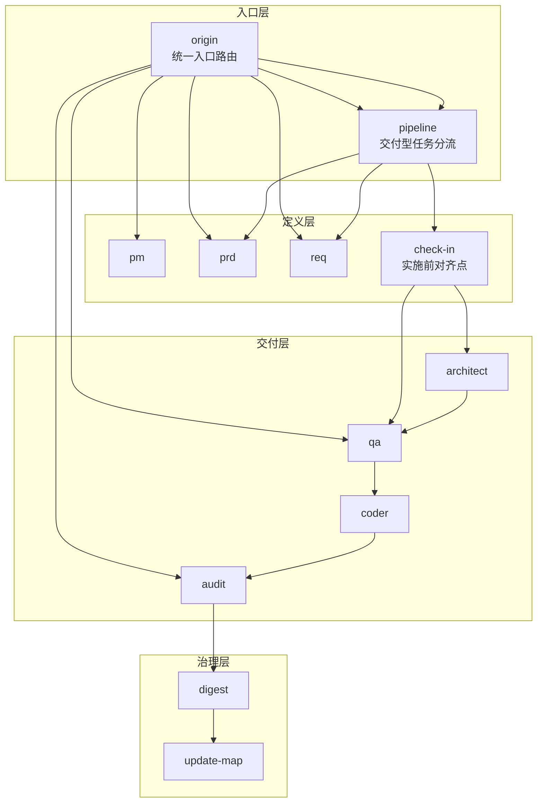
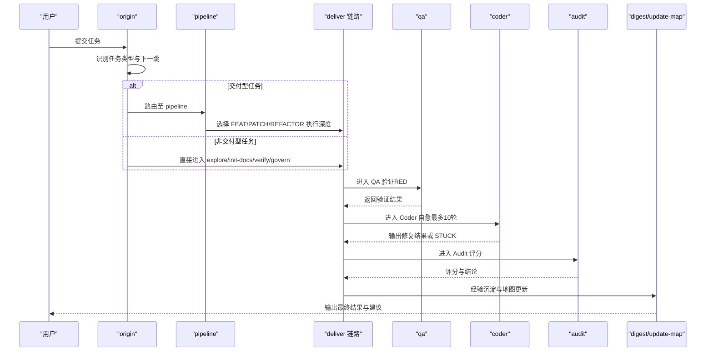
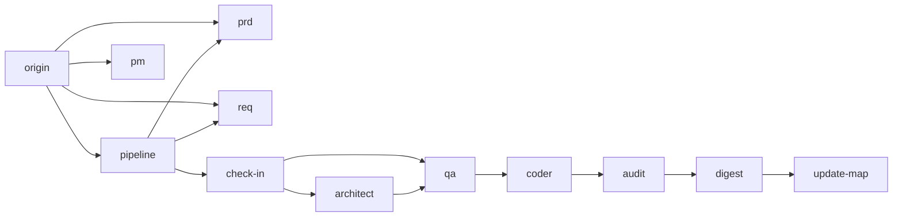

# 错误处理与降级策略

<cite>
**本文引用的文件**
- [SKILL.md](file://skills/web3-ai-agent/SKILL.md)
- [SKILL-SYSTEM-DESIGN-V3.md](file://skills/web3-ai-agent/SKILL-SYSTEM-DESIGN-V3.md)
- [MAP-V3.md](file://skills/web3-ai-agent/MAP-V3.md)
- [origin/ SKILL.md](file://skills/web3-ai-agent/origin/SKILL.md)
- [architect/ SKILL.md](file://skills/web3-ai-agent/architect/SKILL.md)
- [coder/ SKILL.md](file://skills/web3-ai-agent/coder/ SKILL.md)
- [qa/ SKILL.md](file://skills/web3-ai-agent/qa/ SKILL.md)
- [audit/ SKILL.md](file://skills/web3-ai-agent/audit/ SKILL.md)
- [pipeline/ SKILL.md](file://skills/web3-ai-agent/pipeline/ SKILL.md)
- [check-in/ SKILL.md](file://skills/web3-ai-agent/check-in/ SKILL.md)
- [COMMANDS.md](file://skills/web3-ai-agent/COMMANDS.md)
</cite>

## 目录
1. [简介](#简介)
2. [项目结构](#项目结构)
3. [核心组件](#核心组件)
4. [架构总览](#架构总览)
5. [详细组件分析](#详细组件分析)
6. [依赖关系分析](#依赖关系分析)
7. [性能考量](#性能考量)
8. [故障排查指南](#故障排查指南)
9. [结论](#结论)
10. [附录](#附录)

## 简介
本文件面向Web3工具链的错误处理与降级策略，聚焦于工具参数无效、工具执行失败、外部API超时或返回异常等常见异常场景，结合项目已有的流程规则与质量门禁，给出可落地的错误处理机制、降级回复设计原则、异常分类与处理流程、用户友好提示与下一步建议，以及风险控制原则（确保不输出虚构数据）。文档同时提供可视化流程图与序列图，帮助开发者快速理解与落地。

## 项目结构
该项目采用“入口路由 + 分层执行 + 质量门禁”的技能体系，围绕 origin → pipeline → deliver 链路构建，辅以 check-in、qa、audit、digest、update-map 等关键节点，形成可分流、可裁剪、可自愈的执行骨架。

图表来源
- [SKILL.md:15-158](file://skills/web3-ai-agent/SKILL.md#L15-L158)
- [SKILL-SYSTEM-DESIGN-V3.md:265-285](file://skills/web3-ai-agent/SKILL-SYSTEM-DESIGN-V3.md#L265-L285)

章节来源
- [SKILL.md:15-158](file://skills/web3-ai-agent/SKILL.md#L15-L158)
- [MAP-V3.md:86-166](file://skills/web3-ai-agent/MAP-V3.md#L86-L166)

## 核心组件
- 入口路由 origin：负责任务类型识别与下一跳决策，避免跳过任务判断与直接进入实施链路。
- 交付分流 pipeline：仅对 DELIVER-FEAT/PATCH/REFACTOR 三类任务进行执行深度选择。
- 实施前门禁 check-in：强制对实施型任务进行对齐，明确范围、上下文、方案与产物。
- 质量门禁 QA/Audit：QA 以 RED/GREEN 红绿灯规则验证，Audit 以评分规则判定通过与否。
- 编码自愈 coder：最多 10 轮自愈循环，超限则终止并人工介入。

章节来源
- [origin/ SKILL.md:12-125](file://skills/web3-ai-agent/origin/SKILL.md#L12-L125)
- [pipeline/ SKILL.md:1-89](file://skills/web3-ai-agent/pipeline/ SKILL.md#L1-L89)
- [check-in/ SKILL.md:395-436](file://skills/web3-ai-agent/check-in/ SKILL.md#L395-L436)
- [SKILL-SYSTEM-DESIGN-V3.md:700-719](file://skills/web3-ai-agent/SKILL-SYSTEM-DESIGN-V3.md#L700-L719)

## 架构总览
下图展示从入口到交付与治理的典型路径，以及质量门禁的关键节点。

图表来源
- [SKILL.md:15-158](file://skills/web3-ai-agent/SKILL.md#L15-L158)
- [SKILL-SYSTEM-DESIGN-V3.md:700-719](file://skills/web3-ai-agent/SKILL-SYSTEM-DESIGN-V3.md#L700-L719)

## 详细组件分析

### 入口路由 origin 的错误处理与降级原则
- 任务类型识别：若输入模糊或无法归类，origin 应输出“任务判断”与“下一跳建议”，并引导至 DEFINE 或探索类 skill，避免直接进入实施链路。
- 降级策略：当外部输入缺少关键上下文时，优先退回至 pm/prd/req 明确范围；若仍无法澄清，退回 explore 或 init-docs。
- 用户提示：输出“类型/原因/下一跳/是否进入 pipeline/是否需要 check-in”，并提供下一步可选命令参考。

章节来源
- [origin/ SKILL.md:30-125](file://skills/web3-ai-agent/origin/SKILL.md#L30-L125)
- [COMMANDS.md:20-50](file://skills/web3-ai-agent/COMMANDS.md#L20-L50)

### 交付分流 pipeline 的异常处理
- 参数无效：当输入的 DELIVER 类型不在 FEAT/PATCH/REFACTOR 时，应返回无效参数提示与正确类型建议。
- 降级策略：若上游 check-in 未完成或范围未收敛，退回至 pm/prd/req 或 check-in，直至满足实施条件。
- 用户提示：明确“类型/级别/必经 skill/可跳过 skill/按需插入”。

章节来源
- [pipeline/ SKILL.md:1-89](file://skills/web3-ai-agent/pipeline/ SKILL.md#L1-L89)
- [SKILL.md:41-56](file://skills/web3-ai-agent/SKILL.md#L41-L56)

### 实施前门禁 check-in 的风险控制
- 强制对齐：必须输出“要解决的问题/上下文/方案/不做什么/产物/完成标准/下一跳”，确保范围可控。
- 降级策略：若 check-in 未完成，禁止进入 architect/qa/coder；必要时回退至 pm/prd/req 或重新探索。
- 用户提示：强调“范围边界”“可交付物”“验收标准”，避免伪完成。

章节来源
- [check-in/ SKILL.md:395-436](file://skills/web3-ai-agent/check-in/ SKILL.md#L395-L436)
- [SKILL-SYSTEM-DESIGN-V3.md:246-262](file://skills/web3-ai-agent/SKILL-SYSTEM-DESIGN-V3.md#L246-L262)

### 质量门禁 QA 的红绿灯规则
- RED 目标：先证明“当前未通过”，不直接修复。
- 适用范围：FEAT 默认先 RED；PATCH/REFACTOR 默认不强制完整 RED，但必须保留验证或回归检查。
- 降级策略：若多次 RED 未通过，退回 architect/req 或回滚方案，避免资源浪费。

章节来源
- [SKILL-SYSTEM-DESIGN-V3.md:700-705](file://skills/web3-ai-agent/SKILL-SYSTEM-DESIGN-V3.md#L700-L705)

### 编码自愈 coder 的自愈循环
- 自愈上限：最多 10 轮；超过则终止并输出 STUCK 结论，要求人工介入。
- 降级策略：在每轮自愈中记录失败原因与修复尝试，便于回溯与审计。

章节来源
- [SKILL-SYSTEM-DESIGN-V3.md:706-710](file://skills/web3-ai-agent/SKILL-SYSTEM-DESIGN-V3.md#L706-L710)

### 审计 audit 的评分规则与一票否决
- 评分标准：总分 100；>=80 通过；60-79 软拒绝回退；<60 直接拒绝。
- 一票否决：严重安全问题、关键不变量破坏、高风险边界缺失。
- 降级策略：软拒绝时回退修复；直接拒绝时终止当前方案并输出替代建议。

章节来源
- [SKILL-SYSTEM-DESIGN-V3.md:712-719](file://skills/web3-ai-agent/SKILL-SYSTEM-DESIGN-V3.md#L712-L719)

### 架构设计中的错误处理字段
architect 的输出模板包含“错误处理”字段，用于在结构设计阶段就明确异常路径与风险点，避免遗漏。

章节来源
- [architect/ SKILL.md:20-32](file://skills/web3-ai-agent/architect/ SKILL.md#L20-L32)

## 依赖关系分析
- origin 依赖：pm/prd/req/check-in/pipeline/verify/govern 等多个 skill 的路由能力。
- pipeline 依赖：prq/req/check-in 的前置收敛能力。
- deliver 链路依赖：architect/qa/coder/audit 的质量门禁与自愈能力。
- 治理层依赖：digest/update-map 的沉淀与更新能力。

图表来源
- [SKILL.md:92-158](file://skills/web3-ai-agent/SKILL.md#L92-L158)
- [MAP-V3.md:86-166](file://skills/web3-ai-agent/MAP-V3.md#L86-L166)

章节来源
- [SKILL.md:92-158](file://skills/web3-ai-agent/SKILL.md#L92-L158)
- [MAP-V3.md:86-166](file://skills/web3-ai-agent/MAP-V3.md#L86-L166)

## 性能考量
- 路由分流：通过 origin 与 pipeline 的两级分流，减少不必要的链路开销，提升响应速度。
- 质量前置：在 architect/qa 阶段尽早暴露问题，避免后期大规模返工。
- 自愈上限：coder 的 10 轮自愈限制，防止无限循环导致资源耗尽。
- 降级优先：在外部依赖不稳定时，优先退回至探索或定义阶段，避免阻塞主流程。

## 故障排查指南
- 参数无效
  - 现象：输入任务类型不在 DELIVER-FEAT/PATCH/REFACTOR。
  - 处理：origin 输出“任务判断”与“下一跳建议”，引导至正确类型。
  - 建议：提供斜杠命令参考，降低歧义。
  
  章节来源
  - [origin/ SKILL.md:30-125](file://skills/web3-ai-agent/origin/SKILL.md#L30-L125)
  - [COMMANDS.md:20-50](file://skills/web3-ai-agent/COMMANDS.md#L20-L50)

- 工具执行失败
  - 现象：coder 在 10 轮内未能通过 QA。
  - 处理：输出 STUCK 结论，回退至 architect/req 或回滚方案。
  - 建议：记录失败原因与修复尝试，便于后续审计。
  
  章节来源
  - [SKILL-SYSTEM-DESIGN-V3.md:706-710](file://skills/web3-ai-agent/SKILL-SYSTEM-DESIGN-V3.md#L706-L710)

- 外部API超时或异常
  - 现象：依赖外部服务不可用或返回异常。
  - 处理：退回至探索或定义阶段，优先使用本地上下文；若必须调用，采用指数退避与熔断策略。
  - 建议：在输出中明确“当前不可用/替代方案/重试建议/下一步”。

- 审计不通过
  - 现象：audit 评分低于阈值或触发一票否决。
  - 处理：软拒绝则回退修复；直接拒绝则终止方案并输出替代建议。
  - 建议：在输出中列出风险点与改进建议，确保不输出虚构数据。
  
  章节来源
  - [SKILL-SYSTEM-DESIGN-V3.md:712-719](file://skills/web3-ai-agent/SKILL-SYSTEM-DESIGN-V3.md#L712-L719)

- 用户友好提示与下一步建议
  - 建议：在每个关键节点输出“当前状态/失败原因/可选下一步/风险提示”，并提供斜杠命令示例。
  - 示例：在 origin 输出“类型/原因/下一跳/是否进入 pipeline/是否需要 check-in”；在 audit 输出“评分/结论/风险点/建议”。

  章节来源
  - [origin/ SKILL.md:30-125](file://skills/web3-ai-agent/origin/SKILL.md#L30-L125)
  - [audit/ SKILL.md:1-50](file://skills/web3-ai-agent/audit/ SKILL.md#L1-L50)
  - [COMMANDS.md:52-81](file://skills/web3-ai-agent/COMMANDS.md#L52-L81)

## 结论
本文件基于项目现有的入口路由、交付分流、质量门禁与自愈机制，提出了针对工具参数无效、执行失败、外部API异常等场景的错误处理与降级策略。通过“范围对齐（check-in）+ 质量前置（QA）+ 自愈上限（coder）+ 评分与一票否决（audit）”的组合拳，确保在失败时能够快速止损、透明反馈与稳健降级，同时坚持“不输出虚构数据”的风险控制原则，为开发者提供可落地的用户体验保障方案。

## 附录
- 斜杠命令参考：用于降低路由歧义与提升交互效率。
  
  章节来源
  - [COMMANDS.md:20-50](file://skills/web3-ai-agent/COMMANDS.md#L20-L50)