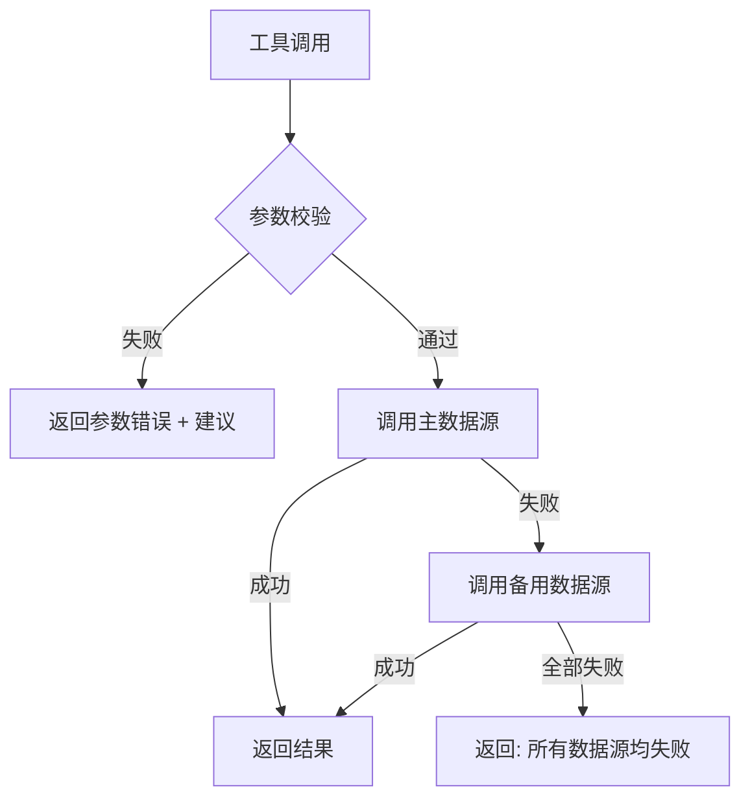

# 错误处理与降级策略

## 异常分类与处理

| 异常类型 | 触发条件 | 处理方式 |
|---------|---------|---------|
| 参数无效 | 不支持的币种/链/地址格式错误 | 返回错误 + 合法值列表 |
| API 超时 | 数据源 10s 内无响应 | 切换备用源; 全失败返回明确错误 |
| 网络不可用 | RPC 节点连接失败 | 返回 "网络不可用" + 重试建议 |
| 数据解析异常 | 返回格式不符预期 | 返回 "数据解析异常" |
| 工具执行失败 | 内部逻辑错误 | 记录日志 + 返回通用错误 |

## 核心原则

1. **绝不伪造数据**: 失败时不输出虚构结果, 明确标注 "数据来源未知" 或 "获取失败"
2. **透明反馈**: 错误信息包含类型、原因、建议的下一步操作
3. **快速止损**: 超时机制 (10s) 防止长时间阻塞

## 降级策略

## 各工具错误处理

| 工具 | 错误场景 | 返回内容 |
|------|---------|---------|
| getTokenPrice | 不支持的币种 | "不支持的币种" + 支持列表 (ETH/BTC/SOL/MATIC/BNB) |
| getTokenPrice | 所有源失败 | "无法获取 [币种] 价格, 所有数据源均失败" |
| getBalance | 地址格式无效 | "无效的钱包地址" + 格式要求 |
| getBalance | 不支持的链 | "不支持的链" + 支持列表 |
| getGasPrice | RPC 连接失败 | "获取 Gas 价格失败" |
| getTokenInfo | Token 未找到 | "未找到 Token 信息" |

## 质量门禁中的错误处理

- **QA 红灯规则**: FEAT 先 RED (证明未通过), 多次失败退回 architect/req
- **Coder 自愈**: 最多 10 轮; 超限输出 STUCK, 人工介入
- **Audit 评分**: >=80 通过, 60-79 软拒绝回退, <60 直接拒绝; 严重安全问题一票否决
