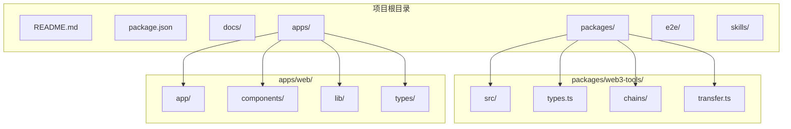
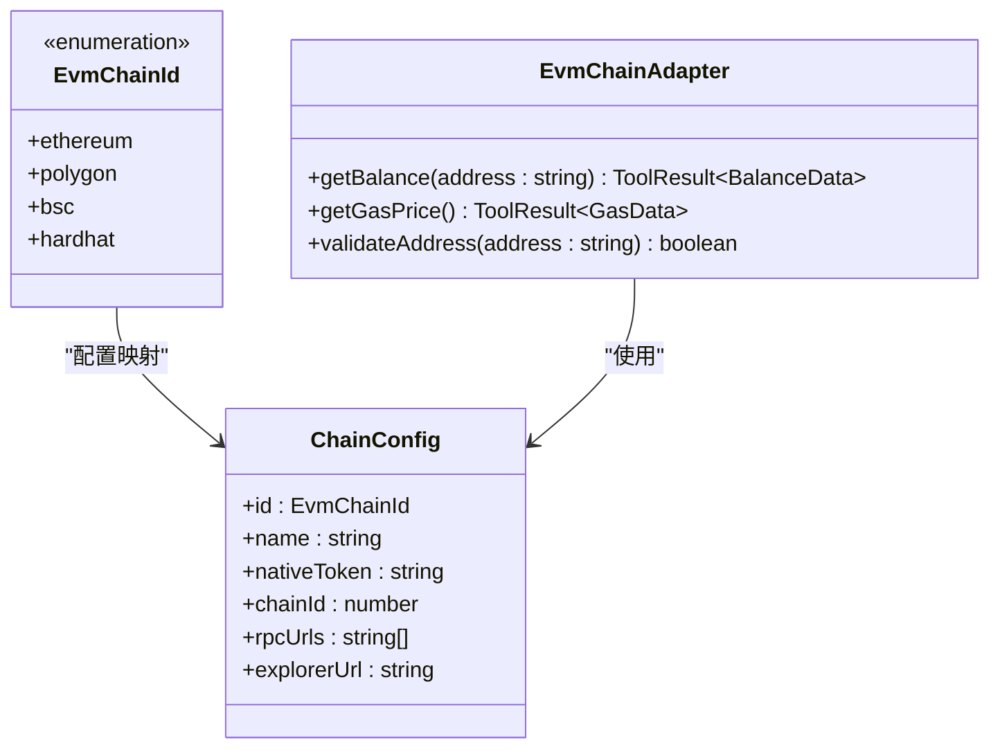
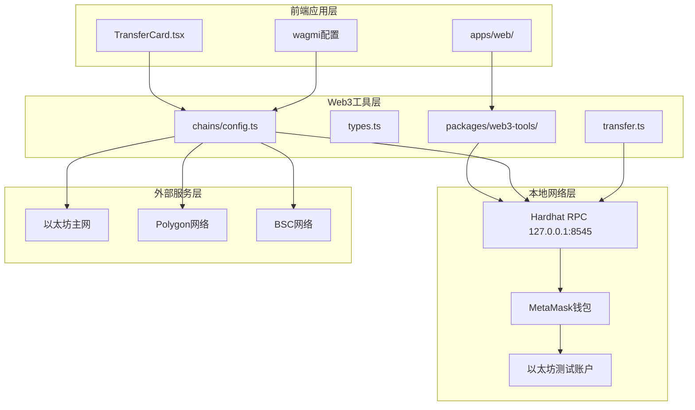
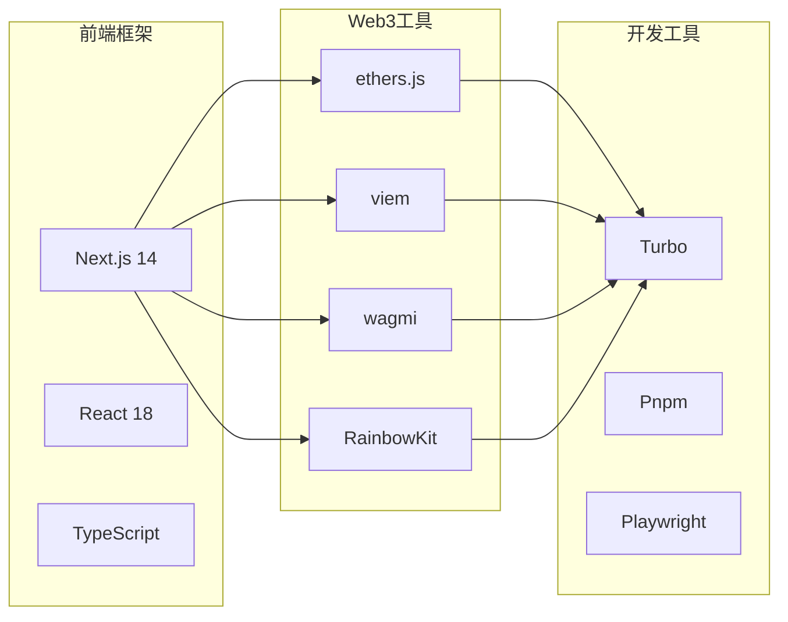

# Hardhat本地网络支持

<cite>
**本文档引用的文件**
- [README.md](file://README.md)
- [package.json](file://package.json)
- [2026-04-29-feat-hardhat-network-support.md](file://docs/changelog/2026-04-29-feat-hardhat-network-support.md)
- [types.ts](file://packages/web3-tools/src/types.ts)
- [config.ts](file://packages/web3-tools/src/chains/config.ts)
- [transfer.ts](file://packages/web3-tools/src/transfer.ts)
- [config.ts](file://apps/web/app/config.ts)
- [TransferCard.tsx](file://apps/web/components/cards/TransferCard.tsx)
- [package.json](file://apps/web/package.json)
</cite>

## 目录
1. [简介](#简介)
2. [项目结构](#项目结构)
3. [核心组件](#核心组件)
4. [架构概览](#架构概览)
5. [详细组件分析](#详细组件分析)
6. [依赖关系分析](#依赖关系分析)
7. [性能考虑](#性能考虑)
8. [故障排除指南](#故障排除指南)
9. [结论](#结论)

## 简介

本文档详细介绍了Web3 AI Agent项目中新增的Hardhat本地网络支持功能。该功能为开发者提供了完整的本地开发环境，包括智能合约调试、钱包连接、转账签名等操作，使用标准的Hardhat本地网络配置（chainId: 31337）。

Hardhat本地网络支持是项目多链架构的重要组成部分，它使得开发者能够在本地环境中进行完整的Web3应用开发和测试，而无需连接到真实的区块链网络。

## 项目结构

Web3 AI Agent项目采用Monorepo架构，主要包含以下关键目录：

**图表来源**
- [README.md:26-38](file://README.md#L26-L38)
- [package.json:30-34](file://package.json#L30-L34)

**章节来源**
- [README.md:26-38](file://README.md#L26-L38)
- [package.json:30-34](file://package.json#L30-L34)

## 核心组件

### EVM链类型扩展

项目的核心在于对EVM链类型的扩展，新增了`hardhat`类型支持：

**图表来源**
- [types.ts:24](file://packages/web3-tools/src/types.ts#L24)
- [types.ts:32](file://packages/web3-tools/src/types.ts#L32)

### 链配置管理

项目实现了集中式的链配置管理系统，支持多种EVM兼容链：

**章节来源**
- [types.ts:24-52](file://packages/web3-tools/src/types.ts#L24-L52)
- [config.ts:22-47](file://packages/web3-tools/src/chains/config.ts#L22-L47)

## 架构概览

Hardhat本地网络支持的实现采用了分层架构设计，确保了良好的可扩展性和维护性：

**图表来源**
- [2026-04-29-feat-hardhat-network-support.md:58-61](file://docs/changelog/2026-04-29-feat-hardhat-network-support.md#L58-L61)
- [config.ts:47-55](file://apps/web/app/config.ts#L47-L55)

## 详细组件分析

### 1. 类型系统扩展

#### EVM链ID类型定义

项目在`types.ts`中扩展了`EvmChainId`类型，新增了`'hardhat'`选项：

**章节来源**
- [types.ts:24](file://packages/web3-tools/src/types.ts#L24)
- [2026-04-29-feat-hardhat-network-support.md:28](file://docs/changelog/2026-04-29-feat-hardhat-network-support.md#L28)

#### 链配置接口

链配置接口定义了所有必要的属性：

**章节来源**
- [types.ts:32-52](file://packages/web3-tools/src/types.ts#L32-L52)

### 2. 链配置管理

#### 默认RPC URL配置

项目实现了默认RPC URL配置系统，支持多个EVM链：

**章节来源**
- [config.ts:6-19](file://packages/web3-tools/src/chains/config.ts#L6-L19)

#### 链配置注册表

链配置注册表提供了集中化的链配置管理：

**章节来源**
- [config.ts:22-47](file://packages/web3-tools/src/chains/config.ts#L22-L47)

#### RPC URL获取逻辑

RPC URL获取函数支持自定义RPC URL覆盖：

**章节来源**
- [config.ts:68-80](file://packages/web3-tools/src/chains/config.ts#L68-L80)

### 3. 转账工具实现

#### CHAIN_MAP映射

转账工具中的CHAIN_MAP映射表：

**章节来源**
- [transfer.ts:9-13](file://packages/web3-tools/src/transfer.ts#L9-L13)

#### Gas估算功能

转账工具提供了完整的Gas估算功能：

**章节来源**
- [transfer.ts:18-80](file://packages/web3-tools/src/transfer.ts#L18-L80)

### 4. 前端集成

#### wagmi配置扩展

前端应用的wagmi配置扩展了对Hardhat网络的支持：

**章节来源**
- [config.ts:47-55](file://apps/web/app/config.ts#L47-L55)

#### TransferCard组件增强

TransferCard组件增加了对Hardhat网络的展示支持：

**章节来源**
- [TransferCard.tsx:59-87](file://apps/web/components/cards/TransferCard.tsx#L59-L87)

### 5. 环境配置

#### 环境变量支持

项目添加了对`NEXT_PUBLIC_HARDHAT_RPC_URL`环境变量的支持：

**章节来源**
- [2026-04-29-feat-hardhat-network-support.md:52-54](file://docs/changelog/2026-04-29-feat-hardhat-network-support.md#L52-L54)

## 依赖关系分析

### 外部依赖

项目使用了现代化的Web3开发工具链：

**图表来源**
- [apps/web/package.json:14-32](file://apps/web/package.json#L14-L32)
- [package.json:18-25](file://package.json#L18-L25)

### 内部模块依赖

项目内部模块之间的依赖关系清晰明确：

**章节来源**
- [apps/web/package.json:19-20](file://apps/web/package.json#L19-L20)

## 性能考虑

### RPC调用优化

项目在RPC调用方面采用了多项优化策略：

1. **默认RPC节点**：使用高性能的公共RPC节点
2. **自定义RPC支持**：允许用户指定自定义RPC节点
3. **错误处理**：完善的RPC连接错误处理机制

### 内存管理

项目实现了高效的内存管理策略：

1. **类型安全**：使用TypeScript确保类型安全
2. **资源清理**：及时清理不再使用的资源
3. **缓存机制**：合理使用缓存减少重复请求

## 故障排除指南

### 常见问题及解决方案

#### Hardhat节点未启动

**问题症状**：转账功能无法使用，出现RPC连接错误

**解决方案**：
1. 确保Hardhat节点正在运行
2. 检查RPC端口是否被占用
3. 验证网络连接

#### 钱包连接问题

**问题症状**：MetaMask无法连接到本地网络

**解决方案**：
1. 确保MetaMask已正确配置本地网络
2. 检查网络ID是否为31337
3. 验证钱包账户是否正确导入

#### 余额查询失败

**问题症状**：无法获取账户余额

**解决方案**：
1. 确认账户地址格式正确
2. 检查RPC连接状态
3. 验证账户是否在本地网络中有资金

### 调试技巧

#### 开发者工具使用

1. **浏览器开发者工具**：监控网络请求和JavaScript错误
2. **Hardhat控制台**：查看本地网络日志
3. **MetaMask调试**：检查交易状态和签名过程

#### 日志记录

项目实现了完整的日志记录机制，便于问题诊断：

**章节来源**
- [2026-04-29-feat-hardhat-network-support.md:63-66](file://docs/changelog/2026-04-29-feat-hardhat-network-support.md#L63-L66)

## 结论

Hardhat本地网络支持功能的实现标志着Web3 AI Agent项目在本地开发体验方面的重大提升。该功能不仅满足了开发者的日常开发需求，还为项目的长期发展奠定了坚实的技术基础。

### 主要成就

1. **完整的本地开发环境**：支持智能合约调试、钱包连接、转账签名等完整功能
2. **标准化配置**：采用标准的Hardhat配置（chainId: 31337）
3. **向后兼容**：不影响现有其他链的配置和功能
4. **易于使用**：提供简洁的配置和使用方式

### 未来发展

基于当前的实现基础，项目团队计划进一步完善本地网络支持：

1. **多本地网络支持**：考虑添加Foundry/Anvil等其他本地网络支持
2. **自动化检测**：添加本地网络自动检测逻辑
3. **用户体验优化**：改进本地网络专属UI标识和交互体验

该功能的成功实现展示了项目在Web3技术栈整合方面的专业能力和创新精神，为构建下一代AI驱动的Web3应用提供了强有力的技术支撑。