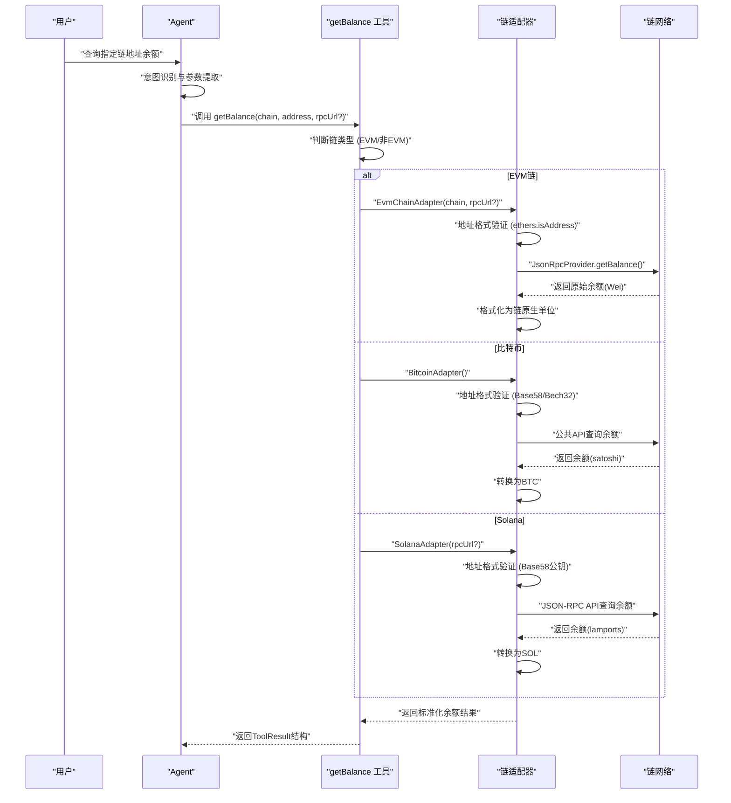
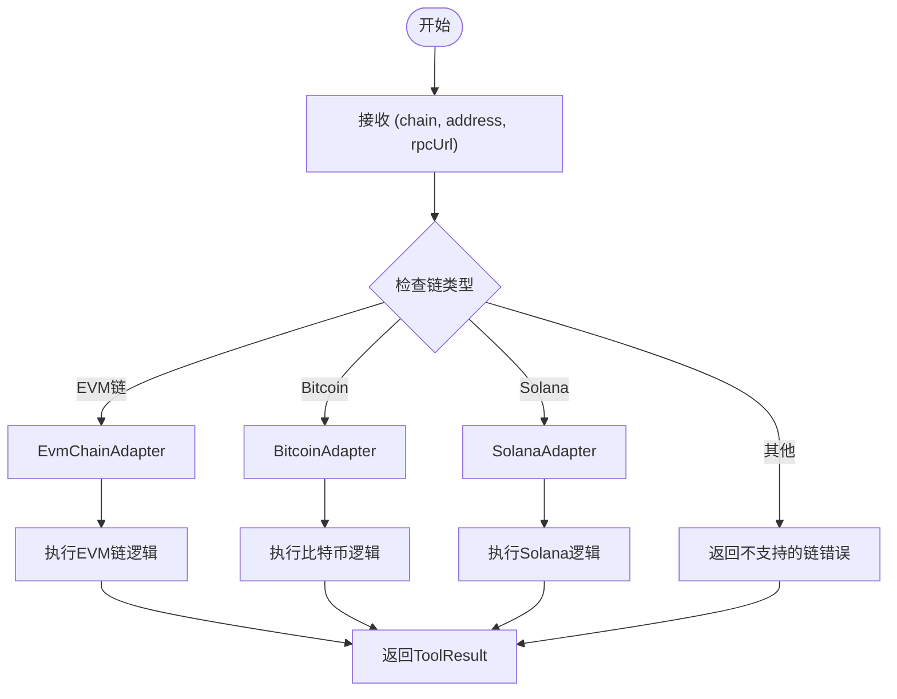
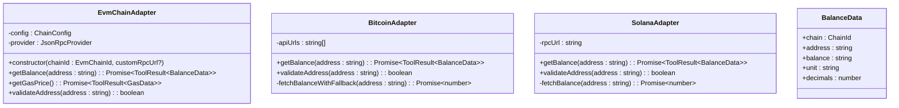

# 钱包余额查询工具

<cite>
**本文引用的文件**
- [balance.ts](file://packages/web3-tools/src/balance.ts)
- [types.ts](file://packages/web3-tools/src/types.ts)
- [index.ts](file://packages/web3-tools/src/index.ts)
- [evm-adapter.ts](file://packages/web3-tools/src/chains/evm-adapter.ts)
- [bitcoin.ts](file://packages/web3-tools/src/chains/bitcoin.ts)
- [solana.ts](file://packages/web3-tools/src/chains/solana.ts)
- [config.ts](file://packages/web3-tools/src/chains/config.ts)
- [gas.ts](file://packages/web3-tools/src/gas.ts)
- [price.ts](file://packages/web3-tools/src/price.ts)
- [package.json](file://packages/web3-tools/package.json)
</cite>

## 更新摘要
**变更内容**
- 新增多链架构支持，包括EVM链（以太坊、Polygon、BSC）和非EVM链（比特币、Solana）的统一查询接口
- 引入链适配器模式，通过EvmChainAdapter、BitcoinAdapter、SolanaAdapter实现链特定功能
- 更新API接口，新增getBalance函数支持多链查询，向后兼容getWalletBalance函数
- 增强类型系统，引入ChainId、EvmChainId、NonEvmChainId等统一链标识类型
- 优化错误处理机制，提供链特定的错误信息和标准化的返回格式

## 目录
1. [简介](#简介)
2. [项目结构](#项目结构)
3. [核心组件](#核心组件)
4. [架构概览](#架构概览)
5. [详细组件分析](#详细组件分析)
6. [依赖分析](#依赖分析)
7. [性能考虑](#性能考虑)
8. [故障排除指南](#故障排除指南)
9. [结论](#结论)
10. [附录](#附录)

## 简介
本文件为钱包余额查询工具（getBalance）的全面技术实现文档。围绕多链架构支持、链适配器模式、统一API接口设计、链特定功能实现、数据来源与准确性保障、与ETH价格工具的协作关系等方面进行系统阐述，并提供面向开发者的集成与使用指导。

## 项目结构
钱包余额查询工具位于`packages/web3-tools`包中，采用模块化设计，提供统一的工具导出接口。该工具作为Web3 AI Agent MVP的核心组件之一，现已支持多链架构，包括EVM链和非EVM链的统一查询能力。

```mermaid
graph TB
subgraph "Web3 Tools 包结构"
BALANCE["balance.ts<br/>多链余额查询"]
TYPES["types.ts<br/>类型定义"]
INDEX["index.ts<br/>工具导出"]
CHAINS["chains/<br/>链适配器模块"]
EVMA["evm-adapter.ts<br/>EVM链适配器"]
BIT["bitcoin.ts<br/>比特币适配器"]
SOL["solana.ts<br/>Solana适配器"]
CONFIG["config.ts<br/>链配置管理"]
END
subgraph "工具接口"
TOOLRESULT["ToolResult<br/>标准化结果接口"]
BALANCEDATA["BalanceData<br/>统一余额数据结构"]
CHAINID["ChainId/EvmChainId<br/>链标识类型"]
END
BALANCE --> TYPES
BALANCE --> CHAINS
CHAINS --> EVMA
CHAINS --> BIT
CHAINS --> SOL
CHAINS --> CONFIG
INDEX --> BALANCE
INDEX --> CHAINS
INDEX --> TYPES
TYPES --> TOOLRESULT
TYPES --> BALANCEDATA
TYPES --> CHAINID
```

**图表来源**
- [index.ts:1-10](file://packages/web3-tools/src/index.ts#L1-L10)
- [types.ts:23-30](file://packages/web3-tools/src/types.ts#L23-L30)

**章节来源**
- [index.ts:1-10](file://packages/web3-tools/src/index.ts#L1-L10)
- [types.ts:23-30](file://packages/web3-tools/src/types.ts#L23-L30)

## 核心组件
- **getBalance 工具**：全新的多链余额查询函数，支持EVM链（以太坊、Polygon、BSC）和非EVM链（比特币、Solana）的统一查询接口，提供链特定的地址验证和数据解析。
- **getWalletBalance 函数**：向后兼容的旧版函数，已标记为@deprecated，内部调用getBalance('ethereum', address)实现相同功能。
- **EvmChainAdapter**：EVM兼容链适配器，提供统一的余额查询、Gas查询和地址验证功能，支持多种EVM链的配置管理。
- **BitcoinAdapter**：比特币链适配器，使用公共API查询余额，支持Base58和Bech32格式地址验证，提供容错的数据源切换。
- **SolanaAdapter**：Solana链适配器，使用JSON-RPC API查询余额，支持Base58编码的公钥地址验证和lamports到SOL的转换。
- **链配置管理系统**：统一管理各链的配置信息，包括RPC节点、Explorer链接、原生代币等，支持环境变量配置和自定义RPC。
- **标准化工具接口**：统一的ToolResult接口，确保所有工具返回一致的结构化结果，包含成功状态、数据、错误信息、时间戳和数据来源。
- **类型安全设计**：完整的TypeScript类型定义，包括ChainId、EvmChainId、NonEvmChainId等统一链标识类型，以及BalanceData等数据结构。

**章节来源**
- [balance.ts:10-38](file://packages/web3-tools/src/balance.ts#L10-L38)
- [evm-adapter.ts:11-112](file://packages/web3-tools/src/chains/evm-adapter.ts#L11-L112)
- [bitcoin.ts:18-125](file://packages/web3-tools/src/chains/bitcoin.ts#L18-L125)
- [solana.ts:21-119](file://packages/web3-tools/src/chains/solana.ts#L21-L119)
- [types.ts:23-61](file://packages/web3-tools/src/types.ts#L23-L61)

## 架构概览
钱包余额查询工具在Agent系统中的调用路径如下，展示了多链架构的支持：



**图表来源**
- [balance.ts:15-29](file://packages/web3-tools/src/balance.ts#L15-L29)
- [evm-adapter.ts:26-62](file://packages/web3-tools/src/chains/evm-adapter.ts#L26-L62)
- [bitcoin.ts:30-68](file://packages/web3-tools/src/chains/bitcoin.ts#L30-L68)
- [solana.ts:33-71](file://packages/web3-tools/src/chains/solana.ts#L33-L71)

**章节来源**
- [balance.ts:15-29](file://packages/web3-tools/src/balance.ts#L15-L29)

## 详细组件分析

### 多链架构支持
- **统一API接口**：新增getBalance函数支持所有受支持的链，通过chain参数指定目标链，提供一致的调用体验。
- **链类型识别**：通过isEvmChain函数判断EVM链，支持'ethereum'、'polygon'、'bsc'三种EVM链。
- **链适配器模式**：根据链类型选择对应的适配器，实现链特定的功能实现和数据处理。
- **向后兼容**：getWalletBalance函数保持原有行为，内部调用getBalance('ethereum', address)。



**图表来源**
- [balance.ts:15-38](file://packages/web3-tools/src/balance.ts#L15-L38)

**章节来源**
- [balance.ts:15-38](file://packages/web3-tools/src/balance.ts#L15-L38)

### 链适配器模式实现
- **EvmChainAdapter**：处理EVM兼容链的通用逻辑，包括地址验证、余额查询、Gas价格查询等功能。
- **BitcoinAdapter**：处理比特币链的特定逻辑，使用公共API查询余额，支持Base58和Bech32地址格式。
- **SolanaAdapter**：处理Solana链的特定逻辑，使用JSON-RPC API查询余额，支持Base58编码的公钥地址。
- **链配置管理**：统一管理各链的配置信息，包括RPC节点、Explorer链接、原生代币等。



**图表来源**
- [evm-adapter.ts:11-112](file://packages/web3-tools/src/chains/evm-adapter.ts#L11-L112)
- [bitcoin.ts:18-125](file://packages/web3-tools/src/chains/bitcoin.ts#L18-L125)
- [solana.ts:21-119](file://packages/web3-tools/src/chains/solana.ts#L21-L119)
- [types.ts:54-61](file://packages/web3-tools/src/types.ts#L54-L61)

**章节来源**
- [evm-adapter.ts:11-112](file://packages/web3-tools/src/chains/evm-adapter.ts#L11-L112)
- [bitcoin.ts:18-125](file://packages/web3-tools/src/chains/bitcoin.ts#L18-L125)
- [solana.ts:21-119](file://packages/web3-tools/src/chains/solana.ts#L21-L119)

### 统一API接口设计
- **函数签名**：`getBalance(chain: ChainId, address: string, rpcUrl?: string): Promise<ToolResult<BalanceData>>`
- **参数验证**：必填chain参数指定链类型，必填address参数，可选rpcUrl参数用于自定义RPC节点。
- **返回值结构**：标准化的ToolResult接口，包含success、data、error、timestamp、source字段。
- **数据结构**：BalanceData包含chain、address、balance、unit、decimals五个核心字段，支持所有链的统一表示。

**章节来源**
- [balance.ts:10-14](file://packages/web3-tools/src/balance.ts#L10-L14)
- [types.ts:54-61](file://packages/web3-tools/src/types.ts#L54-L61)

### 链特定功能实现
- **EVM链余额查询**：使用ethers库的JsonRpcProvider查询余额，支持多种EVM链的配置管理。
- **比特币余额查询**：使用公共API（blockchain.info、blockchair.com）查询余额，支持Base58和Bech32地址格式。
- **Solana余额查询**：使用JSON-RPC API查询余额，支持Base58编码的公钥地址，lamps到SOL的转换。
- **地址格式验证**：每种链都有专门的地址验证逻辑，确保输入的有效性。

**章节来源**
- [evm-adapter.ts:26-62](file://packages/web3-tools/src/chains/evm-adapter.ts#L26-L62)
- [bitcoin.ts:30-68](file://packages/web3-tools/src/chains/bitcoin.ts#L30-L68)
- [solana.ts:33-71](file://packages/web3-tools/src/chains/solana.ts#L33-L71)

### 代码示例与使用方法
以下示例展示getBalance工具的典型使用方法：

**EVM链使用示例**
```typescript
import { getBalance } from '@web3-ai-agent/web3-tools'

// 以太坊余额查询
const ethResult = await getBalance('ethereum', '0x742d35Cc6634C0532925a3b844Bc454e4438f44e')
if (ethResult.success) {
  console.log(`ETH余额: ${ethResult.data.balance} ${ethResult.data.unit}`)
}

// Polygon余额查询
const polygonResult = await getBalance('polygon', '0x...', 'https://your-polygon-rpc.com')

// BSC余额查询
const bscResult = await getBalance('bsc', '0x...')
```

**非EVM链使用示例**
```typescript
// 比特币余额查询
const btcResult = await getBalance('bitcoin', '1A1zP1eP5QGefi2DMPTfTL5SLmv7DivfNa')

// Solana余额查询
const solResult = await getBalance('solana', '4Qte7uT393KJMMvT5k29V7N6Y3Z3q3q3q3q3q3q3q3q3')
```

**错误处理最佳实践**
```typescript
try {
  const result = await getBalance(chain, address)
  if (!result.success) {
    throw new Error(result.error || '未知错误')
  }
  return {
    chain: result.data.chain,
    address: result.data.address,
    balance: result.data.balance,
    unit: result.data.unit
  }
} catch (error) {
  console.error('查询失败:', error.message)
  return null
}
```

**章节来源**
- [balance.ts:10-55](file://packages/web3-tools/src/balance.ts#L10-L55)

### 数据来源说明、准确性保证与延迟处理
- **数据来源透明**：所有结果明确标注source为对应链名称或API名称，确保用户了解数据来源。
- **准确性保障**：通过各链特定的验证逻辑和数值转换，确保余额计算的准确性。
- **延迟处理**：各链查询采用异步模式，避免阻塞主线程；支持超时控制和重试机制。
- **时间戳记录**：每个查询都包含精确的时间戳，便于审计和性能监控。
- **容错机制**：比特币适配器支持多个API源的容错切换，提高可用性。

**章节来源**
- [bitcoin.ts:84-123](file://packages/web3-tools/src/chains/bitcoin.ts#L84-L123)
- [solana.ts:87-117](file://packages/web3-tools/src/chains/solana.ts#L87-L117)

### 与ETH价格工具的协作关系与数据对比
- **协作模式**：余额查询完成后，Agent可根据用户意图选择调用getETHPrice或其他价格查询工具，实现余额与价格的对比展示。
- **数据对比功能**：将各链余额与对应价格相乘得到USD价值，提供更直观的资产概览。
- **统一接口设计**：所有工具共享相同的ToolResult接口，确保调用体验的一致性。
- **错误处理协同**：当RPC节点不可用时，余额查询和价格查询工具都会返回相应的错误信息，便于统一处理。

**章节来源**
- [price.ts:20-83](file://packages/web3-tools/src/price.ts#L20-L83)
- [gas.ts:9-22](file://packages/web3-tools/src/gas.ts#L9-L22)

## 依赖分析
钱包余额查询工具的依赖关系和模块结构如下：

```mermaid
graph TB
subgraph "外部依赖"
ETHERS["ethers ^6.11.0<br/>区块链库"]
NODEFETCH["node-fetch ^3.3.2<br/>HTTP客户端"]
HTTPSAGENT["https-proxy-agent ^7.0.4<br/>代理支持"]
END
subgraph "内部模块"
BALANCE["balance.ts<br/>多链余额查询"]
TYPES["types.ts<br/>类型定义"]
INDEX["index.ts<br/>工具导出"]
CHAINS["chains/<br/>链适配器模块"]
EVMA["evm-adapter.ts<br/>EVM链适配器"]
BIT["bitcoin.ts<br/>比特币适配器"]
SOL["solana.ts<br/>Solana适配器"]
CONFIG["config.ts<br/>链配置管理"]
END
subgraph "工具接口"
TOOLRESULT["ToolResult<br/>标准化结果"]
BALANCEDATA["BalanceData<br/>统一余额数据"]
CHAINID["ChainId<br/>链标识类型"]
END
BALANCE --> TYPES
BALANCE --> CHAINS
CHAINS --> EVMA
CHAINS --> BIT
CHAINS --> SOL
CHAINS --> CONFIG
TYPES --> TOOLRESULT
TYPES --> BALANCEDATA
TYPES --> CHAINID
INDEX --> BALANCE
INDEX --> CHAINS
INDEX --> TYPES
```

**图表来源**
- [package.json:13-17](file://packages/web3-tools/package.json#L13-L17)
- [types.ts:1-86](file://packages/web3-tools/src/types.ts#L1-L86)

**章节来源**
- [package.json:13-17](file://packages/web3-tools/package.json#L13-L17)
- [types.ts:1-86](file://packages/web3-tools/src/types.ts#L1-L86)

## 性能考虑
- **链配置缓存**：链配置信息在模块级别缓存，避免重复查询配置信息。
- **RPC连接池**：EVM链适配器使用ethers库的JsonRpcProvider，支持连接复用和自动重连。
- **HTTP客户端复用**：非EVM链适配器复用HTTP客户端，减少连接开销。
- **内存优化**：使用BigInt处理大整数运算，避免JavaScript精度丢失。
- **错误恢复**：支持RPC节点故障转移和重试机制，提高系统可用性。
- **类型安全**：完整的TypeScript定义，编译时发现潜在问题，减少运行时错误。

## 故障排除指南
- **链类型错误**：检查chain参数是否为受支持的链类型（'ethereum'、'polygon'、'bsc'、'bitcoin'、'solana'）。
- **地址格式错误**：检查地址是否符合对应链的格式要求，EVM链使用0x前缀的42字符十六进制地址，比特币支持Base58和Bech32格式，Solana使用Base58编码的公钥。
- **RPC连接失败**：验证对应链的RPC配置，检查网络连通性，尝试使用不同的RPC节点。
- **API调用失败**：对于非EVM链，检查公共API的可用性，确认代理配置正确。
- **超时错误**：增加超时时间，检查网络性能，考虑使用负载均衡的RPC服务。
- **权限问题**：某些RPC节点可能限制访问频率，需要使用付费服务或多个备用节点。

**章节来源**
- [balance.ts:31-37](file://packages/web3-tools/src/balance.ts#L31-L37)
- [evm-adapter.ts:28-36](file://packages/web3-tools/src/chains/evm-adapter.ts#L28-L36)
- [bitcoin.ts:32-40](file://packages/web3-tools/src/chains/bitcoin.ts#L32-L40)
- [solana.ts:35-42](file://packages/web3-tools/src/chains/solana.ts#L35-L42)

## 结论
钱包余额查询工具通过引入多链架构支持、链适配器模式、统一API接口设计和链特定功能实现，为Web3 AI Agent提供了全面的跨链数据查询能力。工具的模块化设计和类型安全特性确保了良好的可维护性和扩展性，支持EVM链和非EVM链的统一查询接口，为MVP阶段的核心功能提供了坚实的技术基础。

## 附录
- **支持的链类型**：'ethereum'、'polygon'、'bsc'（EVM链），'bitcoin'、'solana'（非EVM链）
- **环境变量配置**：ETHEREUM_RPC_URL、POLYGON_RPC_URL、BSC_RPC_URL、SOLANA_RPC_URL用于配置自定义RPC节点
- **错误码约定**：使用ToolResult接口的error字段返回具体错误信息
- **版本兼容性**：支持ethers库6.x版本，确保与最新区块链功能兼容
- **最佳实践**：建议在生产环境中配置多个备用RPC节点以提高可用性，合理设置超时时间和重试机制

**章节来源**
- [balance.ts:4-5](file://packages/web3-tools/src/balance.ts#L4-L5)
- [types.ts:23-61](file://packages/web3-tools/src/types.ts#L23-L61)