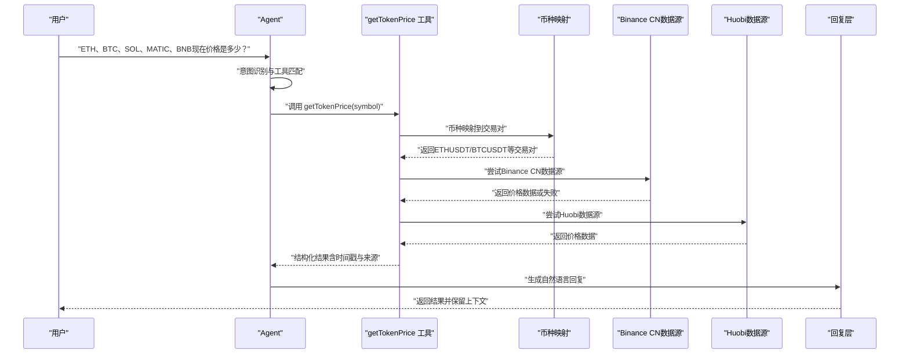
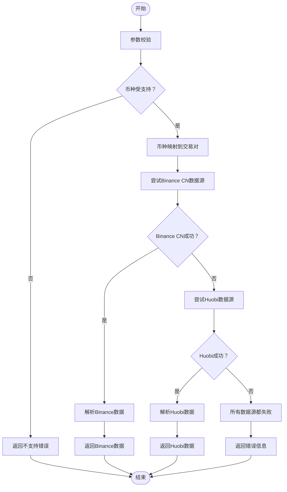

# ETH价格查询工具

<cite>
**本文引用的文件**
- [price.ts](file://packages/web3-tools/src/price.ts)
- [route.ts](file://apps/web/app/api/tools/route.ts)
- [types.ts](file://packages/web3-tools/src/types.ts)
- [package.json](file://packages/web3-tools/package.json)
- [package.json](file://apps/web/package.json)
- [test-phase1.ts](file://packages/web3-tools/test-phase1.ts)
- [Web3-AI-Agent-PRD-MVP.md](file://docs/Web3-AI-Agent-PRD-MVP.md)
</cite>

## 更新摘要
**所做更改**
- 工具已重构为多币种支持，新增 `getTokenPrice` 统一接口
- 支持ETH、BTC、SOL、MATIC、BNB等多种加密货币的价格查询
- `getETHPrice` 和 `getBTCPrice` 现在作为向后兼容的包装函数
- 新增币种映射机制和统一的TokenPriceData类型
- 保持了原有的双数据源故障容错架构和代理支持机制

## 目录
1. [简介](#简介)
2. [项目结构](#项目结构)
3. [核心组件](#核心组件)
4. [架构总览](#架构总览)
5. [详细组件分析](#详细组件分析)
6. [依赖分析](#依赖分析)
7. [性能考虑](#性能考虑)
8. [故障排查指南](#故障排查指南)
9. [结论](#结论)
10. [附录](#附录)

## 简介
本文件围绕多币种价格查询工具进行全面的技术实现说明，涵盖统一接口设计、币种映射机制、双数据源故障容错架构、API调用流程、实时性保障、错误处理、API接口设计、缓存策略、更新频率与精度控制、与其他工具的协作关系以及集成最佳实践。

根据项目 PRD，getTokenPrice 工具属于 MVP 必做 Web3 工具之一，用于提供"可信、可溯源"的多种加密货币价格数据，避免模型主观捏造链上数据。经过重大重构后，工具现已支持五种主流加密货币的价格查询，显著提升了系统的实用性和覆盖面。

**章节来源**
- [Web3-AI-Agent-PRD-MVP.md:94-96](file://docs/Web3-AI-Agent-PRD-MVP.md#L94-L96)
- [Web3-AI-Agent-PRD-MVP.md:147-155](file://docs/Web3-AI-Agent-PRD-MVP.md#L147-L155)

## 项目结构
该项目采用"技能（Skill）系统"组织工具与流程，getTokenPrice 作为 Web3 工具之一，遵循统一的技能入口与流程规范。关键文件与职责如下：

- **packages/web3-tools/src/price.ts**：核心价格查询逻辑，实现多币种支持和双数据源故障容错
- **apps/web/app/api/tools/route.ts**：Web应用API路由，处理HTTP请求和工具分发
- **packages/web3-tools/src/types.ts**：类型定义，确保数据结构的一致性
- **apps/web/package.json**：应用依赖，包含代理支持和网络客户端
- **PRD 文档**：定义工具范围、数据来源要求与风险控制原则

```mermaid
graph TB
subgraph "核心工具层"
PT["price.ts<br/>多币种价格查询<br/>getTokenPrice/getETHPrice/getBTCPrice"]
TT["types.ts<br/>类型定义<br/>TokenPriceData/ToolResult"]
end
subgraph "应用层"
RT["route.ts<br/>API路由与工具分发<br/>getTokenPrice/getETHPrice/getBTCPrice"]
PKG["package.json<br/>应用依赖配置"]
END
subgraph "数据源"
BIN["Binance CN API<br/>ETHUSDT/BTCUSDT/SOLUSDT/MATICUSDT/BNBUSDT"]
HUB["Huobi API<br/>ethusdt/btcusdt/solusdt/maticusdt/bnbusdt"]
END
PT --> TT
RT --> PT
RT --> PKG
PT --> BIN
PT --> HUB
```

**图表来源**
- [price.ts:1-125](file://packages/web3-tools/src/price.ts#L1-L125)
- [route.ts:1-50](file://apps/web/app/api/tools/route.ts#L1-L50)
- [types.ts:1-58](file://packages/web3-tools/src/types.ts#L1-L58)

**章节来源**
- [price.ts:1-125](file://packages/web3-tools/src/price.ts#L1-L125)
- [route.ts:1-50](file://apps/web/app/api/tools/route.ts#L1-L50)
- [types.ts:1-58](file://packages/web3-tools/src/types.ts#L1-L58)

## 核心组件
- **getTokenPrice 工具**：统一的多币种价格查询接口，支持ETH、BTC、SOL、MATIC、BNB等多种加密货币
- **向后兼容包装函数**：getETHPrice 和 getBTCPrice 作为 getTokenPrice 的包装函数
- **币种映射机制**：SYMBOL_MAP 将币种符号映射到对应的交易对
- **双数据源架构**：支持 Binance CN 和 Huobi 数据源，自动故障转移
- **代理支持**：可选的HTTPS代理配置，增强网络连接的灵活性
- **超时处理**：10秒超时机制，防止长时间等待影响用户体验
- **错误处理与降级**：参数校验失败、外部 API 超时或异常、高风险问题保守回复
- **类型安全**：完整的TypeScript类型定义，确保数据结构一致性

**章节来源**
- [Web3-AI-Agent-PRD-MVP.md:94-96](file://docs/Web3-AI-Agent-PRD-MVP.md#L94-L96)
- [Web3-AI-Agent-PRD-MVP.md:151-155](file://docs/Web3-AI-Agent-PRD-MVP.md#L151-L155)
- [Web3-AI-Agent-PRD-MVP.md:161-171](file://docs/Web3-AI-Agent-PRD-MVP.md#L161-L171)

## 架构总览
getTokenPrice 的调用与集成遵循"意图识别 → 工具调用 → 多币种映射 → 双数据源查询 → 结果回填 → 自然语言回复"的 Agent Loop 流程；在工具层之上，统一由 SKILL 主入口进行路由与流程控制。



**图表来源**
- [Web3-AI-Agent-PRD-MVP.md:174-183](file://docs/Web3-AI-Agent-PRD-MVP.md#L174-L183)
- [route.ts:16-28](file://apps/web/app/api/tools/route.ts#L16-L28)
- [price.ts:16-23](file://packages/web3-tools/src/price.ts#L16-L23)

## 详细组件分析

### getTokenPrice 统一接口设计

**更新** 工具已重构为多币种支持，新增统一接口

- **请求参数**
  - symbol：加密货币符号（如 'ETH', 'BTC', 'SOL', 'MATIC', 'BNB'）
  - 支持大写和小写输入，内部自动标准化
- **响应格式**
  - 字段定义
    - symbol：币种符号（string类型）
    - price：价格数值（number类型）
    - change24h：24小时涨跌百分比（number类型）
    - currency：计价货币（固定为USD）
    - source：数据来源标识（Binance CN/Huobi）
    - timestamp：数据时间戳（ISO 8601格式）
  - 时间戳处理
    - 使用 ISO 8601 格式时间戳，便于跨系统对齐
    - 返回时标注"数据来自工具查询，非模型主观生成"
- **错误码与异常**
  - 不支持的币种：返回明确失败说明和可用币种列表
  - 所有数据源都失败：返回降级说明与错误信息
  - 高风险问题：返回数据参考与免责声明

**章节来源**
- [Web3-AI-Agent-PRD-MVP.md:147-155](file://docs/Web3-AI-Agent-PRD-MVP.md#L147-L155)
- [Web3-AI-Agent-PRD-MVP.md:161-171](file://docs/Web3-AI-Agent-PRD-MVP.md#L161-L171)
- [types.ts:11-17](file://packages/web3-tools/src/types.ts#L11-L17)

### 币种映射与向后兼容机制

**更新** 新增币种映射机制和向后兼容包装函数

- **币种映射表**
  - ETH → ETHUSDT（Binance）/ ethusdt（Huobi）
  - BTC → BTCUSDT（Binance）/ btcusdt（Huobi）
  - SOL → SOLUSDT（Binance）/ solusdt（Huobi）
  - MATIC → MATICUSDT（Binance）/ maticusdt（Huobi）
  - BNB → BNBUSDT（Binance）/ bnbusdt（Huobi）
- **向后兼容包装**
  - getETHPrice() → getTokenPrice('ETH')
  - getBTCPrice() → getTokenPrice('BTC')
  - 两个函数标记为 @deprecated，建议使用统一接口
- **标准化处理**
  - 自动将输入转换为大写
  - 支持大小写混合输入
  - 提供详细的错误提示和可用币种列表

**章节来源**
- [price.ts:16-23](file://packages/web3-tools/src/price.ts#L16-L23)
- [price.ts:112-124](file://packages/web3-tools/src/price.ts#L112-L124)

### 双数据源故障容错架构

**更新** 从单一数据源升级为双数据源故障容错架构，支持多币种

- **数据源选择策略**
  - Binance CN：国内可访问的Binance API，提供基础价格信息
  - Huobi：火币网API，提供包含24小时涨跌的数据
- **故障转移机制**
  - 依次尝试每个数据源，直到成功或全部失败
  - 每个数据源失败时记录警告日志并继续尝试下一个
  - 所有数据源都失败时返回统一的错误信息
- **调用流程**
  - 参数校验：确保币种受支持且参数合法
  - 币种映射：将符号转换为对应的交易对
  - 发起请求：设置10秒超时，启用代理支持
  - 结果解析：提取 price/change24h/currency
  - 校验与落盘：记录原始响应与解析后的结构化数据



**图表来源**
- [route.ts:16-28](file://apps/web/app/api/tools/route.ts#L16-L28)
- [price.ts:30-110](file://packages/web3-tools/src/price.ts#L30-L110)

### 代理支持与超时处理机制

**更新** 新增代理支持和超时处理机制

- **代理配置**
  - 支持 HTTPS_PROXY 和 HTTP_PROXY 环境变量
  - 使用 https-proxy-agent 库实现代理功能
  - 代理agent仅在环境变量存在时启用
- **超时处理**
  - 使用 AbortSignal.timeout(10000) 设置10秒超时
  - 防止长时间等待影响用户体验
  - 超时后自动尝试下一个数据源
- **网络请求优化**
  - 统一的fetch客户端配置
  - 错误日志记录，便于调试和监控

**章节来源**
- [price.ts:8-14](file://packages/web3-tools/src/price.ts#L8-L14)
- [price.ts:80-83](file://packages/web3-tools/src/price.ts#L80-L83)

### 类型安全与数据结构

**更新** 增强了类型定义和数据结构安全性，新增TokenPriceData接口

- **ToolResult 类型**
  - success：布尔值，表示请求是否成功
  - data：可选的TokenPriceData对象
  - error：可选的错误信息
  - timestamp：ISO 8601格式的时间戳
  - source：数据来源标识
- **TokenPriceData 类型**
  - symbol：string类型的加密货币符号
  - price：number类型的当前价格
  - change24h：number类型的24小时涨跌百分比
  - currency：string类型的计价货币（固定为USD）
- **向后兼容类型别名**
  - ETHPriceData = TokenPriceData
  - BTCPriceData = TokenPriceData
- **工具函数类型**
  - ToolFunction泛型类型，支持参数和返回值的类型安全

**章节来源**
- [types.ts:3-9](file://packages/web3-tools/src/types.ts#L3-L9)
- [types.ts:11-17](file://packages/web3-tools/src/types.ts#L11-L17)
- [types.ts:19-21](file://packages/web3-tools/src/types.ts#L19-L21)

### 与其他工具的协作关系与依赖管理

**更新** 保持与现有工具的兼容性和协作关系，新增多币种支持

- **与 getWalletBalance 的协作**
  - 两者均为 Web3 数据查询工具，遵循相同的数据来源标注与风险控制原则
  - 在同一 Agent Loop 中可顺序调用，分别返回多币种价格与地址余额
- **与 Agent 调用层的集成**
  - 由统一的工具API路由处理，识别"getTokenPrice"工具名称后调用
  - 支持 symbol 参数传递，向后兼容旧的 getETHPrice 和 getBTCPrice
  - 结果标准化为ToolResult格式，便于Agent处理
- **依赖管理**
  - 外部依赖：ethers、https-proxy-agent、node-fetch等
  - 内部依赖：统一的类型定义、错误处理模板
  - 环境配置：代理服务器配置、API访问权限

**章节来源**
- [Web3-AI-Agent-PRD-MVP.md:94-96](file://docs/Web3-AI-Agent-PRD-MVP.md#L94-L96)
- [route.ts:16-28](file://apps/web/app/api/tools/route.ts#L16-L28)

### 具体调用示例与最佳实践

**更新** 提供新的多币种调用示例，支持ETH、BTC、SOL、MATIC、BNB价格查询

- **调用入口**
  - HTTP POST请求到 `/api/tools`
  - 统一接口：`{ "name": "getTokenPrice", "arguments": { "symbol": "ETH" } }`
  - 向后兼容：`{ "name": "getETHPrice", "arguments": {} }`
  - 向后兼容：`{ "name": "getBTCPrice", "arguments": {} }`
- **参数验证**
  - 支持的币种：ETH、BTC、SOL、MATIC、BNB
  - 自动大小写标准化
  - 未来扩展参数时，在工具层进行白名单与范围校验
- **网络请求最佳实践**
  - 设置10秒超时，避免阻塞主流程
  - 启用代理支持，适应不同网络环境
  - 记录请求与响应日志，便于审计
- **结果解析**
  - 规范化字段与时间戳；标注 source 与 timestamp
  - 处理不同数据源的差异（如24小时涨跌数据）
- **异常处理**
  - 不支持的币种：返回可用币种列表
  - 所有数据源都失败：返回降级说明与错误信息
  - 高风险问题：提供免责声明与保守建议

**章节来源**
- [route.ts:9-35](file://apps/web/app/api/tools/route.ts#L9-L35)
- [Web3-AI-Agent-PRD-MVP.md:185-197](file://docs/Web3-AI-Agent-PRD-MVP.md#L185-L197)
- [test-phase1.ts:1-58](file://packages/web3-tools/test-phase1.ts#L1-L58)

## 依赖分析

**更新** 新增代理支持和网络客户端依赖

- **外部依赖**
  - ethers：以太坊区块链交互库
  - https-proxy-agent：HTTPS代理支持
  - node-fetch：现代HTTP客户端
- **内部依赖**
  - @web3-ai-agent/web3-tools：核心工具包
  - 类型定义：确保编译时类型安全
  - 错误处理模板：统一的失败说明与降级策略
- **环境依赖**
  - HTTPS_PROXY/HTTP_PROXY：可选的代理服务器配置
  - API访问权限：各数据源的访问限制

```mermaid
graph TB
subgraph "应用层依赖"
APP["@web3-ai-agent/web (apps/web)"]
PKG["package.json"]
END
subgraph "核心工具依赖"
W3T["@web3-ai-agent/web3-tools"]
TYPES["types.ts"]
END
subgraph "外部服务"
BIN["Binance CN API"]
HUB["Huobi API"]
END
subgraph "代理支持"
PROXY["https-proxy-agent"]
NODEFETCH["node-fetch"]
END
APP --> W3T
APP --> PKG
W3T --> TYPES
W3T --> BIN
W3T --> HUB
APP --> PROXY
APP --> NODEFETCH
```

**图表来源**
- [package.json:12-22](file://apps/web/package.json#L12-L22)
- [package.json:13-21](file://packages/web3-tools/package.json#L13-L21)

**章节来源**
- [package.json:12-22](file://apps/web/package.json#L12-L22)
- [package.json:13-21](file://packages/web3-tools/package.json#L13-L21)

## 性能考虑

**更新** 新增多数据源性能优化策略，支持多币种

- **网络请求优化**
  - 10秒超时机制，避免长时间等待
  - 代理支持，适应不同网络环境
  - 并发控制：按顺序尝试数据源，避免资源浪费
- **数据源选择策略**
  - 优先选择响应最快的可用数据源
  - 避免同时向多个数据源发起请求
  - 失败时快速切换到下一个数据源
- **内存和缓存**
  - 工具级别无本地缓存，确保数据实时性
  - 依赖外部数据源的缓存策略
- **错误恢复**
  - 自动故障转移，提高成功率
  - 统一的错误处理和降级策略

## 故障排查指南

**更新** 新增多数据源故障排查方法，支持多币种

- **常见问题**
  - 不支持的币种：检查币种符号是否在支持列表中
  - 所有数据源都失败：检查网络连通性与代理配置
  - 代理连接失败：检查HTTPS_PROXY/HTTP_PROXY环境变量
  - 超时问题：检查网络延迟和数据源响应时间
- **排查步骤**
  - 查看日志：请求、响应、错误与耗时
  - 核对时间戳与来源：确保数据可溯源
  - 测试代理配置：验证代理服务器可用性
  - 检查数据源状态：确认各API服务正常运行
  - 回滚变更：在问题扩大前回退最近变更
- **监控指标**
  - 数据源成功率统计
  - 响应时间分布
  - 错误类型分类
  - 代理使用情况

**章节来源**
- [price.ts:97-101](file://packages/web3-tools/src/price.ts#L97-L101)
- [Web3-AI-Agent-PRD-MVP.md:185-197](file://docs/Web3-AI-Agent-PRD-MVP.md#L185-L197)

## 结论

getTokenPrice 工具经过重大重构，从单一币种架构转变为多币种统一接口架构，显著提升了系统的灵活性和实用性。新架构支持 ETH、BTC、SOL、MATIC、BNB 等多种加密货币的价格查询，实现了统一的币种映射机制和向后兼容的包装函数。

通过代理支持、超时处理、类型安全和统一的错误处理机制，工具能够在各种网络环境下稳定运行。现在支持五种主流加密货币的价格查询，大大增强了系统的实用性和覆盖面。

建议在后续版本中进一步完善：

- 增加更多数据源以提高冗余度
- 实现智能数据源选择算法
- 添加缓存机制以提高性能
- 增强监控和告警功能
- 支持更多加密货币和交易对

这些改进将进一步提升工具的实用性和可靠性。

## 附录

- **技能系统总原则与执行骨架**
  - 用最少步骤将任务送入正确路径
  - 对高风险任务增加约束，对低风险任务减少消耗
  - 保留文档沉淀，但不让流程压垮交付效率
- **推荐调用方式**
  - HTTP API：POST /api/tools
  - 统一接口：`{ "name": "getTokenPrice", "arguments": { "symbol": "ETH" } }`
  - 向后兼容：`{ "name": "getETHPrice", "arguments": {} }`
  - 向后兼容：`{ "name": "getBTCPrice", "arguments": {} }`
  - 响应：ToolResult格式的标准结果
- **支持的币种列表**
  - ETH：以太坊
  - BTC：比特币
  - SOL：Solana
  - MATIC：Polygon
  - BNB：币安币
- **环境配置**
  - HTTPS_PROXY/HTTP_PROXY：可选的代理服务器配置
  - API访问权限：根据需要配置各数据源的访问限制

**章节来源**
- [Web3-AI-Agent-PRD-MVP.md:213-228](file://docs/Web3-AI-Agent-PRD-MVP.md#L213-L228)
- [route.ts:9-35](file://apps/web/app/api/tools/route.ts#L9-L35)
- [price.ts:16-23](file://packages/web3-tools/src/price.ts#L16-L23)