# BTC价格查询工具

<cite>
**本文档引用的文件**
- [apps/web/app/api/tools/route.ts](file://apps/web/app/api/tools/route.ts)
- [apps/web/app/api/chat/route.ts](file://apps/web/app/api/chat/route.ts)
- [apps/web/app/page.tsx](file://apps/web/app/page.tsx)
- [apps/web/components/ChatInput.tsx](file://apps/web/components/ChatInput.tsx)
- [apps/web/components/MessageList.tsx](file://apps/web/components/MessageList.tsx)
- [apps/web/components/MessageItem.tsx](file://apps/web/components/MessageItem.tsx)
- [apps/web/types/chat.ts](file://apps/web/types/chat.ts)
- [apps/web/package.json](file://apps/web/package.json)
- [packages/web3-tools/src/index.ts](file://packages/web3-tools/src/index.ts)
- [packages/web3-tools/src/price.ts](file://packages/web3-tools/src/price.ts)
- [packages/web3-tools/src/balance.ts](file://packages/web3-tools/src/balance.ts)
- [packages/web3-tools/src/gas.ts](file://packages/web3-tools/src/gas.ts)
- [packages/web3-tools/src/types.ts](file://packages/web3-tools/src/types.ts)
- [packages/web3-tools/test-phase1.ts](file://packages/web3-tools/test-phase1.ts)
- [README.md](file://README.md)
</cite>

## 更新摘要
**所做更改**
- 更新了BTC价格查询工具的多币种支持功能描述
- 新增了getTokenPrice统一接口的详细说明
- 更新了支持的加密货币列表（ETH、BTC、SOL、MATIC、BNB）
- 修改了向后兼容性说明，强调getBTCPrice作为getTokenPrice('BTC')的包装函数
- 更新了工具API和聊天API中对新getTokenPrice工具的引用
- 增强了多币种价格查询的数据流分析

## 目录
1. [项目简介](#项目简介)
2. [项目结构](#项目结构)
3. [核心组件](#核心组件)
4. [架构概览](#架构概览)
5. [详细组件分析](#详细组件分析)
6. [多币种价格查询功能详解](#多币种价格查询功能详解)
7. [数据流分析](#数据流分析)
8. [性能考虑](#性能考虑)
9. [故障排除指南](#故障排除指南)
10. [总结](#总结)

## 项目简介

BTC价格查询工具是一个基于Next.js构建的Web3 AI Agent应用，现已重构为支持多种加密货币的统一价格查询工具。该工具集成了AI对话能力和Web3链上数据查询功能，为用户提供实时的加密货币价格查询服务，支持BTC、ETH、SOL、MATIC、BNB等多种主流加密货币。

该项目采用现代化的技术栈，包括Next.js 14、React、TypeScript和Tailwind CSS，实现了从需求定义到代码交付的完整SDLC自动化流程。系统支持统一的多币种价格查询、钱包余额查询和Gas价格查询等多种Web3相关功能。

## 项目结构

项目采用monorepo结构，主要分为以下模块：

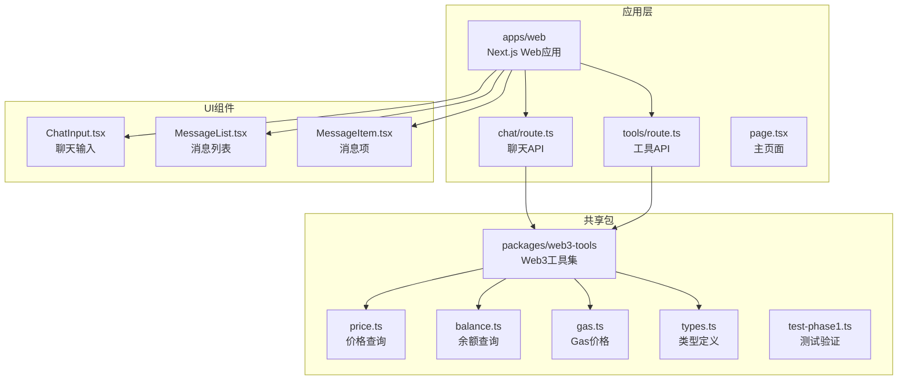

**图表来源**
- [apps/web/app/api/chat/route.ts:1-219](file://apps/web/app/api/chat/route.ts#L1-L219)
- [apps/web/app/api/tools/route.ts:1-50](file://apps/web/app/api/tools/route.ts#L1-L50)
- [packages/web3-tools/src/index.ts:1-7](file://packages/web3-tools/src/index.ts#L1-L7)

**章节来源**
- [README.md:26-38](file://README.md#L26-L38)
- [apps/web/package.json:1-36](file://apps/web/package.json#L1-L36)

## 核心组件

### Web3工具集 (web3-tools)

Web3工具集是整个系统的核心数据层，经过重构后提供了统一的多币种价格查询功能：

- **统一价格查询模块**: 支持ETH、BTC、SOL、MATIC、BNB等多币种价格查询，包含多数据源容错机制
- **向后兼容包装函数**: getBTCPrice和getETHPrice作为getTokenPrice的向后兼容包装函数
- **钱包余额模块**: 查询以太坊钱包地址的ETH余额
- **Gas价格模块**: 获取当前以太坊网络的Gas价格信息
- **统一类型系统**: 定义了标准的工具结果接口和多币种数据结构

### API层

系统提供两个主要的API端点：

- **聊天API** (`/api/chat`): 支持AI对话和工具调用的完整Agent流程，现在使用getTokenPrice工具
- **工具API** (`/api/tools`): 直接调用特定工具的简化接口，支持getBTCPrice等传统工具

### 前端界面

采用响应式设计的聊天界面，包含：
- 实时消息显示
- 加载状态指示
- 错误处理反馈
- 工具调用结果展示

**章节来源**
- [packages/web3-tools/src/index.ts:1-7](file://packages/web3-tools/src/index.ts#L1-L7)
- [apps/web/app/api/chat/route.ts:8-62](file://apps/web/app/api/chat/route.ts#L8-L62)
- [apps/web/app/api/tools/route.ts:1-50](file://apps/web/app/api/tools/route.ts#L1-L50)

## 架构概览

系统采用分层架构设计，实现了清晰的关注点分离，并支持多币种统一查询：

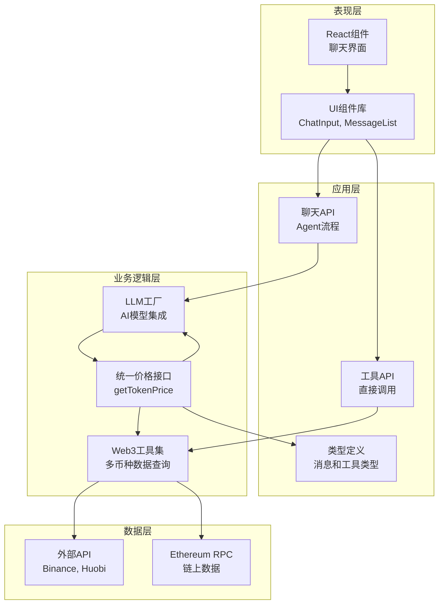

**图表来源**
- [apps/web/app/api/chat/route.ts:1-219](file://apps/web/app/api/chat/route.ts#L1-L219)
- [apps/web/app/api/tools/route.ts:1-50](file://apps/web/app/api/tools/route.ts#L1-L50)
- [packages/web3-tools/src/price.ts:1-125](file://packages/web3-tools/src/price.ts#L1-L125)

## 详细组件分析

### 多币种价格查询组件

多币种价格查询功能是系统的核心特性之一，通过统一的getTokenPrice接口协同工作：

#### 统一价格查询模块 (price.ts)

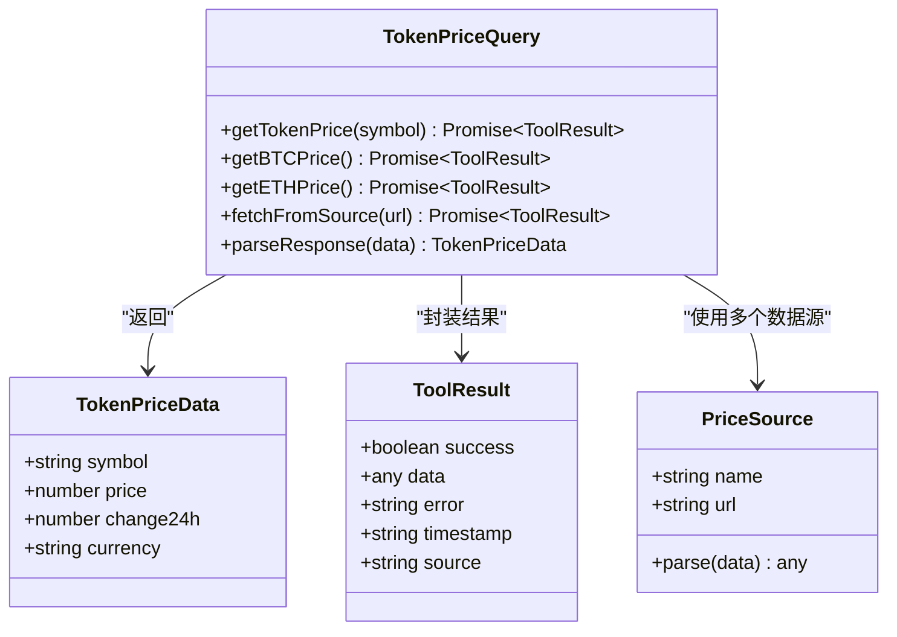

**图表来源**
- [packages/web3-tools/src/price.ts:30-124](file://packages/web3-tools/src/price.ts#L30-L124)
- [packages/web3-tools/src/types.ts:11-21](file://packages/web3-tools/src/types.ts#L11-L21)

#### 多币种支持机制

系统实现了统一的多币种支持，通过SYMBOL_MAP映射不同币种到对应的交易对：

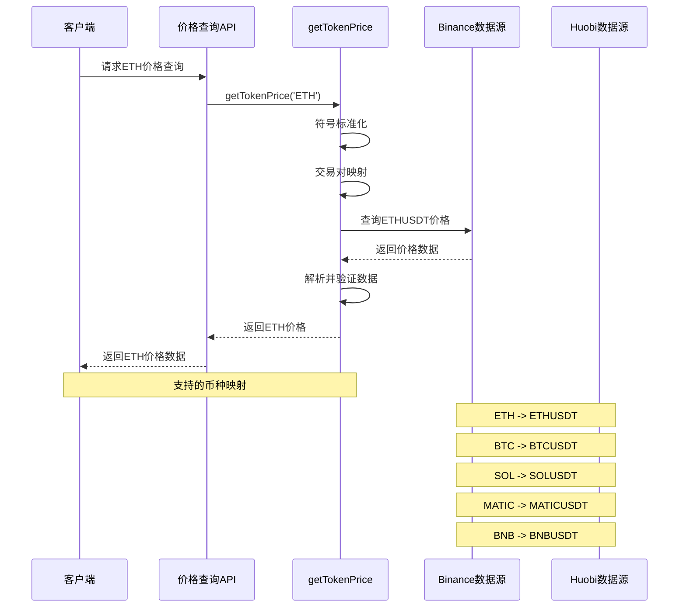

**图表来源**
- [packages/web3-tools/src/price.ts:30-124](file://packages/web3-tools/src/price.ts#L30-L124)
- [packages/web3-tools/src/price.ts:16-23](file://packages/web3-tools/src/price.ts#L16-L23)

**章节来源**
- [packages/web3-tools/src/price.ts:30-124](file://packages/web3-tools/src/price.ts#L30-L124)
- [packages/web3-tools/src/types.ts:11-21](file://packages/web3-tools/src/types.ts#L11-L21)

### 聊天交互组件

#### 主页面 (page.tsx)

主页面实现了完整的聊天界面，现在支持多币种价格查询：

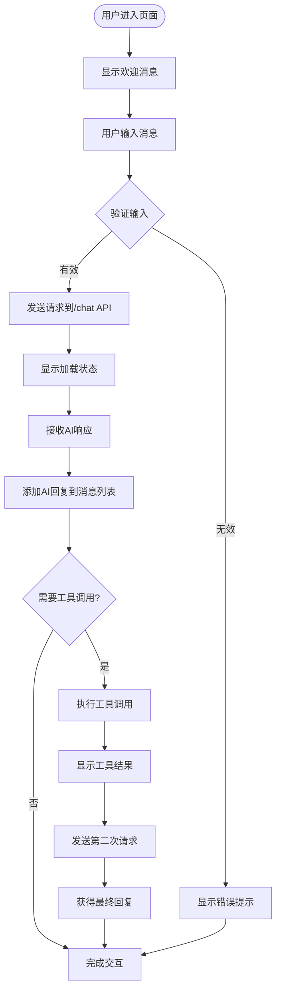

**图表来源**
- [apps/web/app/page.tsx:19-71](file://apps/web/app/page.tsx#L19-L71)

#### 聊天输入组件 (ChatInput.tsx)

聊天输入组件提供了用户友好的输入体验：

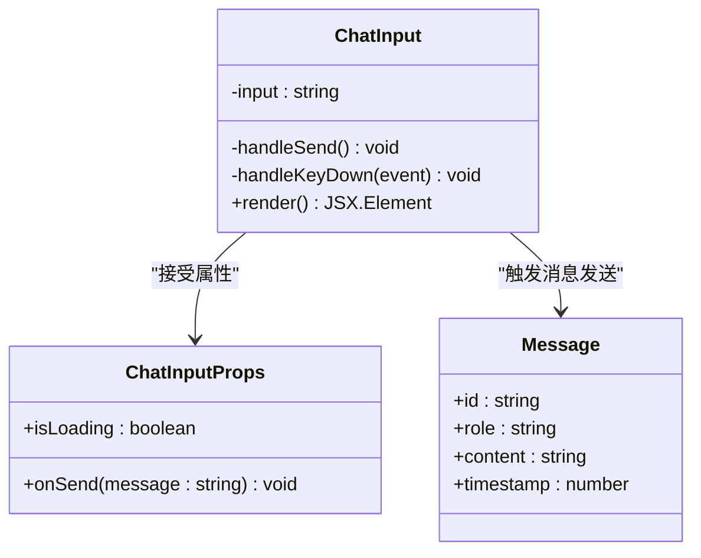

**图表来源**
- [apps/web/components/ChatInput.tsx:5-8](file://apps/web/components/ChatInput.tsx#L5-L8)

**章节来源**
- [apps/web/app/page.tsx:1-106](file://apps/web/app/page.tsx#L1-L106)
- [apps/web/components/ChatInput.tsx:1-74](file://apps/web/components/ChatInput.tsx#L1-L74)

### 工具调用机制

#### 工具API路由 (tools/route.ts)

工具API提供了直接调用特定工具的能力，现在支持向后兼容的传统工具：

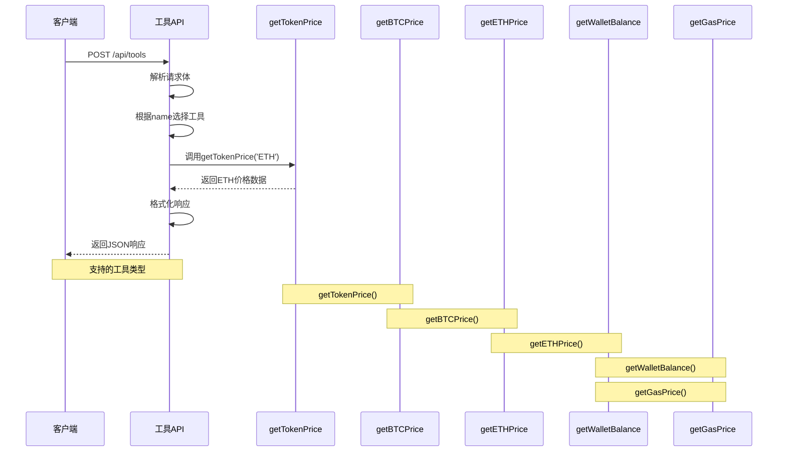

**图表来源**
- [apps/web/app/api/tools/route.ts:9-38](file://apps/web/app/api/tools/route.ts#L9-L38)

**章节来源**
- [apps/web/app/api/tools/route.ts:1-50](file://apps/web/app/api/tools/route.ts#L1-L50)

## 多币种价格查询功能详解

### 功能特性

多币种价格查询工具提供了以下核心功能：

1. **统一价格查询**: 通过getTokenPrice函数支持多种加密货币的统一查询
2. **多币种支持**: 支持ETH、BTC、SOL、MATIC、BNB等多种主流加密货币
3. **多数据源容错**: 当一个数据源不可用时自动切换到其他数据源
4. **24小时涨跌计算**: 对支持的币种提供24小时变化百分比
5. **统一数据格式**: 返回标准化的TokenPriceData数据结构
6. **向后兼容性**: getBTCPrice和getETHPrice作为getTokenPrice的包装函数
7. **错误处理**: 完善的错误处理和降级机制

### 支持的币种配置

系统配置了五个主要的加密货币支持，每个币种都有对应的交易对映射：

| 币种代码 | 交易对 | 数据解析 | 特殊功能 |
|----------|--------|----------|----------|
| ETH | ETHUSDT | 直接价格字段 | 基础价格查询 |
| BTC | BTCUSDT | 直接价格字段 | 基础价格查询 |
| SOL | SOLUSDT | 直接价格字段 | 基础价格查询 |
| MATIC | MATICUSDT | 直接价格字段 | 基础价格查询 |
| BNB | BNBUSDT | 直接价格字段 | 基础价格查询 |

### 价格数据结构

多币种价格查询返回统一的数据结构：

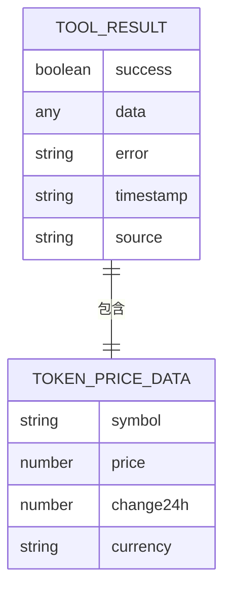

**图表来源**
- [packages/web3-tools/src/types.ts:11-21](file://packages/web3-tools/src/types.ts#L11-L21)
- [packages/web3-tools/src/types.ts:3-9](file://packages/web3-tools/src/types.ts#L3-L9)

### 查询流程

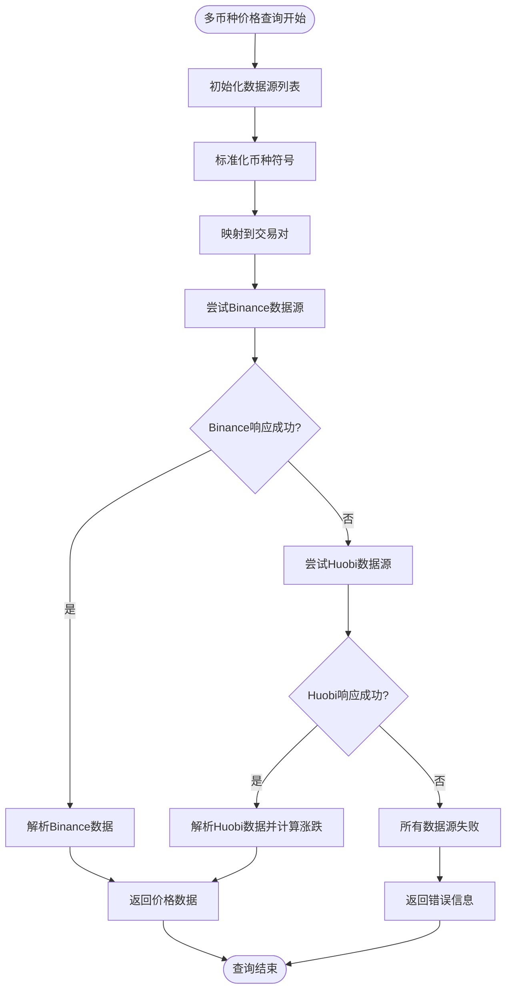

**图表来源**
- [packages/web3-tools/src/price.ts:30-124](file://packages/web3-tools/src/price.ts#L30-L124)
- [packages/web3-tools/src/price.ts:16-23](file://packages/web3-tools/src/price.ts#L16-L23)

**章节来源**
- [packages/web3-tools/src/price.ts:30-124](file://packages/web3-tools/src/price.ts#L30-L124)
- [packages/web3-tools/src/types.ts:11-21](file://packages/web3-tools/src/types.ts#L11-L21)

## 数据流分析

### 完整的多币种查询数据流

系统实现了完整的端到端数据流，从用户查询到最终响应：

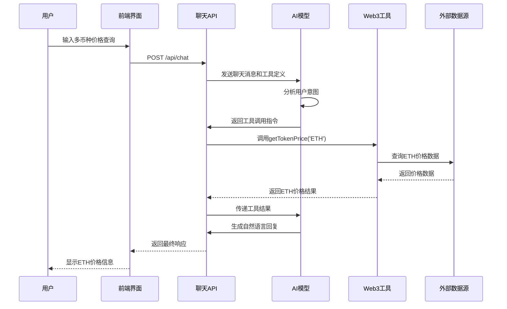

**图表来源**
- [apps/web/app/api/chat/route.ts:121-195](file://apps/web/app/api/chat/route.ts#L121-L195)
- [packages/web3-tools/src/price.ts:30-124](file://packages/web3-tools/src/price.ts#L30-L124)

### 错误处理流程

系统实现了多层次的错误处理机制：

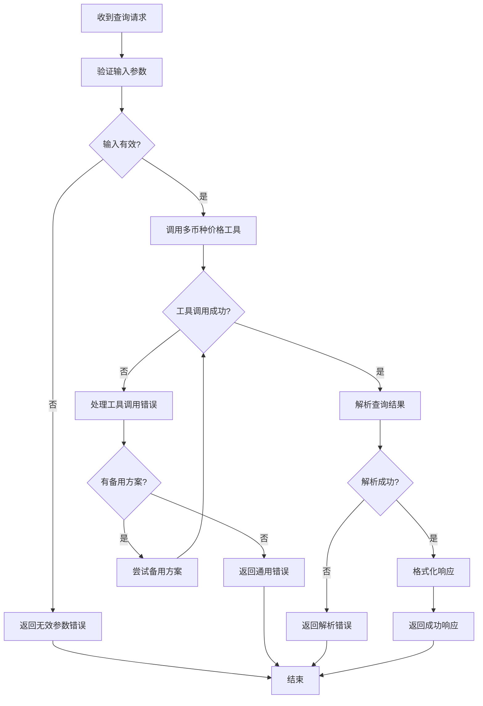

**图表来源**
- [apps/web/app/api/chat/route.ts:151-156](file://apps/web/app/api/chat/route.ts#L151-L156)
- [packages/web3-tools/src/price.ts:76-82](file://packages/web3-tools/src/price.ts#L76-L82)

**章节来源**
- [apps/web/app/api/chat/route.ts:90-219](file://apps/web/app/api/chat/route.ts#L90-L219)
- [apps/web/app/api/tools/route.ts:39-48](file://apps/web/app/api/tools/route.ts#L39-L48)

## 性能考虑

### 并发处理

系统采用了异步并发处理机制来优化性能：

- **并行数据源查询**: 多个数据源查询可以并行执行
- **非阻塞I/O操作**: 使用Promise和async/await避免阻塞主线程
- **超时控制**: 每个API请求设置10秒超时，防止长时间等待

### 缓存策略

虽然当前版本没有实现缓存，但系统设计支持缓存扩展：

- **数据结构设计**: 为未来的缓存机制预留了合适的数据结构
- **时间戳记录**: 所有查询结果都包含时间戳，便于缓存管理
- **错误重试**: 实现了智能的错误重试机制

### 资源管理

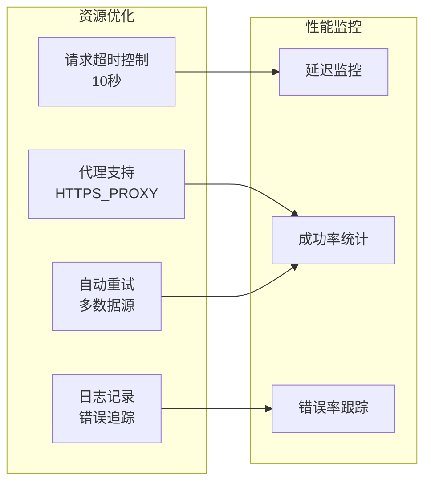

**图表来源**
- [packages/web3-tools/src/price.ts:53-56](file://packages/web3-tools/src/price.ts#L53-L56)
- [packages/web3-tools/src/price.ts:12-14](file://packages/web3-tools/src/price.ts#L12-L14)

## 故障排除指南

### 常见问题及解决方案

#### 1. 不支持的币种查询

**症状**: getTokenPrice返回"不支持的币种"错误

**可能原因**:
- 使用了未支持的币种代码
- 币种符号大小写不正确

**解决步骤**:
1. 检查币种代码是否在支持列表中（ETH、BTC、SOL、MATIC、BNB）
2. 确保币种符号使用正确的大小写
3. 验证币种代码拼写是否正确

#### 2. 数据源连接失败

**症状**: 多币种价格查询返回"所有价格数据源都不可用"

**可能原因**:
- 网络连接问题
- 外部API限制
- 代理配置错误

**解决步骤**:
1. 检查网络连接状态
2. 验证代理配置环境变量
3. 尝试手动访问数据源URL
4. 查看应用日志中的错误信息

#### 3. API密钥配置错误

**症状**: 聊天API返回模型配置错误

**解决方法**:
1. 检查AI模型提供商的API密钥配置
2. 验证环境变量设置
3. 确认API密钥权限范围

#### 4. 向后兼容性问题

**症状**: getBTCPrice或getETHPrice调用失败

**解决方法**:
1. 确认使用的是最新版本的web3-tools包
2. 检查getBTCPrice和getETHPrice是否仍被支持
3. 推荐使用getTokenPrice替代传统函数

### 调试工具

系统提供了完善的调试功能：

- **详细日志输出**: 包含请求、响应和中间过程的日志
- **错误堆栈追踪**: 完整的错误信息和调用栈
- **性能指标收集**: 响应时间和成功率统计

**章节来源**
- [apps/web/app/api/chat/route.ts:201-217](file://apps/web/app/api/chat/route.ts#L201-L217)
- [packages/web3-tools/src/price.ts:76-82](file://packages/web3-tools/src/price.ts#L76-L82)

## 总结

多币种价格查询工具是一个功能完整、架构清晰的Web3应用。系统通过以下关键特性实现了高质量的用户体验：

### 核心优势

1. **统一查询接口**: 通过getTokenPrice提供统一的多币种查询体验
2. **全面的币种支持**: 支持ETH、BTC、SOL、MATIC、BNB等多种主流加密货币
3. **向后兼容性**: 保持getBTCPrice和getETHPrice的向后兼容性
4. **可靠性**: 多数据源容错机制确保服务稳定性
5. **实时性**: 支持实时价格查询和快速响应
6. **可扩展性**: 模块化设计支持更多币种的扩展

### 技术亮点

- **统一架构**: 通过SYMBOL_MAP实现多币种的统一处理
- **分层架构**: 清晰的职责分离和关注点分离
- **异步处理**: 高效的并发处理机制
- **错误处理**: 完善的异常处理和降级策略
- **类型安全**: TypeScript提供的编译时类型检查

### 未来发展

系统为后续功能扩展奠定了良好基础，可以轻松添加：
- 更多加密货币的支持
- 价格历史图表
- 个性化价格提醒
- 用户账户系统
- 多语言支持

该工具不仅满足了当前的多币种价格查询需求，更为构建更复杂的Web3 AI应用提供了坚实的技术基础。通过getTokenPrice统一接口，开发者可以轻松扩展支持更多币种，同时保持系统的稳定性和一致性。