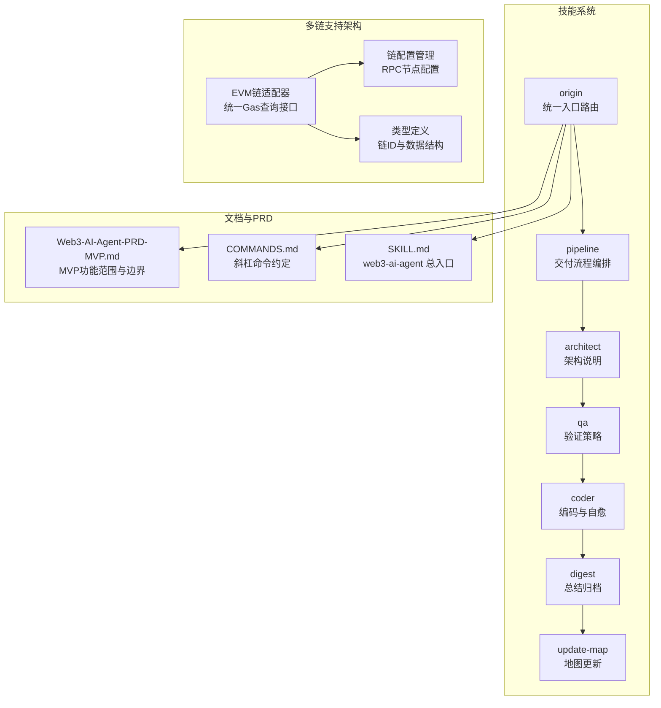
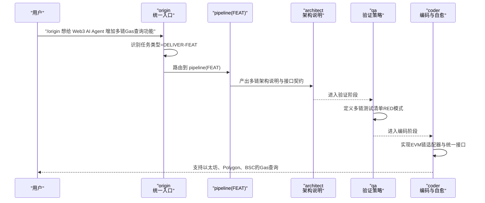
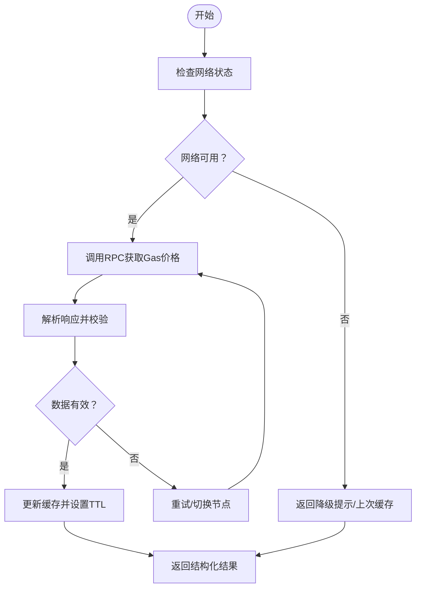
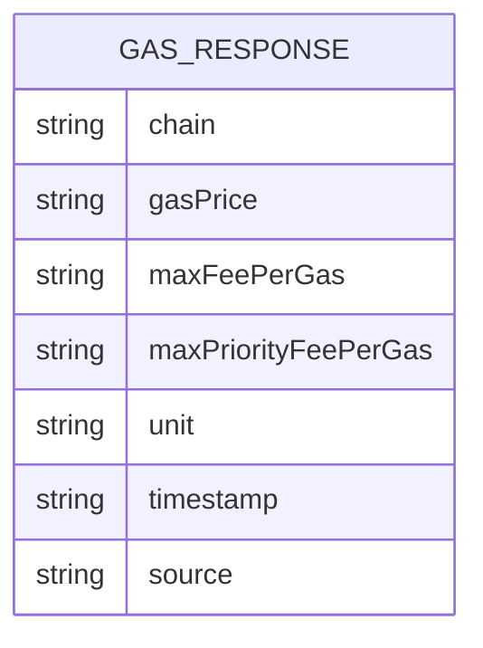
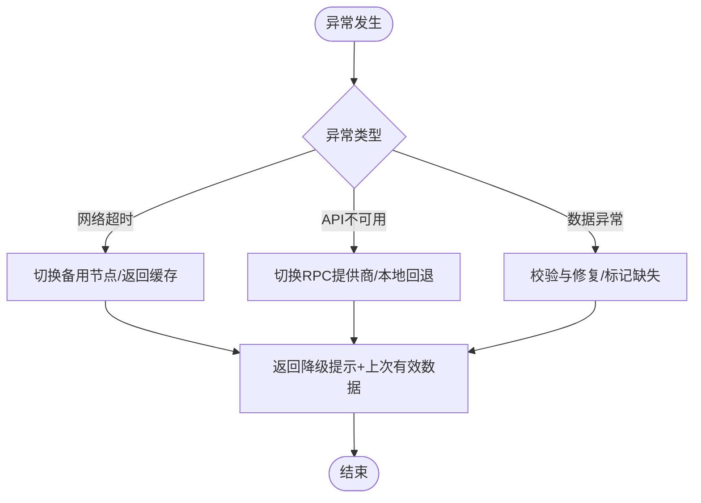
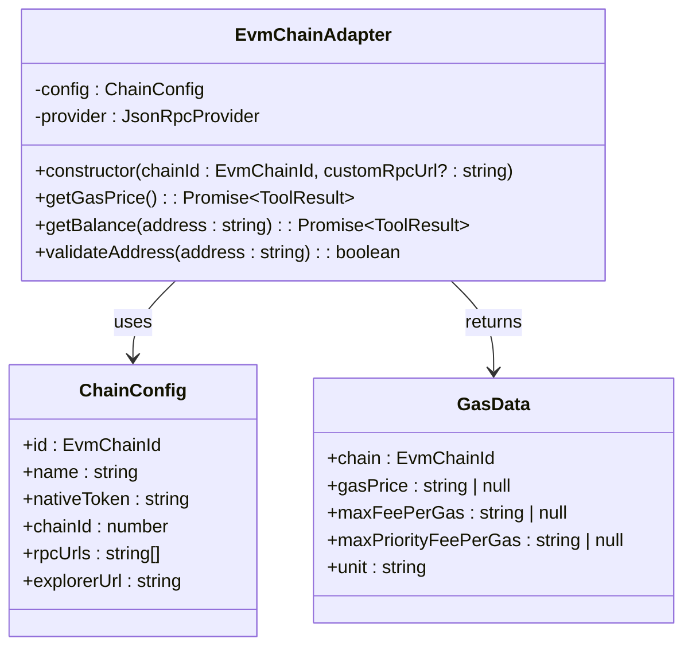
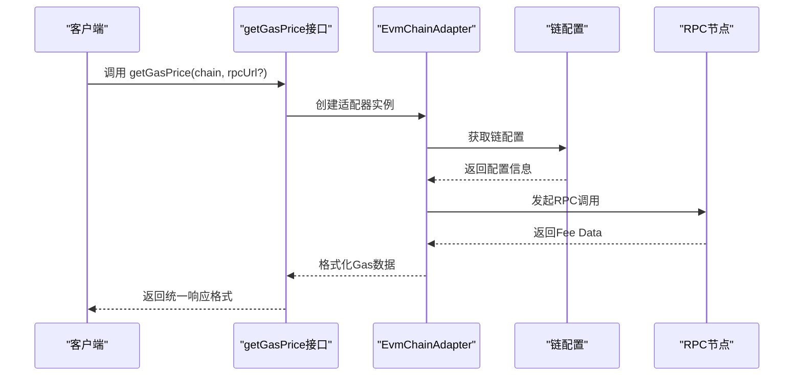

# Gas价格查询工具

<cite>
**本文引用的文件**
- [gas.ts](file://packages/web3-tools/src/gas.ts)
- [types.ts](file://packages/web3-tools/src/types.ts)
- [evm-adapter.ts](file://packages/web3-tools/src/chains/evm-adapter.ts)
- [config.ts](file://packages/web3-tools/src/chains/config.ts)
- [route.ts](file://apps/web/app/api/chat/route.ts)
- [package.json](file://packages/web3-tools/package.json)
- [bitcoin.ts](file://packages/web3-tools/src/chains/bitcoin.ts)
- [solana.ts](file://packages/web3-tools/src/chains/solana.ts)
- [Web3-AI-Agent-PRD-MVP.md](file://docs/Web3-AI-Agent-PRD-MVP.md)
- [SKILL.md](file://skills/web3-ai-agent/SKILL.md)
- [COMMANDS.md](file://skills/web3-ai-agent/COMMANDS.md)
- [origin/SKILL.md](file://skills/web3-ai-agent/origin/SKILL.md)
- [architect/SKILL.md](file://skills/web3-ai-agent/architect/SKILL.md)
- [coder/SKILL.md](file://skills/web3-ai-agent/coder/SKILL.md)
- [qa/SKILL.md](file://skills/web3-ai-agent/qa/SKILL.md)
</cite>

## 更新摘要
**所做更改**
- 新增多EVM兼容链支持：以太坊、Polygon、BSC的统一Gas价格查询接口
- 引入EVM链适配器架构，提供统一的Gas价格获取机制
- 更新API接口设计，支持链ID参数化选择
- 完善链配置管理，支持环境变量配置和默认节点回退
- 增强错误处理和降级策略，提升多链稳定性

## 目录
1. [简介](#简介)
2. [项目结构](#项目结构)
3. [核心组件](#核心组件)
4. [架构总览](#架构总览)
5. [详细组件分析](#详细组件分析)
6. [多链支持机制](#多链支持机制)
7. [API接口设计](#api接口设计)
8. [依赖关系分析](#依赖关系分析)
9. [性能考虑](#性能考虑)
10. [故障排除指南](#故障排除指南)
11. [结论](#结论)
12. [附录](#附录)

## 简介
本文件为Gas价格查询工具的技术实现文档，围绕以下目标展开：
- 深入说明多EVM兼容链Gas价格数据获取机制：网络状态检查、RPC调用流程、价格层级分析与实时性保证策略
- 详细描述工具的API接口设计：请求参数、响应格式、价格单位换算与时间戳处理
- 提供具体实现思路与最佳实践：网络请求、数据解析、错误处理与降级策略
- 解释不同Gas价格层级（快速、标准、慢速）的含义与应用场景
- 说明性能优化策略：缓存机制、批量查询与并发控制
- 明确异常处理流程：网络超时、API不可用、数据异常的应对方案
- 解释与交易执行相关的风险控制机制与用户提示策略
- 面向开发者提供完整的工具集成指导与故障排除方案

## 项目结构
本仓库为Web3-AI-Agent项目，其中包含技能系统与PRD文档。Gas价格查询工具属于MVP阶段的Web3工具之一，现已扩展为支持多条EVM兼容链的统一接口。



**图表来源**
- [origin/SKILL.md:1-125](file://skills/web3-ai-agent/origin/SKILL.md#L1-L125)
- [architect/SKILL.md:1-53](file://skills/web3-ai-agent/architect/SKILL.md#L1-L53)
- [qa/SKILL.md:1-73](file://skills/web3-ai-agent/qa/SKILL.md#L1-L73)
- [coder/SKILL.md:1-72](file://skills/web3-ai-agent/coder/SKILL.md#L1-L72)
- [Web3-AI-Agent-PRD-MVP.md:84-99](file://docs/Web3-AI-Agent-PRD-MVP.md#L84-L99)
- [COMMANDS.md:1-81](file://skills/web3-ai-agent/COMMANDS.md#L1-L81)
- [SKILL.md:1-224](file://skills/web3-ai-agent/SKILL.md#L1-L224)

**章节来源**
- [Web3-AI-Agent-PRD-MVP.md:84-99](file://docs/Web3-AI-Agent-PRD-MVP.md#L84-L99)
- [SKILL.md:73-91](file://skills/web3-ai-agent/SKILL.md#L73-L91)
- [COMMANDS.md:20-27](file://skills/web3-ai-agent/COMMANDS.md#L20-L27)

## 核心组件
- 工具入口与路由
  - 统一入口：origin负责任务类型识别与下一跳路由
  - 新功能交付：DELIVER-FEAT通过pipeline进入架构、验证与编码流程
- 多链支持能力边界
  - MVP阶段包含getETHPrice、getWalletBalance、getGasPrice支持EVM链
  - 数据来源必须可说明，链上数据与价格数据应明确区分
- 风险控制与免责声明
  - 高风险问题优先返回数据参考，不做操作建议
  - 工具失败时禁止伪造结果，必须显式说明不确定性

**章节来源**
- [Web3-AI-Agent-PRD-MVP.md:84-99](file://docs/Web3-AI-Agent-PRD-MVP.md#L84-L99)
- [Web3-AI-Agent-PRD-MVP.md:159-171](file://docs/Web3-AI-Agent-PRD-MVP.md#L159-L171)
- [origin/SKILL.md:41-50](file://skills/web3-ai-agent/origin/SKILL.md#L41-L50)

## 架构总览
Gas价格查询工具的实现遵循Web3-AI-Agent的技能系统与PRD约束，采用"入口路由—架构设计—验证—编码—总结"的交付流程，并引入EVM链适配器架构支持多链统一接口。



**图表来源**
- [origin/SKILL.md:87-91](file://skills/web3-ai-agent/origin/SKILL.md#L87-L91)
- [architect/SKILL.md:20-32](file://skills/web3-ai-agent/architect/SKILL.md#L20-L32)
- [qa/SKILL.md:14-27](file://skills/web3-ai-agent/qa/SKILL.md#L14-L27)
- [coder/SKILL.md:18-37](file://skills/web3-ai-agent/coder/SKILL.md#L18-L37)

## 详细组件分析

### 数据获取机制与实时性保证
- 网络状态检查
  - 在发起RPC调用前进行链上节点连通性探测，确保RPC可用
  - 支持多节点轮询与健康检查，避免单点故障
- RPC调用流程
  - 使用标准JSON-RPC接口查询基础Gas价格（如eth_gasPrice）
  - 对于EIP-1559网络，同时查询baseFee与priorityFee，组合得到最大费用
  - 对历史区块或特殊状态进行兼容性处理
- 价格层级分析
  - 快速：较高优先费，更快被打包确认
  - 标准：平衡确认速度与成本
  - 慢速：较低优先费，节省成本但确认较慢
- 实时性保证策略
  - 缓存最近一次有效价格，设定TTL（如10-30秒）
  - 对高频查询进行去抖与合并，减少重复RPC调用
  - 异步刷新缓存，避免阻塞用户请求



### API接口设计
- 请求参数
  - chain：目标链ID（'ethereum' | 'polygon' | 'bsc'）
  - rpcUrl：可选的RPC节点地址，支持自定义节点配置
- 响应格式
  - chain：链ID标识
  - gasPrice：基础Gas价格（Wei）
  - maxFeePerGas：最大费用（Wei），适用于EIP-1559
  - maxPriorityFeePerGas：最大优先费用（Wei），适用于EIP-1559
  - unit：价格单位（Gwei）
  - timestamp：数据采集时间戳（毫秒）
  - source：数据来源（链名称）
- 单位换算
  - Wei → Gwei：除以1e9
  - Gwei → ETH：除以1e9
- 时间戳处理
  - 使用UTC毫秒时间戳，便于跨系统对齐与排序
  - 响应中包含采集时间，帮助用户评估数据新鲜度



**更新** 响应格式现在包含chain字段，明确标识Gas价格所属链

### 错误处理与降级策略
- 网络超时
  - 设置短超时阈值（如2-5秒），超时后尝试备用节点
  - 返回"网络超时，建议稍后重试"并附带上次有效缓存
- API不可用
  - 切换至备用RPC提供商或本地回退逻辑
  - 返回"API不可用，使用降级数据"并标注数据时效
- 数据异常
  - 对数值字段进行边界校验（非负、合理范围）
  - 对缺失字段进行默认填充或标记缺失，并记录日志
- 降级提示
  - 明确标注"数据来自工具查询，非模型主观生成"
  - 提供风险提示与免责声明，避免误导用户决策



### 与交易执行的风险控制与用户提示
- 风险控制原则
  - 不对市场走势做确定性承诺，仅提供数据参考
  - 工具失败时禁止伪造结果，必须显式说明不确定性
- 用户提示策略
  - 在响应中附加"数据来自工具查询，非模型主观生成"
  - 对高风险问题（如重仓买入）给出保守建议与免责声明
  - 提示用户自行评估市场风险，谨慎决策

**章节来源**
- [Web3-AI-Agent-PRD-MVP.md:159-171](file://docs/Web3-AI-Agent-PRD-MVP.md#L159-L171)
- [Web3-AI-Agent-PRD-MVP.md:174-197](file://docs/Web3-AI-Agent-PRD-MVP.md#L174-L197)

### 性能优化策略
- 缓存机制
  - LRU缓存最近N次查询结果，TTL根据链上波动率动态调整
  - 对高频查询进行去抖（如100ms内多次请求合并为一次）
- 批量查询
  - 支持批量获取多个链的Gas价格，减少连接数与往返次数
  - 对同一链的多次请求进行合并与复用
- 并发控制
  - 限制同时活跃的RPC请求数，避免拥塞
  - 使用队列与背压策略，平滑突发流量

## 多链支持机制

### EVM链适配器架构
新的EVM链适配器提供了统一的Gas价格查询接口，支持以太坊、Polygon、BSC三大主流EVM链。



**图表来源**
- [evm-adapter.ts:11-112](file://packages/web3-tools/src/chains/evm-adapter.ts#L11-L112)
- [config.ts:22-47](file://packages/web3-tools/src/chains/config.ts#L22-L47)
- [types.ts:63-70](file://packages/web3-tools/src/types.ts#L63-L70)

### 链配置管理
链配置系统支持环境变量配置和默认节点回退，确保多链服务的高可用性。

**更新** 新增了链配置管理模块，支持以太坊、Polygon、BSC的统一配置

**章节来源**
- [config.ts:54-80](file://packages/web3-tools/src/chains/config.ts#L54-L80)
- [evm-adapter.ts:15-19](file://packages/web3-tools/src/chains/evm-adapter.ts#L15-L19)

## API接口设计

### 统一Gas查询接口
新的API接口设计支持多链参数化选择，提供统一的Gas价格查询体验。



**图表来源**
- [gas.ts:9-15](file://packages/web3-tools/src/gas.ts#L9-L15)
- [evm-adapter.ts:68-97](file://packages/web3-tools/src/chains/evm-adapter.ts#L68-L97)

### 支持的链列表
- 以太坊（Ethereum）：主网链ID 1，原生代币ETH
- Polygon：链ID 137，原生代币MATIC  
- BSC（BNB Smart Chain）：链ID 56，原生代币BNB

**更新** 新增了完整的多链支持列表和对应的链配置

**章节来源**
- [types.ts:24-30](file://packages/web3-tools/src/types.ts#L24-L30)
- [config.ts:22-47](file://packages/web3-tools/src/chains/config.ts#L22-L47)

## 依赖关系分析
Gas价格查询工具在技能系统中的依赖关系如下：

```mermaid
graph LR
PRD["PRD<br/>MVP功能范围"] --> ORG["origin<br/>统一入口"]
CMDS["COMMANDS<br/>斜杠命令约定"] --> ORG
ORG --> PIPE["pipeline(FEAT)<br/>交付流程"]
PIPE --> ARCH["architect<br/>架构说明"]
ARCH --> QA["qa<br/>验证策略"]
QA --> CODER["coder<br/>编码与自愈"]
CODER --> DIGEST["digest<br/>总结归档"]
ORG --> SKILL["web3-ai-agent<br/>总入口"]
subgraph "多链支持依赖"
EVM_ADAPTER["EvmChainAdapter"] --> TYPES["types.ts"]
EVM_ADAPTER --> CONFIG["config.ts"]
EVM_ADAPTER --> ETHERS["ethers库"]
CONFIG --> TYPES
END
```

**图表来源**
- [Web3-AI-Agent-PRD-MVP.md:84-99](file://docs/Web3-AI-Agent-PRD-MVP.md#L84-L99)
- [origin/SKILL.md:41-50](file://skills/web3-ai-agent/origin/SKILL.md#L41-L50)
- [architect/SKILL.md:20-32](file://skills/web3-ai-agent/architect/SKILL.md#L20-L32)
- [qa/SKILL.md:14-27](file://skills/web3-ai-agent/qa/SKILL.md#L14-L27)
- [coder/SKILL.md:18-37](file://skills/web3-ai-agent/coder/SKILL.md#L18-L37)
- [COMMANDS.md:20-27](file://skills/web3-ai-agent/COMMANDS.md#L20-L27)
- [SKILL.md:73-91](file://skills/web3-ai-agent/SKILL.md#L73-L91)

**章节来源**
- [origin/SKILL.md:41-50](file://skills/web3-ai-agent/origin/SKILL.md#L41-L50)
- [architect/SKILL.md:20-32](file://skills/web3-ai-agent/architect/SKILL.md#L20-L32)
- [qa/SKILL.md:14-27](file://skills/web3-ai-agent/qa/SKILL.md#L14-L27)
- [coder/SKILL.md:18-37](file://skills/web3-ai-agent/coder/SKILL.md#L18-L37)

## 性能考虑
- 缓存策略
  - TTL：根据链上波动率与网络延迟动态调整（如10-30秒）
  - 命中率优化：对同一链的多次请求进行合并与复用
- 并发与限流
  - 限制每链并发请求数，避免RPC节点过载
  - 使用令牌桶或漏桶算法进行速率限制
- 批量与去抖
  - 批量查询多个链的Gas价格，减少连接数
  - 对高频查询进行去抖，避免抖动放大

## 故障排除指南
- 症状：网络超时
  - 检查RPC节点连通性与可用性
  - 切换备用节点，观察是否恢复
  - 查看日志中的超时时间与重试次数
- 症状：API不可用
  - 切换至备用RPC提供商
  - 检查节点版本与EIP-1559支持情况
- 症状：数据异常
  - 校验返回字段是否为空或越界
  - 记录异常数据并回退到上次有效缓存
- 症状：实时性不足
  - 检查缓存TTL与刷新策略
  - 优化去抖与合并策略，避免过度延迟

**更新** 当前实现支持环境变量配置ETHEREUM_RPC_URL、POLYGON_RPC_URL、BSC_RPC_URL，可自定义各链RPC节点

**章节来源**
- [Web3-AI-Agent-PRD-MVP.md:159-171](file://docs/Web3-AI-Agent-PRD-MVP.md#L159-L171)

## 结论
Gas价格查询工具作为Web3-AI-Agent MVP的重要组成部分，现已成功扩展为支持多条EVM兼容链的统一接口。通过引入EVM链适配器架构、链配置管理系统和统一的API设计，工具能够在以太坊、Polygon、BSC三大主流链上提供稳定、可解释、可降级的Gas价格服务。严格的网络状态检查、RPC调用流程、价格层级分析与实时性保证策略，结合缓存、批量与并发优化，以及完善的异常处理与用户提示机制，可满足用户对多链Gas信息的即时查询需求，并为后续更多链的支持与更复杂的交易辅助能力奠定坚实基础。

## 附录
- 集成指导
  - 使用斜杠命令约定发起任务：/origin 或 /pipeline feat
  - 在DELIVER-FEAT流程中，先产出架构说明，再进行验证与编码
  - 遵循PRD中的能力边界与风险控制原则
- 相关文件
  - [Web3-AI-Agent-PRD-MVP.md](file://docs/Web3-AI-Agent-PRD-MVP.md)
  - [COMMANDS.md](file://skills/web3-ai-agent/COMMANDS.md)
  - [SKILL.md](file://skills/web3-ai-agent/SKILL.md)
- 代码示例
  - [gas.ts](file://packages/web3-tools/src/gas.ts)
  - [types.ts](file://packages/web3-tools/src/types.ts)
  - [evm-adapter.ts](file://packages/web3-tools/src/chains/evm-adapter.ts)
  - [config.ts](file://packages/web3-tools/src/chains/config.ts)
  - [route.ts](file://apps/web/app/api/chat/route.ts)

**更新** 新增了多链支持的完整代码示例路径，包括EVM链适配器和链配置管理