# Token信息查询工具

<cite>
**本文档引用的文件**
- [apps/web/app/api/tools/route.ts](file://apps/web/app/api/tools/route.ts)
- [apps/web/app/api/chat/route.ts](file://apps/web/app/api/chat/route.ts)
- [apps/web/app/page.tsx](file://apps/web/app/page.tsx)
- [apps/web/components/ChatInput.tsx](file://apps/web/components/ChatInput.tsx)
- [apps/web/hooks/useChatStream.ts](file://apps/web/hooks/useChatStream.ts)
- [apps/web/lib/memory/SummaryCompressionMemory.ts](file://apps/web/lib/memory/SummaryCompressionMemory.ts)
- [apps/web/types/chat.ts](file://apps/web/types/chat.ts)
- [apps/web/types/stream.ts](file://apps/web/types/stream.ts)
- [packages/web3-tools/package.json](file://packages/web3-tools/package.json)
- [packages/web3-tools/src/token.ts](file://packages/web3-tools/src/token.ts)
- [packages/web3-tools/src/tokens/registry.ts](file://packages/web3-tools/src/tokens/registry.ts)
- [packages/web3-tools/src/types.ts](file://packages/web3-tools/src/types.ts)
- [docs/changelog/2026-04-22-feat-multichain-web3-tools.md](file://docs/changelog/2026-04-22-feat-multichain-web3-tools.md)
- [docs/changelog/2026-04-24-feat-getTokenBalance.md](file://docs/changelog/2026-04-24-feat-getTokenBalance.md)
- [README.md](file://README.md)
</cite>

## 更新摘要
**变更内容**
- 新增 ERC20 令牌余额查询功能（`getTokenBalance`）
- 扩展 Token 信息查询工具集，支持 USDT/USDC/DAI 等 ERC20 令牌余额查询
- 解决 AI 模型将原生币余额误标为 ERC20 令牌余额的问题
- 更新 AI Agent 工具定义和系统提示规则

## 目录
1. [项目概述](#项目概述)
2. [项目结构](#项目结构)
3. [核心组件](#核心组件)
4. [架构概览](#架构概览)
5. [详细组件分析](#详细组件分析)
6. [依赖关系分析](#依赖关系分析)
7. [性能考虑](#性能考虑)
8. [故障排除指南](#故障排除指南)
9. [总结](#总结)

## 项目概述

Web3 AI Agent 是一个面向 Web3 前端开发者的 AI Agent 项目，专注于提供智能的 Token 信息查询服务。该项目实现了从需求定义到代码交付的完整 SDLC 自动化流程，具备对话能力、Tool Calling、Agent Loop 和最小 Memory 等核心功能。

该项目的核心价值在于为用户提供了一个统一的接口来查询各种加密货币的价格、钱包余额、Gas 价格以及 Token 元数据信息。通过 AI Agent 的智能决策能力，用户可以以自然语言的方式查询复杂的 Web3 信息。

**更新** 新增了 ERC20 令牌余额查询功能，现在可以准确区分原生币余额和 ERC20 令牌余额，解决了 AI 模型之前的误判问题。

## 项目结构

项目采用 Monorepo 结构，主要分为以下几个部分：

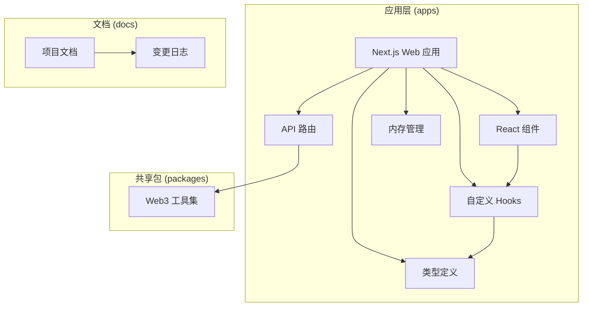

**图表来源**
- [README.md:26-38](file://README.md#L26-L38)
- [package.json:23-26](file://package.json#L23-L26)

**章节来源**
- [README.md:26-38](file://README.md#L26-L38)
- [package.json:23-26](file://package.json#L23-L26)

## 核心组件

### Token 信息查询工具集

项目提供了完整的 Token 信息查询工具集，包括：

1. **价格查询工具** (`getTokenPrice`)
   - 支持多种加密货币：ETH、BTC、SOL、MATIC、BNB
   - 统一的价格查询接口，替代旧的专用工具

2. **余额查询工具** (`getBalance`)
   - 支持多条链：Ethereum、Polygon、BSC、Bitcoin、Solana
   - 统一的余额查询接口，支持不同链的原生代币

3. **Gas 价格查询工具** (`getGasPrice`)
   - 专门针对 EVM 链的 Gas 价格查询
   - 支持 Ethereum、Polygon、BSC 三个主要 EVM 链

4. **Token 信息查询工具** (`getTokenInfo`)
   - 查询 Token 的元数据信息（名称、合约地址、精度等）
   - 支持 EVM 链上的 Token 查询

5. **ERC20 令牌余额查询工具** (`getTokenBalance`)
   - **新增功能**：查询指定钱包地址的 ERC20 Token 余额
   - 支持 USDT、USDC、DAI 等主流 ERC20 令牌
   - 仅支持 EVM 链：Ethereum、Polygon、BSC
   - **解决 AI 模型误判问题**：准确区分原生币余额和 ERC20 令牌余额

**章节来源**
- [apps/web/app/api/chat/route.ts:8-101](file://apps/web/app/api/chat/route.ts#L8-L101)
- [apps/web/app/api/chat/route.ts:91-114](file://apps/web/app/api/chat/route.ts#L91-L114)
- [docs/changelog/2026-04-22-feat-multichain-web3-tools.md:32-63](file://docs/changelog/2026-04-22-feat-multichain-web3-tools.md#L32-L63)
- [docs/changelog/2026-04-24-feat-getTokenBalance.md:11-21](file://docs/changelog/2026-04-24-feat-getTokenBalance.md#L11-L21)

### AI Agent 对话系统

系统集成了智能的 AI Agent 对话能力：

- **系统提示词**：定义了 Agent 的能力和行为准则
- **工具调用机制**：AI Agent 可以自动识别何时需要调用 Web3 工具
- **流式输出**：支持实时的流式对话体验

**更新** 新增了 `getTokenBalance` 工具的系统提示规则，明确指示 AI Agent 在查询 ERC20 Token 余额时使用该工具。

**章节来源**
- [apps/web/app/api/chat/route.ts:104-133](file://apps/web/app/api/chat/route.ts#L104-L133)
- [apps/web/app/api/chat/route.ts:160-206](file://apps/web/app/api/chat/route.ts#L160-L206)

### 用户界面组件

- **聊天界面**：提供友好的用户交互体验
- **流式消息显示**：实时显示 AI Agent 的回复
- **内存管理**：保持对话上下文的连续性

**章节来源**
- [apps/web/app/page.tsx:10-160](file://apps/web/app/page.tsx#L10-L160)
- [apps/web/components/ChatInput.tsx:10-74](file://apps/web/components/ChatInput.tsx#L10-L74)

## 架构概览

系统采用分层架构设计，实现了清晰的职责分离：

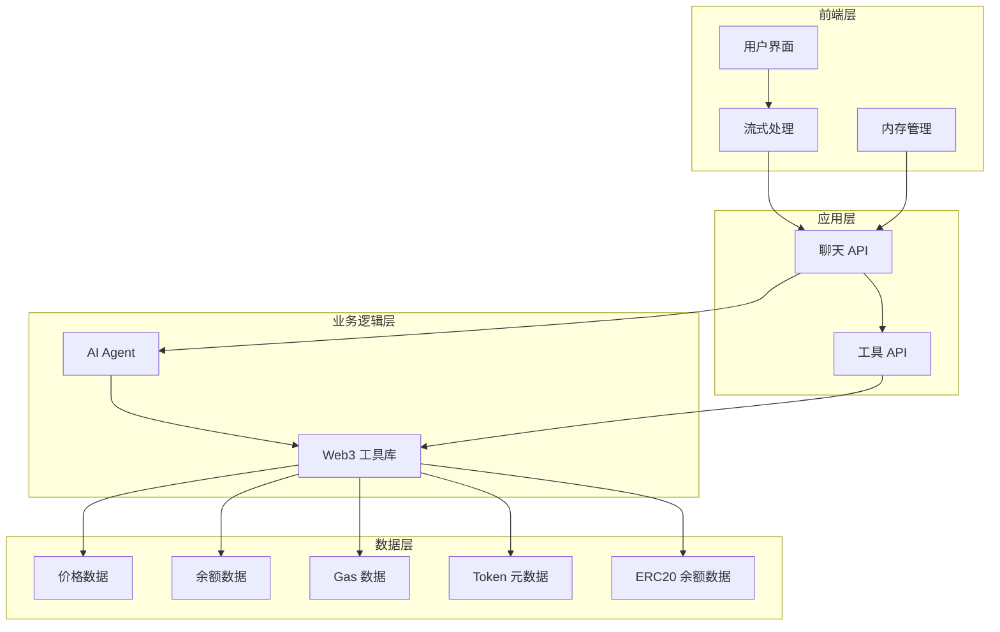

**图表来源**
- [apps/web/app/api/chat/route.ts:135-405](file://apps/web/app/api/chat/route.ts#L135-L405)
- [apps/web/hooks/useChatStream.ts:167-252](file://apps/web/hooks/useChatStream.ts#L167-L252)

## 详细组件分析

### 聊天 API 组件

聊天 API 是整个系统的核心组件，负责处理用户的查询请求并协调各个工具的调用。

#### 工具定义与调用流程

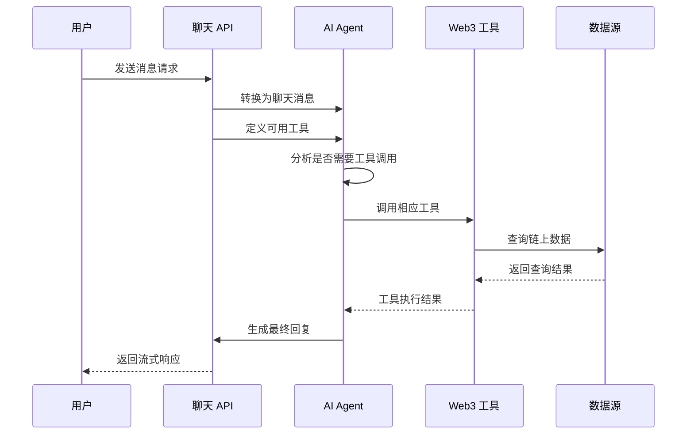

**图表来源**
- [apps/web/app/api/chat/route.ts:170-319](file://apps/web/app/api/chat/route.ts#L170-L319)

#### 流式输出机制

系统实现了高效的流式输出机制，支持实时的数据传输：

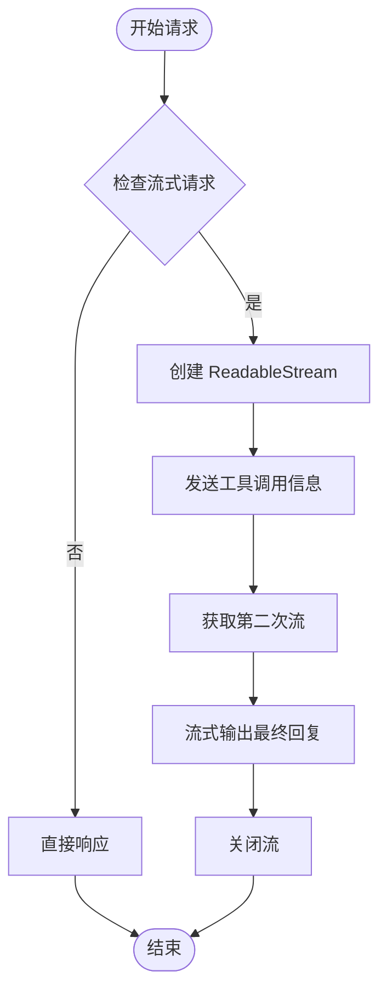

**图表来源**
- [apps/web/app/api/chat/route.ts:259-307](file://apps/web/app/api/chat/route.ts#L259-L307)

**章节来源**
- [apps/web/app/api/chat/route.ts:135-405](file://apps/web/app/api/chat/route.ts#L135-L405)

### Web3 工具库组件

Web3 工具库是系统的基础支撑组件，提供了各种区块链数据查询功能。

#### 多链架构设计

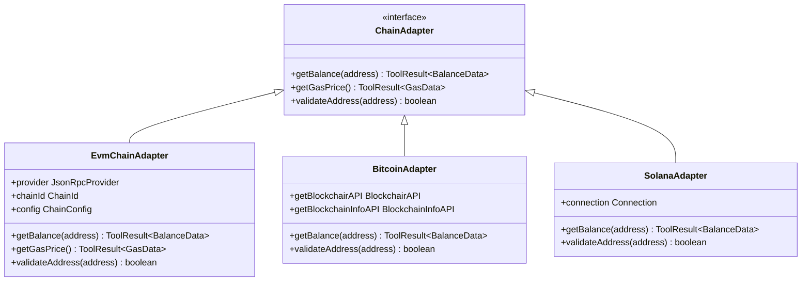

**图表来源**
- [docs/changelog/2026-04-22-feat-multichain-web3-tools.md:65-81](file://docs/changelog/2026-04-22-feat-multichain-web3-tools.md#L65-L81)

#### 工具调用流程

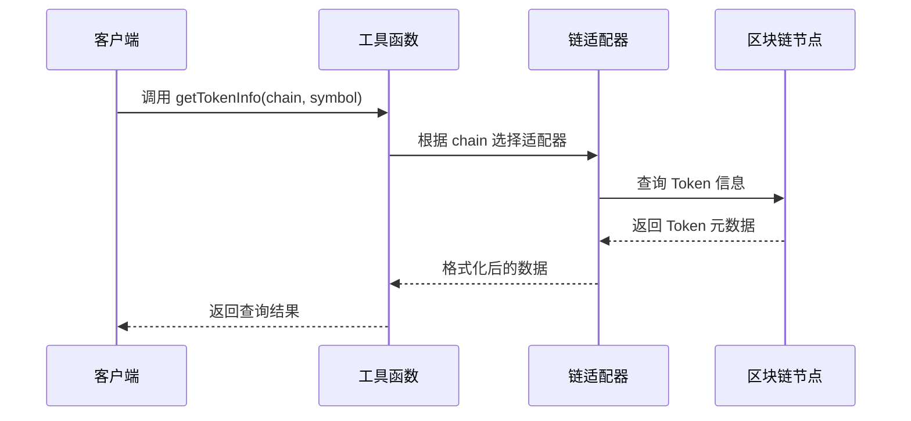

**图表来源**
- [apps/web/app/api/chat/route.ts:187-205](file://apps/web/app/api/chat/route.ts#L187-L205)

**更新** 新增了 `getTokenBalance` 工具的调用流程，支持 ERC20 令牌余额查询：

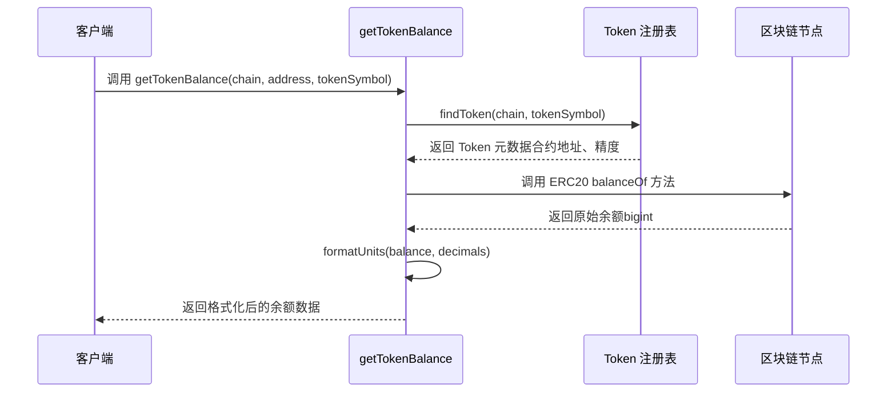

**图表来源**
- [packages/web3-tools/src/token.ts:73-139](file://packages/web3-tools/src/token.ts#L73-L139)

**章节来源**
- [packages/web3-tools/package.json:13-17](file://packages/web3-tools/package.json#L13-L17)
- [docs/changelog/2026-04-22-feat-multichain-web3-tools.md:83-105](file://docs/changelog/2026-04-22-feat-multichain-web3-tools.md#L83-L105)
- [packages/web3-tools/src/token.ts:61-146](file://packages/web3-tools/src/token.ts#L61-L146)

### Token 注册表系统

**新增功能** 系统包含了完整的 Token 注册表，支持主流 ERC20 令牌的元数据管理：

#### 支持的 ERC20 令牌

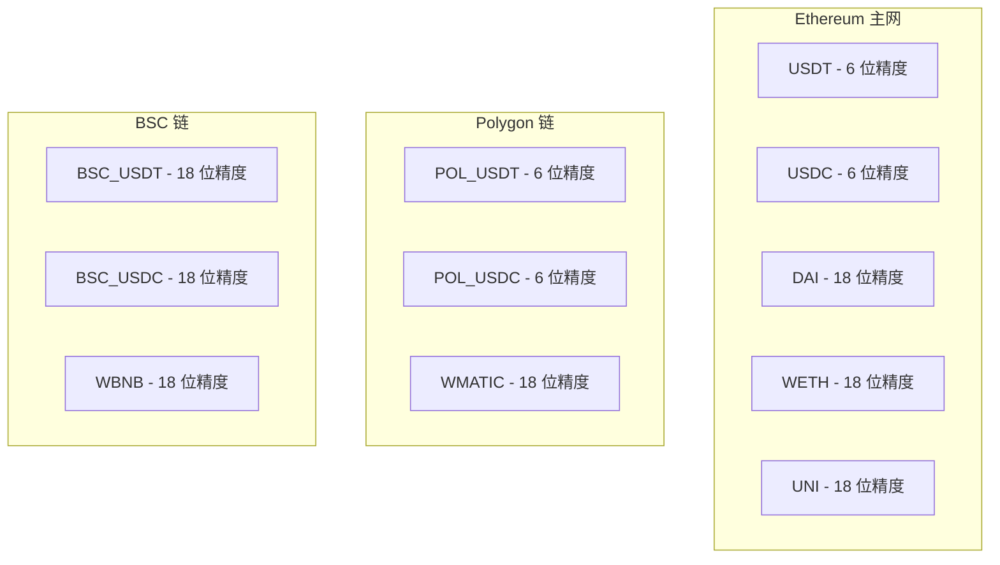

**图表来源**
- [packages/web3-tools/src/tokens/registry.ts:15-102](file://packages/web3-tools/src/tokens/registry.ts#L15-L102)

**章节来源**
- [packages/web3-tools/src/tokens/registry.ts:104-145](file://packages/web3-tools/src/tokens/registry.ts#L104-L145)

### 内存管理系统

内存管理系统负责维护对话的历史记录和上下文信息，确保 AI Agent 能够理解用户的完整意图。

#### 摘要压缩机制

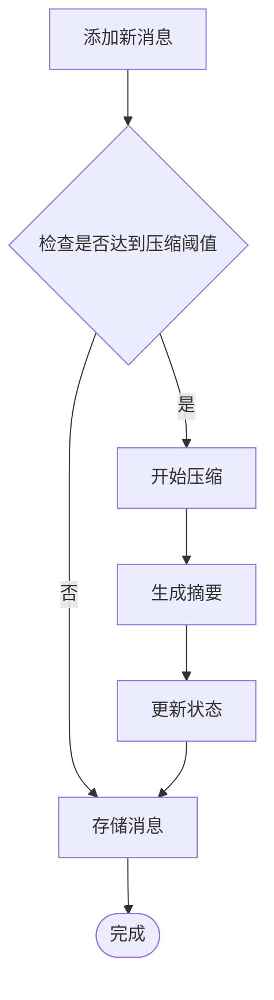

**图表来源**
- [apps/web/lib/memory/SummaryCompressionMemory.ts:48-74](file://apps/web/lib/memory/SummaryCompressionMemory.ts#L48-L74)

**章节来源**
- [apps/web/lib/memory/SummaryCompressionMemory.ts:5-111](file://apps/web/lib/memory/SummaryCompressionMemory.ts#L5-L111)

### 用户界面组件

#### 聊天输入组件

聊天输入组件提供了用户友好的交互界面：

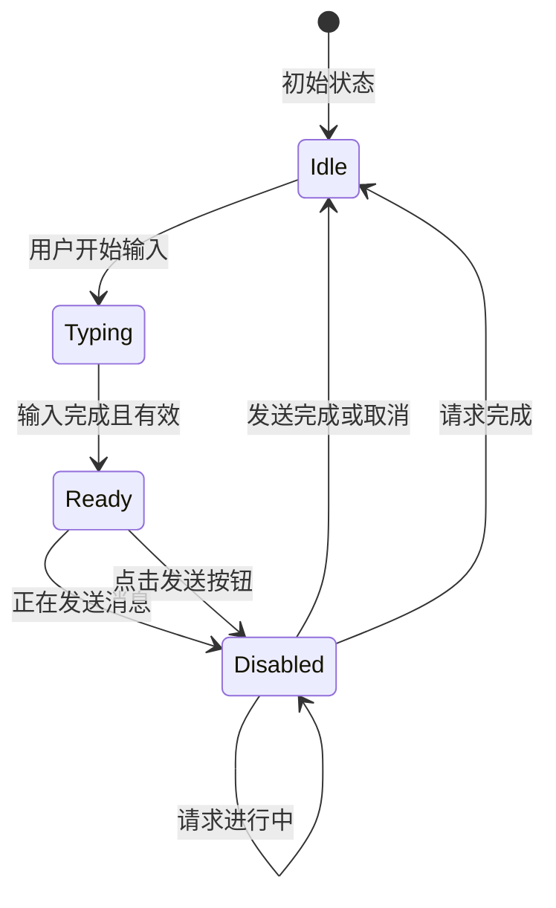

**图表来源**
- [apps/web/components/ChatInput.ts:13-24](file://apps/web/components/ChatInput.ts#L13-L24)

**章节来源**
- [apps/web/components/ChatInput.ts:10-74](file://apps/web/components/ChatInput.ts#L10-L74)

## 依赖关系分析

系统采用了模块化的依赖关系设计，各组件之间保持松耦合：

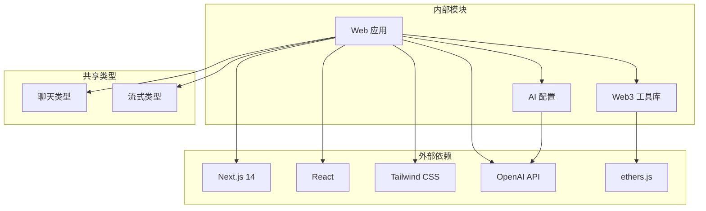

**图表来源**
- [README.md:18-24](file://README.md#L18-L24)
- [packages/web3-tools/package.json:13-17](file://packages/web3-tools/package.json#L13-L17)

**章节来源**
- [README.md:18-24](file://README.md#L18-L24)
- [packages/web3-tools/package.json:13-17](file://packages/web3-tools/package.json#L13-L17)

## 性能考虑

### 流式处理优化

系统实现了高效的流式处理机制，通过以下方式优化性能：

1. **节流更新**：使用 50ms 的节流间隔更新 UI，避免频繁的重渲染
2. **增量内容拼接**：只更新变化的部分内容，减少字符串操作开销
3. **内存管理**：及时清理定时器和 AbortController，防止内存泄漏

### 错误处理策略

系统采用了多层次的错误处理机制：

1. **网络超时控制**：30秒的请求超时时间，超过时间自动中止
2. **重试机制**：最多重试 2 次，每次间隔 1 秒
3. **优雅降级**：当工具调用失败时，AI Agent 仍能生成合理的回复

### 缓存策略

虽然当前版本没有实现缓存机制，但系统设计允许后续添加缓存层：

- **短期缓存**：价格数据可以缓存 1-5 分钟
- **长期缓存**：Token 元数据相对稳定，可以缓存更长时间
- **智能失效**：基于时间戳和数据新鲜度的缓存失效策略

**更新** 新增了 ERC20 令牌余额查询的缓存考虑：
- **ERC20 余额缓存**：可以缓存 1-2 分钟，因为 ERC20 余额变化相对较慢
- **Token 元数据缓存**：Token 注册表信息可以长期缓存
- **RPC 调用优化**：对同一钱包地址的多次查询可以合并处理

## 故障排除指南

### 常见问题诊断

#### 1. 工具调用失败

**症状**：AI Agent 返回工具调用失败的信息

**可能原因**：
- 区块链节点连接失败
- API 密钥配置错误
- 网络连接问题

**解决方法**：
- 检查环境变量配置
- 验证网络连接状态
- 查看后端日志获取详细错误信息

#### 2. 流式输出中断

**症状**：聊天界面显示不完整的消息

**可能原因**：
- 请求超时
- 服务器压力过大
- 客户端网络问题

**解决方法**：
- 增加超时时间配置
- 检查服务器资源使用情况
- 在客户端实现重连机制

#### 3. 内存泄漏问题

**症状**：应用运行时间越长，内存使用量越大

**可能原因**：
- 定时器未正确清理
- AbortController 未释放
- 事件监听器未移除

**解决方法**：
- 在组件卸载时清理所有定时器
- 确保 AbortController 在 finally 块中释放
- 使用 React 的 useEffect 清理函数

#### 4. ERC20 令牌余额查询失败

**症状**：`getTokenBalance` 工具返回错误

**可能原因**：
- Token 未在注册表中注册
- 钱包地址格式不正确
- RPC 节点不可用
- 链 ID 不支持

**解决方法**：
- 确认 Token 符号在注册表中存在
- 验证钱包地址格式（0x 开头的十六进制）
- 检查链 ID 是否为 'ethereum'、'polygon' 或 'bsc'
- 确认 RPC 节点连接正常

**章节来源**
- [apps/web/hooks/useChatStream.ts:206-248](file://apps/web/hooks/useChatStream.ts#L206-L248)
- [apps/web/lib/memory/SummaryCompressionMemory.ts:48-74](file://apps/web/lib/memory/SummaryCompressionMemory.ts#L48-L74)
- [packages/web3-tools/src/token.ts:78-86](file://packages/web3-tools/src/token.ts#L78-L86)

## 总结

Web3 AI Agent 的 Token 信息查询工具是一个功能完整、架构清晰的系统。它成功地将复杂的区块链数据查询能力封装在一个易于使用的界面背后，为用户提供了智能化的 Web3 信息服务。

### 主要优势

1. **多链支持**：支持 5 条主流区块链的价格查询、余额查询、Gas 查询和 Token 信息查询
2. **智能决策**：AI Agent 能够自动识别何时需要调用工具，提供更自然的用户体验
3. **流式体验**：实时的流式输出让用户能够即时看到查询进度
4. **可扩展性**：模块化的架构设计便于添加新的区块链支持和工具功能
5. **精确的 ERC20 支持**：**新增功能**：准确区分原生币余额和 ERC20 令牌余额，解决 AI 模型误判问题

### 技术亮点

1. **统一的工具接口**：通过 getTokenPrice、getBalance、getGasPrice、getTokenInfo、getTokenBalance 等统一接口简化了工具调用
2. **智能内存管理**：自动压缩对话历史，保持上下文的同时控制内存使用
3. **健壮的错误处理**：多层次的错误处理机制确保系统的稳定性
4. **高效的流式处理**：优化的流式处理机制提供流畅的用户体验
5. **完善的 Token 注册表**：支持主流 ERC20 令牌的元数据管理

### 未来发展

该系统为未来的功能扩展奠定了良好的基础，包括但不限于：

- 支持更多区块链和 DeFi 协议
- 集成更多的 AI 功能，如数据分析和趋势预测
- 实现更智能的缓存策略
- 添加用户个性化设置和偏好管理
- **新增**：支持更多 ERC20 令牌和去中心化交易所协议

通过持续的迭代和优化，Web3 AI Agent 将成为 Web3 领域最优秀的智能助手之一。