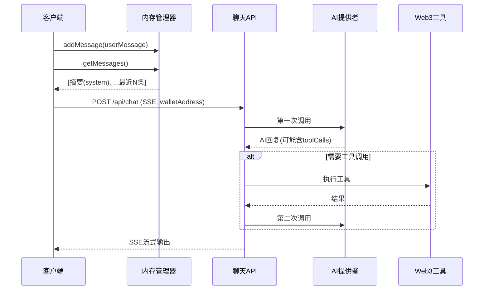

# SSE流式聊天系统

## 概述

基于 Next.js 的 SSE（Server-Sent Events）流式聊天系统，实现从用户意图理解、Web3工具调用到结果返回的完整 AI Agent 能力。

## 核心架构



## StreamChunk 类型

```typescript
interface StreamChunk {
  type: 'content' | 'tool_call' | 'done' | 'error' | 'transfer_data'
  content?: string
  toolCall?: ToolCall
  transferData?: TransferData
  error?: string
}
```

## SSE事件类型

| 事件类型 | 用途 | 数据内容 |
|---------|------|---------|
| content | 文本流式输出 | AI回复文本片段 |
| tool_call | 工具调用状态 | 工具名称、参数、结果 |
| transfer_data | 转账卡片数据 | TransferData对象 |
| done | 流结束标志 | 无 |
| error | 错误信息 | 错误描述字符串 |

## useChatStream Hook

核心前端 Hook，管理流式状态：

```typescript
const { isStreaming, content, error, toolCalls, transferData, sendMessage, abort } = useChatStream()

// 调用
sendMessage(messages: Message[], walletAddress?: string)
```

**状态流转**: Idle -> Streaming -> Processing -> Completed/Error

**关键机制**:
- 节流更新UI（防止高频重渲染）
- 智能重试（最多2次，仅运行时错误重试，配置错误不重试）
- 30秒超时处理
- AbortController 支持中断

## 后端API路由

路径: `/api/chat` (POST)

**响应头**:
```
Content-Type: text/event-stream
X-Accel-Buffering: no  // Nginx代理兼容
```

**预置Web3工具**:

| 工具 | 功能 | 参数 |
|------|------|------|
| getETHPrice | ETH价格 | 无 |
| getBTCPrice | BTC价格 | 无 |
| getWalletBalance | 钱包余额 | address |
| getGasPrice | Gas价格 | 无 |
| createTransferCard | 创建转账卡片 | to, tokenSymbol, amount, chain, tokenAddress? |

**动态System Prompt**: 当传入 walletAddress 时，自动注入钱包地址到系统提示中。

## 错误处理策略

| 错误类型 | HTTP状态码 | 重试策略 |
|---------|-----------|---------|
| 配置错误(API Key缺失等) | 503 | 不重试 |
| 运行时错误(网络超时等) | 500 | 最多重试2次，间隔1秒 |
| 客户端错误 | 4xx | 不重试 |
