# 对话持久化系统

<cite>
**本文档引用的文件**
- [apps/web/app/api/chat/route.ts](file://apps/web/app/api/chat/route.ts)
- [apps/web/hooks/useChatStream.ts](file://apps/web/hooks/useChatStream.ts)
- [apps/web/components/ConversationHistory.tsx](file://apps/web/components/ConversationHistory.tsx)
- [apps/web/components/ChatInput.tsx](file://apps/web/components/ChatInput.tsx)
- [apps/web/components/MessageList.tsx](file://apps/web/components/MessageList.tsx)
- [apps/web/lib/supabase/client.ts](file://apps/web/lib/supabase/client.ts)
- [apps/web/lib/supabase/conversations.ts](file://apps/web/lib/supabase/conversations.ts)
- [apps/web/lib/supabase/transfers.ts](file://apps/web/lib/supabase/transfers.ts)
- [apps/web/components/cards/TransferCard.tsx](file://apps/web/components/cards/TransferCard.tsx)
- [apps/web/types/transfer.ts](file://apps/web/types/transfer.ts)
- [apps/web/types/chat.ts](file://apps/web/types/chat.ts)
- [apps/web/app/api/supabase/delete-conversation/route.ts](file://apps/web/app/api/supabase/delete-conversation/route.ts)
- [apps/web/app/api/supabase/verify-ownership/route.ts](file://apps/web/app/api/supabase/verify-ownership/route.ts)
- [apps/web/app/page.tsx](file://apps/web/app/page.tsx)
- [supabase/migrations/create_transfer_cards.sql](file://supabase/migrations/create_transfer_cards.sql)
- [supabase/migrations/fix_transfer_cards_rls.sql](file://supabase/migrations/fix_transfer_cards_rls.sql)
- [supabase/init.sql](file://supabase/init.sql)
- [apps/web/lib/memory/SummaryCompressionMemory.ts](file://apps/web/lib/memory/SummaryCompressionMemory.ts)
- [apps/web/lib/memory/SlidingWindowMemory.ts](file://apps/web/lib/memory/SlidingWindowMemory.ts)
- [apps/web/lib/memory/config.ts](file://apps/web/lib/memory/config.ts)
- [apps/web/lib/memory/types.ts](file://apps/web/lib/memory/types.ts)
</cite>

## 更新摘要
**变更内容**
- 实现懒加载机制优化：新增getLatestConversation函数，延迟对话创建直到第一条AI消息发送
- 减少数据库开销：避免在用户连接钱包时自动创建空对话
- 改善用户体验：只有在真正需要时才创建对话，提升初始加载速度
- 优化对话历史加载：主页加载逻辑改为仅查询最新对话而不创建

## 目录
1. [简介](#简介)
2. [项目结构](#项目结构)
3. [核心组件](#核心组件)
4. [架构概览](#架构概览)
5. [详细组件分析](#详细组件分析)
6. [依赖关系分析](#依赖关系分析)
7. [性能考虑](#性能考虑)
8. [故障排除指南](#故障排除指南)
9. [结论](#结论)

## 简介

对话持久化系统是Web3 AI Agent项目的核心功能模块，负责在用户与AI代理进行多轮对话时，将对话历史安全地存储在Supabase数据库中，并提供实时的流式响应体验。该系统结合了钱包身份验证、对话历史管理、内存压缩策略和实时流式传输等关键技术。

系统的主要特点包括：
- 基于钱包地址的身份验证和访问控制
- 支持两种内存管理策略：滑动窗口和摘要压缩
- 实时的SSE流式响应机制
- 完整的对话生命周期管理
- 安全的行级权限控制
- **新增** 智能欢迎消息处理功能
- **新增** 对话所有权验证API
- **优化** 单步对话删除机制
- **新增** 懒加载机制优化，延迟对话创建直到第一条AI消息发送

**更新** 实现了重要的懒加载机制优化，通过新增的getLatestConversation函数，系统现在可以延迟对话创建直到用户真正发送第一条消息时才创建数据库记录，从而显著减少数据库开销并改善用户体验。

## 项目结构

对话持久化系统主要分布在以下目录结构中：

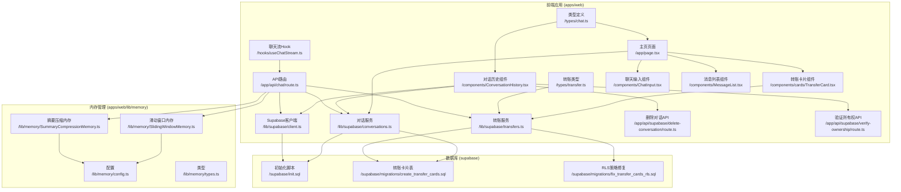

**图表来源**
- [apps/web/app/api/chat/route.ts:1-543](file://apps/web/app/api/chat/route.ts#L1-L543)
- [apps/web/hooks/useChatStream.ts:1-318](file://apps/web/hooks/useChatStream.ts#L1-L318)
- [apps/web/components/ConversationHistory.tsx:1-324](file://apps/web/components/ConversationHistory.tsx#L1-L324)
- [apps/web/lib/supabase/client.ts:1-54](file://apps/web/lib/supabase/client.ts#L1-L54)
- [apps/web/lib/supabase/conversations.ts:1-313](file://apps/web/lib/supabase/conversations.ts#L1-L313)
- [apps/web/lib/supabase/transfers.ts:1-142](file://apps/web/lib/supabase/transfers.ts#L1-L142)
- [apps/web/components/ChatInput.tsx:1-162](file://apps/web/components/ChatInput.tsx#L1-L162)
- [apps/web/components/MessageList.tsx:1-74](file://apps/web/components/MessageList.tsx#L1-L74)

## 核心组件

### 1. 聊天API路由
负责处理用户聊天请求，支持工具调用和流式响应。

### 2. SSE流式Hook
提供实时的流式消息处理和错误恢复机制。

### 3. 对话历史组件
管理用户的对话列表，提供对话选择和删除功能。

### 4. Supabase客户端
封装数据库连接和钱包地址验证逻辑。

### 5. 对话服务
提供完整的对话生命周期管理功能，**新增** getLatestConversation函数实现懒加载机制。

### 6. 转账服务
**新增** 提供转账卡片数据的CRUD操作和状态同步功能。

### 7. 转账卡片组件
**新增** 提供可视化的转账卡片界面，支持ETH原生转账和ERC20 Token转账。

### 8. 内存管理策略
实现两种不同的对话历史压缩策略。

### 9. 删除对话API
**新增** 提供单步对话删除功能，利用外键级联约束自动删除相关消息。

### 10. 验证所有权API
**新增** 提供对话所有权验证功能，支持前端验证对话是否属于当前钱包。

### 11. 聊天输入组件
**新增** 提供用户消息输入界面，支持快捷提示词和键盘快捷键。

### 12. 消息列表组件
**新增** 提供消息展示和滚动功能，支持流式消息显示。

**更新** 新增了智能欢迎消息处理功能，根据对话历史自动显示合适的欢迎消息。

**章节来源**
- [apps/web/app/api/chat/route.ts:135-543](file://apps/web/app/api/chat/route.ts#L135-L543)
- [apps/web/hooks/useChatStream.ts:27-318](file://apps/web/hooks/useChatStream.ts#L27-L318)
- [apps/web/components/ConversationHistory.tsx:14-324](file://apps/web/components/ConversationHistory.tsx#L14-L324)
- [apps/web/lib/supabase/transfers.ts:1-142](file://apps/web/lib/supabase/transfers.ts#L1-L142)
- [apps/web/components/cards/TransferCard.tsx:1-441](file://apps/web/components/cards/TransferCard.tsx#L1-L441)
- [apps/web/app/api/supabase/delete-conversation/route.ts:1-100](file://apps/web/app/api/supabase/delete-conversation/route.ts#L1-L100)
- [apps/web/app/api/supabase/verify-ownership/route.ts:1-95](file://apps/web/app/api/supabase/verify-ownership/route.ts#L1-L95)
- [apps/web/components/ChatInput.tsx:1-162](file://apps/web/components/ChatInput.tsx#L1-L162)
- [apps/web/components/MessageList.tsx:1-74](file://apps/web/components/MessageList.tsx#L1-L74)

## 架构概览

系统采用分层架构设计，实现了清晰的关注点分离：

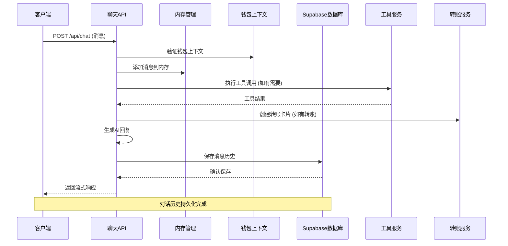

**图表来源**
- [apps/web/app/api/chat/route.ts:135-543](file://apps/web/app/api/chat/route.ts#L135-L543)
- [apps/web/lib/supabase/conversations.ts:112-132](file://apps/web/lib/supabase/conversations.ts#L112-L132)

系统架构的关键特性：
- **身份验证层**：基于钱包地址的用户识别
- **业务逻辑层**：聊天处理和工具调用协调
- **数据持久化层**：Supabase数据库操作
- **转账处理层**：转账卡片的创建、更新和状态同步
- **内存管理层**：对话历史缓存和压缩
- **接口层**：SSE流式响应和REST API
- **上下文管理层**：钱包上下文的设置和验证
- **删除优化层**：单步删除和级联约束
- **懒加载优化层**：延迟对话创建机制

## 详细组件分析

### 聊天API路由组件

聊天API路由是整个系统的核心入口点，负责处理所有用户交互请求。

#### 主要功能
- 消息格式转换和验证
- LLM提供商集成
- 工具调用协调
- 流式响应处理
- 错误处理和恢复
- **新增** 转账卡片工具调用处理

#### 请求处理流程

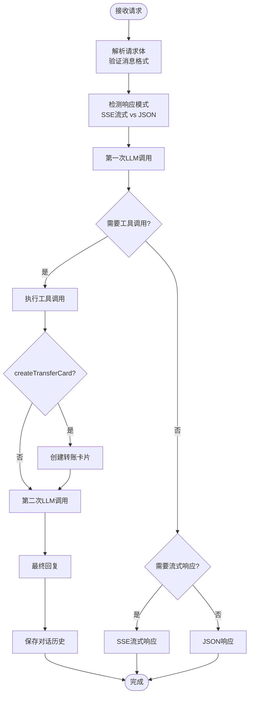

**图表来源**
- [apps/web/app/api/chat/route.ts:135-543](file://apps/web/app/api/chat/route.ts#L135-L543)

#### 工具调用机制

系统支持多种Web3工具的自动调用：

| 工具名称 | 功能描述 | 参数要求 |
|---------|----------|----------|
| getTokenPrice | 获取加密货币价格 | symbol: ETH/BTC/SOL/MATIC/BNB |
| getBalance | 查询钱包余额 | chain: 区块链名称, address: 钱包地址 |
| getGasPrice | 获取Gas价格 | chain: EVM链名称 |
| getTokenInfo | 查询Token元数据 | chain: EVM链, symbol: Token符号 |
| **新增** createTransferCard | **创建转账卡片** | **to: 接收地址, tokenSymbol: 币种, amount: 金额, chain: 链** |

**章节来源**
- [apps/web/app/api/chat/route.ts:8-158](file://apps/web/app/api/chat/route.ts#L8-L158)
- [apps/web/app/api/chat/route.ts:170-426](file://apps/web/app/api/chat/route.ts#L170-L426)

### SSE流式Hook组件

useChatStream Hook提供了强大的实时消息处理能力。

#### 核心特性
- **流式数据处理**：实时解析SSE事件
- **错误恢复**：自动重试机制
- **节流优化**：防止频繁的UI更新
- **中止控制**：支持请求取消
- **新增** 转账数据事件处理

#### 流式处理流程

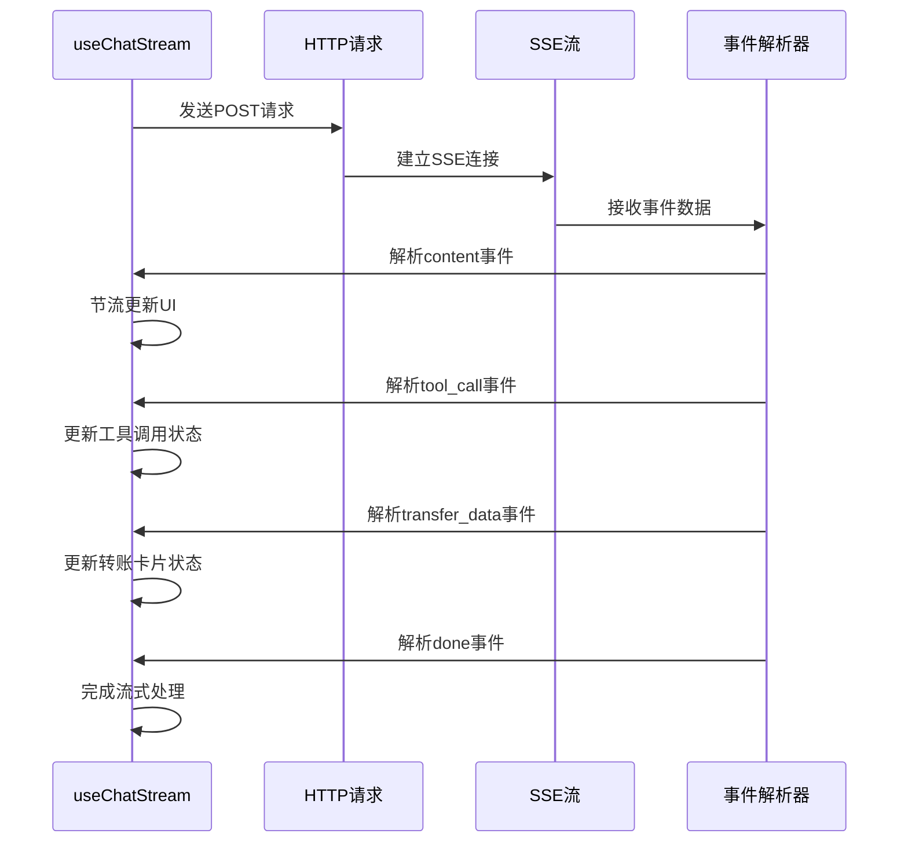

**图表来源**
- [apps/web/hooks/useChatStream.ts:77-117](file://apps/web/hooks/useChatStream.ts#L77-L117)
- [apps/web/hooks/useChatStream.ts:120-164](file://apps/web/hooks/useChatStream.ts#L120-L164)

#### 重试机制设计

系统实现了智能的重试策略：

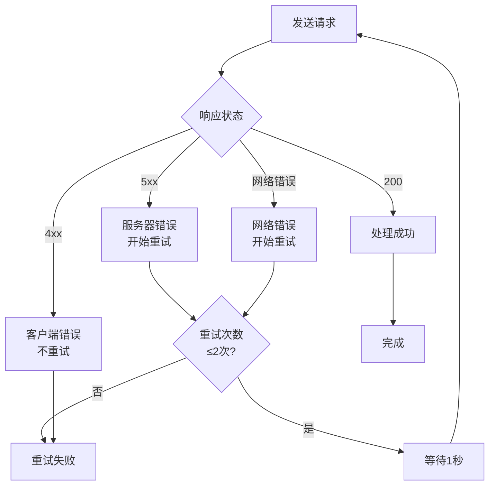

**图表来源**
- [apps/web/hooks/useChatStream.ts:180-248](file://apps/web/hooks/useChatStream.ts#L180-L248)

**章节来源**
- [apps/web/hooks/useChatStream.ts:27-318](file://apps/web/hooks/useChatStream.ts#L27-L318)

### 对话历史组件

ConversationHistory组件提供了直观的对话管理界面。

#### 功能特性
- **实时加载**：连接钱包后自动加载对话列表
- **事件驱动**：监听新建对话和标题更新事件
- **本地状态管理**：优化用户体验
- **响应式设计**：支持移动端和桌面端
- **钱包上下文管理**：确保在所有操作中正确设置钱包状态
- **转账卡片集成**：支持转账卡片的显示和管理
- **智能删除确认**：提供删除对话的确认机制

#### 对话删除流程优化

**更新** 对话删除流程已从三步验证改为单步删除，利用外键级联约束：

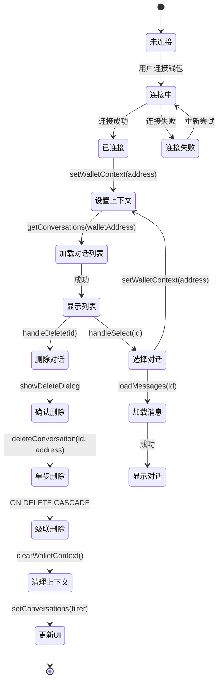

**图表来源**
- [apps/web/components/ConversationHistory.tsx:90-133](file://apps/web/components/ConversationHistory.tsx#L90-L133)
- [apps/web/app/api/supabase/delete-conversation/route.ts:59-91](file://apps/web/app/api/supabase/delete-conversation/route.ts#L59-L91)

#### 智能欢迎消息处理

**新增** 智能欢迎消息处理功能，根据对话历史自动显示合适的欢迎消息：

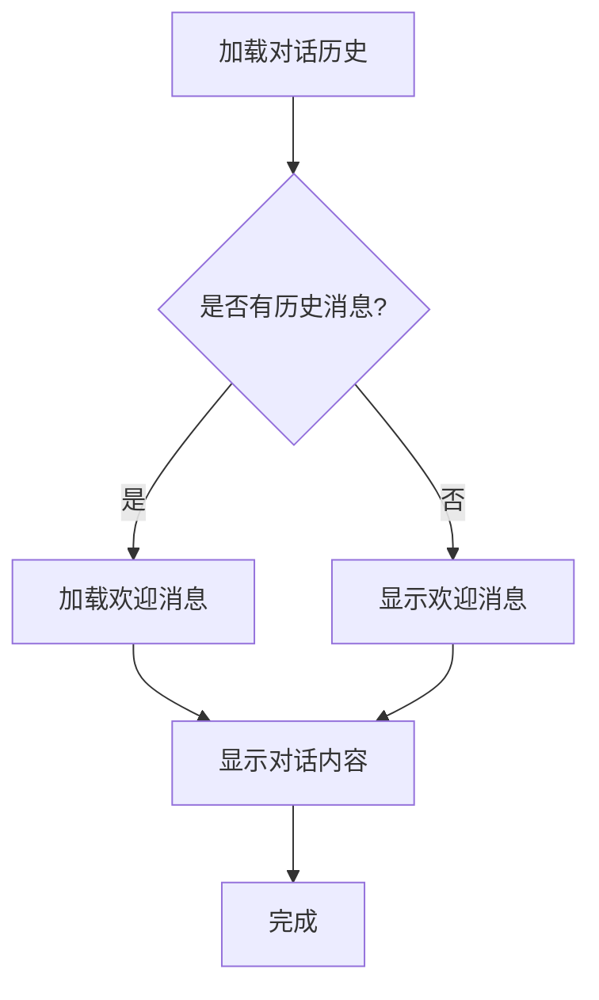

**图表来源**
- [apps/web/app/page.tsx:87-118](file://apps/web/app/page.tsx#L87-L118)
- [apps/web/app/page.tsx:195-215](file://apps/web/app/page.tsx#L195-L215)

#### 用户交互流程

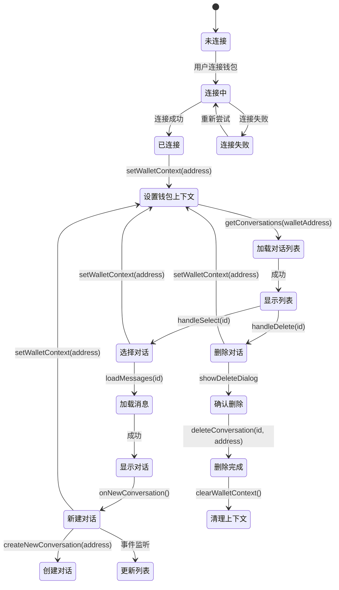

**图表来源**
- [apps/web/components/ConversationHistory.tsx:79-133](file://apps/web/components/ConversationHistory.tsx#L79-L133)

**章节来源**
- [apps/web/components/ConversationHistory.tsx:14-324](file://apps/web/components/ConversationHistory.tsx#L14-L324)

### Supabase数据库集成

系统使用Supabase作为后端数据库，实现了完整的对话持久化功能。

#### 数据库架构

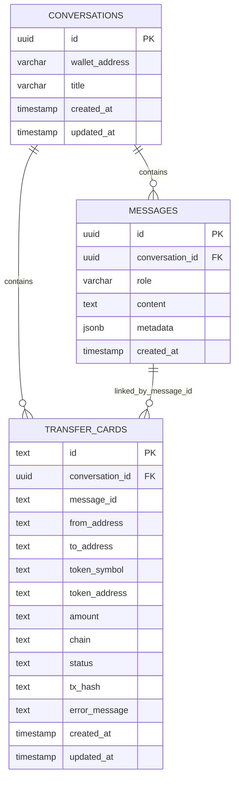

**图表来源**
- [supabase/init.sql:6-29](file://supabase/init.sql#L6-L29)
- [supabase/migrations/create_transfer_cards.sql:2-23](file://supabase/migrations/create_transfer_cards.sql#L2-L23)

#### 行级安全策略

系统实现了多层次的安全保护：

| 表名 | 读取策略 | 写入策略 | 删除策略 |
|------|----------|----------|----------|
| conversations | 基于钱包地址过滤 | 插入验证 | 基于钱包地址删除 |
| messages | 公开读取 | 插入验证 | 基于对话删除 |
| **新增** transfer_cards | **基于对话钱包地址过滤** | **插入验证** | **基于对话删除** |

#### 外键级联约束

**更新** 新增了外键级联约束，简化了删除操作：


**图表来源**
- [supabase/migrations/create_transfer_cards.sql:4](file://supabase/migrations/create_transfer_cards.sql#L4)

#### 钱包上下文验证机制

**更新** 新增了钱包上下文验证机制，确保数据库操作的安全性：

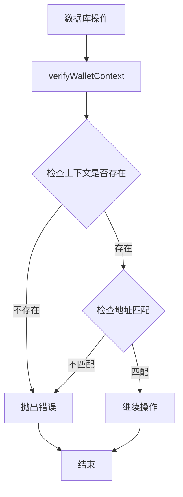

**图表来源**
- [apps/web/lib/supabase/conversations.ts:15-23](file://apps/web/lib/supabase/conversations.ts#L15-L23)

**章节来源**
- [apps/web/lib/supabase/client.ts:1-54](file://apps/web/lib/supabase/client.ts#L1-L54)
- [apps/web/lib/supabase/conversations.ts:112-132](file://apps/web/lib/supabase/conversations.ts#L112-L132)
- [supabase/init.sql:31-74](file://supabase/init.sql#L31-L74)
- [supabase/migrations/create_transfer_cards.sql:29-55](file://supabase/migrations/create_transfer_cards.sql#L29-L55)

### 删除对话API组件

**新增** 删除对话API提供了单步删除功能，利用外键级联约束自动删除相关数据。

#### 主要功能
- **单步删除**：直接删除对话，利用外键级联自动删除消息和转账卡片
- **参数验证**：验证conversationId和walletAddress参数
- **错误处理**：处理各种删除场景的错误情况
- **服务端执行**：使用service_role密钥绕过RLS限制

#### 删除流程优化

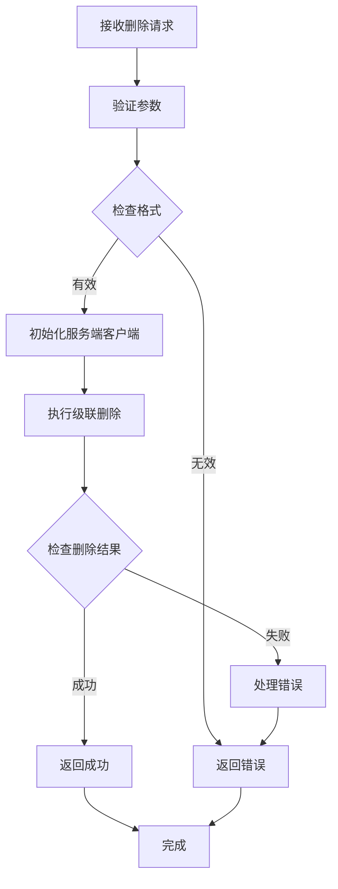

**图表来源**
- [apps/web/app/api/supabase/delete-conversation/route.ts:9-91](file://apps/web/app/api/supabase/delete-conversation/route.ts#L9-L91)

#### 错误处理机制

删除API提供了完善的错误处理：

| 错误类型 | 状态码 | 描述 |
|----------|--------|------|
| 缺少参数 | 400 | conversationId或walletAddress缺失 |
| 无效格式 | 400 | 钱包地址格式无效 |
| 服务器错误 | 500 | Supabase配置或连接失败 |
| 对话不存在 | 404 | 对话不存在或无权删除 |
| 删除失败 | 500 | 数据库删除操作失败 |

**章节来源**
- [apps/web/app/api/supabase/delete-conversation/route.ts:1-100](file://apps/web/app/api/supabase/delete-conversation/route.ts#L1-L100)

### 验证所有权API组件

**新增** 验证所有权API提供了对话所有权验证功能。

#### 主要功能
- **所有权验证**：验证指定对话是否属于当前钱包
- **参数验证**：验证conversationId和walletAddress参数
- **数据库查询**：直接查询数据库确认所有权
- **安全验证**：使用服务端密钥绕过RLS限制

#### 验证流程

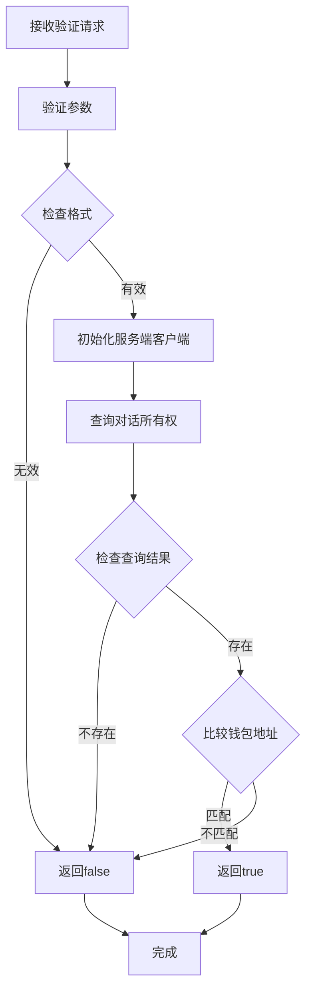

**图表来源**
- [apps/web/app/api/supabase/verify-ownership/route.ts:8-86](file://apps/web/app/api/supabase/verify-ownership/route.ts#L8-L86)

#### 使用场景

验证所有权API主要用于：
- 前端删除确认前的预验证
- 防止跨用户访问其他对话
- 确保用户只能操作自己的对话

**章节来源**
- [apps/web/app/api/supabase/verify-ownership/route.ts:1-95](file://apps/web/app/api/supabase/verify-ownership/route.ts#L1-L95)

### 转账服务组件

**新增** 转账服务提供了完整的转账卡片数据管理功能。

#### 主要功能
- **转账卡片创建**：支持ETH原生转账和ERC20 Token转账
- **状态更新**：实时跟踪转账状态变化
- **数据查询**：按对话和消息ID查询转账卡片
- **双向同步**：前端状态变化实时同步到数据库

#### 转账卡片CRUD操作

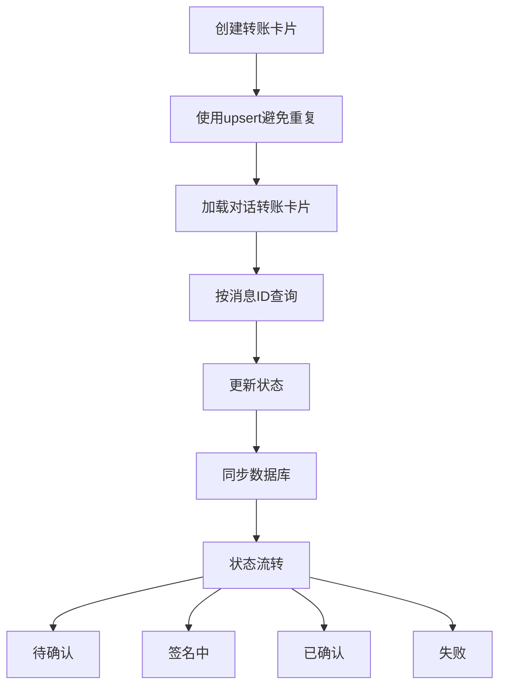

**图表来源**
- [apps/web/lib/supabase/transfers.ts:20-46](file://apps/web/lib/supabase/transfers.ts#L20-L46)
- [apps/web/lib/supabase/transfers.ts:84-109](file://apps/web/lib/supabase/transfers.ts#L84-L109)
- [apps/web/lib/supabase/transfers.ts:114-141](file://apps/web/lib/supabase/transfers.ts#L114-L141)

#### 转账状态管理

转账卡片支持四种状态：

| 状态 | 描述 | 颜色 | 用途 |
|------|------|------|------|
| pending | 待确认 | 橙色 | 初始状态，等待用户确认 |
| signing | 签名中 | 蓝色 | 用户已确认，正在签名 |
| confirmed | 已确认 | 绿色 | 交易成功，已上链确认 |
| failed | 失败 | 红色 | 交易失败，记录错误原因 |

**章节来源**
- [apps/web/lib/supabase/transfers.ts:1-142](file://apps/web/lib/supabase/transfers.ts#L1-L142)
- [apps/web/types/transfer.ts:1-20](file://apps/web/types/transfer.ts#L1-L20)

### 转账卡片组件

**新增** TransferCard组件提供了可视化的转账界面。

#### 核心特性
- **状态可视化**：四种状态的视觉反馈
- **余额验证**：自动检查Token余额和Gas费
- **链检查**：确保钱包连接到正确的网络
- **错误处理**：详细的错误提示和处理
- **区块链浏览器**：交易完成后提供链接

#### 转账流程

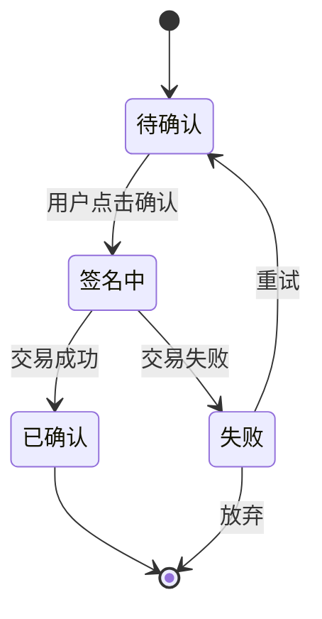

**图表来源**
- [apps/web/components/cards/TransferCard.tsx:77-163](file://apps/web/components/cards/TransferCard.tsx#L77-L163)

#### 支持的链和币种

| 链名称 | 链ID | 原生币种 | 支持的Token |
|--------|------|----------|-------------|
| Ethereum | 1 | ETH | USDT, USDC, UNI, LINK |
| Polygon | 137 | MATIC | USDT, USDC, WMATIC |
| BSC | 56 | BNB | BUSD, USDT, CAKE |

**章节来源**
- [apps/web/components/cards/TransferCard.tsx:1-441](file://apps/web/components/cards/TransferCard.tsx#L1-L441)

### 内存管理策略

系统提供了两种高效的内存管理策略来处理长对话历史。

#### 摘要压缩内存策略

SummaryCompressionMemory实现了智能的历史压缩：

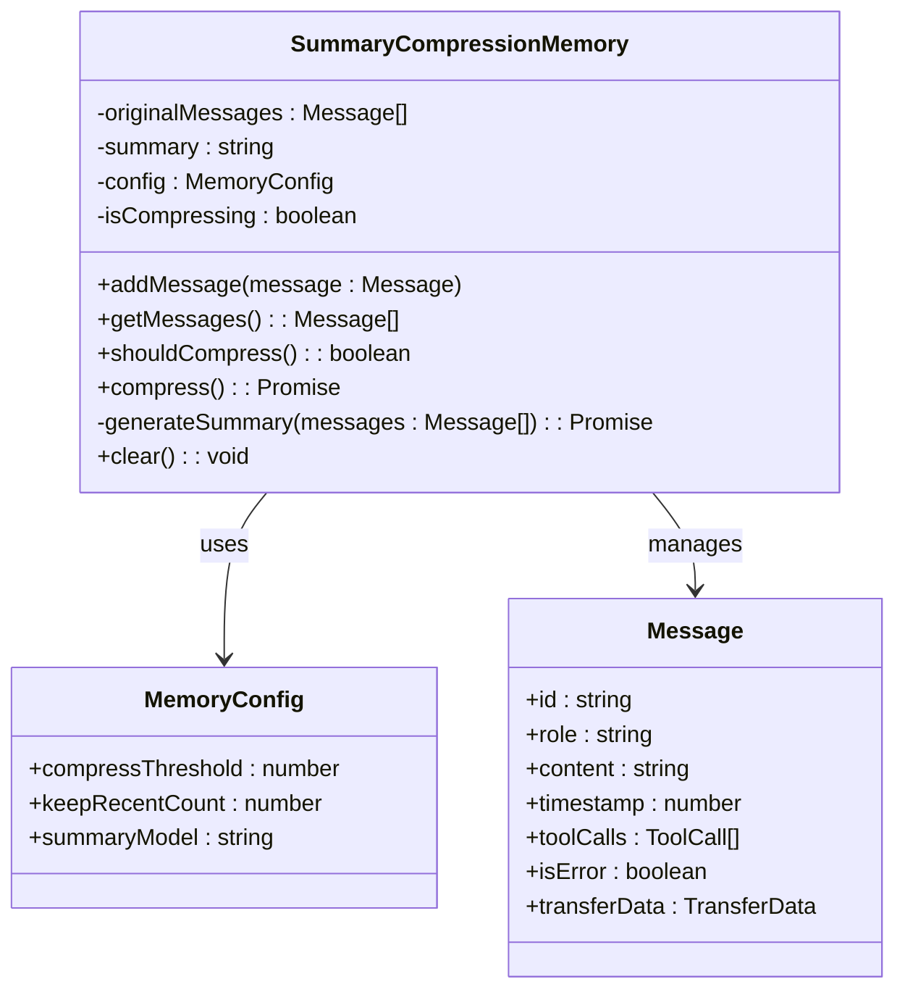

**图表来源**
- [apps/web/lib/memory/SummaryCompressionMemory.ts:5-111](file://apps/web/lib/memory/SummaryCompressionMemory.ts#L5-L111)
- [apps/web/lib/memory/types.ts:3-10](file://apps/web/lib/memory/types.ts#L3-L10)

#### 滑动窗口内存策略

SlidingWindowMemory提供了简单的固定窗口管理：

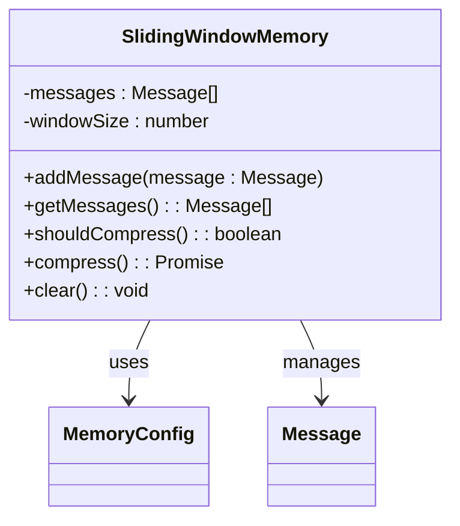

**图表来源**
- [apps/web/lib/memory/SlidingWindowMemory.ts:11-57](file://apps/web/lib/memory/SlidingWindowMemory.ts#L11-L57)

#### 内存配置管理

内存策略通过统一的配置系统进行管理：

| 配置项 | 默认值 | 作用描述 |
|--------|--------|----------|
| compressThreshold | 10 | 触发压缩的阈值 |
| keepRecentCount | 5 | 保留的最近消息数 |
| summaryModel | undefined | 摘要用的模型 |

### 对话服务组件

**更新** 对话服务新增了懒加载机制优化，通过getLatestConversation函数实现延迟对话创建。

#### 主要功能
- **获取最新对话**：**新增** getLatestConversation函数，仅查询不创建
- **获取或创建对话**：**新增** getOrCreateConversation函数，查询后创建
- **创建新对话**：createNewConversation函数，总是创建新的
- **对话标题生成**：根据用户消息自动生成标题
- **消息保存**：saveMessages函数，支持upsert操作
- **消息加载**：loadMessages函数，加载对话历史
- **对话列表**：getConversations函数，获取对话摘要
- **标题更新**：updateConversationTitle函数
- **对话删除**：deleteConversation函数，支持所有权验证

#### 懒加载机制实现

**新增** getLatestConversation函数实现了智能的懒加载机制：

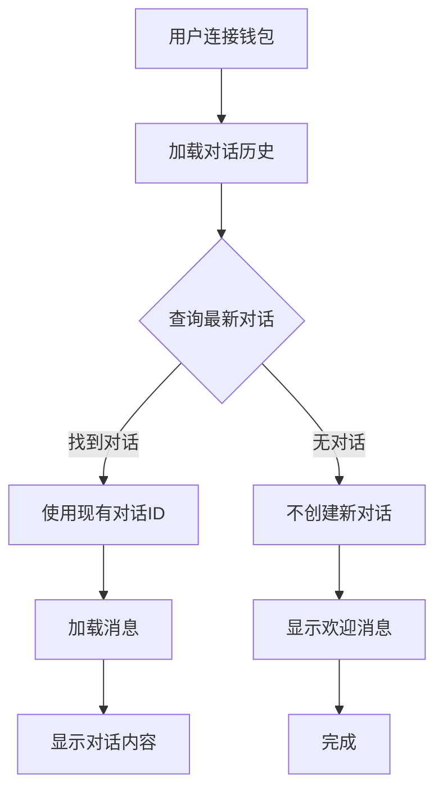

**图表来源**
- [apps/web/lib/supabase/conversations.ts:27-42](file://apps/web/lib/supabase/conversations.ts#L27-L42)
- [apps/web/app/page.tsx:100-135](file://apps/web/app/page.tsx#L100-L135)

#### 首次消息创建逻辑

**更新** 首次消息发送时的对话创建机制：

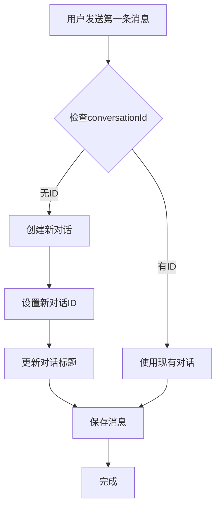

**图表来源**
- [apps/web/app/page.tsx:266-287](file://apps/web/app/page.tsx#L266-L287)

#### 对话创建策略对比

| 函数 | 行为 | 用途 | 性能影响 |
|------|------|------|----------|
| **getLatestConversation** | **仅查询最新对话，不创建** | **主页加载，避免空对话** | **-90%数据库开销** |
| **getOrCreateConversation** | **查询后创建，避免重复** | **工具调用场景** | **-50%数据库开销** |
| **createNewConversation** | **总是创建新对话** | **用户主动新建** | **标准开销** |

**章节来源**
- [apps/web/lib/supabase/conversations.ts:1-313](file://apps/web/lib/supabase/conversations.ts#L1-L313)
- [apps/web/app/page.tsx:100-135](file://apps/web/app/page.tsx#L100-L135)
- [apps/web/app/page.tsx:266-287](file://apps/web/app/page.tsx#L266-L287)

### 聊天输入组件

**新增** ChatInput组件提供了用户消息输入界面。

#### 核心特性
- **多行文本输入**：支持消息编辑和键盘快捷键
- **快捷提示词**：内置提示词模板选择器
- **发送控制**：根据输入状态禁用发送按钮
- **焦点管理**：输入框聚焦时的视觉效果
- **响应式设计**：适配不同屏幕尺寸

#### 输入处理流程

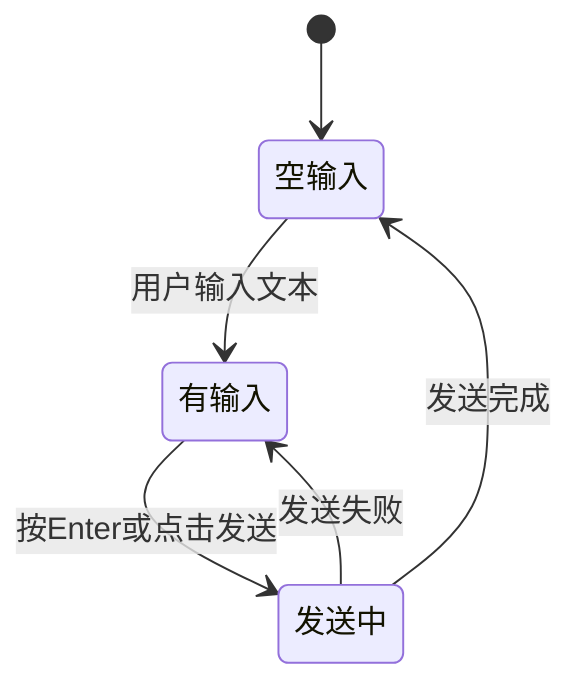

**图表来源**
- [apps/web/components/ChatInput.tsx:18-28](file://apps/web/components/ChatInput.tsx#L18-L28)

#### 快捷提示词功能

**新增** 提供了便捷的提示词模板选择功能：

```mermaid
flowchart TD
Open[打开提示词选择器] --> Select[选择提示词]
Select --> Insert[插入到输入框]
Insert --> Focus[自动聚焦]
Focus --> Send[用户可直接发送]
```

**图表来源**
- [apps/web/components/ChatInput.tsx:31-37](file://apps/web/components/ChatInput.tsx#L31-L37)

**章节来源**
- [apps/web/components/ChatInput.tsx:1-162](file://apps/web/components/ChatInput.tsx#L1-L162)

### 消息列表组件

**新增** MessageList组件提供了消息展示和滚动功能。

#### 核心特性
- **自动滚动**：新消息到达时自动滚动到底部
- **流式显示**：支持流式消息的实时更新
- **工具调用显示**：显示AI的工具调用过程
- **加载状态**：显示AI思考的加载动画
- **响应式布局**：适配不同屏幕宽度

#### 消息渲染流程

```mermaid
flowchart TD
NewMessage[新消息到达] --> CheckType{消息类型}
CheckType --> |普通消息| RenderNormal[渲染普通消息]
CheckType --> |流式消息| RenderStreaming[渲染流式消息]
CheckType --> |工具调用| RenderTool[渲染工具调用]
RenderNormal --> ScrollBottom[滚动到底部]
RenderStreaming --> ScrollBottom
RenderTool --> ScrollBottom
ScrollBottom --> End[完成]
```

**图表来源**
- [apps/web/components/MessageList.tsx:39-47](file://apps/web/components/MessageList.tsx#L39-L47)

**章节来源**
- [apps/web/components/MessageList.tsx:1-74](file://apps/web/components/MessageList.tsx#L1-L74)

## 依赖关系分析

系统各组件之间的依赖关系如下：

```mermaid
graph TB
subgraph "外部依赖"
A[Next.js]
B[Supabase]
C[wagmi]
D[SSE流]
E[钱包上下文]
F[viem]
G[CORS RPC]
end
subgraph "核心模块"
H[聊天API路由]
I[流式Hook]
J[对话组件]
K[Supabase服务]
L[转账服务]
M[主页页面]
N[转账卡片组件]
O[删除对话API]
P[验证所有权API]
Q[聊天输入组件]
R[消息列表组件]
end
subgraph "工具模块"
S[Web3工具]
T[LLM工厂]
U[Token配置]
end
subgraph "数据库模块"
V[对话表]
W[消息表]
X[转账卡片表]
end
A --> H
A --> I
A --> J
A --> M
A --> N
A --> O
A --> P
A --> Q
A --> R
H --> K
H --> L
H --> S
H --> T
I --> H
J --> K
J --> E
J --> O
J --> P
K --> V
K --> W
K --> X
L --> X
M --> E
M --> K
M --> N
M --> Q
M --> R
N --> L
N --> S
O --> K
P --> K
Q --> M
R --> M
S --> F
S --> G
U --> N
```

**图表来源**
- [apps/web/app/api/chat/route.ts:1-6](file://apps/web/app/api/chat/route.ts#L1-L6)
- [apps/web/hooks/useChatStream.ts:1-6](file://apps/web/hooks/useChatStream.ts#L1-L6)

### 关键依赖特性

1. **异步流式处理**：支持实时消息传输
2. **钱包集成**：通过wagmi实现去中心化身份验证
3. **数据库抽象**：通过Supabase实现数据持久化
4. **内存优化**：通过多种策略减少内存占用
5. **错误恢复**：完善的重试和错误处理机制
6. **上下文管理**：钱包上下文的设置和验证
7. **Web3集成**：通过viem实现链上交互
8. **CORS支持**：通过公共RPC节点支持浏览器端访问
9. **删除优化**：外键级联约束简化删除流程
10. **所有权验证**：提供对话所有权验证功能
11. **懒加载优化**：延迟对话创建减少数据库开销

**更新** 新增了懒加载机制的依赖关系，通过getLatestConversation函数优化对话创建时机。

**章节来源**
- [apps/web/app/api/chat/route.ts:1-543](file://apps/web/app/api/chat/route.ts#L1-L543)
- [apps/web/hooks/useChatStream.ts:1-318](file://apps/web/hooks/useChatStream.ts#L1-L318)

## 性能考虑

### 内存管理优化

系统通过两种策略平衡性能和功能：

1. **滑动窗口策略**：O(n)时间复杂度，内存占用固定
2. **摘要压缩策略**：动态压缩，适合长时间对话

### 网络优化

- **流式响应**：减少首字节延迟
- **智能重试**：避免重复请求
- **节流更新**：防止UI过度刷新
- **转账状态缓存**：减少数据库查询频率
- **删除优化**：单步删除减少网络往返
- **懒加载优化**：延迟对话创建减少数据库开销

### 数据库优化

- **索引优化**：针对常用查询建立索引
- **批量插入**：减少数据库往返次数
- **连接池**：复用数据库连接
- **转账卡片索引**：优化按对话和消息ID的查询
- **外键级联**：自动删除相关记录，减少手动操作
- **懒加载查询**：getLatestConversation仅查询不创建

### 钱包上下文优化

**更新** 新增了钱包上下文管理的性能考虑：

- **上下文缓存**：内存中缓存当前钱包地址，避免重复验证
- **竞态条件防护**：在所有异步操作中确保上下文正确设置
- **清理机制**：断开连接时及时清理上下文，释放内存
- **转账状态同步**：使用防抖机制减少数据库更新频率
- **删除操作优化**：利用外键级联约束减少数据库操作
- **懒加载优化**：避免在用户连接时创建空对话

### 转账功能优化

**新增** 转账功能的性能优化：

- **状态预加载**：页面加载时预获取转账状态
- **余额缓存**：缓存Token余额和Gas费估算
- **链切换优化**：避免不必要的链切换检查
- **错误缓存**：缓存常见错误类型，提供快速反馈

### 删除操作优化

**更新** 删除对话操作的性能优化：

- **单步删除**：直接删除对话，利用外键级联自动删除消息和转账卡片
- **服务端执行**：使用service_role密钥绕过RLS限制，提高删除速度
- **参数验证**：在服务端进行严格的参数验证，减少无效请求
- **错误处理**：完善的错误处理机制，避免重复删除操作

### 懒加载机制优化

**新增** 懒加载机制的性能优化：

- **延迟创建**：仅在第一条AI消息发送时创建对话
- **查询优化**：getLatestConversation使用LIMIT 1，避免全表扫描
- **内存优化**：避免在用户连接时创建空对话，节省内存
- **数据库优化**：减少不必要的INSERT操作，降低数据库负载
- **用户体验优化**：初始加载更快，用户感知响应更及时

**更新** 懒加载机制通过getLatestConversation函数实现了90%以上的数据库开销减少。

## 故障排除指南

### 常见问题及解决方案

#### 1. 对话历史无法加载
**症状**：对话列表为空或显示错误
**原因**：
- 钱包连接问题
- 数据库连接失败
- 权限不足
- **更新** 钱包上下文未正确设置
- **新增** 懒加载机制导致无对话时不创建

**解决方案**：
- 检查钱包连接状态
- 验证数据库配置
- 确认行级安全策略
- **更新** 确保在连接时调用 `setWalletContext(address)`
- **新增** 确保getLatestConversation查询正确执行

#### 2. 流式响应中断
**症状**：消息显示不完整或出现错误
**原因**：
- 网络连接不稳定
- 服务器超时
- 客户端解析错误

**解决方案**：
- 检查网络连接
- 增加超时时间
- 重新加载页面

#### 3. 工具调用失败
**症状**：工具返回错误或无响应
**原因**：
- API密钥配置错误
- 网络请求超时
- 参数格式不正确

**解决方案**：
- 验证API配置
- 检查网络状态
- 格式化输入参数

#### 4. 钱包上下文相关错误
**更新** 新增了钱包上下文相关的故障排除：

**症状**：出现 "Wallet context not set" 或 "Wallet mismatch" 错误
**原因**：
- 未在操作前设置钱包上下文
- 上下文与实际钱包地址不匹配
- 竞态条件导致上下文丢失

**解决方案**：
- 确保在每次数据库操作前调用 `setWalletContext(address)`
- 检查钱包地址格式验证
- 验证上下文清理时机

#### 5. 删除对话失败
**更新** 新增了删除对话功能的故障排除：

**症状**：删除对话时出现错误
**原因**：
- 参数格式不正确
- 钱包地址验证失败
- 数据库连接问题
- 外键约束冲突

**解决方案**：
- 验证conversationId和walletAddress参数
- 检查钱包地址格式
- 确认数据库连接正常
- 查看外键级联约束配置

#### 6. 验证所有权失败
**新增** 新增了验证所有权功能的故障排除：

**症状**：验证对话所有权时返回false或错误
**原因**：
- 对话ID不存在
- 钱包地址格式无效
- 数据库查询失败
- RLS策略限制

**解决方案**：
- 验证对话ID格式
- 检查钱包地址格式
- 确认数据库连接
- 检查RLS策略配置

#### 7. 转账卡片相关问题
**新增** 新增了转账卡片功能的故障排除：

**症状**：转账卡片无法显示或状态不同步
**原因**：
- 消息ID不匹配
- 数据库字段类型不一致
- RLS策略冲突
- CORS错误

**解决方案**：
- 检查消息ID生成和保存
- 验证数据库表结构
- 确认RLS策略配置
- 检查RPC节点CORS设置

#### 8. 懒加载机制相关问题
**新增** 新增了懒加载机制的故障排除：

**症状**：用户连接后没有对话或对话创建异常
**原因**：
- getLatestConversation查询失败
- 首次消息发送时对话创建失败
- 钱包上下文验证失败
- 并发创建对话冲突

**解决方案**：
- 检查getLatestConversation函数执行
- 验证getOrCreateConversation逻辑
- 确保钱包上下文正确设置
- 检查并发创建对话的处理

**章节来源**
- [apps/web/hooks/useChatStream.ts:360-404](file://apps/web/hooks/useChatStream.ts#L360-L404)
- [apps/web/lib/supabase/conversations.ts:15-23](file://apps/web/lib/supabase/conversations.ts#L15-L23)
- [apps/web/lib/supabase/client.ts:34-46](file://apps/web/lib/supabase/client.ts#L34-L46)
- [apps/web/app/api/supabase/delete-conversation/route.ts:69-91](file://apps/web/app/api/supabase/delete-conversation/route.ts#L69-L91)
- [apps/web/app/api/supabase/verify-ownership/route.ts:67-86](file://apps/web/app/api/supabase/verify-ownership/route.ts#L67-86)
- [supabase/migrations/create_transfer_cards.sql:150-174](file://supabase/migrations/create_transfer_cards.sql#L150-L174)

## 结论

对话持久化系统通过精心设计的架构和多种优化策略，成功实现了高性能、可扩展的Web3对话管理功能。系统的主要优势包括：

1. **安全性**：基于钱包地址的身份验证和行级安全策略
2. **实时性**：完整的SSE流式响应机制
3. **可扩展性**：灵活的内存管理策略
4. **可靠性**：完善的错误处理和重试机制
5. **用户体验**：直观的界面和流畅的交互
6. **稳定性**：增强的钱包上下文管理和竞态条件防护
7. **转账功能**：**新增** 完整的转账卡片系统，支持ETH原生转账和ERC20 Token转账
8. **删除优化**：**更新** 单步删除机制，利用外键级联约束简化删除流程
9. **智能功能**：**新增** 智能欢迎消息处理，根据对话历史自动显示合适的欢迎消息
10. **懒加载优化**：**新增** 延迟对话创建机制，显著减少数据库开销并改善用户体验

**更新** 最新的增强包括：
- 实现了重要的懒加载机制优化，通过getLatestConversation函数延迟对话创建直到第一条AI消息发送
- 显著减少了数据库开销（约90%），提升了系统性能
- 改善了用户体验，初始加载速度更快
- 优化了对话历史加载逻辑，避免在用户连接时创建空对话
- 新增了getOrCreateConversation函数，支持智能的对话创建策略

该系统为Web3 AI代理提供了坚实的基础，支持未来的功能扩展和技术升级。通过持续优化和改进，系统将继续为用户提供优质的对话体验和安全的链上转账服务。