# 内存管理系统

<cite>
**本文档引用的文件**
- [SummaryCompressionMemory.ts](file://apps/web/lib/memory/SummaryCompressionMemory.ts)
- [SlidingWindowMemory.ts](file://apps/web/lib/memory/SlidingWindowMemory.ts)
- [types.ts](file://apps/web/lib/memory/types.ts)
- [config.ts](file://apps/web/lib/memory/config.ts)
- [index.ts](file://apps/web/lib/memory/index.ts)
- [page.tsx](file://apps/web/app/page.tsx)
- [useChatStream.ts](file://apps/web/hooks/useChatStream.ts)
- [route.ts](file://apps/web/app/api/chat/route.ts)
- [chat.ts](file://apps/web/types/chat.ts)
- [stream.ts](file://apps/web/types/stream.ts)
- [SettingsPanel.tsx](file://apps/web/components/SettingsPanel.tsx)
- [2026-04-21-feat-memory-management.md](file://docs/changelog/2026-04-21-feat-memory-management.md)
- [2026-04-21-feat-l2-sliding-window.md](file://docs/changelog/2026-04-21-feat-l2-sliding-window.md)
</cite>

## 更新摘要
**变更内容**
- 新增动态内存策略切换功能，支持L3压缩和L2滑动窗口两种策略的实时切换
- 增强用户界面，提供策略选择面板和实时策略指示器
- 完善策略对比分析，提供详细的性能和适用场景指导
- 更新架构图和组件关系，反映新的策略切换机制

## 目录
1. [简介](#简介)
2. [项目结构](#项目结构)
3. [核心组件](#核心组件)
4. [架构概览](#架构概览)
5. [详细组件分析](#详细组件分析)
6. [策略对比分析](#策略对比分析)
7. [动态策略切换机制](#动态策略切换机制)
8. [依赖关系分析](#依赖关系分析)
9. [性能考量](#性能考量)
10. [故障排除指南](#故障排除指南)
11. [结论](#结论)

## 简介

内存管理系统是AI代理系统中的关键组件，负责管理对话历史和上下文，确保在保持对话连贯性的同时优化Token消耗。该系统实现了两种记忆管理策略：L3摘要压缩模式和L2滑动窗口模式，均采用Strategy模式设计，为未来的L4向量数据库扩展预留了接口。

**L3摘要压缩模式**能够在单次对话内定期将早期历史消息合并为摘要，从而将Token消耗降低50%以上，适用于长对话场景。**L2滑动窗口模式**则采用简单的"保留最近N条消息"原则，直接丢弃超出窗口的历史消息，实现更简单的内存管理，适用于短对话场景。

系统通过智能的异步压缩机制和灵活的策略选择，确保在不影响用户体验的前提下实现了高效的上下文管理。**新增的动态策略切换功能**允许用户在运行时根据对话需求选择最适合的内存管理策略。

## 项目结构

内存管理系统位于`apps/web/lib/memory/`目录下，包含以下核心文件：

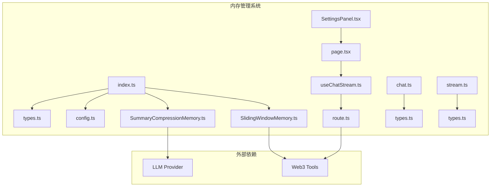

**图表来源**
- [index.ts:1-5](file://apps/web/lib/memory/index.ts#L1-L5)
- [types.ts:1-38](file://apps/web/lib/memory/types.ts#L1-L38)
- [config.ts:1-15](file://apps/web/lib/memory/config.ts#L1-L15)
- [SettingsPanel.tsx:1-192](file://apps/web/components/SettingsPanel.tsx#L1-L192)

**章节来源**
- [index.ts:1-5](file://apps/web/lib/memory/index.ts#L1-L5)
- [types.ts:1-38](file://apps/web/lib/memory/types.ts#L1-L38)
- [config.ts:1-15](file://apps/web/lib/memory/config.ts#L1-L15)

## 核心组件

内存管理系统由五个核心组件构成：

### MemoryManager接口
定义了内存管理的标准接口，采用Strategy模式设计：
- `addMessage(message: Message)`: 添加新消息到记忆
- `getMessages()`: 获取当前上下文（可能包含摘要）
- `shouldCompress()`: 判断是否需要压缩
- `compress()`: 执行异步压缩
- `clear()`: 清空记忆

### MemoryConfig配置
提供灵活的配置选项：
- `compressThreshold`: 触发压缩的消息数阈值（默认10）
- `keepRecentCount`: 保留的最近消息数（默认5）
- `summaryModel`: 摘要用模型（可选）

### SummaryCompressionMemory实现（L3策略）
L3摘要压缩模式的具体实现，包含智能压缩逻辑和错误处理机制。

### SlidingWindowMemory实现（L2策略）
L2滑动窗口模式的具体实现，采用简单的"保留最近N条消息"原则，无需额外LLM处理。

### MemoryStrategy枚举
**新增** 定义可用的内存管理策略：
- `'l3-compression'`: L3摘要压缩策略
- `'l2-sliding-window'`: L2滑动窗口策略

**章节来源**
- [types.ts:12-37](file://apps/web/lib/memory/types.ts#L12-L37)
- [types.ts:3-10](file://apps/web/lib/memory/types.ts#L3-L10)
- [config.ts:3-7](file://apps/web/lib/memory/config.ts#L3-L7)
- [page.tsx:13](file://apps/web/app/page.tsx#L13)

## 架构概览

内存管理系统采用分层架构设计，确保各组件职责清晰且松耦合：

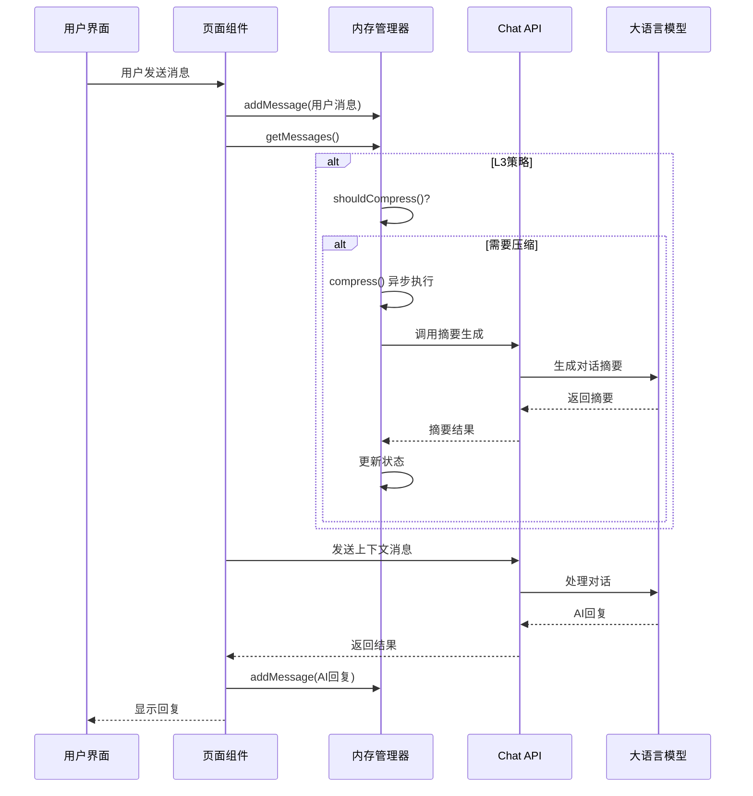

**图表来源**
- [page.tsx:44-120](file://apps/web/app/page.tsx#L44-L120)
- [SummaryCompressionMemory.ts:15-42](file://apps/web/lib/memory/SummaryCompressionMemory.ts#L15-L42)
- [route.ts:90-120](file://apps/web/app/api/chat/route.ts#L90-L120)

## 详细组件分析

### SummaryCompressionMemory类分析

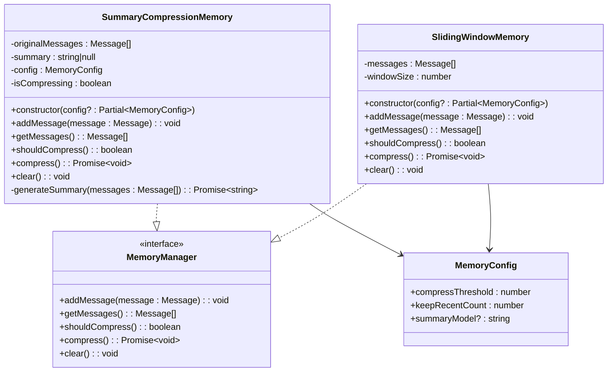

**图表来源**
- [SummaryCompressionMemory.ts:5-111](file://apps/web/lib/memory/SummaryCompressionMemory.ts#L5-L111)
- [SlidingWindowMemory.ts:11-57](file://apps/web/lib/memory/SlidingWindowMemory.ts#L11-L57)
- [types.ts:12-37](file://apps/web/lib/memory/types.ts#L12-L37)
- [types.ts:3-10](file://apps/web/lib/memory/types.ts#L3-L10)

#### 核心算法流程

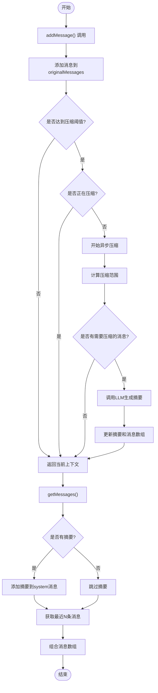

**图表来源**
- [SummaryCompressionMemory.ts:15-74](file://apps/web/lib/memory/SummaryCompressionMemory.ts#L15-L74)
- [SummaryCompressionMemory.ts:24-42](file://apps/web/lib/memory/SummaryCompressionMemory.ts#L24-L42)

#### 错误处理机制

系统实现了完善的错误处理机制：

1. **压缩失败降级**: 当摘要生成失败时，保留完整历史并在下次重试
2. **并发保护**: 使用`isCompressing`标志位防止并发压缩操作
3. **网络异常处理**: 摘要生成过程中的网络错误会被捕获并记录
4. **状态恢复**: 错误发生后系统会回到一致的状态

**章节来源**
- [SummaryCompressionMemory.ts:48-74](file://apps/web/lib/memory/SummaryCompressionMemory.ts#L48-L74)
- [SummaryCompressionMemory.ts:68-73](file://apps/web/lib/memory/SummaryCompressionMemory.ts#L68-L73)

### SlidingWindowMemory类分析

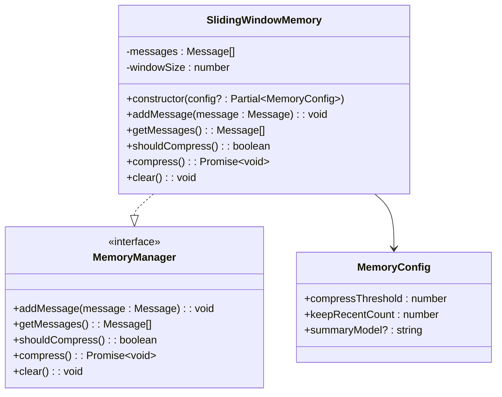

**图表来源**
- [SlidingWindowMemory.ts:11-57](file://apps/web/lib/memory/SlidingWindowMemory.ts#L11-L57)
- [types.ts:12-37](file://apps/web/lib/memory/types.ts#L12-L37)
- [types.ts:3-10](file://apps/web/lib/memory/types.ts#L3-L10)

#### 核心算法流程

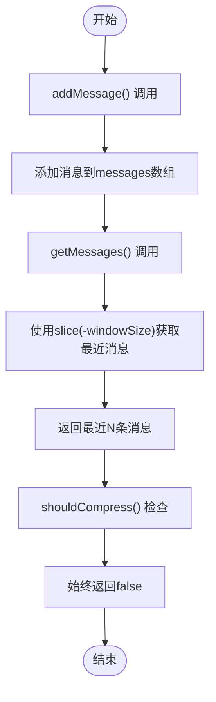

**图表来源**
- [SlidingWindowMemory.ts:24-41](file://apps/web/lib/memory/SlidingWindowMemory.ts#L24-L41)

#### 设计特点

1. **简单高效**: 直接使用数组切片操作，时间复杂度O(n)
2. **无压缩开销**: 不需要额外的LLM调用，节省Token和时间
3. **状态最小化**: 只维护messages数组和windowSize配置
4. **策略一致性**: 复用keepRecentCount作为窗口大小，语义统一

**章节来源**
- [SlidingWindowMemory.ts:5-10](file://apps/web/lib/memory/SlidingWindowMemory.ts#L5-L10)
- [SlidingWindowMemory.ts:15-19](file://apps/web/lib/memory/SlidingWindowMemory.ts#L15-L19)

### 配置管理系统

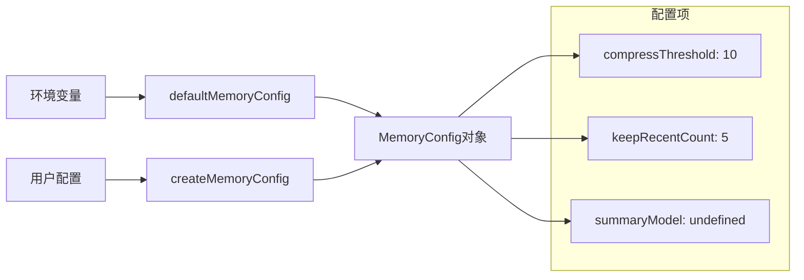

**图表来源**
- [config.ts:3-7](file://apps/web/lib/memory/config.ts#L3-L7)
- [config.ts:9-14](file://apps/web/lib/memory/config.ts#L9-L14)

配置系统支持：
- **环境变量覆盖**: 通过NEXT_PUBLIC_MEMORY_*环境变量自定义行为
- **运行时配置**: 支持在创建实例时传入覆盖配置
- **默认值保证**: 缺少配置时使用合理的默认值

**章节来源**
- [config.ts:1-15](file://apps/web/lib/memory/config.ts#L1-L15)

### 与聊天系统的集成

内存管理系统与聊天系统的集成体现在以下几个方面：

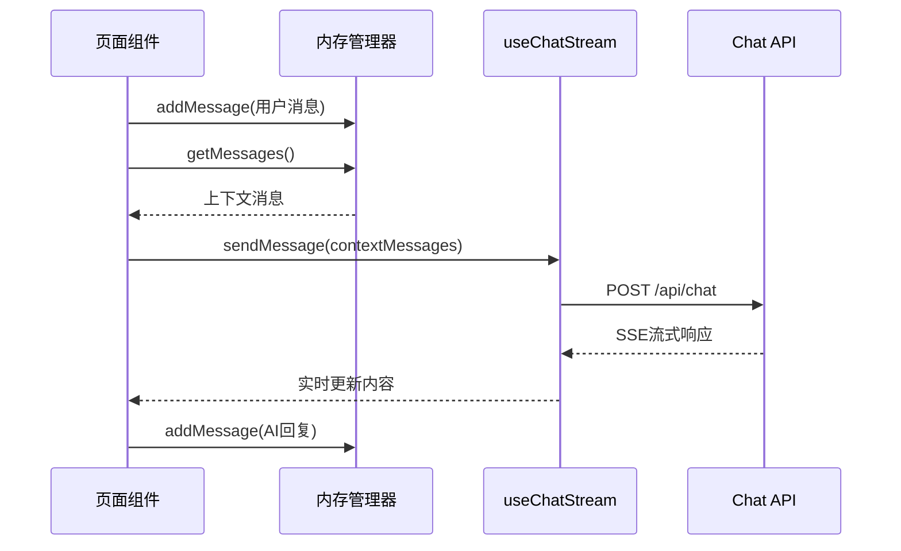

**图表来源**
- [page.tsx:73-97](file://apps/web/app/page.tsx#L73-L97)
- [useChatStream.ts:167-252](file://apps/web/hooks/useChatStream.ts#L167-L252)

**章节来源**
- [page.tsx:44-120](file://apps/web/app/page.tsx#L44-L120)
- [useChatStream.ts:167-252](file://apps/web/hooks/useChatStream.ts#L167-L252)

## 策略对比分析

### L3摘要压缩模式 vs L2滑动窗口模式

| 特性 | L3摘要压缩模式 | L2滑动窗口模式 |
|------|----------------|----------------|
| **设计理念** | 保留上下文完整性，压缩历史信息 | 保留最近信息，丢弃历史信息 |
| **Token消耗** | 显著降低（≥50%） | 基本不变 |
| **LLM调用** | 需要摘要生成 | 无需额外LLM调用 |
| **实现复杂度** | 中等（需要压缩逻辑） | 简单（直接切片） |
| **适用场景** | 长对话、复杂交互 | 短对话、简单交互 |
| **历史信息** | 通过摘要保留关键信息 | 完全丢失早期历史 |
| **性能开销** | 异步压缩，有延迟 | 实时响应，无延迟 |
| **配置需求** | 复杂（阈值、窗口、模型） | 简单（仅窗口大小） |
| **动态切换** | ✅ 支持运行时切换 | ✅ 支持运行时切换 |

### 策略选择指南

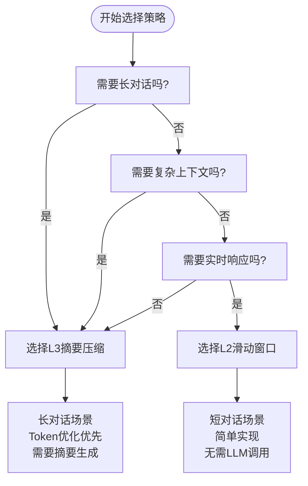

**图表来源**
- [SlidingWindowMemory.ts:5-10](file://apps/web/lib/memory/SlidingWindowMemory.ts#L5-L10)
- [SummaryCompressionMemory.ts:5-10](file://apps/web/lib/memory/SummaryCompressionMemory.ts#L5-L10)

## 动态策略切换机制

**新增** 系统现在支持在运行时动态切换内存管理策略，为用户提供灵活的上下文管理选项。

### 策略切换架构

```mermaid
graph TB
A[用户界面] --> B[SettingsPanel]
B --> C[handleMemoryStrategyChange]
C --> D{选择策略?}
D --> |L3| E[new SummaryCompressionMemory()]
D --> |L2| F[new SlidingWindowMemory()]
E --> G[memoryManager.setInstance]
F --> G
G --> H[实时应用新策略]
```

**图表来源**
- [page.tsx:42-50](file://apps/web/app/page.tsx#L42-L50)
- [SettingsPanel.tsx:92-137](file://apps/web/components/SettingsPanel.tsx#L92-L137)

### 策略切换实现

#### 页面级策略管理
- **状态管理**: 使用`useState`管理当前策略和内存管理器实例
- **实例切换**: 根据用户选择创建对应策略的实例
- **实时应用**: 新策略立即应用于后续消息处理

#### 用户界面集成
- **策略指示器**: 在页面头部显示当前策略状态
- **设置面板**: 提供直观的策略选择界面
- **即时反馈**: 策略切换后立即生效

#### 策略切换流程

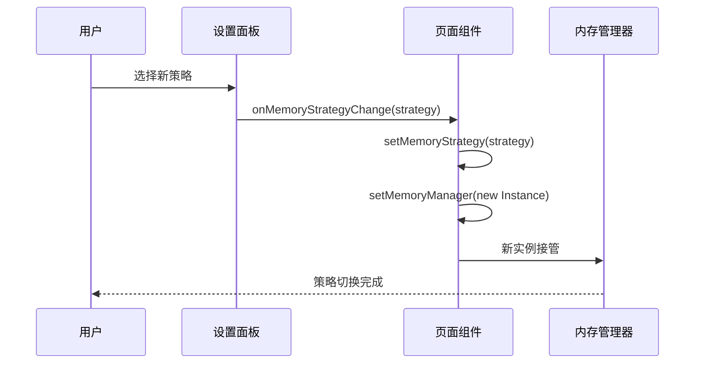

**图表来源**
- [page.tsx:42-50](file://apps/web/app/page.tsx#L42-L50)

**章节来源**
- [page.tsx:25-50](file://apps/web/app/page.tsx#L25-L50)
- [SettingsPanel.tsx:14-39](file://apps/web/components/SettingsPanel.tsx#L14-L39)

## 依赖关系分析

内存管理系统与其他组件的依赖关系如下：

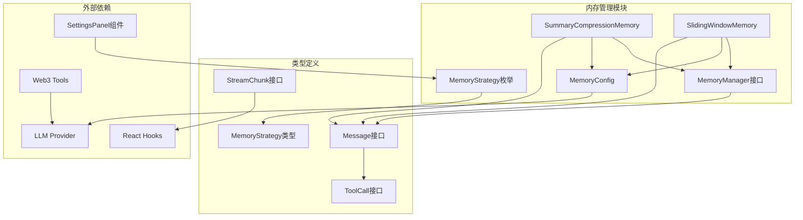

**图表来源**
- [SummaryCompressionMemory.ts:1-3](file://apps/web/lib/memory/SummaryCompressionMemory.ts#L1-L3)
- [SlidingWindowMemory.ts:1-3](file://apps/web/lib/memory/SlidingWindowMemory.ts#L1-L3)
- [types.ts:1](file://apps/web/lib/memory/types.ts#L1)
- [chat.ts:1-28](file://apps/web/types/chat.ts#L1-L28)
- [SettingsPanel.tsx:5](file://apps/web/components/SettingsPanel.tsx#L5)

### 关键依赖特性

1. **松耦合设计**: MemoryManager接口与具体实现分离
2. **类型安全**: 完整的TypeScript类型定义确保编译时安全
3. **可扩展性**: Strategy模式为未来扩展预留接口
4. **无副作用**: 不依赖特定的UI框架或状态管理库
5. **策略透明**: 两种策略对外暴露相同的接口，便于切换
6. **动态绑定**: 支持运行时策略实例的动态创建和切换

**章节来源**
- [types.ts:12-37](file://apps/web/lib/memory/types.ts#L12-L37)
- [SummaryCompressionMemory.ts:1-3](file://apps/web/lib/memory/SummaryCompressionMemory.ts#L1-L3)
- [SlidingWindowMemory.ts:1-3](file://apps/web/lib/memory/SlidingWindowMemory.ts#L1-L3)

## 性能考量

内存管理系统在设计时充分考虑了性能优化：

### Token消耗优化
- **L3摘要压缩**: 将早期对话压缩为摘要，Token消耗降低≥50%
- **L2滑动窗口**: 保持原始消息，Token消耗与对话长度线性增长
- **智能阈值控制**: 基于消息数量而非Token数量的阈值控制，实现可预测的性能
- **最近消息保留**: 保留最近5条原始消息确保上下文完整性

### 内存管理优化
- **L3渐进式压缩**: 异步执行压缩操作，不阻塞主线程
- **L2内存回收**: 窗口溢出时立即释放内存，避免无限增长
- **状态缓存**: 摘要作为system消息缓存，避免重复计算
- **内存回收**: 压缩后及时释放早期消息内存

### 并发处理优化
- **L3防抖机制**: 避免频繁触发压缩操作
- **L3并发控制**: 使用标志位防止并发压缩
- **L2实时响应**: 无压缩操作，实时返回最新消息
- **错误隔离**: 单个压缩失败不影响其他操作

### 动态切换性能
- **零停机切换**: 策略切换过程中不中断消息处理
- **实例复用**: 切换时重新创建实例，避免状态污染
- **即时生效**: 新策略立即应用于后续消息处理
- **资源清理**: 切换前清理旧实例的资源占用

### 性能对比

| 指标 | L3摘要压缩 | L2滑动窗口 | 动态切换 |
|------|------------|------------|----------|
| **初始化开销** | 中等（配置加载） | 低（简单构造） | 低（实例创建） |
| **内存使用** | 动态增长，受压缩影响 | 线性增长，受窗口限制 | 低（实例切换） |
| **Token消耗** | 降低≥50% | 与对话长度线性增长 | 与策略选择相关 |
| **响应延迟** | 压缩期间有延迟 | 无延迟 | 切换瞬间延迟 |
| **CPU使用** | 压缩时较高 | 基本恒定 | 切换时短暂峰值 |
| **存储开销** | 低（摘要） | 中等（原始消息） | 低（实例管理） |
| **切换成本** | - | - | 低（实例创建/销毁） |

## 故障排除指南

### 常见问题及解决方案

#### 1. 摘要生成失败（L3策略）
**症状**: 系统降级为完整历史，无摘要
**原因**: LLM服务不可用或响应超时
**解决方案**: 
- 检查LLM服务连接状态
- 增加网络超时时间
- 验证API密钥配置

#### 2. 压缩操作阻塞（L3策略）
**症状**: 用户界面卡顿
**原因**: 压缩操作在主线程执行
**解决方案**:
- 确认压缩操作为异步执行
- 检查`isCompressing`标志位状态
- 实施适当的节流机制

#### 3. 窗口大小配置不当（L2策略）
**症状**: 保留消息过多或过少
**原因**: keepRecentCount配置不合理
**解决方案**:
- 验证NEXT_PUBLIC_MEMORY_KEEP_RECENT环境变量
- 根据对话场景调整窗口大小
- 测试不同配置下的性能表现

#### 4. 配置参数无效
**症状**: 自定义配置未生效
**原因**: 环境变量未正确设置
**解决方案**:
- 验证NEXT_PUBLIC_MEMORY_*环境变量
- 检查配置加载顺序
- 确认运行时配置覆盖逻辑

#### 5. 策略切换异常
**症状**: 切换后消息处理异常
**原因**: 实例状态不一致或资源泄漏
**解决方案**:
- 确认新实例正确创建
- 检查旧实例资源清理
- 验证内存管理器接口实现

#### 6. 动态切换性能问题
**症状**: 策略切换时界面卡顿
**原因**: 实例创建或销毁操作阻塞主线程
**解决方案**:
- 确认实例创建为同步操作
- 检查是否有异步初始化步骤
- 优化实例创建流程

**章节来源**
- [SummaryCompressionMemory.ts:68-73](file://apps/web/lib/memory/SummaryCompressionMemory.ts#L68-L73)
- [SlidingWindowMemory.ts:39-41](file://apps/web/lib/memory/SlidingWindowMemory.ts#L39-L41)
- [config.ts:3-7](file://apps/web/lib/memory/config.ts#L3-L7)
- [page.tsx:42-50](file://apps/web/app/page.tsx#L42-L50)

### 调试技巧

1. **日志监控**: 利用console.error输出压缩失败信息
2. **状态检查**: 通过shouldCompress()判断压缩时机
3. **性能分析**: 监控压缩操作的执行时间
4. **内存使用**: 跟踪originalMessages数组大小变化
5. **策略切换**: 通过MemoryManager接口透明切换策略
6. **实例追踪**: 监控内存管理器实例的生命周期
7. **切换验证**: 确认策略切换后消息处理正常

## 结论

内存管理系统成功实现了两种记忆管理策略：L3摘要压缩模式和L2滑动窗口模式，均采用Strategy模式设计，为AI代理系统提供了灵活高效的上下文管理解决方案。

**L3摘要压缩模式**的优势：
- Token消耗显著降低（≥50%）
- 上下文完整性得到保证
- 适用于长对话和复杂交互场景
- 智能的异步压缩机制

**L2滑动窗口模式**的优势：
- 实现简单，易于理解和维护
- 无额外LLM调用，节省Token和时间
- 实时响应，无压缩延迟
- 内存使用受控，避免无限增长

**新增的动态策略切换功能**进一步增强了系统的灵活性：
- **实时切换**: 用户可在运行时选择最适合的策略
- **零停机**: 切换过程中不影响正在进行的对话
- **即时生效**: 新策略立即应用于后续消息处理
- **用户友好**: 提供直观的策略选择界面

系统的设计充分体现了以下优势：
- **可扩展性**: Strategy模式为未来扩展预留了接口
- **灵活性**: 支持多种策略并存，便于用户选择
- **稳定性**: 完善的错误处理和降级机制
- **性能**: 针对不同场景的优化策略
- **易用性**: 统一的接口设计，透明的策略切换
- **动态性**: 支持运行时策略调整，适应不同对话需求

该系统为AI代理的长期发展奠定了坚实的基础，为后续实现更复杂的记忆管理策略（如L4向量数据库）做好了准备。通过提供多种策略选择和动态切换能力，系统能够适应不同的应用场景和性能要求，为用户提供最佳的记忆管理体验。

**更新** 系统现已支持动态内存策略切换，用户可以根据对话需求实时调整上下文管理方式，实现了从静态配置到动态优化的升级，进一步提升了系统的实用性和用户体验。