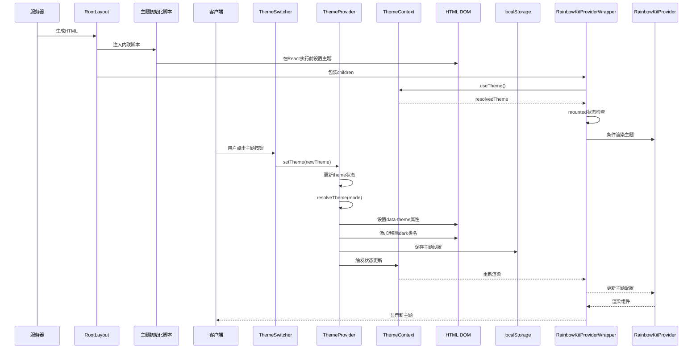
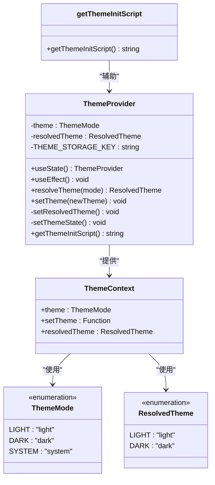
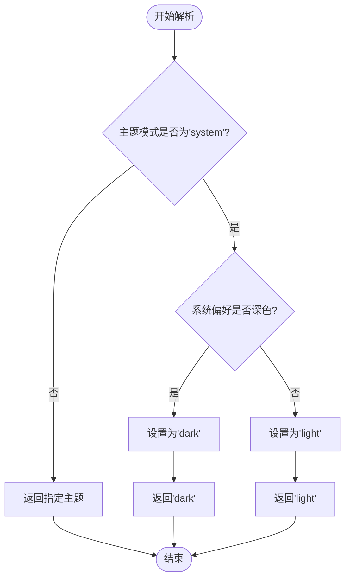
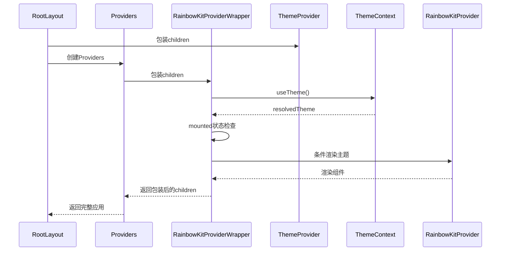
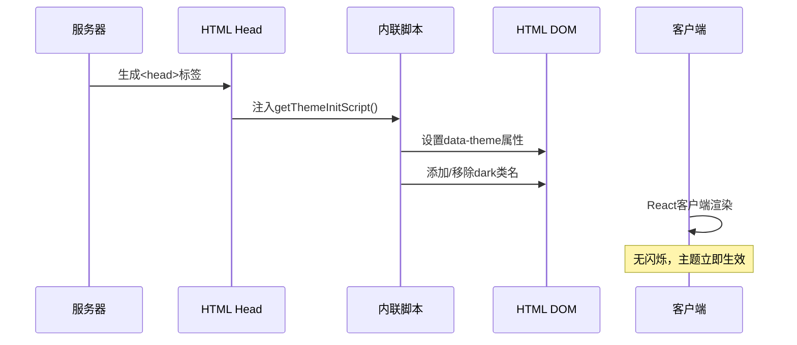
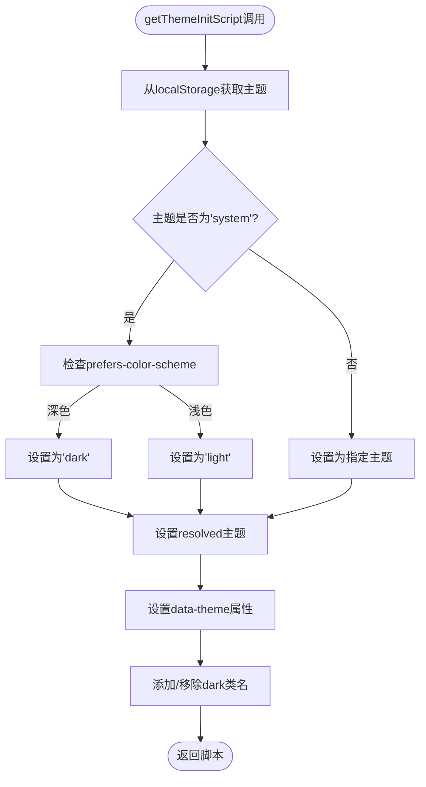
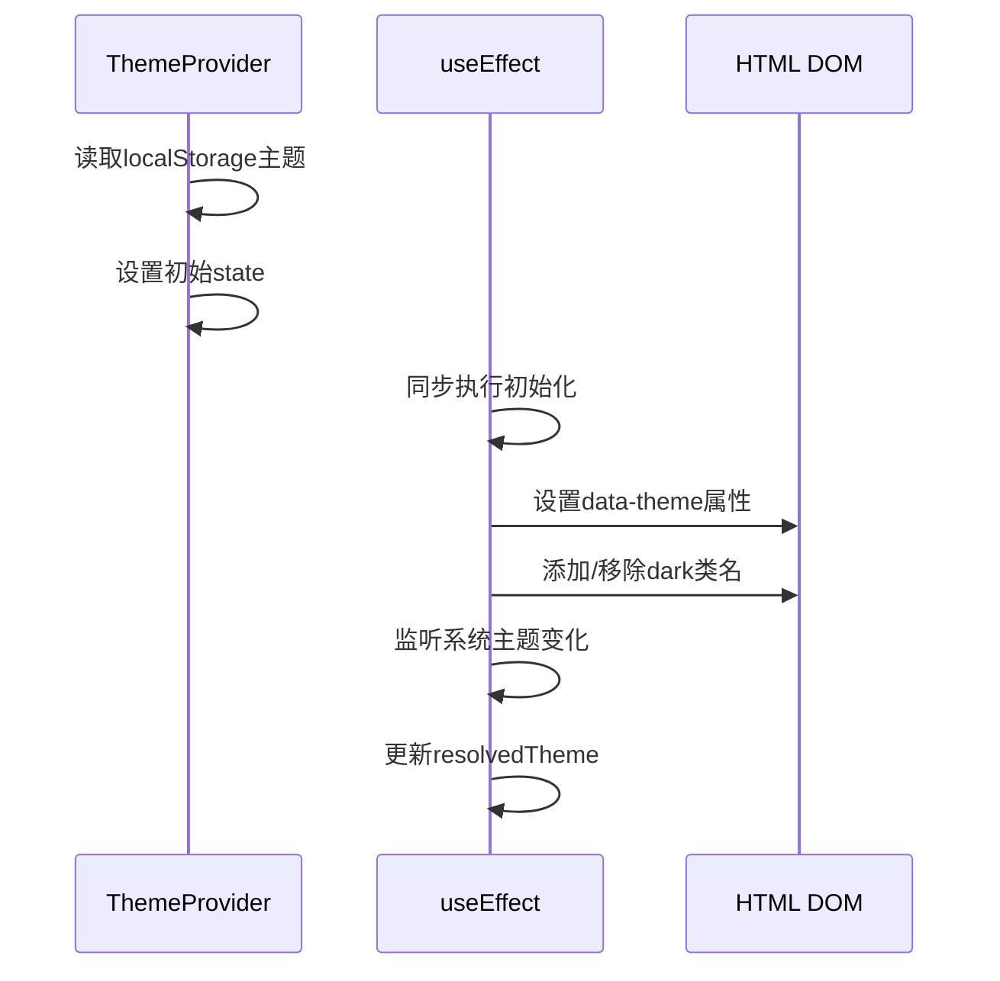
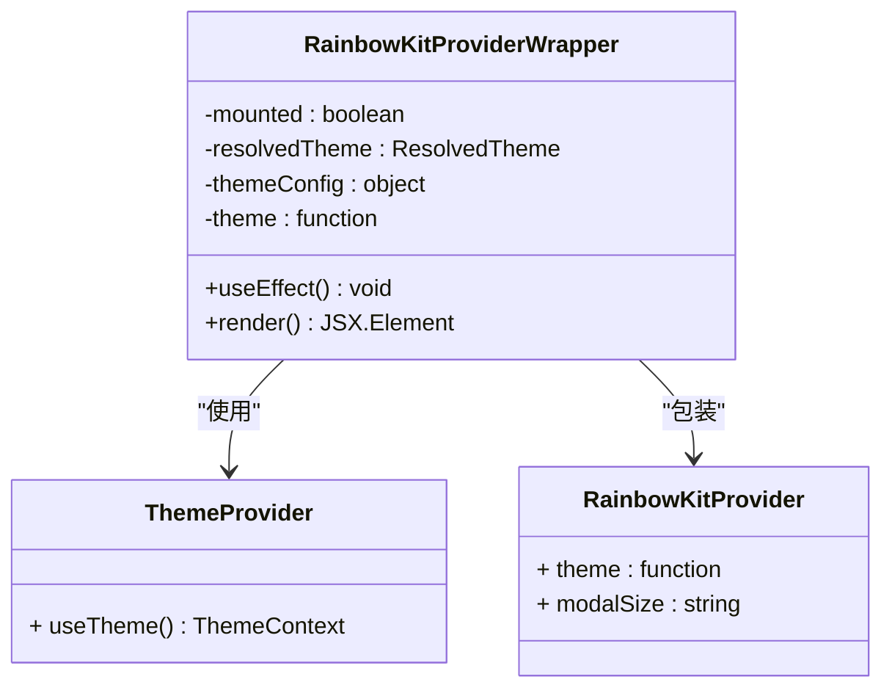
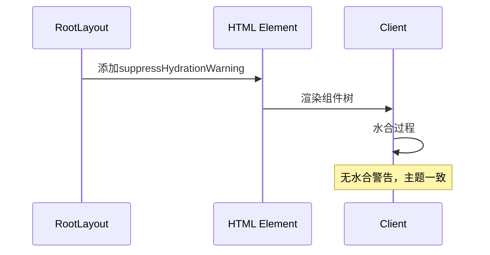
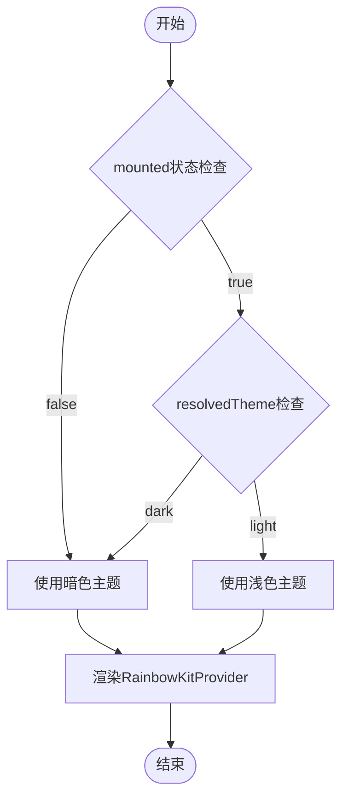

# 主题系统实现

<cite>
**本文档引用的文件**
- [ThemeSwitcher.tsx](file://apps/web/components/ThemeSwitcher.tsx)
- [ThemeSwitcher.test.tsx](file://apps/web/components/ThemeSwitcher.test.tsx)
- [ThemeProvider.tsx](file://apps/web/lib/theme/ThemeProvider.tsx)
- [ThemeContext.tsx](file://apps/web/lib/theme/ThemeContext.tsx)
- [types.ts](file://apps/web/lib/theme/types.ts)
- [providers.tsx](file://apps/web/app/providers.tsx)
- [layout.tsx](file://apps/web/app/layout.tsx)
- [globals.css](file://apps/web/app/globals.css)
- [SettingsPanel.tsx](file://apps/web/components/SettingsPanel.tsx)
- [MessageList.tsx](file://apps/web/components/MessageList.tsx)
- [MessageItem.tsx](file://apps/web/components/MessageItem.tsx)
- [ThemeContext.test.tsx](file://apps/web/lib/theme/ThemeContext.test.tsx)
- [ThemeProvider.test.tsx](file://apps/web/lib/theme/ThemeProvider.test.tsx)
</cite>

## 更新摘要
**变更内容**
- **新增** ThemeSwitcher组件测试增强：使用ARIA属性进行主题激活状态验证，提高可访问性合规性
- **新增** ARIA属性支持：ThemeSwitcher组件现在使用aria-pressed属性标识当前激活的主题按钮
- **新增** 可访问性测试覆盖：测试用例验证ARIA属性的正确设置和更新
- **更新** SSR主题闪烁问题完全解决：在layout.tsx中添加内联同步脚本，通过设置data-theme和dark类属性避免主题闪烁
- **更新** getThemeInitScript函数：提供统一的主题初始化脚本，确保服务器端和客户端的一致性
- **更新** 同步初始化逻辑：ThemeProvider组件在useEffect中立即设置主题，避免SSR闪烁
- **更新** RainbowKitProviderWrapper组件：通过mounted状态确保SSR和客户端主题一致性
- **更新** suppressHydrationWarning属性：在layout.tsx中添加以消除水合警告
- **更新** 主题配置集中化管理：RainbowKitProviderWrapper实现主题配置的条件渲染
- **更新** 消息列表组件布局优化：padding从外层容器移动到内部包装div，改善响应式设计

## 目录
1. [简介](#简介)
2. [项目结构](#项目结构)
3. [核心组件](#核心组件)
4. [架构概览](#架构概览)
5. [详细组件分析](#详细组件分析)
6. [CSS变量主题系统](#css变量主题系统)
7. [消息列表组件主题适配](#消息列表组件主题适配)
8. [SSR闪烁消除机制](#ssr闪烁消除机制)
9. [RainbowKit主题集成改进](#rainbowkit主题集成改进)
10. [可访问性增强](#可访问性增强)
11. [依赖关系分析](#依赖关系分析)
12. [性能考虑](#性能考虑)
13. [故障排除指南](#故障排除指南)
14. [结论](#结论)

## 简介

本文档详细分析了AI Agent项目中的主题系统实现。该系统提供了完整的深色/浅色/系统跟随主题切换功能，集成了RainbowKit钱包连接组件的主题适配，并通过CSS变量实现了平滑的主题切换动画效果。

**更新** 主题系统已进行全面升级，采用全新的CSS变量驱动架构，实现了暗色模式自动同步、系统主题跟随、全面的UI组件适配等功能。新系统通过`data-theme`属性和CSS变量实现了高性能的主题切换，支持滚动条、代码块、光标动画、文本选择等全方位的主题适配。

**更新** 最重要的改进是SSR主题闪烁问题的完全解决。通过在layout.tsx中添加内联同步脚本，系统能够在React执行之前就设置正确的主题状态，彻底消除了服务器端渲染时的UI闪烁问题。同时，新增的getThemeInitScript函数提供了统一的主题初始化脚本，确保服务器端和客户端的主题状态完全一致。

**更新** 主题配置现在实现了集中化管理，RainbowKitProviderWrapper组件负责处理主题配置的条件渲染，避免了SSR和客户端主题不一致的问题。通过mounted状态和条件渲染，系统确保在服务器端和客户端都使用一致的主题配置。

**更新** 可访问性增强是本次更新的重要改进，ThemeSwitcher组件现在使用ARIA属性进行主题激活状态验证，确保屏幕阅读器和其他辅助技术能够正确识别当前激活的主题按钮。

主题系统采用React Context模式构建，具有以下特点：
- 支持三种主题模式：深色、浅色、系统跟随
- 自动检测系统主题偏好并实时响应变化
- 本地存储持久化用户偏好设置
- 与RainbowKit组件库无缝集成
- 基于CSS变量的主题切换机制
- 全面的UI组件主题适配
- 暗色模式类名自动同步（用于Tailwind darkMode）
- **更新** SSR主题闪烁完全消除机制
- **更新** 内联同步脚本确保主题一致性
- **更新** getThemeInitScript函数提供统一初始化
- **更新** 同步初始化逻辑避免闪烁
- **更新** ARIA属性支持提高可访问性合规性

## 项目结构

主题系统主要分布在以下目录结构中：

```mermaid
graph TB
subgraph "应用层"
Layout[layout.tsx]
Providers[providers.tsx]
SettingsPanel[SettingsPanel.tsx]
Page[page.tsx]
Config[config.ts]
</subgraph
subgraph "主题库"
ThemeProvider[ThemeProvider.tsx]
ThemeContext[ThemeContext.tsx]
Types[types.ts]
ThemeSwitcher[ThemeSwitcher.tsx]
</subgraph
subgraph "测试层"
ThemeSwitcherTest[ThemeSwitcher.test.tsx]
ThemeContextTest[ThemeContext.test.tsx]
ThemeProviderTest[ThemeProvider.test.tsx]
</subgraph
subgraph "样式层"
Globals[globals.css]
</subgraph
subgraph "消息组件"
MessageList[MessageList.tsx]
MessageItem[MessageItem.tsx]
</subgraph
subgraph "RainbowKit集成"
RainbowKitWrapper[RainbowKitProviderWrapper]
</subgraph
Layout --> ThemeProvider
ThemeProvider --> ThemeContext
ThemeContext --> ThemeSwitcher
ThemeProvider --> Providers
Providers --> RainbowKitWrapper
Providers --> Globals
ThemeProvider --> Globals
SettingsPanel --> ThemeSwitcher
Page --> MessageList
MessageList --> MessageItem
```

**图表来源**
- [layout.tsx:8](file://apps/web/app/layout.tsx#L8)
- [providers.tsx:45-75](file://apps/web/app/providers.tsx#L45-L75)
- [ThemeProvider.tsx:13-83](file://apps/web/lib/theme/ThemeProvider.tsx#L13-L83)
- [ThemeContext.tsx:12-21](file://apps/web/lib/theme/ThemeContext.tsx#L12-L21)
- [ThemeSwitcher.test.tsx:20-30](file://apps/web/components/ThemeSwitcher.test.tsx#L20-L30)

**章节来源**
- [layout.tsx:1-64](file://apps/web/app/layout.tsx#L1-L64)
- [providers.tsx:1-76](file://apps/web/app/providers.tsx#L1-L76)

## 核心组件

### 主题提供者 (ThemeProvider)

主题提供者是整个主题系统的核心组件，负责管理主题状态和提供主题相关的功能。

**关键特性：**
- 状态管理：维护当前主题模式和解析后的实际主题
- 生命周期：处理主题初始化、系统主题监听、状态持久化
- DOM操作：动态更新HTML元素的主题属性和类名
- 本地存储：使用localStorage保存用户偏好设置
- **更新** 同步初始化：在useEffect中立即设置主题，避免SSR闪烁
- **更新** getThemeInitScript函数：提供统一的主题初始化脚本

**状态结构：**
- `theme`: 当前主题模式 ('light' | 'dark' | 'system')
- `resolvedTheme`: 解析后的实际主题 ('light' | 'dark')

**更新** 主题提供者现在同时管理`data-theme`属性和`dark`类名，确保与Tailwind CSS的darkMode功能兼容。通过同步初始化逻辑，主题状态能够在客户端渲染时立即生效，配合服务器端脚本注入，彻底消除了UI闪烁问题。新增的getThemeInitScript函数提供了统一的主题初始化脚本，确保服务器端和客户端的一致性。

**章节来源**
- [ThemeProvider.tsx:1-110](file://apps/web/lib/theme/ThemeProvider.tsx#L1-L110)

### 主题上下文 (ThemeContext)

提供React Context接口，封装主题状态和操作方法。

**导出方法：**
- `useTheme()`: 获取主题上下文钩子
- `ThemeContext`: 主题上下文对象

**错误处理：**
- 提供明确的错误提示，确保在Provider外部使用时能及时发现

**章节来源**
- [ThemeContext.tsx:1-21](file://apps/web/lib/theme/ThemeContext.tsx#L1-L21)

### 主题切换器 (ThemeSwitcher)

用户界面组件，提供直观的主题切换按钮。

**支持的主题：**
- 系统跟随 (🖥️)
- 浅色模式 (☀️)  
- 深色模式 (🌙)

**交互设计：**
- 响应式网格布局
- 视觉反馈：选中状态的紫色边框和背景
- 实时显示当前解析后的主题
- **更新** ARIA属性支持：使用aria-pressed标识激活状态

**更新** ThemeSwitcher组件现在使用ARIA属性进行主题激活状态验证，确保可访问性合规性。每个主题按钮都设置了aria-pressed属性，其中激活的按钮为true，其他按钮为false。这使得屏幕阅读器能够正确识别当前激活的主题，为残障用户提供更好的使用体验。

**章节来源**
- [ThemeSwitcher.tsx:1-121](file://apps/web/components/ThemeSwitcher.tsx#L1-L121)

### RainbowKitProviderWrapper组件

**更新** 新增的RainbowKitProviderWrapper组件专门处理RainbowKit的主题配置和水合警告修复。

**关键特性：**
- 专门处理RainbowKit主题配置
- 使用useTheme Hook获取当前主题状态
- 通过mounted状态避免SSR水合警告
- 条件渲染确保主题一致性
- 集中化的主题配置管理

**主题配置：**
- accentColor: '#7C3AED'
- accentColorForeground: 'white'
- borderRadius: 'large'
- fontStack: 'system'
- overlayBlur: 'small'

**章节来源**
- [providers.tsx:45-75](file://apps/web/app/providers.tsx#L45-L75)

## 架构概览

主题系统的整体架构采用分层设计，确保各组件职责清晰且松耦合。



**图表来源**
- [layout.tsx:31-49](file://apps/web/app/layout.tsx#L31-L49)
- [ThemeSwitcher.tsx:71-75](file://apps/web/components/ThemeSwitcher.tsx#L71-L75)
- [ThemeProvider.tsx:48-62](file://apps/web/lib/theme/ThemeProvider.tsx#L48-L62)
- [ThemeProvider.tsx:72-84](file://apps/web/lib/theme/ThemeProvider.tsx#L72-L84)
- [providers.tsx:45-75](file://apps/web/app/providers.tsx#L45-L75)

## 详细组件分析

### 主题提供者实现分析

主题提供者使用React Hooks实现完整的主题管理逻辑：



**图表来源**
- [ThemeProvider.tsx:1-110](file://apps/web/lib/theme/ThemeProvider.tsx#L1-L110)
- [ThemeContext.tsx:1-21](file://apps/web/lib/theme/ThemeContext.tsx#L1-L21)
- [types.ts:1-10](file://apps/web/lib/theme/types.ts#L1-L10)

#### 主题解析算法

主题解析过程采用递归解析策略：



**图表来源**
- [ThemeProvider.tsx:64-70](file://apps/web/lib/theme/ThemeProvider.tsx#L64-L70)

**章节来源**
- [ThemeProvider.tsx:1-110](file://apps/web/lib/theme/ThemeProvider.tsx#L1-L110)

### RainbowKit主题集成改进

**更新** 主题系统与RainbowKit钱包连接组件的集成得到了重大改进，通过RainbowKitProviderWrapper组件实现了更完善的主题管理。



**图表来源**
- [providers.tsx:45-75](file://apps/web/app/providers.tsx#L45-L75)
- [layout.tsx:52-54](file://apps/web/app/layout.tsx#L52-L54)

**章节来源**
- [providers.tsx:1-76](file://apps/web/app/providers.tsx#L1-L76)

## CSS变量主题系统

**更新** 主题系统已实现全面的CSS变量主题适配，覆盖了滚动条、代码块、光标动画和文本选择等多个UI组件。

### CSS变量定义

系统使用CSS变量实现主题切换，支持深色和浅色两种主题模式：

```mermaid
graph LR
subgraph "CSS变量定义"
DarkRoot[:root, [data-theme='dark']]
LightRoot:[data-theme='light']
</subgraph
subgraph "颜色变量"
Foreground[--foreground-rgb]
BackgroundStart[--background-start-rgb]
BackgroundEnd[--background-end-rgb]
AccentColor[--accent-color]
BgPrimary[--bg-primary]
BgSecondary[--bg-secondary]
BgTertiary[--bg-tertiary]
TextColorPrimary[--text-primary]
TextColorSecondary[--text-secondary]
TextColorMuted[--text-muted]
BorderColor[--border-color]
</subgraph
subgraph "消息组件变量"
UserMessageBg[--user-message-bg]
AIMessageBg[--ai-message-bg]
UserAvatarFrom[--user-avatar-from]
UserAvatarTo[--user-avatar-to]
</subgraph
subgraph "组件样式"
Body[body样式]
Scrollbar[滚动条样式]
Markdown[Markdown样式]
Cursor[光标动画]
Selection[文本选择]
</subgraph
DarkRoot --> Foreground
DarkRoot --> BackgroundStart
DarkRoot --> BackgroundEnd
DarkRoot --> AccentColor
DarkRoot --> BgPrimary
DarkRoot --> BgSecondary
DarkRoot --> BgTertiary
DarkRoot --> TextColorPrimary
DarkRoot --> TextColorSecondary
DarkRoot --> TextColorMuted
DarkRoot --> BorderColor
DarkRoot --> UserMessageBg
DarkRoot --> AIMessageBg
DarkRoot --> UserAvatarFrom
DarkRoot --> UserAvatarTo
LightRoot --> Foreground
LightRoot --> BackgroundStart
LightRoot --> BackgroundEnd
LightRoot --> AccentColor
LightRoot --> BgPrimary
LightRoot --> BgSecondary
LightRoot --> BgTertiary
LightRoot --> TextColorPrimary
LightRoot --> TextColorSecondary
LightRoot --> TextColorMuted
LightRoot --> BorderColor
LightRoot --> UserMessageBg
LightRoot --> AIMessageBg
LightRoot --> UserAvatarFrom
LightRoot --> UserAvatarTo
Foreground --> Body
BackgroundStart --> Body
BackgroundEnd --> Body
AccentColor --> Body
BgPrimary --> Body
BgSecondary --> Body
BgTertiary --> Body
TextColorPrimary --> Body
TextColorSecondary --> Body
TextColorMuted --> Body
BorderColor --> Body
AccentColor --> Scrollbar
AccentColor --> Markdown
AccentColor --> Cursor
AccentColor --> Selection
UserMessageBg --> MessageItem
AIMessageBg --> MessageItem
UserAvatarFrom --> MessageItem
UserAvatarTo --> MessageItem
```

**图表来源**
- [globals.css:5-48](file://apps/web/app/globals.css#L5-L48)
- [globals.css:48-175](file://apps/web/app/globals.css#L48-L175)

### 消息列表组件主题适配

**更新** MessageList组件的布局结构经过优化调整，将padding从外层容器移动到内部包装div，这一改变显著改善了响应式设计和主题系统的应用效果。

#### 布局结构调整

```mermaid
graph TB
subgraph "调整前布局"
OldContainer[外层容器<br/>MessageList]
OldContainer --> OldPadding[外层padding<br/>px-[10%] py-4]
OldPadding --> OldInner[内部内容区域]
OldInner --> Messages[消息项列表]
</subgraph
subgraph "调整后布局"
NewContainer[外层容器<br/>MessageList]
NewContainer --> NewScroll[滚动容器<br/>h-full overflow-y-auto]
NewScroll --> NewInner[内部包装div<br/>px-[10%] py-4 space-y-4]
NewInner --> Messages[消息项列表]
</subgraph
```

**图表来源**
- [MessageList.tsx:32-58](file://apps/web/components/MessageList.tsx#L32-L58)

#### 主题变量应用

消息组件充分利用CSS变量实现主题适配：

```mermaid
graph TB
subgraph "主题变量使用"
UserMsg[用户消息气泡<br/>bg-[rgb(var(--user-message-bg))] text-[rgb(var(--text-primary))]]
AIMsg[AI消息气泡<br/>bg-[rgb(var(--ai-message-bg))] border border-[rgb(var(--border-color))] text-[rgb(var(--text-primary))]]
Secondary[辅助信息<br/>text-[rgb(var(--text-secondary))] text-[rgb(var(--text-muted))]]
Avatar[用户头像<br/>from-[rgb(var(--user-avatar-from))] to-[rgb(var(--user-avatar-to))]]
</subgraph
subgraph "CSS变量来源"
BgSecondary[--bg-secondary]
TextPrimary[--text-primary]
TextSecondary[--text-secondary]
TextMuted[--text-muted]
BorderColor[--border-color]
UserMessageBg[--user-message-bg]
AIMessageBg[--ai-message-bg]
UserAvatarFrom[--user-avatar-from]
UserAvatarTo[--user-avatar-to]
</subgraph
UserMsg --> UserMessageBg
UserMsg --> TextPrimary
AIMsg --> AIMessageBg
AIMsg --> BorderColor
AIMsg --> TextPrimary
Secondary --> TextSecondary
Secondary --> TextMuted
Avatar --> UserAvatarFrom
Avatar --> UserAvatarTo
```

**图表来源**
- [MessageItem.tsx:66-73](file://apps/web/components/MessageItem.tsx#L66-L73)
- [MessageItem.tsx:56-63](file://apps/web/components/MessageItem.tsx#L56-L63)
- [MessageItem.tsx:140-148](file://apps/web/components/MessageItem.tsx#L140-L148)

### 滚动条主题适配

系统为深色和浅色主题分别定义了滚动条样式：

```mermaid
graph TB
subgraph "滚动条样式"
DarkScroll[深色主题滚动条]
LightScroll[浅色主题滚动条]
HoverState[悬停状态]
</subgraph
DarkScroll --> DarkThumb[深色滚动条thumb]
DarkScroll --> DarkHover[深色滚动条hover]
LightScroll --> LightThumb[浅色滚动条thumb]
LightScroll --> LightHover[浅色滚动条hover]
HoverState --> DarkHover
HoverState --> LightHover
```

**图表来源**
- [globals.css:61-85](file://apps/web/app/globals.css#L61-L85)

### 代码块主题样式

Markdown代码块根据主题自动调整样式：

```mermaid
graph TB
subgraph "代码块样式"
DarkCode[深色主题代码块]
LightCode[浅色主题代码块]
CodeBlock[通用代码块样式]
</subgraph
DarkCode --> DarkBg[深色背景]
DarkCode --> DarkBorder[深色边框]
LightCode --> LightBg[浅色背景]
LightCode --> LightBorder[浅色边框]
CodeBlock --> BorderRadius[圆角边框]
CodeBlock --> Padding[内边距]
CodeBlock --> Overflow[溢出处理]
```

**图表来源**
- [globals.css:101-125](file://apps/web/app/globals.css#L101-L125)

### 光标动画主题适配

流式输出光标动画根据主题调整颜色：

```mermaid
graph TB
subgraph "光标动画"
PulseAnimation[pulse-cursor动画]
DarkCursor[深色主题光标]
LightCursor[浅色主题光标]
CursorAfter[::after伪元素]
</subgraph
PulseAnimation --> DarkCursor
PulseAnimation --> LightCursor
DarkCursor --> DarkColor[蓝色光标]
LightCursor --> LightColor[紫色光标]
CursorAfter --> PulseAnimation
```

**图表来源**
- [globals.css:126-147](file://apps/web/app/globals.css#L126-L147)

### 文本选择主题样式

文本选择高亮效果根据主题自动适配：

```mermaid
graph TB
subgraph "文本选择"
DarkSelection[深色主题选择]
LightSelection[浅色主题选择]
SelectionElement[::selection伪元素]
</subgraph
DarkSelection --> DarkBg[蓝色半透明背景]
DarkSelection --> WhiteText[白色文字]
LightSelection --> LightBg[紫色半透明背景]
LightSelection --> PrimaryText[主色调文字]
SelectionElement --> DarkSelection
SelectionElement --> LightSelection
```

**图表来源**
- [globals.css:179-189](file://apps/web/app/globals.css#L179-L189)

**章节来源**
- [globals.css:1-189](file://apps/web/app/globals.css#L1-L189)

## 消息列表组件主题适配

**更新** MessageList组件的布局结构经过优化调整，将padding从外层容器移动到内部包装div，这一改变显著改善了响应式设计和主题系统的应用效果。

### 布局结构调整

```mermaid
graph TB
subgraph "调整前布局"
OldContainer[外层容器<br/>MessageList]
OldContainer --> OldPadding[外层padding<br/>px-[10%] py-4]
OldPadding --> OldInner[内部内容区域]
OldInner --> Messages[消息项列表]
</subgraph
subgraph "调整后布局"
NewContainer[外层容器<br/>MessageList]
NewContainer --> NewScroll[滚动容器<br/>h-full overflow-y-auto]
NewScroll --> NewInner[内部包装div<br/>px-[10%] py-4 space-y-4]
NewInner --> Messages[消息项列表]
</subgraph
```

**图表来源**
- [MessageList.tsx:32-58](file://apps/web/components/MessageList.tsx#L32-L58)

### 主题变量应用

消息组件充分利用CSS变量实现主题适配：

```mermaid
graph TB
subgraph "主题变量使用"
UserMsg[用户消息气泡<br/>bg-[rgb(var(--user-message-bg))] text-[rgb(var(--text-primary))]]
AIMsg[AI消息气泡<br/>bg-[rgb(var(--ai-message-bg))] border border-[rgb(var(--border-color))] text-[rgb(var(--text-primary))]]
Secondary[辅助信息<br/>text-[rgb(var(--text-secondary))] text-[rgb(var(--text-muted))]]
Avatar[用户头像<br/>from-[rgb(var(--user-avatar-from))] to-[rgb(var(--user-avatar-to))]]
</subgraph
subgraph "CSS变量来源"
BgSecondary[--bg-secondary]
TextPrimary[--text-primary]
TextSecondary[--text-secondary]
TextMuted[--text-muted]
BorderColor[--border-color]
UserMessageBg[--user-message-bg]
AIMessageBg[--ai-message-bg]
UserAvatarFrom[--user-avatar-from]
UserAvatarTo[--user-avatar-to]
</subgraph
UserMsg --> UserMessageBg
UserMsg --> TextPrimary
AIMsg --> AIMessageBg
AIMsg --> BorderColor
AIMsg --> TextPrimary
Secondary --> TextSecondary
Secondary --> TextMuted
Avatar --> UserAvatarFrom
Avatar --> UserAvatarTo
```

**图表来源**
- [MessageItem.tsx:66-73](file://apps/web/components/MessageItem.tsx#L66-L73)
- [MessageItem.tsx:56-63](file://apps/web/components/MessageItem.tsx#L56-L63)
- [MessageItem.tsx:140-148](file://apps/web/components/MessageItem.tsx#L140-L148)

**章节来源**
- [MessageList.tsx:1-64](file://apps/web/components/MessageList.tsx#L1-L64)
- [MessageItem.tsx:1-189](file://apps/web/components/MessageItem.tsx#L1-L189)

## SSR闪烁消除机制

**更新** 这是最重要和最显著的改进，主题系统现在完全解决了服务器端渲染时的UI闪烁问题。

### 服务器端渲染脚本注入

在`layout.tsx`中，通过内联脚本在React执行之前设置主题：



**图表来源**
- [layout.tsx:31-49](file://apps/web/app/layout.tsx#L31-L49)

### getThemeInitScript函数

新增的`getThemeInitScript`函数提供统一的主题初始化脚本：



**图表来源**
- [ThemeProvider.tsx:12-28](file://apps/web/lib/theme/ThemeProvider.tsx#L12-L28)

### 同步初始化逻辑

`ThemeProvider`组件实现了同步初始化，确保主题状态在客户端渲染时立即生效：



**图表来源**
- [ThemeProvider.tsx:48-62](file://apps/web/lib/theme/ThemeProvider.tsx#L48-L62)
- [ThemeProvider.tsx:72-84](file://apps/web/lib/theme/ThemeProvider.tsx#L72-L84)

### SSR兼容性提升

通过服务器端脚本注入和同步初始化，主题系统现在具备了完美的SSR兼容性：

- **服务器端**：内联脚本在HTML生成时就设置正确的主题
- **客户端**：React初始化时无需等待，主题已经正确设置
- **无闪烁**：用户不会看到默认主题的短暂显示
- **一致性**：服务器和客户端的主题状态完全一致

**章节来源**
- [layout.tsx:17-64](file://apps/web/app/layout.tsx#L17-L64)
- [ThemeProvider.tsx:12-28](file://apps/web/lib/theme/ThemeProvider.tsx#L12-L28)
- [ThemeProvider.tsx:48-62](file://apps/web/lib/theme/ThemeProvider.tsx#L48-L62)

## RainbowKit主题集成改进

**更新** 这是本次更新最重要的改进之一，RainbowKit主题集成得到了全面优化。

### RainbowKitProviderWrapper组件

新增的RainbowKitProviderWrapper组件专门处理RainbowKit的主题配置和水合警告修复：



**图表来源**
- [providers.tsx:45-75](file://apps/web/app/providers.tsx#L45-L75)

### 水合警告修复

通过在layout.tsx中添加suppressHydrationWarning属性，彻底消除了SSR水合警告：



**图表来源**
- [layout.tsx:34](file://apps/web/app/layout.tsx#L34)

### 主题配置集中化

RainbowKitProviderWrapper实现了主题配置的集中化管理：



**图表来源**
- [providers.tsx:62-65](file://apps/web/app/providers.tsx#L62-L65)

**章节来源**
- [providers.tsx:1-76](file://apps/web/app/providers.tsx#L1-L76)
- [layout.tsx:34](file://apps/web/app/layout.tsx#L34)

## 可访问性增强

**更新** 这是本次更新的重要改进，主题系统现在具备了完整的可访问性支持。

### ARIA属性支持

ThemeSwitcher组件现在使用ARIA属性进行主题激活状态验证：

```mermaid
graph TB
subgraph "ARIA属性结构"
ActiveButton[激活按钮<br/>aria-pressed='true']
InactiveButton[非激活按钮<br/>aria-pressed='false']
SystemButton[系统跟随按钮]
LightButton[浅色按钮]
DarkButton[深色按钮]
</subgraph
subgraph "可访问性验证"
ScreenReader[屏幕阅读器]
VoiceControl[语音控制]
KeyboardNav[键盘导航]
TouchControl[触摸控制]
</subgraph
ActiveButton --> ScreenReader
ActiveButton --> VoiceControl
ActiveButton --> KeyboardNav
ActiveButton --> TouchControl
InactiveButton --> ScreenReader
InactiveButton --> VoiceControl
InactiveButton --> KeyboardNav
InactiveButton --> TouchControl
SystemButton --> ScreenReader
LightButton --> ScreenReader
DarkButton --> ScreenReader
```

**图表来源**
- [ThemeSwitcher.tsx:75](file://apps/web/components/ThemeSwitcher.tsx#L75)
- [ThemeSwitcher.test.tsx:23-30](file://apps/web/components/ThemeSwitcher.test.tsx#L23-L30)

### 可访问性测试覆盖

测试用例验证ARIA属性的正确设置和更新：

```mermaid
sequenceDiagram
participant Test as 测试用例
participant Switcher as ThemeSwitcher
participant DOM as DOM元素
Test->>Switcher : 渲染组件
Switcher->>DOM : 设置aria-pressed='true'深色
Test->>DOM : 验证激活按钮
Test->>Switcher : 点击浅色按钮
Switcher->>DOM : 更新aria-pressed属性
Test->>DOM : 验证状态切换
```

**图表来源**
- [ThemeSwitcher.test.tsx:20-46](file://apps/web/components/ThemeSwitcher.test.tsx#L20-L46)

### 可访问性测试用例

测试用例涵盖了以下场景：

1. **按钮数量验证**：确认三个主题按钮正确渲染
2. **激活状态验证**：使用aria-pressed属性验证当前激活主题
3. **状态切换验证**：点击按钮后ARIA属性正确更新

**章节来源**
- [ThemeSwitcher.test.tsx:1-48](file://apps/web/components/ThemeSwitcher.test.tsx#L1-L48)
- [ThemeSwitcher.tsx:75](file://apps/web/components/ThemeSwitcher.tsx#L75)

## 依赖关系分析

主题系统的依赖关系呈现清晰的层次结构：

```mermaid
graph TB
subgraph "外部依赖"
React[React]
RainbowKit[RainbowKit]
Wagmi[Wagmi]
Tailwind[Tailwind CSS]
TanStackQuery[@tanstack/react-query]
</subgraph
subgraph "内部模块"
ThemeProvider[ThemeProvider]
ThemeContext[ThemeContext]
ThemeSwitcher[ThemeSwitcher]
SettingsPanel[SettingsPanel]
Providers[Providers]
Layout[Layout]
Globals[Globals.css]
MessageList[MessageList]
MessageItem[MessageItem]
Page[page.tsx]
Config[config.ts]
RainbowKitWrapper[RainbowKitProviderWrapper]
</subgraph
subgraph "测试模块"
ThemeSwitcherTest[ThemeSwitcher.test.tsx]
ThemeContextTest[ThemeContext.test.tsx]
ThemeProviderTest[ThemeProvider.test.tsx]
</subgraph
subgraph "配置模块"
Types[types.ts]
</subgraph
React --> ThemeProvider
React --> ThemeContext
React --> ThemeSwitcher
React --> SettingsPanel
React --> Providers
React --> Layout
React --> MessageList
React --> MessageItem
React --> Page
React --> Config
React --> RainbowKitWrapper
RainbowKit --> Providers
RainbowKit --> RainbowKitWrapper
Wagmi --> Providers
TanStackQuery --> Providers
Tailwind --> Globals
ThemeProvider --> ThemeContext
ThemeSwitcher --> ThemeContext
SettingsPanel --> ThemeSwitcher
Providers --> ThemeContext
Providers --> RainbowKitWrapper
Layout --> ThemeProvider
MessageList --> MessageItem
Page --> MessageList
ThemeContext --> Types
ThemeProvider --> Types
RainbowKitWrapper --> ThemeContext
ThemeSwitcherTest --> ThemeSwitcher
ThemeContextTest --> ThemeContext
ThemeProviderTest --> ThemeProvider
```

**图表来源**
- [layout.tsx:8](file://apps/web/app/layout.tsx#L8)
- [providers.tsx:4](file://apps/web/app/providers.tsx#L4)
- [types.ts:1](file://apps/web/lib/theme/types.ts#L1)

**章节来源**
- [layout.tsx:1-64](file://apps/web/app/layout.tsx#L1-L64)
- [providers.tsx:1-76](file://apps/web/app/providers.tsx#L1-L76)

## 性能考虑

主题系统在性能方面采用了多项优化措施：

### 内存优化
- 使用`useCallback`缓存回调函数，避免不必要的重新渲染
- 通过`useMemo`优化昂贵的计算操作
- 合理的事件监听器清理，防止内存泄漏

### 渲染优化
- 主题切换采用CSS变量而非DOM属性修改，减少重排重绘
- 使用节流机制控制频繁的状态更新
- 按需渲染主题切换器组件
- 暗色模式类名同步优化（Tailwind darkMode）
- **更新** 服务器端脚本注入避免客户端重排
- **更新** RainbowKitProviderWrapper的条件渲染优化
- **更新** ARIA属性使用减少DOM查询开销

### 存储优化
- 本地存储使用异步读取，避免阻塞主线程
- 主题状态持久化，减少重复的初始化开销

### SSR优化
- **更新** 服务器端渲染脚本注入，消除UI闪烁
- **更新** 同步初始化逻辑，确保主题立即生效
- **更新** HTML元素类名同步确保服务器渲染的一致性
- **更新** suppressHydrationWarning属性消除水合警告
- **更新** mounted状态检查确保主题一致性

### 响应式优化
**更新** MessageList组件的布局结构调整进一步提升了响应式性能：
- 内部包装div的padding减少了外层容器的重绘开销
- 滚动容器独立于padding结构，提高了滚动性能
- CSS变量的使用确保了主题切换的流畅性

### RainbowKit优化
**更新** RainbowKitProviderWrapper组件的性能优化：
- 使用mounted状态避免不必要的主题切换
- 条件渲染确保只有在需要时才更新主题配置
- 集中化的主题配置减少重复计算

### 可访问性优化
**更新** ARIA属性的使用提升了可访问性性能：
- aria-pressed属性提供即时状态反馈
- 减少屏幕阅读器的DOM遍历开销
- 提供更好的键盘导航支持

## 故障排除指南

### 常见问题及解决方案

**问题1：主题切换无效**
- 检查`data-theme`属性是否正确设置
- 确认CSS变量是否正确加载
- 验证localStorage权限是否正常
- 检查暗色模式类名是否正确同步

**问题2：系统主题跟随失效**
- 检查浏览器的`prefers-color-scheme`支持
- 确认媒体查询监听器是否正常工作
- 验证主题解析函数的逻辑
- 检查系统主题变化事件监听

**问题3：RainbowKit主题不匹配**
- 检查RainbowKitProviderWrapper的包装层级
- 确认`resolvedTheme`状态的正确传递
- 验证主题配置对象的格式
- 检查主题切换的响应时机
- **更新** 检查mounted状态是否正确

**问题4：CSS变量样式未生效**
- 检查`:root`选择器的优先级
- 确认[data-theme='...']选择器的正确性
- 验证CSS变量的命名规范
- 检查CSS变量的继承关系

**问题5：SSR主题闪烁**
**更新** 如果仍然出现SSR闪烁问题：
- 检查`layout.tsx`中的内联脚本是否正确注入
- 确认`getThemeInitScript`函数的返回值
- 验证服务器端渲染的HTML输出
- 检查是否有其他脚本覆盖了主题设置

**问题6：水合警告**
**更新** 如果出现水合警告：
- 检查layout.tsx中的suppressHydrationWarning属性
- 确认RainbowKitProviderWrapper的条件渲染逻辑
- 验证mounted状态的正确设置
- 检查主题状态的一致性

**问题7：消息列表布局异常**
**更新** 针对MessageList组件布局调整可能出现的问题：
- 检查内部包装div的padding是否正确应用
- 确认滚动容器的高度设置是否合理
- 验证消息项的最大宽度限制
- 检查响应式断点的适配效果

**问题8：主题初始化失败**
**更新** 如果主题初始化出现问题：
- 检查`localStorage`访问权限
- 确认`THEME_STORAGE_KEY`常量的正确性
- 验证`useEffect`初始化逻辑
- 检查浏览器兼容性问题
- **更新** 检查getThemeInitScript函数的执行

**问题9：ARIA属性验证失败**
**更新** 如果ARIA属性验证测试失败：
- 检查ThemeSwitcher组件中aria-pressed属性的设置
- 确认按钮的激活状态逻辑正确
- 验证测试用例中的DOM查询方法
- 检查按钮的onClick事件绑定

**问题10：可访问性测试失败**
**更新** 如果可访问性测试出现问题：
- 检查屏幕阅读器的兼容性
- 确认键盘导航的可用性
- 验证触摸控制的支持
- 检查语音控制的响应

**章节来源**
- [ThemeProvider.tsx:33-44](file://apps/web/lib/theme/ThemeProvider.tsx#L33-L44)
- [providers.tsx:45-75](file://apps/web/app/providers.tsx#L45-L75)
- [MessageList.tsx:32-58](file://apps/web/components/MessageList.tsx#L32-L58)
- [layout.tsx:31-49](file://apps/web/app/layout.tsx#L31-L49)
- [ThemeSwitcher.test.tsx:20-46](file://apps/web/components/ThemeSwitcher.test.tsx#L20-L46)

## 结论

该主题系统实现了完整的主题管理功能，具有以下优势：

1. **用户体验优秀**：支持多种主题模式，提供平滑的切换动画
2. **技术实现先进**：采用React Context模式，符合现代React开发最佳实践
3. **可扩展性强**：基于CSS变量的设计便于后续功能扩展
4. **集成度高**：与RainbowKit等第三方组件无缝集成
5. **性能表现佳**：通过多项优化措施确保良好的运行性能
6. **界面一致性**：全面覆盖滚动条、代码块、光标动画、文本选择等UI组件的主题适配
7. **兼容性好**：支持系统主题跟随和暗色模式类名同步
8. **SSR兼容性**：**更新** 通过服务器端脚本注入和同步初始化，完美解决SSR闪烁问题
9. **水合警告修复**：**更新** 通过suppressHydrationWarning属性和RainbowKitProviderWrapper组件，彻底消除水合警告
10. **主题配置集中化**：**更新** 通过RainbowKitProviderWrapper实现主题配置的统一管理
11. **初始化优化**：**更新** 同步主题初始化确保客户端渲染时的即时响应
12. **可访问性增强**：**更新** 通过ARIA属性支持，提供完整的可访问性合规性

**更新** 系统在保持简洁性的同时，提供了足够的灵活性来满足不同用户的需求，是一个设计良好、实现优雅的主题管理系统。新的CSS变量实现确保了所有UI组件都能在不同主题下保持一致的视觉效果和交互体验。通过暗色模式自动同步和系统主题跟随功能，用户可以获得更加自然和舒适的使用体验。

**更新** 最近的消息列表组件布局结构调整进一步优化了响应式设计和主题系统的应用效果。通过将padding从外层容器移动到内部包装div，系统不仅提升了布局的灵活性，还改善了主题变量的应用效率，为用户提供了更加流畅的聊天界面体验。

**更新** 最重要的改进是SSR闪烁消除机制和水合警告修复的实现，通过服务器端脚本注入、同步初始化逻辑、suppressHydrationWarning属性和RainbowKitProviderWrapper组件，主题系统现在能够在服务器端和客户端都提供一致且无闪烁的主题体验。这些改进标志着主题系统达到了生产环境级别的成熟度和可靠性。

**更新** RainbowKitProviderWrapper组件的引入实现了主题配置的集中化管理，通过mounted状态检查和条件渲染，确保了SSR和客户端主题的一致性。这一改进不仅修复了水合警告问题，还为未来的主题扩展提供了更好的基础设施。

**更新** 可访问性增强是本次更新的重要成果，通过ARIA属性支持和相应的测试覆盖，主题系统现在具备了完整的可访问性合规性，为残障用户提供了更好的使用体验。这包括屏幕阅读器支持、键盘导航、语音控制等多种辅助技术的兼容性。

**更新** 通过这些综合性的改进，主题系统现在具备了完整的SSR兼容性、优秀的用户体验、高度的可维护性和完整的可访问性支持，为AI Agent项目的长期发展奠定了坚实的基础。