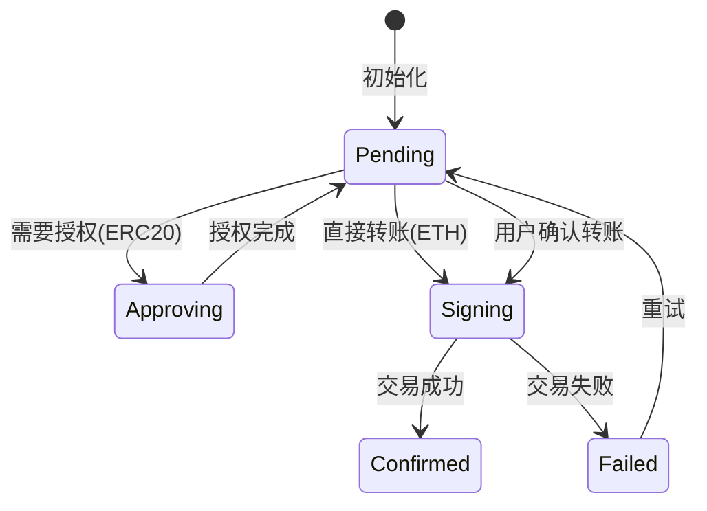

# TransferCard 转账卡片组件

## 概述

基于自然语言的链上转账组件，用户通过指令（如"转 0.01 USDT 到 0x..."）触发 AI 创建转账卡片，支持 ETH 原生转账和 ERC20 代币转账。集成 wagmi + viem 实现链上交互。

## Props 接口

```typescript
interface TransferCardProps {
  data: TransferData
  conversationId: string
  onUpdate?: (data: TransferData) => void
}

interface TransferData {
  id: string
  from: string
  to: string
  tokenSymbol: string
  tokenAddress?: string   // ERC20合约地址，ETH转账为空
  amount: string
  chain: ChainId          // ethereum | polygon | bsc
  status: TransferStatus
  txHash?: string
  error?: string
  estimatedGas?: string
}

type TransferStatus = 'pending' | 'approving' | 'signing' | 'confirmed' | 'failed'
```

## 状态流转



## 确认流程

1. **初始化**: 加载转账数据，检查钱包连接状态
2. **链校验**: 检查当前链是否匹配，不匹配则提示切换
3. **余额检查**: 验证 Token 余额 + Gas 余额是否充足
4. **授权检查** (ERC20): 调用 `allowance()` 检查授权额度
   - 不足则触发 `approve()` 交易，等待确认后验证额度
5. **执行转账**: 调用 `sendTransaction`(ETH) 或 `writeContract`(ERC20)
6. **等待确认**: 监听交易回执
7. **状态持久化**: 通过 Supabase 更新转账状态和 txHash

## 支持的链和Token

| 链 | 原生币 | 主要ERC20 |
|----|--------|----------|
| Ethereum | ETH | USDT, USDC, DAI |
| Polygon | MATIC | USDT, USDC |
| BSC | BNB | USDT, BUSD |

## 数据持久化

转账状态通过 `/lib/supabase/transfers.ts` 存储到 Supabase `transfer_cards` 表，与 conversation 通过外键关联。
