# TransferCard转账卡片组件

<cite>
**本文档引用的文件**
- [TransferCard.tsx](file://apps/web/components/cards/TransferCard.tsx)
- [transfer.ts](file://apps/web/types/transfer.ts)
- [transfers.ts](file://apps/web/lib/supabase/transfers.ts)
- [tokens.ts](file://apps/web/lib/tokens.ts)
- [client.ts](file://apps/web/lib/supabase/client.ts)
- [create_transfer_cards.sql](file://supabase/migrations/create_transfer_cards.sql)
- [fix_transfer_cards_rls.sql](file://supabase/migrations/fix_transfer_cards_rls.sql)
- [route.ts](file://apps/web/app/api/tools/route.ts)
- [MessageItem.tsx](file://apps/web/components/MessageItem.tsx)
- [useChatStream.ts](file://apps/web/hooks/useChatStream.ts)
- [2026-04-24-feat-web3-transfer-card.md](file://docs/changelog/2026-04-24-feat-web3-transfer-card.md)
- [2026-04-23-feat-ui-enhancements-and-theme-system.md](file://docs/changelog/2026-04-23-feat-ui-enhancements-and-theme-system.md)
- [globals.css](file://apps/web/app/globals.css)
- [tailwind.config.ts](file://apps/web/tailwind.config.ts)
- [page.tsx](file://apps/web/app/page.tsx)
</cite>

## 更新摘要
**变更内容**
- 集成Quantum Nexus主题设计系统，实现青色+紫色霓虹主题风格
- 优化玻璃拟态效果，增强视觉层次和沉浸感
- 增强动画体验，包括缩放、滑入、脉冲等动画效果
- 优化状态显示和交互反馈，提升用户体验
- 完善状态管理逻辑，确保消息ID和转账卡片ID保持同步

## 目录
1. [简介](#简介)
2. [项目结构](#项目结构)
3. [核心组件](#核心组件)
4. [架构概览](#架构概览)
5. [详细组件分析](#详细组件分析)
6. [Quantum Nexus主题系统](#quantum-nexus主题系统)
7. [动画与交互体验](#动画与交互体验)
8. [依赖关系分析](#依赖关系分析)
9. [性能考虑](#性能考虑)
10. [故障排除指南](#故障排除指南)
11. [结论](#结论)

## 简介

TransferCard转账卡片组件是Web3 AI Agent项目中的核心功能模块，它实现了基于自然语言的链上转账功能。该组件允许用户通过简单的自然语言指令（如"转 0.01 USDT 到 0x..."）来创建转账请求，并提供完整的转账流程管理，包括ETH原生转账和ERC20代币转账。

**更新** 该组件现已完整集成了Quantum Nexus主题设计系统，采用深邃夜空的青色+紫色霓虹主题风格，实现了现代化的玻璃拟态效果和丰富的动画体验。组件优化了状态显示和交互反馈，增强了视觉层次感和沉浸感，为用户提供了更加优质的Web3转账体验。

该组件集成了钱包连接、交易签名、状态管理和数据持久化等功能，采用React Hooks模式，充分利用了wagmi和viem等现代Web3开发工具库。

## 项目结构

TransferCard组件位于应用的组件层次结构中，与聊天系统紧密集成：

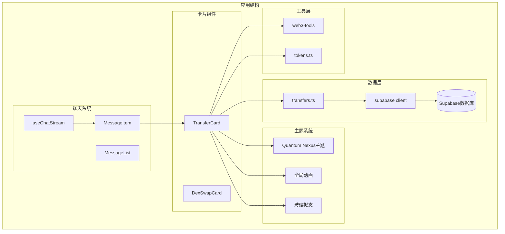

**图表来源**
- [TransferCard.tsx:1-658](file://apps/web/components/cards/TransferCard.tsx#L1-L658)
- [MessageItem.tsx:45-76](file://apps/web/components/MessageItem.tsx#L45-L76)
- [transfers.ts:1-142](file://apps/web/lib/supabase/transfers.ts#L1-L142)
- [globals.css:1-571](file://apps/web/app/globals.css#L1-L571)

**章节来源**
- [TransferCard.tsx:1-658](file://apps/web/components/cards/TransferCard.tsx#L1-L658)
- [MessageItem.tsx:45-76](file://apps/web/components/MessageItem.tsx#L45-L76)

## 核心组件

### TransferCard组件架构

TransferCard是一个功能完整的React组件，具有以下核心特性：

#### 状态管理
- **转账状态**: pending、approving、signing、confirmed、failed
- **链配置**: 支持以太坊、Polygon、BSC三大主流链
- **Token配置**: 内置主流Token配置，支持ERC20和原生币种
- **钱包集成**: 通过wagmi hooks实现钱包连接和交易签名

#### 主要功能模块

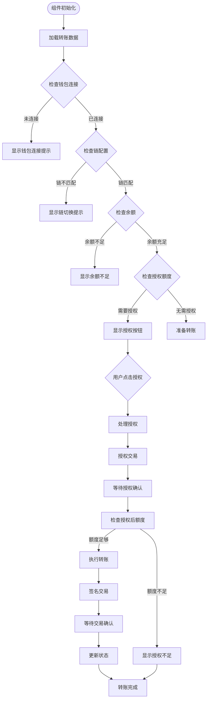

**图表来源**
- [TransferCard.tsx:303-393](file://apps/web/components/cards/TransferCard.tsx#L303-L393)
- [TransferCard.tsx:153-183](file://apps/web/components/cards/TransferCard.tsx#L153-L183)

**章节来源**
- [TransferCard.tsx:98-658](file://apps/web/components/cards/TransferCard.tsx#L98-L658)

## 架构概览

TransferCard组件采用了分层架构设计，确保了良好的可维护性和扩展性：

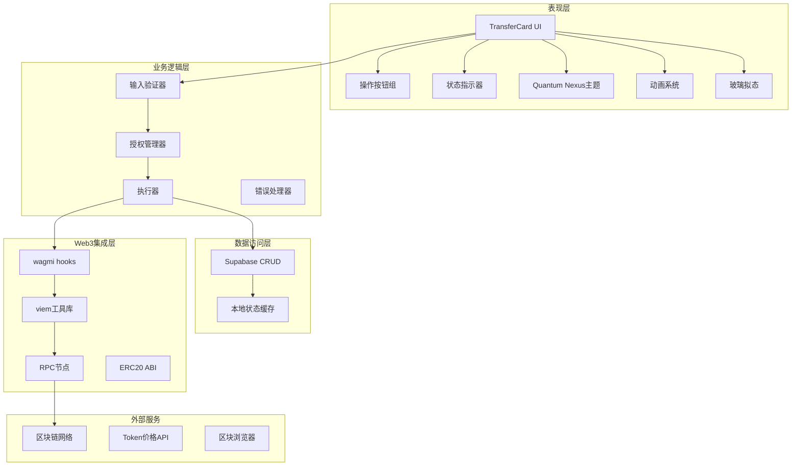

**图表来源**
- [TransferCard.tsx:117-393](file://apps/web/components/cards/TransferCard.tsx#L117-L393)
- [transfers.ts:20-79](file://apps/web/lib/supabase/transfers.ts#L20-L79)
- [globals.css:188-251](file://apps/web/app/globals.css#L188-L251)

### 数据流架构

组件的数据流遵循严格的单向数据流原则：

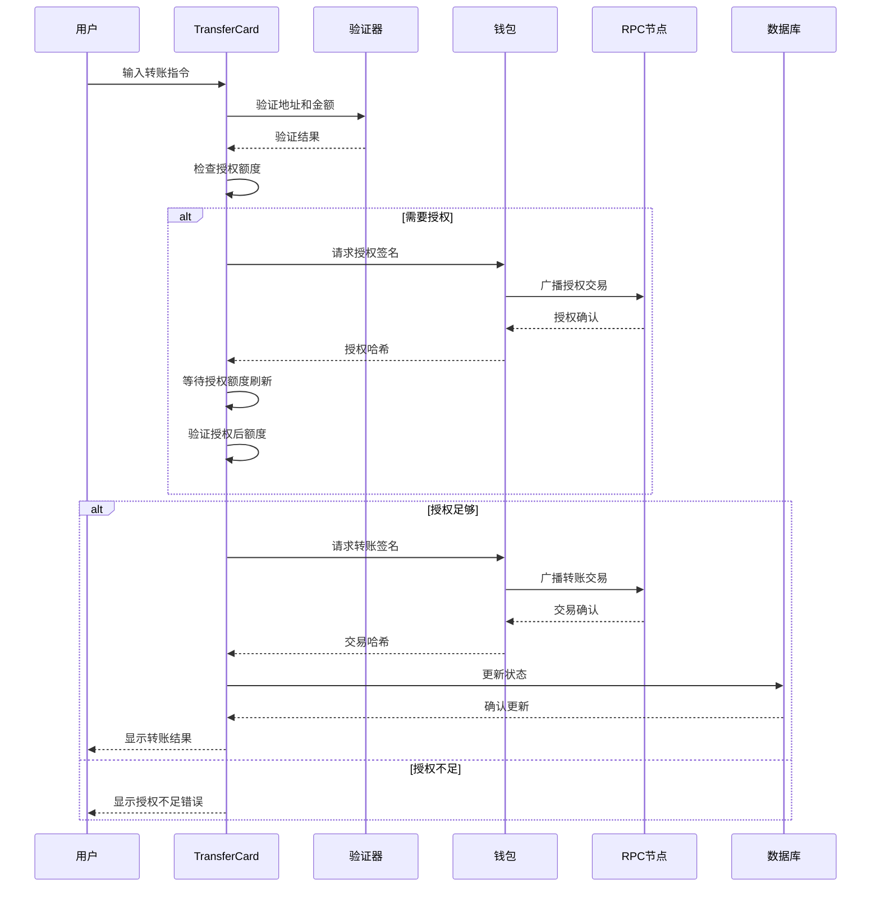

**图表来源**
- [TransferCard.tsx:303-393](file://apps/web/components/cards/TransferCard.tsx#L303-L393)
- [transfers.ts:51-79](file://apps/web/lib/supabase/transfers.ts#L51-L79)

**章节来源**
- [TransferCard.tsx:1-658](file://apps/web/components/cards/TransferCard.tsx#L1-L658)

## 详细组件分析

### 组件类图

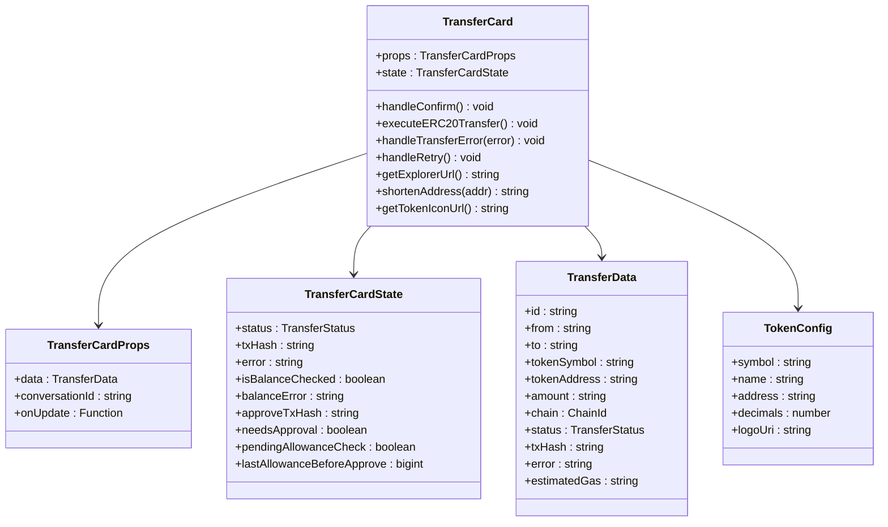

**图表来源**
- [TransferCard.tsx:11-15](file://apps/web/components/cards/TransferCard.tsx#L11-L15)
- [transfer.ts:7-19](file://apps/web/types/transfer.ts#L7-L19)

### 状态转换流程

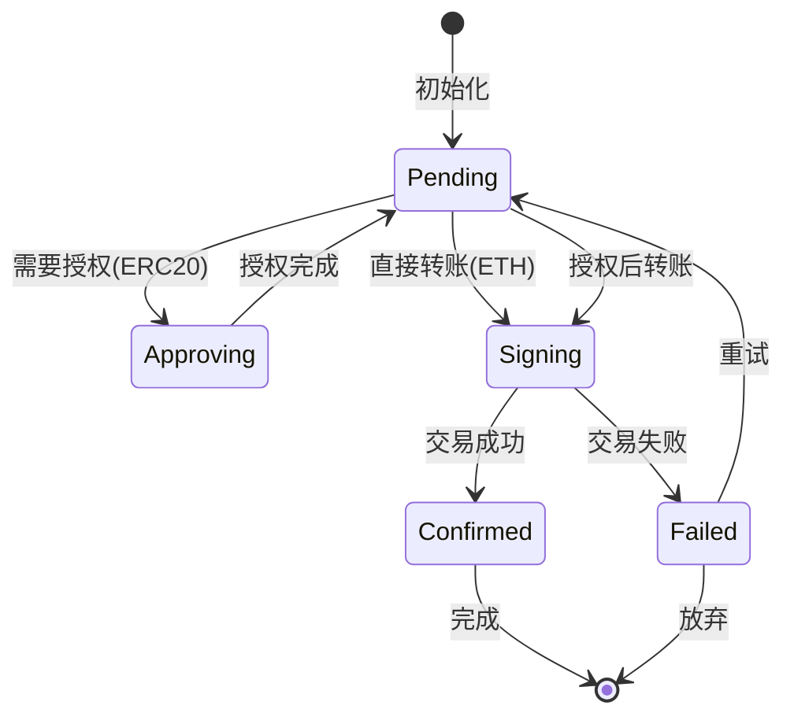

**图表来源**
- [TransferCard.tsx:90-96](file://apps/web/components/cards/TransferCard.tsx#L90-L96)
- [transfer.ts:3](file://apps/web/types/transfer.ts#L3)

### 核心功能实现

#### 余额检查机制

组件实现了多层次的余额检查机制：

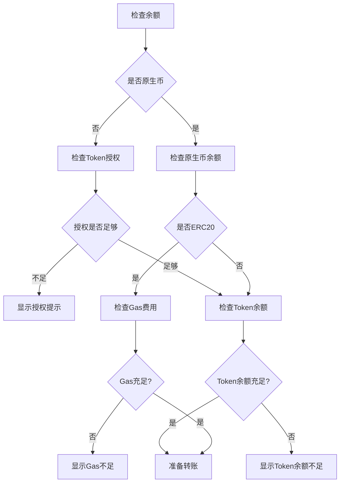

**图表来源**
- [TransferCard.tsx:201-247](file://apps/web/components/cards/TransferCard.tsx#L201-L247)

#### 错误处理策略

组件采用分级错误处理策略：

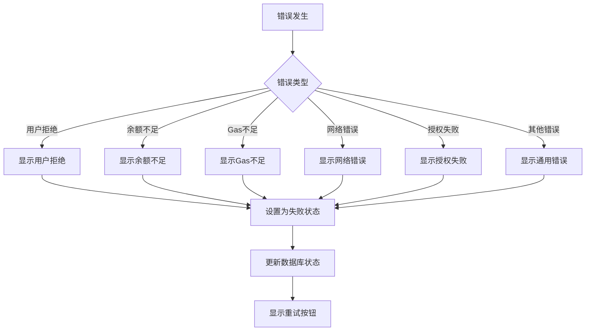

**图表来源**
- [TransferCard.tsx:395-419](file://apps/web/components/cards/TransferCard.tsx#L395-L419)

#### ERC20授权工作流程

**更新** 组件现已完整实现了ERC20授权工作流程，包括关键的状态管理修复：

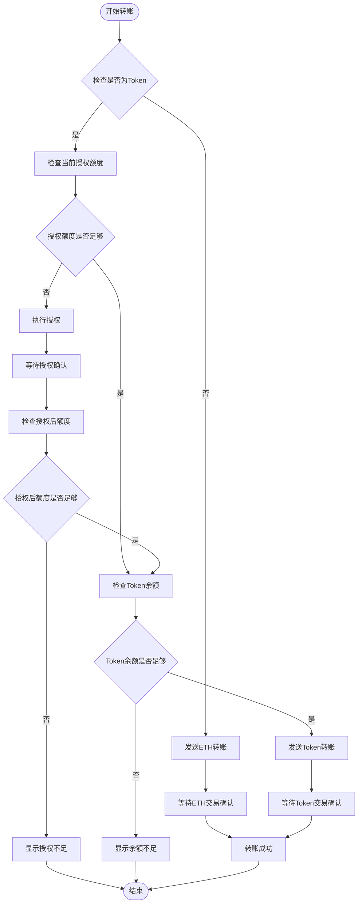

**图表来源**
- [TransferCard.tsx:153-183](file://apps/web/components/cards/TransferCard.tsx#L153-L183)
- [TransferCard.tsx:395-419](file://apps/web/components/cards/TransferCard.tsx#L395-L419)

### 关键状态管理修复

**更新** 组件经过关键bug修复，现在具备了更稳定的状态管理机制：

#### ID一致性保证机制

组件现在确保消息ID和转账卡片ID的完全一致性：

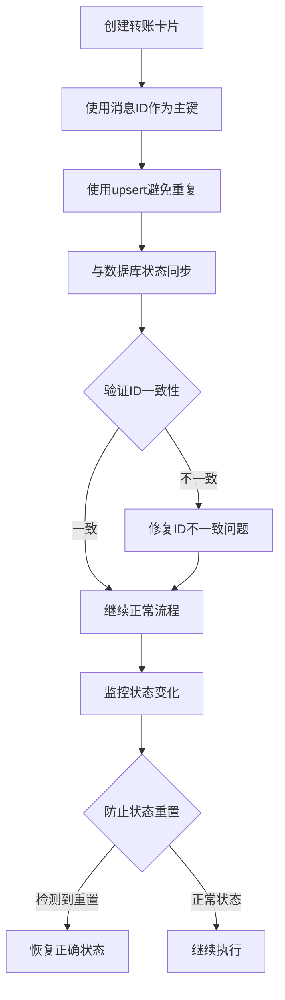

**图表来源**
- [transfers.ts:20-47](file://apps/web/lib/supabase/transfers.ts#L20-L47)
- [TransferCard.tsx:255-267](file://apps/web/components/cards/TransferCard.tsx#L255-L267)

#### 增强的授权状态检查

组件现在具备了更精确的授权状态检查机制：

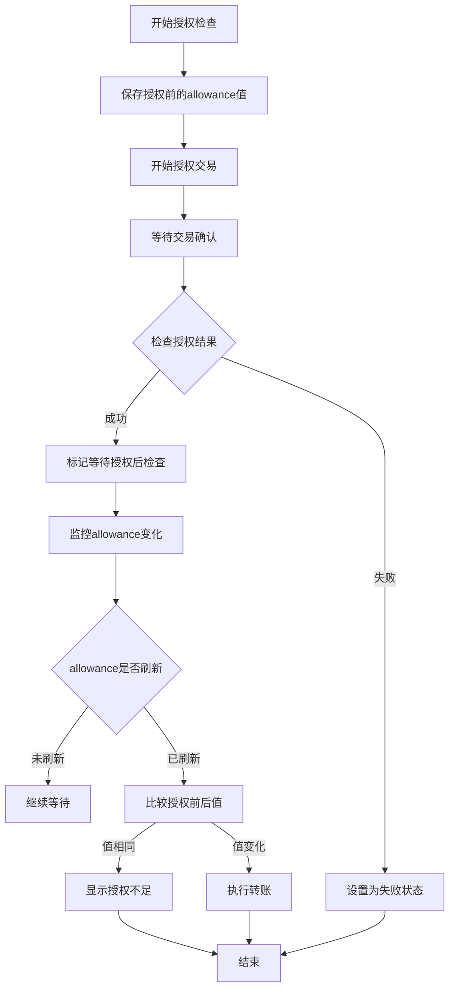

**图表来源**
- [TransferCard.tsx:153-183](file://apps/web/components/cards/TransferCard.tsx#L153-L183)
- [TransferCard.tsx:186-199](file://apps/web/components/cards/TransferCard.tsx#L186-L199)

**章节来源**
- [TransferCard.tsx:153-183](file://apps/web/components/cards/TransferCard.tsx#L153-L183)
- [TransferCard.tsx:395-419](file://apps/web/components/cards/TransferCard.tsx#L395-L419)

## Quantum Nexus主题系统

### 主题设计特色

**更新** TransferCard组件现已完全集成Quantum Nexus主题设计系统，采用以下设计特色：

#### 青色+紫色霓虹主题
- **主色调**: 青色(#06B6D4)和紫色(#8B5CF6)的霓虹渐变
- **深邃背景**: 深蓝色(#0A0A1F)和深紫色(#12122E)的夜空背景
- **透明度**: 70%的透明度营造朦胧美感
- **模糊效果**: 24px的backdrop-filter模糊

#### 玻璃拟态效果
- **glass-panel**: 高级玻璃面板效果
- **glass-subtle**: 轻量级玻璃效果
- **渐变边框**: 动态流动的渐变边框动画
- **阴影层次**: 内外阴影营造立体感

#### CSS变量系统
- **统一变量**: `--accent-cyan`、`--accent-violet`等主题变量
- **响应式**: 支持深色和浅色两种主题模式
- **平滑过渡**: 0.4秒的CSS过渡动画

### 主题配置实现

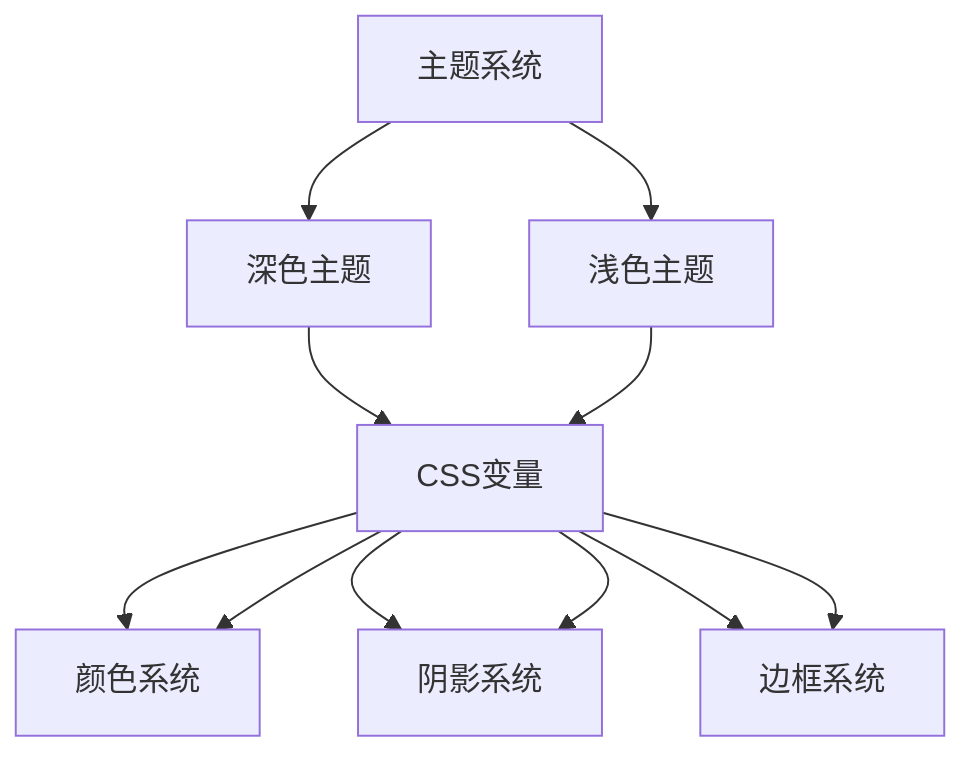

**图表来源**
- [globals.css:11-106](file://apps/web/app/globals.css#L11-L106)
- [tailwind.config.ts:12-92](file://apps/web/tailwind.config.ts#L12-L92)

### 状态主题映射

**更新** 组件实现了与Quantum Nexus主题系统完全对齐的状态主题映射：

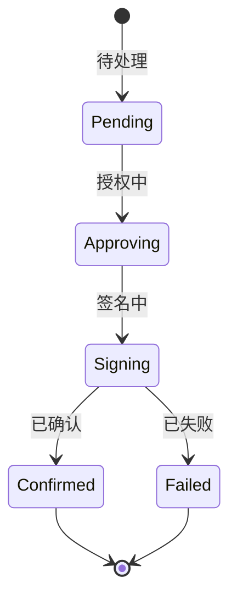

每个状态都对应特定的主题色彩：
- **PENDING**: 青色霓虹(#FBBF24)脉冲效果
- **APPROVING**: 青色(#06B6D4)渐变边框
- **SIGNING**: 青色(#06B6D4)发光效果
- **CONFIRMED**: 绿色(#34D399)确认状态
- **FAILED**: 红色(#F87171)错误状态

**章节来源**
- [TransferCard.tsx:89-96](file://apps/web/components/cards/TransferCard.tsx#L89-L96)
- [globals.css:11-106](file://apps/web/app/globals.css#L11-L106)

## 动画与交互体验

### 动画系统集成

**更新** TransferCard组件集成了完整的Quantum Nexus动画系统，提供了丰富的交互体验：

#### 核心动画效果
- **缩放动画**: `animate-scale-in` - 0.25秒的缩放进入效果
- **滑入动画**: `animate-slide-up` - 0.35秒的滑入动画
- **脉冲动画**: `animate-pulse-glow` - 霓虹灯般的脉冲效果
- **浮动动画**: `animate-float` - 轻柔的浮动效果

#### 交互反馈动画

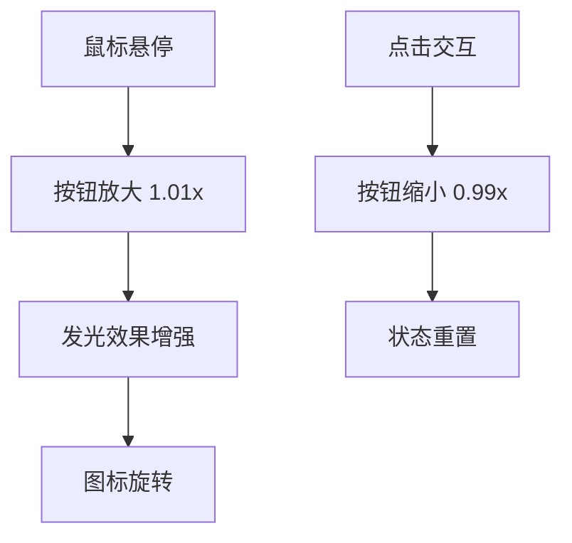

#### 状态动画实现

**更新** 组件实现了与状态对应的动画效果：

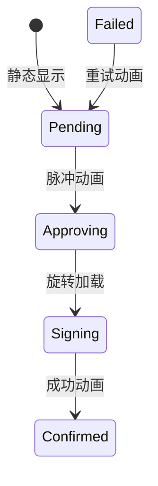

### 动画实现细节

#### 玻璃面板动画
- **初始状态**: 透明度0，缩放0.92
- **进入动画**: 0.25秒scale-in动画
- **悬停效果**: 边框颜色从rgba(255,255,255,0.08)变为rgba(6,182,212,0.35)
- **阴影效果**: 青色发光阴影增强

#### 状态指示动画
- **脉冲效果**: `animate-ping` - 0.6秒透明度脉冲
- **旋转加载**: `animate-spin` - 8秒无限旋转
- **渐变流动**: `gradient-flow` - 6秒渐变色流动

#### 错误提示动画
- **滑入效果**: `animate-slide-up` - 从下方滑入
- **透明度变化**: 从0到1的平滑过渡
- **边框动画**: 红色霓虹边框脉冲

**章节来源**
- [TransferCard.tsx:465-656](file://apps/web/components/cards/TransferCard.tsx#L465-L656)
- [globals.css:339-441](file://apps/web/app/globals.css#L339-L441)

## 依赖关系分析

### 外部依赖

TransferCard组件依赖多个关键外部库：

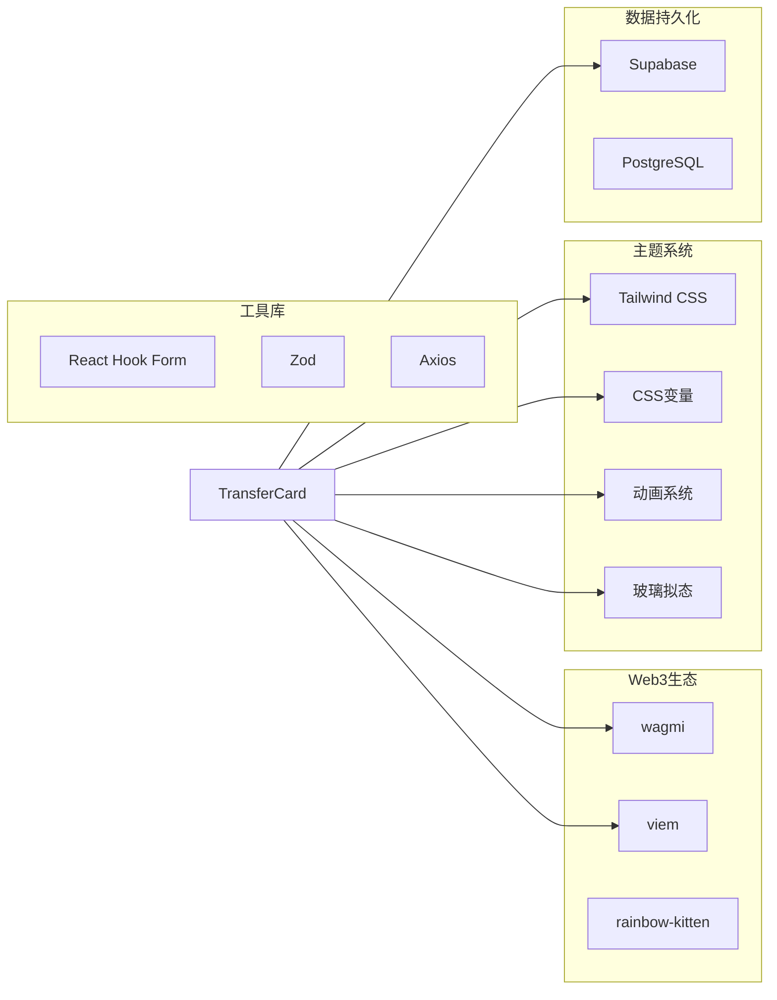

**图表来源**
- [TransferCard.tsx:3-8](file://apps/web/components/cards/TransferCard.tsx#L3-L8)

### 内部依赖关系

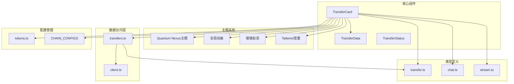

**图表来源**
- [TransferCard.tsx:6-8](file://apps/web/components/cards/TransferCard.tsx#L6-L8)
- [transfers.ts:3-4](file://apps/web/lib/supabase/transfers.ts#L3-L4)
- [globals.css:11-106](file://apps/web/app/globals.css#L11-L106)

**章节来源**
- [TransferCard.tsx:1-658](file://apps/web/components/cards/TransferCard.tsx#L1-L658)
- [transfers.ts:1-142](file://apps/web/lib/supabase/transfers.ts#L1-L142)

## 性能考虑

### 优化策略

TransferCard组件采用了多项性能优化策略：

#### 1. 状态最小化
- 使用useState钩子管理必要状态
- 避免不必要的重渲染
- 合理的状态合并

#### 2. 计算优化
- 使用useMemo缓存计算结果
- 避免在渲染过程中进行昂贵计算
- 合理的依赖数组设置

#### 3. 网络请求优化
- 条件化API调用
- 防抖和节流机制
- 请求去重

#### 4. 内存管理
- 及时清理事件监听器
- 合理的定时器管理
- 避免内存泄漏

### 性能监控

组件实现了基本的性能监控机制：

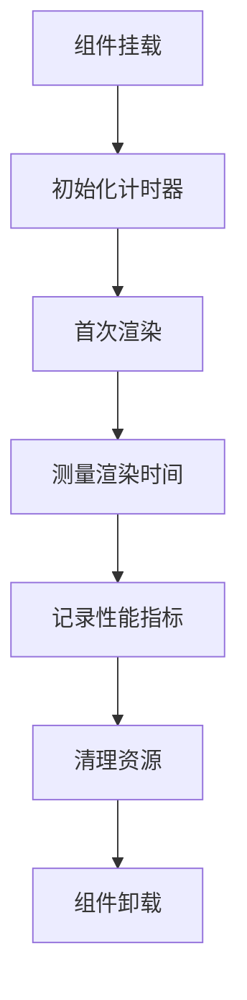

**图表来源**
- [TransferCard.tsx:248-268](file://apps/web/components/cards/TransferCard.tsx#L248-L268)

## 故障排除指南

### 常见问题及解决方案

#### 1. 钱包连接问题
- **症状**: "请先连接钱包"
- **原因**: 用户未连接钱包
- **解决**: 引导用户连接钱包，检查钱包扩展安装

#### 2. 地址格式错误
- **症状**: "接收地址格式错误"
- **原因**: 地址不符合EVM地址格式
- **解决**: 验证地址格式，使用isAddress函数

#### 3. 余额不足
- **症状**: "余额不足"或"GAS费用不足"
- **原因**: 账户余额不足以支付转账或Gas费用
- **解决**: 提示用户充值，检查账户余额

#### 4. 链不匹配
- **症状**: "请切换到 [链名称] 网络"
- **原因**: 用户连接的钱包网络与目标链不匹配
- **解决**: 引导用户切换到正确的网络

#### 5. 交易失败
- **症状**: "交易执行失败"
- **原因**: 签名被拒绝或网络错误
- **解决**: 检查错误详情，提供重试选项

#### 6. 授权失败
- **症状**: "Token 授权失败"
- **原因**: 授权交易执行失败
- **解决**: 检查钱包签名，确认Gas费用充足

#### 7. 授权额度不足
- **症状**: "授权额度不足，当前剩余额度: X.XXXXXX USDT"
- **原因**: 授权额度小于转账金额
- **解决**: 先执行授权，再进行转账

#### 8. 状态重置问题
- **症状**: 转账状态意外重置
- **原因**: ID不一致导致的状态同步问题
- **解决**: 确保消息ID和卡片ID保持一致，检查授权状态检查机制

#### 9. 主题显示异常
- **症状**: 界面颜色不正确或动画失效
- **原因**: CSS变量未正确加载或主题系统配置错误
- **解决**: 检查globals.css中的主题变量，确认Quantum Nexus主题已正确集成

#### 10. 动画性能问题
- **症状**: 动画卡顿或延迟
- **原因**: 过多的DOM操作或CSS动画复杂度过高
- **解决**: 检查动画数量，优化CSS选择器，使用will-change属性

### 调试技巧

#### 1. 开发者工具
- 使用浏览器开发者工具检查网络请求
- 查看控制台错误信息
- 监控钱包扩展日志

#### 2. 日志记录
- 在关键步骤添加日志
- 记录状态变化
- 跟踪异步操作

#### 3. 错误边界
- 实现错误边界组件
- 提供友好的错误提示
- 支持错误报告

**章节来源**
- [TransferCard.tsx:395-419](file://apps/web/components/cards/TransferCard.tsx#L395-L419)

## 结论

TransferCard转账卡片组件是一个功能完整、架构清晰的Web3应用组件。它成功地将复杂的区块链转账流程简化为用户友好的界面，同时保持了高度的安全性和可靠性。

**更新** 该组件现已完整集成了Quantum Nexus主题设计系统，实现了青色+紫色霓虹主题风格，提供了现代化的玻璃拟态效果和丰富的动画体验。组件优化了状态显示和交互反馈，增强了视觉层次感和沉浸感，为用户提供了更加优质的Web3转账体验。

### 主要成就

1. **Quantum Nexus主题集成**: 完全实现了深邃夜空主题风格，采用青色+紫色霓虹配色方案
2. **玻璃拟态效果**: 实现了高级的玻璃面板效果，营造透明朦胧的视觉体验
3. **动画系统优化**: 集成了完整的动画系统，包括缩放、滑入、脉冲等丰富效果
4. **用户体验提升**: 通过直观的界面设计和流畅的交互流程，大大降低了Web3转账的使用门槛
5. **技术架构先进**: 采用现代化的React Hooks模式和最佳实践，确保了代码的可维护性和可扩展性
6. **安全性保障**: 实现了多层次的安全检查和错误处理机制，有效保护了用户的资产安全
7. **性能优化**: 通过合理的状态管理和网络请求优化，提供了流畅的用户体验
8. **完整的ERC20支持**: 现已实现完整的授权工作流程，支持所有ERC20代币的转账操作
9. **稳定的ID一致性**: 经过关键bug修复，确保消息ID和转账卡片ID保持完全一致，避免状态重置问题

### 技术亮点

- **完整的状态管理**: 支持从pending到confirmed的完整生命周期
- **智能的余额检查**: 自动检测余额和Gas费用，提供实时反馈
- **灵活的错误处理**: 针对不同类型的错误提供相应的处理策略
- **数据持久化**: 通过Supabase实现状态的持久化存储
- **完整的授权流程**: 支持ERC20代币的授权和转账操作
- **ID一致性保证**: 确保消息ID和卡片ID的完全同步
- **增强的状态检查**: 防止状态被意外重置
- **Quantum Nexus主题系统**: 实现了完整的主题设计和动画体验
- **玻璃拟态效果**: 提供现代化的视觉层次和沉浸感

### 未来发展

该组件为未来的功能扩展奠定了良好的基础，可以进一步增强的功能包括：

- **批量转账支持**: 支持一次性转账多个地址
- **交易历史记录**: 提供完整的转账历史查询
- **高级安全功能**: 实现多重签名和授权机制
- **跨链转账**: 支持不同区块链之间的资产转移
- **Gas费用优化**: 实现动态Gas费用估算和优化
- **状态恢复增强**: 进一步完善从数据库恢复状态的机制
- **主题定制**: 支持更多主题色彩和动画效果
- **无障碍访问**: 增强屏幕阅读器和键盘导航支持

TransferCard组件代表了Web3应用开发的最佳实践，为构建更加用户友好的去中心化应用提供了宝贵的参考。通过集成Quantum Nexus主题系统和动画体验，组件展现了现代Web3应用的设计趋势和技术水平。