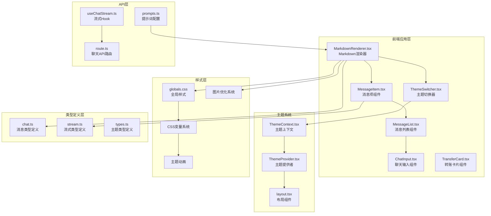
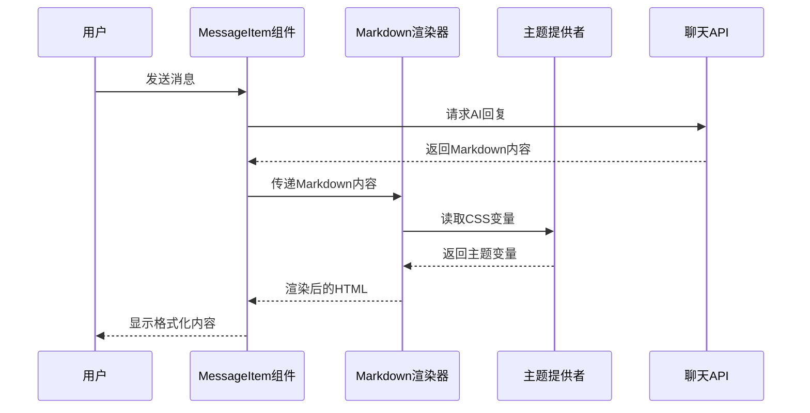
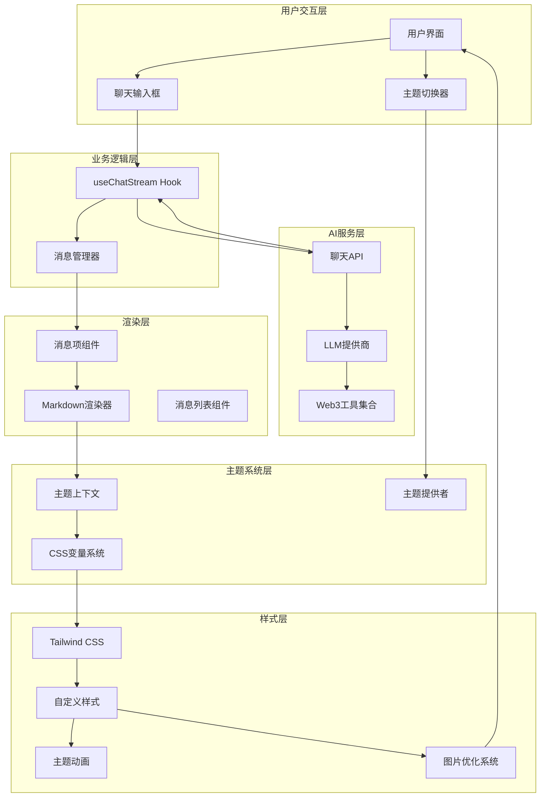
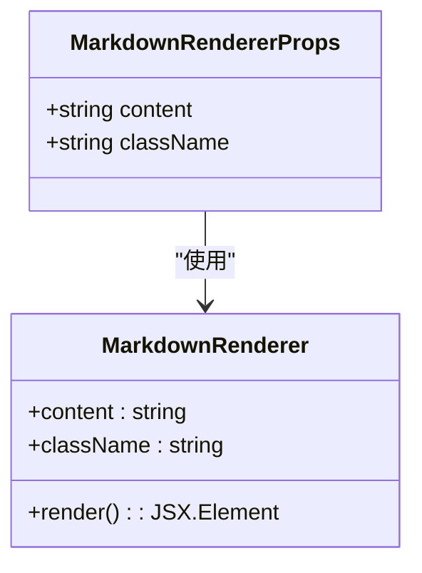
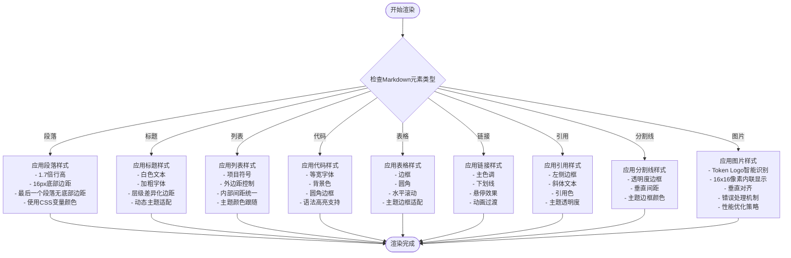
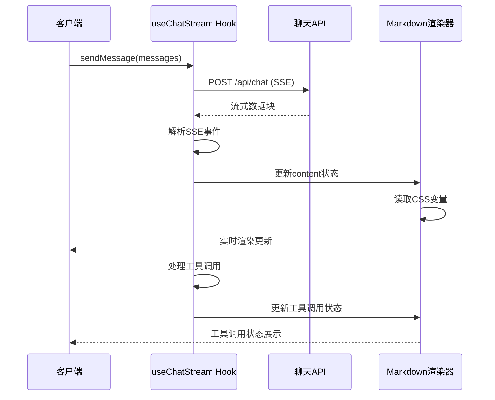
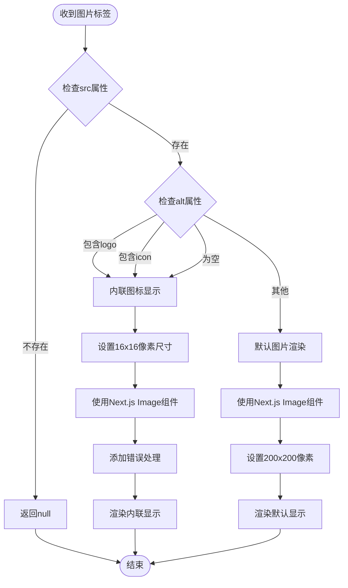
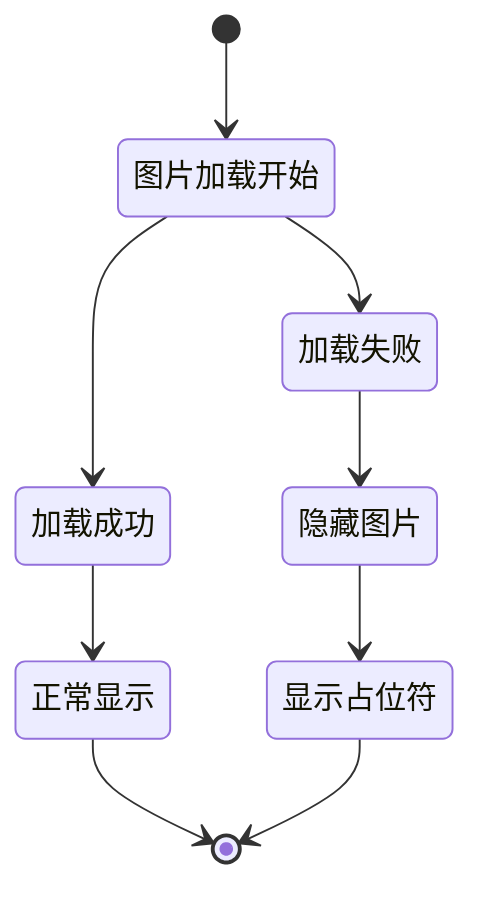
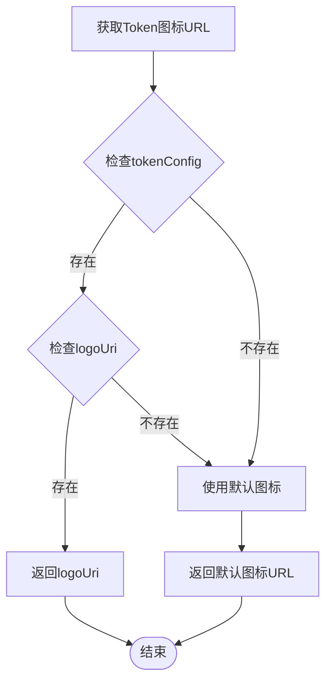
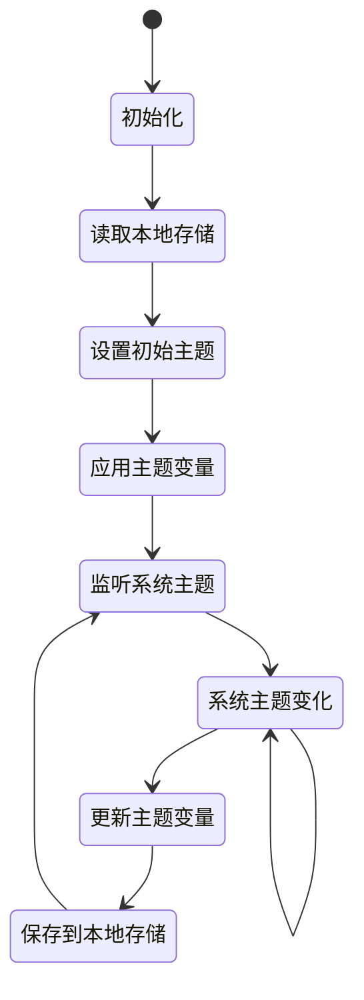

# Markdown渲染功能

<cite>
**本文档引用的文件**
- [MarkdownRenderer.tsx](file://apps/web/components/MarkdownRenderer.tsx)
- [MessageItem.tsx](file://apps/web/components/MessageItem.tsx)
- [TransferCard.tsx](file://apps/web/components/cards/TransferCard.tsx)
- [MarkdownRenderer.test.tsx](file://apps/web/components/MarkdownRenderer.test.tsx)
- [prompts.ts](file://apps/web/config/prompts.ts)
- [page.tsx](file://apps/web/app/page.tsx)
- [useChatStream.ts](file://apps/web/hooks/useChatStream.ts)
- [route.ts](file://apps/web/app/api/chat/route.ts)
- [chat.ts](file://apps/web/types/chat.ts)
- [stream.ts](file://apps/web/types/stream.ts)
- [globals.css](file://apps/web/app/globals.css)
- [package.json](file://apps/web/package.json)
- [ThemeSwitcher.tsx](file://apps/web/components/ThemeSwitcher.tsx)
- [layout.tsx](file://apps/web/app/layout.tsx)
- [ThemeContext.tsx](file://apps/web/lib/theme/ThemeContext.tsx)
- [ThemeProvider.tsx](file://apps/web/lib/theme/ThemeProvider.tsx)
- [test-setup.tsx](file://apps/web/test-setup.tsx)
</cite>

## 更新摘要
**变更内容**
- 新增Token Logo智能显示功能，支持16x16像素内联图标垂直对齐
- 增强图片组件实现，改进错误处理机制和性能优化
- 实施严格的Markdown格式化规则，确保Token图标正确显示
- 优化图片加载性能，采用unoptimized策略支持外部CDN资源

## 目录
1. [简介](#简介)
2. [项目结构](#项目结构)
3. [核心组件](#核心组件)
4. [架构概览](#架构概览)
5. [详细组件分析](#详细组件分析)
6. [Token Logo智能显示](#token-logo智能显示)
7. [严格的格式化规则](#严格的格式化规则)
8. [CSS变量系统](#css变量系统)
9. [主题现代化](#主题现代化)
10. [依赖关系分析](#依赖关系分析)
11. [性能考虑](#性能考虑)
12. [故障排除指南](#故障排除指南)
13. [结论](#结论)

## 简介

Web3 AI Agent项目中的Markdown渲染功能是一个关键的前端组件，负责将AI助手生成的Markdown格式文本转换为美观、可读的HTML内容。该功能不仅支持标准的Markdown语法，还通过GitHub Flavored Markdown (GFM) 扩展提供了表格、任务列表等高级特性，为用户提供专业的信息展示体验。

**更新** 该渲染系统现已进行全面样式现代化，采用全新的CSS变量系统实现主题一致性和更好的视觉效果。系统支持暗色/亮色双主题模式，通过[data-theme]属性实现动态主题切换，并集成了现代化的动画效果和响应式设计。更重要的是，新增了智能的Token Logo显示功能，能够自动识别并优化显示Token图标等小尺寸图像，通过严格的Markdown格式化规则确保图标正确垂直对齐。

## 项目结构

Markdown渲染功能在整个项目架构中位于前端应用层的核心位置，主要涉及以下文件和模块：



**图表来源**
- [MarkdownRenderer.tsx:1-160](file://apps/web/components/MarkdownRenderer.tsx#L1-L160)
- [ThemeSwitcher.tsx:1-42](file://apps/web/components/ThemeSwitcher.tsx#L1-L42)
- [ThemeProvider.tsx:1-83](file://apps/web/lib/theme/ThemeProvider.tsx#L1-L83)
- [TransferCard.tsx:450-601](file://apps/web/components/cards/TransferCard.tsx#L450-L601)

**章节来源**
- [MarkdownRenderer.tsx:1-160](file://apps/web/components/MarkdownRenderer.tsx#L1-L160)
- [ThemeSwitcher.tsx:1-42](file://apps/web/components/ThemeSwitcher.tsx#L1-L42)
- [layout.tsx:1-38](file://apps/web/app/layout.tsx#L1-L38)

## 核心组件

### MarkdownRenderer 组件

MarkdownRenderer是整个渲染系统的核心组件，负责将原始Markdown文本转换为结构化的HTML元素。该组件采用了高度定制化的渲染策略，针对不同Markdown元素提供了专门的样式处理。

**更新** 组件现已完全集成CSS变量系统，所有颜色和样式都通过CSS变量动态调整，实现真正的主题一致性。同时新增了智能的Token Logo显示功能，能够自动识别并优化显示Token图标等小尺寸图像。

#### 主要特性

1. **GFM扩展支持**: 通过remark-gfm插件启用GitHub Flavored Markdown的所有特性
2. **CSS变量集成**: 使用`rgb(var(--variable-name))`格式实现动态主题适配
3. **现代化样式**: 支持暗色/亮色主题的完整样式覆盖
4. **响应式表格**: 支持水平滚动的表格展示
5. **增强的代码块**: 支持语法高亮和主题适配的代码块样式
6. **智能图片处理**: 自动识别Token Logo并进行16x16像素内联显示
7. **严格格式化规则**: 确保Markdown图片语法符合Token图标显示要求
8. **错误处理机制**: 完善的图片加载失败处理和降级策略

#### 关键实现细节

组件的核心渲染逻辑基于ReactMarkdown库，通过components属性定义了每个Markdown元素的自定义渲染函数。所有样式类名都使用CSS变量，如`text-[rgb(var(--text-primary))]`和`bg-[rgb(var(--bg-tertiary))]`，确保在不同主题下自动调整颜色。

**章节来源**
- [MarkdownRenderer.tsx:11-160](file://apps/web/components/MarkdownRenderer.tsx#L11-L160)

### MessageItem 组件

MessageItem组件负责渲染单个消息项，包括用户消息和AI助手消息。该组件集成了Markdown渲染功能，并提供了工具调用状态的可视化展示。

#### 渲染流程



**图表来源**
- [MessageItem.tsx:77-81](file://apps/web/components/MessageItem.tsx#L77-L81)
- [useChatStream.ts:167-252](file://apps/web/hooks/useChatStream.ts#L167-L252)

**章节来源**
- [MessageItem.tsx:13-189](file://apps/web/components/MessageItem.tsx#L13-L189)

## 架构概览

Markdown渲染功能在整个系统架构中扮演着重要的桥梁角色，连接着AI服务、流式传输、主题系统和用户界面四个关键层面。



**图表来源**
- [useChatStream.ts:27-294](file://apps/web/hooks/useChatStream.ts#L27-L294)
- [route.ts:135-405](file://apps/web/app/api/chat/route.ts#L135-L405)
- [MarkdownRenderer.tsx:11-160](file://apps/web/components/MarkdownRenderer.tsx#L11-L160)
- [ThemeProvider.tsx:13-82](file://apps/web/lib/theme/ThemeProvider.tsx#L13-L82)

## 详细组件分析

### MarkdownRenderer 组件深度分析

#### 类型定义和接口

组件采用TypeScript接口定义，确保类型安全性和开发体验：



**图表来源**
- [MarkdownRenderer.tsx:6-10](file://apps/web/components/MarkdownRenderer.tsx#L6-L10)

#### 渲染策略分析

组件实现了针对不同Markdown元素的专门渲染策略，全部采用CSS变量系统：

| Markdown元素 | 渲染组件 | 样式特点 | CSS变量使用 | 特殊处理 |
|-------------|----------|----------|-------------|----------|
| 段落(p) | HTML段落标签 | 1.7倍行高，底部边距 | `mb-2 last:mb-0` | 最后一个段落移除底部边距 |
| 标题(h1-h3) | HTML标题标签 | 白色文本，加粗字体 | `text-[rgb(var(--text-primary))]` | 不同层级有不同的上下边距 |
| 列表(ul, ol) | HTML列表标签 | 项目符号，外边距控制 | `list-disc list-outside` | 内部间距统一 |
| 代码(code) | HTML代码标签 | 等宽字体，背景色 | `bg-[rgb(var(--bg-tertiary))]` | 区分内联和块级代码 |
| 表格(table) | HTML表格标签 | 边框，圆角，滚动支持 | `border-[rgb(var(--border-color))]` | 响应式设计 |
| 引用(blockquote) | HTML引用标签 | 左侧边框，斜体文本 | `text-[rgb(var(--text-secondary))]` | 引用色 |
| 分割线(hr) | HTML分割线 | 透明度边框，垂直间距 | `border-[rgb(var(--border-color))]` | 主题边框颜色 |
| 图片(img) | Next.js Image组件 | 智能处理Token Logo | `object-contain` | 16x16像素内联显示 |

#### 样式系统集成

Markdown渲染器与CSS变量系统深度集成，通过CSS类名实现主题一致性：



**图表来源**
- [MarkdownRenderer.tsx:17-152](file://apps/web/components/MarkdownRenderer.tsx#L17-L152)

**章节来源**
- [MarkdownRenderer.tsx:11-160](file://apps/web/components/MarkdownRenderer.tsx#L11-L160)

### MessageItem 组件与Markdown集成

MessageItem组件展示了Markdown渲染功能在实际应用场景中的集成方式：

#### 渲染条件判断

组件根据消息角色决定渲染方式：
- 用户消息：直接显示原始文本（无需Markdown解析）
- AI助手消息：通过MarkdownRenderer进行格式化渲染

#### 工具调用状态展示

除了Markdown内容渲染外，MessageItem还集成了工具调用状态的可视化展示，为用户提供完整的交互反馈。

**章节来源**
- [MessageItem.tsx:77-81](file://apps/web/components/MessageItem.tsx#L77-L81)

### 流式渲染集成

Markdown渲染功能与流式API完美集成，支持实时内容更新：



**图表来源**
- [useChatStream.ts:77-117](file://apps/web/hooks/useChatStream.ts#L77-L117)
- [route.ts:260-297](file://apps/web/app/api/chat/route.ts#L260-L297)

**章节来源**
- [useChatStream.ts:120-164](file://apps/web/hooks/useChatStream.ts#L120-L164)

## Token Logo智能显示

### 智能识别机制

Markdown渲染器新增了智能的Token Logo识别功能，能够自动区分不同类型的图片并进行相应的优化处理：



**图表来源**
- [MarkdownRenderer.tsx:114-152](file://apps/web/components/MarkdownRenderer.tsx#L114-L152)

### 16x16像素内联显示

对于识别为Token Logo的图片，系统采用专门的内联显示策略：

#### 尺寸规格
- **宽度**: 16像素 (`w-4`)
- **高度**: 16像素 (`h-4`)
- **容器**: 相对定位的内联块元素
- **对齐**: 与文本基线对齐

#### 样式特点
- **内联Flex布局**: `inline-flex items-center gap-1`
- **垂直对齐**: `vertical-align: middle`
- **对象填充**: `object-contain`确保完整显示
- **容器约束**: `relative inline-block`限制显示范围

#### 错误处理机制

系统实现了完善的错误处理策略，确保图片加载失败时的优雅降级：



**图表来源**
- [MarkdownRenderer.tsx:129-133](file://apps/web/components/MarkdownRenderer.tsx#L129-L133)

### 默认图片渲染策略

对于非Token Logo的普通图片，系统采用标准的图片渲染策略：

#### 尺寸规格
- **宽度**: 200像素 (`w-50`)
- **高度**: 200像素 (`h-50`)
- **容器**: 内联块元素
- **样式**: 圆角边框，最大宽度100%

#### 性能优化
- **Next.js Image优化**: 使用`unoptimized`绕过Next.js的图片优化管道
- **CDN兼容**: 支持外部CDN资源，如CoinGecko等
- **错误降级**: 加载失败时自动隐藏，不影响整体渲染

**章节来源**
- [MarkdownRenderer.tsx:114-152](file://apps/web/components/MarkdownRenderer.tsx#L114-L152)

## 严格的格式化规则

### Token图标展示规范

为了确保AI助手正确生成Token Logo展示，系统制定了严格的Markdown格式化规则：

#### 格式要求
- **推荐格式**: 使用``语法（留空alt文本）
- **示例**: ``
- **禁止格式**: ``带alt文本的格式
- **空值处理**: 如果logoUri为空，可以不展示Logo

#### 识别规则
系统通过以下规则自动识别Token Logo：
- alt属性包含'logo'关键词
- alt属性包含'icon'关键词  
- alt属性为空值
- src属性存在且有效

#### 垂直对齐保证

为了确保Token图标与文本的垂直对齐，系统采用了多重CSS属性：

```css
.inline-flex.items-center.gap-1.align-middle {
  vertical-align: middle;
}

.relative.inline-block.w-4.h-4.align-middle {
  display: inline-block;
  vertical-align: middle;
}

.object-contain {
  vertical-align: middle;
}
```

**章节来源**
- [TransferCard.tsx:453-455](file://apps/web/components/cards/TransferCard.tsx#L453-L455)
- [prompts.ts:221-225](file://apps/web/config/prompts.ts#L221-L225)

### Token图标展示集成

Markdown渲染器的Token Logo智能显示功能与TransferCard组件形成了完整的Token图标展示体系：

#### 配置驱动的图标获取

TransferCard组件提供了Token图标获取的配置驱动方法：



**图表来源**
- [TransferCard.tsx:453-455](file://apps/web/components/cards/TransferCard.tsx#L453-L455)

**章节来源**
- [TransferCard.tsx:453-455](file://apps/web/components/cards/TransferCard.tsx#L453-L455)

## CSS变量系统

### CSS变量定义

系统采用CSS自定义属性实现主题一致性，所有颜色和样式都通过变量定义：

```mermaid
graph LR
subgraph "深色主题变量"
A[:root<br/>[data-theme='dark']]
B[--text-primary: 255, 255, 255]
C[--bg-secondary: 17, 24, 39]
D[--border-color: 255, 255, 255, 0.06]
E[--accent-color: 124, 58, 237]
end
subgraph "浅色主题变量"
F:[data-theme='light']
G[--text-primary: 17, 24, 39]
H[--bg-secondary: 249, 250, 251]
I[--border-color: 229, 231, 235]
J[--accent-color: 124, 58, 237]
end
A --> B
A --> C
A --> D
A --> E
F --> G
F --> H
F --> I
F --> J
```

**图表来源**
- [globals.css:5-48](file://apps/web/app/globals.css#L5-L48)

### CSS变量使用模式

所有组件都采用`rgb(var(--variable-name))`格式使用变量：

- 文本颜色：`text-[rgb(var(--text-primary))]`
- 背景颜色：`bg-[rgb(var(--bg-secondary))]`
- 边框颜色：`border-[rgb(var(--border-color))]`
- 主题强调色：`text-primary-600`

这种模式确保了在不同主题下颜色的自动适配和一致性。

**章节来源**
- [globals.css:5-48](file://apps/web/app/globals.css#L5-L48)
- [MarkdownRenderer.tsx:23-152](file://apps/web/components/MarkdownRenderer.tsx#L23-L152)

## 主题现代化

### 主题切换机制

系统实现了完整的主题切换机制，支持三种模式：



**图表来源**
- [ThemeProvider.tsx:17-71](file://apps/web/lib/theme/ThemeProvider.tsx#L17-L71)

### 主题动画效果

系统集成了多种动画效果提升用户体验：

1. **流式输出光标动画**: 脉冲效果的光标动画
2. **微妙发光效果**: 持续的发光脉冲动画
3. **工具调用卡片动画**: 滑入动画效果
4. **滚动条动画**: 平滑的颜色过渡

**章节来源**
- [globals.css:126-189](file://apps/web/app/globals.css#L126-L189)
- [ThemeProvider.tsx:13-82](file://apps/web/lib/theme/ThemeProvider.tsx#L13-L82)

## 依赖关系分析

### 核心依赖库

Markdown渲染功能依赖于以下关键库：

```mermaid
graph LR
subgraph "渲染核心"
A[react-markdown@10.1.0]
B[remark-gfm@4.0.1]
C[next/image@13.4.19]
end
subgraph "样式系统"
D[Tailwind CSS]
E[CSS变量系统]
F[主题提供者]
end
subgraph "类型定义"
G[@types/react@18.3.28]
H[@types/mdast@4.0.4]
I[主题类型定义]
end
A --> B
A --> C
A --> D
A --> E
A --> F
A --> G
A --> H
A --> I
```

**图表来源**
- [package.json:27-28](file://apps/web/package.json#L27-L28)

### 依赖版本兼容性

系统确保了依赖库之间的版本兼容性，特别是react-markdown与其插件生态系统的协调工作。

**章节来源**
- [package.json:12-44](file://apps/web/package.json#L12-L44)

## 性能考虑

### 渲染优化策略

1. **按需渲染**: 只对AI助手的消息进行Markdown解析，避免对用户消息重复处理
2. **CSS变量缓存**: CSS变量在编译时解析，运行时只需读取，减少计算开销
3. **状态更新节流**: 使用节流机制控制频繁的状态更新，提升渲染性能
4. **内存管理**: 合理管理流式数据的缓冲区，避免内存泄漏
5. **图片懒加载**: 对非Token Logo图片采用标准的懒加载策略
6. **Token Logo内联优化**: Token Logo图片直接内联显示，减少额外的DOM节点

### 主题切换性能

主题切换通过CSS变量实现，具有以下性能优势：

- **即时切换**: 无需重新渲染DOM元素
- **硬件加速**: CSS变量动画由GPU加速
- **低内存占用**: 变量存储在CSS层，不增加JavaScript内存负担

### 流式渲染性能

流式渲染通过SSE技术实现实时内容更新，采用了以下性能优化措施：

- **增量更新**: 只更新变化的部分内容，而非重新渲染整个消息列表
- **缓冲区管理**: 合理管理SSE事件的缓冲区，确保数据完整性
- **错误恢复**: 实现自动重试机制，提高流式连接的稳定性

### 图片加载性能

新增的Token Logo智能显示功能在性能方面进行了多项优化：

1. **CDN兼容**: 通过`unoptimized`属性绕过Next.js的图片优化管道，直接加载外部CDN资源
2. **错误快速降级**: 图片加载失败时立即隐藏，避免阻塞渲染流程
3. **内联显示优化**: Token Logo图片采用内联显示，减少额外的DOM层级
4. **尺寸精确控制**: 16x16像素的精确尺寸控制，避免不必要的重排
5. **垂直对齐优化**: 通过多重CSS属性确保图标与文本的完美对齐

**章节来源**
- [MarkdownRenderer.tsx:114-152](file://apps/web/components/MarkdownRenderer.tsx#L114-L152)

## 故障排除指南

### 常见问题及解决方案

#### Markdown渲染异常

**问题**: Markdown内容无法正确渲染
**可能原因**:
- 缺少remark-gfm插件依赖
- CSS变量未正确加载
- 样式类名冲突
- 内容格式不符合规范

**解决方案**:
1. 检查依赖安装状态
2. 验证CSS变量的正确性
3. 确认样式类名的正确性
4. 确认Markdown内容格式

#### Token Logo显示问题

**问题**: Token Logo无法正确显示
**可能原因**:
- Markdown格式不正确（alt文本不符合规范）
- 图片URL无效或不可访问
- CDN连接超时
- Next.js图片优化配置问题
- 垂直对齐属性缺失

**解决方案**:
1. 检查Markdown格式是否为``且alt为空
2. 验证图片URL的有效性和可访问性
3. 确认CDN服务的可用性
4. 检查Next.js配置中的remotePatterns设置
5. 确认CSS垂直对齐属性的正确应用

#### 主题切换失效

**问题**: 主题切换后样式未更新
**可能原因**:
- CSS变量未正确应用
- 主题提供者未正确配置
- 本地存储数据损坏
- 浏览器缓存问题

**解决方案**:
1. 检查CSS变量是否正确加载
2. 验证主题提供者的配置
3. 清除本地存储数据
4. 刷新浏览器缓存

#### 流式渲染延迟

**问题**: 实时内容更新出现延迟
**可能原因**:
- 网络连接不稳定
- 服务器响应时间过长
- 客户端节流设置过于保守
- CSS变量解析性能问题

**解决方案**:
1. 检查网络连接质量
2. 优化服务器响应时间
3. 调整节流参数设置
4. 检查CSS变量解析性能

#### 图片加载失败

**问题**: 图片无法加载显示
**可能原因**:
- 网络连接问题
- 图片URL格式错误
- CDN服务不可用
- CORS跨域问题

**解决方案**:
1. 检查网络连接状态
2. 验证图片URL格式
3. 确认CDN服务可用性
4. 检查CORS配置

**章节来源**
- [useChatStream.ts:167-252](file://apps/web/hooks/useChatStream.ts#L167-L252)
- [ThemeProvider.tsx:54-71](file://apps/web/lib/theme/ThemeProvider.tsx#L54-L71)
- [MarkdownRenderer.tsx:129-133](file://apps/web/components/MarkdownRenderer.tsx#L129-L133)

## 结论

Web3 AI Agent项目的Markdown渲染功能展现了现代前端开发的最佳实践。通过精心设计的组件架构、完善的类型系统、高效的流式处理机制和全面的主题现代化，该功能为用户提供了专业、流畅且美观的信息展示体验。

**更新** 本次重大功能增强使系统具备了以下显著优势：

1. **技术先进性**: 采用最新的React和Next.js技术栈，配合CSS变量系统
2. **用户体验**: 提供实时、响应式、主题一致的交互体验
3. **可维护性**: 清晰的组件分离、类型定义和主题系统
4. **扩展性**: 易于添加新的Markdown元素支持和主题变体
5. **性能优化**: 通过CSS变量缓存、增量更新和硬件加速提升渲染效率
6. **视觉一致性**: 全面的主题系统确保所有组件的视觉统一性
7. **智能图片处理**: 新增的Token Logo智能识别功能，提升了Token信息展示的专业性
8. **严格的格式化规则**: 确保Markdown图片语法符合Token图标显示要求
9. **错误处理机制**: 完善的图片加载失败处理，确保系统的稳定性和可靠性
10. **垂直对齐保证**: 通过多重CSS属性确保图标与文本的完美垂直对齐

**新增功能亮点**:
- **智能Token Logo识别**: 自动识别包含'logo'或'icon'关键词的图片并进行优化显示
- **16x16像素内联显示**: 专为Token图标设计的精确尺寸控制
- **严格的Markdown格式化规则**: 确保Token图标正确显示和垂直对齐
- **错误处理机制**: 图片加载失败时的优雅降级和占位符显示
- **CDN兼容性**: 通过`unoptimized`属性支持外部CDN资源的直接访问
- **性能优化**: 针对不同图片类型的专门优化策略

未来可以考虑的功能增强方向包括：
- 更丰富的Markdown元素支持
- 自定义主题创建功能
- 更好的无障碍访问支持
- 性能监控和分析功能
- 主题预设和个性化选项
- 图片懒加载的进一步优化

该渲染系统代表了现代Web应用开发的标准实践，为后续的功能扩展奠定了坚实的技术基础。