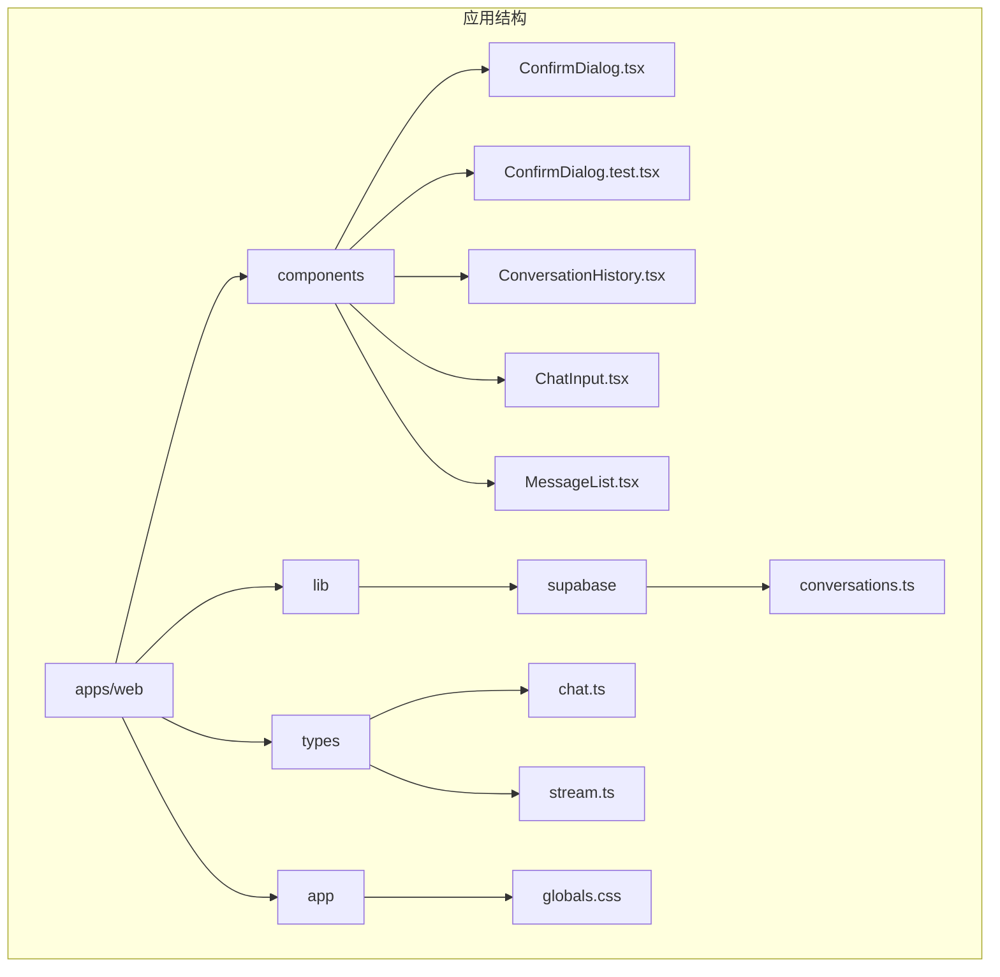
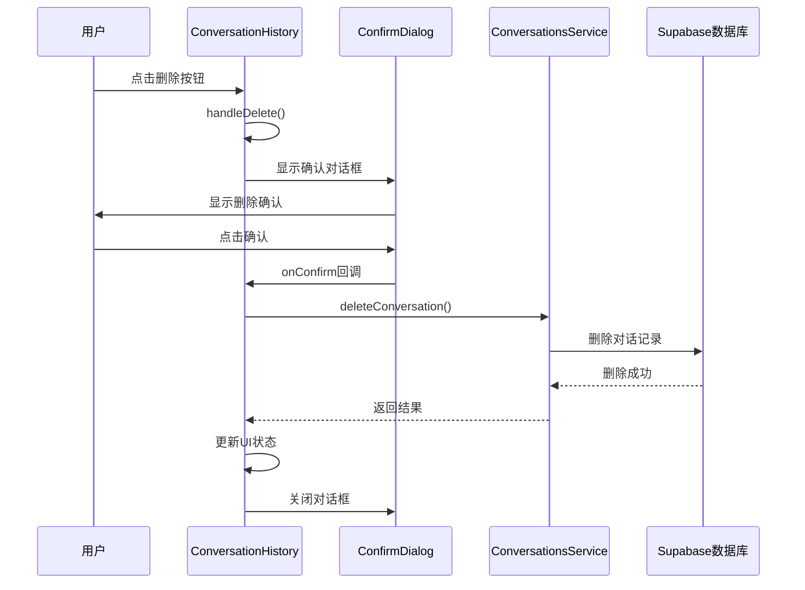
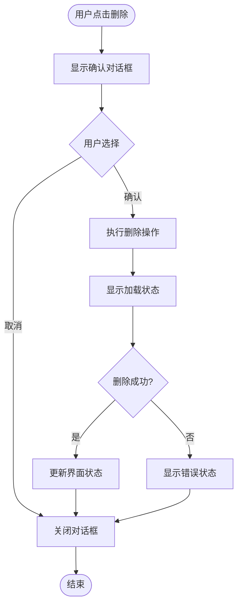
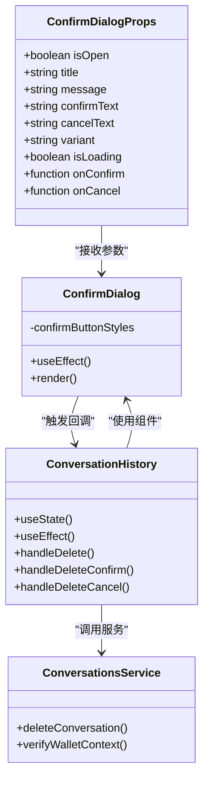
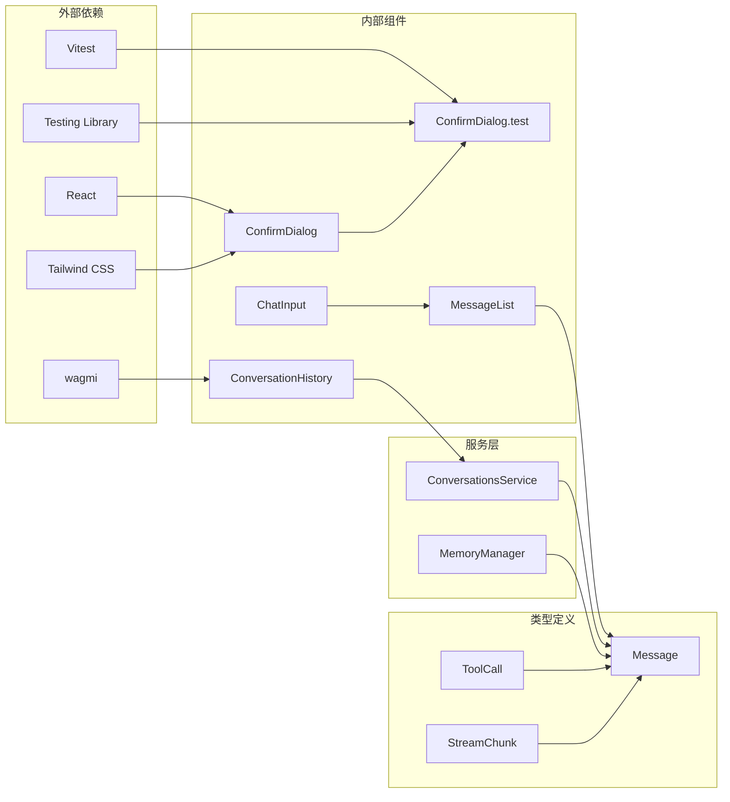

# 确认对话框组件

<cite>
**本文档引用的文件**
- [ConfirmDialog.tsx](file://apps/web/components/ConfirmDialog.tsx)
- [ConfirmDialog.test.tsx](file://apps/web/components/ConfirmDialog.test.tsx)
- [ConversationHistory.tsx](file://apps/web/components/ConversationHistory.tsx)
- [page.tsx](file://apps/web/app/page.tsx)
- [conversations.ts](file://apps/web/lib/supabase/conversations.ts)
- [chat.ts](file://apps/web/types/chat.ts)
- [stream.ts](file://apps/web/types/stream.ts)
- [globals.css](file://apps/web/app/globals.css)
</cite>

## 更新摘要
**变更内容**
- 新增紫色主题设计和圆角外观
- 添加毛玻璃背景效果（backdrop-blur-sm）
- 增强ESC键支持和键盘导航
- 新增Loading状态和旋转动画
- 扩展变体系统（danger/warning/info）
- 完善交互行为和状态管理
- **更新** 危险按钮样式验证从传统颜色类更新为现代渐变类验证（'from-red-500'和'to-rose-500'）

## 目录
1. [简介](#简介)
2. [项目结构](#项目结构)
3. [核心组件](#核心组件)
4. [架构概览](#架构概览)
5. [详细组件分析](#详细组件分析)
6. [依赖关系分析](#依赖关系分析)
7. [性能考虑](#性能考虑)
8. [故障排除指南](#故障排除指南)
9. [结论](#结论)

## 简介

确认对话框组件是一个可复用的React组件，用于在Web3 AI Agent应用中显示模态确认对话框。该组件提供了统一的用户交互模式，用于处理需要用户明确确认的操作，如删除对话、危险操作等。组件支持多种视觉变体（危险、警告、信息），具有完整的键盘导航支持和无障碍访问功能。

**更新** 新版本引入了紫色主题设计、圆角外观、毛玻璃背景效果，以及增强的Loading状态管理，为用户提供更加现代化和流畅的交互体验。**危险按钮样式验证已更新为使用现代Tailwind CSS渐变类**，反映了最新的设计系统标准。

## 项目结构

确认对话框组件位于应用的组件目录中，采用模块化设计，与其他UI组件协同工作：

**图表来源**
- [ConfirmDialog.tsx:1-149](file://apps/web/components/ConfirmDialog.tsx#L1-L149)
- [ConfirmDialog.test.tsx:1-114](file://apps/web/components/ConfirmDialog.test.tsx#L1-L114)
- [ConversationHistory.tsx:1-257](file://apps/web/components/ConversationHistory.tsx#L1-L257)

**章节来源**
- [ConfirmDialog.tsx:1-149](file://apps/web/components/ConfirmDialog.tsx#L1-L149)
- [ConfirmDialog.test.tsx:1-114](file://apps/web/components/ConfirmDialog.test.tsx#L1-L114)
- [ConversationHistory.tsx:1-257](file://apps/web/components/ConversationHistory.tsx#L1-L257)

## 核心组件

确认对话框组件的核心特性包括：

### 组件接口定义
组件通过TypeScript接口定义了完整的属性规范：
- `isOpen`: 控制对话框显示状态的布尔值
- `title`: 对话框标题文本
- `message`: 提示消息内容
- `confirmText`: 确认按钮文本，默认为"确认"
- `cancelText`: 取消按钮文本，默认为"取消"
- `variant`: 视觉变体类型，支持'danger'、'warning'、'info'
- `isLoading`: 加载状态，禁用按钮交互
- `onConfirm`: 确认回调函数
- `onCancel`: 取消回调函数

### 设计特色
**更新** 组件采用了现代化的设计理念：
- **紫色主题设计**：info变体使用紫色系渐变，提供优雅的视觉体验
- **圆角外观**：使用`rounded-xl`实现现代化的圆角设计
- **毛玻璃背景**：遮罩层使用`backdrop-blur-sm`创造模糊背景效果
- **响应式设计**：采用Tailwind CSS类名实现响应式布局
- **现代渐变样式**：危险变体使用`from-red-500`到`to-rose-500`的渐变效果

### 无障碍访问
- 支持ESC键快速关闭
- 键盘导航支持
- 屏幕阅读器友好
- 焦点管理

**章节来源**
- [ConfirmDialog.tsx:5-27](file://apps/web/components/ConfirmDialog.tsx#L5-L27)
- [ConfirmDialog.tsx:44-49](file://apps/web/components/ConfirmDialog.tsx#L44-L49)

## 架构概览

确认对话框组件在整个应用架构中的位置和作用：

**图表来源**
- [ConversationHistory.tsx:90-119](file://apps/web/components/ConversationHistory.tsx#L90-L119)
- [conversations.ts:226-259](file://apps/web/lib/supabase/conversations.ts#L226-L259)

## 详细组件分析

### 组件实现细节

#### 状态管理和生命周期
组件使用React的useEffect Hook处理键盘事件监听，确保在对话框打开时自动绑定ESC键事件，在卸载时清理事件监听器。

#### 样式系统
**更新** 组件采用动态样式计算，根据变体类型动态设置确认按钮的颜色方案：
- 危险变体：红色系渐变（`bg-gradient-to-r from-red-500 to-rose-500`）
- 警告变体：黄色系渐变（`bg-gradient-to-r from-amber-500 to-orange-500`）
- 信息变体：紫色系渐变（`btn-primary`）

**更新** 测试中对危险按钮样式的验证已更新为检查现代渐变类：
- 使用`from-red-500`和`to-rose-500`渐变类替代传统的单一颜色类
- 这反映了Tailwind CSS渐变样式的现代化趋势

#### 动画和过渡效果
- 弹窗显示：淡入和缩放动画（`animate-in fade-in zoom-in duration-200`）
- 遮罩层：模糊背景效果（`backdrop-blur-sm`）
- 按钮交互：平滑的颜色过渡
- Loading状态：旋转SVG图标动画

### 使用场景分析

#### 删除对话功能
确认对话框主要用于删除对话的历史记录，这是应用中最常见的危险操作场景：

**图表来源**
- [ConversationHistory.tsx:90-119](file://apps/web/components/ConversationHistory.tsx#L90-L119)
- [ConfirmDialog.tsx:28-40](file://apps/web/components/ConfirmDialog.tsx#L28-L40)

### 组件类图

**图表来源**
- [ConfirmDialog.tsx:5-27](file://apps/web/components/ConfirmDialog.tsx#L5-L27)
- [ConversationHistory.tsx:90-119](file://apps/web/components/ConversationHistory.tsx#L90-L119)
- [conversations.ts:226-259](file://apps/web/lib/supabase/conversations.ts#L226-L259)

**章节来源**
- [ConfirmDialog.tsx:17-148](file://apps/web/components/ConfirmDialog.tsx#L17-L148)
- [ConversationHistory.tsx:90-119](file://apps/web/components/ConversationHistory.tsx#L90-L119)

## 依赖关系分析

### 组件间依赖

确认对话框组件的依赖关系清晰且模块化：

**图表来源**
- [ConfirmDialog.tsx:3](file://apps/web/components/ConfirmDialog.tsx#L3)
- [ConfirmDialog.test.tsx:1-5](file://apps/web/components/ConfirmDialog.test.tsx#L1-L5)
- [ConversationHistory.tsx:4](file://apps/web/components/ConversationHistory.tsx#L4)
- [chat.ts:1-29](file://apps/web/types/chat.ts#L1-L29)

### 类型系统集成

组件与应用的类型系统深度集成，确保类型安全：

- **Message接口**：定义消息的基本结构
- **ToolCall接口**：描述工具调用的参数和结果
- **StreamChunk接口**：处理流式数据传输
- **ToolCallUIState接口**：管理工具调用的UI状态

**章节来源**
- [chat.ts:1-29](file://apps/web/types/chat.ts#L1-L29)
- [stream.ts:18-33](file://apps/web/types/stream.ts#L18-L33)

## 性能考虑

### 渲染优化
- 使用React.memo避免不必要的重渲染
- 条件渲染：只有在isOpen为true时才渲染组件
- 事件监听器的正确清理，防止内存泄漏

### 用户体验优化
**更新** 新版本增强了用户体验：
- Loading状态的视觉反馈（旋转动画）
- 平滑的动画过渡效果（淡入、缩放、颜色过渡）
- 键盘快捷键支持（ESC键）
- 响应式设计适配不同设备
- 毛玻璃背景提供更好的视觉层次
- **现代化渐变样式提供更丰富的视觉效果**

### 内存管理
- useEffect清理函数确保事件监听器正确移除
- 状态更新的批量处理
- 避免在渲染过程中创建新的函数实例

## 故障排除指南

### 常见问题和解决方案

#### ESC键无法正常工作
**问题**：按ESC键无法关闭对话框
**解决方案**：检查isOpen状态是否正确传递，确认useEffect事件监听器是否正确绑定

#### 点击遮罩层无效
**问题**：点击对话框外部遮罩层无法关闭
**解决方案**：验证onClick事件处理器是否正确阻止事件冒泡

#### 样式显示异常
**问题**：对话框样式不符合预期
**解决方案**：检查Tailwind CSS类名拼写，确认主题配置正确，验证渐变类是否正确应用

#### 回调函数未执行
**问题**：onConfirm或onCancel回调未被调用
**解决方案**：验证回调函数的传递和绑定，检查按钮的disabled状态

#### Loading状态不显示
**问题**：isLoading属性设置后没有显示旋转动画
**解决方案**：确认isLoading属性正确传递给组件，检查按钮的disabled状态

#### **更新** 危险按钮样式验证失败
**问题**：测试中危险按钮样式验证失败
**解决方案**：确认按钮类名包含`from-red-500`和`to-rose-500`渐变类，这反映了现代Tailwind CSS渐变样式的使用

**章节来源**
- [ConfirmDialog.tsx:28-40](file://apps/web/components/ConfirmDialog.tsx#L28-L40)
- [ConfirmDialog.tsx:52-98](file://apps/web/components/ConfirmDialog.tsx#L52-L98)
- [ConfirmDialog.test.tsx:81-96](file://apps/web/components/ConfirmDialog.test.tsx#L81-L96)

## 结论

确认对话框组件是Web3 AI Agent应用中重要的UI组件，它提供了统一的用户确认机制，增强了应用的安全性和用户体验。组件的设计体现了以下特点：

1. **模块化设计**：独立的功能模块，易于维护和测试
2. **类型安全**：完整的TypeScript类型定义
3. **用户体验**：丰富的交互效果和无障碍支持
4. **性能优化**：合理的渲染策略和内存管理
5. **扩展性**：灵活的配置选项和样式定制

**更新** 新版本的ConfirmDialog组件在保持原有功能的基础上，引入了现代化的设计元素和增强的交互体验，包括：
- 紫色主题设计和圆角外观
- 毛玻璃背景效果
- Loading状态管理
- 更丰富的变体系统
- 改进的动画和过渡效果
- **现代化渐变样式验证**，使用`from-red-500`和`to-rose-500`类名替代传统颜色类

该组件的成功实现展示了现代React应用开发的最佳实践，为类似的应用提供了优秀的参考模板。**最新的测试验证确保了危险按钮样式符合现代Tailwind CSS渐变标准**，体现了设计系统的持续演进。