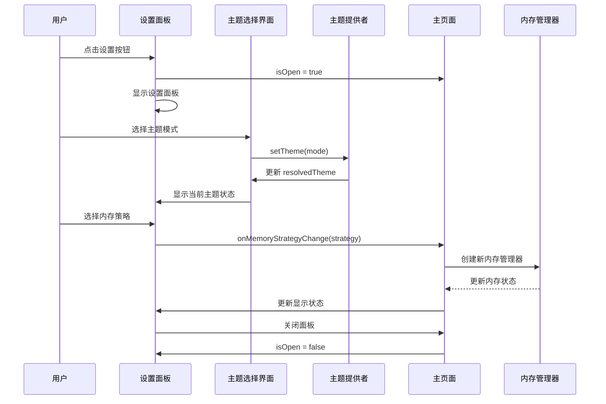
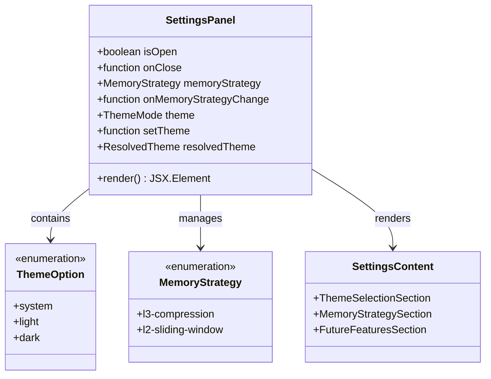
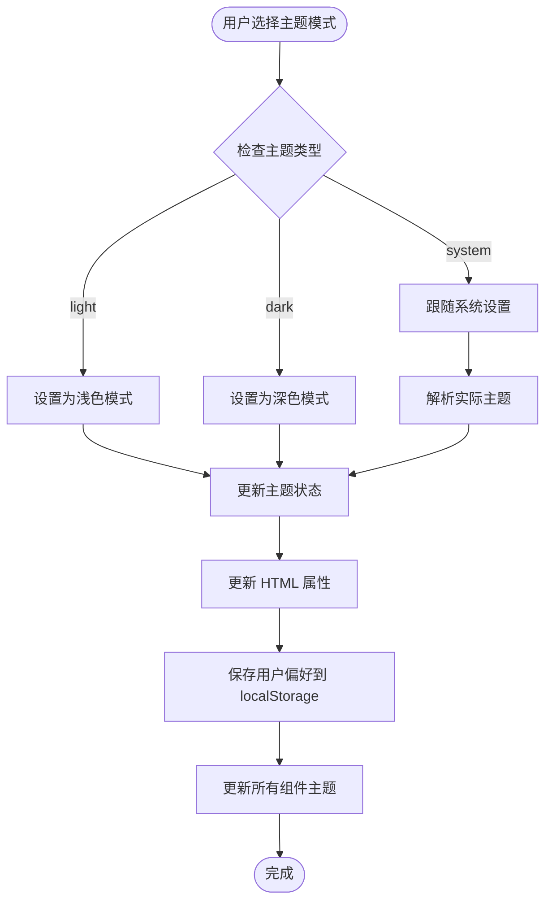
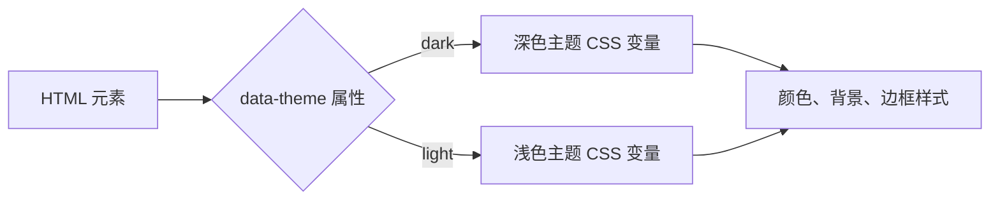
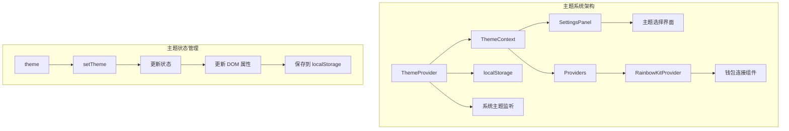
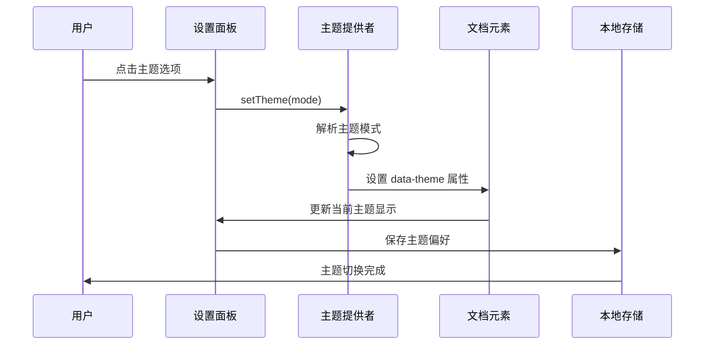
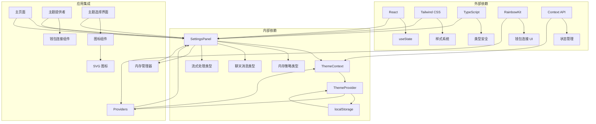
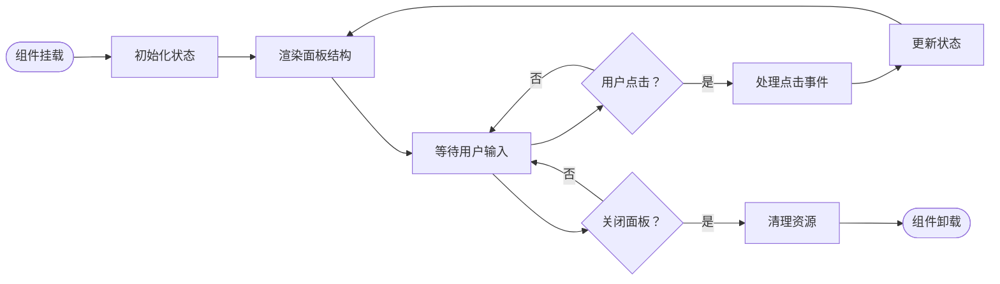

# 设置面板组件

<cite>
**本文档引用的文件**
- [SettingsPanel.tsx](file://apps/web/components/SettingsPanel.tsx)
- [ThemeSwitcher.tsx](file://apps/web/components/ThemeSwitcher.tsx)
- [page.tsx](file://apps/web/app/page.tsx)
- [ThemeContext.tsx](file://apps/web/lib/theme/ThemeContext.tsx)
- [ThemeProvider.tsx](file://apps/web/lib/theme/ThemeProvider.tsx)
- [types.ts](file://apps/web/lib/theme/types.ts)
- [providers.tsx](file://apps/web/app/providers.tsx)
- [globals.css](file://apps/web/app/globals.css)
</cite>

## 更新摘要
**变更内容**
- 设置面板已重构，包含新的主题选择界面（系统/浅色/深色模式）
- 替代了之前的独立ThemeSwitcher组件，将其功能集成到设置面板中
- 新增了完整的主题选择界面，支持三种主题模式的直观选择
- 增强了设置面板的整体功能性和用户体验

## 目录
1. [简介](#简介)
2. [项目结构](#项目结构)
3. [核心组件](#核心组件)
4. [架构概览](#架构概览)
5. [详细组件分析](#详细组件分析)
6. [主题系统集成](#主题系统集成)
7. [依赖关系分析](#依赖关系分析)
8. [性能考虑](#性能考虑)
9. [故障排除指南](#故障排除指南)
10. [结论](#结论)

## 简介

设置面板组件是 Web3 AI Agent 应用中的一个关键界面组件，负责提供用户友好的设置界面，允许用户自定义对话上下文管理策略和主题偏好。该组件采用现代化的设计理念，结合了响应式布局、动画效果和流畅的用户体验，为用户提供直观的设置选项。

**更新** 设置面板已重构，集成了全新的主题选择界面，替代了之前的独立ThemeSwitcher组件。现在用户可以在设置面板中直接访问和管理所有设置选项，包括主题模式选择、内存策略配置等。

该组件的核心功能包括：
- 内存策略选择（L3 摘要压缩 vs L2 滑动窗口）
- 主题模式选择（系统跟随、浅色、深色）
- 实时预览设置效果
- 平滑的展开/收起动画
- 无障碍设计支持

## 项目结构

设置面板组件位于应用的组件目录中，与聊天界面紧密集成，形成完整的用户交互体验。主题系统通过ThemeContext和ThemeProvider提供全局状态管理。

```mermaid
graph TB
subgraph "应用结构"
A[apps/web/] --> B[components/]
A --> C[app/]
A --> D[lib/theme/]
A --> E[hooks/]
B --> F[SettingsPanel.tsx]
B --> G[ThemeSwitcher.tsx]
C --> H[page.tsx]
C --> I[providers.tsx]
D --> J[ThemeContext.tsx]
D --> K[ThemeProvider.tsx]
D --> L[types.ts]
E --> M[useChatStream.ts]
end
subgraph "设置面板重构"
H --> F
F --> N[主题选择界面]
F --> O[内存策略配置]
F --> P[实时设置预览]
N --> Q[系统跟随模式]
N --> R[浅色模式]
N --> S[深色模式]
end
subgraph "主题系统架构"
J --> K
I --> K
K --> T[localStorage持久化]
K --> U[系统主题监听]
```

**图表来源**
- [SettingsPanel.tsx:16-20](file://apps/web/components/SettingsPanel.tsx#L16-L20)
- [ThemeSwitcher.tsx:9-13](file://apps/web/components/ThemeSwitcher.tsx#L9-L13)
- [page.tsx:42-43](file://apps/web/app/page.tsx#L42-L43)
- [ThemeContext.tsx:12-20](file://apps/web/lib/theme/ThemeContext.tsx#L12-L20)
- [ThemeProvider.tsx:13-82](file://apps/web/lib/theme/ThemeProvider.tsx#L13-L82)

**章节来源**
- [SettingsPanel.tsx:1-231](file://apps/web/components/SettingsPanel.tsx#L1-L231)
- [page.tsx:1-376](file://apps/web/app/page.tsx#L1-L376)

## 核心组件

设置面板组件是一个高度模块化的 React 组件，具有清晰的职责分离和类型安全的接口设计。重构后的设置面板集成了主题选择功能，提供了更加完整的设置管理体验。

### 组件特性

| 特性 | 描述 | 实现方式 |
|------|------|----------|
| **响应式设计** | 支持移动端和桌面端 | 使用 Tailwind CSS 响应式类 |
| **动画效果** | 平滑展开/收起动画 | CSS 过渡和变换属性 |
| **无障碍支持** | 键盘导航和屏幕阅读器友好 | 标准 HTML 属性和语义化标签 |
| **实时预览** | 设置变更即时反映在主界面 | 状态同步和回调机制 |
| **主题集成** | 内置主题选择界面 | 集成ThemeContext和ThemeProvider |

### 接口定义

组件通过严格的 TypeScript 接口确保类型安全：

```typescript
interface SettingsPanelProps {
  isOpen: boolean
  onClose: () => void
  memoryStrategy: MemoryStrategy
  onMemoryStrategyChange: (strategy: MemoryStrategy) => void
}

type MemoryStrategy = 'l3-compression' | 'l2-sliding-window'

interface ThemeOption {
  value: ThemeMode
  label: string
}

type ThemeMode = 'light' | 'dark' | 'system'
type ResolvedTheme = 'light' | 'dark'
```

**章节来源**
- [SettingsPanel.tsx:9-14](file://apps/web/components/SettingsPanel.tsx#L9-L14)
- [SettingsPanel.tsx:16-20](file://apps/web/components/SettingsPanel.tsx#L16-L20)
- [types.ts:4-9](file://apps/web/lib/theme/types.ts#L4-L9)

## 架构概览

设置面板组件在整个应用架构中扮演着重要的桥梁角色，连接用户界面和底层内存管理系统。重构后的设置面板集成了主题系统，形成了更加完整的设置管理架构。



**图表来源**
- [SettingsPanel.tsx:55](file://apps/web/components/SettingsPanel.tsx#L55)
- [ThemeSwitcher.tsx:24](file://apps/web/components/ThemeSwitcher.tsx#L24)
- [ThemeProvider.tsx:73-75](file://apps/web/lib/theme/ThemeProvider.tsx#L73-L75)
- [page.tsx:55-62](file://apps/web/app/page.tsx#L55-L62)

## 详细组件分析

### 设置面板组件结构

设置面板组件采用了现代 React 的函数式组件模式，结合了状态管理和副作用处理的最佳实践。重构后的设置面板集成了主题选择功能，提供了更加完整的设置管理体验。

#### 组件层次结构



**图表来源**
- [SettingsPanel.tsx:49-54](file://apps/web/components/SettingsPanel.tsx#L49-L54)
- [SettingsPanel.tsx:16-20](file://apps/web/components/SettingsPanel.tsx#L16-L20)
- [SettingsPanel.tsx:22-47](file://apps/web/components/SettingsPanel.tsx#L22-L47)

#### 主题选择界面

**更新** 设置面板重构后，主题选择功能被集成到设置面板中，提供了更加直观和完整的主题管理体验。

| 主题模式 | 图标 | 描述 | 实现方式 |
|----------|------|------|----------|
| **系统跟随** | 🖥️ | 跟随系统主题设置 | 使用 `prefers-color-scheme` 媒体查询 |
| **浅色模式** | ☀️ | 强制使用浅色主题 | 固定浅色模式 |
| **深色模式** | 🌙 | 强制使用深色主题 | 固定深色模式 |

#### 内存策略配置

设置面板提供了两种不同的内存管理策略，每种策略都有其独特的特点和适用场景：

| 策略名称 | 技术实现 | 性能特征 | 适用场景 |
|----------|----------|----------|----------|
| **L3 摘要压缩** | AI 生成摘要 + 保留最近消息 | 高质量上下文，有额外 API 调用 | 需要丰富上下文的复杂对话 |
| **L2 滑动窗口** | 纯本地截断，无额外调用 | 性能开销极低 | 简单对话或性能敏感场景 |

**章节来源**
- [SettingsPanel.tsx:22-47](file://apps/web/components/SettingsPanel.tsx#L22-L47)
- [SettingsPanel.tsx:16-20](file://apps/web/components/SettingsPanel.tsx#L16-L20)

### 主题系统架构

**更新** 主题系统现在完全集成到设置面板中，用户可以直接在设置界面中管理主题偏好，无需单独的ThemeSwitcher组件。

#### 主题切换流程



**图表来源**
- [SettingsPanel.tsx:101-128](file://apps/web/components/SettingsPanel.tsx#L101-L128)
- [ThemeProvider.tsx:33-38](file://apps/web/lib/theme/ThemeProvider.tsx#L33-L38)
- [ThemeProvider.tsx:55-71](file://apps/web/lib/theme/ThemeProvider.tsx#L55-L71)

#### 主题样式系统

应用使用 CSS 变量和 `data-theme` 属性来实现主题切换：



**图表来源**
- [globals.css:7-48](file://apps/web/app/globals.css#L7-L48)
- [ThemeProvider.tsx:59](file://apps/web/lib/theme/ThemeProvider.tsx#L59)

**章节来源**
- [SettingsPanel.tsx:87-130](file://apps/web/components/SettingsPanel.tsx#L87-L130)
- [ThemeProvider.tsx:13-83](file://apps/web/lib/theme/ThemeProvider.tsx#L13-L83)
- [globals.css:1-189](file://apps/web/app/globals.css#L1-L189)

### 用户界面设计

设置面板采用了现代化的设计语言，注重用户体验和视觉效果。重构后的设置面板集成了主题选择功能，提供了更加完整的设置管理体验。

#### 设计元素

| 元素 | 样式类 | 功能 |
|------|--------|------|
| **背景遮罩** | `fixed inset-0 bg-black/60 backdrop-blur-sm` | 提供焦点和交互区域 |
| **面板容器** | `fixed right-0 top-0 h-full w-full max-w-md` | 确定面板位置和尺寸 |
| **头部区域** | `p-6 border-b border-white/[0.06]` | 包含标题和关闭按钮 |
| **内容区域** | `p-6 space-y-8 overflow-y-auto` | 容纳设置选项和说明 |
| **主题选项** | `grid grid-cols-3 gap-2` | 布局三个主题选项 |
| **内存选项** | `space-y-3` | 布局内存策略选项 |

#### 动画系统

设置面板实现了多层次的动画效果，提供流畅的用户体验：

```mermaid
stateDiagram-v2
[*] --> Hidden
Hidden --> Visible : isOpen = true
Visible --> Hidden : 关闭面板
state Visible {
[*] --> Idle
Idle --> Hover : 鼠标悬停
Hover --> Active : 点击选择
Active --> Idle : 选择完成
state Hover {
[*] --> Normal
Normal --> Elevated : 悬停效果
}
state Active {
[*] --> Selected
Selected --> Processing : 正在切换
Processing --> Selected : 切换完成
}
```

**图表来源**
- [SettingsPanel.tsx:57](file://apps/web/components/SettingsPanel.tsx#L57)
- [SettingsPanel.tsx:100-129](file://apps/web/components/SettingsPanel.tsx#L100-L129)

**章节来源**
- [SettingsPanel.tsx:59-231](file://apps/web/components/SettingsPanel.tsx#L59-L231)

## 主题系统集成

**更新** 主题系统现在完全集成到设置面板中，用户可以直接在设置界面中管理主题偏好，无需单独的ThemeSwitcher组件。

### 主题提供者架构



**图表来源**
- [ThemeProvider.tsx:13-83](file://apps/web/lib/theme/ThemeProvider.tsx#L13-L83)
- [ThemeContext.tsx:12-20](file://apps/web/lib/theme/ThemeContext.tsx#L12-L20)
- [providers.tsx:45-68](file://apps/web/app/providers.tsx#L45-L68)

### 主题切换流程



**图表来源**
- [SettingsPanel.tsx:104](file://apps/web/components/SettingsPanel.tsx#L104)
- [ThemeProvider.tsx:55-71](file://apps/web/lib/theme/ThemeProvider.tsx#L55-L71)

**章节来源**
- [SettingsPanel.tsx:87-130](file://apps/web/components/SettingsPanel.tsx#L87-L130)
- [ThemeProvider.tsx:13-83](file://apps/web/lib/theme/ThemeProvider.tsx#L13-L83)
- [providers.tsx:45-68](file://apps/web/app/providers.tsx#L45-L68)

## 依赖关系分析

设置面板组件的依赖关系体现了清晰的分层架构和模块化设计。重构后的设置面板集成了主题系统，进一步完善了依赖关系。



**图表来源**
- [SettingsPanel.tsx:3](file://apps/web/components/SettingsPanel.tsx#L3)
- [ThemeSwitcher.tsx:3](file://apps/web/components/ThemeSwitcher.tsx#L3)
- [page.tsx:7](file://apps/web/app/page.tsx#L7)
- [providers.tsx:9](file://apps/web/app/providers.tsx#L9)

### 依赖注入模式

设置面板采用了依赖注入的设计模式，通过 props 传递依赖，实现了组件的可测试性和可维护性。

| 依赖类型 | 注入方式 | 作用域 | 生命周期 |
|----------|----------|--------|----------|
| **状态管理** | Props 回调 | 组件间共享 | 短期 |
| **主题上下文** | Context Provider | 应用级 | 长期 |
| **样式系统** | Tailwind 类 | 视觉表现 | 永久 |
| **配置信息** | 环境变量 | 应用级 | 长期 |
| **图标系统** | SVG 组件 | 视觉表现 | 永久 |

**章节来源**
- [SettingsPanel.tsx:9-14](file://apps/web/components/SettingsPanel.tsx#L9-L14)
- [page.tsx:38-39](file://apps/web/app/page.tsx#L38-L39)
- [ThemeContext.tsx:12-20](file://apps/web/lib/theme/ThemeContext.tsx#L12-L20)

## 性能考虑

设置面板组件在设计时充分考虑了性能优化，采用了多种技术手段确保流畅的用户体验。重构后的设置面板集成了主题系统，也经过了性能优化。

### 性能优化策略

| 优化技术 | 实现方式 | 性能收益 |
|----------|----------|----------|
| **条件渲染** | `isOpen` 状态控制 | 减少 DOM 节点数量 |
| **CSS 过渡** | GPU 加速动画 | 60fps 流畅度 |
| **事件委托** | 单一点击事件处理 | 降低事件监听器数量 |
| **虚拟滚动** | 滚动容器优化 | 大列表渲染性能 |
| **样式缓存** | Tailwind 预编译 | 减少运行时计算 |
| **主题状态缓存** | localStorage 缓存 | 避免重复解析 |
| **媒体查询监听** | 单一监听器 | 减少内存占用 |
| **图标优化** | SVG 内联渲染 | 减少 HTTP 请求 |

### 内存管理

设置面板组件遵循最小内存占用原则：



**图表来源**
- [SettingsPanel.tsx:57](file://apps/web/components/SettingsPanel.tsx#L57)
- [SettingsPanel.tsx:75-83](file://apps/web/components/SettingsPanel.tsx#L75-L83)

**章节来源**
- [SettingsPanel.tsx:57-83](file://apps/web/components/SettingsPanel.tsx#L57-L83)
- [ThemeProvider.tsx:18-30](file://apps/web/lib/theme/ThemeProvider.tsx#L18-L30)

## 故障排除指南

### 常见问题及解决方案

| 问题类型 | 症状 | 原因 | 解决方案 |
|----------|------|------|----------|
| **面板无法显示** | 组件渲染为空 | `isOpen` 状态为 false | 检查父组件状态传递 |
| **点击无响应** | 点击关闭按钮无效 | 事件处理器未正确绑定 | 验证 `onClick` 回调函数 |
| **样式异常** | 面板显示错位 | Tailwind 类冲突 | 检查样式优先级 |
| **内存泄漏** | 组件卸载后仍有事件监听 | 未清理定时器 | 确保清理副作用 |
| **性能问题** | 动画卡顿 | 过多重绘 | 优化渲染逻辑 |
| **主题切换失效** | 主题更改不生效 | 未正确使用 ThemeContext | 检查 Provider 包装 |
| **系统主题监听失败** | 系统主题变化不响应 | 媒体查询监听器未正确设置 | 验证监听器注册 |
| **主题图标显示异常** | SVG 图标不显示 | 路径或权限问题 | 检查图标资源路径 |

### 调试技巧

1. **开发者工具检查**
   - 使用 React DevTools 检查组件树
   - 监控组件重新渲染次数
   - 检查 props 和 state 变化

2. **性能分析**
   - 使用浏览器性能面板
   - 监控 FPS 和内存使用
   - 检查 JavaScript 执行时间

3. **主题调试**
   - 检查 `data-theme` 属性变化
   - 验证 CSS 变量应用
   - 监控 localStorage 存储状态
   - 验证 SVG 图标的渲染

**章节来源**
- [SettingsPanel.tsx:75-83](file://apps/web/components/SettingsPanel.tsx#L75-L83)
- [ThemeSwitcher.tsx:36](file://apps/web/components/ThemeSwitcher.tsx#L36)

## 结论

设置面板组件是 Web3 AI Agent 应用中一个精心设计的界面组件，它不仅提供了实用的功能，还展现了现代前端开发的最佳实践。通过清晰的架构设计、优秀的用户体验和完善的性能优化，该组件成功地将复杂的内存管理概念简化为直观的用户界面。

**更新** 设置面板已重构并集成了全新的主题选择界面，替代了之前的独立ThemeSwitcher组件。这一重构显著提升了用户体验，使用户能够在单一界面中管理所有设置选项。主题系统采用 Context API 和 localStorage 实现，确保了良好的性能和用户体验。

### 主要成就

1. **用户体验优化**：通过流畅的动画和直观的界面设计，提供了优秀的用户体验
2. **架构设计优雅**：实现了松耦合和高内聚的设计原则
3. **性能表现优秀**：采用了多种优化技术确保流畅的交互体验
4. **可维护性强**：清晰的代码结构和类型安全确保了长期可维护性
5. **主题系统完善**：重构后的主题选择界面提供了更加直观的个性化体验

### 未来改进方向

1. **国际化支持**：扩展多语言支持以服务全球用户
2. **高级设置**：提供更多细粒度的配置选项
3. **主题定制**：增加更多主题选项满足个性化需求
4. **性能监控**：集成性能指标监控和分析
5. **主题扩展**：支持用户自定义主题颜色和样式

设置面板组件代表了现代前端开发的高标准，为类似的应用程序提供了优秀的参考实现。重构后的主题系统进一步提升了组件的完整性和用户体验。