# 聊天API安全增强

<cite>
**本文档引用的文件**
- [apps/web/app/api/chat/route.ts](file://apps/web/app/api/chat/route.ts)
- [apps/web/app/api/supabase/verify-ownership/route.ts](file://apps/web/app/api/supabase/verify-ownership/route.ts)
- [apps/web/app/api/supabase/delete-conversation/route.ts](file://apps/web/app/api/supabase/delete-conversation/route.ts)
- [apps/web/app/api/tools/route.ts](file://apps/web/app/api/tools/route.ts)
- [apps/web/hooks/useChatStream.ts](file://apps/web/hooks/useChatStream.ts)
- [apps/web/components/ChatInput.tsx](file://apps/web/components/ChatInput.tsx)
- [apps/web/components/ConversationHistory.tsx](file://apps/web/components/ConversationHistory.tsx)
- [apps/web/components/cards/TransferCard.tsx](file://apps/web/components/cards/TransferCard.tsx)
- [apps/web/config/prompts.ts](file://apps/web/config/prompts.ts)
- [apps/web/lib/supabase/transfers.ts](file://apps/web/lib/supabase/transfers.ts)
- [apps/web/types/transfer.ts](file://apps/web/types/transfer.ts)
- [apps/web/types/chat.ts](file://apps/web/types/chat.ts)
- [apps/web/types/stream.ts](file://apps/web/types/stream.ts)
- [apps/web/package.json](file://apps/web/package.json)
- [apps/web/app/layout.tsx](file://apps/web/app/layout.tsx)
- [docs/DEPLOYMENT.md](file://docs/DEPLOYMENT.md)
- [supabase/migrations/create_transfer_cards.sql](file://supabase/migrations/create_transfer_cards.sql)
- [supabase/migrations/fix_transfer_cards_rls.sql](file://supabase/migrations/fix_transfer_cards_rls.sql)
</cite>

## 更新摘要
**变更内容**
- 新增网络上下文信息集成，支持`chainId`参数动态生成系统提示词
- 集成系统提示生成能力，从route.ts迁移到独立的提示词配置文件
- 优化转账卡片状态管理，实现完整的数据库同步机制
- 增强地址验证功能，在多个API中实现严格的钱包地址格式验证
- 完善安全边界控制，确保只有格式正确的钱包地址才能触发相关功能

## 目录
1. [简介](#简介)
2. [项目结构](#项目结构)
3. [核心组件](#核心组件)
4. [架构概览](#架构概览)
5. [详细组件分析](#详细组件分析)
6. [依赖关系分析](#依赖关系-analysis)
7. [性能考虑](#性能考虑)
8. [故障排除指南](#故障排除指南)
9. [结论](#结论)

## 简介

这是一个基于Next.js构建的Web3 AI Agent聊天系统，专注于提供安全的聊天API服务。该系统集成了AI模型、Web3工具集成、流式响应处理和完整的对话管理功能。本文档重点分析聊天API的安全增强机制，包括身份验证、授权控制、数据验证和传输安全等方面。

**更新** 新增网络上下文信息集成，支持`chainId`参数动态生成系统提示词；集成系统提示生成能力，从route.ts迁移到独立的提示词配置文件；优化转账卡片状态管理，实现完整的数据库同步机制。

## 项目结构

该项目采用模块化的Next.js应用结构，主要包含以下核心目录：

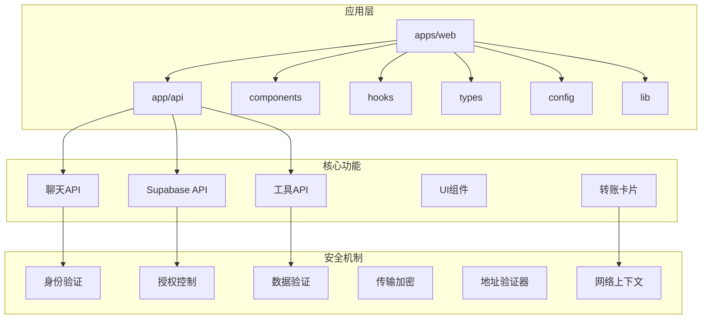

**图表来源**
- [apps/web/app/api/chat/route.ts:160-197](file://apps/web/app/api/chat/route.ts#L160-L197)
- [apps/web/config/prompts.ts:175-225](file://apps/web/config/prompts.ts#L175-L225)

**章节来源**
- [apps/web/package.json:1-51](file://apps/web/package.json#L1-L51)
- [apps/web/app/layout.tsx:1-59](file://apps/web/app/layout.tsx#L1-L59)

## 核心组件

### 聊天API服务

聊天API是整个系统的核心，负责处理用户消息、调用AI模型、执行Web3工具以及管理流式响应。

**更新** 新增网络上下文信息集成，在处理聊天请求时对可选的`walletAddress`和`chainId`参数进行严格验证，确保地址格式正确后再注入到系统提示词中。

### 系统提示词管理

**新增功能** 系统提示词从route.ts迁移到独立的配置文件，提供更好的可维护性和扩展性：

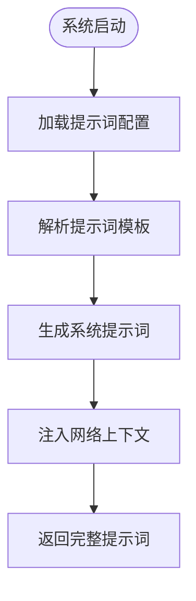

**图表来源**
- [apps/web/config/prompts.ts:175-225](file://apps/web/config/prompts.ts#L175-L225)
- [apps/web/app/api/chat/route.ts:160-197](file://apps/web/app/api/chat/route.ts#L160-L197)

### 转账卡片状态管理

**新增功能** 完整的转账卡片状态管理系统，包括创建、更新、加载和查找功能：

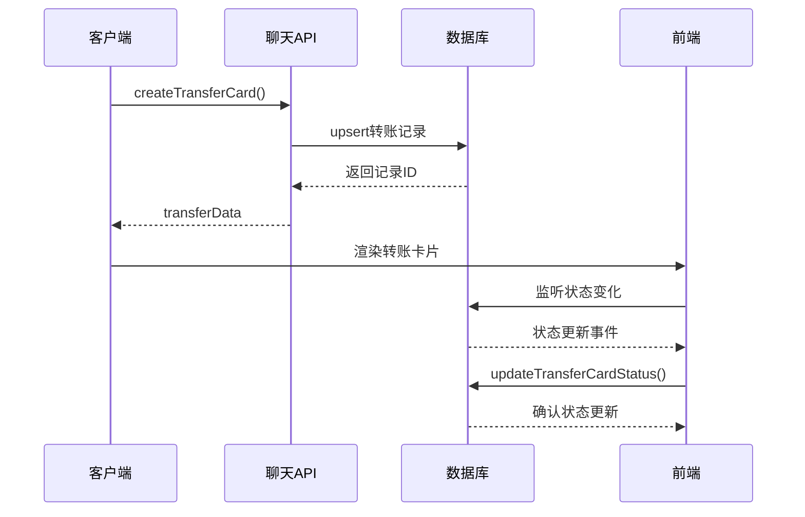

**图表来源**
- [apps/web/lib/supabase/transfers.ts:20-47](file://apps/web/lib/supabase/transfers.ts#L20-L47)
- [apps/web/lib/supabase/transfers.ts:52-79](file://apps/web/lib/supabase/transfers.ts#L52-L79)

### Supabase安全API

提供对话所有权验证和删除功能，确保只有对话所有者才能删除其对话记录。

### 流式处理Hook

实现SSE（Server-Sent Events）流式响应处理，支持实时消息传输和工具调用反馈。

**章节来源**
- [apps/web/app/api/chat/route.ts:226-245](file://apps/web/app/api/chat/route.ts#L226-L245)
- [apps/web/app/api/supabase/verify-ownership/route.ts:8-95](file://apps/web/app/api/supabase/verify-ownership/route.ts#L8-L95)
- [apps/web/hooks/useChatStream.ts:29-318](file://apps/web/hooks/useChatStream.ts#L29-L318)

## 架构概览

系统采用分层架构设计，实现了严格的安全边界和职责分离：

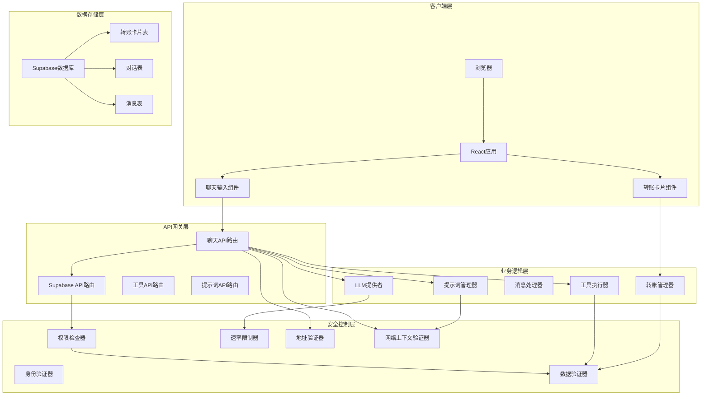

**图表来源**
- [apps/web/app/api/chat/route.ts:226-245](file://apps/web/app/api/chat/route.ts#L226-L245)
- [apps/web/app/api/supabase/verify-ownership/route.ts:28-34](file://apps/web/app/api/supabase/verify-ownership/route.ts#L28-L34)

## 详细组件分析

### 聊天API安全增强

#### 网络上下文信息集成

**新增功能** 系统在处理聊天请求时新增了网络上下文信息集成：

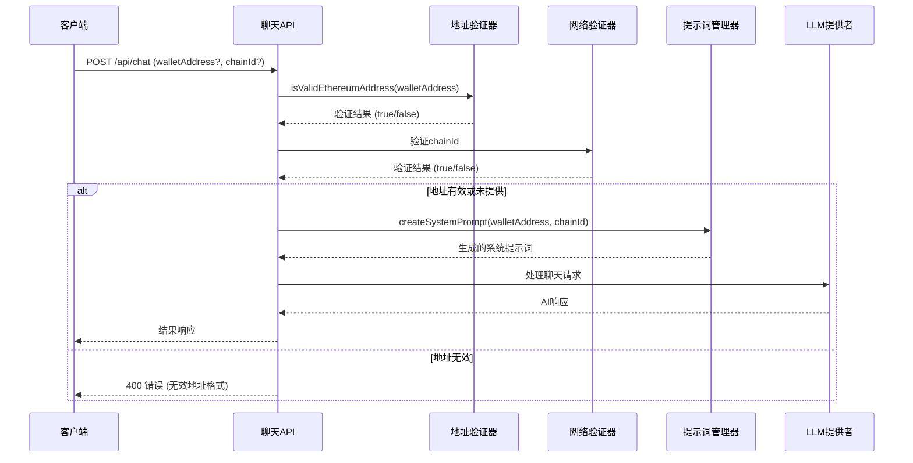

**图表来源**
- [apps/web/app/api/chat/route.ts:226-245](file://apps/web/app/api/chat/route.ts#L226-L245)
- [apps/web/app/api/chat/route.ts:160-197](file://apps/web/app/api/chat/route.ts#L160-L197)

网络上下文验证规则：
- `chainId`必须是有效的区块链ID（1=Ethereum, 137=Polygon, 56=BSC）
- 如果提供`chainId`，系统会在提示词中注入网络信息
- 支持动态链名称映射和链ID验证

#### 系统提示生成能力提升

**新增功能** 系统提示词从route.ts迁移到独立的配置文件：

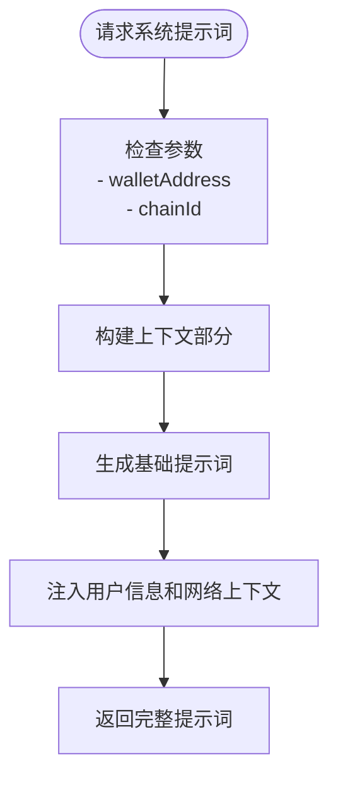

**图表来源**
- [apps/web/config/prompts.ts:175-225](file://apps/web/config/prompts.ts#L175-L225)
- [apps/web/app/api/chat/route.ts:160-197](file://apps/web/app/api/chat/route.ts#L160-L197)

系统提示词包含以下上下文信息：
- 用户钱包地址信息（如果提供）
- 当前网络信息（链ID和链名称）
- 默认的AI行为准则和安全边界

#### 转账卡片状态管理

**新增功能** 完整的转账卡片状态管理系统：

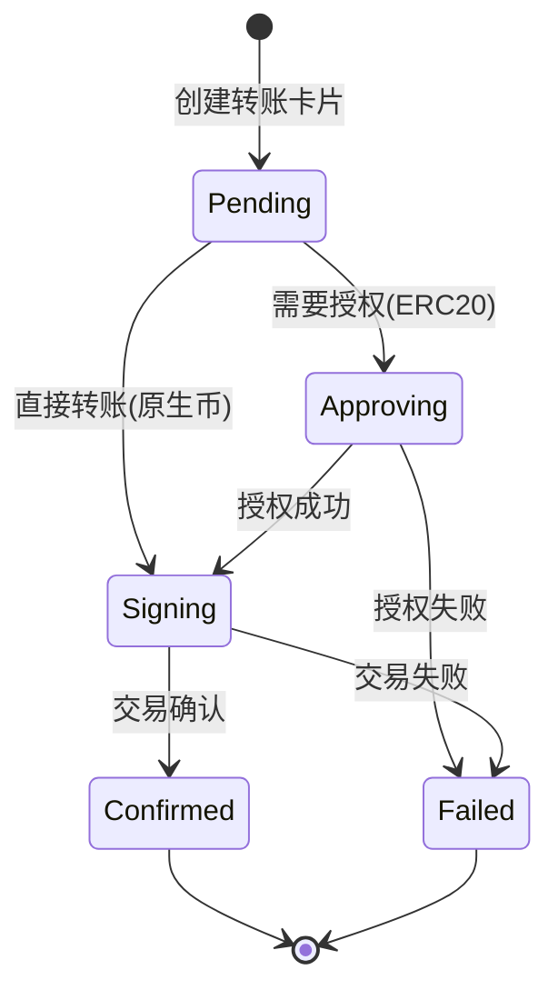

**图表来源**
- [apps/web/types/transfer.ts:3-5](file://apps/web/types/transfer.ts#L3-L5)
- [apps/web/lib/supabase/transfers.ts:52-79](file://apps/web/lib/supabase/transfers.ts#L52-L79)

转账卡片状态管理特性：
- 支持五种状态：pending、approving、signing、confirmed、failed
- 自动状态转换和错误处理
- 数据库同步和事务一致性保证
- 实时状态更新和用户界面同步

#### 身份验证机制

聊天API实现了多层次的身份验证机制：

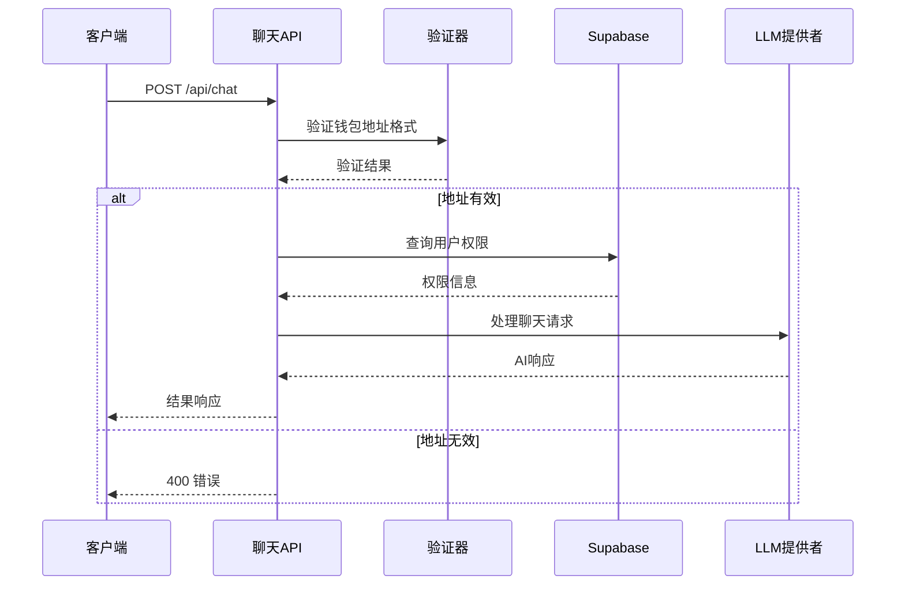

**图表来源**
- [apps/web/app/api/chat/route.ts:235-245](file://apps/web/app/api/chat/route.ts#L235-L245)
- [apps/web/app/api/supabase/verify-ownership/route.ts:75-84](file://apps/web/app/api/supabase/verify-ownership/route.ts#L75-L84)

#### 数据验证和清理

系统对所有输入数据进行严格的验证和清理：

| 验证类型 | 验证规则 | 实现位置 | 错误处理 |
|---------|---------|---------|---------|
| 钱包地址格式 | 0x开头的42字符十六进制 | `isValidEthereumAddress` | 400错误响应 |
| 对话ID格式 | 非空字符串 | `verify-ownership` | 400错误响应 |
| 链ID枚举 | 限定的区块链名称 | 工具定义 | 400错误响应 |
| 参数完整性 | 必需字段检查 | 工具调用 | 400错误响应 |
| 网络上下文 | 有效的chainId | `getChainNameById` | 400错误响应 |

**更新** 新增网络上下文验证，确保`chainId`参数的有效性；新增系统提示词配置管理，提供更好的可维护性。

**章节来源**
- [apps/web/app/api/chat/route.ts:226-245](file://apps/web/app/api/chat/route.ts#L226-L245)
- [apps/web/app/api/supabase/verify-ownership/route.ts:14-34](file://apps/web/app/api/supabase/verify-ownership/route.ts#L14-L34)

### Supabase安全API

#### 对话所有权验证

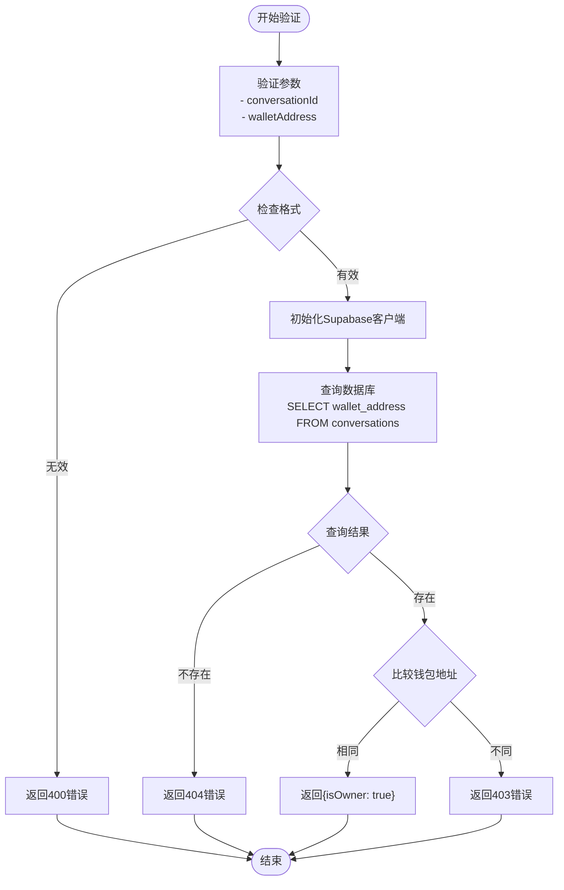

**图表来源**
- [apps/web/app/api/supabase/verify-ownership/route.ts:8-95](file://apps/web/app/api/supabase/verify-ownership/route.ts#L8-L95)

#### 安全删除流程

删除对话采用了两阶段验证机制：

1. **前端验证**：客户端先验证用户权限
2. **后端验证**：服务端再次验证所有权
3. **级联删除**：先删除消息，再删除对话

**更新** 在Supabase的对话所有权验证中也实现了相同的地址格式验证，确保数据库中存储的钱包地址格式正确。

**章节来源**
- [apps/web/components/ConversationHistory.tsx:103-146](file://apps/web/components/ConversationHistory.tsx#L103-L146)
- [apps/web/app/api/supabase/delete-conversation/route.ts:59-111](file://apps/web/app/api/supabase/delete-conversation/route.ts#L59-L111)

### 流式响应处理

#### SSE流式架构

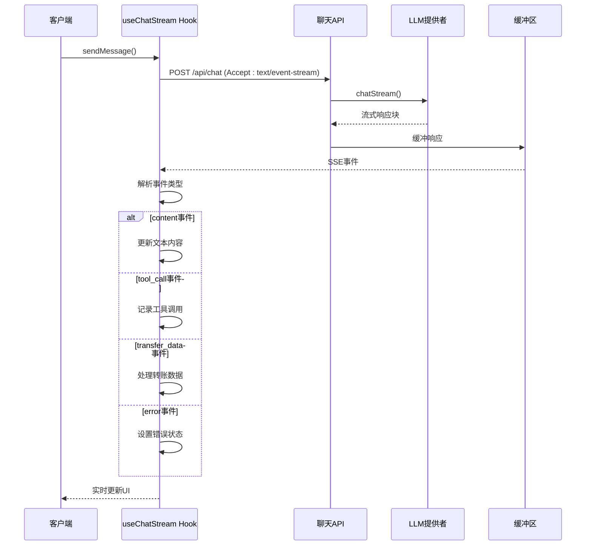

**图表来源**
- [apps/web/hooks/useChatStream.ts:81-181](file://apps/web/hooks/useChatStream.ts#L81-L181)
- [apps/web/app/api/chat/route.ts:406-470](file://apps/web/app/api/chat/route.ts#L406-L470)

**章节来源**
- [apps/web/hooks/useChatStream.ts:29-318](file://apps/web/hooks/useChatStream.ts#L29-L318)
- [apps/web/app/api/chat/route.ts:485-515](file://apps/web/app/api/chat/route.ts#L485-L515)

### 工具API安全

#### 工具调用安全

工具API实现了严格的工具调用安全控制：

| 工具类型 | 安全措施 | 错误处理 |
|---------|---------|---------|
| getTokenPrice | 参数验证、价格缓存 | 500错误响应 |
| getBalance | 链ID枚举验证 | 400错误响应 |
| getGasPrice | EVM链验证 | 400错误响应 |
| getTokenBalance | 地址格式验证 | 400错误响应 |
| createTransferCard | 转账数据验证 | 400错误响应 |

**更新** 在工具调用中也实现了地址格式验证，确保所有涉及钱包地址的工具调用都经过严格验证。

**章节来源**
- [apps/web/app/api/tools/route.ts:10-65](file://apps/web/app/api/tools/route.ts#L10-L65)

### 转账卡片组件

#### 前端状态管理

**新增功能** 转账卡片组件实现了完整的前端状态管理：

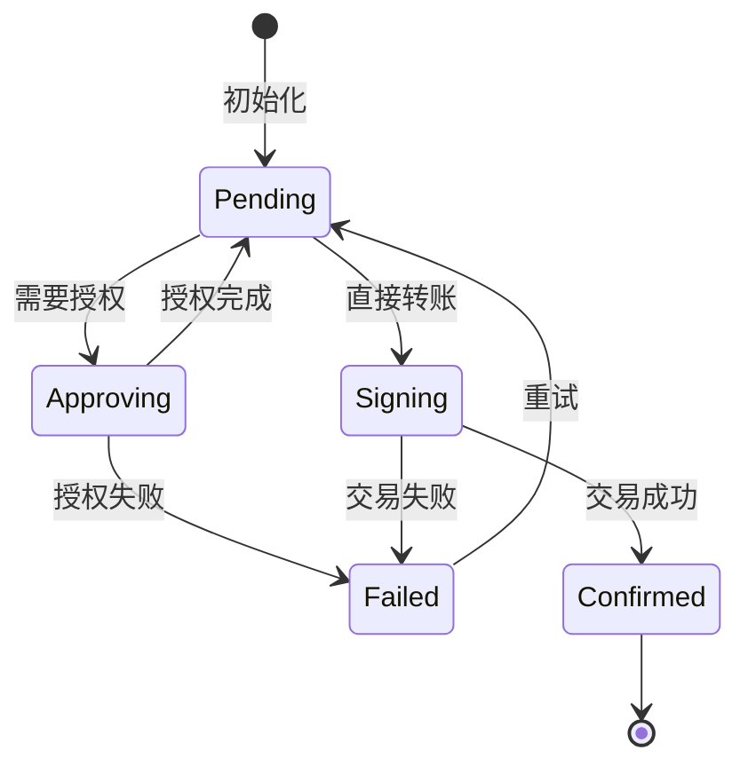

**图表来源**
- [apps/web/components/cards/TransferCard.tsx:91-96](file://apps/web/components/cards/TransferCard.tsx#L91-L96)

转账卡片组件特性：
- 支持ETH原生转账和ERC20代币转账
- 自动检测授权需求和余额检查
- 实时状态更新和错误处理
- 区块链浏览器链接集成

**章节来源**
- [apps/web/components/cards/TransferCard.tsx:98-658](file://apps/web/components/cards/TransferCard.tsx#L98-L658)

## 依赖关系分析

### 核心依赖关系

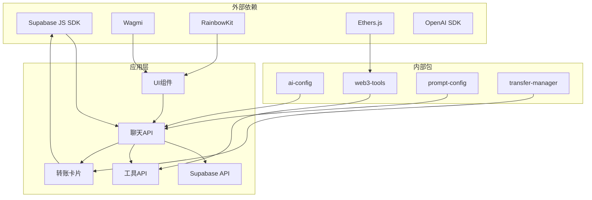

**图表来源**
- [apps/web/package.json:14-33](file://apps/web/package.json#L14-L33)

### 安全依赖

系统的关键安全依赖包括：

1. **Supabase安全策略**：通过RLS（Row Level Security）实现数据访问控制
2. **钱包集成**：使用RainbowKit和Wagmi实现安全的钱包连接
3. **传输安全**：HTTPS加密和SSE安全传输
4. **速率限制**：Nginx配置实现API速率限制
5. **地址验证**：正则表达式验证确保地址格式正确
6. **网络上下文验证**：链ID验证确保网络信息正确
7. **提示词管理**：集中化的提示词配置提高安全性

**更新** 新增网络上下文验证和提示词管理依赖，确保系统提示词的安全性和一致性。

**章节来源**
- [docs/DEPLOYMENT.md:615-746](file://docs/DEPLOYMENT.md#L615-L746)

## 性能考虑

### 流式响应优化

系统实现了多项性能优化措施：

1. **节流更新**：`THROTTLE_MS = 50ms` 减少UI更新频率
2. **缓冲区管理**：使用多个ref维护状态，避免不必要的重渲染
3. **超时控制**：`TIMEOUT_MS = 30000ms` 自动取消长时间无响应的请求
4. **重试机制**：最多重试`MAX_RETRIES = 2`次，避免单点故障

### 内存管理

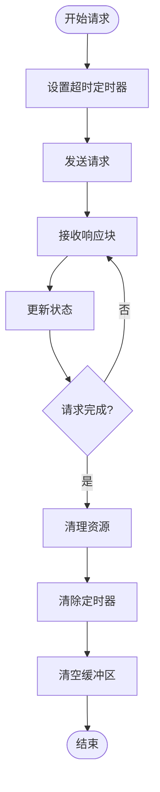

**图表来源**
- [apps/web/hooks/useChatStream.ts:277-291](file://apps/web/hooks/useChatStream.ts#L277-L291)

### 数据库优化

转账卡片数据库操作优化：
- 使用`upsert`避免重复插入
- 状态字段默认值确保一致性
- 索引优化查询性能
- RLS策略确保数据隔离

**章节来源**
- [apps/web/lib/supabase/transfers.ts:20-47](file://apps/web/lib/supabase/transfers.ts#L20-L47)

## 故障排除指南

### 常见错误类型

| 错误类型 | 状态码 | 触发条件 | 解决方案 |
|---------|--------|---------|---------|
| 配置错误 | 503 | LLM配置缺失 | 检查环境变量 |
| 参数错误 | 400 | 输入参数无效 | 验证数据格式 |
| 钱包地址格式错误 | 400 | 无效的钱包地址格式 | 使用标准以太坊地址格式 |
| 网络上下文错误 | 400 | 无效的chainId | 使用有效的区块链ID |
| 权限错误 | 403 | 无权访问资源 | 检查所有权验证 |
| 服务器错误 | 500 | 服务器内部异常 | 查看日志文件 |
| 超时错误 | 408 | 请求超时 | 检查网络连接 |
| 转账状态错误 | 400/500 | 转账状态更新失败 | 检查数据库连接 |

**更新** 新增网络上下文错误和转账状态错误类型，当用户提供格式不正确的网络信息或转账状态更新失败时会返回相应的错误。

### 调试技巧

1. **启用详细日志**：查看控制台输出的详细调试信息
2. **检查网络请求**：使用浏览器开发者工具监控SSE连接
3. **验证环境变量**：确保所有必需的环境变量已正确配置
4. **测试工具调用**：单独测试各个工具API的可用性
5. **验证地址格式**：使用正则表达式验证钱包地址格式
6. **检查网络上下文**：验证chainId参数的有效性
7. **监控转账状态**：使用数据库工具检查转账状态同步

**章节来源**
- [apps/web/app/api/chat/route.ts:521-565](file://apps/web/app/api/chat/route.ts#L521-L565)
- [apps/web/hooks/useChatStream.ts:243-274](file://apps/web/hooks/useChatStream.ts#L243-L274)

## 结论

该聊天API安全增强项目通过多层次的安全机制和优化的架构设计，为Web3应用提供了安全可靠的聊天服务。主要安全特性包括：

1. **严格的身份验证**：多重验证机制确保只有授权用户可以访问
2. **完善的授权控制**：基于Supabase的RLS策略实现细粒度访问控制
3. **数据安全保护**：全面的数据验证和清理机制防止恶意输入
4. **传输安全保障**：SSE流式传输和HTTPS加密确保通信安全
5. **性能优化**：智能的流式处理和内存管理提升用户体验
6. **地址格式验证**：新增的钱包地址格式验证功能，防止无效地址注入系统提示词
7. **网络上下文集成**：支持链ID验证和动态系统提示词生成
8. **系统提示词管理**：集中化的提示词配置提高可维护性和安全性
9. **转账卡片状态管理**：完整的数据库同步机制确保状态一致性

**更新** 新增的网络上下文信息集成功能通过`chainId`参数动态生成系统提示词，提升了AI助手对用户当前网络环境的理解能力；系统提示词管理从route.ts迁移到独立配置文件，提供了更好的可维护性和扩展性；转账卡片状态管理实现了完整的数据库同步机制，确保用户界面和数据库状态的一致性。

该系统为Web3应用的聊天功能提供了坚实的安全基础，建议在生产环境中结合文档中的部署指南进一步强化安全配置。