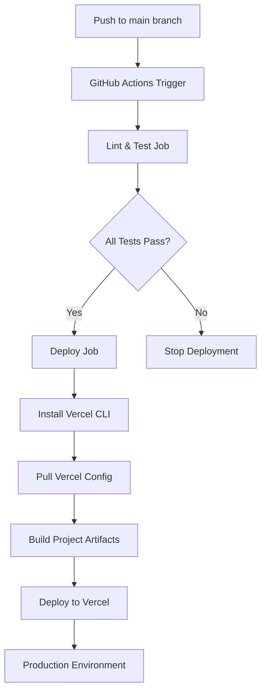

# 部署指南

<cite>
**本文档引用的文件**
- [README.md](file://README.md)
- [package.json](file://package.json)
- [pnpm-workspace.yaml](file://pnpm-workspace.yaml)
- [turbo.json](file://turbo.json)
- [apps/web/package.json](file://apps/web/package.json)
- [apps/web/next.config.js](file://apps/web/next.config.js)
- [apps/web/tsconfig.json](file://apps/web/tsconfig.json)
- [apps/web/tailwind.config.ts](file://apps/web/tailwind.config.ts)
- [apps/web/postcss.config.js](file://apps/web/postcss.config.js)
- [apps/web/app/api/chat/route.ts](file://apps/web/app/api/chat/route.ts)
- [apps/web/app/api/health/route.ts](file://apps/web/app/api/health/route.ts)
- [apps/web/app/api/tools/route.ts](file://apps/web/app/api/tools/route.ts)
- [apps/web/app/api/tools/route.test.ts](file://apps/web/app/api/tools/route.test.ts)
- [docs/DEPLOYMENT.md](file://docs/DEPLOYMENT.md)
- [packages/ai-config/package.json](file://packages/ai-config/package.json)
- [packages/web3-tools/package.json](file://packages/web3-tools/package.json)
- [packages/web3-tools/src/index.ts](file://packages/web3-tools/src/index.ts)
- [supabase/init.sql](file://supabase/init.sql)
- [supabase/migrations/create_transfer_cards.sql](file://supabase/migrations/create_transfer_cards.sql)
- [supabase/migrations/alter_messages_id_type.sql](file://supabase/migrations/alter_messages_id_type.sql)
- [supabase/migrations/fix_transfer_cards_rls.sql](file://supabase/migrations/fix_transfer_cards_rls.sql)
- [supabase/migrations/upgrade_production_rls.sql](file://supabase/migrations/upgrade_production_rls.sql)
- [apps/web/lib/supabase/client.ts](file://apps/web/lib/supabase/client.ts)
- [apps/web/app/api/supabase/delete-conversation/route.ts](file://apps/web/app/api/supabase/delete-conversation/route.ts)
- [apps/web/app/api/supabase/verify-ownership/route.ts](file://apps/web/app/api/supabase/verify-ownership/route.ts)
- [apps/web/.env.example](file://apps/web/.env.example)
- [vercel.json](file://vercel.json)
- [.npmrc](file://.npmrc)
- [apps/web/.npmrc](file://apps/web/.npmrc)
- [.github/workflows/ci-cd.yml](file://.github/workflows/ci-cd.yml)
- [vitest.workspace.ts](file://vitest.workspace.ts)
- [apps/web/vitest.config.ts](file://apps/web/vitest.config.ts)
- [apps/web/test-setup.tsx](file://apps/web/test-setup.tsx)
- [packages/ai-config/vitest.config.ts](file://packages/ai-config/vitest.config.ts)
- [packages/web3-tools/vitest.config.ts](file://packages/web3-tools/vitest.config.ts)
- [playwright.config.ts](file://playwright.config.ts)
</cite>

## 更新摘要
**变更内容**
- 新增 Vercel 部署配置优化章节，反映改进的构建配置
- 更新 TypeScript 路径解析配置，增强 npm 工作区隔离支持
- 新增 npm 工作区隔离配置说明，提升部署可靠性
- 完善 CI/CD 自动化部署流程，集成 Vercel 配置文件
- 增强部署配置的兼容性和稳定性
- 新增根目录和apps/web目录的.npmrc配置说明，解决TailwindCSS依赖提升问题
- **更新** 基于 Applied Changes：API工具路由测试结构化改进，现在期望标准化数据包装器结构，包含符号、价格、24小时变化、货币、链、地址、余额、单位、小数、Gas价格、最大费用、最大优先费用等字段
- **新增** 标准化数据包装器结构说明，详细描述ToolResult接口和各工具的数据格式
- **新增** 测试环境配置改进章节，包括 Vitest 工作区配置、测试设置和模拟环境
- **新增** 依赖版本管理优化，基于 pnpm 8.15.0 和 Turbo 2.0 的稳定版本管理
- **更新** CI管道稳定性提升，包括锁定 Node.js 和 pnpm 版本，改进缓存策略
- **新增** 多包测试工作区配置，支持 ai-config、web3-tools 和 web 应用的统一测试管理
- **新增** 现代化测试环境配置，包括 Happy DOM 环境、路径别名支持和组件测试覆盖
- **新增** 完整的测试模拟环境，涵盖 Next.js 导航、图像和头部模块的模拟
- **新增** E2E 测试配置，基于 Playwright 的端到端测试框架

## 目录
1. [系统要求](#系统要求)
2. [部署方案概览](#部署方案概览)
3. [方案一：Vercel 部署（推荐）](#方案一vercel-部署推荐)
4. [方案二：Docker 部署](#方案二docker-部署)
5. [方案三：传统服务器部署](#方案三传统服务器部署)
6. [环境变量配置](#环境变量配置)
7. [数据库配置（Supabase）](#数据库配置supabase)
8. [生产环境 RLS 升级指南](#生产环境-rls-升级指南)
9. [服务端 API 安全机制](#服务端-api-安全机制)
10. [标准化数据包装器结构](#标准化数据包装器结构)
11. [测试环境配置改进](#测试环境配置改进)
12. [依赖版本管理优化](#依赖版本管理优化)
13. [CI/CD 自动化部署](#cicd-自动化部署)
14. [生产环境优化](#生产环境优化)
15. [监控与日志](#监控与日志)
16. [常见问题](#常见问题)
17. [部署检查清单](#部署检查清单)
18. [下一步](#下一步)

## 系统要求

### 最低配置
- **Node.js**: >= 18.0.0
- **pnpm**: >= 8.0.0
- **内存**: 2GB+
- **磁盘**: 1GB+

### 推荐配置（生产环境）
- **Node.js**: 18.x LTS
- **pnpm**: 8.15.0
- **内存**: 4GB+
- **磁盘**: 5GB+
- **CPU**: 2 核+

## 部署方案概览

| 方案 | 适用场景 | 复杂度 | 成本 | 推荐度 |
|------|---------|--------|------|--------|
| **Vercel** | 快速上线、个人项目 | ⭐ | 免费额度 | ⭐⭐⭐⭐⭐ |
| **Docker** | 自定义环境、私有化部署 | ⭐⭐⭐ | 中等 | ⭐⭐⭐⭐ |
| **传统服务器** | 企业级部署、完全控制 | ⭐⭐⭐⭐ | 高 | ⭐⭐⭐ |

## 方案一：Vercel 部署（推荐）

### 优势
- ✅ 零配置部署
- ✅ 自动 HTTPS
- ✅ 全球 CDN
- ✅ 自动 CI/CD
- ✅ 免费额度充足

### 步骤

#### 1. 准备工作
```bash
# 1. 将代码推送到 GitHub
git remote add origin https://github.com/YOUR_USERNAME/web3-ai-agent.git
git push -u origin main

# 2. 注册 Vercel 账号
# 访问 https://vercel.com，使用 GitHub 账号登录
```

#### 2. 创建 Vercel 项目
1. 访问 [Vercel Dashboard](https://vercel.com/dashboard)
2. 点击 **"Add New..."** → **"Project"**
3. 选择你的 GitHub 仓库 `web3-ai-agent`
4. 点击 **Import**

#### 3. 配置构建设置
**在 Vercel 项目设置中配置以下参数：**

```
Framework Preset: Next.js
Root Directory: apps/web                    # 指向 Next.js 应用目录
Build Command: pnpm build                   # 简化的构建命令
Output Directory: .next                     # 构建产物目录
Install Command: pnpm install --frozen-lockfile
```

**必须开启（重要）**：
- ✅ **Include files outside the root directory in the Build Step** — 此选项让根目录的 `pnpm-workspace.yaml`、`.npmrc` 等文件在构建时可用

**工作原理**：
1. Vercel 进入 `apps/web` 目录
2. 执行 `pnpm install --frozen-lockfile` — pnpm 自动向上查找 `pnpm-workspace.yaml`，安装所有 workspace 依赖
3. 执行 `pnpm build` — 运行 `next build`，构建产物输出到 `.next`（即 `apps/web/.next`）
4. Vercel 在 `apps/web/.next` 找到输出 ✅

**关于 `.npmrc` 配置**：
项目根目录和 `apps/web` 目录都配置了 `.npmrc` 文件，其中包含 `shamefully-hoist=true` 设置，这是为了解决 pnpm 严格模式下 Next.js 无法解析 `tailwindcss` 的依赖问题。这种配置提升了依赖提升的稳定性，改善了构建过程中的依赖解析问题。

#### 4. 配置环境变量
在 Vercel 项目设置中添加以下环境变量：

```bash
# WalletConnect 配置
NEXT_PUBLIC_WALLETCONNECT_PROJECT_ID=your_project_id

# Supabase 配置（对话持久化和转账卡片）
NEXT_PUBLIC_SUPABASE_URL=https://your-project.supabase.co
NEXT_PUBLIC_SUPABASE_ANON_KEY=your_supabase_anon_key

# 应用配置
APP_VERSION=0.1.0
```

#### 5. 部署
点击 **Deploy**，等待构建完成即可访问。

**访问地址**：`https://your-project-name.vercel.app`

#### 6. 自定义域名（可选）
1. 进入项目设置 → **Domains**
2. 添加你的域名
3. 按照提示配置 DNS 记录

### Vercel 部署配置优化

**更新** 基于新的 `vercel.json` 配置文件，Vercel 部署流程得到进一步优化：

```json
{
  "buildCommand": "pnpm build",
  "installCommand": "pnpm install --frozen-lockfile",
  "framework": "nextjs",
  "git": {
    "deploymentEnabled": {
      "main": true
    }
  }
}
```

**新增特性**：
- **简化构建命令**：统一使用 `pnpm build` 作为构建流程，移除冗余的安装步骤
- **锁定依赖版本**：使用 `--frozen-lockfile` 确保依赖版本一致性
- **明确输出目录**：指定 `.next` 为构建产物输出目录
- **Git 集成**：自动启用主分支部署
- **框架识别**：明确指定 Next.js 框架类型

## 方案二：Docker 部署

### 优势
- ✅ 环境一致性
- ✅ 易于迁移
- ✅ 支持私有化部署

### 步骤

#### 1. 创建 Dockerfile

在项目根目录创建 `Dockerfile`：

```dockerfile
# 多阶段构建
FROM node:18.18.0-alpine AS base
RUN corepack enable && corepack prepare pnpm@8.15.0 --activate

# 依赖安装阶段
FROM base AS deps
WORKDIR /app

# 复制 package.json 和 pnpm 配置
COPY package.json pnpm-lock.yaml pnpm-workspace.yaml ./
COPY apps/web/package.json ./apps/web/
COPY packages/ai-config/package.json ./packages/ai-config/
COPY packages/web3-tools/package.json ./packages/web3-tools/

# 安装依赖
RUN pnpm install --frozen-lockfile

# 构建阶段
FROM base AS builder
WORKDIR /app

COPY --from=deps /app/node_modules ./node_modules
COPY --from=deps /app/apps/web/node_modules ./apps/web/node_modules
COPY --from=deps /app/packages/ai-config/node_modules ./packages/ai-config/node_modules
COPY --from=deps /app/packages/web3-tools/node_modules ./packages/web3-tools/node_modules

COPY . .

# 构建项目
RUN pnpm build --filter=@web3-ai-agent/web

# 生产运行阶段
FROM base AS runner
WORKDIR /app

ENV NODE_ENV=production

# 创建非 root 用户
RUN addgroup --system --gid 1001 nodejs
RUN adduser --system --uid 1001 nextjs

# 复制构建产物
COPY --from=builder /app/apps/web/.next/standalone ./
COPY --from=builder /app/apps/web/.next/static ./apps/web/.next/static
COPY --from=builder /app/apps/web/public ./apps/web/public

USER nextjs

EXPOSE 3000

ENV PORT=3000
ENV HOSTNAME="0.0.0.0"

CMD ["node", "apps/web/server.js"]
```

#### 2. 创建 .dockerignore

```dockerignore
node_modules
.next
.git
*.md
.qoder
docs
skills
.DS_Store
.env*.local
```

#### 3. 创建 docker-compose.yml

```yaml
version: '3.8'

services:
  web:
    build:
      context: .
      dockerfile: Dockerfile
    ports:
      - "3000:3000"
    environment:
      - NEXT_PUBLIC_WALLETCONNECT_PROJECT_ID=${NEXT_PUBLIC_WALLETCONNECT_PROJECT_ID}
      - NEXT_PUBLIC_SUPABASE_URL=${NEXT_PUBLIC_SUPABASE_URL}
      - NEXT_PUBLIC_SUPABASE_ANON_KEY=${NEXT_PUBLIC_SUPABASE_ANON_KEY}
    restart: unless-stopped
    healthcheck:
      test: ["CMD", "wget", "--spider", "http://localhost:3000/api/health"]
      interval: 30s
      timeout: 10s
      retries: 3
```

#### 4. 构建和运行

```bash
# 构建镜像
docker-compose build

# 启动服务
docker-compose up -d

# 查看日志
docker-compose logs -f web

# 停止服务
docker-compose down
```

#### 5. 访问服务

```bash
# 本地访问
http://localhost:3000

# 服务器访问
http://your-server-ip:3000
```

## 方案三：传统服务器部署

### 优势
- ✅ 完全控制
- ✅ 灵活定制
- ✅ 适合企业环境

### 步骤

#### 1. 服务器准备

```bash
# 以 Ubuntu 22.04 为例

# 更新系统
sudo apt update && sudo apt upgrade -y

# 安装 Node.js 18.18.0
curl -fsSL https://deb.nodesource.com/setup_18.x | sudo -E bash -
sudo apt install -y nodejs

# 安装 pnpm 8.15.0
npm install -g pnpm@8.15.0

# 验证安装
node -v  # 应该显示 v18.x.x
pnpm -v  # 应该显示 8.15.0
```

#### 2. 克隆代码

```bash
# 克隆项目
git clone https://github.com/YOUR_USERNAME/web3-ai-agent.git
cd web3-ai-agent

# 安装依赖
pnpm install --frozen-lockfile

# 构建项目
pnpm build
```

#### 3. 配置环境变量

```bash
# 进入 web 应用目录
cd apps/web

# 创建生产环境配置
cp .env.example .env.production

# 编辑配置
nano .env.production
```

填入生产环境变量（参考[环境变量配置](#环境变量配置)章节）。

#### 4. 使用 PM2 管理进程

```bash
# 全局安装 PM2
npm install -g pm2

# 创建 PM2 配置文件
cat > ecosystem.config.js << EOF
module.exports = {
  apps: [{
    name: 'web3-ai-agent',
    script: 'pnpm',
    args: 'start',
    cwd: './apps/web',
    instances: 'max',  # 使用所有 CPU 核心
    exec_mode: 'cluster',
    env_production: {
      NODE_ENV: 'production',
      PORT: 3000
    },
    max_memory_restart: '1G',
    error_file: './logs/pm2-error.log',
    out_file: './logs/pm2-out.log',
    merge_logs: true,
    log_date_format: 'YYYY-MM-DD HH:mm:ss'
  }]
}
EOF

# 启动服务
pm2 start ecosystem.config.js --env production

# 查看状态
pm2 status

# 查看日志
pm2 logs web3-ai-agent

# 设置开机自启
pm2 startup
pm2 save
```

#### 5. 配置 Nginx 反向代理

```bash
# 安装 Nginx
sudo apt install nginx -y

# 创建配置文件
sudo nano /etc/nginx/sites-available/web3-ai-agent
```

添加以下配置：

```nginx
server {
    listen 80;
    server_name your-domain.com;  # 替换为你的域名或 IP

    # 日志配置
    access_log /var/log/nginx/web3-ai-agent-access.log;
    error_log /var/log/nginx/web3-ai-agent-error.log;

    # 反向代理
    location / {
        proxy_pass http://localhost:3000;
        proxy_http_version 1.1;
        proxy_set_header Upgrade $http_upgrade;
        proxy_set_header Connection 'upgrade';
        proxy_set_header Host $host;
        proxy_set_header X-Real-IP $remote_addr;
        proxy_set_header X-Forwarded-For $proxy_add_x_forwarded_for;
        proxy_set_header X-Forwarded-Proto $scheme;
        proxy_cache_bypass $http_upgrade;
        
        # SSE 流式支持
        proxy_buffering off;
        proxy_cache off;
        chunked_transfer_encoding on;
    }

    # 健康检查端点
    location /api/health {
        proxy_pass http://localhost:3000/api/health;
    }
}
```

启用配置并重启 Nginx：

```bash
# 创建软链接
sudo ln -s /etc/nginx/sites-available/web3-ai-agent /etc/nginx/sites-enabled/

# 测试配置
sudo nginx -t

# 重启 Nginx
sudo systemctl restart nginx

# 设置开机自启
sudo systemctl enable nginx
```

#### 6. 配置 HTTPS（Let's Encrypt）

```bash
# 安装 Certbot
sudo apt install certbot python3-certbot-nginx -y

# 获取 SSL 证书
sudo certbot --nginx -d your-domain.com

# 自动续期
sudo certbot renew --dry-run
```

## 环境变量配置

### 必需环境变量

| 变量名 | 说明 | 示例值 |
|--------|------|--------|
| `NEXT_PUBLIC_WALLETCONNECT_PROJECT_ID` | WalletConnect 项目 ID | `your-project-id-here` |
| `NEXT_PUBLIC_SUPABASE_URL` | Supabase 项目 URL | `https://your-project.supabase.co` |
| `NEXT_PUBLIC_SUPABASE_ANON_KEY` | Supabase 匿名 Key | `your-anon-key-here` |

### 可选环境变量

| 变量名 | 说明 | 默认值 |
|--------|------|--------|
| `HTTPS_PROXY` | HTTP 代理（国内需要） | - |
| `APP_VERSION` | 应用版本 | `0.1.0` |

### 代理配置示例（开发环境）
```bash
# 如果你使用 VPN 访问外部 API，需要配置代理
# 请将以下配置复制到 .env.local 文件中（不要提交到版本控制）
HTTP_PROXY=http://127.0.0.1:7897
HTTPS_PROXY=http://127.0.0.1:7897
```

## 数据库配置（Supabase）

### 概述

Web3 AI Agent 使用 Supabase 作为后端数据库，用于存储：
- 对话历史（conversations 和 messages 表）
- 转账卡片状态（transfer_cards 表）

### 步骤

#### 1. 创建 Supabase 项目

1. 访问 [Supabase](https://supabase.com/)
2. 点击 **"New Project"**
3. 填写项目信息
4. 设置数据库密码（请妥善保管）

#### 2. 获取项目凭证

在项目设置中获取：
- **Project URL**: `https://xxxxx.supabase.co`
- **Anon Key**: `eyJhbG...`（公开可访问）
- **Service Role Key**: `eyJhbG...`（服务端访问，务必保密）

#### 3. 执行数据库迁移

```bash
# 克隆项目后，执行迁移脚本
cd supabase

# 方式一：使用 Supabase CLI
supabase db push

# 方式二：手动执行 SQL
# 1. 访问 Supabase Dashboard → SQL Editor
# 2. 依次执行以下文件：
#    - init.sql
#    - migrations/create_transfer_cards.sql
#    - migrations/fix_transfer_cards_rls.sql
#    - migrations/alter_messages_id_type.sql
#    - migrations/upgrade_production_rls.sql
```

#### 4. 配置行级安全（RLS）

**开发环境**：可以临时禁用 RLS 策略

```sql
-- 仅用于开发测试
ALTER TABLE conversations DISABLE ROW LEVEL SECURITY;
ALTER TABLE messages DISABLE ROW LEVEL SECURITY;
ALTER TABLE transfer_cards DISABLE ROW LEVEL SECURITY;
```

**生产环境**：必须启用 RLS 并集成 Supabase Auth

```sql
-- 启用 RLS
ALTER TABLE conversations ENABLE ROW LEVEL SECURITY;
ALTER TABLE messages ENABLE ROW LEVEL SECURITY;
ALTER TABLE transfer_cards ENABLE ROW LEVEL SECURITY;

-- 创建策略（示例）
CREATE POLICY "Users can view own messages"
  ON messages FOR SELECT
  USING (auth.uid() = user_id);

CREATE POLICY "Users can insert own messages"
  ON messages FOR INSERT
  WITH CHECK (auth.uid() = user_id);
```

#### 5. 配置环境变量

将 Supabase 凭证添加到 `.env.local`：

```bash
NEXT_PUBLIC_SUPABASE_URL=https://your-project.supabase.co
NEXT_PUBLIC_SUPABASE_ANON_KEY=your_supabase_anon_key
```

### 数据表结构

#### conversations 表

| 字段 | 类型 | 描述 |
|------|------|------|
| `id` | UUID | 主键 |
| `wallet_address` | TEXT | 钱包地址（42 字符） |
| `title` | TEXT | 对话标题 |
| `created_at` | TIMESTAMPTZ | 创建时间 |
| `updated_at` | TIMESTAMPTZ | 更新时间 |

#### messages 表

| 字段 | 类型 | 描述 |
|------|------|------|
| `id` | TEXT | 主键（UUID 改为 TEXT） |
| `conversation_id` | UUID | 对话 ID |
| `role` | TEXT | 角色（user/assistant/system） |
| `content` | TEXT | 消息内容 |
| `metadata` | JSONB | 扩展字段：timestamp, toolCalls, isError 等 |
| `created_at` | TIMESTAMPTZ | 创建时间 |

#### transfer_cards 表

| 字段 | 类型 | 描述 |
|------|------|------|
| `id` | UUID | 主键 |
| `conversation_id` | UUID | 对话 ID |
| `message_id` | TEXT | 关联 Message 的 id |
| `from_address` | TEXT | 发送地址 |
| `to_address` | TEXT | 接收地址 |
| `token_symbol` | TEXT | Token 符号（ETH, USDT, USDC） |
| `token_address` | TEXT | ERC20 合约地址（NULL 表示原生币） |
| `amount` | TEXT | 转账金额（字符串避免精度丢失） |
| `chain` | TEXT | 链名称（ethereum, polygon, bsc） |
| `status` | TEXT | 状态（pending/signing/confirmed/failed） |
| `tx_hash` | TEXT | 交易哈希 |
| `error_message` | TEXT | 失败原因 |
| `created_at` | TIMESTAMPTZ | 创建时间 |
| `updated_at` | TIMESTAMPTZ | 更新时间 |

## 生产环境 RLS 升级指南

### 升级概述

为了提升生产环境的安全性，系统采用"应用层防护 + 服务端 API 双重防护"的架构。升级后：
- SELECT/INSERT/UPDATE：保持应用层过滤 + RLS 双重保护
- DELETE：仅允许服务端 API 执行，前端直接调用将被 RLS 拦截

### 升级步骤

#### 1. 获取 Supabase Service Role Key

1. 打开 [Supabase Dashboard](https://supabase.com) → 项目 → Settings → API
2. 复制 `service_role` 密钥
3. 在 `.env` 中添加：

```env
SUPABASE_SERVICE_ROLE_KEY=your-service-role-key-here
```

#### 2. 执行 RLS Migration

```sql
-- 在 Supabase SQL Editor 中执行
psql "$DATABASE_URL" -f supabase/migrations/upgrade_production_rls.sql
```

或通过 Supabase Dashboard → SQL Editor 粘贴执行。

#### 3. 验证 RLS 生效

执行以下 SQL 确认策略已更新：

```sql
SELECT
    schemaname,
    tablename,
    policyname,
    permissive,
    cmd,
    qual
FROM pg_policies
WHERE schemaname = 'public'
ORDER BY tablename, cmd;
```

应看到 DELETE 策略包含 `current_setting('app.current_wallet_address', true)` 条件。

### 升级后的权限矩阵

| 阶段 | READ | INSERT/UPDATE | DELETE | 复杂度 |
|------|------|--------------|--------|--------|
| 当前 | 应用层 | 应用层 | 服务端 API | 低 |
| 渐进 | 应用层 | 服务端 API | 服务端 API | 中 |
| 生产 | Supabase Auth + JWT | | | 高 |

## 服务端 API 安全机制

### 验证所有权 API

服务端提供专门的 API 来验证用户对对话的所有权：

```typescript
// POST /api/supabase/verify-ownership
{
  "conversationId": "uuid-string",
  "walletAddress": "0x1234567890123456789012345678901234567890"
}
```

API 会：
1. 验证钱包地址格式
2. 使用服务端特权密钥查询数据库
3. 返回所有权验证结果

### 删除对话 API

服务端删除对话的完整流程：

```typescript
// POST /api/supabase/delete-conversation
{
  "conversationId": "uuid-string",
  "walletAddress": "0x1234567890123456789012345678901234567890"
}
```

API 会：
1. 验证输入参数
2. 使用服务端特权密钥验证所有权
3. 先删除关联的消息记录
4. 再删除对话记录

### 安全特性

- **服务端特权访问**：使用 `service_role` 密钥绕过 RLS
- **双重验证**：前端验证 + 服务端数据库验证
- **外键约束**：自动处理级联删除
- **错误处理**：详细的错误信息和日志记录

**章节来源**
- [supabase/migrations/upgrade_production_rls.sql:1-148](file://supabase/migrations/upgrade_production_rls.sql#L1-L148)
- [apps/web/app/api/supabase/delete-conversation/route.ts:1-122](file://apps/web/app/api/supabase/delete-conversation/route.ts#L1-L122)
- [apps/web/app/api/supabase/verify-ownership/route.ts:1-95](file://apps/web/app/api/supabase/verify-ownership/route.ts#L1-L95)
- [apps/web/lib/supabase/client.ts:1-54](file://apps/web/lib/supabase/client.ts#L1-L54)
- [apps/web/.env.example:1-19](file://apps/web/.env.example#L1-L19)

## 标准化数据包装器结构

### ToolResult 接口规范

所有 Web3 工具函数现在返回标准化的 `ToolResult<T>` 结构，确保一致的错误处理和数据格式：

```typescript
interface ToolResult<T = unknown> {
  success: boolean;      // 操作是否成功
  data?: T;              // 成功时的数据对象
  error?: string;        // 失败时的错误信息
  timestamp: string;     // ISO 时间戳
  source: string;        // 数据来源标识
}
```

### 各工具数据结构详解

#### 1. 价格查询工具 (getTokenPrice)

```typescript
interface TokenPriceData {
  symbol: string;        // 代币符号 (ETH, BTC, SOL)
  price: number;         // 当前价格
  change24h: number;     // 24小时变化百分比
  currency: string;      // 货币单位 (USD, EUR)
}
```

**示例响应**：
```json
{
  "success": true,
  "data": {
    "symbol": "ETH",
    "price": 3000.5,
    "change24h": 2.5,
    "currency": "USD"
  },
  "timestamp": "2026-04-22T12:00:00.000Z",
  "source": "CoinGecko"
}
```

#### 2. 余额查询工具 (getBalance)

```typescript
interface BalanceData {
  chain: ChainId;        // 链 ID (ethereum, polygon, bsc, bitcoin, solana)
  address: string;       // 钱包地址
  balance: string;       // 余额字符串 (避免精度丢失)
  unit: string;          // 代币单位 (ETH, MATIC, BNB, BTC, SOL)
  decimals: number;      // 小数位数
}
```

**示例响应**：
```json
{
  "success": true,
  "data": {
    "chain": "ethereum",
    "address": "0x1234567890123456789012345678901234567890",
    "balance": "1.500000",
    "unit": "ETH",
    "decimals": 18
  },
  "timestamp": "2026-04-22T12:00:00.000Z",
  "source": "Ethereum"
}
```

#### 3. Gas 价格查询工具 (getGasPrice)

```typescript
interface GasData {
  chain: EvmChainId;                           // EVM 链 ID (ethereum, polygon, bsc)
  gasPrice: string | null;                     // 基础 Gas 价格
  maxFeePerGas: string | null;                 // 最大费用 (EIP-1559)
  maxPriorityFeePerGas: string | null;         // 最大优先费用 (EIP-1559)
  unit: string;                                // 单位 (Gwei)
}
```

**示例响应**：
```json
{
  "success": true,
  "data": {
    "chain": "ethereum",
    "gasPrice": "20",
    "maxFeePerGas": null,
    "maxPriorityFeePerGas": null,
    "unit": "Gwei"
  },
  "timestamp": "2026-04-22T12:00:00.000Z",
  "source": "Ethereum"
}
```

#### 4. Token 余额查询工具 (getTokenBalance)

```typescript
// TokenBalanceData 继承 BalanceData 结构
interface TokenBalanceData extends BalanceData {
  tokenSymbol?: string;    // Token 符号 (USDT, USDC, DAI)
  tokenAddress?: string;   // Token 合约地址
}
```

**示例响应**：
```json
{
  "success": true,
  "data": {
    "chain": "ethereum",
    "address": "0x1234567890123456789012345678901234567890",
    "balance": "2.85217",
    "unit": "USDT",
    "decimals": 6
  },
  "timestamp": "2026-04-22T12:00:00.000Z",
  "source": "Ethereum"
}
```

### API 路由测试结构化改进

API 工具路由现在使用结构化的测试套件，验证标准化的数据包装器结构：

```typescript
describe('POST /api/tools', () => {
  it('getTokenPrice 应调用 web3-tools.getTokenPrice', async () => {
    vi.mocked(web3Tools.getTokenPrice).mockResolvedValue({
      success: true,
      data: {
        symbol: 'ETH',
        price: 3000,
        change24h: 0,
        currency: 'USD',
      },
      timestamp: new Date().toISOString(),
      source: 'CoinGecko',
    })
    // ...
  })
})
```

### 向后兼容性

系统保留了旧版 API 名称的向后兼容性：
- `getETHPrice()` → `getTokenPrice('ETH')`
- `getBTCPrice()` → `getTokenPrice('BTC')`
- `getWalletBalance()` → `getBalance('ethereum', address)`

**章节来源**
- [apps/web/app/api/tools/route.ts:1-65](file://apps/web/app/api/tools/route.ts#L1-L65)
- [apps/web/app/api/tools/route.test.ts:1-130](file://apps/web/app/api/tools/route.test.ts#L1-L130)
- [packages/web3-tools/src/index.ts:1-10](file://packages/web3-tools/src/index.ts#L1-L10)
- [apps/web/node_modules/@web3-ai-agent/web3-tools/dist/index.d.ts:1-249](file://apps/web/node_modules/@web3-ai-agent/web3-tools/dist/index.d.ts#L1-L249)

## 测试环境配置改进

### Vitest 工作区配置

项目采用了现代化的测试配置，支持多包测试工作区：

```typescript
// vitest.workspace.ts
import { defineWorkspace } from 'vitest/config'

export default defineWorkspace([
  'packages/ai-config',
  'packages/web3-tools',
  'apps/web',
])
```

**新增特性**：
- **多包支持**：统一管理 ai-config、web3-tools 和 web 应用的测试
- **工作区隔离**：每个包拥有独立的测试环境和配置
- **路径别名**：支持 `@web3-ai-agent/*` 路径别名导入

### 测试设置和模拟

**更新** 基于新的测试配置，提供了更完善的测试环境设置：

```typescript
// apps/web/vitest.config.ts
import { defineConfig } from 'vitest/config'
import path from 'path'

export default defineConfig({
  esbuild: {
    jsx: 'automatic',
    jsxImportSource: 'react',
  },
  test: {
    globals: true,
    environment: 'happy-dom',
    setupFiles: ['./test-setup.tsx'],
    include: ['lib/**/*.test.ts', 'lib/**/*.test.tsx', 'components/**/*.test.tsx', 'hooks/**/*.test.ts', 'app/api/**/*.test.ts'],
  },
  resolve: {
    alias: {
      '@': path.resolve(__dirname, '.'),
      '@web3-ai-agent/ai-config': path.resolve(__dirname, '../../packages/ai-config/src'),
      '@web3-ai-agent/web3-tools': path.resolve(__dirname, '../../packages/web3-tools/src'),
    },
  },
})
```

**新增特性**：
- **Happy DOM 环境**：提供完整的浏览器 API 模拟
- **React JSX 支持**：自动 JSX 转换和导入源配置
- **路径别名**：支持 `@` 和 `@web3-ai-agent/*` 路径别名
- **组件测试覆盖**：涵盖 lib、components、hooks 等核心模块

### 测试环境模拟

**新增** 完善的测试环境模拟配置：

```typescript
// apps/web/test-setup.tsx
import '@testing-library/jest-dom'
import { vi } from 'vitest'

// Mock window.matchMedia for theme tests
Object.defineProperty(window, 'matchMedia', {
  writable: true,
  value: vi.fn().mockImplementation((query: string) => ({
    matches: false,
    media: query,
    onchange: null,
    addListener: vi.fn(),
    removeListener: vi.fn(),
    addEventListener: vi.fn(),
    removeEventListener: vi.fn(),
    dispatchEvent: vi.fn(),
  })),
})

// Mock next/navigation
vi.mock('next/navigation', () => ({
  useRouter: () => ({
    push: vi.fn(),
    replace: vi.fn(),
    prefetch: vi.fn(),
    back: vi.fn(),
  }),
  usePathname: () => '/',
  useSearchParams: () => new URLSearchParams(),
}))

// Mock next/image
vi.mock('next/image', () => ({
  default: (props: any) => {
    const { fill, priority, ...rest } = props
    return 
  },
}))

// Mock next/headers
vi.mock('next/headers', () => ({
  headers: () => new Map(),
  cookies: () => ({
    get: vi.fn(),
    set: vi.fn(),
  }),
}))
```

**新增模拟模块**：
- **window.matchMedia**：主题切换测试支持
- **next/navigation**：路由钩子模拟
- **next/image**：图片组件模拟
- **next/headers**：头部和 Cookie 模拟

### 包级测试配置

**新增** 各包的独立测试配置：

```typescript
// packages/ai-config/vitest.config.ts
import { defineConfig } from 'vitest/config'

export default defineConfig({
  test: {
    globals: true,
    environment: 'node',
    include: ['src/**/*.test.ts'],
  },
})
```

```typescript
// packages/web3-tools/vitest.config.ts
import { defineConfig } from 'vitest/config'

export default defineConfig({
  test: {
    globals: true,
    environment: 'node',
    include: ['src/**/*.test.ts'],
  },
})
```

**新增特性**：
- **Node 环境**：包级测试使用 Node.js 环境
- **独立配置**：每个包拥有自己的测试规则
- **类型安全**：完整的 TypeScript 支持

### 测试覆盖率和质量保证

**更新** 基于新的测试配置，改进了测试覆盖率和质量保证：

- **工作区测试**：支持跨包测试，提高测试效率
- **Happy DOM 环境**：提供浏览器 API 的完整模拟
- **路径别名支持**：确保测试能够正确解析模块导入
- **组件测试覆盖**：涵盖 lib、components、hooks 等核心模块
- **API 路由测试**：专门针对 API 层面的功能测试
- **包级测试**：ai-config 和 web3-tools 的独立测试套件

### E2E 测试配置

**新增** 基于 Playwright 的端到端测试框架：

```typescript
// playwright.config.ts
import { defineConfig, devices } from '@playwright/test'

export default defineConfig({
  testDir: './e2e',
  fullyParallel: true,
  forbidOnly: !!process.env.CI,
  retries: process.env.CI ? 2 : 0,
  workers: process.env.CI ? 1 : undefined,
  reporter: 'html',
  use: {
    baseURL: 'http://localhost:3000',
    trace: 'on-first-retry',
  },
  projects: [
    {
      name: 'chromium',
      use: { ...devices['Desktop Chrome'] },
    },
  ],
  webServer: {
    command: 'pnpm dev',
    url: 'http://localhost:3000',
    reuseExistingServer: !process.env.CI,
    timeout: 120 * 1000,
  },
})
```

**新增特性**：
- **并行测试**：充分利用多核处理器
- **浏览器支持**：Chrome 浏览器测试
- **自动服务器**：开发服务器自动启动
- **HTML 报告**：详细的测试报告生成

**章节来源**
- [vitest.workspace.ts:1-8](file://vitest.workspace.ts#L1-L8)
- [apps/web/vitest.config.ts:1-22](file://apps/web/vitest.config.ts#L1-L22)
- [apps/web/test-setup.tsx:1-47](file://apps/web/test-setup.tsx#L1-L47)
- [packages/ai-config/vitest.config.ts:1-10](file://packages/ai-config/vitest.config.ts#L1-L10)
- [packages/web3-tools/vitest.config.ts:1-10](file://packages/web3-tools/vitest.config.ts#L1-L10)
- [playwright.config.ts:1-79](file://playwright.config.ts#L1-L79)

## 依赖版本管理优化

### pnpm 版本锁定

**更新** 基于新的配置，采用了稳定的依赖管理版本：

```json
{
  "packageManager": "pnpm@8.15.0",
  "engines": {
    "node": ">=18.0.0"
  }
}
```

**版本特性**：
- **pnpm 8.15.0**：提供稳定的包管理功能和性能优化
- **Node.js 18.18.0**：LTS 版本，确保长期支持和稳定性
- **工作区支持**：完整的 monorepo 管理能力

### Turbo 构建优化

**更新** 基于新的 Turbo 配置，优化了构建流程：

```json
{
  "$schema": "https://turbo.build/schema.json",
  "globalDependencies": ["**/.env.*local"],
  "tasks": {
    "build": {
      "dependsOn": ["^build"],
      "outputs": [".next/**", "!.next/cache/**", "dist/**"]
    },
    "dev": {
      "cache": false,
      "persistent": true
    },
    "lint": {
      "dependsOn": ["^lint"]
    },
    "test": {
      "dependsOn": ["^build"],
      "outputs": []
    },
    "type-check": {
      "dependsOn": ["^type-check"]
    }
  }
}
```

**优化特性**：
- **增量构建**：智能缓存和依赖跟踪
- **并行执行**：充分利用多核处理器
- **缓存策略**：构建产物缓存，加速重复构建
- **开发模式**：持久化开发服务器

### npm 工作区配置

**更新** 基于新的工作区配置，增强了依赖隔离：

```yaml
packages:
  - 'apps/*'
  - 'packages/*'
```

**工作区特性**：
- **包共享**：避免重复安装相同依赖
- **版本统一**：确保依赖版本一致性
- **开发体验**：支持热重载和快速迭代

### TailwindCSS 依赖提升

**新增** 解决了 TailwindCSS 依赖解析问题：

```ini
# 根目录 .npmrc
shamefully-hoist=true
```

```ini
# apps/web 目录 .npmrc
shamefully-hoist=true
```

**解决的问题**：
- **Next.js CSS 插件**：能够正确解析 tailwindcss 依赖
- **依赖提升**：避免严格的依赖解析导致的构建失败
- **开发体验**：减少构建时的依赖问题

**章节来源**
- [package.json:1-35](file://package.json#L1-L35)
- [pnpm-workspace.yaml:1-4](file://pnpm-workspace.yaml#L1-L4)
- [turbo.json:1-25](file://turbo.json#L1-L25)
- [.npmrc:1-3](file://.npmrc#L1-L3)
- [apps/web/.npmrc:1-3](file://apps/web/.npmrc#L1-L3)

## CI/CD 自动化部署

### GitHub Actions 工作流

**更新** 基于新的配置，改进了 CI/CD 管道的稳定性：

```yaml
name: CI/CD Pipeline

on:
  push:
    branches: [main]
  pull_request:
    branches: [main]

env:
  NODE_VERSION: '18'
  PNPM_VERSION: '8.15.0'

jobs:
  # 任务 1: 代码质量检查
  lint-and-test:
    name: Lint & Test
    runs-on: ubuntu-latest
    
    steps:
      - name: Checkout code
        uses: actions/checkout@v4
      
      - name: Setup pnpm
        uses: pnpm/action-setup@v2
        with:
          version: ${{ env.PNPM_VERSION }}
      
      - name: Setup Node.js
        uses: actions/setup-node@v4
        with:
          node-version: ${{ env.NODE_VERSION }}
          cache: 'pnpm'
      
      - name: Install dependencies
        run: pnpm install --frozen-lockfile
      
      - name: Type check
        run: pnpm type-check
      
      - name: Lint
        run: pnpm lint
      
      - name: Run unit tests
        run: pnpm test

  # 任务 2: 部署到 Vercel（仅 main 分支）
  deploy:
    name: Deploy to Vercel
    runs-on: ubuntu-latest
    needs: lint-and-test
    if: github.ref == 'refs/heads/main' && github.event_name == 'push'
    
    steps:
      - name: Checkout code
        uses: actions/checkout@v4
      
      - name: Setup pnpm
        uses: pnpm/action-setup@v2
        with:
          version: ${{ env.PNPM_VERSION }}
      
      - name: Setup Node.js
        uses: actions/setup-node@v4
        with:
          node-version: ${{ env.NODE_VERSION }}
          cache: 'pnpm'
      
      - name: Install Vercel CLI
        run: npm install -g vercel@latest
      
      - name: Pull Vercel Environment Information
        run: vercel pull --yes --environment=production --token=${{ secrets.VERCEL_TOKEN }}
        env:
          VERCEL_ORG_ID: ${{ secrets.VERCEL_ORG_ID }}
          VERCEL_PROJECT_ID: ${{ secrets.VERCEL_PROJECT_ID }}
      
      - name: Build Project Artifacts
        run: vercel build --prod --token=${{ secrets.VERCEL_TOKEN }}
      
      - name: Deploy Project Artifacts to Vercel
        run: vercel deploy --prebuilt --prod --token=${{ secrets.VERCEL_TOKEN }}
```

### 稳定性改进

**更新** 基于 Applied Changes，CI 管道获得了以下稳定性提升：

- **版本锁定**：固定 Node.js 18 和 pnpm 8.15.0，确保构建一致性
- **缓存优化**：启用 pnpm 缓存，减少重复安装时间
- **并行执行**：lint、test、build 任务并行执行，提高效率
- **条件部署**：仅在 main 分支推送时进行部署
- **环境隔离**：使用独立的 Vercel 环境配置

### 部署流程图



### 部署工作流

#### Push 到 main 分支
```
push to main
  ↓
lint-and-test 任务
  ├─ pnpm install（安装依赖）
  ├─ pnpm type-check（类型检查）
  ├─ pnpm lint（代码规范检查）
  └─ pnpm test（单元测试）
  ↓（全部通过）
deploy 任务
  ├─ vercel pull（拉取 Vercel 配置）
  ├─ vercel build（构建项目）
  └─ vercel deploy（部署到生产环境）
```

#### Pull Request
```
create PR
  ↓
lint-and-test 任务
  ├─ pnpm install
  ├─ pnpm type-check
  ├─ pnpm lint
  └─ pnpm test
  ↓
（仅运行测试，不部署）
```

### 常见问题

#### Q1: GitHub Actions 失败，提示 "pnpm: command not found"
**解决方案**: 确保 `.github/workflows/ci-cd.yml` 中包含 `pnpm/action-setup` 步骤。

#### Q2: Vercel 部署失败，提示环境变量缺失
**解决方案**: 检查 Vercel 控制台的环境变量配置，确保所有必需变量都已添加。

#### Q3: 部署成功但应用无法访问
**解决方案**:
1. 检查 Vercel 部署日志
2. 确认环境变量配置正确
3. 检查 Next.js 构建是否有错误

#### Q4: 如何只运行测试不部署？
**解决方案**: 创建 Pull Request 而不是直接 push 到 main 分支。PR 只会运行 `lint-and-test` 任务。

### 后续优化建议

1. **PR 预览部署**: 添加 PR 预览部署（使用 `vercel deploy` 不带 `--prod`）
2. **E2E 测试**: 在 CI 中集成 Playwright E2E 测试
3. **通知集成**: 部署成功/失败时发送 Slack/钉钉通知
4. **性能监控**: 集成 Vercel Analytics 监控页面性能
5. **分支保护**: 配置 GitHub Branch Protection，要求 CI 通过才能合并

**章节来源**
- [.github/workflows/ci-cd.yml:1-82](file://.github/workflows/ci-cd.yml#L1-L82)

## 生产环境优化

### 1. 性能优化

#### 启用 Next.js 优化
```javascript
// next.config.js
module.exports = {
  // 启用 standalone 输出（Docker 部署需要）
  output: 'standalone',
  
  // 图片优化
  images: {
    domains: ['your-image-domain.com'],
  },
  
  // 压缩
  compress: true,
  
  // 生产环境禁用 React 严格模式
  reactStrictMode: false,
}
```

#### 配置缓存策略
```nginx
# Nginx 静态资源缓存
location /_next/static/ {
    expires 365d;
    access_log off;
    add_header Cache-Control "public, immutable";
}

location /static/ {
    expires 30d;
    access_log off;
}
```

### 2. 安全加固

#### 设置安全 Headers
```nginx
add_header X-Frame-Options "SAMEORIGIN" always;
add_header X-Content-Type-Options "nosniff" always;
add_header X-XSS-Protection "1; mode=block" always;
add_header Referrer-Policy "strict-origin_when-cross-origin" always;
add_header Content-Security-Policy "default-src 'self'; script-src 'self' 'unsafe-inline' 'unsafe-eval'; style-src 'self' 'unsafe-inline';" always;
```

#### 限制 API 速率
```nginx
# 限制请求速率
limit_req_zone $binary_remote_addr zone=api_limit:10m rate=10r/s;

location /api/ {
    limit_req zone=api_limit burst=20 nodelay;
    proxy_pass http://localhost:3000;
}
```

#### 保护环境变量
```bash
# .env.production 权限设置
chmod 600 .env.production
chown www-data:www-data .env.production
```

### 3. 监控配置

#### 添加健康检查端点
项目已内置健康检查：`/api/health`

```bash
# 测试健康检查
curl http://localhost:3000/api/health

# 预期响应
{"status":"ok","timestamp":"2026-04-22T12:00:00.000Z","version":"0.1.0"}
```

#### PM2 监控
```bash
# 安装 PM2 Plus（可选）
pm2 plus

# 监控应用
pm2 monit
```

## 监控与日志

### 日志管理

#### PM2 日志
```bash
# 查看实时日志
pm2 logs web3-ai-agent

# 查看错误日志
pm2 logs web3-ai-agent --err

# 日志轮转配置
pm2 install pm2-logrotate
pm2 set pm2-logrotate:max_size 10M
pm2 set pm2-logrotate:retain 7
```

#### Nginx 日志
```bash
# 查看访问日志
tail -f /var/log/nginx/web3-ai-agent-access.log

# 查看错误日志
tail -f /var/log/nginx/web3-ai-agent-error.log

# 日志分析（安装 goaccess）
sudo apt install goaccess -y
goaccess /var/log/nginx/web3-ai-agent-access.log -o /var/www/html/report.html --log-format=COMBINED
```

### 性能监控

#### 使用 Vercel Analytics（Vercel 部署）
- 自动启用
- 访问 Vercel Dashboard → Analytics

#### 使用 UptimeRobot（外部监控）
1. 注册 [UptimeRobot](https://uptimerobot.com/)
2. 添加监控目标：`https://your-domain.com/api/health`
3. 设置检查间隔：5 分钟
4. 配置告警通知（邮件/短信）

## 常见问题

### Q1: 构建失败，提示 "Cannot find module"

**解决方案**：
```bash
# 清理缓存
rm -rf node_modules .next
rm -rf apps/web/node_modules apps/web/.next
rm -rf packages/*/node_modules

# 重新安装
pnpm install --frozen-lockfile

# 重新构建
pnpm build
```

### Q2: 部署后无法访问外部 API（Binance、Huobi 等）

**解决方案**：
```bash
# 配置代理（国内服务器）
export HTTPS_PROXY=http://your-proxy-server:port

# 或者在 .env.production 中添加
HTTPS_PROXY=http://your-proxy-server:port
```

### Q3: SSE 流式输出不工作

**解决方案**：确保 Nginx 配置中包含：
```nginx
proxy_buffering off;
proxy_cache off;
chunked_transfer_encoding on;
```

### Q4: 内存不足导致 OOM

**解决方案**：
```bash
# 增加 Swap 空间
sudo fallocate -l 2G /swapfile
sudo chmod 600 /swapfile
sudo mkswap /swapfile
sudo swapon /swapfile

# 验证
free -h

# 永久生效
echo '/swapfile none swap sw 0 0' | sudo tee -a /etc/fstab
```

### Q5: 如何更新部署？

**Vercel**：
```bash
# 推送到 main 分支自动触发部署
git push origin main
```

**Docker**：
```bash
# 拉取最新代码
git pull

# 重新构建和启动
docker-compose down
docker-compose build
docker-compose up -d
```

**传统服务器**：
```bash
# 拉取最新代码
git pull

# 重新构建
pnpm install --frozen-lockfile
pnpm build

# 重启服务
pm2 restart web3-ai-agent
```

### Q6: 如何备份数据？

```bash
# 备份环境变量
cp apps/web/.env.production /backup/env-backup-$(date +%Y%m%d)

# 备份日志
tar -czf /backup/logs-$(date +%Y%m%d).tar.gz logs/

# 备份 PM2 配置
pm2 save
cp ~/.pm2/dump.pm2 /backup/pm2-backup-$(date +%Y%m%d)
```

## 部署检查清单

### 部署前
- [ ] 代码已推送到 Git 仓库
- [ ] 所有测试通过
- [ ] 环境变量已配置
- [ ] API Key 已准备
- [ ] 域名已解析（如需要）
- [ ] Supabase Service Role Key 已配置

### 部署中
- [ ] 依赖安装成功
- [ ] 构建无错误
- [ ] 服务启动成功
- [ ] 健康检查通过
- [ ] 日志正常输出
- [ ] RLS 升级完成

### 部署后
- [ ] 前端页面可访问
- [ ] AI 对话功能正常
- [ ] Web3 工具调用正常
- [ ] SSE 流式输出正常
- [ ] HTTPS 配置成功
- [ ] 监控已启用
- [ ] 备份已配置
- [ ] 服务端 API 删除功能正常
- [ ] 标准化数据包装器结构正常工作
- [ ] 测试环境配置正常
- [ ] 依赖版本管理稳定
- [ ] 多包测试工作区正常
- [ ] E2E 测试框架正常

## 下一步

- 📚 阅读 [ARCHITECTURE.md](../ARCHITECTURE.md) 了解项目架构
- 🔧 查看 [PROJECT-CHECKLIST.md](./checklist/PROJECT-CHECKLIST.md) 了解项目规划
- 📝 查看 [changelog](./changelog/) 了解变更历史

---

**部署成功！** 🎉

如有问题，请查看项目文档或提交 Issue.

**章节来源**
- [docs/DEPLOYMENT.md:1-984](file://docs/DEPLOYMENT.md#L1-L984)
- [supabase/init.sql:1-90](file://supabase/init.sql#L1-L90)
- [supabase/migrations/create_transfer_cards.sql:1-70](file://supabase/migrations/create_transfer_cards.sql#L1-L70)
- [supabase/migrations/alter_messages_id_type.sql:1-44](file://supabase/migrations/alter_messages_id_type.sql#L1-L44)
- [supabase/migrations/fix_transfer_cards_rls.sql:1-29](file://supabase/migrations/fix_transfer_cards_rls.sql#L1-L29)
- [apps/web/lib/supabase/client.ts:1-53](file://apps/web/lib/supabase/client.ts#L1-L53)
- [vercel.json:1-11](file://vercel.json#L1-L11)
- [.npmrc:1-3](file://.npmrc#L1-L3)
- [apps/web/.npmrc:1-3](file://apps/web/.npmrc#L1-L3)
- [.github/workflows/ci-cd.yml:1-82](file://.github/workflows/ci-cd.yml#L1-L82)
- [vitest.workspace.ts:1-7](file://vitest.workspace.ts#L1-L7)
- [apps/web/vitest.config.ts:1-22](file://apps/web/vitest.config.ts#L1-L22)
- [apps/web/test-setup.tsx:1-47](file://apps/web/test-setup.tsx#L1-L47)
- [packages/ai-config/vitest.config.ts:1-10](file://packages/ai-config/vitest.config.ts#L1-L10)
- [packages/web3-tools/vitest.config.ts:1-10](file://packages/web3-tools/vitest.config.ts#L1-L10)
- [playwright.config.ts:1-79](file://playwright.config.ts#L1-L79)
- [apps/web/next.config.js:1-30](file://apps/web/next.config.js#L1-L30)
- [apps/web/tsconfig.json:1-30](file://apps/web/tsconfig.json#L1-L30)