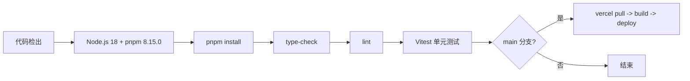

# CI/CD 自动化部署

## 技术栈

- **CI 平台**：GitHub Actions
- **包管理**：pnpm 8.15.0
- **构建系统**：Turborepo（增量构建 + 缓存）
- **部署平台**：Vercel
- **测试框架**：Vitest 3.1.0（单元）+ Playwright（E2E）
- **测试环境**：happy-dom（替代 jsdom，解决 ESM 兼容性）

---

## 触发条件

| 事件 | 动作 |
|------|------|
| Push 到 main | 质量检查 + 生产部署 |
| Pull Request | 仅运行质量检查和测试 |

---

## 流水线步骤



---

## Vercel 部署配置

```json
{
  "buildCommand": "pnpm build",
  "installCommand": "pnpm install --frozen-lockfile",
  "framework": "nextjs",
  "git": { "deploymentEnabled": { "main": true } }
}
```

部署命令序列：
1. `vercel pull --yes` -- 拉取生产配置
2. `vercel build --prod` -- 构建 Next.js 应用
3. `vercel deploy --prebuilt` -- 部署预构建产物

---

## Monorepo 构建系统

Turbo 任务依赖：
- `build`: dependsOn(^build)
- `test`: dependsOn(^build)
- `lint`/`type-check`: dependsOn(^lint/^type-check)
- `dev`: persistent（不缓存）

工作空间：`apps/web` + `packages/ai-config` + `packages/web3-tools`

---

## 测试配置

| 层级 | 工具 | 环境 | 覆盖范围 |
|------|------|------|----------|
| 单元测试 | Vitest 3.1.0 | happy-dom | 组件、Hook、工具库 |
| E2E 测试 | Playwright | 浏览器 | 基础功能、对话、API |

**关键配置**：
- `esbuild: { jsx: 'automatic' }`
- `setupFiles: test-setup.tsx`（mock matchMedia、next/navigation、next/image）
- Vitest 固定 3.1.0 版本，避免 Linux CI 的 ERR_REQUIRE_ESM

---

## 依赖管理

- `.npmrc`: `shamefully-hoist=true`（解决 TailwindCSS 依赖提升问题）
- `pnpm install --frozen-lockfile`：确保版本一致性
- Node.js >= 18.0.0（package.json engines 约束）
